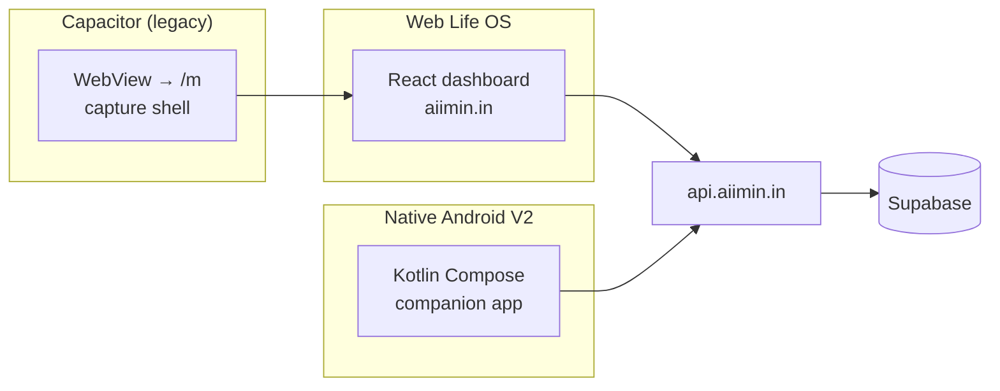

# AIIMIN

**Personal Life OS** — daily metrics, money, calendar, focus, discipline, sports, and gamification in one place.

<p align="center">
  <a href="https://aiimin.in"></a>
  <a href="https://api.aiimin.in/api/health"></a>
  
  
  
</p>

**Owner:** [Aaditya Upadhyay](https://github.com/Addy48) · B.Tech CSE, Manipal University Jaipur

---

## What this repo is

One monorepo, **three separate clients** — same user account, different apps:



| Surface | URL / package | For |
|---------|---------------|-----|
| **Desktop & iPad** | [aiimin.in/overview](https://aiimin.in/overview) | Full analytics, Lab, Finance, Placements |
| **Phone browser** | [aiimin.in/m](https://aiimin.in/m) | Quick daily capture (web) |
| **Android app** | `in.aiimin.app` | Native companion — journal, notes, habits, sync |

Do **not** mix web, Capacitor, and native changes in one commit. See [CONTRIBUTING.md](CONTRIBUTING.md).

---

## Architecture

```
┌─────────────────────────────────────────────────────────────────┐
│                         aiimin.in (Vercel)                       │
│  React 19 · Tailwind · React Query · device tiers (phone/iPad)   │
└────────────────────────────┬────────────────────────────────────┘
                             │ HTTPS
┌────────────────────────────▼────────────────────────────────────┐
│                    api.aiimin.in (EC2 + serverless)              │
│  Better Auth · daily-logs · intelligence · wealth · mobile/sync   │
└────────────────────────────┬────────────────────────────────────┘
                             │
              ┌──────────────┴──────────────┐
              ▼                             ▼
     Supabase PostgreSQL            Vercel Blob (files)
```

**Deep dive:** [docs/knowledge/02_ARCHITECTURE/Monorepo.md](docs/knowledge/02_ARCHITECTURE/Monorepo.md)

---

## Repository layout

```
AIIMIN/
├── frontend/              # Web Life OS (React)
│   ├── src/pages/         # Overview, Finance, Journal, Lab, …
│   ├── src/components/mobile/   # ⚠ Capacitor /m only — not native V2
│   └── android/           # ⚠ Capacitor Gradle project (WebView)
├── native-android/        # ⚠ Native V2 — Kotlin + Compose (separate app)
├── server/                # Express API (EC2 deploy)
├── api/                   # Vercel serverless entry
├── docs/knowledge/        # Project brain (Obsidian vault)
├── plans/                 # Commit splits, sprint plans
└── CONTRIBUTING.md        # Client boundaries + commit rules
```

---

## Tech stack

| Layer | Technology |
|-------|------------|
| Web UI | React 19, React Router, Tailwind, Recharts |
| Native UI | Jetpack Compose, Room, Retrofit, WorkManager |
| API | Node.js, Express/Hono |
| Auth | Better Auth + Google OAuth |
| Database | Supabase PostgreSQL (RLS) |
| Hosting | Vercel (web) · EC2 (API) |
| Intelligence | Correlation engine (Spearman + BH-FDR), multi-provider AI routes |

---

## Features (web)

- **Daily tracking** — sleep, gym, mood, water, journal, wins
- **Behavioral intelligence** — cross-signal correlations, weekly reports
- **The Lab** — typing, reaction, speaking, decision scenarios
- **Finance** — transactions, budgets, wealth import
- **Gamification** — XP ranks, streaks, quests, achievements
- **Calendar** — Google OAuth sync
- **Placements** — job application pipeline

Native app scope: see [docs/knowledge/17_NATIVE_APP_V2/00_INDEX.md](docs/knowledge/17_NATIVE_APP_V2/00_INDEX.md).

---

## Quick start

### Web

```bash
git clone https://github.com/Addy48/AIIMIN.git
cd AIIMIN/frontend
npm install
cp .env.example .env.local   # if present — set Supabase + API URLs
npm start                    # http://localhost:3000
```

### API (local)

```bash
cd server
npm install
# Set DATABASE_URL, BETTER_AUTH_* in .env
npm run dev
```

### Native Android

```bash
cd native-android
export JAVA_HOME="$(/usr/libexec/java_home -v 17)"   # macOS
./gradlew :app:assembleDebug
adb install -r app/build/outputs/apk/debug/app-debug.apk
```

Details: [native-android/README.md](native-android/README.md)

---

## Design system

| Token | Dark | Light |
|-------|------|-------|
| Background | `#1a1a1a` | `#f9f9f9` |
| Cards | `#2d2d2d` | `#ffffff` |
| Accent | `#ff6b35` | `#ff6b35` |
| Done | `#10b981` | `#10b981` |

Full spec: `docs/knowledge/08_DESIGN/Palette.md`

---

## Documentation

| Doc | Purpose |
|-----|---------|
| [docs/knowledge/00_HOME.md](docs/knowledge/00_HOME.md) | Agent + human entry |
| [CONTRIBUTING.md](CONTRIBUTING.md) | Commit boundaries |
| [docs/knowledge/02_ARCHITECTURE/Monorepo.md](docs/knowledge/02_ARCHITECTURE/Monorepo.md) | Three-client architecture |
| [docs/knowledge/17_NATIVE_APP_V2/WORKFLOW-PLAN.md](docs/knowledge/17_NATIVE_APP_V2/WORKFLOW-PLAN.md) | Native build tracker |

---

## Deploy

| Target | Trigger |
|--------|---------|
| Frontend | Push to `main` → Vercel |
| API | Push `server/**` → GitHub Action `deploy-api.yml` |
| Native | Manual AAB → Play Console |

---

## License

Portfolio / personal project. Source available for review; not licensed for redistribution.
