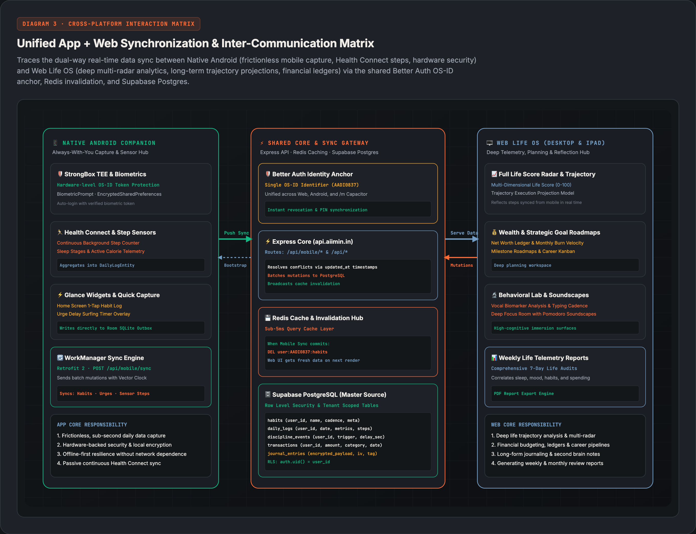
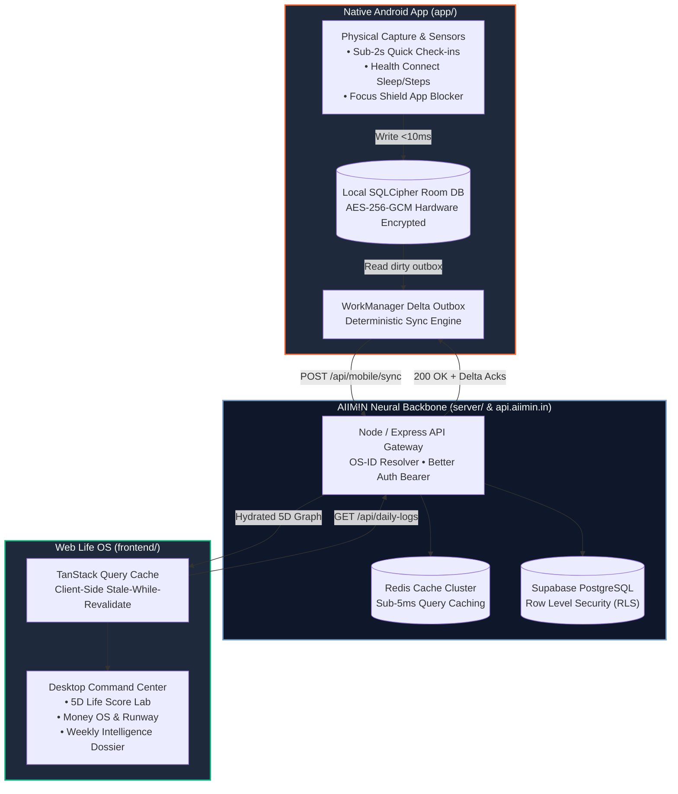
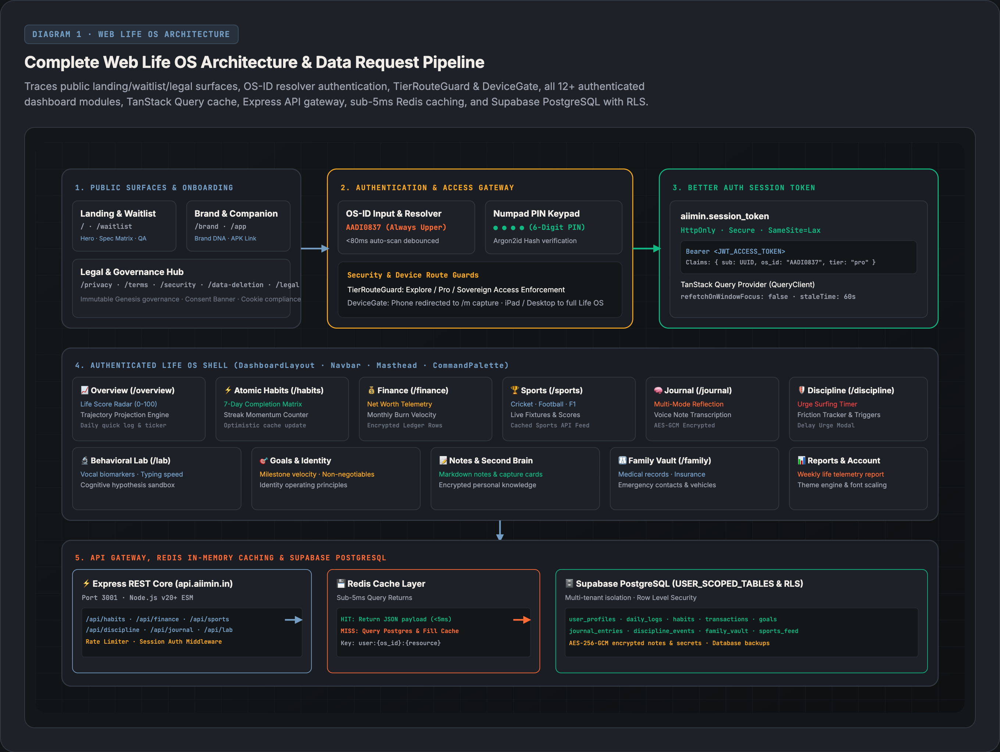
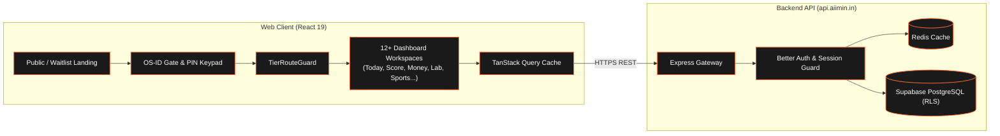
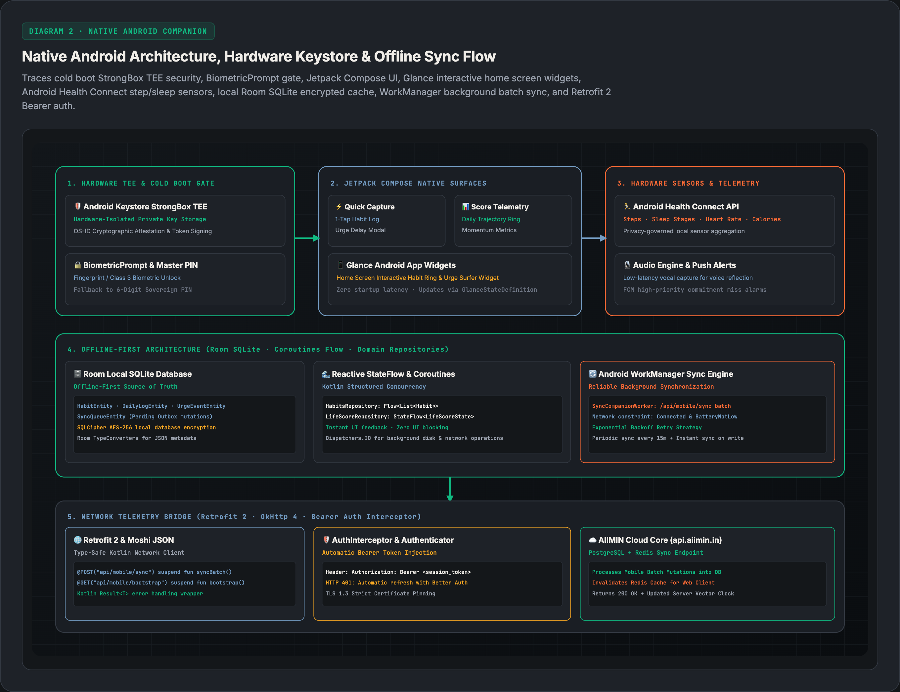
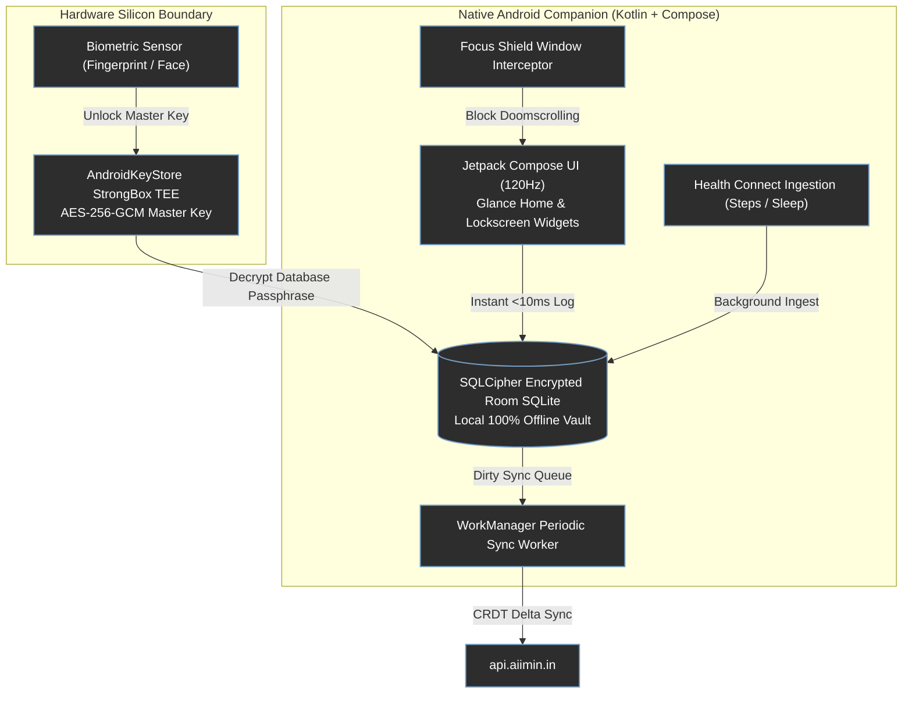

# AIIMIN

**Personal Life OS** — unified daily rhythm, 5D behavioral intelligence, money ledger, calendar, deep focus, private journal, and gamification. One authenticated account across three dedicated client surfaces.

<p align="center">
  <a href="https://aiimin.in"></a>
  <a href="https://api.aiimin.in/api/health"></a>
  
  
  
  
  
</p>

---

## System Topology: One Monorepo, Three Clients

AIIMIN is structured as a single unified monorepo hosting **three dedicated clients** with distinct operational roles, anchored by a shared Node.js API, sub-5ms Redis caching layer, and Supabase PostgreSQL with Row Level Security (RLS).

| Client Surface | Repository Path | Technology Stack | Primary Purpose |
| :--- | :--- | :--- | :--- |
| **Web Life OS** | `frontend/` | React 19 · Tailwind · TanStack Query · Recharts | **Macro Strategic Cockpit** on desktop & iPad: 12 workspaces, 5D Life Score correlation matrix, financial runway simulations, intelligence dossiers, and weekly retrospectives. |
| **Native Android Companion** | `app/` | Native Kotlin · Jetpack Compose · Room SQLCipher | **Tactical Physical Sensor**: Sub-2s lockscreen capture, 100% offline-first encrypted storage, Focus Shield app blocking (zero-VPN), and Health Connect biometric ingestion. |
| **Capacitor Mobile Shell** | `frontend/android/`<br/>`frontend/src/components/mobile/` | Capacitor 6 · React `/m` Shell | **Data Collection Gateway**: Ultra-fast mobile web fallback route (`/m`) strictly reserved for frictionless data capture. |
| **API Core & Auth** | `server/` · `api/` | Express · Better Auth · Redis · Supabase PostgreSQL | **Central Neural Backbone**: OS-ID handle resolution, multi-tier route guards, deterministic CRDT outbox reconciliation, and statistical Spearman correlation engines. |

> ⚠️ **Strict Boundary Rule:** Never mix commits across Web (`frontend/`), Capacitor (`frontend/android/`), and Native Android (`app/`). See [CONTRIBUTING.md](CONTRIBUTING.md).

---

## Interactive Architecture Visualizer

We provide a standalone, high-performance interactive system visualizer with Dark and Light mode toggles located at:

**[`docs/diagrams/interactive-system-visualizer.html`](docs/diagrams/interactive-system-visualizer.html)**

> Open this HTML file in any modern browser to explore the interactive, high-fidelity system diagrams, component breakdowns, and live data traces.

---

## Comprehensive Architecture & Workflow Diagrams

### 1. Unified Cross-Platform Interaction & Sync Matrix

Trace of the bidirectional real-time data synchronization between the Native Android physical sensor and the Desktop Web analytical hub via the unified Better Auth OS-ID anchor, Redis caching layer, and Supabase Postgres.




```mermaid
flowchart TD
  subgraph ANDROID["Native Android App (app/)"]
    direction TB
    A_SENSOR["Physical Capture & Sensors<br/>• Sub-2s Quick Check-ins<br/>• Health Connect Sleep/Steps<br/>• Focus Shield App Blocker"]
    A_DB[("Local SQLCipher Room DB<br/>AES-256-GCM Hardware Encrypted")]
    A_SYNC["WorkManager Delta Outbox<br/>Deterministic Sync Engine"]
    A_SENSOR -->|Write <10ms| A_DB
    A_DB -->|Read dirty outbox| A_SYNC
  end

  subgraph CLOUD["AIIMIN Neural Backbone (server/ & api.aiimin.in)"]
    direction TB
    API_GATE["Node / Express API Gateway<br/>OS-ID Resolver • Better Auth Bearer"]
    REDIS[("Redis Cache Cluster<br/>Sub-5ms Query Caching")]
    POSTGRES[("Supabase PostgreSQL<br/>Row Level Security (RLS)")]
    API_GATE --> REDIS
    API_GATE --> POSTGRES
  end

  subgraph WEB["Web Life OS (frontend/)"]
    direction TB
    W_STATE["TanStack Query Cache<br/>Client-Side Stale-While-Revalidate"]
    W_WORK["Desktop Command Center<br/>• 5D Life Score Lab<br/>• Money OS & Runway<br/>• Weekly Intelligence Dossier"]
    W_STATE --> W_WORK
  end

  A_SYNC -->|POST /api/mobile/sync| API_GATE
  API_GATE -->|200 OK + Delta Acks| A_SYNC
  W_STATE -->|GET /api/daily-logs| API_GATE
  API_GATE -->|Hydrated 5D Graph| W_STATE

  classDef android fill:#1e293b,stroke:#ff6b35,stroke-width:2px,color:#f8fafc;
  classDef cloud fill:#0f172a,stroke:#749dc4,stroke-width:2px,color:#f8fafc;
  classDef web fill:#1e293b,stroke:#10b981,stroke-width:2px,color:#f8fafc;
  class ANDROID android;
  class CLOUD cloud;
  class WEB web;
```

---

### 2. Web Life OS Request & Workspace Execution Flow

Trace of a browser request from the public landing / waitlist through OS-ID uppercase resolution (`AADI0837`), PIN Keypad authentication, TierRouteGuard, the 12+ dashboard workspaces, TanStack Query cache, Node/Express API core (`api.aiimin.in`), and Supabase PostgreSQL with RLS.




```mermaid
flowchart LR
  subgraph CLIENT["Web Client (React 19)"]
    L["Public / Waitlist Landing"] --> G["OS-ID Gate & PIN Keypad"]
    G --> R["TierRouteGuard"]
    R --> W["12+ Dashboard Workspaces<br/>(Today, Score, Money, Lab, Sports...)"]
    W --> Q["TanStack Query Cache"]
  end

  subgraph SERVER["Backend API (api.aiimin.in)"]
    Q -->|HTTPS REST| API["Express Gateway"]
    API --> AUTH["Better Auth & Session Guard"]
    AUTH --> CACHE[("Redis Cache")]
    AUTH --> DB[("Supabase PostgreSQL (RLS)")]
  end

  classDef box fill:#1a1a1a,stroke:#ff6b35,stroke-width:1.5px,color:#fff;
  class L,G,R,W,Q,API,AUTH,CACHE,DB box;
```

---

### 3. Native Android Companion Architecture & Local Security Enclave

Deep architecture trace of the Android Kotlin client from AndroidKeyStore StrongBox TEE cold boot security, BiometricPrompt unlock, Jetpack Compose UI (120Hz V-Sync), Glance interactive widgets, Android Health Connect sensors, encrypted local Room SQLite database, and WorkManager background batch sync.




```mermaid
flowchart TD
  subgraph HARDWARE["Hardware Silicon Boundary"]
    TEE["AndroidKeyStore StrongBox TEE<br/>AES-256-GCM Master Key"]
    BIO["Biometric Sensor (Fingerprint / Face)"]
  end

  subgraph ANDROID_APP["Native Android Companion (Kotlin + Compose)"]
    UI["Jetpack Compose UI (120Hz)<br/>Glance Home & Lockscreen Widgets"]
    INT["Focus Shield Window Interceptor"]
    HC["Health Connect Ingestion (Steps / Sleep)"]
    ROOM[("SQLCipher Encrypted Room SQLite<br/>Local 100% Offline Vault")]
    WM["WorkManager Periodic Sync Worker"]
  end

  BIO -->|Unlock Master Key| TEE
  TEE -->|Decrypt Database Passphrase| ROOM
  UI -->|Instant <10ms Log| ROOM
  INT -->|Block Doomscrolling| UI
  HC -->|Background Ingest| ROOM
  ROOM -->|Dirty Sync Queue| WM
  WM -->|CRDT Delta Sync| CLOUD_API["api.aiimin.in"]

  classDef darkBox fill:#2d2d2d,stroke:#749dc4,stroke-width:1.5px,color:#fff;
  class TEE,BIO,UI,INT,HC,ROOM,WM,CLOUD_API darkBox;
```

---

## Repository Layout

```
AIIMIN/
├── docs/
│   ├── diagrams/                              # System Architecture Visualizer & Workflow Diagrams
│   │   ├── interactive-system-visualizer.html # Interactive browser viewer (Dark / Light theme)
│   │   ├── web-life-os-workflow.svg / .png
│   │   ├── native-android-companion-workflow.svg / .png
│   │   └── unified-app-web-sync-workflow.svg / .png
│   └── knowledge/                             # Authoritative Knowledge Vault (Obsidian)
│       ├── 00_HOME.md                         # Knowledge vault entrypoint
│       ├── 02_ARCHITECTURE/                   # System design & monorepo specifications
│       │   ├── System-Workflows-And-Interactions.md
│       │   ├── Monorepo.md
│       │   └── Overview.md
│       ├── 08_DESIGN/                         # Drafting Table tokens, palettes, typography
│       └── 15_MEMORY/                         # Current context and execution history
├── frontend/                                  # Web Life OS Client (React 19 + Tailwind)
│   ├── src/pages/                             # Overview, Today, Finance, Journal, Lab, Sports, ...
│   ├── src/components/waitlist/               # Waitlist landing sections & QA Studio
│   ├── src/components/mobile/                 # ⚠ Capacitor /m capture shell only
│   └── android/                               # ⚠ Capacitor Gradle WebView wrapper
├── app/                                       # Native Android Companion — Kotlin + Jetpack Compose
│   └── src/main/java/in/aiimin/app/           # Room DB, TEE Keystore, Focus Shield, Today surface
├── server/                                    # Node.js Express API Core (api.aiimin.in)
├── api/                                       # Vercel serverless gateway
├── scripts/                                   # Automation, diagram generators, seeders, QA probes
└── CONTRIBUTING.md                            # Monorepo boundary governance & commit rules
```

---

## Tech Stack & Design Tokens

### Stack Matrix

| Subsystem | Technologies |
| :--- | :--- |
| **Web Frontend** | React 19, React Router v6, Tailwind CSS, TanStack Query, Recharts, Framer Motion, CRACO |
| **Native Android** | Kotlin 2.0, Jetpack Compose, Room (SQLCipher v4.5), Retrofit 2, Coroutines Flow, WorkManager, AndroidX Glance |
| **Backend API** | Node.js, Express, Hono, Better Auth (OS-ID Resolver), Redis Caching Layer |
| **Database & Auth** | Supabase PostgreSQL with Row Level Security (RLS), Better Auth Bearer Tokens, StrongBox TEE Hardware Keystore |
| **Infrastructure** | Vercel (Web SPA & Landing), AWS EC2 (`api.aiimin.in`), Cloudflare SSL / DNS |

### Drafting Table Design Tokens (LOCKED)

| Token Name | Dark Value | Light Value | Semantic Purpose |
| :--- | :--- | :--- | :--- |
| **Base Background** | `#1a1a1a` | `#f9f9f9` | Canvas background |
| **Card Surface** | `#2d2d2d` | `#ffffff` | Elevated component surface |
| **Drafting Steel** | `#749dc4` / `#416180` | `#416180` | Structural borders, guides, secondary accents |
| **Spark Accent** | `#ff6b35` | `#ff6b35` | Primary action buttons, active indicators |
| **Verified Green** | `#10b981` | `#10b981` | Completed habits, verified security status |
| **Muted Text** | `#9ca3af` | `#6b7280` | Tertiary labels and helper notes |

---

## Quick Start

### 1. Web Life OS

```bash
git clone https://github.com/Addy48/AIIMIN.git
cd AIIMIN/frontend
npm install
npm start # http://localhost:3000
```

### 2. Backend API (Local)

```bash
cd AIIMIN/server
npm install
# Set DATABASE_URL, BETTER_AUTH_SECRET, REDIS_URL in .env
npm run dev # http://localhost:3001
```

### 3. Native Android Companion

```bash
cd AIIMIN/app
export JAVA_HOME="$(/usr/libexec/java_home -v 17)" # macOS
./gradlew :app:assembleDebug
adb install -r app/build/outputs/apk/debug/app-debug.apk
```

---

## Documentation Index

- **System Workflows & Deep Architecture:** [`docs/knowledge/02_ARCHITECTURE/System-Workflows-And-Interactions.md`](docs/knowledge/02_ARCHITECTURE/System-Workflows-And-Interactions.md)
- **Monorepo Boundaries & Client Isolation:** [`docs/knowledge/02_ARCHITECTURE/Monorepo.md`](docs/knowledge/02_ARCHITECTURE/Monorepo.md)
- **Product Blueprint & V1 Contract:** [`docs/knowledge/Roadmap/AIIMIN-V1-Blueprint.md`](docs/knowledge/Roadmap/AIIMIN-V1-Blueprint.md)
- **Design System Spec:** [`docs/knowledge/08_DESIGN/Palette.md`](docs/knowledge/08_DESIGN/Palette.md)
- **Contributing Guidelines:** [`CONTRIBUTING.md`](CONTRIBUTING.md)

---

## License

Portfolio & personal Life OS product by Aaditya Upadhyay. Source code available for review; not licensed for external redistribution.
