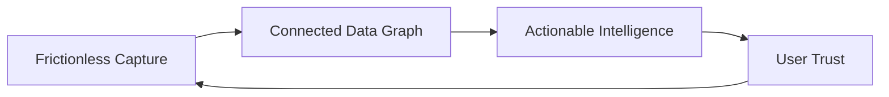

# 01 — Vision

## AIIMIN is an AI-first personal Life OS

AIIMIN exists to be the single surface where a person captures life as it happens, understands patterns over time, and acts with less friction tomorrow than today.

### The shift

| Era | Model | User burden |
|-----|-------|-------------|
| Spreadsheet era | User structures everything | High |
| App-per-domain era | User learns 12 UIs | Fragmented |
| **AIIMIN era** | User expresses intent; system structures | Minimal |

### Vision statement

**Capture once. AIIMIN remembers, connects, and coaches — without turning life into data entry.**

### What success looks like (2026–2027)

1. **Daily capture in under 60 seconds** — median interactions ≤5 per active day
2. **One universal input** — Command Palette + voice routes to the right entity
3. **Life Score as honest mirror** — composite of habits, goals, wellbeing, money — not gamification theater
4. **Insights that act** — recommendations link to calendar blocks, habit nudges, finance alerts
5. **Trust by default** — encrypted journal, explicit inference consent, export anytime

### What we are not

- Not a social network
- Not a clinical mental health device
- Not a finance-only or fitness-only app
- Not a form builder disguised as productivity

### Strategic pillars

### Related

- [[02_PHILOSOPHY]]
- [[../product-intelligence/FUTURE_AIMIN_FRAMEWORK]]
