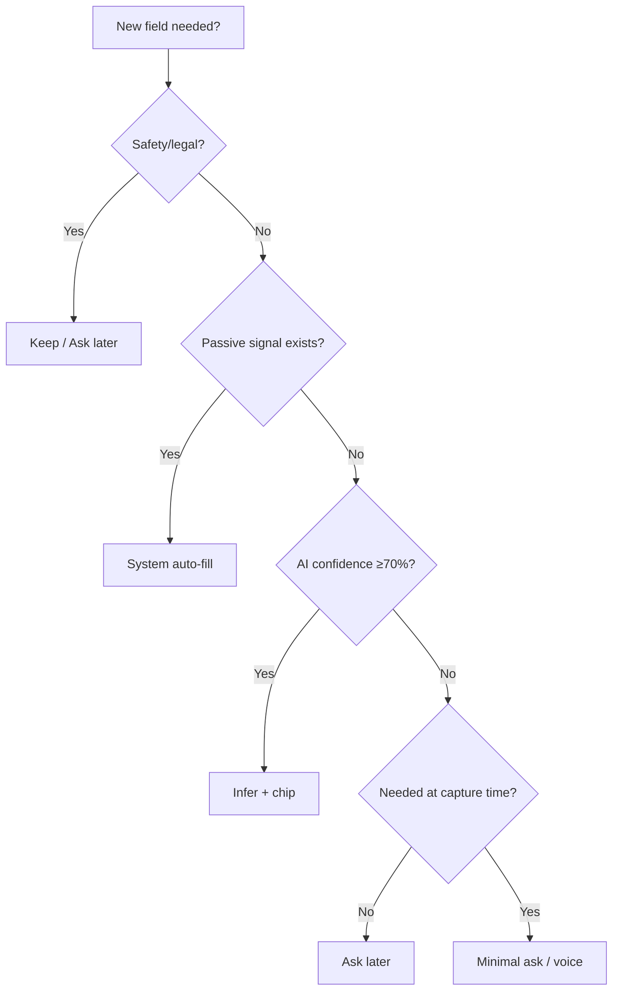

# 07 — Automation Rules

## When to infer vs ask vs never ask

### Never ask (System)

| Field / behavior | Source |
|------------------|--------|
| theme | OS `prefers-color-scheme` |
| finance date | Default today |
| pinnedNav[] | Route visit frequency |
| learning_hours | Sum Focus sessions |
| DSA count | Lab session auto-log |
| steps | Wearable passive |
| application_date | Today default |
| note title | First line derive |

### Never infer (Always ask or user-only)

| Field | Reason |
|-------|--------|
| password, PIN | Security |
| emergency meds, allergies | Safety |
| substance (addiction) | Clinical sensitivity |
| member blood_group | Medical accuracy |
| finance amount | Must be explicit utterance |
| journal body | User content — never fabricate |

### Infer silently (chip to correct)

| Field | Confidence target |
|-------|-------------------|
| finance category | 85% |
| mood | 80% |
| goals pillar | 55% → improve |
| habit category, emoji, color | 60% |
| calendar allDay | 70% |
| displayName, avatar | OAuth 85% |
| feedback category | Page context 70% |

### Ask later (progressive disclosure)

| Field | When to ask |
|-------|-------------|
| username | After first week |
| lifeArc | After 5+ journal entries |
| wakeTime | When scheduling feature used |
| member DOB, phone | Emergency wizard |
| goals why | Goal detail view, not create |
| recurrence | When pattern detected |

### Kill — do not ask

| Field | Replacement |
|-------|-------------|
| goals priority | Behavior inference |
| habits emoji, color, category | NLP + system palette |
| notes title | First line |
| journal mode | Post-capture AI tags |
| confirmPassword | Passkey/magic link |
| water, breakfast | Removed |
| onboarding wakeTime | Inferred |

## Decision tree

## Related

- [[../product-intelligence/things_aiimin_should_stop_asking]]
- [[06_AI_MODEL]]
