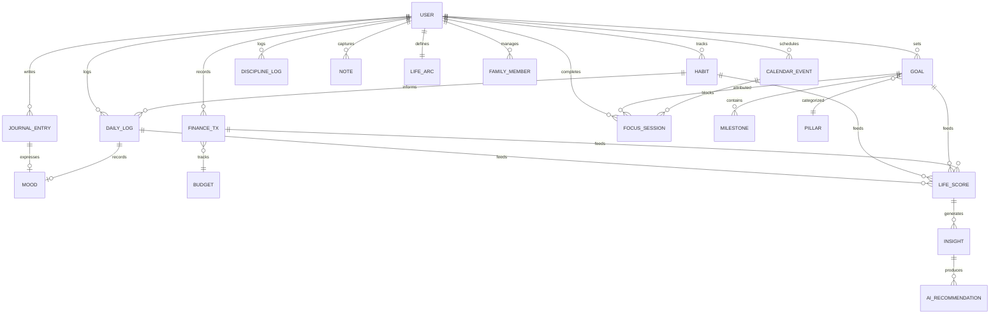

# 08 — Data Graph

## Entity Relationship Detail

### ER diagram (conceptual)



### Relationship table

| From | To | Cardinality | Edge type |
|------|-----|-------------|-----------|
| Goal | Milestone | 1:N | composition |
| Goal | Habit | N:M (pillar) | soft link |
| Goal | Focus Session | 1:N | attribution |
| Habit | Daily Log | N:1 per day | aggregate |
| Journal | Daily Log mood | 1:1 sync target | inference |
| Calendar | Focus | 1:N | temporal |
| Finance Tx | Budget | N:1 category | rollup |
| Command Palette log | Any capture entity | 1:1 | router |
| Life Arc | Goals | 1:N thematic | narrative |
| Family Member | Emergency Card | N:1 | export |

### API groups (vault pointers)

| Entity | Vault / code pointer |
|--------|---------------------|
| Daily Log | `docs/knowledge/03_DATABASE/daily_logs`, `server/routes/dailyLogs.js` |
| Goals | goals API + local cache |
| Habits | habits API |
| Journal | journal_entries encrypted |
| Finance | Supabase money tables |
| Calendar | events + Google sync |

### Derived computation

**Life Score (conceptual):**
```
life_score = w1·habit_consistency 
           + w2·milestone_progress 
           + w3·wellbeing(mood, sleep) 
           + w4·finance_stability
           + reflection_modifier(journal_frequency)
```

### Orphan edges to fix

| Edge | Issue |
|------|-------|
| Mood → 5 parents | Unify to single node |
| Placements resume → Lab ATS | Duplicate file nodes |
| Arc → 3 editors | Multiple writers |

## Full graph doc

[[../product-intelligence/INFORMATION_GRAPH]]

## Related

- [[04_INFORMATION_MODEL]]
