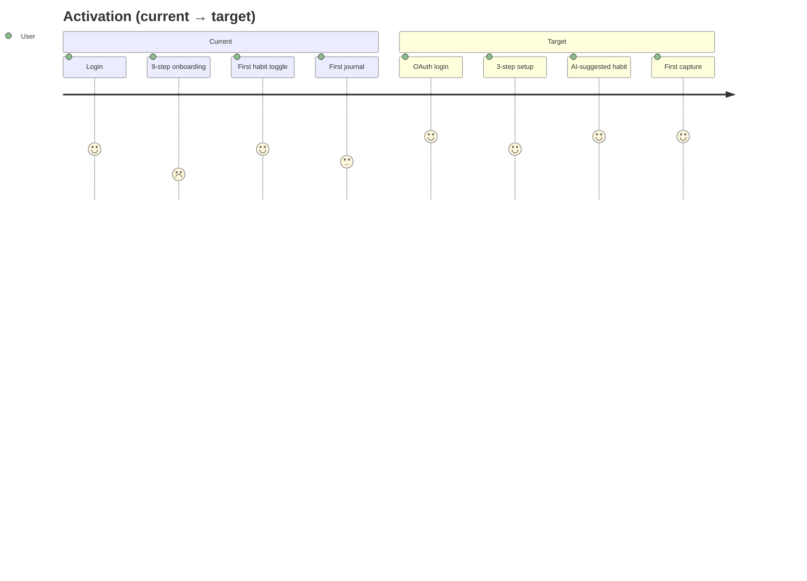

# 09 — User Journey

## Intent-based journeys

### Journey 1: New user activation

**Target TTV:** Login → first capture < 3 minutes

---

### Journey 2: Daily loop (retained user)

| Step | Current | Target |
|------|---------|--------|
| Open app | Overview widgets | Morning briefing card |
| Log wellbeing | 5-field Daily Log | 1-tap confirm passive card |
| Reflect | Journal + mood picker | Single capture bar |
| Execute | Habit toggles | Same (protect) |
| Close | — | Optional weekly digest notification |

---

### Journey 3: Money awareness

| Step | Current | Target |
|------|---------|--------|
| Spend happens | Remember to open Finance | `⌘K` voice anytime |
| Log | 6-field form | "spent X on Y" → chips |
| Review | Finance tabs + Reports | Weekly spend insight push |

---

### Journey 4: Emotional processing

| Step | Current | Target |
|------|---------|--------|
| Urge/stress | Navigate Discipline or Journal | Universal capture |
| Mode choice | CBT vs free write | AI tags post-save |
| Mood | 1-10 picker | Inferred sentiment |
| Follow-up | Manual | AI suggests replacement habit |

---

### Journey 5: Planning & direction

| Step | Current | Target |
|------|---------|--------|
| Set direction | 7-field goal modal | NL goal sentence |
| Decompose | Manual milestones | AI batch propose |
| Schedule | Calendar modal | Briefing merges blocks |
| Review | Goals + Insights separate | Life Score + narrative |

---

### Journey 6: Career tracking

| Step | Current | Target |
|------|---------|--------|
| Find job | Manual company/role | Paste URL |
| Track | Pipeline drag | Email-parse stage (future) |
| Improve resume | Lab ATS separate upload | Shared resume vault |

---

### Journey 7: Crisis preparedness

| Step | Current | Target |
|------|---------|--------|
| Setup | 65+ field vault wall | Add member minimal |
| Emergency | 20-field card edit | Wizard pre-fill |
| Use | Export | Wallet PDF one tap |

## Journey metrics

| Journey | North star event | Funnel doc |
|---------|------------------|------------|
| Activation | `onboarding_completed` | telemetry §3 |
| Daily loop | `journal_entry_saved` OR `habit_toggle_completed` | telemetry §1–4 |
| Money | `finance_entry_saved` | telemetry finance |
| Emotional | `discipline_log_saved` | — |
| Planning | `goal_created` | telemetry goals |

## Related

- [[../product-intelligence/HUMAN_INTENT_GRAPH]]
- [[12_METRICS]]
