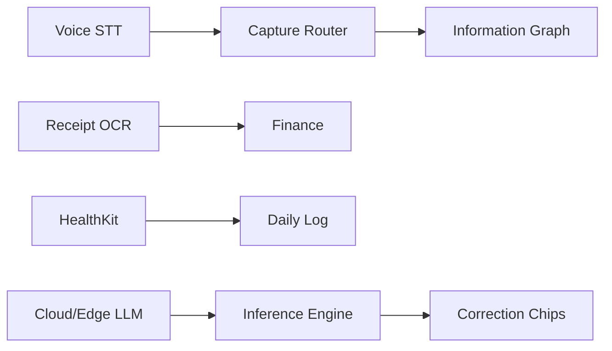

# 14 — Future Ideas

## Ambient capture & passive inference roadmap

### Near-term (0–6 months)

| Idea | Description | Signals |
|------|-------------|---------|
| **Universal capture router v2** | Single `⌘K` handles 90% of intents | NL classifier |
| **Finance voice line** | "spent 450 groceries" end-to-end | STT + merchant NLP |
| **Mood primitive sync** | One write, five read surfaces | Sentiment model |
| **Morning briefing** | AI day plan card on Overview | Calendar + habits + goals |
| **OAuth-first onboarding** | 3-step activation | Google profile prefill |
| **OS theme sync** | Zero theme pickers | `prefers-color-scheme` |
| **HealthKit sleep/steps** | Passive daily log card | iOS Health / Google Fit |

### Medium-term (6–12 months)

| Idea | Description |
|------|-------------|
| **Receipt OCR** | Photo → finance tx draft |
| **Email parse (Placements)** | Interview invite → stage update |
| **Calendar intent (Lookout-style)** | Email → event suggestion |
| **On-device mood infer** | Journal sentiment local-first |
| **Shared resume vault** | One PDF for Placements + ATS |
| **Weekly digest notification** | Life Score + insights push |
| **Biometric auth** | Replace PIN flows |

### Long-term (12+ months)

| Idea | Description |
|------|-------------|
| **Ambient lifelogging** | Activity inference from phone sensors |
| **Memory reconstruction** | "What was I doing last March?" |
| **Proactive habit nudges** | Context-aware (time, location) with strict consent |
| **Family wallet pass** | Emergency card in Apple Wallet |
| **Multi-modal capture** | Voice + photo + text single pipeline |
| **On-device LLM** | Private inference for journal/finance |

## Compression targets (recap)

| Flow | Current → Future |
|------|------------------|
| Finance tx | 8 → 2 |
| Onboarding | 45+ → 12 |
| Daily log | 7 → 1 |
| Goals create | 9 → 2 |
| Journal | 5 → 2 |

## Technology dependencies

## Related

- [[../product-intelligence/FUTURE_AIMIN_FRAMEWORK]]
- [[../product-intelligence/INTERACTION_COMPRESSION_SCORE]]
- [[01_VISION]]
