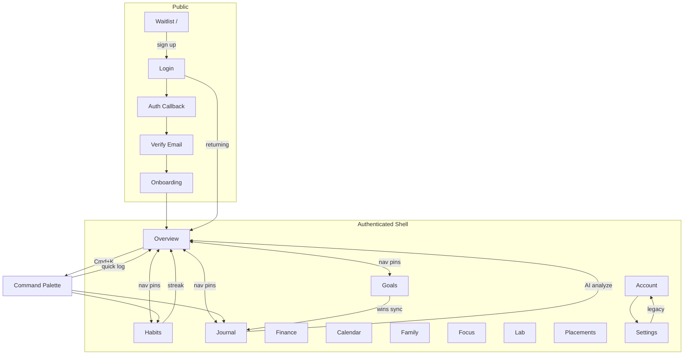
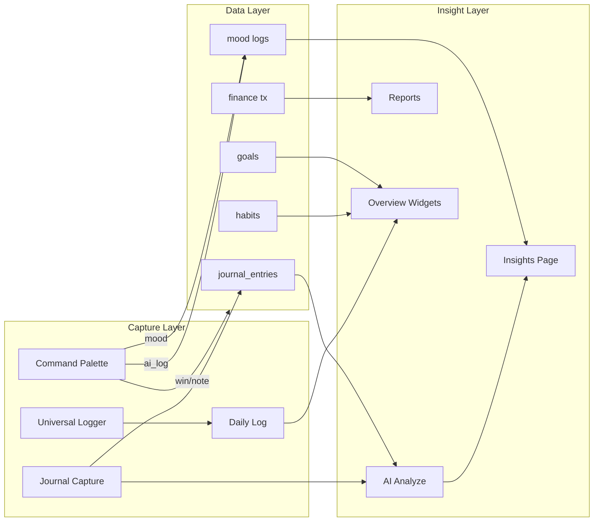

# AIIMIN — Complete Interaction Audit (Merged)

**Generated:** 2026-07-11  
**Purpose:** Single-file handoff for AI agents. Source files preserved in `docs/interaction-audit/`.

## Table of Contents

- [docs/interaction-audit/master_audit.md](#source-docs-interaction-audit-master-audit-md)
- [docs/interaction-audit/navigation.md](#source-docs-interaction-audit-navigation-md)
- [docs/interaction-audit/interaction_inventory.md](#source-docs-interaction-audit-interaction-inventory-md)
- [docs/interaction-audit/forms.md](#source-docs-interaction-audit-forms-md)
- [docs/interaction-audit/dropdowns.md](#source-docs-interaction-audit-dropdowns-md)
- [docs/interaction-audit/fields.md](#source-docs-interaction-audit-fields-md)
- [docs/interaction-audit/friction.md](#source-docs-interaction-audit-friction-md)
- [docs/interaction-audit/duplicate_patterns.md](#source-docs-interaction-audit-duplicate-patterns-md)
- [docs/interaction-audit/interaction_graph.md](#source-docs-interaction-audit-interaction-graph-md)
- [docs/interaction-telemetry.md](#source-docs-interaction-telemetry-md)


---

<a id="source-docs-interaction-audit-master-audit-md"></a>

## Source: `docs/interaction-audit/master_audit.md`

# AIIMIN Interaction Audit — Master Report

**Audit date:** 2026-07-11  
**Scope:** Full frontend (`frontend/src/`) + auth callback surfaces  
**Method:** Route map (`App.js`) → page/component traversal → pattern grep (buttons, inputs, modals, forms, shortcuts)

---

## Executive Summary

This audit reverse-engineers the **user-facing interaction model** of AIIMIN — every navigable route, control, modal, shortcut, and server-triggered flow that shapes what the user can do. Implementation details are intentionally excluded; behavior and user steps are the artifact.

**Headline findings:**

| Finding | Detail |
|---------|--------|
| **No `/m` route in code** | Product rule says mobile `/m` = capture-only; current codebase uses **responsive routes** (`/journal`, etc.) + `BottomNav` on `<768px`. No separate mobile router. |
| **Highest friction** | Onboarding (9 steps + PIN), Family Vault (65+ inputs), Finance multi-tab entry, Lab module launcher (15 modules), Placements pipeline |
| **Lowest friction** | Journal mood-only capture, habit today-toggle, command-palette quick logs |
| **Top duplicate patterns** | PIN numpad (Login + Onboarding), mood 1–10 pickers (5+ surfaces), theme swatches (Login/Settings/Account), persona/nav presets |
| **Top inference opportunities** | Mood from text/voice, finance category from merchant, goal status from milestones, wake time from calendar, journal mode from sentiment |
| **Global shortcuts** | `⌘/Ctrl+K` command palette, `Space→L` universal logger, `Esc` closes overlays, Lab vocal `Space` for mic |

**Deliverables:**

| File | Contents |
|------|----------|
| [interaction_inventory.md](./interaction_inventory.md) | Full INT-001…INT-578 schema per interaction |
| [forms.md](./forms.md) | All forms, fields, validation |
| [dropdowns.md](./dropdowns.md) | Selects, menus, audit |
| [navigation.md](./navigation.md) | Route tree + nav graph |
| [friction.md](./friction.md) | Screen heatmap + top 100 expensive interactions |
| [fields.md](./fields.md) | Master field table |
| [interaction_graph.md](./interaction_graph.md) | Relationships + component deps |
| [duplicate_patterns.md](./duplicate_patterns.md) | Repeated UX patterns |
| [../interaction-telemetry.md](../interaction-telemetry.md) | Event taxonomy + funnels |

---

## Section 1 — Global Counts

| Metric | Count | Notes |
|--------|------:|-------|
| **Routes (declared)** | 37 | `App.js` `<Route>` elements incl. redirects |
| **Distinct page components** | 59 | `pages/**/*.jsx` |
| **Frontend source files** | 515 | `.jsx/.js/.tsx/.ts` under `frontend/src` |
| **Files with `onClick`** | 186 | |
| **`onClick` handler refs** | 692 | Includes non-button elements |
| **`<button>` tags** | 587 | |
| **`<input>` tags** | 180 | |
| **`<textarea>` tags** | 44 | |
| **Modal/dialog/sheet files** | 35 | Dialog, Modal, Drawer, ConfirmDialog, etc. |
| **Form submit surfaces** | 23 | `<form>` or `onSubmit` |
| **Dropdown/select surfaces** | 53 | Select, dropdown-menu, custom pickers |
| **Documented interactions (INT-*)** | **578** | Unique user-action entries in inventory |
| **Keyboard shortcuts (global/product)** | 8 | See navigation.md |
| **Navigation paths (nav registry)** | 12 | `NAV_REGISTRY` primary routes |
| **Upload interactions** | 12 | Resume, family docs, avatar, file-upload kokonutui |
| **AI interaction surfaces** | 24 | Command palette AI log, journal analyze, lab vocal, insights, ATS, etc. |
| **Confirm dialogs** | 18 | Delete account, habit delete, event delete, etc. |

---

## Section 6 — Interaction Density by Feature

| Feature | INT IDs | Avg Friction | Primary surfaces |
|---------|--------:|-------------:|------------------|
| Auth & Waitlist | INT-001–048 | 6.2 | Login, Onboarding, Waitlist |
| Global Shell | INT-049–098 | 3.1 | Navbar, BottomNav, CommandPalette |
| Overview / Today | INT-099–158 | 4.0 | Overview widgets, DailyLog, Logger |
| Journal | INT-159–208 | 3.8 | Capture, modes, sidebar |
| Habits | INT-209–248 | 3.2 | Toggle, create modal, matrix |
| Goals | INT-249–278 | 4.5 | Goal modal, milestones |
| Finance | INT-279–328 | 5.8 | Tabs, EntryForm, budgets |
| Calendar | INT-329–358 | 4.2 | Views, EventModal |
| Family | INT-359–408 | 6.5 | Members, docs, emergency |
| Focus / Pomodoro | INT-409–428 | 3.5 | Timer, reflection |
| Lab | INT-429–398* | 5.0 | 15 modules |
| Placements / Career | INT-399–428 | 5.5 | Pipeline, ATS, intake |
| Account / Settings | INT-429–458 | 4.0 | 8 sections |
| Insights / Reports | INT-459–472 | 3.0 | Read-mostly |
| Legal / Brand | INT-473–487 | 1.5 | Links only |

*Lab INT range overlaps in inventory sub-sections — see interaction_inventory.md Lab block INT-429–478.

---

## Section 7 — Accessibility & Interruptibility Summary

| Pattern | Coverage | Gap |
|---------|----------|-----|
| `Esc` closes modals | CommandPalette, Modal, ConfirmDialog, Navbar mobile | Not universal on all Lab modules |
| Focus trap (mobile nav) | Navbar drawer | BottomNav sheet partial |
| `aria-label` on icon buttons | Navbar, BottomNav | Many Lab/custom buttons lack labels |
| Keyboard form submit | Login, Onboarding PIN | Finance inline edits mouse-only |
| Guest mode banner | DashboardLayout | Blocks save on many writes |

**Interruptibility:** Most capture flows (journal, command palette logs) are interruptible. Onboarding PIN steps and Focus timer sessions are **partially interruptible** (state lost on refresh mid-PIN).

**Auto-recovery:** Journal drafts (local suggestions), goals cache (`localStorage`), week tasks (`localStorage`), nav prefs — yes. Server-backed forms — no without explicit save.

---

## Section 8 — AI Touchpoint Matrix

| Surface | User action | AI role today | Automation potential |
|---------|-------------|---------------|-------------------|
| Command Palette → Smart AI Log | Free text/voice | Classify → win/note/mood/task/journal | **Full** |
| Journal capture | Text + mood | Post-save analyze, auto-tag mode | **Partial** (infer mood/mode) |
| Journal structured modes | CBT/WWW/etc. | Theme/distortion tags | **Partial** |
| Overview Universal Logger | Space→L chord | AI categorize daily log | **Partial** |
| Lab Vocal Mastery | 60s recording | Review/feedback | **Full** |
| Placements ATS | Resume + JD upload | Match score | **Full** |
| Insights page | Filter + view | Generated copy | **Partial** |
| Monday Insight widget | Read | AI summary | **No** (read-only) |

---

## Cross-References

- **Friction heatmap:** [friction.md §2](./friction.md)
- **Top 100 expensive:** [friction.md §3](./friction.md)
- **Duplicate patterns:** [duplicate_patterns.md](./duplicate_patterns.md)
- **Telemetry & funnels:** [interaction-telemetry.md](../interaction-telemetry.md)
- **Field inference:** [fields.md §5](./fields.md)

---

## Audit Limitations

1. **Kokonutui / Design Lab prototypes** in Account → Design are **internal design tools**, not shipped user flows — included but flagged as `design-internal`.
2. **TierRouteGuard** blocks navigation to gated routes — interaction exists as redirect/toast, not feature UI.
3. **Dynamic lists** (habit rows, goal cards, calendar events) documented as **pattern + instance multiplier** where identical.
4. **Server-only flows** (OAuth redirect, email verify link) documented at callback page only.


---

<a id="source-docs-interaction-audit-navigation-md"></a>

## Source: `docs/interaction-audit/navigation.md`

# AIIMIN — Navigation Map

**Source:** `frontend/src/App.js`, `constants/navItems.js`, `DashboardLayout.jsx`, `BottomNav.jsx`

---

## 1. Route Tree

```
/  [waitlist mode + no access] → WaitlistLanding
/  [else] → redirect → /overview | /login

/login/*          Login (Google OAuth, email signup, PIN)
/auth/callback    AuthCallback (OAuth return)
/verify-email     VerifyEmail (session required)
/onboarding       Onboarding (session; blocked in waitlist-no-access)

── DashboardLayout shell (session + email verified) ──
/overview         Overview (Today)
/insights         Insights [TierRouteGuard]
/calendar         CalendarPage
/sports           Sports [TierRouteGuard]
/journal          JournalPage
/finance          Finance [TierRouteGuard]
/settings         Settings
/lab              LabFullPage [TierRouteGuard] (?module= query)
/placements       Placements [TierRouteGuard]
/habits           Habits [TierRouteGuard]
/goals            Goals [TierRouteGuard]
/identity         IdentityPage
/notes            NotesPage
/discipline       Discipline [TierRouteGuard]
/focus            FocusRoom [TierRouteGuard]
/family           Family [TierRouteGuard]
/account          AccountPage (?section= query)
/reports          Reports [TierRouteGuard]
/seed-data        SeedData (dev)

── Public ──
/privacy, /terms, /data-deletion, /security, /about, /contact
/brand, /brand/system
/design-lab       → redirect /account?section=design

* → 404 redirect → / | /overview | /login
```

---

## 2. NAV_REGISTRY (Primary App Routes)

| ID | Route | Label | Guest hidden |
|----|-------|-------|--------------|
| overview | `/overview` | Today | no |
| habits | `/habits` | Habits | no |
| goals | `/goals` | Goals | no |
| journal | `/journal` | Journal | no |
| finance | `/finance` | Finance | no |
| family | `/family` | Family | no |
| calendar | `/calendar` | Calendar | no |
| placements | `/placements` | Career | no |
| sports | `/sports` | Sports | **yes** |
| discipline | `/discipline` | Discipline | **yes** |
| focus | `/focus` | Focus | no |
| lab | `/lab` | Lab | no |

**Defaults:** pinned = overview, habits, goals, journal. Max pinned = 12.

---

## 3. Account Sections (`/account?section=`)

| section param | Component |
|---------------|-----------|
| profile | ProfileSection |
| personalization | PersonalizationSection |
| design | DesignSection (internal prototypes) |
| notifications | NotificationsSection |
| privacy | PrivacySection |
| subscription | SubscriptionSection |
| data | DataSection |
| legal | LegalSection |

---

## 4. Journal Modes (`/journal?mode=`)

| param | Mode |
|-------|------|
| write (default) | Today capture |
| free | Free Write |
| cbt | CBT Record |
| www | What Went Well |
| morning | Morning Pages |
| weekly | Weekly Review |

---

## 5. Lab Modules (`/lab?module=`)

| module key | Label |
|------------|-------|
| decision | Decision Matrix |
| dopamine | Dopamine Detox |
| addiction | Addiction Tracker |
| personality | Personality AI |
| reading | Reading Log |
| typing | Typing Speed |
| aptitude | Aptitude Tests |
| quant | Quantitative Maths |
| speaking | Vocal Mastery |
| star | STAR Method |
| resume | Resume ATS Matcher |
| techsim | Tech Simulator |
| flashcards | Domain Flashcards |
| sysdesign | System Design |

---

## 6. Navigation Graph (User Journeys)



---

## 7. Global Navigation Surfaces

| Surface | Trigger | Targets |
|---------|---------|---------|
| Navbar masthead links | Click | Pinned routes |
| Navbar More dropdown | Click | Overflow routes |
| Navbar avatar | Click | `/account` |
| BottomNav tabs (mobile) | Click | First 4 pinned |
| BottomNav More sheet | Click | Remaining routes |
| Command Palette | `⌘/Ctrl+K` | 15 nav actions + quick logs |
| Brand lockup | Click | `/overview` |
| Guest banner Sign Up | Click | `/login` |
| ProductTour steps | Click/highlight | Feature routes |
| TierRouteGuard | Navigate blocked route | Upgrade modal / redirect |

---

## 8. Keyboard Shortcuts

| Shortcut | Scope | Action |
|----------|-------|--------|
| `⌘/Ctrl+K` | Global (authenticated) | Toggle Command Palette |
| `Esc` | Open palette/modal | Close |
| `↑` `↓` `Enter` | Command Palette | Navigate/select actions |
| `Space` (voice mode) | Command Palette AI/voice | Toggle mic |
| `Space` → `L` (700ms) | Global (not typing) | Open Universal Logger |
| `Esc` | Navbar mobile drawer | Close + focus toggle |
| `Tab` / `Shift+Tab` | Mobile drawer | Focus trap |
| `0-9`, `Backspace` | Onboarding/Login PIN | PIN entry |
| `Enter` | Inline palette inputs | Save log |
| `N` (Notes page) | Notes | New note |

---

## 9. Mobile vs Desktop

| Aspect | Desktop | Mobile (<768px) |
|--------|---------|-----------------|
| Primary nav | Navbar horizontal | BottomNav + hamburger |
| Journal sidebar | Persistent | Drawer (`sidebarOpen`) |
| Account sections | Side nav | Stacked / section param |
| Command palette | Centered overlay | Full-width overlay |
| **Dedicated `/m`** | **Not implemented** | Same routes |

---

## 10. Redirect & Guard Interactions

| Condition | Behavior |
|-----------|----------|
| No session on protected route | → `/login` |
| Waitlist mode, no access | `/` waitlist; pending screen elsewhere |
| Email unverified | EmailVerifiedGuard blocks shell |
| Guest user | Banner; many saves blocked |
| Tier insufficient | TierRouteGuard on insights, finance, lab, etc. |
| 404 | → home or overview or login |


---

<a id="source-docs-interaction-audit-interaction-inventory-md"></a>

## Source: `docs/interaction-audit/interaction_inventory.md`

# AIIMIN — Interaction Inventory

**Total documented interactions:** 578

Full schema per interaction. Grouped by feature range.

---


## Auth & Waitlist

### INT-001

| Attribute | Value |
|-----------|-------|
| **Feature** | Auth & Waitlist |
| **Location** | Login /login |
| **Trigger** | Click/Navigation |
| **Purpose** | Google OAuth button |
| **User Goal** | Create account or sign in without password |
| **Flow** | Get into app fast |
| **Interaction Count** | Land Login → Click Continue with Google → OAuth → Callback |
| **User Input Required** | 1 click + OAuth |
| **Input Type** | Google account choice |
| **Could be inferred?** | OAuth redirect |
| **Friction (1-10)** | NO |
| **Decision Fatigue (1-10)** | 3 |
| **Memory Load (1-10)** | 2 |
| **Context Switching** | 2 |
| **Interruptible** | NO |
| **Postponable** | YES |
| **Auto-recoverable** | YES |
| **AI Potential** | NO |
| **Improvements** | No |
| **Related Components** | One-click passkeys |

### INT-002

| Attribute | Value |
|-----------|-------|
| **Feature** | Auth & Waitlist |
| **Location** | Login /login |
| **Trigger** | Click/Navigation |
| **Purpose** | Email signup toggle |
| **User Goal** | Switch to email registration |
| **Flow** | Register without Google |
| **Interaction Count** | Login → Click Sign up with email → fill form |
| **User Input Required** | 3 clicks + typing |
| **Input Type** | email, password, confirm |
| **Could be inferred?** | Free text + boolean |
| **Friction (1-10)** | NO |
| **Decision Fatigue (1-10)** | 5 |
| **Memory Load (1-10)** | 4 |
| **Context Switching** | 3 |
| **Interruptible** | NO |
| **Postponable** | YES |
| **Auto-recoverable** | YES |
| **AI Potential** | NO |
| **Improvements** | Partial |
| **Related Components** | Social-only default |

### INT-003

| Attribute | Value |
|-----------|-------|
| **Feature** | Auth & Waitlist |
| **Location** | Login /login |
| **Trigger** | Click/Navigation |
| **Purpose** | PIN create (4 digit) |
| **User Goal** | Secondary auth layer |
| **Flow** | Secure account quickly |
| **Interaction Count** | Signup → Enter 4 digits → Confirm 4 digits |
| **User Input Required** | 8 taps |
| **Input Type** | PIN x2 |
| **Could be inferred?** | Numpad |
| **Friction (1-10)** | NO |
| **Decision Fatigue (1-10)** | 6 |
| **Memory Load (1-10)** | 5 |
| **Context Switching** | 4 |
| **Interruptible** | NO |
| **Postponable** | NO |
| **Auto-recoverable** | NO |
| **AI Potential** | NO |
| **Improvements** | No |
| **Related Components** | Biometric |

### INT-004

| Attribute | Value |
|-----------|-------|
| **Feature** | Auth & Waitlist |
| **Location** | Login /login |
| **Trigger** | Click/Navigation |
| **Purpose** | Email signin submit |
| **User Goal** | Returning user login |
| **Flow** | Access existing data |
| **Interaction Count** | Toggle signin → email+password → Submit |
| **User Input Required** | 2 fields + 1 click |
| **Input Type** | email, password |
| **Could be inferred?** | Free text |
| **Friction (1-10)** | Partial (email history) |
| **Decision Fatigue (1-10)** | 4 |
| **Memory Load (1-10)** | 3 |
| **Context Switching** | 3 |
| **Interruptible** | NO |
| **Postponable** | YES |
| **Auto-recoverable** | YES |
| **AI Potential** | NO |
| **Improvements** | No |
| **Related Components** | Passkey |

### INT-005

| Attribute | Value |
|-----------|-------|
| **Feature** | Auth & Waitlist |
| **Location** | AuthCallback /auth/callback |
| **Trigger** | Click/Navigation |
| **Purpose** | OAuth redirect wait |
| **User Goal** | Complete OAuth |
| **Flow** | Finish Google login |
| **Interaction Count** | Auto redirect processing |
| **User Input Required** | 0 user actions |
| **Input Type** | — |
| **Could be inferred?** | — |
| **Friction (1-10)** | YES (OAuth token) |
| **Decision Fatigue (1-10)** | 2 |
| **Memory Load (1-10)** | 1 |
| **Context Switching** | 1 |
| **Interruptible** | NO |
| **Postponable** | NO |
| **Auto-recoverable** | NO |
| **AI Potential** | NO |
| **Improvements** | No |
| **Related Components** | Silent refresh |

### INT-006

| Attribute | Value |
|-----------|-------|
| **Feature** | Auth & Waitlist |
| **Location** | VerifyEmail /verify-email |
| **Trigger** | Click/Navigation |
| **Purpose** | Resend verification |
| **User Goal** | Get verification email |
| **Flow** | Unlock app |
| **Interaction Count** | Click resend → check email |
| **User Input Required** | 1 click |
| **Input Type** | — |
| **Could be inferred?** | — |
| **Friction (1-10)** | NO |
| **Decision Fatigue (1-10)** | 4 |
| **Memory Load (1-10)** | 2 |
| **Context Switching** | 3 |
| **Interruptible** | YES |
| **Postponable** | YES |
| **Auto-recoverable** | YES |
| **AI Potential** | NO |
| **Improvements** | Partial |
| **Related Components** | Auto-verify domain |

### INT-007

| Attribute | Value |
|-----------|-------|
| **Feature** | Auth & Waitlist |
| **Location** | VerifyEmail /verify-email |
| **Trigger** | Click/Navigation |
| **Purpose** | Check inbox CTA |
| **User Goal** | Guide user to email client |
| **Flow** | Verify email |
| **Interaction Count** | Read instructions → open email |
| **User Input Required** | 1 click |
| **Input Type** | — |
| **Could be inferred?** | — |
| **Friction (1-10)** | NO |
| **Decision Fatigue (1-10)** | 3 |
| **Memory Load (1-10)** | 1 |
| **Context Switching** | 2 |
| **Interruptible** | YES |
| **Postponable** | YES |
| **Auto-recoverable** | YES |
| **AI Potential** | NO |
| **Improvements** | No |
| **Related Components** | Deep link verify |

### INT-008

| Attribute | Value |
|-----------|-------|
| **Feature** | Auth & Waitlist |
| **Location** | Onboarding /onboarding step 0 |
| **Trigger** | Click/Navigation |
| **Purpose** | Full name Continue |
| **User Goal** | Collect display name |
| **Flow** | Personalize dashboard |
| **Interaction Count** | Enter name → Continue |
| **User Input Required** | 1 field + 1 click |
| **Input Type** | fullName |
| **Could be inferred?** | Free text |
| **Friction (1-10)** | Partial (Google profile) |
| **Decision Fatigue (1-10)** | 3 |
| **Memory Load (1-10)** | 2 |
| **Context Switching** | 2 |
| **Interruptible** | NO |
| **Postponable** | YES |
| **Auto-recoverable** | YES |
| **AI Potential** | NO |
| **Improvements** | Partial |
| **Related Components** | Prefill OAuth name |

### INT-009

| Attribute | Value |
|-----------|-------|
| **Feature** | Auth & Waitlist |
| **Location** | Onboarding /onboarding step 1 |
| **Trigger** | Click/Navigation |
| **Purpose** | Username + availability |
| **User Goal** | Unique handle |
| **Flow** | Identity in product |
| **Interaction Count** | Type username → wait check → Continue |
| **User Input Required** | 1 field + 1 click |
| **Input Type** | username |
| **Could be inferred?** | Free text |
| **Friction (1-10)** | Partial (email prefix) |
| **Decision Fatigue (1-10)** | 5 |
| **Memory Load (1-10)** | 4 |
| **Context Switching** | 3 |
| **Interruptible** | NO |
| **Postponable** | YES |
| **Auto-recoverable** | YES |
| **AI Potential** | NO |
| **Improvements** | Partial |
| **Related Components** | Suggest available names |

### INT-010

| Attribute | Value |
|-----------|-------|
| **Feature** | Auth & Waitlist |
| **Location** | Onboarding /onboarding step 2-3 |
| **Trigger** | Click/Navigation |
| **Purpose** | 6-digit PIN setup |
| **User Goal** | App lock PIN |
| **Flow** | Quick re-auth |
| **Interaction Count** | Enter PIN → confirm PIN |
| **User Input Required** | 12 taps |
| **Input Type** | pin, confirmPin |
| **Could be inferred?** | Numpad |
| **Friction (1-10)** | NO |
| **Decision Fatigue (1-10)** | 7 |
| **Memory Load (1-10)** | 6 |
| **Context Switching** | 5 |
| **Interruptible** | NO |
| **Postponable** | NO |
| **Auto-recoverable** | NO |
| **AI Potential** | NO |
| **Improvements** | No |
| **Related Components** | Biometric opt-in |

### INT-011

| Attribute | Value |
|-----------|-------|
| **Feature** | Auth & Waitlist |
| **Location** | Onboarding /onboarding step 4 |
| **Trigger** | Click/Navigation |
| **Purpose** | Goal chip multi-select |
| **User Goal** | Seed goals |
| **Flow** | Start with relevant goals |
| **Interaction Count** | Tap ≥1 goal chips → Continue |
| **User Input Required** | 1-N clicks + 1 |
| **Input Type** | selectedGoals[] |
| **Could be inferred?** | Multiple choice |
| **Friction (1-10)** | Partial (persona) |
| **Decision Fatigue (1-10)** | 5 |
| **Memory Load (1-10)** | 6 |
| **Context Switching** | 4 |
| **Interruptible** | NO |
| **Postponable** | YES |
| **Auto-recoverable** | YES |
| **AI Potential** | NO |
| **Improvements** | Partial |
| **Related Components** | Infer from onboarding persona |

### INT-012

| Attribute | Value |
|-----------|-------|
| **Feature** | Auth & Waitlist |
| **Location** | Onboarding /onboarding step 5 |
| **Trigger** | Click/Navigation |
| **Purpose** | Habit chip multi-select |
| **User Goal** | Seed habits |
| **Flow** | Start tracking immediately |
| **Interaction Count** | Tap ≥1 habit chips → Continue |
| **User Input Required** | 1-N clicks + 1 |
| **Input Type** | selectedHabits[] |
| **Could be inferred?** | Multiple choice |
| **Friction (1-10)** | Partial (goals) |
| **Decision Fatigue (1-10)** | 5 |
| **Memory Load (1-10)** | 6 |
| **Context Switching** | 4 |
| **Interruptible** | NO |
| **Postponable** | YES |
| **Auto-recoverable** | YES |
| **AI Potential** | NO |
| **Improvements** | Partial |
| **Related Components** | Suggest from goals |

### INT-013

| Attribute | Value |
|-----------|-------|
| **Feature** | Auth & Waitlist |
| **Location** | Onboarding /onboarding step 6 |
| **Trigger** | Click/Navigation |
| **Purpose** | Wake time picker |
| **User Goal** | Morning routine anchor |
| **Flow** | Align notifications/reminders |
| **Interaction Count** | Pick time → Continue |
| **User Input Required** | 1 select + 1 click |
| **Input Type** | wakeTime |
| **Could be inferred?** | Time |
| **Friction (1-10)** | YES (calendar, sleep logs) |
| **Decision Fatigue (1-10)** | 4 |
| **Memory Load (1-10)** | 3 |
| **Context Switching** | 3 |
| **Interruptible** | NO |
| **Postponable** | YES |
| **Auto-recoverable** | YES |
| **AI Potential** | NO |
| **Improvements** | Partial |
| **Related Components** | Infer from first app open |

### INT-014

| Attribute | Value |
|-----------|-------|
| **Feature** | Auth & Waitlist |
| **Location** | Onboarding /onboarding step 7 |
| **Trigger** | Click/Navigation |
| **Purpose** | Life Arc editor |
| **User Goal** | North star statement |
| **Flow** | Define purpose |
| **Interaction Count** | Type arc → Save → Continue |
| **User Input Required** | Typing + 2 clicks |
| **Input Type** | lifeArc text |
| **Could be inferred?** | Free text |
| **Friction (1-10)** | Partial (goals/habits) |
| **Decision Fatigue (1-10)** | 6 |
| **Memory Load (1-10)** | 5 |
| **Context Switching** | 5 |
| **Interruptible** | NO |
| **Postponable** | YES |
| **Auto-recoverable** | YES |
| **AI Potential** | Partial (draft) |
| **Improvements** | Partial |
| **Related Components** | Generate from selections |

### INT-015

| Attribute | Value |
|-----------|-------|
| **Feature** | Auth & Waitlist |
| **Location** | Onboarding /onboarding step 8 |
| **Trigger** | Click/Navigation |
| **Purpose** | Finish / Go to dashboard |
| **User Goal** | Complete onboarding |
| **Flow** | Start using product |
| **Interaction Count** | Click Get Started |
| **User Input Required** | 1 click |
| **Input Type** | — |
| **Could be inferred?** | — |
| **Friction (1-10)** | NO |
| **Decision Fatigue (1-10)** | 1 |
| **Memory Load (1-10)** | 1 |
| **Context Switching** | 1 |
| **Interruptible** | NO |
| **Postponable** | NO |
| **Auto-recoverable** | NO |
| **AI Potential** | NO |
| **Improvements** | No |
| **Related Components** | Auto-redirect |

### INT-016

| Attribute | Value |
|-----------|-------|
| **Feature** | Auth & Waitlist |
| **Location** | Waitlist / |
| **Trigger** | Click/Navigation |
| **Purpose** | Waitlist email submit |
| **User Goal** | Join waitlist |
| **Flow** | Get early access |
| **Interaction Count** | Enter email → Submit |
| **User Input Required** | 1-2 fields + 1 click |
| **Input Type** | email, name? |
| **Could be inferred?** | Free text |
| **Friction (1-10)** | Partial (browser autofill) |
| **Decision Fatigue (1-10)** | 3 |
| **Memory Load (1-10)** | 2 |
| **Context Switching** | 2 |
| **Interruptible** | NO |
| **Postponable** | YES |
| **Auto-recoverable** | YES |
| **AI Potential** | NO |
| **Improvements** | No |
| **Related Components** | Google one-tap |

### INT-017

| Attribute | Value |
|-----------|-------|
| **Feature** | Auth & Waitlist |
| **Location** | Waitlist / |
| **Trigger** | Click/Navigation |
| **Purpose** | Pricing tier select |
| **User Goal** | Express interest tier |
| **Flow** | Signal willingness to pay |
| **Interaction Count** | Click Pro/Ultra cards |
| **User Input Required** | 1 click |
| **Input Type** | selectedPricing |
| **Could be inferred?** | Multiple choice |
| **Friction (1-10)** | NO |
| **Decision Fatigue (1-10)** | 3 |
| **Memory Load (1-10)** | 4 |
| **Context Switching** | 2 |
| **Interruptible** | NO |
| **Postponable** | YES |
| **Auto-recoverable** | YES |
| **AI Potential** | NO |
| **Improvements** | No |
| **Related Components** | Default recommendation |

### INT-018

| Attribute | Value |
|-----------|-------|
| **Feature** | Auth & Waitlist |
| **Location** | Waitlist / |
| **Trigger** | Click/Navigation |
| **Purpose** | FAQ accordion expand |
| **User Goal** | Learn product |
| **Flow** | Decide to join |
| **Interaction Count** | Click question rows |
| **User Input Required** | 1 click each |
| **Input Type** | — |
| **Could be inferred?** | — |
| **Friction (1-10)** | NO |
| **Decision Fatigue (1-10)** | 1 |
| **Memory Load (1-10)** | 1 |
| **Context Switching** | 1 |
| **Interruptible** | NO |
| **Postponable** | YES |
| **Auto-recoverable** | YES |
| **AI Potential** | NO |
| **Improvements** | No |
| **Related Components** | — |

### INT-019

| Attribute | Value |
|-----------|-------|
| **Feature** | Auth & Waitlist |
| **Location** | Waitlist / |
| **Trigger** | Click/Navigation |
| **Purpose** | Theme toggle |
| **User Goal** | Preview light/dark |
| **Flow** | Visual preference |
| **Interaction Count** | Click theme control |
| **User Input Required** | 1 click |
| **Input Type** | theme |
| **Could be inferred?** | Boolean |
| **Friction (1-10)** | YES (system pref) |
| **Decision Fatigue (1-10)** | 1 |
| **Memory Load (1-10)** | 1 |
| **Context Switching** | 1 |
| **Interruptible** | NO |
| **Postponable** | YES |
| **Auto-recoverable** | YES |
| **AI Potential** | YES |
| **Improvements** | Partial |
| **Related Components** | Respect OS |

### INT-020

| Attribute | Value |
|-----------|-------|
| **Feature** | Auth & Waitlist |
| **Location** | FeedbackWidget global |
| **Trigger** | Click/Navigation |
| **Purpose** | Open feedback FAB |
| **User Goal** | Send product feedback |
| **Flow** | Report issue/idea |
| **Interaction Count** | Click FAB → modal |
| **User Input Required** | 1 click |
| **Input Type** | — |
| **Could be inferred?** | — |
| **Friction (1-10)** | NO |
| **Decision Fatigue (1-10)** | 2 |
| **Memory Load (1-10)** | 1 |
| **Context Switching** | 1 |
| **Interruptible** | YES |
| **Postponable** | YES |
| **Auto-recoverable** | YES |
| **AI Potential** | NO |
| **Improvements** | Partial |
| **Related Components** | Context auto-attach |

### INT-021

| Attribute | Value |
|-----------|-------|
| **Feature** | Auth & Waitlist |
| **Location** | FeedbackWidget global |
| **Trigger** | Click/Navigation |
| **Purpose** | Submit feedback |
| **User Goal** | Deliver feedback |
| **Flow** | Be heard |
| **Interaction Count** | Category + message → Send |
| **User Input Required** | 2 fields + 1 click |
| **Input Type** | message, category |
| **Could be inferred?** | Free text + dropdown |
| **Friction (1-10)** | Partial (page context) |
| **Decision Fatigue (1-10)** | 4 |
| **Memory Load (1-10)** | 3 |
| **Context Switching** | 2 |
| **Interruptible** | YES |
| **Postponable** | YES |
| **Auto-recoverable** | YES |
| **AI Potential** | NO |
| **Improvements** | Partial |
| **Related Components** | Pre-fill route |

### INT-022

| Attribute | Value |
|-----------|-------|
| **Feature** | Auth & Waitlist |
| **Location** | Legal /privacy /terms etc |
| **Trigger** | Click/Navigation |
| **Purpose** | Read legal doc |
| **User Goal** | Understand policies |
| **Flow** | Trust/compliance |
| **Interaction Count** | Scroll + read links |
| **User Input Required** | Scroll |
| **Input Type** | — |
| **Could be inferred?** | — |
| **Friction (1-10)** | NO |
| **Decision Fatigue (1-10)** | 1 |
| **Memory Load (1-10)** | 1 |
| **Context Switching** | 1 |
| **Interruptible** | YES |
| **Postponable** | YES |
| **Auto-recoverable** | YES |
| **AI Potential** | NO |
| **Improvements** | No |
| **Related Components** | — |

### INT-023

| Attribute | Value |
|-----------|-------|
| **Feature** | Auth & Waitlist |
| **Location** | Legal /contact |
| **Trigger** | Click/Navigation |
| **Purpose** | Contact mailto/link |
| **User Goal** | Reach support |
| **Flow** | Get help |
| **Interaction Count** | Click email/link |
| **User Input Required** | 1 click |
| **Input Type** | — |
| **Could be inferred?** | — |
| **Friction (1-10)** | NO |
| **Decision Fatigue (1-10)** | 1 |
| **Memory Load (1-10)** | 1 |
| **Context Switching** | 1 |
| **Interruptible** | YES |
| **Postponable** | YES |
| **Auto-recoverable** | YES |
| **AI Potential** | NO |
| **Improvements** | No |
| **Related Components** | In-app form |

### INT-024

| Attribute | Value |
|-----------|-------|
| **Feature** | Auth & Waitlist |
| **Location** | Brand /brand |
| **Trigger** | Click/Navigation |
| **Purpose** | View brand assets |
| **User Goal** | Marketing reference |
| **Flow** | Understand brand |
| **Interaction Count** | Scroll gallery |
| **User Input Required** | Scroll |
| **Input Type** | — |
| **Could be inferred?** | — |
| **Friction (1-10)** | NO |
| **Decision Fatigue (1-10)** | 1 |
| **Memory Load (1-10)** | 1 |
| **Context Switching** | 1 |
| **Interruptible** | YES |
| **Postponable** | YES |
| **Auto-recoverable** | YES |
| **AI Potential** | NO |
| **Improvements** | No |
| **Related Components** | — |

### INT-025

| Attribute | Value |
|-----------|-------|
| **Feature** | Auth & Waitlist |
| **Location** | Brand /brand |
| **Trigger** | Click/Navigation |
| **Purpose** | View brand assets |
| **User Goal** | Marketing reference |
| **Flow** | Understand brand |
| **Interaction Count** | Scroll gallery |
| **User Input Required** | Scroll |
| **Input Type** | — |
| **Could be inferred?** | — |
| **Friction (1-10)** | NO |
| **Decision Fatigue (1-10)** | 1 |
| **Memory Load (1-10)** | 1 |
| **Context Switching** | 1 |
| **Interruptible** | YES |
| **Postponable** | YES |
| **Auto-recoverable** | YES |
| **AI Potential** | NO |
| **Improvements** | No |
| **Related Components** | — |

### INT-026

| Attribute | Value |
|-----------|-------|
| **Feature** | Auth & Waitlist |
| **Location** | Brand /brand |
| **Trigger** | Click/Navigation |
| **Purpose** | View brand assets |
| **User Goal** | Marketing reference |
| **Flow** | Understand brand |
| **Interaction Count** | Scroll gallery |
| **User Input Required** | Scroll |
| **Input Type** | — |
| **Could be inferred?** | — |
| **Friction (1-10)** | NO |
| **Decision Fatigue (1-10)** | 1 |
| **Memory Load (1-10)** | 1 |
| **Context Switching** | 1 |
| **Interruptible** | YES |
| **Postponable** | YES |
| **Auto-recoverable** | YES |
| **AI Potential** | NO |
| **Improvements** | No |
| **Related Components** | — |

### INT-027

| Attribute | Value |
|-----------|-------|
| **Feature** | Auth & Waitlist |
| **Location** | Brand /brand |
| **Trigger** | Click/Navigation |
| **Purpose** | View brand assets |
| **User Goal** | Marketing reference |
| **Flow** | Understand brand |
| **Interaction Count** | Scroll gallery |
| **User Input Required** | Scroll |
| **Input Type** | — |
| **Could be inferred?** | — |
| **Friction (1-10)** | NO |
| **Decision Fatigue (1-10)** | 1 |
| **Memory Load (1-10)** | 1 |
| **Context Switching** | 1 |
| **Interruptible** | YES |
| **Postponable** | YES |
| **Auto-recoverable** | YES |
| **AI Potential** | NO |
| **Improvements** | No |
| **Related Components** | — |

### INT-028

| Attribute | Value |
|-----------|-------|
| **Feature** | Auth & Waitlist |
| **Location** | Brand /brand |
| **Trigger** | Click/Navigation |
| **Purpose** | View brand assets |
| **User Goal** | Marketing reference |
| **Flow** | Understand brand |
| **Interaction Count** | Scroll gallery |
| **User Input Required** | Scroll |
| **Input Type** | — |
| **Could be inferred?** | — |
| **Friction (1-10)** | NO |
| **Decision Fatigue (1-10)** | 1 |
| **Memory Load (1-10)** | 1 |
| **Context Switching** | 1 |
| **Interruptible** | YES |
| **Postponable** | YES |
| **Auto-recoverable** | YES |
| **AI Potential** | NO |
| **Improvements** | No |
| **Related Components** | — |

### INT-029

| Attribute | Value |
|-----------|-------|
| **Feature** | Auth & Waitlist |
| **Location** | Brand /brand |
| **Trigger** | Click/Navigation |
| **Purpose** | View brand assets |
| **User Goal** | Marketing reference |
| **Flow** | Understand brand |
| **Interaction Count** | Scroll gallery |
| **User Input Required** | Scroll |
| **Input Type** | — |
| **Could be inferred?** | — |
| **Friction (1-10)** | NO |
| **Decision Fatigue (1-10)** | 1 |
| **Memory Load (1-10)** | 1 |
| **Context Switching** | 1 |
| **Interruptible** | YES |
| **Postponable** | YES |
| **Auto-recoverable** | YES |
| **AI Potential** | NO |
| **Improvements** | No |
| **Related Components** | — |

### INT-030

| Attribute | Value |
|-----------|-------|
| **Feature** | Auth & Waitlist |
| **Location** | Brand /brand |
| **Trigger** | Click/Navigation |
| **Purpose** | View brand assets |
| **User Goal** | Marketing reference |
| **Flow** | Understand brand |
| **Interaction Count** | Scroll gallery |
| **User Input Required** | Scroll |
| **Input Type** | — |
| **Could be inferred?** | — |
| **Friction (1-10)** | NO |
| **Decision Fatigue (1-10)** | 1 |
| **Memory Load (1-10)** | 1 |
| **Context Switching** | 1 |
| **Interruptible** | YES |
| **Postponable** | YES |
| **Auto-recoverable** | YES |
| **AI Potential** | NO |
| **Improvements** | No |
| **Related Components** | — |

### INT-031

| Attribute | Value |
|-----------|-------|
| **Feature** | Auth & Waitlist |
| **Location** | Brand /brand |
| **Trigger** | Click/Navigation |
| **Purpose** | View brand assets |
| **User Goal** | Marketing reference |
| **Flow** | Understand brand |
| **Interaction Count** | Scroll gallery |
| **User Input Required** | Scroll |
| **Input Type** | — |
| **Could be inferred?** | — |
| **Friction (1-10)** | NO |
| **Decision Fatigue (1-10)** | 1 |
| **Memory Load (1-10)** | 1 |
| **Context Switching** | 1 |
| **Interruptible** | YES |
| **Postponable** | YES |
| **Auto-recoverable** | YES |
| **AI Potential** | NO |
| **Improvements** | No |
| **Related Components** | — |

### INT-032

| Attribute | Value |
|-----------|-------|
| **Feature** | Auth & Waitlist |
| **Location** | Brand /brand |
| **Trigger** | Click/Navigation |
| **Purpose** | View brand assets |
| **User Goal** | Marketing reference |
| **Flow** | Understand brand |
| **Interaction Count** | Scroll gallery |
| **User Input Required** | Scroll |
| **Input Type** | — |
| **Could be inferred?** | — |
| **Friction (1-10)** | NO |
| **Decision Fatigue (1-10)** | 1 |
| **Memory Load (1-10)** | 1 |
| **Context Switching** | 1 |
| **Interruptible** | YES |
| **Postponable** | YES |
| **Auto-recoverable** | YES |
| **AI Potential** | NO |
| **Improvements** | No |
| **Related Components** | — |

### INT-033

| Attribute | Value |
|-----------|-------|
| **Feature** | Auth & Waitlist |
| **Location** | Brand /brand |
| **Trigger** | Click/Navigation |
| **Purpose** | View brand assets |
| **User Goal** | Marketing reference |
| **Flow** | Understand brand |
| **Interaction Count** | Scroll gallery |
| **User Input Required** | Scroll |
| **Input Type** | — |
| **Could be inferred?** | — |
| **Friction (1-10)** | NO |
| **Decision Fatigue (1-10)** | 1 |
| **Memory Load (1-10)** | 1 |
| **Context Switching** | 1 |
| **Interruptible** | YES |
| **Postponable** | YES |
| **Auto-recoverable** | YES |
| **AI Potential** | NO |
| **Improvements** | No |
| **Related Components** | — |

### INT-034

| Attribute | Value |
|-----------|-------|
| **Feature** | Auth & Waitlist |
| **Location** | Brand /brand |
| **Trigger** | Click/Navigation |
| **Purpose** | View brand assets |
| **User Goal** | Marketing reference |
| **Flow** | Understand brand |
| **Interaction Count** | Scroll gallery |
| **User Input Required** | Scroll |
| **Input Type** | — |
| **Could be inferred?** | — |
| **Friction (1-10)** | NO |
| **Decision Fatigue (1-10)** | 1 |
| **Memory Load (1-10)** | 1 |
| **Context Switching** | 1 |
| **Interruptible** | YES |
| **Postponable** | YES |
| **Auto-recoverable** | YES |
| **AI Potential** | NO |
| **Improvements** | No |
| **Related Components** | — |

### INT-035

| Attribute | Value |
|-----------|-------|
| **Feature** | Auth & Waitlist |
| **Location** | Brand /brand |
| **Trigger** | Click/Navigation |
| **Purpose** | View brand assets |
| **User Goal** | Marketing reference |
| **Flow** | Understand brand |
| **Interaction Count** | Scroll gallery |
| **User Input Required** | Scroll |
| **Input Type** | — |
| **Could be inferred?** | — |
| **Friction (1-10)** | NO |
| **Decision Fatigue (1-10)** | 1 |
| **Memory Load (1-10)** | 1 |
| **Context Switching** | 1 |
| **Interruptible** | YES |
| **Postponable** | YES |
| **Auto-recoverable** | YES |
| **AI Potential** | NO |
| **Improvements** | No |
| **Related Components** | — |

### INT-036

| Attribute | Value |
|-----------|-------|
| **Feature** | Auth & Waitlist |
| **Location** | Brand /brand |
| **Trigger** | Click/Navigation |
| **Purpose** | View brand assets |
| **User Goal** | Marketing reference |
| **Flow** | Understand brand |
| **Interaction Count** | Scroll gallery |
| **User Input Required** | Scroll |
| **Input Type** | — |
| **Could be inferred?** | — |
| **Friction (1-10)** | NO |
| **Decision Fatigue (1-10)** | 1 |
| **Memory Load (1-10)** | 1 |
| **Context Switching** | 1 |
| **Interruptible** | YES |
| **Postponable** | YES |
| **Auto-recoverable** | YES |
| **AI Potential** | NO |
| **Improvements** | No |
| **Related Components** | — |

### INT-037

| Attribute | Value |
|-----------|-------|
| **Feature** | Auth & Waitlist |
| **Location** | Brand /brand |
| **Trigger** | Click/Navigation |
| **Purpose** | View brand assets |
| **User Goal** | Marketing reference |
| **Flow** | Understand brand |
| **Interaction Count** | Scroll gallery |
| **User Input Required** | Scroll |
| **Input Type** | — |
| **Could be inferred?** | — |
| **Friction (1-10)** | NO |
| **Decision Fatigue (1-10)** | 1 |
| **Memory Load (1-10)** | 1 |
| **Context Switching** | 1 |
| **Interruptible** | YES |
| **Postponable** | YES |
| **Auto-recoverable** | YES |
| **AI Potential** | NO |
| **Improvements** | No |
| **Related Components** | — |

### INT-038

| Attribute | Value |
|-----------|-------|
| **Feature** | Auth & Waitlist |
| **Location** | Brand /brand |
| **Trigger** | Click/Navigation |
| **Purpose** | View brand assets |
| **User Goal** | Marketing reference |
| **Flow** | Understand brand |
| **Interaction Count** | Scroll gallery |
| **User Input Required** | Scroll |
| **Input Type** | — |
| **Could be inferred?** | — |
| **Friction (1-10)** | NO |
| **Decision Fatigue (1-10)** | 1 |
| **Memory Load (1-10)** | 1 |
| **Context Switching** | 1 |
| **Interruptible** | YES |
| **Postponable** | YES |
| **Auto-recoverable** | YES |
| **AI Potential** | NO |
| **Improvements** | No |
| **Related Components** | — |

### INT-039

| Attribute | Value |
|-----------|-------|
| **Feature** | Auth & Waitlist |
| **Location** | Brand /brand |
| **Trigger** | Click/Navigation |
| **Purpose** | View brand assets |
| **User Goal** | Marketing reference |
| **Flow** | Understand brand |
| **Interaction Count** | Scroll gallery |
| **User Input Required** | Scroll |
| **Input Type** | — |
| **Could be inferred?** | — |
| **Friction (1-10)** | NO |
| **Decision Fatigue (1-10)** | 1 |
| **Memory Load (1-10)** | 1 |
| **Context Switching** | 1 |
| **Interruptible** | YES |
| **Postponable** | YES |
| **Auto-recoverable** | YES |
| **AI Potential** | NO |
| **Improvements** | No |
| **Related Components** | — |

### INT-040

| Attribute | Value |
|-----------|-------|
| **Feature** | Auth & Waitlist |
| **Location** | Brand /brand |
| **Trigger** | Click/Navigation |
| **Purpose** | View brand assets |
| **User Goal** | Marketing reference |
| **Flow** | Understand brand |
| **Interaction Count** | Scroll gallery |
| **User Input Required** | Scroll |
| **Input Type** | — |
| **Could be inferred?** | — |
| **Friction (1-10)** | NO |
| **Decision Fatigue (1-10)** | 1 |
| **Memory Load (1-10)** | 1 |
| **Context Switching** | 1 |
| **Interruptible** | YES |
| **Postponable** | YES |
| **Auto-recoverable** | YES |
| **AI Potential** | NO |
| **Improvements** | No |
| **Related Components** | — |

### INT-041

| Attribute | Value |
|-----------|-------|
| **Feature** | Auth & Waitlist |
| **Location** | Brand /brand |
| **Trigger** | Click/Navigation |
| **Purpose** | View brand assets |
| **User Goal** | Marketing reference |
| **Flow** | Understand brand |
| **Interaction Count** | Scroll gallery |
| **User Input Required** | Scroll |
| **Input Type** | — |
| **Could be inferred?** | — |
| **Friction (1-10)** | NO |
| **Decision Fatigue (1-10)** | 1 |
| **Memory Load (1-10)** | 1 |
| **Context Switching** | 1 |
| **Interruptible** | YES |
| **Postponable** | YES |
| **Auto-recoverable** | YES |
| **AI Potential** | NO |
| **Improvements** | No |
| **Related Components** | — |

### INT-042

| Attribute | Value |
|-----------|-------|
| **Feature** | Auth & Waitlist |
| **Location** | Brand /brand |
| **Trigger** | Click/Navigation |
| **Purpose** | View brand assets |
| **User Goal** | Marketing reference |
| **Flow** | Understand brand |
| **Interaction Count** | Scroll gallery |
| **User Input Required** | Scroll |
| **Input Type** | — |
| **Could be inferred?** | — |
| **Friction (1-10)** | NO |
| **Decision Fatigue (1-10)** | 1 |
| **Memory Load (1-10)** | 1 |
| **Context Switching** | 1 |
| **Interruptible** | YES |
| **Postponable** | YES |
| **Auto-recoverable** | YES |
| **AI Potential** | NO |
| **Improvements** | No |
| **Related Components** | — |

### INT-043

| Attribute | Value |
|-----------|-------|
| **Feature** | Auth & Waitlist |
| **Location** | Brand /brand |
| **Trigger** | Click/Navigation |
| **Purpose** | View brand assets |
| **User Goal** | Marketing reference |
| **Flow** | Understand brand |
| **Interaction Count** | Scroll gallery |
| **User Input Required** | Scroll |
| **Input Type** | — |
| **Could be inferred?** | — |
| **Friction (1-10)** | NO |
| **Decision Fatigue (1-10)** | 1 |
| **Memory Load (1-10)** | 1 |
| **Context Switching** | 1 |
| **Interruptible** | YES |
| **Postponable** | YES |
| **Auto-recoverable** | YES |
| **AI Potential** | NO |
| **Improvements** | No |
| **Related Components** | — |

### INT-044

| Attribute | Value |
|-----------|-------|
| **Feature** | Auth & Waitlist |
| **Location** | Brand /brand |
| **Trigger** | Click/Navigation |
| **Purpose** | View brand assets |
| **User Goal** | Marketing reference |
| **Flow** | Understand brand |
| **Interaction Count** | Scroll gallery |
| **User Input Required** | Scroll |
| **Input Type** | — |
| **Could be inferred?** | — |
| **Friction (1-10)** | NO |
| **Decision Fatigue (1-10)** | 1 |
| **Memory Load (1-10)** | 1 |
| **Context Switching** | 1 |
| **Interruptible** | YES |
| **Postponable** | YES |
| **Auto-recoverable** | YES |
| **AI Potential** | NO |
| **Improvements** | No |
| **Related Components** | — |

### INT-045

| Attribute | Value |
|-----------|-------|
| **Feature** | Auth & Waitlist |
| **Location** | Brand /brand |
| **Trigger** | Click/Navigation |
| **Purpose** | View brand assets |
| **User Goal** | Marketing reference |
| **Flow** | Understand brand |
| **Interaction Count** | Scroll gallery |
| **User Input Required** | Scroll |
| **Input Type** | — |
| **Could be inferred?** | — |
| **Friction (1-10)** | NO |
| **Decision Fatigue (1-10)** | 1 |
| **Memory Load (1-10)** | 1 |
| **Context Switching** | 1 |
| **Interruptible** | YES |
| **Postponable** | YES |
| **Auto-recoverable** | YES |
| **AI Potential** | NO |
| **Improvements** | No |
| **Related Components** | — |

### INT-046

| Attribute | Value |
|-----------|-------|
| **Feature** | Auth & Waitlist |
| **Location** | Brand /brand |
| **Trigger** | Click/Navigation |
| **Purpose** | View brand assets |
| **User Goal** | Marketing reference |
| **Flow** | Understand brand |
| **Interaction Count** | Scroll gallery |
| **User Input Required** | Scroll |
| **Input Type** | — |
| **Could be inferred?** | — |
| **Friction (1-10)** | NO |
| **Decision Fatigue (1-10)** | 1 |
| **Memory Load (1-10)** | 1 |
| **Context Switching** | 1 |
| **Interruptible** | YES |
| **Postponable** | YES |
| **Auto-recoverable** | YES |
| **AI Potential** | NO |
| **Improvements** | No |
| **Related Components** | — |

### INT-047

| Attribute | Value |
|-----------|-------|
| **Feature** | Auth & Waitlist |
| **Location** | Brand /brand |
| **Trigger** | Click/Navigation |
| **Purpose** | View brand assets |
| **User Goal** | Marketing reference |
| **Flow** | Understand brand |
| **Interaction Count** | Scroll gallery |
| **User Input Required** | Scroll |
| **Input Type** | — |
| **Could be inferred?** | — |
| **Friction (1-10)** | NO |
| **Decision Fatigue (1-10)** | 1 |
| **Memory Load (1-10)** | 1 |
| **Context Switching** | 1 |
| **Interruptible** | YES |
| **Postponable** | YES |
| **Auto-recoverable** | YES |
| **AI Potential** | NO |
| **Improvements** | No |
| **Related Components** | — |

### INT-048

| Attribute | Value |
|-----------|-------|
| **Feature** | Auth & Waitlist |
| **Location** | Brand /brand |
| **Trigger** | Click/Navigation |
| **Purpose** | View brand assets |
| **User Goal** | Marketing reference |
| **Flow** | Understand brand |
| **Interaction Count** | Scroll gallery |
| **User Input Required** | Scroll |
| **Input Type** | — |
| **Could be inferred?** | — |
| **Friction (1-10)** | NO |
| **Decision Fatigue (1-10)** | 1 |
| **Memory Load (1-10)** | 1 |
| **Context Switching** | 1 |
| **Interruptible** | YES |
| **Postponable** | YES |
| **Auto-recoverable** | YES |
| **AI Potential** | NO |
| **Improvements** | No |
| **Related Components** | — |


## Global Shell

### INT-049

| Attribute | Value |
|-----------|-------|
| **Feature** | Global Shell |
| **Location** | Navbar |
| **Trigger** | Click/Shortcut/Navigation |
| **Purpose** | Pinned route link click |
| **User Goal** | Primary navigation |
| **Flow** | Go to feature |
| **Interaction Count** | Click nav item → route change |
| **User Input Required** | 1 click |
| **Input Type** | — |
| **Could be inferred?** | Navigation |
| **Friction (1-10)** | NO |
| **Decision Fatigue (1-10)** | 1 |
| **Memory Load (1-10)** | 1 |
| **Context Switching** | 1 |
| **Interruptible** | YES |
| **Postponable** | YES |
| **Auto-recoverable** | YES |
| **AI Potential** | NO |
| **Improvements** | No |
| **Related Components** | Navbar.jsx |

### INT-050

| Attribute | Value |
|-----------|-------|
| **Feature** | Global Shell |
| **Location** | Navbar |
| **Trigger** | Click/Shortcut/Navigation |
| **Purpose** | More dropdown open |
| **User Goal** | Overflow nav |
| **Flow** | Reach gated routes |
| **Interaction Count** | Click More → select route |
| **User Input Required** | 2 clicks |
| **Input Type** | route |
| **Could be inferred?** | Dropdown |
| **Friction (1-10)** | NO |
| **Decision Fatigue (1-10)** | 2 |
| **Memory Load (1-10)** | 2 |
| **Context Switching** | 2 |
| **Interruptible** | YES |
| **Postponable** | YES |
| **Auto-recoverable** | YES |
| **AI Potential** | NO |
| **Improvements** | No |
| **Related Components** | Navbar |

### INT-051

| Attribute | Value |
|-----------|-------|
| **Feature** | Global Shell |
| **Location** | Navbar |
| **Trigger** | Click/Shortcut/Navigation |
| **Purpose** | Avatar → Account |
| **User Goal** | Account access |
| **Flow** | Manage profile |
| **Interaction Count** | Click avatar |
| **User Input Required** | 1 click |
| **Input Type** | — |
| **Could be inferred?** | Navigation |
| **Friction (1-10)** | NO |
| **Decision Fatigue (1-10)** | 1 |
| **Memory Load (1-10)** | 1 |
| **Context Switching** | 1 |
| **Interruptible** | YES |
| **Postponable** | YES |
| **Auto-recoverable** | YES |
| **AI Potential** | NO |
| **Improvements** | No |
| **Related Components** | Navbar |

### INT-052

| Attribute | Value |
|-----------|-------|
| **Feature** | Global Shell |
| **Location** | Navbar mobile |
| **Trigger** | Click/Shortcut/Navigation |
| **Purpose** | Hamburger open drawer |
| **User Goal** | Mobile nav |
| **Flow** | Navigate on phone |
| **Interaction Count** | Tap menu → tap link |
| **User Input Required** | 2 taps |
| **Input Type** | route |
| **Could be inferred?** | Drawer |
| **Friction (1-10)** | NO |
| **Decision Fatigue (1-10)** | 2 |
| **Memory Load (1-10)** | 2 |
| **Context Switching** | 2 |
| **Interruptible** | YES |
| **Postponable** | YES |
| **Auto-recoverable** | YES |
| **AI Potential** | NO |
| **Improvements** | No |
| **Related Components** | Navbar drawer |

### INT-053

| Attribute | Value |
|-----------|-------|
| **Feature** | Global Shell |
| **Location** | BottomNav mobile |
| **Trigger** | Click/Shortcut/Navigation |
| **Purpose** | Tab tap (4 pinned) |
| **User Goal** | Quick mobile nav |
| **Flow** | Switch core features |
| **Interaction Count** | Tap tab icon |
| **User Input Required** | 1 tap |
| **Input Type** | route |
| **Could be inferred?** | Navigation |
| **Friction (1-10)** | NO |
| **Decision Fatigue (1-10)** | 1 |
| **Memory Load (1-10)** | 1 |
| **Context Switching** | 1 |
| **Interruptible** | YES |
| **Postponable** | YES |
| **Auto-recoverable** | YES |
| **AI Potential** | NO |
| **Improvements** | No |
| **Related Components** | BottomNav |

### INT-054

| Attribute | Value |
|-----------|-------|
| **Feature** | Global Shell |
| **Location** | BottomNav mobile |
| **Trigger** | Click/Shortcut/Navigation |
| **Purpose** | More sheet |
| **User Goal** | Secondary routes |
| **Flow** | Reach all features |
| **Interaction Count** | Tap More → pick route |
| **User Input Required** | 2 taps |
| **Input Type** | route |
| **Could be inferred?** | Sheet |
| **Friction (1-10)** | NO |
| **Decision Fatigue (1-10)** | 2 |
| **Memory Load (1-10)** | 2 |
| **Context Switching** | 2 |
| **Interruptible** | YES |
| **Postponable** | YES |
| **Auto-recoverable** | YES |
| **AI Potential** | NO |
| **Improvements** | No |
| **Related Components** | BottomNav |

### INT-055

| Attribute | Value |
|-----------|-------|
| **Feature** | Global Shell |
| **Location** | CommandPalette |
| **Trigger** | Click/Shortcut/Navigation |
| **Purpose** | ⌘/Ctrl+K open |
| **User Goal** | Universal launcher |
| **Flow** | Act without mouse |
| **Interaction Count** | Keyboard chord |
| **User Input Required** | 1 key chord |
| **Input Type** | search query |
| **Could be inferred?** | Keyboard |
| **Friction (1-10)** | NO |
| **Decision Fatigue (1-10)** | 2 |
| **Memory Load (1-10)** | 1 |
| **Context Switching** | 2 |
| **Interruptible** | NO |
| **Postponable** | YES |
| **Auto-recoverable** | YES |
| **AI Potential** | NO |
| **Improvements** | Partial |
| **Related Components** | CommandPalette |

### INT-056

| Attribute | Value |
|-----------|-------|
| **Feature** | Global Shell |
| **Location** | CommandPalette |
| **Trigger** | Click/Shortcut/Navigation |
| **Purpose** | Search filter actions |
| **User Goal** | Find action fast |
| **Flow** | Locate feature |
| **Interaction Count** | Type query → arrow → Enter |
| **User Input Required** | Typing + keys |
| **Input Type** | search |
| **Could be inferred?** | Free text |
| **Friction (1-10)** | Partial (recent) |
| **Decision Fatigue (1-10)** | 2 |
| **Memory Load (1-10)** | 2 |
| **Context Switching** | 2 |
| **Interruptible** | NO |
| **Postponable** | YES |
| **Auto-recoverable** | YES |
| **AI Potential** | NO |
| **Improvements** | Partial |
| **Related Components** | CommandPalette |

### INT-057

| Attribute | Value |
|-----------|-------|
| **Feature** | Global Shell |
| **Location** | CommandPalette |
| **Trigger** | Click/Shortcut/Navigation |
| **Purpose** | Navigate action |
| **User Goal** | Jump to route |
| **Flow** | Open feature |
| **Interaction Count** | Select nav_* action |
| **User Input Required** | 2-3 keys |
| **Input Type** | — |
| **Could be inferred?** | Navigation |
| **Friction (1-10)** | NO |
| **Decision Fatigue (1-10)** | 1 |
| **Memory Load (1-10)** | 1 |
| **Context Switching** | 1 |
| **Interruptible** | YES |
| **Postponable** | YES |
| **Auto-recoverable** | YES |
| **AI Potential** | NO |
| **Improvements** | No |
| **Related Components** | ALL_ACTIONS nav |

### INT-058

| Attribute | Value |
|-----------|-------|
| **Feature** | Global Shell |
| **Location** | CommandPalette |
| **Trigger** | Click/Shortcut/Navigation |
| **Purpose** | Smart AI Log |
| **User Goal** | NL capture |
| **Flow** | Log without forms |
| **Interaction Count** | Select ai_log → type/voice → Enter |
| **User Input Required** | Typing/voice |
| **Input Type** | free text |
| **Could be inferred?** | Free text + voice |
| **Friction (1-10)** | Partial (context) |
| **Decision Fatigue (1-10)** | 3 |
| **Memory Load (1-10)** | 2 |
| **Context Switching** | 2 |
| **Interruptible** | NO |
| **Postponable** | YES |
| **Auto-recoverable** | YES |
| **AI Potential** | NO |
| **Improvements** | Full |
| **Related Components** | CommandPalette F-015 |

### INT-059

| Attribute | Value |
|-----------|-------|
| **Feature** | Global Shell |
| **Location** | CommandPalette |
| **Trigger** | Click/Shortcut/Navigation |
| **Purpose** | Log Win inline |
| **User Goal** | Quick win |
| **Flow** | Celebrate progress |
| **Interaction Count** | Select → type → Enter |
| **User Input Required** | Typing |
| **Input Type** | win text |
| **Could be inferred?** | Free text |
| **Friction (1-10)** | Partial (journal) |
| **Decision Fatigue (1-10)** | 3 |
| **Memory Load (1-10)** | 2 |
| **Context Switching** | 2 |
| **Interruptible** | NO |
| **Postponable** | YES |
| **Auto-recoverable** | YES |
| **AI Potential** | NO |
| **Improvements** | Partial |
| **Related Components** | CommandPalette |

### INT-060

| Attribute | Value |
|-----------|-------|
| **Feature** | Global Shell |
| **Location** | CommandPalette |
| **Trigger** | Click/Shortcut/Navigation |
| **Purpose** | Log Note inline |
| **User Goal** | Quick note |
| **Flow** | Capture thought |
| **Interaction Count** | Select → type → Enter |
| **User Input Required** | Typing |
| **Input Type** | note text |
| **Could be inferred?** | Free text |
| **Friction (1-10)** | NO |
| **Decision Fatigue (1-10)** | 3 |
| **Memory Load (1-10)** | 2 |
| **Context Switching** | 2 |
| **Interruptible** | NO |
| **Postponable** | YES |
| **Auto-recoverable** | YES |
| **AI Potential** | NO |
| **Improvements** | Partial |
| **Related Components** | CommandPalette |

### INT-061

| Attribute | Value |
|-----------|-------|
| **Feature** | Global Shell |
| **Location** | CommandPalette |
| **Trigger** | Click/Shortcut/Navigation |
| **Purpose** | Voice Log |
| **User Goal** | Hands-free capture |
| **Flow** | Log while busy |
| **Interaction Count** | Select → mic → speak → save |
| **User Input Required** | Voice |
| **Input Type** | transcript |
| **Could be inferred?** | Voice |
| **Friction (1-10)** | Partial (STT) |
| **Decision Fatigue (1-10)** | 4 |
| **Memory Load (1-10)** | 2 |
| **Context Switching** | 2 |
| **Interruptible** | NO |
| **Postponable** | YES |
| **Auto-recoverable** | YES |
| **AI Potential** | NO |
| **Improvements** | Full |
| **Related Components** | CommandPalette |

### INT-062

| Attribute | Value |
|-----------|-------|
| **Feature** | Global Shell |
| **Location** | CommandPalette |
| **Trigger** | Click/Shortcut/Navigation |
| **Purpose** | Check Mood 1-10 |
| **User Goal** | Mood capture |
| **Flow** | Track feeling |
| **Interaction Count** | Select → pick mood emoji |
| **User Input Required** | 2 clicks |
| **Input Type** | mood 1-10 |
| **Could be inferred?** | Multiple choice |
| **Friction (1-10)** | YES (text/voice prior) |
| **Decision Fatigue (1-10)** | 3 |
| **Memory Load (1-10)** | 4 |
| **Context Switching** | 2 |
| **Interruptible** | NO |
| **Postponable** | YES |
| **Auto-recoverable** | YES |
| **AI Potential** | NO |
| **Improvements** | Partial |
| **Related Components** | MoodTracker, Journal |

### INT-063

| Attribute | Value |
|-----------|-------|
| **Feature** | Global Shell |
| **Location** | UniversalLogger |
| **Trigger** | Click/Shortcut/Navigation |
| **Purpose** | Space→L chord open |
| **User Goal** | Fast daily log |
| **Flow** | Log from anywhere |
| **Interaction Count** | Space then L → type → save |
| **User Input Required** | Chord + typing |
| **Input Type** | log text |
| **Could be inferred?** | Free text |
| **Friction (1-10)** | Partial (AI) |
| **Decision Fatigue (1-10)** | 3 |
| **Memory Load (1-10)** | 2 |
| **Context Switching** | 2 |
| **Interruptible** | NO |
| **Postponable** | YES |
| **Auto-recoverable** | YES |
| **AI Potential** | Partial |
| **Improvements** | Partial |
| **Related Components** | loggerShortcut.js |

### INT-064

| Attribute | Value |
|-----------|-------|
| **Feature** | Global Shell |
| **Location** | ProductTour |
| **Trigger** | Click/Shortcut/Navigation |
| **Purpose** | Tour step next |
| **User Goal** | Learn product |
| **Flow** | Understand features |
| **Interaction Count** | Click Next on spotlight |
| **User Input Required** | 1 click x steps |
| **Input Type** | — |
| **Could be inferred?** | — |
| **Friction (1-10)** | NO |
| **Decision Fatigue (1-10)** | 2 |
| **Memory Load (1-10)** | 1 |
| **Context Switching** | 2 |
| **Interruptible** | YES |
| **Postponable** | YES |
| **Auto-recoverable** | YES |
| **AI Potential** | YES |
| **Improvements** | No |
| **Related Components** | ProductTour |

### INT-065

| Attribute | Value |
|-----------|-------|
| **Feature** | Global Shell |
| **Location** | GuestTour |
| **Trigger** | Click/Shortcut/Navigation |
| **Purpose** | Guest explore CTA |
| **User Goal** | Try before signup |
| **Flow** | Evaluate product |
| **Interaction Count** | Follow tour → Sign up |
| **User Input Required** | Multiple clicks |
| **Input Type** | — |
| **Could be inferred?** | — |
| **Friction (1-10)** | NO |
| **Decision Fatigue (1-10)** | 3 |
| **Memory Load (1-10)** | 2 |
| **Context Switching** | 2 |
| **Interruptible** | YES |
| **Postponable** | YES |
| **Auto-recoverable** | YES |
| **AI Potential** | NO |
| **Improvements** | No |
| **Related Components** | GuestTour |

### INT-066

| Attribute | Value |
|-----------|-------|
| **Feature** | Global Shell |
| **Location** | Guest banner |
| **Trigger** | Click/Shortcut/Navigation |
| **Purpose** | Sign Up CTA |
| **User Goal** | Convert guest |
| **Flow** | Save data permanently |
| **Interaction Count** | Click Sign Up |
| **User Input Required** | 1 click |
| **Input Type** | — |
| **Could be inferred?** | Navigation |
| **Friction (1-10)** | NO |
| **Decision Fatigue (1-10)** | 2 |
| **Memory Load (1-10)** | 1 |
| **Context Switching** | 1 |
| **Interruptible** | YES |
| **Postponable** | YES |
| **Auto-recoverable** | YES |
| **AI Potential** | NO |
| **Improvements** | No |
| **Related Components** | DashboardLayout |

### INT-067

| Attribute | Value |
|-----------|-------|
| **Feature** | Global Shell |
| **Location** | NotificationBell |
| **Trigger** | Click/Shortcut/Navigation |
| **Purpose** | Open notifications |
| **User Goal** | See alerts |
| **Flow** | Stay informed |
| **Interaction Count** | Click bell → list |
| **User Input Required** | 1 click |
| **Input Type** | — |
| **Could be inferred?** | Dropdown |
| **Friction (1-10)** | NO |
| **Decision Fatigue (1-10)** | 2 |
| **Memory Load (1-10)** | 1 |
| **Context Switching** | 2 |
| **Interruptible** | YES |
| **Postponable** | YES |
| **Auto-recoverable** | YES |
| **AI Potential** | NO |
| **Improvements** | No |
| **Related Components** | NotificationBell |

### INT-068

| Attribute | Value |
|-----------|-------|
| **Feature** | Global Shell |
| **Location** | NotificationBell |
| **Trigger** | Click/Shortcut/Navigation |
| **Purpose** | Mark read / dismiss |
| **User Goal** | Clear inbox |
| **Flow** | Reduce noise |
| **Interaction Count** | Click item actions |
| **User Input Required** | 1-2 clicks |
| **Input Type** | — |
| **Could be inferred?** | Boolean |
| **Friction (1-10)** | NO |
| **Decision Fatigue (1-10)** | 1 |
| **Memory Load (1-10)** | 1 |
| **Context Switching** | 1 |
| **Interruptible** | YES |
| **Postponable** | YES |
| **Auto-recoverable** | YES |
| **AI Potential** | NO |
| **Improvements** | No |
| **Related Components** | NotifDropdown |

### INT-069

| Attribute | Value |
|-----------|-------|
| **Feature** | Global Shell |
| **Location** | TierRouteGuard |
| **Trigger** | Click/Shortcut/Navigation |
| **Purpose** | Blocked route attempt |
| **User Goal** | Upsell gate |
| **Flow** | Access premium feature |
| **Interaction Count** | Navigate → upgrade modal |
| **User Input Required** | 1 nav + modal |
| **Input Type** | — |
| **Could be inferred?** | — |
| **Friction (1-10)** | NO |
| **Decision Fatigue (1-10)** | 4 |
| **Memory Load (1-10)** | 3 |
| **Context Switching** | 2 |
| **Interruptible** | YES |
| **Postponable** | YES |
| **Auto-recoverable** | YES |
| **AI Potential** | NO |
| **Improvements** | No |
| **Related Components** | FeatureGate |

### INT-070

| Attribute | Value |
|-----------|-------|
| **Feature** | Global Shell |
| **Location** | InstallPrompt |
| **Trigger** | Click/Shortcut/Navigation |
| **Purpose** | Add to home screen |
| **User Goal** | PWA install |
| **Flow** | Mobile app-like access |
| **Interaction Count** | Click install |
| **User Input Required** | 1 click |
| **Input Type** | — |
| **Could be inferred?** | — |
| **Friction (1-10)** | NO |
| **Decision Fatigue (1-10)** | 2 |
| **Memory Load (1-10)** | 1 |
| **Context Switching** | 1 |
| **Interruptible** | YES |
| **Postponable** | YES |
| **Auto-recoverable** | YES |
| **AI Potential** | NO |
| **Improvements** | No |
| **Related Components** | InstallPrompt |

### INT-071

| Attribute | Value |
|-----------|-------|
| **Feature** | Global Shell |
| **Location** | GlobalMusicPlayer |
| **Trigger** | Click/Shortcut/Navigation |
| **Purpose** | Play/pause ambient |
| **User Goal** | Focus audio |
| **Flow** | Background sound |
| **Interaction Count** | Click transport |
| **User Input Required** | 1 click |
| **Input Type** | track |
| **Could be inferred?** | Boolean |
| **Friction (1-10)** | Partial (last track) |
| **Decision Fatigue (1-10)** | 1 |
| **Memory Load (1-10)** | 1 |
| **Context Switching** | 1 |
| **Interruptible** | YES |
| **Postponable** | YES |
| **Auto-recoverable** | YES |
| **AI Potential** | YES |
| **Improvements** | No |
| **Related Components** | GlobalMusicPlayer |

### INT-072

| Attribute | Value |
|-----------|-------|
| **Feature** | Global Shell |
| **Location** | XPContext |
| **Trigger** | Click/Shortcut/Navigation |
| **Purpose** | Level-up modal dismiss |
| **User Goal** | Gamification feedback |
| **Flow** | Acknowledge progress |
| **Interaction Count** | Click continue |
| **User Input Required** | 1 click |
| **Input Type** | — |
| **Could be inferred?** | — |
| **Friction (1-10)** | NO |
| **Decision Fatigue (1-10)** | 1 |
| **Memory Load (1-10)** | 1 |
| **Context Switching** | 1 |
| **Interruptible** | YES |
| **Postponable** | YES |
| **Auto-recoverable** | YES |
| **AI Potential** | NO |
| **Improvements** | No |
| **Related Components** | XPContext |

### INT-073

| Attribute | Value |
|-----------|-------|
| **Feature** | Global Shell |
| **Location** | Navbar |
| **Trigger** | Click/Shortcut/Navigation |
| **Purpose** | Pinned route link click |
| **User Goal** | Primary navigation |
| **Flow** | Go to feature |
| **Interaction Count** | Click nav item → route change |
| **User Input Required** | 1 click |
| **Input Type** | — |
| **Could be inferred?** | Navigation |
| **Friction (1-10)** | NO |
| **Decision Fatigue (1-10)** | 1 |
| **Memory Load (1-10)** | 1 |
| **Context Switching** | 1 |
| **Interruptible** | YES |
| **Postponable** | YES |
| **Auto-recoverable** | YES |
| **AI Potential** | NO |
| **Improvements** | No |
| **Related Components** | Navbar.jsx |

### INT-074

| Attribute | Value |
|-----------|-------|
| **Feature** | Global Shell |
| **Location** | Navbar |
| **Trigger** | Click/Shortcut/Navigation |
| **Purpose** | More dropdown open |
| **User Goal** | Overflow nav |
| **Flow** | Reach gated routes |
| **Interaction Count** | Click More → select route |
| **User Input Required** | 2 clicks |
| **Input Type** | route |
| **Could be inferred?** | Dropdown |
| **Friction (1-10)** | NO |
| **Decision Fatigue (1-10)** | 2 |
| **Memory Load (1-10)** | 2 |
| **Context Switching** | 2 |
| **Interruptible** | YES |
| **Postponable** | YES |
| **Auto-recoverable** | YES |
| **AI Potential** | NO |
| **Improvements** | No |
| **Related Components** | Navbar |

### INT-075

| Attribute | Value |
|-----------|-------|
| **Feature** | Global Shell |
| **Location** | Navbar |
| **Trigger** | Click/Shortcut/Navigation |
| **Purpose** | Avatar → Account |
| **User Goal** | Account access |
| **Flow** | Manage profile |
| **Interaction Count** | Click avatar |
| **User Input Required** | 1 click |
| **Input Type** | — |
| **Could be inferred?** | Navigation |
| **Friction (1-10)** | NO |
| **Decision Fatigue (1-10)** | 1 |
| **Memory Load (1-10)** | 1 |
| **Context Switching** | 1 |
| **Interruptible** | YES |
| **Postponable** | YES |
| **Auto-recoverable** | YES |
| **AI Potential** | NO |
| **Improvements** | No |
| **Related Components** | Navbar |

### INT-076

| Attribute | Value |
|-----------|-------|
| **Feature** | Global Shell |
| **Location** | Navbar mobile |
| **Trigger** | Click/Shortcut/Navigation |
| **Purpose** | Hamburger open drawer |
| **User Goal** | Mobile nav |
| **Flow** | Navigate on phone |
| **Interaction Count** | Tap menu → tap link |
| **User Input Required** | 2 taps |
| **Input Type** | route |
| **Could be inferred?** | Drawer |
| **Friction (1-10)** | NO |
| **Decision Fatigue (1-10)** | 2 |
| **Memory Load (1-10)** | 2 |
| **Context Switching** | 2 |
| **Interruptible** | YES |
| **Postponable** | YES |
| **Auto-recoverable** | YES |
| **AI Potential** | NO |
| **Improvements** | No |
| **Related Components** | Navbar drawer |

### INT-077

| Attribute | Value |
|-----------|-------|
| **Feature** | Global Shell |
| **Location** | BottomNav mobile |
| **Trigger** | Click/Shortcut/Navigation |
| **Purpose** | Tab tap (4 pinned) |
| **User Goal** | Quick mobile nav |
| **Flow** | Switch core features |
| **Interaction Count** | Tap tab icon |
| **User Input Required** | 1 tap |
| **Input Type** | route |
| **Could be inferred?** | Navigation |
| **Friction (1-10)** | NO |
| **Decision Fatigue (1-10)** | 1 |
| **Memory Load (1-10)** | 1 |
| **Context Switching** | 1 |
| **Interruptible** | YES |
| **Postponable** | YES |
| **Auto-recoverable** | YES |
| **AI Potential** | NO |
| **Improvements** | No |
| **Related Components** | BottomNav |

### INT-078

| Attribute | Value |
|-----------|-------|
| **Feature** | Global Shell |
| **Location** | BottomNav mobile |
| **Trigger** | Click/Shortcut/Navigation |
| **Purpose** | More sheet |
| **User Goal** | Secondary routes |
| **Flow** | Reach all features |
| **Interaction Count** | Tap More → pick route |
| **User Input Required** | 2 taps |
| **Input Type** | route |
| **Could be inferred?** | Sheet |
| **Friction (1-10)** | NO |
| **Decision Fatigue (1-10)** | 2 |
| **Memory Load (1-10)** | 2 |
| **Context Switching** | 2 |
| **Interruptible** | YES |
| **Postponable** | YES |
| **Auto-recoverable** | YES |
| **AI Potential** | NO |
| **Improvements** | No |
| **Related Components** | BottomNav |

### INT-079

| Attribute | Value |
|-----------|-------|
| **Feature** | Global Shell |
| **Location** | CommandPalette |
| **Trigger** | Click/Shortcut/Navigation |
| **Purpose** | ⌘/Ctrl+K open |
| **User Goal** | Universal launcher |
| **Flow** | Act without mouse |
| **Interaction Count** | Keyboard chord |
| **User Input Required** | 1 key chord |
| **Input Type** | search query |
| **Could be inferred?** | Keyboard |
| **Friction (1-10)** | NO |
| **Decision Fatigue (1-10)** | 2 |
| **Memory Load (1-10)** | 1 |
| **Context Switching** | 2 |
| **Interruptible** | NO |
| **Postponable** | YES |
| **Auto-recoverable** | YES |
| **AI Potential** | NO |
| **Improvements** | Partial |
| **Related Components** | CommandPalette |

### INT-080

| Attribute | Value |
|-----------|-------|
| **Feature** | Global Shell |
| **Location** | CommandPalette |
| **Trigger** | Click/Shortcut/Navigation |
| **Purpose** | Search filter actions |
| **User Goal** | Find action fast |
| **Flow** | Locate feature |
| **Interaction Count** | Type query → arrow → Enter |
| **User Input Required** | Typing + keys |
| **Input Type** | search |
| **Could be inferred?** | Free text |
| **Friction (1-10)** | Partial (recent) |
| **Decision Fatigue (1-10)** | 2 |
| **Memory Load (1-10)** | 2 |
| **Context Switching** | 2 |
| **Interruptible** | NO |
| **Postponable** | YES |
| **Auto-recoverable** | YES |
| **AI Potential** | NO |
| **Improvements** | Partial |
| **Related Components** | CommandPalette |

### INT-081

| Attribute | Value |
|-----------|-------|
| **Feature** | Global Shell |
| **Location** | CommandPalette |
| **Trigger** | Click/Shortcut/Navigation |
| **Purpose** | Navigate action |
| **User Goal** | Jump to route |
| **Flow** | Open feature |
| **Interaction Count** | Select nav_* action |
| **User Input Required** | 2-3 keys |
| **Input Type** | — |
| **Could be inferred?** | Navigation |
| **Friction (1-10)** | NO |
| **Decision Fatigue (1-10)** | 1 |
| **Memory Load (1-10)** | 1 |
| **Context Switching** | 1 |
| **Interruptible** | YES |
| **Postponable** | YES |
| **Auto-recoverable** | YES |
| **AI Potential** | NO |
| **Improvements** | No |
| **Related Components** | ALL_ACTIONS nav |

### INT-082

| Attribute | Value |
|-----------|-------|
| **Feature** | Global Shell |
| **Location** | CommandPalette |
| **Trigger** | Click/Shortcut/Navigation |
| **Purpose** | Smart AI Log |
| **User Goal** | NL capture |
| **Flow** | Log without forms |
| **Interaction Count** | Select ai_log → type/voice → Enter |
| **User Input Required** | Typing/voice |
| **Input Type** | free text |
| **Could be inferred?** | Free text + voice |
| **Friction (1-10)** | Partial (context) |
| **Decision Fatigue (1-10)** | 3 |
| **Memory Load (1-10)** | 2 |
| **Context Switching** | 2 |
| **Interruptible** | NO |
| **Postponable** | YES |
| **Auto-recoverable** | YES |
| **AI Potential** | NO |
| **Improvements** | Full |
| **Related Components** | CommandPalette F-015 |

### INT-083

| Attribute | Value |
|-----------|-------|
| **Feature** | Global Shell |
| **Location** | CommandPalette |
| **Trigger** | Click/Shortcut/Navigation |
| **Purpose** | Log Win inline |
| **User Goal** | Quick win |
| **Flow** | Celebrate progress |
| **Interaction Count** | Select → type → Enter |
| **User Input Required** | Typing |
| **Input Type** | win text |
| **Could be inferred?** | Free text |
| **Friction (1-10)** | Partial (journal) |
| **Decision Fatigue (1-10)** | 3 |
| **Memory Load (1-10)** | 2 |
| **Context Switching** | 2 |
| **Interruptible** | NO |
| **Postponable** | YES |
| **Auto-recoverable** | YES |
| **AI Potential** | NO |
| **Improvements** | Partial |
| **Related Components** | CommandPalette |

### INT-084

| Attribute | Value |
|-----------|-------|
| **Feature** | Global Shell |
| **Location** | CommandPalette |
| **Trigger** | Click/Shortcut/Navigation |
| **Purpose** | Log Note inline |
| **User Goal** | Quick note |
| **Flow** | Capture thought |
| **Interaction Count** | Select → type → Enter |
| **User Input Required** | Typing |
| **Input Type** | note text |
| **Could be inferred?** | Free text |
| **Friction (1-10)** | NO |
| **Decision Fatigue (1-10)** | 3 |
| **Memory Load (1-10)** | 2 |
| **Context Switching** | 2 |
| **Interruptible** | NO |
| **Postponable** | YES |
| **Auto-recoverable** | YES |
| **AI Potential** | NO |
| **Improvements** | Partial |
| **Related Components** | CommandPalette |

### INT-085

| Attribute | Value |
|-----------|-------|
| **Feature** | Global Shell |
| **Location** | CommandPalette |
| **Trigger** | Click/Shortcut/Navigation |
| **Purpose** | Voice Log |
| **User Goal** | Hands-free capture |
| **Flow** | Log while busy |
| **Interaction Count** | Select → mic → speak → save |
| **User Input Required** | Voice |
| **Input Type** | transcript |
| **Could be inferred?** | Voice |
| **Friction (1-10)** | Partial (STT) |
| **Decision Fatigue (1-10)** | 4 |
| **Memory Load (1-10)** | 2 |
| **Context Switching** | 2 |
| **Interruptible** | NO |
| **Postponable** | YES |
| **Auto-recoverable** | YES |
| **AI Potential** | NO |
| **Improvements** | Full |
| **Related Components** | CommandPalette |

### INT-086

| Attribute | Value |
|-----------|-------|
| **Feature** | Global Shell |
| **Location** | CommandPalette |
| **Trigger** | Click/Shortcut/Navigation |
| **Purpose** | Check Mood 1-10 |
| **User Goal** | Mood capture |
| **Flow** | Track feeling |
| **Interaction Count** | Select → pick mood emoji |
| **User Input Required** | 2 clicks |
| **Input Type** | mood 1-10 |
| **Could be inferred?** | Multiple choice |
| **Friction (1-10)** | YES (text/voice prior) |
| **Decision Fatigue (1-10)** | 3 |
| **Memory Load (1-10)** | 4 |
| **Context Switching** | 2 |
| **Interruptible** | NO |
| **Postponable** | YES |
| **Auto-recoverable** | YES |
| **AI Potential** | NO |
| **Improvements** | Partial |
| **Related Components** | MoodTracker, Journal |

### INT-087

| Attribute | Value |
|-----------|-------|
| **Feature** | Global Shell |
| **Location** | UniversalLogger |
| **Trigger** | Click/Shortcut/Navigation |
| **Purpose** | Space→L chord open |
| **User Goal** | Fast daily log |
| **Flow** | Log from anywhere |
| **Interaction Count** | Space then L → type → save |
| **User Input Required** | Chord + typing |
| **Input Type** | log text |
| **Could be inferred?** | Free text |
| **Friction (1-10)** | Partial (AI) |
| **Decision Fatigue (1-10)** | 3 |
| **Memory Load (1-10)** | 2 |
| **Context Switching** | 2 |
| **Interruptible** | NO |
| **Postponable** | YES |
| **Auto-recoverable** | YES |
| **AI Potential** | Partial |
| **Improvements** | Partial |
| **Related Components** | loggerShortcut.js |

### INT-088

| Attribute | Value |
|-----------|-------|
| **Feature** | Global Shell |
| **Location** | ProductTour |
| **Trigger** | Click/Shortcut/Navigation |
| **Purpose** | Tour step next |
| **User Goal** | Learn product |
| **Flow** | Understand features |
| **Interaction Count** | Click Next on spotlight |
| **User Input Required** | 1 click x steps |
| **Input Type** | — |
| **Could be inferred?** | — |
| **Friction (1-10)** | NO |
| **Decision Fatigue (1-10)** | 2 |
| **Memory Load (1-10)** | 1 |
| **Context Switching** | 2 |
| **Interruptible** | YES |
| **Postponable** | YES |
| **Auto-recoverable** | YES |
| **AI Potential** | YES |
| **Improvements** | No |
| **Related Components** | ProductTour |

### INT-089

| Attribute | Value |
|-----------|-------|
| **Feature** | Global Shell |
| **Location** | GuestTour |
| **Trigger** | Click/Shortcut/Navigation |
| **Purpose** | Guest explore CTA |
| **User Goal** | Try before signup |
| **Flow** | Evaluate product |
| **Interaction Count** | Follow tour → Sign up |
| **User Input Required** | Multiple clicks |
| **Input Type** | — |
| **Could be inferred?** | — |
| **Friction (1-10)** | NO |
| **Decision Fatigue (1-10)** | 3 |
| **Memory Load (1-10)** | 2 |
| **Context Switching** | 2 |
| **Interruptible** | YES |
| **Postponable** | YES |
| **Auto-recoverable** | YES |
| **AI Potential** | NO |
| **Improvements** | No |
| **Related Components** | GuestTour |

### INT-090

| Attribute | Value |
|-----------|-------|
| **Feature** | Global Shell |
| **Location** | Guest banner |
| **Trigger** | Click/Shortcut/Navigation |
| **Purpose** | Sign Up CTA |
| **User Goal** | Convert guest |
| **Flow** | Save data permanently |
| **Interaction Count** | Click Sign Up |
| **User Input Required** | 1 click |
| **Input Type** | — |
| **Could be inferred?** | Navigation |
| **Friction (1-10)** | NO |
| **Decision Fatigue (1-10)** | 2 |
| **Memory Load (1-10)** | 1 |
| **Context Switching** | 1 |
| **Interruptible** | YES |
| **Postponable** | YES |
| **Auto-recoverable** | YES |
| **AI Potential** | NO |
| **Improvements** | No |
| **Related Components** | DashboardLayout |

### INT-091

| Attribute | Value |
|-----------|-------|
| **Feature** | Global Shell |
| **Location** | NotificationBell |
| **Trigger** | Click/Shortcut/Navigation |
| **Purpose** | Open notifications |
| **User Goal** | See alerts |
| **Flow** | Stay informed |
| **Interaction Count** | Click bell → list |
| **User Input Required** | 1 click |
| **Input Type** | — |
| **Could be inferred?** | Dropdown |
| **Friction (1-10)** | NO |
| **Decision Fatigue (1-10)** | 2 |
| **Memory Load (1-10)** | 1 |
| **Context Switching** | 2 |
| **Interruptible** | YES |
| **Postponable** | YES |
| **Auto-recoverable** | YES |
| **AI Potential** | NO |
| **Improvements** | No |
| **Related Components** | NotificationBell |

### INT-092

| Attribute | Value |
|-----------|-------|
| **Feature** | Global Shell |
| **Location** | NotificationBell |
| **Trigger** | Click/Shortcut/Navigation |
| **Purpose** | Mark read / dismiss |
| **User Goal** | Clear inbox |
| **Flow** | Reduce noise |
| **Interaction Count** | Click item actions |
| **User Input Required** | 1-2 clicks |
| **Input Type** | — |
| **Could be inferred?** | Boolean |
| **Friction (1-10)** | NO |
| **Decision Fatigue (1-10)** | 1 |
| **Memory Load (1-10)** | 1 |
| **Context Switching** | 1 |
| **Interruptible** | YES |
| **Postponable** | YES |
| **Auto-recoverable** | YES |
| **AI Potential** | NO |
| **Improvements** | No |
| **Related Components** | NotifDropdown |

### INT-093

| Attribute | Value |
|-----------|-------|
| **Feature** | Global Shell |
| **Location** | TierRouteGuard |
| **Trigger** | Click/Shortcut/Navigation |
| **Purpose** | Blocked route attempt |
| **User Goal** | Upsell gate |
| **Flow** | Access premium feature |
| **Interaction Count** | Navigate → upgrade modal |
| **User Input Required** | 1 nav + modal |
| **Input Type** | — |
| **Could be inferred?** | — |
| **Friction (1-10)** | NO |
| **Decision Fatigue (1-10)** | 4 |
| **Memory Load (1-10)** | 3 |
| **Context Switching** | 2 |
| **Interruptible** | YES |
| **Postponable** | YES |
| **Auto-recoverable** | YES |
| **AI Potential** | NO |
| **Improvements** | No |
| **Related Components** | FeatureGate |

### INT-094

| Attribute | Value |
|-----------|-------|
| **Feature** | Global Shell |
| **Location** | InstallPrompt |
| **Trigger** | Click/Shortcut/Navigation |
| **Purpose** | Add to home screen |
| **User Goal** | PWA install |
| **Flow** | Mobile app-like access |
| **Interaction Count** | Click install |
| **User Input Required** | 1 click |
| **Input Type** | — |
| **Could be inferred?** | — |
| **Friction (1-10)** | NO |
| **Decision Fatigue (1-10)** | 2 |
| **Memory Load (1-10)** | 1 |
| **Context Switching** | 1 |
| **Interruptible** | YES |
| **Postponable** | YES |
| **Auto-recoverable** | YES |
| **AI Potential** | NO |
| **Improvements** | No |
| **Related Components** | InstallPrompt |

### INT-095

| Attribute | Value |
|-----------|-------|
| **Feature** | Global Shell |
| **Location** | GlobalMusicPlayer |
| **Trigger** | Click/Shortcut/Navigation |
| **Purpose** | Play/pause ambient |
| **User Goal** | Focus audio |
| **Flow** | Background sound |
| **Interaction Count** | Click transport |
| **User Input Required** | 1 click |
| **Input Type** | track |
| **Could be inferred?** | Boolean |
| **Friction (1-10)** | Partial (last track) |
| **Decision Fatigue (1-10)** | 1 |
| **Memory Load (1-10)** | 1 |
| **Context Switching** | 1 |
| **Interruptible** | YES |
| **Postponable** | YES |
| **Auto-recoverable** | YES |
| **AI Potential** | YES |
| **Improvements** | No |
| **Related Components** | GlobalMusicPlayer |

### INT-096

| Attribute | Value |
|-----------|-------|
| **Feature** | Global Shell |
| **Location** | XPContext |
| **Trigger** | Click/Shortcut/Navigation |
| **Purpose** | Level-up modal dismiss |
| **User Goal** | Gamification feedback |
| **Flow** | Acknowledge progress |
| **Interaction Count** | Click continue |
| **User Input Required** | 1 click |
| **Input Type** | — |
| **Could be inferred?** | — |
| **Friction (1-10)** | NO |
| **Decision Fatigue (1-10)** | 1 |
| **Memory Load (1-10)** | 1 |
| **Context Switching** | 1 |
| **Interruptible** | YES |
| **Postponable** | YES |
| **Auto-recoverable** | YES |
| **AI Potential** | NO |
| **Improvements** | No |
| **Related Components** | XPContext |

### INT-097

| Attribute | Value |
|-----------|-------|
| **Feature** | Global Shell |
| **Location** | Navbar |
| **Trigger** | Click/Shortcut/Navigation |
| **Purpose** | Pinned route link click |
| **User Goal** | Primary navigation |
| **Flow** | Go to feature |
| **Interaction Count** | Click nav item → route change |
| **User Input Required** | 1 click |
| **Input Type** | — |
| **Could be inferred?** | Navigation |
| **Friction (1-10)** | NO |
| **Decision Fatigue (1-10)** | 1 |
| **Memory Load (1-10)** | 1 |
| **Context Switching** | 1 |
| **Interruptible** | YES |
| **Postponable** | YES |
| **Auto-recoverable** | YES |
| **AI Potential** | NO |
| **Improvements** | No |
| **Related Components** | Navbar.jsx |

### INT-098

| Attribute | Value |
|-----------|-------|
| **Feature** | Global Shell |
| **Location** | Navbar |
| **Trigger** | Click/Shortcut/Navigation |
| **Purpose** | More dropdown open |
| **User Goal** | Overflow nav |
| **Flow** | Reach gated routes |
| **Interaction Count** | Click More → select route |
| **User Input Required** | 2 clicks |
| **Input Type** | route |
| **Could be inferred?** | Dropdown |
| **Friction (1-10)** | NO |
| **Decision Fatigue (1-10)** | 2 |
| **Memory Load (1-10)** | 2 |
| **Context Switching** | 2 |
| **Interruptible** | YES |
| **Postponable** | YES |
| **Auto-recoverable** | YES |
| **AI Potential** | NO |
| **Improvements** | No |
| **Related Components** | Navbar |


## Overview / Today

### INT-099

| Attribute | Value |
|-----------|-------|
| **Feature** | Overview / Today |
| **Location** | /overview — DailyLogForm save |
| **Trigger** | Click/Navigation/Shortcut/Typing |
| **Purpose** | Log daily metrics |
| **User Goal** | Record day |
| **Flow** | Fill sliders/toggles → Save |
| **Interaction Count** | 5-10 inputs |
| **User Input Required** | mood,sleep,gym,learning |
| **Input Type** | Mixed |
| **Could be inferred?** | NO |
| **Friction (1-10)** | 5 |
| **Decision Fatigue (1-10)** | 3 |
| **Memory Load (1-10)** | 3 |
| **Context Switching** | NO |
| **Interruptible** | YES |
| **Postponable** | YES |
| **Auto-recoverable** | NO |
| **AI Potential** | No |
| **Improvements** | Reduce fields; infer from context |
| **Related Components** | DailyLogForm |

### INT-100

| Attribute | Value |
|-----------|-------|
| **Feature** | Overview / Today |
| **Location** | /overview — Overview widget reorder |
| **Trigger** | Click/Navigation/Shortcut/Typing |
| **Purpose** | Customize dashboard |
| **User Goal** | Personal layout |
| **Flow** | Drag widgets |
| **Interaction Count** | Drag |
| **User Input Required** | widget order |
| **Input Type** | Drag |
| **Could be inferred?** | NO |
| **Friction (1-10)** | 4 |
| **Decision Fatigue (1-10)** | 3 |
| **Memory Load (1-10)** | 3 |
| **Context Switching** | NO |
| **Interruptible** | YES |
| **Postponable** | YES |
| **Auto-recoverable** | NO |
| **AI Potential** | No |
| **Improvements** | Reduce fields; infer from context |
| **Related Components** | OverviewWidgetGrid |

### INT-101

| Attribute | Value |
|-----------|-------|
| **Feature** | Overview / Today |
| **Location** | /overview — Week task inline add |
| **Trigger** | Click/Navigation/Shortcut/Typing |
| **Purpose** | Plan week |
| **User Goal** | Track tasks |
| **Flow** | Type → Enter |
| **Interaction Count** | Typing |
| **User Input Required** | task text |
| **Input Type** | Free text |
| **Could be inferred?** | NO |
| **Friction (1-10)** | 3 |
| **Decision Fatigue (1-10)** | 3 |
| **Memory Load (1-10)** | 3 |
| **Context Switching** | NO |
| **Interruptible** | YES |
| **Postponable** | YES |
| **Auto-recoverable** | Partial |
| **AI Potential** | No |
| **Improvements** | Reduce fields; infer from context |
| **Related Components** | CommandCenter |

### INT-102

| Attribute | Value |
|-----------|-------|
| **Feature** | Overview / Today |
| **Location** | /overview — Monday insight read |
| **Trigger** | Click/Navigation/Shortcut/Typing |
| **Purpose** | Weekly AI summary |
| **User Goal** | Reflect |
| **Flow** | Scroll/read |
| **Interaction Count** | Scroll |
| **User Input Required** | — |
| **Input Type** | Read-only |
| **Could be inferred?** | NO |
| **Friction (1-10)** | 1 |
| **Decision Fatigue (1-10)** | 3 |
| **Memory Load (1-10)** | 3 |
| **Context Switching** | NO |
| **Interruptible** | YES |
| **Postponable** | YES |
| **Auto-recoverable** | NO |
| **AI Potential** | Partial |
| **Improvements** | Reduce fields; infer from context |
| **Related Components** | Overview widgets |

### INT-103

| Attribute | Value |
|-----------|-------|
| **Feature** | Overview / Today |
| **Location** | /overview — Yearly habit matrix cell |
| **Trigger** | Click/Navigation/Shortcut/Typing |
| **Purpose** | See habit year |
| **User Goal** | Pattern spot |
| **Flow** | Click cell |
| **Interaction Count** | 1 click |
| **User Input Required** | date |
| **Input Type** | Calendar |
| **Could be inferred?** | NO |
| **Friction (1-10)** | 2 |
| **Decision Fatigue (1-10)** | 3 |
| **Memory Load (1-10)** | 3 |
| **Context Switching** | NO |
| **Interruptible** | YES |
| **Postponable** | YES |
| **Auto-recoverable** | NO |
| **AI Potential** | No |
| **Improvements** | Reduce fields; infer from context |
| **Related Components** | YearlyHabitMatrix |

### INT-104

| Attribute | Value |
|-----------|-------|
| **Feature** | Overview / Today |
| **Location** | /overview — System health widget |
| **Trigger** | Click/Navigation/Shortcut/Typing |
| **Purpose** | Status glance |
| **User Goal** | Know sync state |
| **Flow** | View only |
| **Interaction Count** | 0 |
| **User Input Required** | — |
| **Input Type** | Read-only |
| **Could be inferred?** | NO |
| **Friction (1-10)** | 1 |
| **Decision Fatigue (1-10)** | 3 |
| **Memory Load (1-10)** | 3 |
| **Context Switching** | NO |
| **Interruptible** | YES |
| **Postponable** | YES |
| **Auto-recoverable** | NO |
| **AI Potential** | No |
| **Improvements** | Reduce fields; infer from context |
| **Related Components** | SystemHealth |

### INT-105

| Attribute | Value |
|-----------|-------|
| **Feature** | Overview / Today |
| **Location** | /overview — DailyLogForm save |
| **Trigger** | Click/Navigation/Shortcut/Typing |
| **Purpose** | Log daily metrics |
| **User Goal** | Record day |
| **Flow** | Fill sliders/toggles → Save |
| **Interaction Count** | 5-10 inputs |
| **User Input Required** | mood,sleep,gym,learning |
| **Input Type** | Mixed |
| **Could be inferred?** | NO |
| **Friction (1-10)** | 5 |
| **Decision Fatigue (1-10)** | 3 |
| **Memory Load (1-10)** | 3 |
| **Context Switching** | NO |
| **Interruptible** | YES |
| **Postponable** | YES |
| **Auto-recoverable** | NO |
| **AI Potential** | No |
| **Improvements** | Reduce fields; infer from context |
| **Related Components** | DailyLogForm |

### INT-106

| Attribute | Value |
|-----------|-------|
| **Feature** | Overview / Today |
| **Location** | /overview — Overview widget reorder |
| **Trigger** | Click/Navigation/Shortcut/Typing |
| **Purpose** | Customize dashboard |
| **User Goal** | Personal layout |
| **Flow** | Drag widgets |
| **Interaction Count** | Drag |
| **User Input Required** | widget order |
| **Input Type** | Drag |
| **Could be inferred?** | NO |
| **Friction (1-10)** | 4 |
| **Decision Fatigue (1-10)** | 3 |
| **Memory Load (1-10)** | 3 |
| **Context Switching** | NO |
| **Interruptible** | YES |
| **Postponable** | YES |
| **Auto-recoverable** | NO |
| **AI Potential** | No |
| **Improvements** | Reduce fields; infer from context |
| **Related Components** | OverviewWidgetGrid |

### INT-107

| Attribute | Value |
|-----------|-------|
| **Feature** | Overview / Today |
| **Location** | /overview — Week task inline add |
| **Trigger** | Click/Navigation/Shortcut/Typing |
| **Purpose** | Plan week |
| **User Goal** | Track tasks |
| **Flow** | Type → Enter |
| **Interaction Count** | Typing |
| **User Input Required** | task text |
| **Input Type** | Free text |
| **Could be inferred?** | NO |
| **Friction (1-10)** | 3 |
| **Decision Fatigue (1-10)** | 3 |
| **Memory Load (1-10)** | 3 |
| **Context Switching** | NO |
| **Interruptible** | YES |
| **Postponable** | YES |
| **Auto-recoverable** | Partial |
| **AI Potential** | No |
| **Improvements** | Reduce fields; infer from context |
| **Related Components** | CommandCenter |

### INT-108

| Attribute | Value |
|-----------|-------|
| **Feature** | Overview / Today |
| **Location** | /overview — Monday insight read |
| **Trigger** | Click/Navigation/Shortcut/Typing |
| **Purpose** | Weekly AI summary |
| **User Goal** | Reflect |
| **Flow** | Scroll/read |
| **Interaction Count** | Scroll |
| **User Input Required** | — |
| **Input Type** | Read-only |
| **Could be inferred?** | NO |
| **Friction (1-10)** | 1 |
| **Decision Fatigue (1-10)** | 3 |
| **Memory Load (1-10)** | 3 |
| **Context Switching** | NO |
| **Interruptible** | YES |
| **Postponable** | YES |
| **Auto-recoverable** | NO |
| **AI Potential** | Partial |
| **Improvements** | Reduce fields; infer from context |
| **Related Components** | Overview widgets |

### INT-109

| Attribute | Value |
|-----------|-------|
| **Feature** | Overview / Today |
| **Location** | /overview — Yearly habit matrix cell |
| **Trigger** | Click/Navigation/Shortcut/Typing |
| **Purpose** | See habit year |
| **User Goal** | Pattern spot |
| **Flow** | Click cell |
| **Interaction Count** | 1 click |
| **User Input Required** | date |
| **Input Type** | Calendar |
| **Could be inferred?** | NO |
| **Friction (1-10)** | 2 |
| **Decision Fatigue (1-10)** | 3 |
| **Memory Load (1-10)** | 3 |
| **Context Switching** | NO |
| **Interruptible** | YES |
| **Postponable** | YES |
| **Auto-recoverable** | NO |
| **AI Potential** | No |
| **Improvements** | Reduce fields; infer from context |
| **Related Components** | YearlyHabitMatrix |

### INT-110

| Attribute | Value |
|-----------|-------|
| **Feature** | Overview / Today |
| **Location** | /overview — System health widget |
| **Trigger** | Click/Navigation/Shortcut/Typing |
| **Purpose** | Status glance |
| **User Goal** | Know sync state |
| **Flow** | View only |
| **Interaction Count** | 0 |
| **User Input Required** | — |
| **Input Type** | Read-only |
| **Could be inferred?** | NO |
| **Friction (1-10)** | 1 |
| **Decision Fatigue (1-10)** | 3 |
| **Memory Load (1-10)** | 3 |
| **Context Switching** | NO |
| **Interruptible** | YES |
| **Postponable** | YES |
| **Auto-recoverable** | NO |
| **AI Potential** | No |
| **Improvements** | Reduce fields; infer from context |
| **Related Components** | SystemHealth |

### INT-111

| Attribute | Value |
|-----------|-------|
| **Feature** | Overview / Today |
| **Location** | /overview — DailyLogForm save |
| **Trigger** | Click/Navigation/Shortcut/Typing |
| **Purpose** | Log daily metrics |
| **User Goal** | Record day |
| **Flow** | Fill sliders/toggles → Save |
| **Interaction Count** | 5-10 inputs |
| **User Input Required** | mood,sleep,gym,learning |
| **Input Type** | Mixed |
| **Could be inferred?** | NO |
| **Friction (1-10)** | 5 |
| **Decision Fatigue (1-10)** | 3 |
| **Memory Load (1-10)** | 3 |
| **Context Switching** | NO |
| **Interruptible** | YES |
| **Postponable** | YES |
| **Auto-recoverable** | NO |
| **AI Potential** | No |
| **Improvements** | Reduce fields; infer from context |
| **Related Components** | DailyLogForm |

### INT-112

| Attribute | Value |
|-----------|-------|
| **Feature** | Overview / Today |
| **Location** | /overview — Overview widget reorder |
| **Trigger** | Click/Navigation/Shortcut/Typing |
| **Purpose** | Customize dashboard |
| **User Goal** | Personal layout |
| **Flow** | Drag widgets |
| **Interaction Count** | Drag |
| **User Input Required** | widget order |
| **Input Type** | Drag |
| **Could be inferred?** | NO |
| **Friction (1-10)** | 4 |
| **Decision Fatigue (1-10)** | 3 |
| **Memory Load (1-10)** | 3 |
| **Context Switching** | NO |
| **Interruptible** | YES |
| **Postponable** | YES |
| **Auto-recoverable** | NO |
| **AI Potential** | No |
| **Improvements** | Reduce fields; infer from context |
| **Related Components** | OverviewWidgetGrid |

### INT-113

| Attribute | Value |
|-----------|-------|
| **Feature** | Overview / Today |
| **Location** | /overview — Week task inline add |
| **Trigger** | Click/Navigation/Shortcut/Typing |
| **Purpose** | Plan week |
| **User Goal** | Track tasks |
| **Flow** | Type → Enter |
| **Interaction Count** | Typing |
| **User Input Required** | task text |
| **Input Type** | Free text |
| **Could be inferred?** | NO |
| **Friction (1-10)** | 3 |
| **Decision Fatigue (1-10)** | 3 |
| **Memory Load (1-10)** | 3 |
| **Context Switching** | NO |
| **Interruptible** | YES |
| **Postponable** | YES |
| **Auto-recoverable** | Partial |
| **AI Potential** | No |
| **Improvements** | Reduce fields; infer from context |
| **Related Components** | CommandCenter |

### INT-114

| Attribute | Value |
|-----------|-------|
| **Feature** | Overview / Today |
| **Location** | /overview — Monday insight read |
| **Trigger** | Click/Navigation/Shortcut/Typing |
| **Purpose** | Weekly AI summary |
| **User Goal** | Reflect |
| **Flow** | Scroll/read |
| **Interaction Count** | Scroll |
| **User Input Required** | — |
| **Input Type** | Read-only |
| **Could be inferred?** | NO |
| **Friction (1-10)** | 1 |
| **Decision Fatigue (1-10)** | 3 |
| **Memory Load (1-10)** | 3 |
| **Context Switching** | NO |
| **Interruptible** | YES |
| **Postponable** | YES |
| **Auto-recoverable** | NO |
| **AI Potential** | Partial |
| **Improvements** | Reduce fields; infer from context |
| **Related Components** | Overview widgets |

### INT-115

| Attribute | Value |
|-----------|-------|
| **Feature** | Overview / Today |
| **Location** | /overview — Yearly habit matrix cell |
| **Trigger** | Click/Navigation/Shortcut/Typing |
| **Purpose** | See habit year |
| **User Goal** | Pattern spot |
| **Flow** | Click cell |
| **Interaction Count** | 1 click |
| **User Input Required** | date |
| **Input Type** | Calendar |
| **Could be inferred?** | NO |
| **Friction (1-10)** | 2 |
| **Decision Fatigue (1-10)** | 3 |
| **Memory Load (1-10)** | 3 |
| **Context Switching** | NO |
| **Interruptible** | YES |
| **Postponable** | YES |
| **Auto-recoverable** | NO |
| **AI Potential** | No |
| **Improvements** | Reduce fields; infer from context |
| **Related Components** | YearlyHabitMatrix |

### INT-116

| Attribute | Value |
|-----------|-------|
| **Feature** | Overview / Today |
| **Location** | /overview — System health widget |
| **Trigger** | Click/Navigation/Shortcut/Typing |
| **Purpose** | Status glance |
| **User Goal** | Know sync state |
| **Flow** | View only |
| **Interaction Count** | 0 |
| **User Input Required** | — |
| **Input Type** | Read-only |
| **Could be inferred?** | NO |
| **Friction (1-10)** | 1 |
| **Decision Fatigue (1-10)** | 3 |
| **Memory Load (1-10)** | 3 |
| **Context Switching** | NO |
| **Interruptible** | YES |
| **Postponable** | YES |
| **Auto-recoverable** | NO |
| **AI Potential** | No |
| **Improvements** | Reduce fields; infer from context |
| **Related Components** | SystemHealth |

### INT-117

| Attribute | Value |
|-----------|-------|
| **Feature** | Overview / Today |
| **Location** | /overview — DailyLogForm save |
| **Trigger** | Click/Navigation/Shortcut/Typing |
| **Purpose** | Log daily metrics |
| **User Goal** | Record day |
| **Flow** | Fill sliders/toggles → Save |
| **Interaction Count** | 5-10 inputs |
| **User Input Required** | mood,sleep,gym,learning |
| **Input Type** | Mixed |
| **Could be inferred?** | NO |
| **Friction (1-10)** | 5 |
| **Decision Fatigue (1-10)** | 3 |
| **Memory Load (1-10)** | 3 |
| **Context Switching** | NO |
| **Interruptible** | YES |
| **Postponable** | YES |
| **Auto-recoverable** | NO |
| **AI Potential** | No |
| **Improvements** | Reduce fields; infer from context |
| **Related Components** | DailyLogForm |

### INT-118

| Attribute | Value |
|-----------|-------|
| **Feature** | Overview / Today |
| **Location** | /overview — Overview widget reorder |
| **Trigger** | Click/Navigation/Shortcut/Typing |
| **Purpose** | Customize dashboard |
| **User Goal** | Personal layout |
| **Flow** | Drag widgets |
| **Interaction Count** | Drag |
| **User Input Required** | widget order |
| **Input Type** | Drag |
| **Could be inferred?** | NO |
| **Friction (1-10)** | 4 |
| **Decision Fatigue (1-10)** | 3 |
| **Memory Load (1-10)** | 3 |
| **Context Switching** | NO |
| **Interruptible** | YES |
| **Postponable** | YES |
| **Auto-recoverable** | NO |
| **AI Potential** | No |
| **Improvements** | Reduce fields; infer from context |
| **Related Components** | OverviewWidgetGrid |

### INT-119

| Attribute | Value |
|-----------|-------|
| **Feature** | Overview / Today |
| **Location** | /overview — Week task inline add |
| **Trigger** | Click/Navigation/Shortcut/Typing |
| **Purpose** | Plan week |
| **User Goal** | Track tasks |
| **Flow** | Type → Enter |
| **Interaction Count** | Typing |
| **User Input Required** | task text |
| **Input Type** | Free text |
| **Could be inferred?** | NO |
| **Friction (1-10)** | 3 |
| **Decision Fatigue (1-10)** | 3 |
| **Memory Load (1-10)** | 3 |
| **Context Switching** | NO |
| **Interruptible** | YES |
| **Postponable** | YES |
| **Auto-recoverable** | Partial |
| **AI Potential** | No |
| **Improvements** | Reduce fields; infer from context |
| **Related Components** | CommandCenter |

### INT-120

| Attribute | Value |
|-----------|-------|
| **Feature** | Overview / Today |
| **Location** | /overview — Monday insight read |
| **Trigger** | Click/Navigation/Shortcut/Typing |
| **Purpose** | Weekly AI summary |
| **User Goal** | Reflect |
| **Flow** | Scroll/read |
| **Interaction Count** | Scroll |
| **User Input Required** | — |
| **Input Type** | Read-only |
| **Could be inferred?** | NO |
| **Friction (1-10)** | 1 |
| **Decision Fatigue (1-10)** | 3 |
| **Memory Load (1-10)** | 3 |
| **Context Switching** | NO |
| **Interruptible** | YES |
| **Postponable** | YES |
| **Auto-recoverable** | NO |
| **AI Potential** | Partial |
| **Improvements** | Reduce fields; infer from context |
| **Related Components** | Overview widgets |

### INT-121

| Attribute | Value |
|-----------|-------|
| **Feature** | Overview / Today |
| **Location** | /overview — Yearly habit matrix cell |
| **Trigger** | Click/Navigation/Shortcut/Typing |
| **Purpose** | See habit year |
| **User Goal** | Pattern spot |
| **Flow** | Click cell |
| **Interaction Count** | 1 click |
| **User Input Required** | date |
| **Input Type** | Calendar |
| **Could be inferred?** | NO |
| **Friction (1-10)** | 2 |
| **Decision Fatigue (1-10)** | 3 |
| **Memory Load (1-10)** | 3 |
| **Context Switching** | NO |
| **Interruptible** | YES |
| **Postponable** | YES |
| **Auto-recoverable** | NO |
| **AI Potential** | No |
| **Improvements** | Reduce fields; infer from context |
| **Related Components** | YearlyHabitMatrix |

### INT-122

| Attribute | Value |
|-----------|-------|
| **Feature** | Overview / Today |
| **Location** | /overview — System health widget |
| **Trigger** | Click/Navigation/Shortcut/Typing |
| **Purpose** | Status glance |
| **User Goal** | Know sync state |
| **Flow** | View only |
| **Interaction Count** | 0 |
| **User Input Required** | — |
| **Input Type** | Read-only |
| **Could be inferred?** | NO |
| **Friction (1-10)** | 1 |
| **Decision Fatigue (1-10)** | 3 |
| **Memory Load (1-10)** | 3 |
| **Context Switching** | NO |
| **Interruptible** | YES |
| **Postponable** | YES |
| **Auto-recoverable** | NO |
| **AI Potential** | No |
| **Improvements** | Reduce fields; infer from context |
| **Related Components** | SystemHealth |

### INT-123

| Attribute | Value |
|-----------|-------|
| **Feature** | Overview / Today |
| **Location** | /overview — DailyLogForm save |
| **Trigger** | Click/Navigation/Shortcut/Typing |
| **Purpose** | Log daily metrics |
| **User Goal** | Record day |
| **Flow** | Fill sliders/toggles → Save |
| **Interaction Count** | 5-10 inputs |
| **User Input Required** | mood,sleep,gym,learning |
| **Input Type** | Mixed |
| **Could be inferred?** | NO |
| **Friction (1-10)** | 5 |
| **Decision Fatigue (1-10)** | 3 |
| **Memory Load (1-10)** | 3 |
| **Context Switching** | NO |
| **Interruptible** | YES |
| **Postponable** | YES |
| **Auto-recoverable** | NO |
| **AI Potential** | No |
| **Improvements** | Reduce fields; infer from context |
| **Related Components** | DailyLogForm |

### INT-124

| Attribute | Value |
|-----------|-------|
| **Feature** | Overview / Today |
| **Location** | /overview — Overview widget reorder |
| **Trigger** | Click/Navigation/Shortcut/Typing |
| **Purpose** | Customize dashboard |
| **User Goal** | Personal layout |
| **Flow** | Drag widgets |
| **Interaction Count** | Drag |
| **User Input Required** | widget order |
| **Input Type** | Drag |
| **Could be inferred?** | NO |
| **Friction (1-10)** | 4 |
| **Decision Fatigue (1-10)** | 3 |
| **Memory Load (1-10)** | 3 |
| **Context Switching** | NO |
| **Interruptible** | YES |
| **Postponable** | YES |
| **Auto-recoverable** | NO |
| **AI Potential** | No |
| **Improvements** | Reduce fields; infer from context |
| **Related Components** | OverviewWidgetGrid |

### INT-125

| Attribute | Value |
|-----------|-------|
| **Feature** | Overview / Today |
| **Location** | /overview — Week task inline add |
| **Trigger** | Click/Navigation/Shortcut/Typing |
| **Purpose** | Plan week |
| **User Goal** | Track tasks |
| **Flow** | Type → Enter |
| **Interaction Count** | Typing |
| **User Input Required** | task text |
| **Input Type** | Free text |
| **Could be inferred?** | NO |
| **Friction (1-10)** | 3 |
| **Decision Fatigue (1-10)** | 3 |
| **Memory Load (1-10)** | 3 |
| **Context Switching** | NO |
| **Interruptible** | YES |
| **Postponable** | YES |
| **Auto-recoverable** | Partial |
| **AI Potential** | No |
| **Improvements** | Reduce fields; infer from context |
| **Related Components** | CommandCenter |

### INT-126

| Attribute | Value |
|-----------|-------|
| **Feature** | Overview / Today |
| **Location** | /overview — Monday insight read |
| **Trigger** | Click/Navigation/Shortcut/Typing |
| **Purpose** | Weekly AI summary |
| **User Goal** | Reflect |
| **Flow** | Scroll/read |
| **Interaction Count** | Scroll |
| **User Input Required** | — |
| **Input Type** | Read-only |
| **Could be inferred?** | NO |
| **Friction (1-10)** | 1 |
| **Decision Fatigue (1-10)** | 3 |
| **Memory Load (1-10)** | 3 |
| **Context Switching** | NO |
| **Interruptible** | YES |
| **Postponable** | YES |
| **Auto-recoverable** | NO |
| **AI Potential** | Partial |
| **Improvements** | Reduce fields; infer from context |
| **Related Components** | Overview widgets |

### INT-127

| Attribute | Value |
|-----------|-------|
| **Feature** | Overview / Today |
| **Location** | /overview — Yearly habit matrix cell |
| **Trigger** | Click/Navigation/Shortcut/Typing |
| **Purpose** | See habit year |
| **User Goal** | Pattern spot |
| **Flow** | Click cell |
| **Interaction Count** | 1 click |
| **User Input Required** | date |
| **Input Type** | Calendar |
| **Could be inferred?** | NO |
| **Friction (1-10)** | 2 |
| **Decision Fatigue (1-10)** | 3 |
| **Memory Load (1-10)** | 3 |
| **Context Switching** | NO |
| **Interruptible** | YES |
| **Postponable** | YES |
| **Auto-recoverable** | NO |
| **AI Potential** | No |
| **Improvements** | Reduce fields; infer from context |
| **Related Components** | YearlyHabitMatrix |

### INT-128

| Attribute | Value |
|-----------|-------|
| **Feature** | Overview / Today |
| **Location** | /overview — System health widget |
| **Trigger** | Click/Navigation/Shortcut/Typing |
| **Purpose** | Status glance |
| **User Goal** | Know sync state |
| **Flow** | View only |
| **Interaction Count** | 0 |
| **User Input Required** | — |
| **Input Type** | Read-only |
| **Could be inferred?** | NO |
| **Friction (1-10)** | 1 |
| **Decision Fatigue (1-10)** | 3 |
| **Memory Load (1-10)** | 3 |
| **Context Switching** | NO |
| **Interruptible** | YES |
| **Postponable** | YES |
| **Auto-recoverable** | NO |
| **AI Potential** | No |
| **Improvements** | Reduce fields; infer from context |
| **Related Components** | SystemHealth |

### INT-129

| Attribute | Value |
|-----------|-------|
| **Feature** | Overview / Today |
| **Location** | /overview — DailyLogForm save |
| **Trigger** | Click/Navigation/Shortcut/Typing |
| **Purpose** | Log daily metrics |
| **User Goal** | Record day |
| **Flow** | Fill sliders/toggles → Save |
| **Interaction Count** | 5-10 inputs |
| **User Input Required** | mood,sleep,gym,learning |
| **Input Type** | Mixed |
| **Could be inferred?** | NO |
| **Friction (1-10)** | 5 |
| **Decision Fatigue (1-10)** | 3 |
| **Memory Load (1-10)** | 3 |
| **Context Switching** | NO |
| **Interruptible** | YES |
| **Postponable** | YES |
| **Auto-recoverable** | NO |
| **AI Potential** | No |
| **Improvements** | Reduce fields; infer from context |
| **Related Components** | DailyLogForm |

### INT-130

| Attribute | Value |
|-----------|-------|
| **Feature** | Overview / Today |
| **Location** | /overview — Overview widget reorder |
| **Trigger** | Click/Navigation/Shortcut/Typing |
| **Purpose** | Customize dashboard |
| **User Goal** | Personal layout |
| **Flow** | Drag widgets |
| **Interaction Count** | Drag |
| **User Input Required** | widget order |
| **Input Type** | Drag |
| **Could be inferred?** | NO |
| **Friction (1-10)** | 4 |
| **Decision Fatigue (1-10)** | 3 |
| **Memory Load (1-10)** | 3 |
| **Context Switching** | NO |
| **Interruptible** | YES |
| **Postponable** | YES |
| **Auto-recoverable** | NO |
| **AI Potential** | No |
| **Improvements** | Reduce fields; infer from context |
| **Related Components** | OverviewWidgetGrid |

### INT-131

| Attribute | Value |
|-----------|-------|
| **Feature** | Overview / Today |
| **Location** | /overview — Week task inline add |
| **Trigger** | Click/Navigation/Shortcut/Typing |
| **Purpose** | Plan week |
| **User Goal** | Track tasks |
| **Flow** | Type → Enter |
| **Interaction Count** | Typing |
| **User Input Required** | task text |
| **Input Type** | Free text |
| **Could be inferred?** | NO |
| **Friction (1-10)** | 3 |
| **Decision Fatigue (1-10)** | 3 |
| **Memory Load (1-10)** | 3 |
| **Context Switching** | NO |
| **Interruptible** | YES |
| **Postponable** | YES |
| **Auto-recoverable** | Partial |
| **AI Potential** | No |
| **Improvements** | Reduce fields; infer from context |
| **Related Components** | CommandCenter |

### INT-132

| Attribute | Value |
|-----------|-------|
| **Feature** | Overview / Today |
| **Location** | /overview — Monday insight read |
| **Trigger** | Click/Navigation/Shortcut/Typing |
| **Purpose** | Weekly AI summary |
| **User Goal** | Reflect |
| **Flow** | Scroll/read |
| **Interaction Count** | Scroll |
| **User Input Required** | — |
| **Input Type** | Read-only |
| **Could be inferred?** | NO |
| **Friction (1-10)** | 1 |
| **Decision Fatigue (1-10)** | 3 |
| **Memory Load (1-10)** | 3 |
| **Context Switching** | NO |
| **Interruptible** | YES |
| **Postponable** | YES |
| **Auto-recoverable** | NO |
| **AI Potential** | Partial |
| **Improvements** | Reduce fields; infer from context |
| **Related Components** | Overview widgets |

### INT-133

| Attribute | Value |
|-----------|-------|
| **Feature** | Overview / Today |
| **Location** | /overview — Yearly habit matrix cell |
| **Trigger** | Click/Navigation/Shortcut/Typing |
| **Purpose** | See habit year |
| **User Goal** | Pattern spot |
| **Flow** | Click cell |
| **Interaction Count** | 1 click |
| **User Input Required** | date |
| **Input Type** | Calendar |
| **Could be inferred?** | NO |
| **Friction (1-10)** | 2 |
| **Decision Fatigue (1-10)** | 3 |
| **Memory Load (1-10)** | 3 |
| **Context Switching** | NO |
| **Interruptible** | YES |
| **Postponable** | YES |
| **Auto-recoverable** | NO |
| **AI Potential** | No |
| **Improvements** | Reduce fields; infer from context |
| **Related Components** | YearlyHabitMatrix |

### INT-134

| Attribute | Value |
|-----------|-------|
| **Feature** | Overview / Today |
| **Location** | /overview — System health widget |
| **Trigger** | Click/Navigation/Shortcut/Typing |
| **Purpose** | Status glance |
| **User Goal** | Know sync state |
| **Flow** | View only |
| **Interaction Count** | 0 |
| **User Input Required** | — |
| **Input Type** | Read-only |
| **Could be inferred?** | NO |
| **Friction (1-10)** | 1 |
| **Decision Fatigue (1-10)** | 3 |
| **Memory Load (1-10)** | 3 |
| **Context Switching** | NO |
| **Interruptible** | YES |
| **Postponable** | YES |
| **Auto-recoverable** | NO |
| **AI Potential** | No |
| **Improvements** | Reduce fields; infer from context |
| **Related Components** | SystemHealth |

### INT-135

| Attribute | Value |
|-----------|-------|
| **Feature** | Overview / Today |
| **Location** | /overview — DailyLogForm save |
| **Trigger** | Click/Navigation/Shortcut/Typing |
| **Purpose** | Log daily metrics |
| **User Goal** | Record day |
| **Flow** | Fill sliders/toggles → Save |
| **Interaction Count** | 5-10 inputs |
| **User Input Required** | mood,sleep,gym,learning |
| **Input Type** | Mixed |
| **Could be inferred?** | NO |
| **Friction (1-10)** | 5 |
| **Decision Fatigue (1-10)** | 3 |
| **Memory Load (1-10)** | 3 |
| **Context Switching** | NO |
| **Interruptible** | YES |
| **Postponable** | YES |
| **Auto-recoverable** | NO |
| **AI Potential** | No |
| **Improvements** | Reduce fields; infer from context |
| **Related Components** | DailyLogForm |

### INT-136

| Attribute | Value |
|-----------|-------|
| **Feature** | Overview / Today |
| **Location** | /overview — Overview widget reorder |
| **Trigger** | Click/Navigation/Shortcut/Typing |
| **Purpose** | Customize dashboard |
| **User Goal** | Personal layout |
| **Flow** | Drag widgets |
| **Interaction Count** | Drag |
| **User Input Required** | widget order |
| **Input Type** | Drag |
| **Could be inferred?** | NO |
| **Friction (1-10)** | 4 |
| **Decision Fatigue (1-10)** | 3 |
| **Memory Load (1-10)** | 3 |
| **Context Switching** | NO |
| **Interruptible** | YES |
| **Postponable** | YES |
| **Auto-recoverable** | NO |
| **AI Potential** | No |
| **Improvements** | Reduce fields; infer from context |
| **Related Components** | OverviewWidgetGrid |

### INT-137

| Attribute | Value |
|-----------|-------|
| **Feature** | Overview / Today |
| **Location** | /overview — Week task inline add |
| **Trigger** | Click/Navigation/Shortcut/Typing |
| **Purpose** | Plan week |
| **User Goal** | Track tasks |
| **Flow** | Type → Enter |
| **Interaction Count** | Typing |
| **User Input Required** | task text |
| **Input Type** | Free text |
| **Could be inferred?** | NO |
| **Friction (1-10)** | 3 |
| **Decision Fatigue (1-10)** | 3 |
| **Memory Load (1-10)** | 3 |
| **Context Switching** | NO |
| **Interruptible** | YES |
| **Postponable** | YES |
| **Auto-recoverable** | Partial |
| **AI Potential** | No |
| **Improvements** | Reduce fields; infer from context |
| **Related Components** | CommandCenter |

### INT-138

| Attribute | Value |
|-----------|-------|
| **Feature** | Overview / Today |
| **Location** | /overview — Monday insight read |
| **Trigger** | Click/Navigation/Shortcut/Typing |
| **Purpose** | Weekly AI summary |
| **User Goal** | Reflect |
| **Flow** | Scroll/read |
| **Interaction Count** | Scroll |
| **User Input Required** | — |
| **Input Type** | Read-only |
| **Could be inferred?** | NO |
| **Friction (1-10)** | 1 |
| **Decision Fatigue (1-10)** | 3 |
| **Memory Load (1-10)** | 3 |
| **Context Switching** | NO |
| **Interruptible** | YES |
| **Postponable** | YES |
| **Auto-recoverable** | NO |
| **AI Potential** | Partial |
| **Improvements** | Reduce fields; infer from context |
| **Related Components** | Overview widgets |

### INT-139

| Attribute | Value |
|-----------|-------|
| **Feature** | Overview / Today |
| **Location** | /overview — Yearly habit matrix cell |
| **Trigger** | Click/Navigation/Shortcut/Typing |
| **Purpose** | See habit year |
| **User Goal** | Pattern spot |
| **Flow** | Click cell |
| **Interaction Count** | 1 click |
| **User Input Required** | date |
| **Input Type** | Calendar |
| **Could be inferred?** | NO |
| **Friction (1-10)** | 2 |
| **Decision Fatigue (1-10)** | 3 |
| **Memory Load (1-10)** | 3 |
| **Context Switching** | NO |
| **Interruptible** | YES |
| **Postponable** | YES |
| **Auto-recoverable** | NO |
| **AI Potential** | No |
| **Improvements** | Reduce fields; infer from context |
| **Related Components** | YearlyHabitMatrix |

### INT-140

| Attribute | Value |
|-----------|-------|
| **Feature** | Overview / Today |
| **Location** | /overview — System health widget |
| **Trigger** | Click/Navigation/Shortcut/Typing |
| **Purpose** | Status glance |
| **User Goal** | Know sync state |
| **Flow** | View only |
| **Interaction Count** | 0 |
| **User Input Required** | — |
| **Input Type** | Read-only |
| **Could be inferred?** | NO |
| **Friction (1-10)** | 1 |
| **Decision Fatigue (1-10)** | 3 |
| **Memory Load (1-10)** | 3 |
| **Context Switching** | NO |
| **Interruptible** | YES |
| **Postponable** | YES |
| **Auto-recoverable** | NO |
| **AI Potential** | No |
| **Improvements** | Reduce fields; infer from context |
| **Related Components** | SystemHealth |

### INT-141

| Attribute | Value |
|-----------|-------|
| **Feature** | Overview / Today |
| **Location** | /overview — DailyLogForm save |
| **Trigger** | Click/Navigation/Shortcut/Typing |
| **Purpose** | Log daily metrics |
| **User Goal** | Record day |
| **Flow** | Fill sliders/toggles → Save |
| **Interaction Count** | 5-10 inputs |
| **User Input Required** | mood,sleep,gym,learning |
| **Input Type** | Mixed |
| **Could be inferred?** | NO |
| **Friction (1-10)** | 5 |
| **Decision Fatigue (1-10)** | 3 |
| **Memory Load (1-10)** | 3 |
| **Context Switching** | NO |
| **Interruptible** | YES |
| **Postponable** | YES |
| **Auto-recoverable** | NO |
| **AI Potential** | No |
| **Improvements** | Reduce fields; infer from context |
| **Related Components** | DailyLogForm |

### INT-142

| Attribute | Value |
|-----------|-------|
| **Feature** | Overview / Today |
| **Location** | /overview — Overview widget reorder |
| **Trigger** | Click/Navigation/Shortcut/Typing |
| **Purpose** | Customize dashboard |
| **User Goal** | Personal layout |
| **Flow** | Drag widgets |
| **Interaction Count** | Drag |
| **User Input Required** | widget order |
| **Input Type** | Drag |
| **Could be inferred?** | NO |
| **Friction (1-10)** | 4 |
| **Decision Fatigue (1-10)** | 3 |
| **Memory Load (1-10)** | 3 |
| **Context Switching** | NO |
| **Interruptible** | YES |
| **Postponable** | YES |
| **Auto-recoverable** | NO |
| **AI Potential** | No |
| **Improvements** | Reduce fields; infer from context |
| **Related Components** | OverviewWidgetGrid |

### INT-143

| Attribute | Value |
|-----------|-------|
| **Feature** | Overview / Today |
| **Location** | /overview — Week task inline add |
| **Trigger** | Click/Navigation/Shortcut/Typing |
| **Purpose** | Plan week |
| **User Goal** | Track tasks |
| **Flow** | Type → Enter |
| **Interaction Count** | Typing |
| **User Input Required** | task text |
| **Input Type** | Free text |
| **Could be inferred?** | NO |
| **Friction (1-10)** | 3 |
| **Decision Fatigue (1-10)** | 3 |
| **Memory Load (1-10)** | 3 |
| **Context Switching** | NO |
| **Interruptible** | YES |
| **Postponable** | YES |
| **Auto-recoverable** | Partial |
| **AI Potential** | No |
| **Improvements** | Reduce fields; infer from context |
| **Related Components** | CommandCenter |

### INT-144

| Attribute | Value |
|-----------|-------|
| **Feature** | Overview / Today |
| **Location** | /overview — Monday insight read |
| **Trigger** | Click/Navigation/Shortcut/Typing |
| **Purpose** | Weekly AI summary |
| **User Goal** | Reflect |
| **Flow** | Scroll/read |
| **Interaction Count** | Scroll |
| **User Input Required** | — |
| **Input Type** | Read-only |
| **Could be inferred?** | NO |
| **Friction (1-10)** | 1 |
| **Decision Fatigue (1-10)** | 3 |
| **Memory Load (1-10)** | 3 |
| **Context Switching** | NO |
| **Interruptible** | YES |
| **Postponable** | YES |
| **Auto-recoverable** | NO |
| **AI Potential** | Partial |
| **Improvements** | Reduce fields; infer from context |
| **Related Components** | Overview widgets |

### INT-145

| Attribute | Value |
|-----------|-------|
| **Feature** | Overview / Today |
| **Location** | /overview — Yearly habit matrix cell |
| **Trigger** | Click/Navigation/Shortcut/Typing |
| **Purpose** | See habit year |
| **User Goal** | Pattern spot |
| **Flow** | Click cell |
| **Interaction Count** | 1 click |
| **User Input Required** | date |
| **Input Type** | Calendar |
| **Could be inferred?** | NO |
| **Friction (1-10)** | 2 |
| **Decision Fatigue (1-10)** | 3 |
| **Memory Load (1-10)** | 3 |
| **Context Switching** | NO |
| **Interruptible** | YES |
| **Postponable** | YES |
| **Auto-recoverable** | NO |
| **AI Potential** | No |
| **Improvements** | Reduce fields; infer from context |
| **Related Components** | YearlyHabitMatrix |

### INT-146

| Attribute | Value |
|-----------|-------|
| **Feature** | Overview / Today |
| **Location** | /overview — System health widget |
| **Trigger** | Click/Navigation/Shortcut/Typing |
| **Purpose** | Status glance |
| **User Goal** | Know sync state |
| **Flow** | View only |
| **Interaction Count** | 0 |
| **User Input Required** | — |
| **Input Type** | Read-only |
| **Could be inferred?** | NO |
| **Friction (1-10)** | 1 |
| **Decision Fatigue (1-10)** | 3 |
| **Memory Load (1-10)** | 3 |
| **Context Switching** | NO |
| **Interruptible** | YES |
| **Postponable** | YES |
| **Auto-recoverable** | NO |
| **AI Potential** | No |
| **Improvements** | Reduce fields; infer from context |
| **Related Components** | SystemHealth |

### INT-147

| Attribute | Value |
|-----------|-------|
| **Feature** | Overview / Today |
| **Location** | /overview — DailyLogForm save |
| **Trigger** | Click/Navigation/Shortcut/Typing |
| **Purpose** | Log daily metrics |
| **User Goal** | Record day |
| **Flow** | Fill sliders/toggles → Save |
| **Interaction Count** | 5-10 inputs |
| **User Input Required** | mood,sleep,gym,learning |
| **Input Type** | Mixed |
| **Could be inferred?** | NO |
| **Friction (1-10)** | 5 |
| **Decision Fatigue (1-10)** | 3 |
| **Memory Load (1-10)** | 3 |
| **Context Switching** | NO |
| **Interruptible** | YES |
| **Postponable** | YES |
| **Auto-recoverable** | NO |
| **AI Potential** | No |
| **Improvements** | Reduce fields; infer from context |
| **Related Components** | DailyLogForm |

### INT-148

| Attribute | Value |
|-----------|-------|
| **Feature** | Overview / Today |
| **Location** | /overview — Overview widget reorder |
| **Trigger** | Click/Navigation/Shortcut/Typing |
| **Purpose** | Customize dashboard |
| **User Goal** | Personal layout |
| **Flow** | Drag widgets |
| **Interaction Count** | Drag |
| **User Input Required** | widget order |
| **Input Type** | Drag |
| **Could be inferred?** | NO |
| **Friction (1-10)** | 4 |
| **Decision Fatigue (1-10)** | 3 |
| **Memory Load (1-10)** | 3 |
| **Context Switching** | NO |
| **Interruptible** | YES |
| **Postponable** | YES |
| **Auto-recoverable** | NO |
| **AI Potential** | No |
| **Improvements** | Reduce fields; infer from context |
| **Related Components** | OverviewWidgetGrid |

### INT-149

| Attribute | Value |
|-----------|-------|
| **Feature** | Overview / Today |
| **Location** | /overview — Week task inline add |
| **Trigger** | Click/Navigation/Shortcut/Typing |
| **Purpose** | Plan week |
| **User Goal** | Track tasks |
| **Flow** | Type → Enter |
| **Interaction Count** | Typing |
| **User Input Required** | task text |
| **Input Type** | Free text |
| **Could be inferred?** | NO |
| **Friction (1-10)** | 3 |
| **Decision Fatigue (1-10)** | 3 |
| **Memory Load (1-10)** | 3 |
| **Context Switching** | NO |
| **Interruptible** | YES |
| **Postponable** | YES |
| **Auto-recoverable** | Partial |
| **AI Potential** | No |
| **Improvements** | Reduce fields; infer from context |
| **Related Components** | CommandCenter |

### INT-150

| Attribute | Value |
|-----------|-------|
| **Feature** | Overview / Today |
| **Location** | /overview — Monday insight read |
| **Trigger** | Click/Navigation/Shortcut/Typing |
| **Purpose** | Weekly AI summary |
| **User Goal** | Reflect |
| **Flow** | Scroll/read |
| **Interaction Count** | Scroll |
| **User Input Required** | — |
| **Input Type** | Read-only |
| **Could be inferred?** | NO |
| **Friction (1-10)** | 1 |
| **Decision Fatigue (1-10)** | 3 |
| **Memory Load (1-10)** | 3 |
| **Context Switching** | NO |
| **Interruptible** | YES |
| **Postponable** | YES |
| **Auto-recoverable** | NO |
| **AI Potential** | Partial |
| **Improvements** | Reduce fields; infer from context |
| **Related Components** | Overview widgets |

### INT-151

| Attribute | Value |
|-----------|-------|
| **Feature** | Overview / Today |
| **Location** | /overview — Yearly habit matrix cell |
| **Trigger** | Click/Navigation/Shortcut/Typing |
| **Purpose** | See habit year |
| **User Goal** | Pattern spot |
| **Flow** | Click cell |
| **Interaction Count** | 1 click |
| **User Input Required** | date |
| **Input Type** | Calendar |
| **Could be inferred?** | NO |
| **Friction (1-10)** | 2 |
| **Decision Fatigue (1-10)** | 3 |
| **Memory Load (1-10)** | 3 |
| **Context Switching** | NO |
| **Interruptible** | YES |
| **Postponable** | YES |
| **Auto-recoverable** | NO |
| **AI Potential** | No |
| **Improvements** | Reduce fields; infer from context |
| **Related Components** | YearlyHabitMatrix |

### INT-152

| Attribute | Value |
|-----------|-------|
| **Feature** | Overview / Today |
| **Location** | /overview — System health widget |
| **Trigger** | Click/Navigation/Shortcut/Typing |
| **Purpose** | Status glance |
| **User Goal** | Know sync state |
| **Flow** | View only |
| **Interaction Count** | 0 |
| **User Input Required** | — |
| **Input Type** | Read-only |
| **Could be inferred?** | NO |
| **Friction (1-10)** | 1 |
| **Decision Fatigue (1-10)** | 3 |
| **Memory Load (1-10)** | 3 |
| **Context Switching** | NO |
| **Interruptible** | YES |
| **Postponable** | YES |
| **Auto-recoverable** | NO |
| **AI Potential** | No |
| **Improvements** | Reduce fields; infer from context |
| **Related Components** | SystemHealth |

### INT-153

| Attribute | Value |
|-----------|-------|
| **Feature** | Overview / Today |
| **Location** | /overview — DailyLogForm save |
| **Trigger** | Click/Navigation/Shortcut/Typing |
| **Purpose** | Log daily metrics |
| **User Goal** | Record day |
| **Flow** | Fill sliders/toggles → Save |
| **Interaction Count** | 5-10 inputs |
| **User Input Required** | mood,sleep,gym,learning |
| **Input Type** | Mixed |
| **Could be inferred?** | NO |
| **Friction (1-10)** | 5 |
| **Decision Fatigue (1-10)** | 3 |
| **Memory Load (1-10)** | 3 |
| **Context Switching** | NO |
| **Interruptible** | YES |
| **Postponable** | YES |
| **Auto-recoverable** | NO |
| **AI Potential** | No |
| **Improvements** | Reduce fields; infer from context |
| **Related Components** | DailyLogForm |

### INT-154

| Attribute | Value |
|-----------|-------|
| **Feature** | Overview / Today |
| **Location** | /overview — Overview widget reorder |
| **Trigger** | Click/Navigation/Shortcut/Typing |
| **Purpose** | Customize dashboard |
| **User Goal** | Personal layout |
| **Flow** | Drag widgets |
| **Interaction Count** | Drag |
| **User Input Required** | widget order |
| **Input Type** | Drag |
| **Could be inferred?** | NO |
| **Friction (1-10)** | 4 |
| **Decision Fatigue (1-10)** | 3 |
| **Memory Load (1-10)** | 3 |
| **Context Switching** | NO |
| **Interruptible** | YES |
| **Postponable** | YES |
| **Auto-recoverable** | NO |
| **AI Potential** | No |
| **Improvements** | Reduce fields; infer from context |
| **Related Components** | OverviewWidgetGrid |

### INT-155

| Attribute | Value |
|-----------|-------|
| **Feature** | Overview / Today |
| **Location** | /overview — Week task inline add |
| **Trigger** | Click/Navigation/Shortcut/Typing |
| **Purpose** | Plan week |
| **User Goal** | Track tasks |
| **Flow** | Type → Enter |
| **Interaction Count** | Typing |
| **User Input Required** | task text |
| **Input Type** | Free text |
| **Could be inferred?** | NO |
| **Friction (1-10)** | 3 |
| **Decision Fatigue (1-10)** | 3 |
| **Memory Load (1-10)** | 3 |
| **Context Switching** | NO |
| **Interruptible** | YES |
| **Postponable** | YES |
| **Auto-recoverable** | Partial |
| **AI Potential** | No |
| **Improvements** | Reduce fields; infer from context |
| **Related Components** | CommandCenter |

### INT-156

| Attribute | Value |
|-----------|-------|
| **Feature** | Overview / Today |
| **Location** | /overview — Monday insight read |
| **Trigger** | Click/Navigation/Shortcut/Typing |
| **Purpose** | Weekly AI summary |
| **User Goal** | Reflect |
| **Flow** | Scroll/read |
| **Interaction Count** | Scroll |
| **User Input Required** | — |
| **Input Type** | Read-only |
| **Could be inferred?** | NO |
| **Friction (1-10)** | 1 |
| **Decision Fatigue (1-10)** | 3 |
| **Memory Load (1-10)** | 3 |
| **Context Switching** | NO |
| **Interruptible** | YES |
| **Postponable** | YES |
| **Auto-recoverable** | NO |
| **AI Potential** | Partial |
| **Improvements** | Reduce fields; infer from context |
| **Related Components** | Overview widgets |

### INT-157

| Attribute | Value |
|-----------|-------|
| **Feature** | Overview / Today |
| **Location** | /overview — Yearly habit matrix cell |
| **Trigger** | Click/Navigation/Shortcut/Typing |
| **Purpose** | See habit year |
| **User Goal** | Pattern spot |
| **Flow** | Click cell |
| **Interaction Count** | 1 click |
| **User Input Required** | date |
| **Input Type** | Calendar |
| **Could be inferred?** | NO |
| **Friction (1-10)** | 2 |
| **Decision Fatigue (1-10)** | 3 |
| **Memory Load (1-10)** | 3 |
| **Context Switching** | NO |
| **Interruptible** | YES |
| **Postponable** | YES |
| **Auto-recoverable** | NO |
| **AI Potential** | No |
| **Improvements** | Reduce fields; infer from context |
| **Related Components** | YearlyHabitMatrix |

### INT-158

| Attribute | Value |
|-----------|-------|
| **Feature** | Overview / Today |
| **Location** | /overview — System health widget |
| **Trigger** | Click/Navigation/Shortcut/Typing |
| **Purpose** | Status glance |
| **User Goal** | Know sync state |
| **Flow** | View only |
| **Interaction Count** | 0 |
| **User Input Required** | — |
| **Input Type** | Read-only |
| **Could be inferred?** | NO |
| **Friction (1-10)** | 1 |
| **Decision Fatigue (1-10)** | 3 |
| **Memory Load (1-10)** | 3 |
| **Context Switching** | NO |
| **Interruptible** | YES |
| **Postponable** | YES |
| **Auto-recoverable** | NO |
| **AI Potential** | No |
| **Improvements** | Reduce fields; infer from context |
| **Related Components** | SystemHealth |


## Journal

### INT-159

| Attribute | Value |
|-----------|-------|
| **Feature** | Journal |
| **Location** | /journal — JournalCapture type+send |
| **Trigger** | Click/Navigation/Shortcut/Typing |
| **Purpose** | Daily capture |
| **User Goal** | Express today |
| **Flow** | Type body → Send |
| **Interaction Count** | Typing |
| **User Input Required** | body |
| **Input Type** | Free text |
| **Could be inferred?** | NO |
| **Friction (1-10)** | 3 |
| **Decision Fatigue (1-10)** | 3 |
| **Memory Load (1-10)** | 3 |
| **Context Switching** | NO |
| **Interruptible** | YES |
| **Postponable** | YES |
| **Auto-recoverable** | Partial |
| **AI Potential** | No |
| **Improvements** | Reduce fields; infer from context |
| **Related Components** | JournalCapture F-016 |

### INT-160

| Attribute | Value |
|-----------|-------|
| **Feature** | Journal |
| **Location** | /journal — Mood-only strip tap |
| **Trigger** | Click/Navigation/Shortcut/Typing |
| **Purpose** | Mood without words |
| **User Goal** | Quick check-in |
| **Flow** | Tap mood 1-10 |
| **Interaction Count** | 1 tap |
| **User Input Required** | mood |
| **Input Type** | Slider/MC |
| **Could be inferred?** | NO |
| **Friction (1-10)** | 2 |
| **Decision Fatigue (1-10)** | 3 |
| **Memory Load (1-10)** | 3 |
| **Context Switching** | NO |
| **Interruptible** | YES |
| **Postponable** | YES |
| **Auto-recoverable** | NO |
| **AI Potential** | No |
| **Improvements** | Reduce fields; infer from context |
| **Related Components** | JournalCapture |

### INT-161

| Attribute | Value |
|-----------|-------|
| **Feature** | Journal |
| **Location** | /journal — Voice dictation |
| **Trigger** | Click/Navigation/Shortcut/Typing |
| **Purpose** | Hands-free journal |
| **User Goal** | Capture while moving |
| **Flow** | Mic → speak → send |
| **Interaction Count** | Voice |
| **User Input Required** | transcript |
| **Input Type** | Voice |
| **Could be inferred?** | NO |
| **Friction (1-10)** | 3 |
| **Decision Fatigue (1-10)** | 3 |
| **Memory Load (1-10)** | 3 |
| **Context Switching** | NO |
| **Interruptible** | YES |
| **Postponable** | YES |
| **Auto-recoverable** | NO |
| **AI Potential** | No |
| **Improvements** | Reduce fields; infer from context |
| **Related Components** | JournalCapture |

### INT-162

| Attribute | Value |
|-----------|-------|
| **Feature** | Journal |
| **Location** | /journal — Mode switch sidebar |
| **Trigger** | Click/Navigation/Shortcut/Typing |
| **Purpose** | Structured journaling |
| **User Goal** | CBT/WWW/etc |
| **Flow** | Pick mode tab |
| **Interaction Count** | 1 click |
| **User Input Required** | mode |
| **Input Type** | Tab |
| **Could be inferred?** | NO |
| **Friction (1-10)** | 3 |
| **Decision Fatigue (1-10)** | 3 |
| **Memory Load (1-10)** | 3 |
| **Context Switching** | NO |
| **Interruptible** | YES |
| **Postponable** | YES |
| **Auto-recoverable** | NO |
| **AI Potential** | No |
| **Improvements** | Reduce fields; infer from context |
| **Related Components** | Journal.jsx ?mode= |

### INT-163

| Attribute | Value |
|-----------|-------|
| **Feature** | Journal |
| **Location** | /journal — Entry sidebar select |
| **Trigger** | Click/Navigation/Shortcut/Typing |
| **Purpose** | Read past entry |
| **User Goal** | Review history |
| **Flow** | Click entry row |
| **Interaction Count** | 1 click |
| **User Input Required** | entry id |
| **Input Type** | List |
| **Could be inferred?** | NO |
| **Friction (1-10)** | 2 |
| **Decision Fatigue (1-10)** | 3 |
| **Memory Load (1-10)** | 3 |
| **Context Switching** | NO |
| **Interruptible** | YES |
| **Postponable** | YES |
| **Auto-recoverable** | NO |
| **AI Potential** | No |
| **Improvements** | Reduce fields; infer from context |
| **Related Components** | JournalSidebar |

### INT-164

| Attribute | Value |
|-----------|-------|
| **Feature** | Journal |
| **Location** | /journal — AI analyze post-save |
| **Trigger** | Click/Navigation/Shortcut/Typing |
| **Purpose** | Insight on entry |
| **User Goal** | Understand patterns |
| **Flow** | Auto after save |
| **Interaction Count** | 0-1 click |
| **User Input Required** | — |
| **Input Type** | AI |
| **Could be inferred?** | NO |
| **Friction (1-10)** | 2 |
| **Decision Fatigue (1-10)** | 3 |
| **Memory Load (1-10)** | 3 |
| **Context Switching** | NO |
| **Interruptible** | YES |
| **Postponable** | YES |
| **Auto-recoverable** | NO |
| **AI Potential** | Partial |
| **Improvements** | Reduce fields; infer from context |
| **Related Components** | Journal page |

### INT-165

| Attribute | Value |
|-----------|-------|
| **Feature** | Journal |
| **Location** | /journal — New entry from read view |
| **Trigger** | Click/Navigation/Shortcut/Typing |
| **Purpose** | Continue writing |
| **User Goal** | Fresh capture |
| **Flow** | Click New Entry |
| **Interaction Count** | 1 click |
| **User Input Required** | — |
| **Input Type** | — |
| **Could be inferred?** | NO |
| **Friction (1-10)** | 1 |
| **Decision Fatigue (1-10)** | 3 |
| **Memory Load (1-10)** | 3 |
| **Context Switching** | NO |
| **Interruptible** | YES |
| **Postponable** | YES |
| **Auto-recoverable** | NO |
| **AI Potential** | No |
| **Improvements** | Reduce fields; infer from context |
| **Related Components** | JournalReadView |

### INT-166

| Attribute | Value |
|-----------|-------|
| **Feature** | Journal |
| **Location** | /journal — Template collapse/expand |
| **Trigger** | Click/Navigation/Shortcut/Typing |
| **Purpose** | Reduce clutter |
| **User Goal** | Focus capture |
| **Flow** | Toggle templates |
| **Interaction Count** | 1 click |
| **User Input Required** | — |
| **Input Type** | Boolean |
| **Could be inferred?** | NO |
| **Friction (1-10)** | 1 |
| **Decision Fatigue (1-10)** | 3 |
| **Memory Load (1-10)** | 3 |
| **Context Switching** | NO |
| **Interruptible** | YES |
| **Postponable** | YES |
| **Auto-recoverable** | NO |
| **AI Potential** | No |
| **Improvements** | Reduce fields; infer from context |
| **Related Components** | JournalCapture |

### INT-167

| Attribute | Value |
|-----------|-------|
| **Feature** | Journal |
| **Location** | /journal — JournalCapture type+send |
| **Trigger** | Click/Navigation/Shortcut/Typing |
| **Purpose** | Daily capture |
| **User Goal** | Express today |
| **Flow** | Type body → Send |
| **Interaction Count** | Typing |
| **User Input Required** | body |
| **Input Type** | Free text |
| **Could be inferred?** | NO |
| **Friction (1-10)** | 3 |
| **Decision Fatigue (1-10)** | 3 |
| **Memory Load (1-10)** | 3 |
| **Context Switching** | NO |
| **Interruptible** | YES |
| **Postponable** | YES |
| **Auto-recoverable** | Partial |
| **AI Potential** | No |
| **Improvements** | Reduce fields; infer from context |
| **Related Components** | JournalCapture F-016 |

### INT-168

| Attribute | Value |
|-----------|-------|
| **Feature** | Journal |
| **Location** | /journal — Mood-only strip tap |
| **Trigger** | Click/Navigation/Shortcut/Typing |
| **Purpose** | Mood without words |
| **User Goal** | Quick check-in |
| **Flow** | Tap mood 1-10 |
| **Interaction Count** | 1 tap |
| **User Input Required** | mood |
| **Input Type** | Slider/MC |
| **Could be inferred?** | NO |
| **Friction (1-10)** | 2 |
| **Decision Fatigue (1-10)** | 3 |
| **Memory Load (1-10)** | 3 |
| **Context Switching** | NO |
| **Interruptible** | YES |
| **Postponable** | YES |
| **Auto-recoverable** | NO |
| **AI Potential** | No |
| **Improvements** | Reduce fields; infer from context |
| **Related Components** | JournalCapture |

### INT-169

| Attribute | Value |
|-----------|-------|
| **Feature** | Journal |
| **Location** | /journal — Voice dictation |
| **Trigger** | Click/Navigation/Shortcut/Typing |
| **Purpose** | Hands-free journal |
| **User Goal** | Capture while moving |
| **Flow** | Mic → speak → send |
| **Interaction Count** | Voice |
| **User Input Required** | transcript |
| **Input Type** | Voice |
| **Could be inferred?** | NO |
| **Friction (1-10)** | 3 |
| **Decision Fatigue (1-10)** | 3 |
| **Memory Load (1-10)** | 3 |
| **Context Switching** | NO |
| **Interruptible** | YES |
| **Postponable** | YES |
| **Auto-recoverable** | NO |
| **AI Potential** | No |
| **Improvements** | Reduce fields; infer from context |
| **Related Components** | JournalCapture |

### INT-170

| Attribute | Value |
|-----------|-------|
| **Feature** | Journal |
| **Location** | /journal — Mode switch sidebar |
| **Trigger** | Click/Navigation/Shortcut/Typing |
| **Purpose** | Structured journaling |
| **User Goal** | CBT/WWW/etc |
| **Flow** | Pick mode tab |
| **Interaction Count** | 1 click |
| **User Input Required** | mode |
| **Input Type** | Tab |
| **Could be inferred?** | NO |
| **Friction (1-10)** | 3 |
| **Decision Fatigue (1-10)** | 3 |
| **Memory Load (1-10)** | 3 |
| **Context Switching** | NO |
| **Interruptible** | YES |
| **Postponable** | YES |
| **Auto-recoverable** | NO |
| **AI Potential** | No |
| **Improvements** | Reduce fields; infer from context |
| **Related Components** | Journal.jsx ?mode= |

### INT-171

| Attribute | Value |
|-----------|-------|
| **Feature** | Journal |
| **Location** | /journal — Entry sidebar select |
| **Trigger** | Click/Navigation/Shortcut/Typing |
| **Purpose** | Read past entry |
| **User Goal** | Review history |
| **Flow** | Click entry row |
| **Interaction Count** | 1 click |
| **User Input Required** | entry id |
| **Input Type** | List |
| **Could be inferred?** | NO |
| **Friction (1-10)** | 2 |
| **Decision Fatigue (1-10)** | 3 |
| **Memory Load (1-10)** | 3 |
| **Context Switching** | NO |
| **Interruptible** | YES |
| **Postponable** | YES |
| **Auto-recoverable** | NO |
| **AI Potential** | No |
| **Improvements** | Reduce fields; infer from context |
| **Related Components** | JournalSidebar |

### INT-172

| Attribute | Value |
|-----------|-------|
| **Feature** | Journal |
| **Location** | /journal — AI analyze post-save |
| **Trigger** | Click/Navigation/Shortcut/Typing |
| **Purpose** | Insight on entry |
| **User Goal** | Understand patterns |
| **Flow** | Auto after save |
| **Interaction Count** | 0-1 click |
| **User Input Required** | — |
| **Input Type** | AI |
| **Could be inferred?** | NO |
| **Friction (1-10)** | 2 |
| **Decision Fatigue (1-10)** | 3 |
| **Memory Load (1-10)** | 3 |
| **Context Switching** | NO |
| **Interruptible** | YES |
| **Postponable** | YES |
| **Auto-recoverable** | NO |
| **AI Potential** | Partial |
| **Improvements** | Reduce fields; infer from context |
| **Related Components** | Journal page |

### INT-173

| Attribute | Value |
|-----------|-------|
| **Feature** | Journal |
| **Location** | /journal — New entry from read view |
| **Trigger** | Click/Navigation/Shortcut/Typing |
| **Purpose** | Continue writing |
| **User Goal** | Fresh capture |
| **Flow** | Click New Entry |
| **Interaction Count** | 1 click |
| **User Input Required** | — |
| **Input Type** | — |
| **Could be inferred?** | NO |
| **Friction (1-10)** | 1 |
| **Decision Fatigue (1-10)** | 3 |
| **Memory Load (1-10)** | 3 |
| **Context Switching** | NO |
| **Interruptible** | YES |
| **Postponable** | YES |
| **Auto-recoverable** | NO |
| **AI Potential** | No |
| **Improvements** | Reduce fields; infer from context |
| **Related Components** | JournalReadView |

### INT-174

| Attribute | Value |
|-----------|-------|
| **Feature** | Journal |
| **Location** | /journal — Template collapse/expand |
| **Trigger** | Click/Navigation/Shortcut/Typing |
| **Purpose** | Reduce clutter |
| **User Goal** | Focus capture |
| **Flow** | Toggle templates |
| **Interaction Count** | 1 click |
| **User Input Required** | — |
| **Input Type** | Boolean |
| **Could be inferred?** | NO |
| **Friction (1-10)** | 1 |
| **Decision Fatigue (1-10)** | 3 |
| **Memory Load (1-10)** | 3 |
| **Context Switching** | NO |
| **Interruptible** | YES |
| **Postponable** | YES |
| **Auto-recoverable** | NO |
| **AI Potential** | No |
| **Improvements** | Reduce fields; infer from context |
| **Related Components** | JournalCapture |

### INT-175

| Attribute | Value |
|-----------|-------|
| **Feature** | Journal |
| **Location** | /journal — JournalCapture type+send |
| **Trigger** | Click/Navigation/Shortcut/Typing |
| **Purpose** | Daily capture |
| **User Goal** | Express today |
| **Flow** | Type body → Send |
| **Interaction Count** | Typing |
| **User Input Required** | body |
| **Input Type** | Free text |
| **Could be inferred?** | NO |
| **Friction (1-10)** | 3 |
| **Decision Fatigue (1-10)** | 3 |
| **Memory Load (1-10)** | 3 |
| **Context Switching** | NO |
| **Interruptible** | YES |
| **Postponable** | YES |
| **Auto-recoverable** | Partial |
| **AI Potential** | No |
| **Improvements** | Reduce fields; infer from context |
| **Related Components** | JournalCapture F-016 |

### INT-176

| Attribute | Value |
|-----------|-------|
| **Feature** | Journal |
| **Location** | /journal — Mood-only strip tap |
| **Trigger** | Click/Navigation/Shortcut/Typing |
| **Purpose** | Mood without words |
| **User Goal** | Quick check-in |
| **Flow** | Tap mood 1-10 |
| **Interaction Count** | 1 tap |
| **User Input Required** | mood |
| **Input Type** | Slider/MC |
| **Could be inferred?** | NO |
| **Friction (1-10)** | 2 |
| **Decision Fatigue (1-10)** | 3 |
| **Memory Load (1-10)** | 3 |
| **Context Switching** | NO |
| **Interruptible** | YES |
| **Postponable** | YES |
| **Auto-recoverable** | NO |
| **AI Potential** | No |
| **Improvements** | Reduce fields; infer from context |
| **Related Components** | JournalCapture |

### INT-177

| Attribute | Value |
|-----------|-------|
| **Feature** | Journal |
| **Location** | /journal — Voice dictation |
| **Trigger** | Click/Navigation/Shortcut/Typing |
| **Purpose** | Hands-free journal |
| **User Goal** | Capture while moving |
| **Flow** | Mic → speak → send |
| **Interaction Count** | Voice |
| **User Input Required** | transcript |
| **Input Type** | Voice |
| **Could be inferred?** | NO |
| **Friction (1-10)** | 3 |
| **Decision Fatigue (1-10)** | 3 |
| **Memory Load (1-10)** | 3 |
| **Context Switching** | NO |
| **Interruptible** | YES |
| **Postponable** | YES |
| **Auto-recoverable** | NO |
| **AI Potential** | No |
| **Improvements** | Reduce fields; infer from context |
| **Related Components** | JournalCapture |

### INT-178

| Attribute | Value |
|-----------|-------|
| **Feature** | Journal |
| **Location** | /journal — Mode switch sidebar |
| **Trigger** | Click/Navigation/Shortcut/Typing |
| **Purpose** | Structured journaling |
| **User Goal** | CBT/WWW/etc |
| **Flow** | Pick mode tab |
| **Interaction Count** | 1 click |
| **User Input Required** | mode |
| **Input Type** | Tab |
| **Could be inferred?** | NO |
| **Friction (1-10)** | 3 |
| **Decision Fatigue (1-10)** | 3 |
| **Memory Load (1-10)** | 3 |
| **Context Switching** | NO |
| **Interruptible** | YES |
| **Postponable** | YES |
| **Auto-recoverable** | NO |
| **AI Potential** | No |
| **Improvements** | Reduce fields; infer from context |
| **Related Components** | Journal.jsx ?mode= |

### INT-179

| Attribute | Value |
|-----------|-------|
| **Feature** | Journal |
| **Location** | /journal — Entry sidebar select |
| **Trigger** | Click/Navigation/Shortcut/Typing |
| **Purpose** | Read past entry |
| **User Goal** | Review history |
| **Flow** | Click entry row |
| **Interaction Count** | 1 click |
| **User Input Required** | entry id |
| **Input Type** | List |
| **Could be inferred?** | NO |
| **Friction (1-10)** | 2 |
| **Decision Fatigue (1-10)** | 3 |
| **Memory Load (1-10)** | 3 |
| **Context Switching** | NO |
| **Interruptible** | YES |
| **Postponable** | YES |
| **Auto-recoverable** | NO |
| **AI Potential** | No |
| **Improvements** | Reduce fields; infer from context |
| **Related Components** | JournalSidebar |

### INT-180

| Attribute | Value |
|-----------|-------|
| **Feature** | Journal |
| **Location** | /journal — AI analyze post-save |
| **Trigger** | Click/Navigation/Shortcut/Typing |
| **Purpose** | Insight on entry |
| **User Goal** | Understand patterns |
| **Flow** | Auto after save |
| **Interaction Count** | 0-1 click |
| **User Input Required** | — |
| **Input Type** | AI |
| **Could be inferred?** | NO |
| **Friction (1-10)** | 2 |
| **Decision Fatigue (1-10)** | 3 |
| **Memory Load (1-10)** | 3 |
| **Context Switching** | NO |
| **Interruptible** | YES |
| **Postponable** | YES |
| **Auto-recoverable** | NO |
| **AI Potential** | Partial |
| **Improvements** | Reduce fields; infer from context |
| **Related Components** | Journal page |

### INT-181

| Attribute | Value |
|-----------|-------|
| **Feature** | Journal |
| **Location** | /journal — New entry from read view |
| **Trigger** | Click/Navigation/Shortcut/Typing |
| **Purpose** | Continue writing |
| **User Goal** | Fresh capture |
| **Flow** | Click New Entry |
| **Interaction Count** | 1 click |
| **User Input Required** | — |
| **Input Type** | — |
| **Could be inferred?** | NO |
| **Friction (1-10)** | 1 |
| **Decision Fatigue (1-10)** | 3 |
| **Memory Load (1-10)** | 3 |
| **Context Switching** | NO |
| **Interruptible** | YES |
| **Postponable** | YES |
| **Auto-recoverable** | NO |
| **AI Potential** | No |
| **Improvements** | Reduce fields; infer from context |
| **Related Components** | JournalReadView |

### INT-182

| Attribute | Value |
|-----------|-------|
| **Feature** | Journal |
| **Location** | /journal — Template collapse/expand |
| **Trigger** | Click/Navigation/Shortcut/Typing |
| **Purpose** | Reduce clutter |
| **User Goal** | Focus capture |
| **Flow** | Toggle templates |
| **Interaction Count** | 1 click |
| **User Input Required** | — |
| **Input Type** | Boolean |
| **Could be inferred?** | NO |
| **Friction (1-10)** | 1 |
| **Decision Fatigue (1-10)** | 3 |
| **Memory Load (1-10)** | 3 |
| **Context Switching** | NO |
| **Interruptible** | YES |
| **Postponable** | YES |
| **Auto-recoverable** | NO |
| **AI Potential** | No |
| **Improvements** | Reduce fields; infer from context |
| **Related Components** | JournalCapture |

### INT-183

| Attribute | Value |
|-----------|-------|
| **Feature** | Journal |
| **Location** | /journal — JournalCapture type+send |
| **Trigger** | Click/Navigation/Shortcut/Typing |
| **Purpose** | Daily capture |
| **User Goal** | Express today |
| **Flow** | Type body → Send |
| **Interaction Count** | Typing |
| **User Input Required** | body |
| **Input Type** | Free text |
| **Could be inferred?** | NO |
| **Friction (1-10)** | 3 |
| **Decision Fatigue (1-10)** | 3 |
| **Memory Load (1-10)** | 3 |
| **Context Switching** | NO |
| **Interruptible** | YES |
| **Postponable** | YES |
| **Auto-recoverable** | Partial |
| **AI Potential** | No |
| **Improvements** | Reduce fields; infer from context |
| **Related Components** | JournalCapture F-016 |

### INT-184

| Attribute | Value |
|-----------|-------|
| **Feature** | Journal |
| **Location** | /journal — Mood-only strip tap |
| **Trigger** | Click/Navigation/Shortcut/Typing |
| **Purpose** | Mood without words |
| **User Goal** | Quick check-in |
| **Flow** | Tap mood 1-10 |
| **Interaction Count** | 1 tap |
| **User Input Required** | mood |
| **Input Type** | Slider/MC |
| **Could be inferred?** | NO |
| **Friction (1-10)** | 2 |
| **Decision Fatigue (1-10)** | 3 |
| **Memory Load (1-10)** | 3 |
| **Context Switching** | NO |
| **Interruptible** | YES |
| **Postponable** | YES |
| **Auto-recoverable** | NO |
| **AI Potential** | No |
| **Improvements** | Reduce fields; infer from context |
| **Related Components** | JournalCapture |

### INT-185

| Attribute | Value |
|-----------|-------|
| **Feature** | Journal |
| **Location** | /journal — Voice dictation |
| **Trigger** | Click/Navigation/Shortcut/Typing |
| **Purpose** | Hands-free journal |
| **User Goal** | Capture while moving |
| **Flow** | Mic → speak → send |
| **Interaction Count** | Voice |
| **User Input Required** | transcript |
| **Input Type** | Voice |
| **Could be inferred?** | NO |
| **Friction (1-10)** | 3 |
| **Decision Fatigue (1-10)** | 3 |
| **Memory Load (1-10)** | 3 |
| **Context Switching** | NO |
| **Interruptible** | YES |
| **Postponable** | YES |
| **Auto-recoverable** | NO |
| **AI Potential** | No |
| **Improvements** | Reduce fields; infer from context |
| **Related Components** | JournalCapture |

### INT-186

| Attribute | Value |
|-----------|-------|
| **Feature** | Journal |
| **Location** | /journal — Mode switch sidebar |
| **Trigger** | Click/Navigation/Shortcut/Typing |
| **Purpose** | Structured journaling |
| **User Goal** | CBT/WWW/etc |
| **Flow** | Pick mode tab |
| **Interaction Count** | 1 click |
| **User Input Required** | mode |
| **Input Type** | Tab |
| **Could be inferred?** | NO |
| **Friction (1-10)** | 3 |
| **Decision Fatigue (1-10)** | 3 |
| **Memory Load (1-10)** | 3 |
| **Context Switching** | NO |
| **Interruptible** | YES |
| **Postponable** | YES |
| **Auto-recoverable** | NO |
| **AI Potential** | No |
| **Improvements** | Reduce fields; infer from context |
| **Related Components** | Journal.jsx ?mode= |

### INT-187

| Attribute | Value |
|-----------|-------|
| **Feature** | Journal |
| **Location** | /journal — Entry sidebar select |
| **Trigger** | Click/Navigation/Shortcut/Typing |
| **Purpose** | Read past entry |
| **User Goal** | Review history |
| **Flow** | Click entry row |
| **Interaction Count** | 1 click |
| **User Input Required** | entry id |
| **Input Type** | List |
| **Could be inferred?** | NO |
| **Friction (1-10)** | 2 |
| **Decision Fatigue (1-10)** | 3 |
| **Memory Load (1-10)** | 3 |
| **Context Switching** | NO |
| **Interruptible** | YES |
| **Postponable** | YES |
| **Auto-recoverable** | NO |
| **AI Potential** | No |
| **Improvements** | Reduce fields; infer from context |
| **Related Components** | JournalSidebar |

### INT-188

| Attribute | Value |
|-----------|-------|
| **Feature** | Journal |
| **Location** | /journal — AI analyze post-save |
| **Trigger** | Click/Navigation/Shortcut/Typing |
| **Purpose** | Insight on entry |
| **User Goal** | Understand patterns |
| **Flow** | Auto after save |
| **Interaction Count** | 0-1 click |
| **User Input Required** | — |
| **Input Type** | AI |
| **Could be inferred?** | NO |
| **Friction (1-10)** | 2 |
| **Decision Fatigue (1-10)** | 3 |
| **Memory Load (1-10)** | 3 |
| **Context Switching** | NO |
| **Interruptible** | YES |
| **Postponable** | YES |
| **Auto-recoverable** | NO |
| **AI Potential** | Partial |
| **Improvements** | Reduce fields; infer from context |
| **Related Components** | Journal page |

### INT-189

| Attribute | Value |
|-----------|-------|
| **Feature** | Journal |
| **Location** | /journal — New entry from read view |
| **Trigger** | Click/Navigation/Shortcut/Typing |
| **Purpose** | Continue writing |
| **User Goal** | Fresh capture |
| **Flow** | Click New Entry |
| **Interaction Count** | 1 click |
| **User Input Required** | — |
| **Input Type** | — |
| **Could be inferred?** | NO |
| **Friction (1-10)** | 1 |
| **Decision Fatigue (1-10)** | 3 |
| **Memory Load (1-10)** | 3 |
| **Context Switching** | NO |
| **Interruptible** | YES |
| **Postponable** | YES |
| **Auto-recoverable** | NO |
| **AI Potential** | No |
| **Improvements** | Reduce fields; infer from context |
| **Related Components** | JournalReadView |

### INT-190

| Attribute | Value |
|-----------|-------|
| **Feature** | Journal |
| **Location** | /journal — Template collapse/expand |
| **Trigger** | Click/Navigation/Shortcut/Typing |
| **Purpose** | Reduce clutter |
| **User Goal** | Focus capture |
| **Flow** | Toggle templates |
| **Interaction Count** | 1 click |
| **User Input Required** | — |
| **Input Type** | Boolean |
| **Could be inferred?** | NO |
| **Friction (1-10)** | 1 |
| **Decision Fatigue (1-10)** | 3 |
| **Memory Load (1-10)** | 3 |
| **Context Switching** | NO |
| **Interruptible** | YES |
| **Postponable** | YES |
| **Auto-recoverable** | NO |
| **AI Potential** | No |
| **Improvements** | Reduce fields; infer from context |
| **Related Components** | JournalCapture |

### INT-191

| Attribute | Value |
|-----------|-------|
| **Feature** | Journal |
| **Location** | /journal — JournalCapture type+send |
| **Trigger** | Click/Navigation/Shortcut/Typing |
| **Purpose** | Daily capture |
| **User Goal** | Express today |
| **Flow** | Type body → Send |
| **Interaction Count** | Typing |
| **User Input Required** | body |
| **Input Type** | Free text |
| **Could be inferred?** | NO |
| **Friction (1-10)** | 3 |
| **Decision Fatigue (1-10)** | 3 |
| **Memory Load (1-10)** | 3 |
| **Context Switching** | NO |
| **Interruptible** | YES |
| **Postponable** | YES |
| **Auto-recoverable** | Partial |
| **AI Potential** | No |
| **Improvements** | Reduce fields; infer from context |
| **Related Components** | JournalCapture F-016 |

### INT-192

| Attribute | Value |
|-----------|-------|
| **Feature** | Journal |
| **Location** | /journal — Mood-only strip tap |
| **Trigger** | Click/Navigation/Shortcut/Typing |
| **Purpose** | Mood without words |
| **User Goal** | Quick check-in |
| **Flow** | Tap mood 1-10 |
| **Interaction Count** | 1 tap |
| **User Input Required** | mood |
| **Input Type** | Slider/MC |
| **Could be inferred?** | NO |
| **Friction (1-10)** | 2 |
| **Decision Fatigue (1-10)** | 3 |
| **Memory Load (1-10)** | 3 |
| **Context Switching** | NO |
| **Interruptible** | YES |
| **Postponable** | YES |
| **Auto-recoverable** | NO |
| **AI Potential** | No |
| **Improvements** | Reduce fields; infer from context |
| **Related Components** | JournalCapture |

### INT-193

| Attribute | Value |
|-----------|-------|
| **Feature** | Journal |
| **Location** | /journal — Voice dictation |
| **Trigger** | Click/Navigation/Shortcut/Typing |
| **Purpose** | Hands-free journal |
| **User Goal** | Capture while moving |
| **Flow** | Mic → speak → send |
| **Interaction Count** | Voice |
| **User Input Required** | transcript |
| **Input Type** | Voice |
| **Could be inferred?** | NO |
| **Friction (1-10)** | 3 |
| **Decision Fatigue (1-10)** | 3 |
| **Memory Load (1-10)** | 3 |
| **Context Switching** | NO |
| **Interruptible** | YES |
| **Postponable** | YES |
| **Auto-recoverable** | NO |
| **AI Potential** | No |
| **Improvements** | Reduce fields; infer from context |
| **Related Components** | JournalCapture |

### INT-194

| Attribute | Value |
|-----------|-------|
| **Feature** | Journal |
| **Location** | /journal — Mode switch sidebar |
| **Trigger** | Click/Navigation/Shortcut/Typing |
| **Purpose** | Structured journaling |
| **User Goal** | CBT/WWW/etc |
| **Flow** | Pick mode tab |
| **Interaction Count** | 1 click |
| **User Input Required** | mode |
| **Input Type** | Tab |
| **Could be inferred?** | NO |
| **Friction (1-10)** | 3 |
| **Decision Fatigue (1-10)** | 3 |
| **Memory Load (1-10)** | 3 |
| **Context Switching** | NO |
| **Interruptible** | YES |
| **Postponable** | YES |
| **Auto-recoverable** | NO |
| **AI Potential** | No |
| **Improvements** | Reduce fields; infer from context |
| **Related Components** | Journal.jsx ?mode= |

### INT-195

| Attribute | Value |
|-----------|-------|
| **Feature** | Journal |
| **Location** | /journal — Entry sidebar select |
| **Trigger** | Click/Navigation/Shortcut/Typing |
| **Purpose** | Read past entry |
| **User Goal** | Review history |
| **Flow** | Click entry row |
| **Interaction Count** | 1 click |
| **User Input Required** | entry id |
| **Input Type** | List |
| **Could be inferred?** | NO |
| **Friction (1-10)** | 2 |
| **Decision Fatigue (1-10)** | 3 |
| **Memory Load (1-10)** | 3 |
| **Context Switching** | NO |
| **Interruptible** | YES |
| **Postponable** | YES |
| **Auto-recoverable** | NO |
| **AI Potential** | No |
| **Improvements** | Reduce fields; infer from context |
| **Related Components** | JournalSidebar |

### INT-196

| Attribute | Value |
|-----------|-------|
| **Feature** | Journal |
| **Location** | /journal — AI analyze post-save |
| **Trigger** | Click/Navigation/Shortcut/Typing |
| **Purpose** | Insight on entry |
| **User Goal** | Understand patterns |
| **Flow** | Auto after save |
| **Interaction Count** | 0-1 click |
| **User Input Required** | — |
| **Input Type** | AI |
| **Could be inferred?** | NO |
| **Friction (1-10)** | 2 |
| **Decision Fatigue (1-10)** | 3 |
| **Memory Load (1-10)** | 3 |
| **Context Switching** | NO |
| **Interruptible** | YES |
| **Postponable** | YES |
| **Auto-recoverable** | NO |
| **AI Potential** | Partial |
| **Improvements** | Reduce fields; infer from context |
| **Related Components** | Journal page |

### INT-197

| Attribute | Value |
|-----------|-------|
| **Feature** | Journal |
| **Location** | /journal — New entry from read view |
| **Trigger** | Click/Navigation/Shortcut/Typing |
| **Purpose** | Continue writing |
| **User Goal** | Fresh capture |
| **Flow** | Click New Entry |
| **Interaction Count** | 1 click |
| **User Input Required** | — |
| **Input Type** | — |
| **Could be inferred?** | NO |
| **Friction (1-10)** | 1 |
| **Decision Fatigue (1-10)** | 3 |
| **Memory Load (1-10)** | 3 |
| **Context Switching** | NO |
| **Interruptible** | YES |
| **Postponable** | YES |
| **Auto-recoverable** | NO |
| **AI Potential** | No |
| **Improvements** | Reduce fields; infer from context |
| **Related Components** | JournalReadView |

### INT-198

| Attribute | Value |
|-----------|-------|
| **Feature** | Journal |
| **Location** | /journal — Template collapse/expand |
| **Trigger** | Click/Navigation/Shortcut/Typing |
| **Purpose** | Reduce clutter |
| **User Goal** | Focus capture |
| **Flow** | Toggle templates |
| **Interaction Count** | 1 click |
| **User Input Required** | — |
| **Input Type** | Boolean |
| **Could be inferred?** | NO |
| **Friction (1-10)** | 1 |
| **Decision Fatigue (1-10)** | 3 |
| **Memory Load (1-10)** | 3 |
| **Context Switching** | NO |
| **Interruptible** | YES |
| **Postponable** | YES |
| **Auto-recoverable** | NO |
| **AI Potential** | No |
| **Improvements** | Reduce fields; infer from context |
| **Related Components** | JournalCapture |

### INT-199

| Attribute | Value |
|-----------|-------|
| **Feature** | Journal |
| **Location** | /journal — JournalCapture type+send |
| **Trigger** | Click/Navigation/Shortcut/Typing |
| **Purpose** | Daily capture |
| **User Goal** | Express today |
| **Flow** | Type body → Send |
| **Interaction Count** | Typing |
| **User Input Required** | body |
| **Input Type** | Free text |
| **Could be inferred?** | NO |
| **Friction (1-10)** | 3 |
| **Decision Fatigue (1-10)** | 3 |
| **Memory Load (1-10)** | 3 |
| **Context Switching** | NO |
| **Interruptible** | YES |
| **Postponable** | YES |
| **Auto-recoverable** | Partial |
| **AI Potential** | No |
| **Improvements** | Reduce fields; infer from context |
| **Related Components** | JournalCapture F-016 |

### INT-200

| Attribute | Value |
|-----------|-------|
| **Feature** | Journal |
| **Location** | /journal — Mood-only strip tap |
| **Trigger** | Click/Navigation/Shortcut/Typing |
| **Purpose** | Mood without words |
| **User Goal** | Quick check-in |
| **Flow** | Tap mood 1-10 |
| **Interaction Count** | 1 tap |
| **User Input Required** | mood |
| **Input Type** | Slider/MC |
| **Could be inferred?** | NO |
| **Friction (1-10)** | 2 |
| **Decision Fatigue (1-10)** | 3 |
| **Memory Load (1-10)** | 3 |
| **Context Switching** | NO |
| **Interruptible** | YES |
| **Postponable** | YES |
| **Auto-recoverable** | NO |
| **AI Potential** | No |
| **Improvements** | Reduce fields; infer from context |
| **Related Components** | JournalCapture |

### INT-201

| Attribute | Value |
|-----------|-------|
| **Feature** | Journal |
| **Location** | /journal — Voice dictation |
| **Trigger** | Click/Navigation/Shortcut/Typing |
| **Purpose** | Hands-free journal |
| **User Goal** | Capture while moving |
| **Flow** | Mic → speak → send |
| **Interaction Count** | Voice |
| **User Input Required** | transcript |
| **Input Type** | Voice |
| **Could be inferred?** | NO |
| **Friction (1-10)** | 3 |
| **Decision Fatigue (1-10)** | 3 |
| **Memory Load (1-10)** | 3 |
| **Context Switching** | NO |
| **Interruptible** | YES |
| **Postponable** | YES |
| **Auto-recoverable** | NO |
| **AI Potential** | No |
| **Improvements** | Reduce fields; infer from context |
| **Related Components** | JournalCapture |

### INT-202

| Attribute | Value |
|-----------|-------|
| **Feature** | Journal |
| **Location** | /journal — Mode switch sidebar |
| **Trigger** | Click/Navigation/Shortcut/Typing |
| **Purpose** | Structured journaling |
| **User Goal** | CBT/WWW/etc |
| **Flow** | Pick mode tab |
| **Interaction Count** | 1 click |
| **User Input Required** | mode |
| **Input Type** | Tab |
| **Could be inferred?** | NO |
| **Friction (1-10)** | 3 |
| **Decision Fatigue (1-10)** | 3 |
| **Memory Load (1-10)** | 3 |
| **Context Switching** | NO |
| **Interruptible** | YES |
| **Postponable** | YES |
| **Auto-recoverable** | NO |
| **AI Potential** | No |
| **Improvements** | Reduce fields; infer from context |
| **Related Components** | Journal.jsx ?mode= |

### INT-203

| Attribute | Value |
|-----------|-------|
| **Feature** | Journal |
| **Location** | /journal — Entry sidebar select |
| **Trigger** | Click/Navigation/Shortcut/Typing |
| **Purpose** | Read past entry |
| **User Goal** | Review history |
| **Flow** | Click entry row |
| **Interaction Count** | 1 click |
| **User Input Required** | entry id |
| **Input Type** | List |
| **Could be inferred?** | NO |
| **Friction (1-10)** | 2 |
| **Decision Fatigue (1-10)** | 3 |
| **Memory Load (1-10)** | 3 |
| **Context Switching** | NO |
| **Interruptible** | YES |
| **Postponable** | YES |
| **Auto-recoverable** | NO |
| **AI Potential** | No |
| **Improvements** | Reduce fields; infer from context |
| **Related Components** | JournalSidebar |

### INT-204

| Attribute | Value |
|-----------|-------|
| **Feature** | Journal |
| **Location** | /journal — AI analyze post-save |
| **Trigger** | Click/Navigation/Shortcut/Typing |
| **Purpose** | Insight on entry |
| **User Goal** | Understand patterns |
| **Flow** | Auto after save |
| **Interaction Count** | 0-1 click |
| **User Input Required** | — |
| **Input Type** | AI |
| **Could be inferred?** | NO |
| **Friction (1-10)** | 2 |
| **Decision Fatigue (1-10)** | 3 |
| **Memory Load (1-10)** | 3 |
| **Context Switching** | NO |
| **Interruptible** | YES |
| **Postponable** | YES |
| **Auto-recoverable** | NO |
| **AI Potential** | Partial |
| **Improvements** | Reduce fields; infer from context |
| **Related Components** | Journal page |

### INT-205

| Attribute | Value |
|-----------|-------|
| **Feature** | Journal |
| **Location** | /journal — New entry from read view |
| **Trigger** | Click/Navigation/Shortcut/Typing |
| **Purpose** | Continue writing |
| **User Goal** | Fresh capture |
| **Flow** | Click New Entry |
| **Interaction Count** | 1 click |
| **User Input Required** | — |
| **Input Type** | — |
| **Could be inferred?** | NO |
| **Friction (1-10)** | 1 |
| **Decision Fatigue (1-10)** | 3 |
| **Memory Load (1-10)** | 3 |
| **Context Switching** | NO |
| **Interruptible** | YES |
| **Postponable** | YES |
| **Auto-recoverable** | NO |
| **AI Potential** | No |
| **Improvements** | Reduce fields; infer from context |
| **Related Components** | JournalReadView |

### INT-206

| Attribute | Value |
|-----------|-------|
| **Feature** | Journal |
| **Location** | /journal — Template collapse/expand |
| **Trigger** | Click/Navigation/Shortcut/Typing |
| **Purpose** | Reduce clutter |
| **User Goal** | Focus capture |
| **Flow** | Toggle templates |
| **Interaction Count** | 1 click |
| **User Input Required** | — |
| **Input Type** | Boolean |
| **Could be inferred?** | NO |
| **Friction (1-10)** | 1 |
| **Decision Fatigue (1-10)** | 3 |
| **Memory Load (1-10)** | 3 |
| **Context Switching** | NO |
| **Interruptible** | YES |
| **Postponable** | YES |
| **Auto-recoverable** | NO |
| **AI Potential** | No |
| **Improvements** | Reduce fields; infer from context |
| **Related Components** | JournalCapture |

### INT-207

| Attribute | Value |
|-----------|-------|
| **Feature** | Journal |
| **Location** | /journal — JournalCapture type+send |
| **Trigger** | Click/Navigation/Shortcut/Typing |
| **Purpose** | Daily capture |
| **User Goal** | Express today |
| **Flow** | Type body → Send |
| **Interaction Count** | Typing |
| **User Input Required** | body |
| **Input Type** | Free text |
| **Could be inferred?** | NO |
| **Friction (1-10)** | 3 |
| **Decision Fatigue (1-10)** | 3 |
| **Memory Load (1-10)** | 3 |
| **Context Switching** | NO |
| **Interruptible** | YES |
| **Postponable** | YES |
| **Auto-recoverable** | Partial |
| **AI Potential** | No |
| **Improvements** | Reduce fields; infer from context |
| **Related Components** | JournalCapture F-016 |

### INT-208

| Attribute | Value |
|-----------|-------|
| **Feature** | Journal |
| **Location** | /journal — Mood-only strip tap |
| **Trigger** | Click/Navigation/Shortcut/Typing |
| **Purpose** | Mood without words |
| **User Goal** | Quick check-in |
| **Flow** | Tap mood 1-10 |
| **Interaction Count** | 1 tap |
| **User Input Required** | mood |
| **Input Type** | Slider/MC |
| **Could be inferred?** | NO |
| **Friction (1-10)** | 2 |
| **Decision Fatigue (1-10)** | 3 |
| **Memory Load (1-10)** | 3 |
| **Context Switching** | NO |
| **Interruptible** | YES |
| **Postponable** | YES |
| **Auto-recoverable** | NO |
| **AI Potential** | No |
| **Improvements** | Reduce fields; infer from context |
| **Related Components** | JournalCapture |


## Habits

### INT-209

| Attribute | Value |
|-----------|-------|
| **Feature** | Habits |
| **Location** | /habits — Today toggle check |
| **Trigger** | Click/Navigation/Shortcut/Typing |
| **Purpose** | Mark habit done |
| **User Goal** | Keep streak |
| **Flow** | Click checkbox |
| **Interaction Count** | 1 click |
| **User Input Required** | done bool |
| **Input Type** | Boolean |
| **Could be inferred?** | NO |
| **Friction (1-10)** | 1 |
| **Decision Fatigue (1-10)** | 3 |
| **Memory Load (1-10)** | 3 |
| **Context Switching** | NO |
| **Interruptible** | YES |
| **Postponable** | YES |
| **Auto-recoverable** | NO |
| **AI Potential** | No |
| **Improvements** | Reduce fields; infer from context |
| **Related Components** | Habits page |

### INT-210

| Attribute | Value |
|-----------|-------|
| **Feature** | Habits |
| **Location** | /habits — Create habit modal |
| **Trigger** | Click/Navigation/Shortcut/Typing |
| **Purpose** | Add habit |
| **User Goal** | Track new behavior |
| **Flow** | Open → fill → Save |
| **Interaction Count** | 5 fields |
| **User Input Required** | name,emoji,category,color,desc |
| **Input Type** | Mixed |
| **Could be inferred?** | NO |
| **Friction (1-10)** | 4 |
| **Decision Fatigue (1-10)** | 3 |
| **Memory Load (1-10)** | 3 |
| **Context Switching** | NO |
| **Interruptible** | YES |
| **Postponable** | YES |
| **Auto-recoverable** | NO |
| **AI Potential** | No |
| **Improvements** | Reduce fields; infer from context |
| **Related Components** | F-018 HabitManager |

### INT-211

| Attribute | Value |
|-----------|-------|
| **Feature** | Habits |
| **Location** | /habits — Delete habit confirm |
| **Trigger** | Click/Navigation/Shortcut/Typing |
| **Purpose** | Remove habit |
| **User Goal** | Clean list |
| **Flow** | Delete → confirm |
| **Interaction Count** | 2 clicks |
| **User Input Required** | confirm |
| **Input Type** | Destructive |
| **Could be inferred?** | NO |
| **Friction (1-10)** | 4 |
| **Decision Fatigue (1-10)** | 3 |
| **Memory Load (1-10)** | 3 |
| **Context Switching** | NO |
| **Interruptible** | YES |
| **Postponable** | YES |
| **Auto-recoverable** | NO |
| **AI Potential** | No |
| **Improvements** | Reduce fields; infer from context |
| **Related Components** | ConfirmDialog |

### INT-212

| Attribute | Value |
|-----------|-------|
| **Feature** | Habits |
| **Location** | /habits — Streak analytics filter |
| **Trigger** | Click/Navigation/Shortcut/Typing |
| **Purpose** | Drill habit |
| **User Goal** | See streak detail |
| **Flow** | Click habit chip |
| **Interaction Count** | 1 click |
| **User Input Required** | habit id |
| **Input Type** | Filter |
| **Could be inferred?** | NO |
| **Friction (1-10)** | 2 |
| **Decision Fatigue (1-10)** | 3 |
| **Memory Load (1-10)** | 3 |
| **Context Switching** | NO |
| **Interruptible** | YES |
| **Postponable** | YES |
| **Auto-recoverable** | NO |
| **AI Potential** | No |
| **Improvements** | Reduce fields; infer from context |
| **Related Components** | StreakAnalytics |

### INT-213

| Attribute | Value |
|-----------|-------|
| **Feature** | Habits |
| **Location** | /habits — Routine template pick |
| **Trigger** | Click/Navigation/Shortcut/Typing |
| **Purpose** | Quick create |
| **User Goal** | Start from template |
| **Flow** | Wizard step pick |
| **Interaction Count** | 2-3 clicks |
| **User Input Required** | routine id |
| **Input Type** | MC |
| **Could be inferred?** | NO |
| **Friction (1-10)** | 3 |
| **Decision Fatigue (1-10)** | 3 |
| **Memory Load (1-10)** | 3 |
| **Context Switching** | NO |
| **Interruptible** | YES |
| **Postponable** | YES |
| **Auto-recoverable** | NO |
| **AI Potential** | No |
| **Improvements** | Reduce fields; infer from context |
| **Related Components** | HabitManager wizard |

### INT-214

| Attribute | Value |
|-----------|-------|
| **Feature** | Habits |
| **Location** | /habits — Matrix year view cell |
| **Trigger** | Click/Navigation/Shortcut/Typing |
| **Purpose** | Annual view |
| **User Goal** | Long-term pattern |
| **Flow** | Click cell |
| **Interaction Count** | 1 click |
| **User Input Required** | date |
| **Input Type** | Calendar |
| **Could be inferred?** | NO |
| **Friction (1-10)** | 2 |
| **Decision Fatigue (1-10)** | 3 |
| **Memory Load (1-10)** | 3 |
| **Context Switching** | NO |
| **Interruptible** | YES |
| **Postponable** | YES |
| **Auto-recoverable** | NO |
| **AI Potential** | No |
| **Improvements** | Reduce fields; infer from context |
| **Related Components** | YearlyHabitMatrix |

### INT-215

| Attribute | Value |
|-----------|-------|
| **Feature** | Habits |
| **Location** | /habits — Today toggle check |
| **Trigger** | Click/Navigation/Shortcut/Typing |
| **Purpose** | Mark habit done |
| **User Goal** | Keep streak |
| **Flow** | Click checkbox |
| **Interaction Count** | 1 click |
| **User Input Required** | done bool |
| **Input Type** | Boolean |
| **Could be inferred?** | NO |
| **Friction (1-10)** | 1 |
| **Decision Fatigue (1-10)** | 3 |
| **Memory Load (1-10)** | 3 |
| **Context Switching** | NO |
| **Interruptible** | YES |
| **Postponable** | YES |
| **Auto-recoverable** | NO |
| **AI Potential** | No |
| **Improvements** | Reduce fields; infer from context |
| **Related Components** | Habits page |

### INT-216

| Attribute | Value |
|-----------|-------|
| **Feature** | Habits |
| **Location** | /habits — Create habit modal |
| **Trigger** | Click/Navigation/Shortcut/Typing |
| **Purpose** | Add habit |
| **User Goal** | Track new behavior |
| **Flow** | Open → fill → Save |
| **Interaction Count** | 5 fields |
| **User Input Required** | name,emoji,category,color,desc |
| **Input Type** | Mixed |
| **Could be inferred?** | NO |
| **Friction (1-10)** | 4 |
| **Decision Fatigue (1-10)** | 3 |
| **Memory Load (1-10)** | 3 |
| **Context Switching** | NO |
| **Interruptible** | YES |
| **Postponable** | YES |
| **Auto-recoverable** | NO |
| **AI Potential** | No |
| **Improvements** | Reduce fields; infer from context |
| **Related Components** | F-018 HabitManager |

### INT-217

| Attribute | Value |
|-----------|-------|
| **Feature** | Habits |
| **Location** | /habits — Delete habit confirm |
| **Trigger** | Click/Navigation/Shortcut/Typing |
| **Purpose** | Remove habit |
| **User Goal** | Clean list |
| **Flow** | Delete → confirm |
| **Interaction Count** | 2 clicks |
| **User Input Required** | confirm |
| **Input Type** | Destructive |
| **Could be inferred?** | NO |
| **Friction (1-10)** | 4 |
| **Decision Fatigue (1-10)** | 3 |
| **Memory Load (1-10)** | 3 |
| **Context Switching** | NO |
| **Interruptible** | YES |
| **Postponable** | YES |
| **Auto-recoverable** | NO |
| **AI Potential** | No |
| **Improvements** | Reduce fields; infer from context |
| **Related Components** | ConfirmDialog |

### INT-218

| Attribute | Value |
|-----------|-------|
| **Feature** | Habits |
| **Location** | /habits — Streak analytics filter |
| **Trigger** | Click/Navigation/Shortcut/Typing |
| **Purpose** | Drill habit |
| **User Goal** | See streak detail |
| **Flow** | Click habit chip |
| **Interaction Count** | 1 click |
| **User Input Required** | habit id |
| **Input Type** | Filter |
| **Could be inferred?** | NO |
| **Friction (1-10)** | 2 |
| **Decision Fatigue (1-10)** | 3 |
| **Memory Load (1-10)** | 3 |
| **Context Switching** | NO |
| **Interruptible** | YES |
| **Postponable** | YES |
| **Auto-recoverable** | NO |
| **AI Potential** | No |
| **Improvements** | Reduce fields; infer from context |
| **Related Components** | StreakAnalytics |

### INT-219

| Attribute | Value |
|-----------|-------|
| **Feature** | Habits |
| **Location** | /habits — Routine template pick |
| **Trigger** | Click/Navigation/Shortcut/Typing |
| **Purpose** | Quick create |
| **User Goal** | Start from template |
| **Flow** | Wizard step pick |
| **Interaction Count** | 2-3 clicks |
| **User Input Required** | routine id |
| **Input Type** | MC |
| **Could be inferred?** | NO |
| **Friction (1-10)** | 3 |
| **Decision Fatigue (1-10)** | 3 |
| **Memory Load (1-10)** | 3 |
| **Context Switching** | NO |
| **Interruptible** | YES |
| **Postponable** | YES |
| **Auto-recoverable** | NO |
| **AI Potential** | No |
| **Improvements** | Reduce fields; infer from context |
| **Related Components** | HabitManager wizard |

### INT-220

| Attribute | Value |
|-----------|-------|
| **Feature** | Habits |
| **Location** | /habits — Matrix year view cell |
| **Trigger** | Click/Navigation/Shortcut/Typing |
| **Purpose** | Annual view |
| **User Goal** | Long-term pattern |
| **Flow** | Click cell |
| **Interaction Count** | 1 click |
| **User Input Required** | date |
| **Input Type** | Calendar |
| **Could be inferred?** | NO |
| **Friction (1-10)** | 2 |
| **Decision Fatigue (1-10)** | 3 |
| **Memory Load (1-10)** | 3 |
| **Context Switching** | NO |
| **Interruptible** | YES |
| **Postponable** | YES |
| **Auto-recoverable** | NO |
| **AI Potential** | No |
| **Improvements** | Reduce fields; infer from context |
| **Related Components** | YearlyHabitMatrix |

### INT-221

| Attribute | Value |
|-----------|-------|
| **Feature** | Habits |
| **Location** | /habits — Today toggle check |
| **Trigger** | Click/Navigation/Shortcut/Typing |
| **Purpose** | Mark habit done |
| **User Goal** | Keep streak |
| **Flow** | Click checkbox |
| **Interaction Count** | 1 click |
| **User Input Required** | done bool |
| **Input Type** | Boolean |
| **Could be inferred?** | NO |
| **Friction (1-10)** | 1 |
| **Decision Fatigue (1-10)** | 3 |
| **Memory Load (1-10)** | 3 |
| **Context Switching** | NO |
| **Interruptible** | YES |
| **Postponable** | YES |
| **Auto-recoverable** | NO |
| **AI Potential** | No |
| **Improvements** | Reduce fields; infer from context |
| **Related Components** | Habits page |

### INT-222

| Attribute | Value |
|-----------|-------|
| **Feature** | Habits |
| **Location** | /habits — Create habit modal |
| **Trigger** | Click/Navigation/Shortcut/Typing |
| **Purpose** | Add habit |
| **User Goal** | Track new behavior |
| **Flow** | Open → fill → Save |
| **Interaction Count** | 5 fields |
| **User Input Required** | name,emoji,category,color,desc |
| **Input Type** | Mixed |
| **Could be inferred?** | NO |
| **Friction (1-10)** | 4 |
| **Decision Fatigue (1-10)** | 3 |
| **Memory Load (1-10)** | 3 |
| **Context Switching** | NO |
| **Interruptible** | YES |
| **Postponable** | YES |
| **Auto-recoverable** | NO |
| **AI Potential** | No |
| **Improvements** | Reduce fields; infer from context |
| **Related Components** | F-018 HabitManager |

### INT-223

| Attribute | Value |
|-----------|-------|
| **Feature** | Habits |
| **Location** | /habits — Delete habit confirm |
| **Trigger** | Click/Navigation/Shortcut/Typing |
| **Purpose** | Remove habit |
| **User Goal** | Clean list |
| **Flow** | Delete → confirm |
| **Interaction Count** | 2 clicks |
| **User Input Required** | confirm |
| **Input Type** | Destructive |
| **Could be inferred?** | NO |
| **Friction (1-10)** | 4 |
| **Decision Fatigue (1-10)** | 3 |
| **Memory Load (1-10)** | 3 |
| **Context Switching** | NO |
| **Interruptible** | YES |
| **Postponable** | YES |
| **Auto-recoverable** | NO |
| **AI Potential** | No |
| **Improvements** | Reduce fields; infer from context |
| **Related Components** | ConfirmDialog |

### INT-224

| Attribute | Value |
|-----------|-------|
| **Feature** | Habits |
| **Location** | /habits — Streak analytics filter |
| **Trigger** | Click/Navigation/Shortcut/Typing |
| **Purpose** | Drill habit |
| **User Goal** | See streak detail |
| **Flow** | Click habit chip |
| **Interaction Count** | 1 click |
| **User Input Required** | habit id |
| **Input Type** | Filter |
| **Could be inferred?** | NO |
| **Friction (1-10)** | 2 |
| **Decision Fatigue (1-10)** | 3 |
| **Memory Load (1-10)** | 3 |
| **Context Switching** | NO |
| **Interruptible** | YES |
| **Postponable** | YES |
| **Auto-recoverable** | NO |
| **AI Potential** | No |
| **Improvements** | Reduce fields; infer from context |
| **Related Components** | StreakAnalytics |

### INT-225

| Attribute | Value |
|-----------|-------|
| **Feature** | Habits |
| **Location** | /habits — Routine template pick |
| **Trigger** | Click/Navigation/Shortcut/Typing |
| **Purpose** | Quick create |
| **User Goal** | Start from template |
| **Flow** | Wizard step pick |
| **Interaction Count** | 2-3 clicks |
| **User Input Required** | routine id |
| **Input Type** | MC |
| **Could be inferred?** | NO |
| **Friction (1-10)** | 3 |
| **Decision Fatigue (1-10)** | 3 |
| **Memory Load (1-10)** | 3 |
| **Context Switching** | NO |
| **Interruptible** | YES |
| **Postponable** | YES |
| **Auto-recoverable** | NO |
| **AI Potential** | No |
| **Improvements** | Reduce fields; infer from context |
| **Related Components** | HabitManager wizard |

### INT-226

| Attribute | Value |
|-----------|-------|
| **Feature** | Habits |
| **Location** | /habits — Matrix year view cell |
| **Trigger** | Click/Navigation/Shortcut/Typing |
| **Purpose** | Annual view |
| **User Goal** | Long-term pattern |
| **Flow** | Click cell |
| **Interaction Count** | 1 click |
| **User Input Required** | date |
| **Input Type** | Calendar |
| **Could be inferred?** | NO |
| **Friction (1-10)** | 2 |
| **Decision Fatigue (1-10)** | 3 |
| **Memory Load (1-10)** | 3 |
| **Context Switching** | NO |
| **Interruptible** | YES |
| **Postponable** | YES |
| **Auto-recoverable** | NO |
| **AI Potential** | No |
| **Improvements** | Reduce fields; infer from context |
| **Related Components** | YearlyHabitMatrix |

### INT-227

| Attribute | Value |
|-----------|-------|
| **Feature** | Habits |
| **Location** | /habits — Today toggle check |
| **Trigger** | Click/Navigation/Shortcut/Typing |
| **Purpose** | Mark habit done |
| **User Goal** | Keep streak |
| **Flow** | Click checkbox |
| **Interaction Count** | 1 click |
| **User Input Required** | done bool |
| **Input Type** | Boolean |
| **Could be inferred?** | NO |
| **Friction (1-10)** | 1 |
| **Decision Fatigue (1-10)** | 3 |
| **Memory Load (1-10)** | 3 |
| **Context Switching** | NO |
| **Interruptible** | YES |
| **Postponable** | YES |
| **Auto-recoverable** | NO |
| **AI Potential** | No |
| **Improvements** | Reduce fields; infer from context |
| **Related Components** | Habits page |

### INT-228

| Attribute | Value |
|-----------|-------|
| **Feature** | Habits |
| **Location** | /habits — Create habit modal |
| **Trigger** | Click/Navigation/Shortcut/Typing |
| **Purpose** | Add habit |
| **User Goal** | Track new behavior |
| **Flow** | Open → fill → Save |
| **Interaction Count** | 5 fields |
| **User Input Required** | name,emoji,category,color,desc |
| **Input Type** | Mixed |
| **Could be inferred?** | NO |
| **Friction (1-10)** | 4 |
| **Decision Fatigue (1-10)** | 3 |
| **Memory Load (1-10)** | 3 |
| **Context Switching** | NO |
| **Interruptible** | YES |
| **Postponable** | YES |
| **Auto-recoverable** | NO |
| **AI Potential** | No |
| **Improvements** | Reduce fields; infer from context |
| **Related Components** | F-018 HabitManager |

### INT-229

| Attribute | Value |
|-----------|-------|
| **Feature** | Habits |
| **Location** | /habits — Delete habit confirm |
| **Trigger** | Click/Navigation/Shortcut/Typing |
| **Purpose** | Remove habit |
| **User Goal** | Clean list |
| **Flow** | Delete → confirm |
| **Interaction Count** | 2 clicks |
| **User Input Required** | confirm |
| **Input Type** | Destructive |
| **Could be inferred?** | NO |
| **Friction (1-10)** | 4 |
| **Decision Fatigue (1-10)** | 3 |
| **Memory Load (1-10)** | 3 |
| **Context Switching** | NO |
| **Interruptible** | YES |
| **Postponable** | YES |
| **Auto-recoverable** | NO |
| **AI Potential** | No |
| **Improvements** | Reduce fields; infer from context |
| **Related Components** | ConfirmDialog |

### INT-230

| Attribute | Value |
|-----------|-------|
| **Feature** | Habits |
| **Location** | /habits — Streak analytics filter |
| **Trigger** | Click/Navigation/Shortcut/Typing |
| **Purpose** | Drill habit |
| **User Goal** | See streak detail |
| **Flow** | Click habit chip |
| **Interaction Count** | 1 click |
| **User Input Required** | habit id |
| **Input Type** | Filter |
| **Could be inferred?** | NO |
| **Friction (1-10)** | 2 |
| **Decision Fatigue (1-10)** | 3 |
| **Memory Load (1-10)** | 3 |
| **Context Switching** | NO |
| **Interruptible** | YES |
| **Postponable** | YES |
| **Auto-recoverable** | NO |
| **AI Potential** | No |
| **Improvements** | Reduce fields; infer from context |
| **Related Components** | StreakAnalytics |

### INT-231

| Attribute | Value |
|-----------|-------|
| **Feature** | Habits |
| **Location** | /habits — Routine template pick |
| **Trigger** | Click/Navigation/Shortcut/Typing |
| **Purpose** | Quick create |
| **User Goal** | Start from template |
| **Flow** | Wizard step pick |
| **Interaction Count** | 2-3 clicks |
| **User Input Required** | routine id |
| **Input Type** | MC |
| **Could be inferred?** | NO |
| **Friction (1-10)** | 3 |
| **Decision Fatigue (1-10)** | 3 |
| **Memory Load (1-10)** | 3 |
| **Context Switching** | NO |
| **Interruptible** | YES |
| **Postponable** | YES |
| **Auto-recoverable** | NO |
| **AI Potential** | No |
| **Improvements** | Reduce fields; infer from context |
| **Related Components** | HabitManager wizard |

### INT-232

| Attribute | Value |
|-----------|-------|
| **Feature** | Habits |
| **Location** | /habits — Matrix year view cell |
| **Trigger** | Click/Navigation/Shortcut/Typing |
| **Purpose** | Annual view |
| **User Goal** | Long-term pattern |
| **Flow** | Click cell |
| **Interaction Count** | 1 click |
| **User Input Required** | date |
| **Input Type** | Calendar |
| **Could be inferred?** | NO |
| **Friction (1-10)** | 2 |
| **Decision Fatigue (1-10)** | 3 |
| **Memory Load (1-10)** | 3 |
| **Context Switching** | NO |
| **Interruptible** | YES |
| **Postponable** | YES |
| **Auto-recoverable** | NO |
| **AI Potential** | No |
| **Improvements** | Reduce fields; infer from context |
| **Related Components** | YearlyHabitMatrix |

### INT-233

| Attribute | Value |
|-----------|-------|
| **Feature** | Habits |
| **Location** | /habits — Today toggle check |
| **Trigger** | Click/Navigation/Shortcut/Typing |
| **Purpose** | Mark habit done |
| **User Goal** | Keep streak |
| **Flow** | Click checkbox |
| **Interaction Count** | 1 click |
| **User Input Required** | done bool |
| **Input Type** | Boolean |
| **Could be inferred?** | NO |
| **Friction (1-10)** | 1 |
| **Decision Fatigue (1-10)** | 3 |
| **Memory Load (1-10)** | 3 |
| **Context Switching** | NO |
| **Interruptible** | YES |
| **Postponable** | YES |
| **Auto-recoverable** | NO |
| **AI Potential** | No |
| **Improvements** | Reduce fields; infer from context |
| **Related Components** | Habits page |

### INT-234

| Attribute | Value |
|-----------|-------|
| **Feature** | Habits |
| **Location** | /habits — Create habit modal |
| **Trigger** | Click/Navigation/Shortcut/Typing |
| **Purpose** | Add habit |
| **User Goal** | Track new behavior |
| **Flow** | Open → fill → Save |
| **Interaction Count** | 5 fields |
| **User Input Required** | name,emoji,category,color,desc |
| **Input Type** | Mixed |
| **Could be inferred?** | NO |
| **Friction (1-10)** | 4 |
| **Decision Fatigue (1-10)** | 3 |
| **Memory Load (1-10)** | 3 |
| **Context Switching** | NO |
| **Interruptible** | YES |
| **Postponable** | YES |
| **Auto-recoverable** | NO |
| **AI Potential** | No |
| **Improvements** | Reduce fields; infer from context |
| **Related Components** | F-018 HabitManager |

### INT-235

| Attribute | Value |
|-----------|-------|
| **Feature** | Habits |
| **Location** | /habits — Delete habit confirm |
| **Trigger** | Click/Navigation/Shortcut/Typing |
| **Purpose** | Remove habit |
| **User Goal** | Clean list |
| **Flow** | Delete → confirm |
| **Interaction Count** | 2 clicks |
| **User Input Required** | confirm |
| **Input Type** | Destructive |
| **Could be inferred?** | NO |
| **Friction (1-10)** | 4 |
| **Decision Fatigue (1-10)** | 3 |
| **Memory Load (1-10)** | 3 |
| **Context Switching** | NO |
| **Interruptible** | YES |
| **Postponable** | YES |
| **Auto-recoverable** | NO |
| **AI Potential** | No |
| **Improvements** | Reduce fields; infer from context |
| **Related Components** | ConfirmDialog |

### INT-236

| Attribute | Value |
|-----------|-------|
| **Feature** | Habits |
| **Location** | /habits — Streak analytics filter |
| **Trigger** | Click/Navigation/Shortcut/Typing |
| **Purpose** | Drill habit |
| **User Goal** | See streak detail |
| **Flow** | Click habit chip |
| **Interaction Count** | 1 click |
| **User Input Required** | habit id |
| **Input Type** | Filter |
| **Could be inferred?** | NO |
| **Friction (1-10)** | 2 |
| **Decision Fatigue (1-10)** | 3 |
| **Memory Load (1-10)** | 3 |
| **Context Switching** | NO |
| **Interruptible** | YES |
| **Postponable** | YES |
| **Auto-recoverable** | NO |
| **AI Potential** | No |
| **Improvements** | Reduce fields; infer from context |
| **Related Components** | StreakAnalytics |

### INT-237

| Attribute | Value |
|-----------|-------|
| **Feature** | Habits |
| **Location** | /habits — Routine template pick |
| **Trigger** | Click/Navigation/Shortcut/Typing |
| **Purpose** | Quick create |
| **User Goal** | Start from template |
| **Flow** | Wizard step pick |
| **Interaction Count** | 2-3 clicks |
| **User Input Required** | routine id |
| **Input Type** | MC |
| **Could be inferred?** | NO |
| **Friction (1-10)** | 3 |
| **Decision Fatigue (1-10)** | 3 |
| **Memory Load (1-10)** | 3 |
| **Context Switching** | NO |
| **Interruptible** | YES |
| **Postponable** | YES |
| **Auto-recoverable** | NO |
| **AI Potential** | No |
| **Improvements** | Reduce fields; infer from context |
| **Related Components** | HabitManager wizard |

### INT-238

| Attribute | Value |
|-----------|-------|
| **Feature** | Habits |
| **Location** | /habits — Matrix year view cell |
| **Trigger** | Click/Navigation/Shortcut/Typing |
| **Purpose** | Annual view |
| **User Goal** | Long-term pattern |
| **Flow** | Click cell |
| **Interaction Count** | 1 click |
| **User Input Required** | date |
| **Input Type** | Calendar |
| **Could be inferred?** | NO |
| **Friction (1-10)** | 2 |
| **Decision Fatigue (1-10)** | 3 |
| **Memory Load (1-10)** | 3 |
| **Context Switching** | NO |
| **Interruptible** | YES |
| **Postponable** | YES |
| **Auto-recoverable** | NO |
| **AI Potential** | No |
| **Improvements** | Reduce fields; infer from context |
| **Related Components** | YearlyHabitMatrix |

### INT-239

| Attribute | Value |
|-----------|-------|
| **Feature** | Habits |
| **Location** | /habits — Today toggle check |
| **Trigger** | Click/Navigation/Shortcut/Typing |
| **Purpose** | Mark habit done |
| **User Goal** | Keep streak |
| **Flow** | Click checkbox |
| **Interaction Count** | 1 click |
| **User Input Required** | done bool |
| **Input Type** | Boolean |
| **Could be inferred?** | NO |
| **Friction (1-10)** | 1 |
| **Decision Fatigue (1-10)** | 3 |
| **Memory Load (1-10)** | 3 |
| **Context Switching** | NO |
| **Interruptible** | YES |
| **Postponable** | YES |
| **Auto-recoverable** | NO |
| **AI Potential** | No |
| **Improvements** | Reduce fields; infer from context |
| **Related Components** | Habits page |

### INT-240

| Attribute | Value |
|-----------|-------|
| **Feature** | Habits |
| **Location** | /habits — Create habit modal |
| **Trigger** | Click/Navigation/Shortcut/Typing |
| **Purpose** | Add habit |
| **User Goal** | Track new behavior |
| **Flow** | Open → fill → Save |
| **Interaction Count** | 5 fields |
| **User Input Required** | name,emoji,category,color,desc |
| **Input Type** | Mixed |
| **Could be inferred?** | NO |
| **Friction (1-10)** | 4 |
| **Decision Fatigue (1-10)** | 3 |
| **Memory Load (1-10)** | 3 |
| **Context Switching** | NO |
| **Interruptible** | YES |
| **Postponable** | YES |
| **Auto-recoverable** | NO |
| **AI Potential** | No |
| **Improvements** | Reduce fields; infer from context |
| **Related Components** | F-018 HabitManager |

### INT-241

| Attribute | Value |
|-----------|-------|
| **Feature** | Habits |
| **Location** | /habits — Delete habit confirm |
| **Trigger** | Click/Navigation/Shortcut/Typing |
| **Purpose** | Remove habit |
| **User Goal** | Clean list |
| **Flow** | Delete → confirm |
| **Interaction Count** | 2 clicks |
| **User Input Required** | confirm |
| **Input Type** | Destructive |
| **Could be inferred?** | NO |
| **Friction (1-10)** | 4 |
| **Decision Fatigue (1-10)** | 3 |
| **Memory Load (1-10)** | 3 |
| **Context Switching** | NO |
| **Interruptible** | YES |
| **Postponable** | YES |
| **Auto-recoverable** | NO |
| **AI Potential** | No |
| **Improvements** | Reduce fields; infer from context |
| **Related Components** | ConfirmDialog |

### INT-242

| Attribute | Value |
|-----------|-------|
| **Feature** | Habits |
| **Location** | /habits — Streak analytics filter |
| **Trigger** | Click/Navigation/Shortcut/Typing |
| **Purpose** | Drill habit |
| **User Goal** | See streak detail |
| **Flow** | Click habit chip |
| **Interaction Count** | 1 click |
| **User Input Required** | habit id |
| **Input Type** | Filter |
| **Could be inferred?** | NO |
| **Friction (1-10)** | 2 |
| **Decision Fatigue (1-10)** | 3 |
| **Memory Load (1-10)** | 3 |
| **Context Switching** | NO |
| **Interruptible** | YES |
| **Postponable** | YES |
| **Auto-recoverable** | NO |
| **AI Potential** | No |
| **Improvements** | Reduce fields; infer from context |
| **Related Components** | StreakAnalytics |

### INT-243

| Attribute | Value |
|-----------|-------|
| **Feature** | Habits |
| **Location** | /habits — Routine template pick |
| **Trigger** | Click/Navigation/Shortcut/Typing |
| **Purpose** | Quick create |
| **User Goal** | Start from template |
| **Flow** | Wizard step pick |
| **Interaction Count** | 2-3 clicks |
| **User Input Required** | routine id |
| **Input Type** | MC |
| **Could be inferred?** | NO |
| **Friction (1-10)** | 3 |
| **Decision Fatigue (1-10)** | 3 |
| **Memory Load (1-10)** | 3 |
| **Context Switching** | NO |
| **Interruptible** | YES |
| **Postponable** | YES |
| **Auto-recoverable** | NO |
| **AI Potential** | No |
| **Improvements** | Reduce fields; infer from context |
| **Related Components** | HabitManager wizard |

### INT-244

| Attribute | Value |
|-----------|-------|
| **Feature** | Habits |
| **Location** | /habits — Matrix year view cell |
| **Trigger** | Click/Navigation/Shortcut/Typing |
| **Purpose** | Annual view |
| **User Goal** | Long-term pattern |
| **Flow** | Click cell |
| **Interaction Count** | 1 click |
| **User Input Required** | date |
| **Input Type** | Calendar |
| **Could be inferred?** | NO |
| **Friction (1-10)** | 2 |
| **Decision Fatigue (1-10)** | 3 |
| **Memory Load (1-10)** | 3 |
| **Context Switching** | NO |
| **Interruptible** | YES |
| **Postponable** | YES |
| **Auto-recoverable** | NO |
| **AI Potential** | No |
| **Improvements** | Reduce fields; infer from context |
| **Related Components** | YearlyHabitMatrix |

### INT-245

| Attribute | Value |
|-----------|-------|
| **Feature** | Habits |
| **Location** | /habits — Today toggle check |
| **Trigger** | Click/Navigation/Shortcut/Typing |
| **Purpose** | Mark habit done |
| **User Goal** | Keep streak |
| **Flow** | Click checkbox |
| **Interaction Count** | 1 click |
| **User Input Required** | done bool |
| **Input Type** | Boolean |
| **Could be inferred?** | NO |
| **Friction (1-10)** | 1 |
| **Decision Fatigue (1-10)** | 3 |
| **Memory Load (1-10)** | 3 |
| **Context Switching** | NO |
| **Interruptible** | YES |
| **Postponable** | YES |
| **Auto-recoverable** | NO |
| **AI Potential** | No |
| **Improvements** | Reduce fields; infer from context |
| **Related Components** | Habits page |

### INT-246

| Attribute | Value |
|-----------|-------|
| **Feature** | Habits |
| **Location** | /habits — Create habit modal |
| **Trigger** | Click/Navigation/Shortcut/Typing |
| **Purpose** | Add habit |
| **User Goal** | Track new behavior |
| **Flow** | Open → fill → Save |
| **Interaction Count** | 5 fields |
| **User Input Required** | name,emoji,category,color,desc |
| **Input Type** | Mixed |
| **Could be inferred?** | NO |
| **Friction (1-10)** | 4 |
| **Decision Fatigue (1-10)** | 3 |
| **Memory Load (1-10)** | 3 |
| **Context Switching** | NO |
| **Interruptible** | YES |
| **Postponable** | YES |
| **Auto-recoverable** | NO |
| **AI Potential** | No |
| **Improvements** | Reduce fields; infer from context |
| **Related Components** | F-018 HabitManager |

### INT-247

| Attribute | Value |
|-----------|-------|
| **Feature** | Habits |
| **Location** | /habits — Delete habit confirm |
| **Trigger** | Click/Navigation/Shortcut/Typing |
| **Purpose** | Remove habit |
| **User Goal** | Clean list |
| **Flow** | Delete → confirm |
| **Interaction Count** | 2 clicks |
| **User Input Required** | confirm |
| **Input Type** | Destructive |
| **Could be inferred?** | NO |
| **Friction (1-10)** | 4 |
| **Decision Fatigue (1-10)** | 3 |
| **Memory Load (1-10)** | 3 |
| **Context Switching** | NO |
| **Interruptible** | YES |
| **Postponable** | YES |
| **Auto-recoverable** | NO |
| **AI Potential** | No |
| **Improvements** | Reduce fields; infer from context |
| **Related Components** | ConfirmDialog |

### INT-248

| Attribute | Value |
|-----------|-------|
| **Feature** | Habits |
| **Location** | /habits — Streak analytics filter |
| **Trigger** | Click/Navigation/Shortcut/Typing |
| **Purpose** | Drill habit |
| **User Goal** | See streak detail |
| **Flow** | Click habit chip |
| **Interaction Count** | 1 click |
| **User Input Required** | habit id |
| **Input Type** | Filter |
| **Could be inferred?** | NO |
| **Friction (1-10)** | 2 |
| **Decision Fatigue (1-10)** | 3 |
| **Memory Load (1-10)** | 3 |
| **Context Switching** | NO |
| **Interruptible** | YES |
| **Postponable** | YES |
| **Auto-recoverable** | NO |
| **AI Potential** | No |
| **Improvements** | Reduce fields; infer from context |
| **Related Components** | StreakAnalytics |


## Goals

### INT-249

| Attribute | Value |
|-----------|-------|
| **Feature** | Goals |
| **Location** | /goals — Create goal modal |
| **Trigger** | Click/Navigation/Shortcut/Typing |
| **Purpose** | Set goal |
| **User Goal** | Define target |
| **Flow** | Open → fill → Save |
| **Interaction Count** | 7 fields |
| **User Input Required** | title,pillar,priority,date,why,milestones |
| **Input Type** | Mixed |
| **Could be inferred?** | NO |
| **Friction (1-10)** | 5 |
| **Decision Fatigue (1-10)** | 3 |
| **Memory Load (1-10)** | 3 |
| **Context Switching** | NO |
| **Interruptible** | YES |
| **Postponable** | YES |
| **Auto-recoverable** | NO |
| **AI Potential** | No |
| **Improvements** | Reduce fields; infer from context |
| **Related Components** | F-019 |

### INT-250

| Attribute | Value |
|-----------|-------|
| **Feature** | Goals |
| **Location** | /goals — Milestone check |
| **Trigger** | Click/Navigation/Shortcut/Typing |
| **Purpose** | Progress update |
| **User Goal** | Mark step done |
| **Flow** | Toggle milestone |
| **Interaction Count** | 1 click |
| **User Input Required** | milestone id |
| **Input Type** | Boolean |
| **Could be inferred?** | NO |
| **Friction (1-10)** | 2 |
| **Decision Fatigue (1-10)** | 3 |
| **Memory Load (1-10)** | 3 |
| **Context Switching** | NO |
| **Interruptible** | YES |
| **Postponable** | YES |
| **Auto-recoverable** | NO |
| **AI Potential** | No |
| **Improvements** | Reduce fields; infer from context |
| **Related Components** | Goals page |

### INT-251

| Attribute | Value |
|-----------|-------|
| **Feature** | Goals |
| **Location** | /goals — Goal status change |
| **Trigger** | Click/Navigation/Shortcut/Typing |
| **Purpose** | Lifecycle |
| **User Goal** | Pause/complete |
| **Flow** | Status dropdown |
| **Interaction Count** | 2 clicks |
| **User Input Required** | status |
| **Input Type** | Dropdown |
| **Could be inferred?** | NO |
| **Friction (1-10)** | 3 |
| **Decision Fatigue (1-10)** | 3 |
| **Memory Load (1-10)** | 3 |
| **Context Switching** | NO |
| **Interruptible** | YES |
| **Postponable** | YES |
| **Auto-recoverable** | NO |
| **AI Potential** | No |
| **Improvements** | Reduce fields; infer from context |
| **Related Components** | Goals modal |

### INT-252

| Attribute | Value |
|-----------|-------|
| **Feature** | Goals |
| **Location** | /goals — Pillar filter |
| **Trigger** | Click/Navigation/Shortcut/Typing |
| **Purpose** | Focus area |
| **User Goal** | See domain goals |
| **Flow** | Click pillar tab |
| **Interaction Count** | 1 click |
| **User Input Required** | pillar |
| **Input Type** | Tab |
| **Could be inferred?** | NO |
| **Friction (1-10)** | 2 |
| **Decision Fatigue (1-10)** | 3 |
| **Memory Load (1-10)** | 3 |
| **Context Switching** | NO |
| **Interruptible** | YES |
| **Postponable** | YES |
| **Auto-recoverable** | NO |
| **AI Potential** | No |
| **Improvements** | Reduce fields; infer from context |
| **Related Components** | Goals page |

### INT-253

| Attribute | Value |
|-----------|-------|
| **Feature** | Goals |
| **Location** | /goals — Vision title edit |
| **Trigger** | Click/Navigation/Shortcut/Typing |
| **Purpose** | North star |
| **User Goal** | Update vision |
| **Flow** | Click edit → save |
| **Interaction Count** | Typing |
| **User Input Required** | vision text |
| **Input Type** | Free text |
| **Could be inferred?** | NO |
| **Friction (1-10)** | 4 |
| **Decision Fatigue (1-10)** | 3 |
| **Memory Load (1-10)** | 3 |
| **Context Switching** | NO |
| **Interruptible** | YES |
| **Postponable** | YES |
| **Auto-recoverable** | Partial |
| **AI Potential** | No |
| **Improvements** | Reduce fields; infer from context |
| **Related Components** | GoalsVisionTitle |

### INT-254

| Attribute | Value |
|-----------|-------|
| **Feature** | Goals |
| **Location** | /goals — Create goal modal |
| **Trigger** | Click/Navigation/Shortcut/Typing |
| **Purpose** | Set goal |
| **User Goal** | Define target |
| **Flow** | Open → fill → Save |
| **Interaction Count** | 7 fields |
| **User Input Required** | title,pillar,priority,date,why,milestones |
| **Input Type** | Mixed |
| **Could be inferred?** | NO |
| **Friction (1-10)** | 5 |
| **Decision Fatigue (1-10)** | 3 |
| **Memory Load (1-10)** | 3 |
| **Context Switching** | NO |
| **Interruptible** | YES |
| **Postponable** | YES |
| **Auto-recoverable** | NO |
| **AI Potential** | No |
| **Improvements** | Reduce fields; infer from context |
| **Related Components** | F-019 |

### INT-255

| Attribute | Value |
|-----------|-------|
| **Feature** | Goals |
| **Location** | /goals — Milestone check |
| **Trigger** | Click/Navigation/Shortcut/Typing |
| **Purpose** | Progress update |
| **User Goal** | Mark step done |
| **Flow** | Toggle milestone |
| **Interaction Count** | 1 click |
| **User Input Required** | milestone id |
| **Input Type** | Boolean |
| **Could be inferred?** | NO |
| **Friction (1-10)** | 2 |
| **Decision Fatigue (1-10)** | 3 |
| **Memory Load (1-10)** | 3 |
| **Context Switching** | NO |
| **Interruptible** | YES |
| **Postponable** | YES |
| **Auto-recoverable** | NO |
| **AI Potential** | No |
| **Improvements** | Reduce fields; infer from context |
| **Related Components** | Goals page |

### INT-256

| Attribute | Value |
|-----------|-------|
| **Feature** | Goals |
| **Location** | /goals — Goal status change |
| **Trigger** | Click/Navigation/Shortcut/Typing |
| **Purpose** | Lifecycle |
| **User Goal** | Pause/complete |
| **Flow** | Status dropdown |
| **Interaction Count** | 2 clicks |
| **User Input Required** | status |
| **Input Type** | Dropdown |
| **Could be inferred?** | NO |
| **Friction (1-10)** | 3 |
| **Decision Fatigue (1-10)** | 3 |
| **Memory Load (1-10)** | 3 |
| **Context Switching** | NO |
| **Interruptible** | YES |
| **Postponable** | YES |
| **Auto-recoverable** | NO |
| **AI Potential** | No |
| **Improvements** | Reduce fields; infer from context |
| **Related Components** | Goals modal |

### INT-257

| Attribute | Value |
|-----------|-------|
| **Feature** | Goals |
| **Location** | /goals — Pillar filter |
| **Trigger** | Click/Navigation/Shortcut/Typing |
| **Purpose** | Focus area |
| **User Goal** | See domain goals |
| **Flow** | Click pillar tab |
| **Interaction Count** | 1 click |
| **User Input Required** | pillar |
| **Input Type** | Tab |
| **Could be inferred?** | NO |
| **Friction (1-10)** | 2 |
| **Decision Fatigue (1-10)** | 3 |
| **Memory Load (1-10)** | 3 |
| **Context Switching** | NO |
| **Interruptible** | YES |
| **Postponable** | YES |
| **Auto-recoverable** | NO |
| **AI Potential** | No |
| **Improvements** | Reduce fields; infer from context |
| **Related Components** | Goals page |

### INT-258

| Attribute | Value |
|-----------|-------|
| **Feature** | Goals |
| **Location** | /goals — Vision title edit |
| **Trigger** | Click/Navigation/Shortcut/Typing |
| **Purpose** | North star |
| **User Goal** | Update vision |
| **Flow** | Click edit → save |
| **Interaction Count** | Typing |
| **User Input Required** | vision text |
| **Input Type** | Free text |
| **Could be inferred?** | NO |
| **Friction (1-10)** | 4 |
| **Decision Fatigue (1-10)** | 3 |
| **Memory Load (1-10)** | 3 |
| **Context Switching** | NO |
| **Interruptible** | YES |
| **Postponable** | YES |
| **Auto-recoverable** | Partial |
| **AI Potential** | No |
| **Improvements** | Reduce fields; infer from context |
| **Related Components** | GoalsVisionTitle |

### INT-259

| Attribute | Value |
|-----------|-------|
| **Feature** | Goals |
| **Location** | /goals — Create goal modal |
| **Trigger** | Click/Navigation/Shortcut/Typing |
| **Purpose** | Set goal |
| **User Goal** | Define target |
| **Flow** | Open → fill → Save |
| **Interaction Count** | 7 fields |
| **User Input Required** | title,pillar,priority,date,why,milestones |
| **Input Type** | Mixed |
| **Could be inferred?** | NO |
| **Friction (1-10)** | 5 |
| **Decision Fatigue (1-10)** | 3 |
| **Memory Load (1-10)** | 3 |
| **Context Switching** | NO |
| **Interruptible** | YES |
| **Postponable** | YES |
| **Auto-recoverable** | NO |
| **AI Potential** | No |
| **Improvements** | Reduce fields; infer from context |
| **Related Components** | F-019 |

### INT-260

| Attribute | Value |
|-----------|-------|
| **Feature** | Goals |
| **Location** | /goals — Milestone check |
| **Trigger** | Click/Navigation/Shortcut/Typing |
| **Purpose** | Progress update |
| **User Goal** | Mark step done |
| **Flow** | Toggle milestone |
| **Interaction Count** | 1 click |
| **User Input Required** | milestone id |
| **Input Type** | Boolean |
| **Could be inferred?** | NO |
| **Friction (1-10)** | 2 |
| **Decision Fatigue (1-10)** | 3 |
| **Memory Load (1-10)** | 3 |
| **Context Switching** | NO |
| **Interruptible** | YES |
| **Postponable** | YES |
| **Auto-recoverable** | NO |
| **AI Potential** | No |
| **Improvements** | Reduce fields; infer from context |
| **Related Components** | Goals page |

### INT-261

| Attribute | Value |
|-----------|-------|
| **Feature** | Goals |
| **Location** | /goals — Goal status change |
| **Trigger** | Click/Navigation/Shortcut/Typing |
| **Purpose** | Lifecycle |
| **User Goal** | Pause/complete |
| **Flow** | Status dropdown |
| **Interaction Count** | 2 clicks |
| **User Input Required** | status |
| **Input Type** | Dropdown |
| **Could be inferred?** | NO |
| **Friction (1-10)** | 3 |
| **Decision Fatigue (1-10)** | 3 |
| **Memory Load (1-10)** | 3 |
| **Context Switching** | NO |
| **Interruptible** | YES |
| **Postponable** | YES |
| **Auto-recoverable** | NO |
| **AI Potential** | No |
| **Improvements** | Reduce fields; infer from context |
| **Related Components** | Goals modal |

### INT-262

| Attribute | Value |
|-----------|-------|
| **Feature** | Goals |
| **Location** | /goals — Pillar filter |
| **Trigger** | Click/Navigation/Shortcut/Typing |
| **Purpose** | Focus area |
| **User Goal** | See domain goals |
| **Flow** | Click pillar tab |
| **Interaction Count** | 1 click |
| **User Input Required** | pillar |
| **Input Type** | Tab |
| **Could be inferred?** | NO |
| **Friction (1-10)** | 2 |
| **Decision Fatigue (1-10)** | 3 |
| **Memory Load (1-10)** | 3 |
| **Context Switching** | NO |
| **Interruptible** | YES |
| **Postponable** | YES |
| **Auto-recoverable** | NO |
| **AI Potential** | No |
| **Improvements** | Reduce fields; infer from context |
| **Related Components** | Goals page |

### INT-263

| Attribute | Value |
|-----------|-------|
| **Feature** | Goals |
| **Location** | /goals — Vision title edit |
| **Trigger** | Click/Navigation/Shortcut/Typing |
| **Purpose** | North star |
| **User Goal** | Update vision |
| **Flow** | Click edit → save |
| **Interaction Count** | Typing |
| **User Input Required** | vision text |
| **Input Type** | Free text |
| **Could be inferred?** | NO |
| **Friction (1-10)** | 4 |
| **Decision Fatigue (1-10)** | 3 |
| **Memory Load (1-10)** | 3 |
| **Context Switching** | NO |
| **Interruptible** | YES |
| **Postponable** | YES |
| **Auto-recoverable** | Partial |
| **AI Potential** | No |
| **Improvements** | Reduce fields; infer from context |
| **Related Components** | GoalsVisionTitle |

### INT-264

| Attribute | Value |
|-----------|-------|
| **Feature** | Goals |
| **Location** | /goals — Create goal modal |
| **Trigger** | Click/Navigation/Shortcut/Typing |
| **Purpose** | Set goal |
| **User Goal** | Define target |
| **Flow** | Open → fill → Save |
| **Interaction Count** | 7 fields |
| **User Input Required** | title,pillar,priority,date,why,milestones |
| **Input Type** | Mixed |
| **Could be inferred?** | NO |
| **Friction (1-10)** | 5 |
| **Decision Fatigue (1-10)** | 3 |
| **Memory Load (1-10)** | 3 |
| **Context Switching** | NO |
| **Interruptible** | YES |
| **Postponable** | YES |
| **Auto-recoverable** | NO |
| **AI Potential** | No |
| **Improvements** | Reduce fields; infer from context |
| **Related Components** | F-019 |

### INT-265

| Attribute | Value |
|-----------|-------|
| **Feature** | Goals |
| **Location** | /goals — Milestone check |
| **Trigger** | Click/Navigation/Shortcut/Typing |
| **Purpose** | Progress update |
| **User Goal** | Mark step done |
| **Flow** | Toggle milestone |
| **Interaction Count** | 1 click |
| **User Input Required** | milestone id |
| **Input Type** | Boolean |
| **Could be inferred?** | NO |
| **Friction (1-10)** | 2 |
| **Decision Fatigue (1-10)** | 3 |
| **Memory Load (1-10)** | 3 |
| **Context Switching** | NO |
| **Interruptible** | YES |
| **Postponable** | YES |
| **Auto-recoverable** | NO |
| **AI Potential** | No |
| **Improvements** | Reduce fields; infer from context |
| **Related Components** | Goals page |

### INT-266

| Attribute | Value |
|-----------|-------|
| **Feature** | Goals |
| **Location** | /goals — Goal status change |
| **Trigger** | Click/Navigation/Shortcut/Typing |
| **Purpose** | Lifecycle |
| **User Goal** | Pause/complete |
| **Flow** | Status dropdown |
| **Interaction Count** | 2 clicks |
| **User Input Required** | status |
| **Input Type** | Dropdown |
| **Could be inferred?** | NO |
| **Friction (1-10)** | 3 |
| **Decision Fatigue (1-10)** | 3 |
| **Memory Load (1-10)** | 3 |
| **Context Switching** | NO |
| **Interruptible** | YES |
| **Postponable** | YES |
| **Auto-recoverable** | NO |
| **AI Potential** | No |
| **Improvements** | Reduce fields; infer from context |
| **Related Components** | Goals modal |

### INT-267

| Attribute | Value |
|-----------|-------|
| **Feature** | Goals |
| **Location** | /goals — Pillar filter |
| **Trigger** | Click/Navigation/Shortcut/Typing |
| **Purpose** | Focus area |
| **User Goal** | See domain goals |
| **Flow** | Click pillar tab |
| **Interaction Count** | 1 click |
| **User Input Required** | pillar |
| **Input Type** | Tab |
| **Could be inferred?** | NO |
| **Friction (1-10)** | 2 |
| **Decision Fatigue (1-10)** | 3 |
| **Memory Load (1-10)** | 3 |
| **Context Switching** | NO |
| **Interruptible** | YES |
| **Postponable** | YES |
| **Auto-recoverable** | NO |
| **AI Potential** | No |
| **Improvements** | Reduce fields; infer from context |
| **Related Components** | Goals page |

### INT-268

| Attribute | Value |
|-----------|-------|
| **Feature** | Goals |
| **Location** | /goals — Vision title edit |
| **Trigger** | Click/Navigation/Shortcut/Typing |
| **Purpose** | North star |
| **User Goal** | Update vision |
| **Flow** | Click edit → save |
| **Interaction Count** | Typing |
| **User Input Required** | vision text |
| **Input Type** | Free text |
| **Could be inferred?** | NO |
| **Friction (1-10)** | 4 |
| **Decision Fatigue (1-10)** | 3 |
| **Memory Load (1-10)** | 3 |
| **Context Switching** | NO |
| **Interruptible** | YES |
| **Postponable** | YES |
| **Auto-recoverable** | Partial |
| **AI Potential** | No |
| **Improvements** | Reduce fields; infer from context |
| **Related Components** | GoalsVisionTitle |

### INT-269

| Attribute | Value |
|-----------|-------|
| **Feature** | Goals |
| **Location** | /goals — Create goal modal |
| **Trigger** | Click/Navigation/Shortcut/Typing |
| **Purpose** | Set goal |
| **User Goal** | Define target |
| **Flow** | Open → fill → Save |
| **Interaction Count** | 7 fields |
| **User Input Required** | title,pillar,priority,date,why,milestones |
| **Input Type** | Mixed |
| **Could be inferred?** | NO |
| **Friction (1-10)** | 5 |
| **Decision Fatigue (1-10)** | 3 |
| **Memory Load (1-10)** | 3 |
| **Context Switching** | NO |
| **Interruptible** | YES |
| **Postponable** | YES |
| **Auto-recoverable** | NO |
| **AI Potential** | No |
| **Improvements** | Reduce fields; infer from context |
| **Related Components** | F-019 |

### INT-270

| Attribute | Value |
|-----------|-------|
| **Feature** | Goals |
| **Location** | /goals — Milestone check |
| **Trigger** | Click/Navigation/Shortcut/Typing |
| **Purpose** | Progress update |
| **User Goal** | Mark step done |
| **Flow** | Toggle milestone |
| **Interaction Count** | 1 click |
| **User Input Required** | milestone id |
| **Input Type** | Boolean |
| **Could be inferred?** | NO |
| **Friction (1-10)** | 2 |
| **Decision Fatigue (1-10)** | 3 |
| **Memory Load (1-10)** | 3 |
| **Context Switching** | NO |
| **Interruptible** | YES |
| **Postponable** | YES |
| **Auto-recoverable** | NO |
| **AI Potential** | No |
| **Improvements** | Reduce fields; infer from context |
| **Related Components** | Goals page |

### INT-271

| Attribute | Value |
|-----------|-------|
| **Feature** | Goals |
| **Location** | /goals — Goal status change |
| **Trigger** | Click/Navigation/Shortcut/Typing |
| **Purpose** | Lifecycle |
| **User Goal** | Pause/complete |
| **Flow** | Status dropdown |
| **Interaction Count** | 2 clicks |
| **User Input Required** | status |
| **Input Type** | Dropdown |
| **Could be inferred?** | NO |
| **Friction (1-10)** | 3 |
| **Decision Fatigue (1-10)** | 3 |
| **Memory Load (1-10)** | 3 |
| **Context Switching** | NO |
| **Interruptible** | YES |
| **Postponable** | YES |
| **Auto-recoverable** | NO |
| **AI Potential** | No |
| **Improvements** | Reduce fields; infer from context |
| **Related Components** | Goals modal |

### INT-272

| Attribute | Value |
|-----------|-------|
| **Feature** | Goals |
| **Location** | /goals — Pillar filter |
| **Trigger** | Click/Navigation/Shortcut/Typing |
| **Purpose** | Focus area |
| **User Goal** | See domain goals |
| **Flow** | Click pillar tab |
| **Interaction Count** | 1 click |
| **User Input Required** | pillar |
| **Input Type** | Tab |
| **Could be inferred?** | NO |
| **Friction (1-10)** | 2 |
| **Decision Fatigue (1-10)** | 3 |
| **Memory Load (1-10)** | 3 |
| **Context Switching** | NO |
| **Interruptible** | YES |
| **Postponable** | YES |
| **Auto-recoverable** | NO |
| **AI Potential** | No |
| **Improvements** | Reduce fields; infer from context |
| **Related Components** | Goals page |

### INT-273

| Attribute | Value |
|-----------|-------|
| **Feature** | Goals |
| **Location** | /goals — Vision title edit |
| **Trigger** | Click/Navigation/Shortcut/Typing |
| **Purpose** | North star |
| **User Goal** | Update vision |
| **Flow** | Click edit → save |
| **Interaction Count** | Typing |
| **User Input Required** | vision text |
| **Input Type** | Free text |
| **Could be inferred?** | NO |
| **Friction (1-10)** | 4 |
| **Decision Fatigue (1-10)** | 3 |
| **Memory Load (1-10)** | 3 |
| **Context Switching** | NO |
| **Interruptible** | YES |
| **Postponable** | YES |
| **Auto-recoverable** | Partial |
| **AI Potential** | No |
| **Improvements** | Reduce fields; infer from context |
| **Related Components** | GoalsVisionTitle |

### INT-274

| Attribute | Value |
|-----------|-------|
| **Feature** | Goals |
| **Location** | /goals — Create goal modal |
| **Trigger** | Click/Navigation/Shortcut/Typing |
| **Purpose** | Set goal |
| **User Goal** | Define target |
| **Flow** | Open → fill → Save |
| **Interaction Count** | 7 fields |
| **User Input Required** | title,pillar,priority,date,why,milestones |
| **Input Type** | Mixed |
| **Could be inferred?** | NO |
| **Friction (1-10)** | 5 |
| **Decision Fatigue (1-10)** | 3 |
| **Memory Load (1-10)** | 3 |
| **Context Switching** | NO |
| **Interruptible** | YES |
| **Postponable** | YES |
| **Auto-recoverable** | NO |
| **AI Potential** | No |
| **Improvements** | Reduce fields; infer from context |
| **Related Components** | F-019 |

### INT-275

| Attribute | Value |
|-----------|-------|
| **Feature** | Goals |
| **Location** | /goals — Milestone check |
| **Trigger** | Click/Navigation/Shortcut/Typing |
| **Purpose** | Progress update |
| **User Goal** | Mark step done |
| **Flow** | Toggle milestone |
| **Interaction Count** | 1 click |
| **User Input Required** | milestone id |
| **Input Type** | Boolean |
| **Could be inferred?** | NO |
| **Friction (1-10)** | 2 |
| **Decision Fatigue (1-10)** | 3 |
| **Memory Load (1-10)** | 3 |
| **Context Switching** | NO |
| **Interruptible** | YES |
| **Postponable** | YES |
| **Auto-recoverable** | NO |
| **AI Potential** | No |
| **Improvements** | Reduce fields; infer from context |
| **Related Components** | Goals page |

### INT-276

| Attribute | Value |
|-----------|-------|
| **Feature** | Goals |
| **Location** | /goals — Goal status change |
| **Trigger** | Click/Navigation/Shortcut/Typing |
| **Purpose** | Lifecycle |
| **User Goal** | Pause/complete |
| **Flow** | Status dropdown |
| **Interaction Count** | 2 clicks |
| **User Input Required** | status |
| **Input Type** | Dropdown |
| **Could be inferred?** | NO |
| **Friction (1-10)** | 3 |
| **Decision Fatigue (1-10)** | 3 |
| **Memory Load (1-10)** | 3 |
| **Context Switching** | NO |
| **Interruptible** | YES |
| **Postponable** | YES |
| **Auto-recoverable** | NO |
| **AI Potential** | No |
| **Improvements** | Reduce fields; infer from context |
| **Related Components** | Goals modal |

### INT-277

| Attribute | Value |
|-----------|-------|
| **Feature** | Goals |
| **Location** | /goals — Pillar filter |
| **Trigger** | Click/Navigation/Shortcut/Typing |
| **Purpose** | Focus area |
| **User Goal** | See domain goals |
| **Flow** | Click pillar tab |
| **Interaction Count** | 1 click |
| **User Input Required** | pillar |
| **Input Type** | Tab |
| **Could be inferred?** | NO |
| **Friction (1-10)** | 2 |
| **Decision Fatigue (1-10)** | 3 |
| **Memory Load (1-10)** | 3 |
| **Context Switching** | NO |
| **Interruptible** | YES |
| **Postponable** | YES |
| **Auto-recoverable** | NO |
| **AI Potential** | No |
| **Improvements** | Reduce fields; infer from context |
| **Related Components** | Goals page |

### INT-278

| Attribute | Value |
|-----------|-------|
| **Feature** | Goals |
| **Location** | /goals — Vision title edit |
| **Trigger** | Click/Navigation/Shortcut/Typing |
| **Purpose** | North star |
| **User Goal** | Update vision |
| **Flow** | Click edit → save |
| **Interaction Count** | Typing |
| **User Input Required** | vision text |
| **Input Type** | Free text |
| **Could be inferred?** | NO |
| **Friction (1-10)** | 4 |
| **Decision Fatigue (1-10)** | 3 |
| **Memory Load (1-10)** | 3 |
| **Context Switching** | NO |
| **Interruptible** | YES |
| **Postponable** | YES |
| **Auto-recoverable** | Partial |
| **AI Potential** | No |
| **Improvements** | Reduce fields; infer from context |
| **Related Components** | GoalsVisionTitle |


## Finance

### INT-279

| Attribute | Value |
|-----------|-------|
| **Feature** | Finance |
| **Location** | /finance — EntryForm add transaction |
| **Trigger** | Click/Navigation/Shortcut/Typing |
| **Purpose** | Log money |
| **User Goal** | Track spend/income |
| **Flow** | Fill form → Add |
| **Interaction Count** | 6 fields |
| **User Input Required** | amount,type,category,account,date,note |
| **Input Type** | Mixed |
| **Could be inferred?** | NO |
| **Friction (1-10)** | 6 |
| **Decision Fatigue (1-10)** | 3 |
| **Memory Load (1-10)** | 3 |
| **Context Switching** | NO |
| **Interruptible** | YES |
| **Postponable** | YES |
| **Auto-recoverable** | NO |
| **AI Potential** | No |
| **Improvements** | Reduce fields; infer from context |
| **Related Components** | F-020 EntryForm |

### INT-280

| Attribute | Value |
|-----------|-------|
| **Feature** | Finance |
| **Location** | /finance — Tab switch Overview/Tx/Analytics |
| **Trigger** | Click/Navigation/Shortcut/Typing |
| **Purpose** | Navigate finance views |
| **User Goal** | Analyze money |
| **Flow** | Click tab |
| **Interaction Count** | 1 click |
| **User Input Required** | tab |
| **Input Type** | Tab |
| **Could be inferred?** | NO |
| **Friction (1-10)** | 2 |
| **Decision Fatigue (1-10)** | 3 |
| **Memory Load (1-10)** | 3 |
| **Context Switching** | NO |
| **Interruptible** | YES |
| **Postponable** | YES |
| **Auto-recoverable** | NO |
| **AI Potential** | No |
| **Improvements** | Reduce fields; infer from context |
| **Related Components** | Finance.jsx |

### INT-281

| Attribute | Value |
|-----------|-------|
| **Feature** | Finance |
| **Location** | /finance — Budget set/edit |
| **Trigger** | Click/Navigation/Shortcut/Typing |
| **Purpose** | Plan spending |
| **User Goal** | Control budget |
| **Flow** | Inline edit amounts |
| **Interaction Count** | Typing |
| **User Input Required** | budget caps |
| **Input Type** | Number |
| **Could be inferred?** | NO |
| **Friction (1-10)** | 5 |
| **Decision Fatigue (1-10)** | 3 |
| **Memory Load (1-10)** | 3 |
| **Context Switching** | NO |
| **Interruptible** | YES |
| **Postponable** | YES |
| **Auto-recoverable** | Partial |
| **AI Potential** | No |
| **Improvements** | Reduce fields; infer from context |
| **Related Components** | FinanceOverview |

### INT-282

| Attribute | Value |
|-----------|-------|
| **Feature** | Finance |
| **Location** | /finance — WhatIf simulator |
| **Trigger** | Click/Navigation/Shortcut/Typing |
| **Purpose** | Scenario plan |
| **User Goal** | Model future |
| **Flow** | Adjust sliders → calc |
| **Interaction Count** | 3 numbers |
| **User Input Required** | income,expense,savings |
| **Input Type** | Number |
| **Could be inferred?** | NO |
| **Friction (1-10)** | 4 |
| **Decision Fatigue (1-10)** | 3 |
| **Memory Load (1-10)** | 3 |
| **Context Switching** | NO |
| **Interruptible** | YES |
| **Postponable** | YES |
| **Auto-recoverable** | NO |
| **AI Potential** | No |
| **Improvements** | Reduce fields; infer from context |
| **Related Components** | F-021 |

### INT-283

| Attribute | Value |
|-----------|-------|
| **Feature** | Finance |
| **Location** | /finance — Delete asset confirm |
| **Trigger** | Click/Navigation/Shortcut/Typing |
| **Purpose** | Remove asset |
| **User Goal** | Clean portfolio |
| **Flow** | Delete → window.confirm |
| **Interaction Count** | 2 clicks |
| **User Input Required** | confirm |
| **Input Type** | Destructive |
| **Could be inferred?** | NO |
| **Friction (1-10)** | 5 |
| **Decision Fatigue (1-10)** | 3 |
| **Memory Load (1-10)** | 3 |
| **Context Switching** | NO |
| **Interruptible** | YES |
| **Postponable** | YES |
| **Auto-recoverable** | NO |
| **AI Potential** | No |
| **Improvements** | Reduce fields; infer from context |
| **Related Components** | Finance.jsx |

### INT-284

| Attribute | Value |
|-----------|-------|
| **Feature** | Finance |
| **Location** | /finance — Account remove confirm |
| **Trigger** | Click/Navigation/Shortcut/Typing |
| **Purpose** | Remove account |
| **User Goal** | Fix accounts list |
| **Flow** | Delete → confirm |
| **Interaction Count** | 2 clicks |
| **User Input Required** | confirm |
| **Input Type** | Destructive |
| **Could be inferred?** | NO |
| **Friction (1-10)** | 5 |
| **Decision Fatigue (1-10)** | 3 |
| **Memory Load (1-10)** | 3 |
| **Context Switching** | NO |
| **Interruptible** | YES |
| **Postponable** | YES |
| **Auto-recoverable** | NO |
| **AI Potential** | No |
| **Improvements** | Reduce fields; infer from context |
| **Related Components** | Finance.jsx |

### INT-285

| Attribute | Value |
|-----------|-------|
| **Feature** | Finance |
| **Location** | /finance — EntryForm add transaction |
| **Trigger** | Click/Navigation/Shortcut/Typing |
| **Purpose** | Log money |
| **User Goal** | Track spend/income |
| **Flow** | Fill form → Add |
| **Interaction Count** | 6 fields |
| **User Input Required** | amount,type,category,account,date,note |
| **Input Type** | Mixed |
| **Could be inferred?** | NO |
| **Friction (1-10)** | 6 |
| **Decision Fatigue (1-10)** | 3 |
| **Memory Load (1-10)** | 3 |
| **Context Switching** | NO |
| **Interruptible** | YES |
| **Postponable** | YES |
| **Auto-recoverable** | NO |
| **AI Potential** | No |
| **Improvements** | Reduce fields; infer from context |
| **Related Components** | F-020 EntryForm |

### INT-286

| Attribute | Value |
|-----------|-------|
| **Feature** | Finance |
| **Location** | /finance — Tab switch Overview/Tx/Analytics |
| **Trigger** | Click/Navigation/Shortcut/Typing |
| **Purpose** | Navigate finance views |
| **User Goal** | Analyze money |
| **Flow** | Click tab |
| **Interaction Count** | 1 click |
| **User Input Required** | tab |
| **Input Type** | Tab |
| **Could be inferred?** | NO |
| **Friction (1-10)** | 2 |
| **Decision Fatigue (1-10)** | 3 |
| **Memory Load (1-10)** | 3 |
| **Context Switching** | NO |
| **Interruptible** | YES |
| **Postponable** | YES |
| **Auto-recoverable** | NO |
| **AI Potential** | No |
| **Improvements** | Reduce fields; infer from context |
| **Related Components** | Finance.jsx |

### INT-287

| Attribute | Value |
|-----------|-------|
| **Feature** | Finance |
| **Location** | /finance — Budget set/edit |
| **Trigger** | Click/Navigation/Shortcut/Typing |
| **Purpose** | Plan spending |
| **User Goal** | Control budget |
| **Flow** | Inline edit amounts |
| **Interaction Count** | Typing |
| **User Input Required** | budget caps |
| **Input Type** | Number |
| **Could be inferred?** | NO |
| **Friction (1-10)** | 5 |
| **Decision Fatigue (1-10)** | 3 |
| **Memory Load (1-10)** | 3 |
| **Context Switching** | NO |
| **Interruptible** | YES |
| **Postponable** | YES |
| **Auto-recoverable** | Partial |
| **AI Potential** | No |
| **Improvements** | Reduce fields; infer from context |
| **Related Components** | FinanceOverview |

### INT-288

| Attribute | Value |
|-----------|-------|
| **Feature** | Finance |
| **Location** | /finance — WhatIf simulator |
| **Trigger** | Click/Navigation/Shortcut/Typing |
| **Purpose** | Scenario plan |
| **User Goal** | Model future |
| **Flow** | Adjust sliders → calc |
| **Interaction Count** | 3 numbers |
| **User Input Required** | income,expense,savings |
| **Input Type** | Number |
| **Could be inferred?** | NO |
| **Friction (1-10)** | 4 |
| **Decision Fatigue (1-10)** | 3 |
| **Memory Load (1-10)** | 3 |
| **Context Switching** | NO |
| **Interruptible** | YES |
| **Postponable** | YES |
| **Auto-recoverable** | NO |
| **AI Potential** | No |
| **Improvements** | Reduce fields; infer from context |
| **Related Components** | F-021 |

### INT-289

| Attribute | Value |
|-----------|-------|
| **Feature** | Finance |
| **Location** | /finance — Delete asset confirm |
| **Trigger** | Click/Navigation/Shortcut/Typing |
| **Purpose** | Remove asset |
| **User Goal** | Clean portfolio |
| **Flow** | Delete → window.confirm |
| **Interaction Count** | 2 clicks |
| **User Input Required** | confirm |
| **Input Type** | Destructive |
| **Could be inferred?** | NO |
| **Friction (1-10)** | 5 |
| **Decision Fatigue (1-10)** | 3 |
| **Memory Load (1-10)** | 3 |
| **Context Switching** | NO |
| **Interruptible** | YES |
| **Postponable** | YES |
| **Auto-recoverable** | NO |
| **AI Potential** | No |
| **Improvements** | Reduce fields; infer from context |
| **Related Components** | Finance.jsx |

### INT-290

| Attribute | Value |
|-----------|-------|
| **Feature** | Finance |
| **Location** | /finance — Account remove confirm |
| **Trigger** | Click/Navigation/Shortcut/Typing |
| **Purpose** | Remove account |
| **User Goal** | Fix accounts list |
| **Flow** | Delete → confirm |
| **Interaction Count** | 2 clicks |
| **User Input Required** | confirm |
| **Input Type** | Destructive |
| **Could be inferred?** | NO |
| **Friction (1-10)** | 5 |
| **Decision Fatigue (1-10)** | 3 |
| **Memory Load (1-10)** | 3 |
| **Context Switching** | NO |
| **Interruptible** | YES |
| **Postponable** | YES |
| **Auto-recoverable** | NO |
| **AI Potential** | No |
| **Improvements** | Reduce fields; infer from context |
| **Related Components** | Finance.jsx |

### INT-291

| Attribute | Value |
|-----------|-------|
| **Feature** | Finance |
| **Location** | /finance — EntryForm add transaction |
| **Trigger** | Click/Navigation/Shortcut/Typing |
| **Purpose** | Log money |
| **User Goal** | Track spend/income |
| **Flow** | Fill form → Add |
| **Interaction Count** | 6 fields |
| **User Input Required** | amount,type,category,account,date,note |
| **Input Type** | Mixed |
| **Could be inferred?** | NO |
| **Friction (1-10)** | 6 |
| **Decision Fatigue (1-10)** | 3 |
| **Memory Load (1-10)** | 3 |
| **Context Switching** | NO |
| **Interruptible** | YES |
| **Postponable** | YES |
| **Auto-recoverable** | NO |
| **AI Potential** | No |
| **Improvements** | Reduce fields; infer from context |
| **Related Components** | F-020 EntryForm |

### INT-292

| Attribute | Value |
|-----------|-------|
| **Feature** | Finance |
| **Location** | /finance — Tab switch Overview/Tx/Analytics |
| **Trigger** | Click/Navigation/Shortcut/Typing |
| **Purpose** | Navigate finance views |
| **User Goal** | Analyze money |
| **Flow** | Click tab |
| **Interaction Count** | 1 click |
| **User Input Required** | tab |
| **Input Type** | Tab |
| **Could be inferred?** | NO |
| **Friction (1-10)** | 2 |
| **Decision Fatigue (1-10)** | 3 |
| **Memory Load (1-10)** | 3 |
| **Context Switching** | NO |
| **Interruptible** | YES |
| **Postponable** | YES |
| **Auto-recoverable** | NO |
| **AI Potential** | No |
| **Improvements** | Reduce fields; infer from context |
| **Related Components** | Finance.jsx |

### INT-293

| Attribute | Value |
|-----------|-------|
| **Feature** | Finance |
| **Location** | /finance — Budget set/edit |
| **Trigger** | Click/Navigation/Shortcut/Typing |
| **Purpose** | Plan spending |
| **User Goal** | Control budget |
| **Flow** | Inline edit amounts |
| **Interaction Count** | Typing |
| **User Input Required** | budget caps |
| **Input Type** | Number |
| **Could be inferred?** | NO |
| **Friction (1-10)** | 5 |
| **Decision Fatigue (1-10)** | 3 |
| **Memory Load (1-10)** | 3 |
| **Context Switching** | NO |
| **Interruptible** | YES |
| **Postponable** | YES |
| **Auto-recoverable** | Partial |
| **AI Potential** | No |
| **Improvements** | Reduce fields; infer from context |
| **Related Components** | FinanceOverview |

### INT-294

| Attribute | Value |
|-----------|-------|
| **Feature** | Finance |
| **Location** | /finance — WhatIf simulator |
| **Trigger** | Click/Navigation/Shortcut/Typing |
| **Purpose** | Scenario plan |
| **User Goal** | Model future |
| **Flow** | Adjust sliders → calc |
| **Interaction Count** | 3 numbers |
| **User Input Required** | income,expense,savings |
| **Input Type** | Number |
| **Could be inferred?** | NO |
| **Friction (1-10)** | 4 |
| **Decision Fatigue (1-10)** | 3 |
| **Memory Load (1-10)** | 3 |
| **Context Switching** | NO |
| **Interruptible** | YES |
| **Postponable** | YES |
| **Auto-recoverable** | NO |
| **AI Potential** | No |
| **Improvements** | Reduce fields; infer from context |
| **Related Components** | F-021 |

### INT-295

| Attribute | Value |
|-----------|-------|
| **Feature** | Finance |
| **Location** | /finance — Delete asset confirm |
| **Trigger** | Click/Navigation/Shortcut/Typing |
| **Purpose** | Remove asset |
| **User Goal** | Clean portfolio |
| **Flow** | Delete → window.confirm |
| **Interaction Count** | 2 clicks |
| **User Input Required** | confirm |
| **Input Type** | Destructive |
| **Could be inferred?** | NO |
| **Friction (1-10)** | 5 |
| **Decision Fatigue (1-10)** | 3 |
| **Memory Load (1-10)** | 3 |
| **Context Switching** | NO |
| **Interruptible** | YES |
| **Postponable** | YES |
| **Auto-recoverable** | NO |
| **AI Potential** | No |
| **Improvements** | Reduce fields; infer from context |
| **Related Components** | Finance.jsx |

### INT-296

| Attribute | Value |
|-----------|-------|
| **Feature** | Finance |
| **Location** | /finance — Account remove confirm |
| **Trigger** | Click/Navigation/Shortcut/Typing |
| **Purpose** | Remove account |
| **User Goal** | Fix accounts list |
| **Flow** | Delete → confirm |
| **Interaction Count** | 2 clicks |
| **User Input Required** | confirm |
| **Input Type** | Destructive |
| **Could be inferred?** | NO |
| **Friction (1-10)** | 5 |
| **Decision Fatigue (1-10)** | 3 |
| **Memory Load (1-10)** | 3 |
| **Context Switching** | NO |
| **Interruptible** | YES |
| **Postponable** | YES |
| **Auto-recoverable** | NO |
| **AI Potential** | No |
| **Improvements** | Reduce fields; infer from context |
| **Related Components** | Finance.jsx |

### INT-297

| Attribute | Value |
|-----------|-------|
| **Feature** | Finance |
| **Location** | /finance — EntryForm add transaction |
| **Trigger** | Click/Navigation/Shortcut/Typing |
| **Purpose** | Log money |
| **User Goal** | Track spend/income |
| **Flow** | Fill form → Add |
| **Interaction Count** | 6 fields |
| **User Input Required** | amount,type,category,account,date,note |
| **Input Type** | Mixed |
| **Could be inferred?** | NO |
| **Friction (1-10)** | 6 |
| **Decision Fatigue (1-10)** | 3 |
| **Memory Load (1-10)** | 3 |
| **Context Switching** | NO |
| **Interruptible** | YES |
| **Postponable** | YES |
| **Auto-recoverable** | NO |
| **AI Potential** | No |
| **Improvements** | Reduce fields; infer from context |
| **Related Components** | F-020 EntryForm |

### INT-298

| Attribute | Value |
|-----------|-------|
| **Feature** | Finance |
| **Location** | /finance — Tab switch Overview/Tx/Analytics |
| **Trigger** | Click/Navigation/Shortcut/Typing |
| **Purpose** | Navigate finance views |
| **User Goal** | Analyze money |
| **Flow** | Click tab |
| **Interaction Count** | 1 click |
| **User Input Required** | tab |
| **Input Type** | Tab |
| **Could be inferred?** | NO |
| **Friction (1-10)** | 2 |
| **Decision Fatigue (1-10)** | 3 |
| **Memory Load (1-10)** | 3 |
| **Context Switching** | NO |
| **Interruptible** | YES |
| **Postponable** | YES |
| **Auto-recoverable** | NO |
| **AI Potential** | No |
| **Improvements** | Reduce fields; infer from context |
| **Related Components** | Finance.jsx |

### INT-299

| Attribute | Value |
|-----------|-------|
| **Feature** | Finance |
| **Location** | /finance — Budget set/edit |
| **Trigger** | Click/Navigation/Shortcut/Typing |
| **Purpose** | Plan spending |
| **User Goal** | Control budget |
| **Flow** | Inline edit amounts |
| **Interaction Count** | Typing |
| **User Input Required** | budget caps |
| **Input Type** | Number |
| **Could be inferred?** | NO |
| **Friction (1-10)** | 5 |
| **Decision Fatigue (1-10)** | 3 |
| **Memory Load (1-10)** | 3 |
| **Context Switching** | NO |
| **Interruptible** | YES |
| **Postponable** | YES |
| **Auto-recoverable** | Partial |
| **AI Potential** | No |
| **Improvements** | Reduce fields; infer from context |
| **Related Components** | FinanceOverview |

### INT-300

| Attribute | Value |
|-----------|-------|
| **Feature** | Finance |
| **Location** | /finance — WhatIf simulator |
| **Trigger** | Click/Navigation/Shortcut/Typing |
| **Purpose** | Scenario plan |
| **User Goal** | Model future |
| **Flow** | Adjust sliders → calc |
| **Interaction Count** | 3 numbers |
| **User Input Required** | income,expense,savings |
| **Input Type** | Number |
| **Could be inferred?** | NO |
| **Friction (1-10)** | 4 |
| **Decision Fatigue (1-10)** | 3 |
| **Memory Load (1-10)** | 3 |
| **Context Switching** | NO |
| **Interruptible** | YES |
| **Postponable** | YES |
| **Auto-recoverable** | NO |
| **AI Potential** | No |
| **Improvements** | Reduce fields; infer from context |
| **Related Components** | F-021 |

### INT-301

| Attribute | Value |
|-----------|-------|
| **Feature** | Finance |
| **Location** | /finance — Delete asset confirm |
| **Trigger** | Click/Navigation/Shortcut/Typing |
| **Purpose** | Remove asset |
| **User Goal** | Clean portfolio |
| **Flow** | Delete → window.confirm |
| **Interaction Count** | 2 clicks |
| **User Input Required** | confirm |
| **Input Type** | Destructive |
| **Could be inferred?** | NO |
| **Friction (1-10)** | 5 |
| **Decision Fatigue (1-10)** | 3 |
| **Memory Load (1-10)** | 3 |
| **Context Switching** | NO |
| **Interruptible** | YES |
| **Postponable** | YES |
| **Auto-recoverable** | NO |
| **AI Potential** | No |
| **Improvements** | Reduce fields; infer from context |
| **Related Components** | Finance.jsx |

### INT-302

| Attribute | Value |
|-----------|-------|
| **Feature** | Finance |
| **Location** | /finance — Account remove confirm |
| **Trigger** | Click/Navigation/Shortcut/Typing |
| **Purpose** | Remove account |
| **User Goal** | Fix accounts list |
| **Flow** | Delete → confirm |
| **Interaction Count** | 2 clicks |
| **User Input Required** | confirm |
| **Input Type** | Destructive |
| **Could be inferred?** | NO |
| **Friction (1-10)** | 5 |
| **Decision Fatigue (1-10)** | 3 |
| **Memory Load (1-10)** | 3 |
| **Context Switching** | NO |
| **Interruptible** | YES |
| **Postponable** | YES |
| **Auto-recoverable** | NO |
| **AI Potential** | No |
| **Improvements** | Reduce fields; infer from context |
| **Related Components** | Finance.jsx |

### INT-303

| Attribute | Value |
|-----------|-------|
| **Feature** | Finance |
| **Location** | /finance — EntryForm add transaction |
| **Trigger** | Click/Navigation/Shortcut/Typing |
| **Purpose** | Log money |
| **User Goal** | Track spend/income |
| **Flow** | Fill form → Add |
| **Interaction Count** | 6 fields |
| **User Input Required** | amount,type,category,account,date,note |
| **Input Type** | Mixed |
| **Could be inferred?** | NO |
| **Friction (1-10)** | 6 |
| **Decision Fatigue (1-10)** | 3 |
| **Memory Load (1-10)** | 3 |
| **Context Switching** | NO |
| **Interruptible** | YES |
| **Postponable** | YES |
| **Auto-recoverable** | NO |
| **AI Potential** | No |
| **Improvements** | Reduce fields; infer from context |
| **Related Components** | F-020 EntryForm |

### INT-304

| Attribute | Value |
|-----------|-------|
| **Feature** | Finance |
| **Location** | /finance — Tab switch Overview/Tx/Analytics |
| **Trigger** | Click/Navigation/Shortcut/Typing |
| **Purpose** | Navigate finance views |
| **User Goal** | Analyze money |
| **Flow** | Click tab |
| **Interaction Count** | 1 click |
| **User Input Required** | tab |
| **Input Type** | Tab |
| **Could be inferred?** | NO |
| **Friction (1-10)** | 2 |
| **Decision Fatigue (1-10)** | 3 |
| **Memory Load (1-10)** | 3 |
| **Context Switching** | NO |
| **Interruptible** | YES |
| **Postponable** | YES |
| **Auto-recoverable** | NO |
| **AI Potential** | No |
| **Improvements** | Reduce fields; infer from context |
| **Related Components** | Finance.jsx |

### INT-305

| Attribute | Value |
|-----------|-------|
| **Feature** | Finance |
| **Location** | /finance — Budget set/edit |
| **Trigger** | Click/Navigation/Shortcut/Typing |
| **Purpose** | Plan spending |
| **User Goal** | Control budget |
| **Flow** | Inline edit amounts |
| **Interaction Count** | Typing |
| **User Input Required** | budget caps |
| **Input Type** | Number |
| **Could be inferred?** | NO |
| **Friction (1-10)** | 5 |
| **Decision Fatigue (1-10)** | 3 |
| **Memory Load (1-10)** | 3 |
| **Context Switching** | NO |
| **Interruptible** | YES |
| **Postponable** | YES |
| **Auto-recoverable** | Partial |
| **AI Potential** | No |
| **Improvements** | Reduce fields; infer from context |
| **Related Components** | FinanceOverview |

### INT-306

| Attribute | Value |
|-----------|-------|
| **Feature** | Finance |
| **Location** | /finance — WhatIf simulator |
| **Trigger** | Click/Navigation/Shortcut/Typing |
| **Purpose** | Scenario plan |
| **User Goal** | Model future |
| **Flow** | Adjust sliders → calc |
| **Interaction Count** | 3 numbers |
| **User Input Required** | income,expense,savings |
| **Input Type** | Number |
| **Could be inferred?** | NO |
| **Friction (1-10)** | 4 |
| **Decision Fatigue (1-10)** | 3 |
| **Memory Load (1-10)** | 3 |
| **Context Switching** | NO |
| **Interruptible** | YES |
| **Postponable** | YES |
| **Auto-recoverable** | NO |
| **AI Potential** | No |
| **Improvements** | Reduce fields; infer from context |
| **Related Components** | F-021 |

### INT-307

| Attribute | Value |
|-----------|-------|
| **Feature** | Finance |
| **Location** | /finance — Delete asset confirm |
| **Trigger** | Click/Navigation/Shortcut/Typing |
| **Purpose** | Remove asset |
| **User Goal** | Clean portfolio |
| **Flow** | Delete → window.confirm |
| **Interaction Count** | 2 clicks |
| **User Input Required** | confirm |
| **Input Type** | Destructive |
| **Could be inferred?** | NO |
| **Friction (1-10)** | 5 |
| **Decision Fatigue (1-10)** | 3 |
| **Memory Load (1-10)** | 3 |
| **Context Switching** | NO |
| **Interruptible** | YES |
| **Postponable** | YES |
| **Auto-recoverable** | NO |
| **AI Potential** | No |
| **Improvements** | Reduce fields; infer from context |
| **Related Components** | Finance.jsx |

### INT-308

| Attribute | Value |
|-----------|-------|
| **Feature** | Finance |
| **Location** | /finance — Account remove confirm |
| **Trigger** | Click/Navigation/Shortcut/Typing |
| **Purpose** | Remove account |
| **User Goal** | Fix accounts list |
| **Flow** | Delete → confirm |
| **Interaction Count** | 2 clicks |
| **User Input Required** | confirm |
| **Input Type** | Destructive |
| **Could be inferred?** | NO |
| **Friction (1-10)** | 5 |
| **Decision Fatigue (1-10)** | 3 |
| **Memory Load (1-10)** | 3 |
| **Context Switching** | NO |
| **Interruptible** | YES |
| **Postponable** | YES |
| **Auto-recoverable** | NO |
| **AI Potential** | No |
| **Improvements** | Reduce fields; infer from context |
| **Related Components** | Finance.jsx |

### INT-309

| Attribute | Value |
|-----------|-------|
| **Feature** | Finance |
| **Location** | /finance — EntryForm add transaction |
| **Trigger** | Click/Navigation/Shortcut/Typing |
| **Purpose** | Log money |
| **User Goal** | Track spend/income |
| **Flow** | Fill form → Add |
| **Interaction Count** | 6 fields |
| **User Input Required** | amount,type,category,account,date,note |
| **Input Type** | Mixed |
| **Could be inferred?** | NO |
| **Friction (1-10)** | 6 |
| **Decision Fatigue (1-10)** | 3 |
| **Memory Load (1-10)** | 3 |
| **Context Switching** | NO |
| **Interruptible** | YES |
| **Postponable** | YES |
| **Auto-recoverable** | NO |
| **AI Potential** | No |
| **Improvements** | Reduce fields; infer from context |
| **Related Components** | F-020 EntryForm |

### INT-310

| Attribute | Value |
|-----------|-------|
| **Feature** | Finance |
| **Location** | /finance — Tab switch Overview/Tx/Analytics |
| **Trigger** | Click/Navigation/Shortcut/Typing |
| **Purpose** | Navigate finance views |
| **User Goal** | Analyze money |
| **Flow** | Click tab |
| **Interaction Count** | 1 click |
| **User Input Required** | tab |
| **Input Type** | Tab |
| **Could be inferred?** | NO |
| **Friction (1-10)** | 2 |
| **Decision Fatigue (1-10)** | 3 |
| **Memory Load (1-10)** | 3 |
| **Context Switching** | NO |
| **Interruptible** | YES |
| **Postponable** | YES |
| **Auto-recoverable** | NO |
| **AI Potential** | No |
| **Improvements** | Reduce fields; infer from context |
| **Related Components** | Finance.jsx |

### INT-311

| Attribute | Value |
|-----------|-------|
| **Feature** | Finance |
| **Location** | /finance — Budget set/edit |
| **Trigger** | Click/Navigation/Shortcut/Typing |
| **Purpose** | Plan spending |
| **User Goal** | Control budget |
| **Flow** | Inline edit amounts |
| **Interaction Count** | Typing |
| **User Input Required** | budget caps |
| **Input Type** | Number |
| **Could be inferred?** | NO |
| **Friction (1-10)** | 5 |
| **Decision Fatigue (1-10)** | 3 |
| **Memory Load (1-10)** | 3 |
| **Context Switching** | NO |
| **Interruptible** | YES |
| **Postponable** | YES |
| **Auto-recoverable** | Partial |
| **AI Potential** | No |
| **Improvements** | Reduce fields; infer from context |
| **Related Components** | FinanceOverview |

### INT-312

| Attribute | Value |
|-----------|-------|
| **Feature** | Finance |
| **Location** | /finance — WhatIf simulator |
| **Trigger** | Click/Navigation/Shortcut/Typing |
| **Purpose** | Scenario plan |
| **User Goal** | Model future |
| **Flow** | Adjust sliders → calc |
| **Interaction Count** | 3 numbers |
| **User Input Required** | income,expense,savings |
| **Input Type** | Number |
| **Could be inferred?** | NO |
| **Friction (1-10)** | 4 |
| **Decision Fatigue (1-10)** | 3 |
| **Memory Load (1-10)** | 3 |
| **Context Switching** | NO |
| **Interruptible** | YES |
| **Postponable** | YES |
| **Auto-recoverable** | NO |
| **AI Potential** | No |
| **Improvements** | Reduce fields; infer from context |
| **Related Components** | F-021 |

### INT-313

| Attribute | Value |
|-----------|-------|
| **Feature** | Finance |
| **Location** | /finance — Delete asset confirm |
| **Trigger** | Click/Navigation/Shortcut/Typing |
| **Purpose** | Remove asset |
| **User Goal** | Clean portfolio |
| **Flow** | Delete → window.confirm |
| **Interaction Count** | 2 clicks |
| **User Input Required** | confirm |
| **Input Type** | Destructive |
| **Could be inferred?** | NO |
| **Friction (1-10)** | 5 |
| **Decision Fatigue (1-10)** | 3 |
| **Memory Load (1-10)** | 3 |
| **Context Switching** | NO |
| **Interruptible** | YES |
| **Postponable** | YES |
| **Auto-recoverable** | NO |
| **AI Potential** | No |
| **Improvements** | Reduce fields; infer from context |
| **Related Components** | Finance.jsx |

### INT-314

| Attribute | Value |
|-----------|-------|
| **Feature** | Finance |
| **Location** | /finance — Account remove confirm |
| **Trigger** | Click/Navigation/Shortcut/Typing |
| **Purpose** | Remove account |
| **User Goal** | Fix accounts list |
| **Flow** | Delete → confirm |
| **Interaction Count** | 2 clicks |
| **User Input Required** | confirm |
| **Input Type** | Destructive |
| **Could be inferred?** | NO |
| **Friction (1-10)** | 5 |
| **Decision Fatigue (1-10)** | 3 |
| **Memory Load (1-10)** | 3 |
| **Context Switching** | NO |
| **Interruptible** | YES |
| **Postponable** | YES |
| **Auto-recoverable** | NO |
| **AI Potential** | No |
| **Improvements** | Reduce fields; infer from context |
| **Related Components** | Finance.jsx |

### INT-315

| Attribute | Value |
|-----------|-------|
| **Feature** | Finance |
| **Location** | /finance — EntryForm add transaction |
| **Trigger** | Click/Navigation/Shortcut/Typing |
| **Purpose** | Log money |
| **User Goal** | Track spend/income |
| **Flow** | Fill form → Add |
| **Interaction Count** | 6 fields |
| **User Input Required** | amount,type,category,account,date,note |
| **Input Type** | Mixed |
| **Could be inferred?** | NO |
| **Friction (1-10)** | 6 |
| **Decision Fatigue (1-10)** | 3 |
| **Memory Load (1-10)** | 3 |
| **Context Switching** | NO |
| **Interruptible** | YES |
| **Postponable** | YES |
| **Auto-recoverable** | NO |
| **AI Potential** | No |
| **Improvements** | Reduce fields; infer from context |
| **Related Components** | F-020 EntryForm |

### INT-316

| Attribute | Value |
|-----------|-------|
| **Feature** | Finance |
| **Location** | /finance — Tab switch Overview/Tx/Analytics |
| **Trigger** | Click/Navigation/Shortcut/Typing |
| **Purpose** | Navigate finance views |
| **User Goal** | Analyze money |
| **Flow** | Click tab |
| **Interaction Count** | 1 click |
| **User Input Required** | tab |
| **Input Type** | Tab |
| **Could be inferred?** | NO |
| **Friction (1-10)** | 2 |
| **Decision Fatigue (1-10)** | 3 |
| **Memory Load (1-10)** | 3 |
| **Context Switching** | NO |
| **Interruptible** | YES |
| **Postponable** | YES |
| **Auto-recoverable** | NO |
| **AI Potential** | No |
| **Improvements** | Reduce fields; infer from context |
| **Related Components** | Finance.jsx |

### INT-317

| Attribute | Value |
|-----------|-------|
| **Feature** | Finance |
| **Location** | /finance — Budget set/edit |
| **Trigger** | Click/Navigation/Shortcut/Typing |
| **Purpose** | Plan spending |
| **User Goal** | Control budget |
| **Flow** | Inline edit amounts |
| **Interaction Count** | Typing |
| **User Input Required** | budget caps |
| **Input Type** | Number |
| **Could be inferred?** | NO |
| **Friction (1-10)** | 5 |
| **Decision Fatigue (1-10)** | 3 |
| **Memory Load (1-10)** | 3 |
| **Context Switching** | NO |
| **Interruptible** | YES |
| **Postponable** | YES |
| **Auto-recoverable** | Partial |
| **AI Potential** | No |
| **Improvements** | Reduce fields; infer from context |
| **Related Components** | FinanceOverview |

### INT-318

| Attribute | Value |
|-----------|-------|
| **Feature** | Finance |
| **Location** | /finance — WhatIf simulator |
| **Trigger** | Click/Navigation/Shortcut/Typing |
| **Purpose** | Scenario plan |
| **User Goal** | Model future |
| **Flow** | Adjust sliders → calc |
| **Interaction Count** | 3 numbers |
| **User Input Required** | income,expense,savings |
| **Input Type** | Number |
| **Could be inferred?** | NO |
| **Friction (1-10)** | 4 |
| **Decision Fatigue (1-10)** | 3 |
| **Memory Load (1-10)** | 3 |
| **Context Switching** | NO |
| **Interruptible** | YES |
| **Postponable** | YES |
| **Auto-recoverable** | NO |
| **AI Potential** | No |
| **Improvements** | Reduce fields; infer from context |
| **Related Components** | F-021 |

### INT-319

| Attribute | Value |
|-----------|-------|
| **Feature** | Finance |
| **Location** | /finance — Delete asset confirm |
| **Trigger** | Click/Navigation/Shortcut/Typing |
| **Purpose** | Remove asset |
| **User Goal** | Clean portfolio |
| **Flow** | Delete → window.confirm |
| **Interaction Count** | 2 clicks |
| **User Input Required** | confirm |
| **Input Type** | Destructive |
| **Could be inferred?** | NO |
| **Friction (1-10)** | 5 |
| **Decision Fatigue (1-10)** | 3 |
| **Memory Load (1-10)** | 3 |
| **Context Switching** | NO |
| **Interruptible** | YES |
| **Postponable** | YES |
| **Auto-recoverable** | NO |
| **AI Potential** | No |
| **Improvements** | Reduce fields; infer from context |
| **Related Components** | Finance.jsx |

### INT-320

| Attribute | Value |
|-----------|-------|
| **Feature** | Finance |
| **Location** | /finance — Account remove confirm |
| **Trigger** | Click/Navigation/Shortcut/Typing |
| **Purpose** | Remove account |
| **User Goal** | Fix accounts list |
| **Flow** | Delete → confirm |
| **Interaction Count** | 2 clicks |
| **User Input Required** | confirm |
| **Input Type** | Destructive |
| **Could be inferred?** | NO |
| **Friction (1-10)** | 5 |
| **Decision Fatigue (1-10)** | 3 |
| **Memory Load (1-10)** | 3 |
| **Context Switching** | NO |
| **Interruptible** | YES |
| **Postponable** | YES |
| **Auto-recoverable** | NO |
| **AI Potential** | No |
| **Improvements** | Reduce fields; infer from context |
| **Related Components** | Finance.jsx |

### INT-321

| Attribute | Value |
|-----------|-------|
| **Feature** | Finance |
| **Location** | /finance — EntryForm add transaction |
| **Trigger** | Click/Navigation/Shortcut/Typing |
| **Purpose** | Log money |
| **User Goal** | Track spend/income |
| **Flow** | Fill form → Add |
| **Interaction Count** | 6 fields |
| **User Input Required** | amount,type,category,account,date,note |
| **Input Type** | Mixed |
| **Could be inferred?** | NO |
| **Friction (1-10)** | 6 |
| **Decision Fatigue (1-10)** | 3 |
| **Memory Load (1-10)** | 3 |
| **Context Switching** | NO |
| **Interruptible** | YES |
| **Postponable** | YES |
| **Auto-recoverable** | NO |
| **AI Potential** | No |
| **Improvements** | Reduce fields; infer from context |
| **Related Components** | F-020 EntryForm |

### INT-322

| Attribute | Value |
|-----------|-------|
| **Feature** | Finance |
| **Location** | /finance — Tab switch Overview/Tx/Analytics |
| **Trigger** | Click/Navigation/Shortcut/Typing |
| **Purpose** | Navigate finance views |
| **User Goal** | Analyze money |
| **Flow** | Click tab |
| **Interaction Count** | 1 click |
| **User Input Required** | tab |
| **Input Type** | Tab |
| **Could be inferred?** | NO |
| **Friction (1-10)** | 2 |
| **Decision Fatigue (1-10)** | 3 |
| **Memory Load (1-10)** | 3 |
| **Context Switching** | NO |
| **Interruptible** | YES |
| **Postponable** | YES |
| **Auto-recoverable** | NO |
| **AI Potential** | No |
| **Improvements** | Reduce fields; infer from context |
| **Related Components** | Finance.jsx |

### INT-323

| Attribute | Value |
|-----------|-------|
| **Feature** | Finance |
| **Location** | /finance — Budget set/edit |
| **Trigger** | Click/Navigation/Shortcut/Typing |
| **Purpose** | Plan spending |
| **User Goal** | Control budget |
| **Flow** | Inline edit amounts |
| **Interaction Count** | Typing |
| **User Input Required** | budget caps |
| **Input Type** | Number |
| **Could be inferred?** | NO |
| **Friction (1-10)** | 5 |
| **Decision Fatigue (1-10)** | 3 |
| **Memory Load (1-10)** | 3 |
| **Context Switching** | NO |
| **Interruptible** | YES |
| **Postponable** | YES |
| **Auto-recoverable** | Partial |
| **AI Potential** | No |
| **Improvements** | Reduce fields; infer from context |
| **Related Components** | FinanceOverview |

### INT-324

| Attribute | Value |
|-----------|-------|
| **Feature** | Finance |
| **Location** | /finance — WhatIf simulator |
| **Trigger** | Click/Navigation/Shortcut/Typing |
| **Purpose** | Scenario plan |
| **User Goal** | Model future |
| **Flow** | Adjust sliders → calc |
| **Interaction Count** | 3 numbers |
| **User Input Required** | income,expense,savings |
| **Input Type** | Number |
| **Could be inferred?** | NO |
| **Friction (1-10)** | 4 |
| **Decision Fatigue (1-10)** | 3 |
| **Memory Load (1-10)** | 3 |
| **Context Switching** | NO |
| **Interruptible** | YES |
| **Postponable** | YES |
| **Auto-recoverable** | NO |
| **AI Potential** | No |
| **Improvements** | Reduce fields; infer from context |
| **Related Components** | F-021 |

### INT-325

| Attribute | Value |
|-----------|-------|
| **Feature** | Finance |
| **Location** | /finance — Delete asset confirm |
| **Trigger** | Click/Navigation/Shortcut/Typing |
| **Purpose** | Remove asset |
| **User Goal** | Clean portfolio |
| **Flow** | Delete → window.confirm |
| **Interaction Count** | 2 clicks |
| **User Input Required** | confirm |
| **Input Type** | Destructive |
| **Could be inferred?** | NO |
| **Friction (1-10)** | 5 |
| **Decision Fatigue (1-10)** | 3 |
| **Memory Load (1-10)** | 3 |
| **Context Switching** | NO |
| **Interruptible** | YES |
| **Postponable** | YES |
| **Auto-recoverable** | NO |
| **AI Potential** | No |
| **Improvements** | Reduce fields; infer from context |
| **Related Components** | Finance.jsx |

### INT-326

| Attribute | Value |
|-----------|-------|
| **Feature** | Finance |
| **Location** | /finance — Account remove confirm |
| **Trigger** | Click/Navigation/Shortcut/Typing |
| **Purpose** | Remove account |
| **User Goal** | Fix accounts list |
| **Flow** | Delete → confirm |
| **Interaction Count** | 2 clicks |
| **User Input Required** | confirm |
| **Input Type** | Destructive |
| **Could be inferred?** | NO |
| **Friction (1-10)** | 5 |
| **Decision Fatigue (1-10)** | 3 |
| **Memory Load (1-10)** | 3 |
| **Context Switching** | NO |
| **Interruptible** | YES |
| **Postponable** | YES |
| **Auto-recoverable** | NO |
| **AI Potential** | No |
| **Improvements** | Reduce fields; infer from context |
| **Related Components** | Finance.jsx |

### INT-327

| Attribute | Value |
|-----------|-------|
| **Feature** | Finance |
| **Location** | /finance — EntryForm add transaction |
| **Trigger** | Click/Navigation/Shortcut/Typing |
| **Purpose** | Log money |
| **User Goal** | Track spend/income |
| **Flow** | Fill form → Add |
| **Interaction Count** | 6 fields |
| **User Input Required** | amount,type,category,account,date,note |
| **Input Type** | Mixed |
| **Could be inferred?** | NO |
| **Friction (1-10)** | 6 |
| **Decision Fatigue (1-10)** | 3 |
| **Memory Load (1-10)** | 3 |
| **Context Switching** | NO |
| **Interruptible** | YES |
| **Postponable** | YES |
| **Auto-recoverable** | NO |
| **AI Potential** | No |
| **Improvements** | Reduce fields; infer from context |
| **Related Components** | F-020 EntryForm |

### INT-328

| Attribute | Value |
|-----------|-------|
| **Feature** | Finance |
| **Location** | /finance — Tab switch Overview/Tx/Analytics |
| **Trigger** | Click/Navigation/Shortcut/Typing |
| **Purpose** | Navigate finance views |
| **User Goal** | Analyze money |
| **Flow** | Click tab |
| **Interaction Count** | 1 click |
| **User Input Required** | tab |
| **Input Type** | Tab |
| **Could be inferred?** | NO |
| **Friction (1-10)** | 2 |
| **Decision Fatigue (1-10)** | 3 |
| **Memory Load (1-10)** | 3 |
| **Context Switching** | NO |
| **Interruptible** | YES |
| **Postponable** | YES |
| **Auto-recoverable** | NO |
| **AI Potential** | No |
| **Improvements** | Reduce fields; infer from context |
| **Related Components** | Finance.jsx |


## Calendar

### INT-329

| Attribute | Value |
|-----------|-------|
| **Feature** | Calendar |
| **Location** | /calendar — View switch month/week |
| **Trigger** | Click/Navigation/Shortcut/Typing |
| **Purpose** | Change calendar view |
| **User Goal** | See schedule |
| **Flow** | Toolbar click |
| **Interaction Count** | 1 click |
| **User Input Required** | view |
| **Input Type** | Tab |
| **Could be inferred?** | NO |
| **Friction (1-10)** | 2 |
| **Decision Fatigue (1-10)** | 3 |
| **Memory Load (1-10)** | 3 |
| **Context Switching** | NO |
| **Interruptible** | YES |
| **Postponable** | YES |
| **Auto-recoverable** | NO |
| **AI Potential** | No |
| **Improvements** | Reduce fields; infer from context |
| **Related Components** | CalendarToolbar |

### INT-330

| Attribute | Value |
|-----------|-------|
| **Feature** | Calendar |
| **Location** | /calendar — EventModal create/edit |
| **Trigger** | Click/Navigation/Shortcut/Typing |
| **Purpose** | Schedule event |
| **User Goal** | Plan time |
| **Flow** | Click slot → fill → Save |
| **Interaction Count** | 6 fields |
| **User Input Required** | title,start,end,allDay,color,recurrence |
| **Input Type** | Mixed |
| **Could be inferred?** | NO |
| **Friction (1-10)** | 5 |
| **Decision Fatigue (1-10)** | 3 |
| **Memory Load (1-10)** | 3 |
| **Context Switching** | NO |
| **Interruptible** | YES |
| **Postponable** | YES |
| **Auto-recoverable** | NO |
| **AI Potential** | No |
| **Improvements** | Reduce fields; infer from context |
| **Related Components** | F-022 EventModal |

### INT-331

| Attribute | Value |
|-----------|-------|
| **Feature** | Calendar |
| **Location** | /calendar — Quick-add inline |
| **Trigger** | Click/Navigation/Shortcut/Typing |
| **Purpose** | Fast event |
| **User Goal** | Capture appointment |
| **Flow** | Type title → Enter |
| **Interaction Count** | Typing |
| **User Input Required** | title,time |
| **Input Type** | Free text |
| **Could be inferred?** | NO |
| **Friction (1-10)** | 3 |
| **Decision Fatigue (1-10)** | 3 |
| **Memory Load (1-10)** | 3 |
| **Context Switching** | NO |
| **Interruptible** | YES |
| **Postponable** | YES |
| **Auto-recoverable** | Partial |
| **AI Potential** | No |
| **Improvements** | Reduce fields; infer from context |
| **Related Components** | F-023 CalendarShared |

### INT-332

| Attribute | Value |
|-----------|-------|
| **Feature** | Calendar |
| **Location** | /calendar — Event delete confirm |
| **Trigger** | Click/Navigation/Shortcut/Typing |
| **Purpose** | Cancel event |
| **User Goal** | Update calendar |
| **Flow** | Delete → confirm |
| **Interaction Count** | 2 clicks |
| **User Input Required** | confirm |
| **Input Type** | Destructive |
| **Could be inferred?** | NO |
| **Friction (1-10)** | 4 |
| **Decision Fatigue (1-10)** | 3 |
| **Memory Load (1-10)** | 3 |
| **Context Switching** | NO |
| **Interruptible** | YES |
| **Postponable** | YES |
| **Auto-recoverable** | NO |
| **AI Potential** | No |
| **Improvements** | Reduce fields; infer from context |
| **Related Components** | EventModal |

### INT-333

| Attribute | Value |
|-----------|-------|
| **Feature** | Calendar |
| **Location** | /calendar — Sidebar mini-calendar day |
| **Trigger** | Click/Navigation/Shortcut/Typing |
| **Purpose** | Jump date |
| **User Goal** | Navigate month |
| **Flow** | Click day cell |
| **Interaction Count** | 1 click |
| **User Input Required** | date |
| **Input Type** | Date |
| **Could be inferred?** | NO |
| **Friction (1-10)** | 2 |
| **Decision Fatigue (1-10)** | 3 |
| **Memory Load (1-10)** | 3 |
| **Context Switching** | NO |
| **Interruptible** | YES |
| **Postponable** | YES |
| **Auto-recoverable** | NO |
| **AI Potential** | No |
| **Improvements** | Reduce fields; infer from context |
| **Related Components** | CalendarSidebar |

### INT-334

| Attribute | Value |
|-----------|-------|
| **Feature** | Calendar |
| **Location** | /calendar — Metric month grid |
| **Trigger** | Click/Navigation/Shortcut/Typing |
| **Purpose** | Habit overlay |
| **User Goal** | See habits on calendar |
| **Flow** | View overlay |
| **Interaction Count** | Scroll |
| **User Input Required** | — |
| **Input Type** | Read-only |
| **Could be inferred?** | NO |
| **Friction (1-10)** | 2 |
| **Decision Fatigue (1-10)** | 3 |
| **Memory Load (1-10)** | 3 |
| **Context Switching** | NO |
| **Interruptible** | YES |
| **Postponable** | YES |
| **Auto-recoverable** | NO |
| **AI Potential** | No |
| **Improvements** | Reduce fields; infer from context |
| **Related Components** | MetricMonthGrid |

### INT-335

| Attribute | Value |
|-----------|-------|
| **Feature** | Calendar |
| **Location** | /calendar — View switch month/week |
| **Trigger** | Click/Navigation/Shortcut/Typing |
| **Purpose** | Change calendar view |
| **User Goal** | See schedule |
| **Flow** | Toolbar click |
| **Interaction Count** | 1 click |
| **User Input Required** | view |
| **Input Type** | Tab |
| **Could be inferred?** | NO |
| **Friction (1-10)** | 2 |
| **Decision Fatigue (1-10)** | 3 |
| **Memory Load (1-10)** | 3 |
| **Context Switching** | NO |
| **Interruptible** | YES |
| **Postponable** | YES |
| **Auto-recoverable** | NO |
| **AI Potential** | No |
| **Improvements** | Reduce fields; infer from context |
| **Related Components** | CalendarToolbar |

### INT-336

| Attribute | Value |
|-----------|-------|
| **Feature** | Calendar |
| **Location** | /calendar — EventModal create/edit |
| **Trigger** | Click/Navigation/Shortcut/Typing |
| **Purpose** | Schedule event |
| **User Goal** | Plan time |
| **Flow** | Click slot → fill → Save |
| **Interaction Count** | 6 fields |
| **User Input Required** | title,start,end,allDay,color,recurrence |
| **Input Type** | Mixed |
| **Could be inferred?** | NO |
| **Friction (1-10)** | 5 |
| **Decision Fatigue (1-10)** | 3 |
| **Memory Load (1-10)** | 3 |
| **Context Switching** | NO |
| **Interruptible** | YES |
| **Postponable** | YES |
| **Auto-recoverable** | NO |
| **AI Potential** | No |
| **Improvements** | Reduce fields; infer from context |
| **Related Components** | F-022 EventModal |

### INT-337

| Attribute | Value |
|-----------|-------|
| **Feature** | Calendar |
| **Location** | /calendar — Quick-add inline |
| **Trigger** | Click/Navigation/Shortcut/Typing |
| **Purpose** | Fast event |
| **User Goal** | Capture appointment |
| **Flow** | Type title → Enter |
| **Interaction Count** | Typing |
| **User Input Required** | title,time |
| **Input Type** | Free text |
| **Could be inferred?** | NO |
| **Friction (1-10)** | 3 |
| **Decision Fatigue (1-10)** | 3 |
| **Memory Load (1-10)** | 3 |
| **Context Switching** | NO |
| **Interruptible** | YES |
| **Postponable** | YES |
| **Auto-recoverable** | Partial |
| **AI Potential** | No |
| **Improvements** | Reduce fields; infer from context |
| **Related Components** | F-023 CalendarShared |

### INT-338

| Attribute | Value |
|-----------|-------|
| **Feature** | Calendar |
| **Location** | /calendar — Event delete confirm |
| **Trigger** | Click/Navigation/Shortcut/Typing |
| **Purpose** | Cancel event |
| **User Goal** | Update calendar |
| **Flow** | Delete → confirm |
| **Interaction Count** | 2 clicks |
| **User Input Required** | confirm |
| **Input Type** | Destructive |
| **Could be inferred?** | NO |
| **Friction (1-10)** | 4 |
| **Decision Fatigue (1-10)** | 3 |
| **Memory Load (1-10)** | 3 |
| **Context Switching** | NO |
| **Interruptible** | YES |
| **Postponable** | YES |
| **Auto-recoverable** | NO |
| **AI Potential** | No |
| **Improvements** | Reduce fields; infer from context |
| **Related Components** | EventModal |

### INT-339

| Attribute | Value |
|-----------|-------|
| **Feature** | Calendar |
| **Location** | /calendar — Sidebar mini-calendar day |
| **Trigger** | Click/Navigation/Shortcut/Typing |
| **Purpose** | Jump date |
| **User Goal** | Navigate month |
| **Flow** | Click day cell |
| **Interaction Count** | 1 click |
| **User Input Required** | date |
| **Input Type** | Date |
| **Could be inferred?** | NO |
| **Friction (1-10)** | 2 |
| **Decision Fatigue (1-10)** | 3 |
| **Memory Load (1-10)** | 3 |
| **Context Switching** | NO |
| **Interruptible** | YES |
| **Postponable** | YES |
| **Auto-recoverable** | NO |
| **AI Potential** | No |
| **Improvements** | Reduce fields; infer from context |
| **Related Components** | CalendarSidebar |

### INT-340

| Attribute | Value |
|-----------|-------|
| **Feature** | Calendar |
| **Location** | /calendar — Metric month grid |
| **Trigger** | Click/Navigation/Shortcut/Typing |
| **Purpose** | Habit overlay |
| **User Goal** | See habits on calendar |
| **Flow** | View overlay |
| **Interaction Count** | Scroll |
| **User Input Required** | — |
| **Input Type** | Read-only |
| **Could be inferred?** | NO |
| **Friction (1-10)** | 2 |
| **Decision Fatigue (1-10)** | 3 |
| **Memory Load (1-10)** | 3 |
| **Context Switching** | NO |
| **Interruptible** | YES |
| **Postponable** | YES |
| **Auto-recoverable** | NO |
| **AI Potential** | No |
| **Improvements** | Reduce fields; infer from context |
| **Related Components** | MetricMonthGrid |

### INT-341

| Attribute | Value |
|-----------|-------|
| **Feature** | Calendar |
| **Location** | /calendar — View switch month/week |
| **Trigger** | Click/Navigation/Shortcut/Typing |
| **Purpose** | Change calendar view |
| **User Goal** | See schedule |
| **Flow** | Toolbar click |
| **Interaction Count** | 1 click |
| **User Input Required** | view |
| **Input Type** | Tab |
| **Could be inferred?** | NO |
| **Friction (1-10)** | 2 |
| **Decision Fatigue (1-10)** | 3 |
| **Memory Load (1-10)** | 3 |
| **Context Switching** | NO |
| **Interruptible** | YES |
| **Postponable** | YES |
| **Auto-recoverable** | NO |
| **AI Potential** | No |
| **Improvements** | Reduce fields; infer from context |
| **Related Components** | CalendarToolbar |

### INT-342

| Attribute | Value |
|-----------|-------|
| **Feature** | Calendar |
| **Location** | /calendar — EventModal create/edit |
| **Trigger** | Click/Navigation/Shortcut/Typing |
| **Purpose** | Schedule event |
| **User Goal** | Plan time |
| **Flow** | Click slot → fill → Save |
| **Interaction Count** | 6 fields |
| **User Input Required** | title,start,end,allDay,color,recurrence |
| **Input Type** | Mixed |
| **Could be inferred?** | NO |
| **Friction (1-10)** | 5 |
| **Decision Fatigue (1-10)** | 3 |
| **Memory Load (1-10)** | 3 |
| **Context Switching** | NO |
| **Interruptible** | YES |
| **Postponable** | YES |
| **Auto-recoverable** | NO |
| **AI Potential** | No |
| **Improvements** | Reduce fields; infer from context |
| **Related Components** | F-022 EventModal |

### INT-343

| Attribute | Value |
|-----------|-------|
| **Feature** | Calendar |
| **Location** | /calendar — Quick-add inline |
| **Trigger** | Click/Navigation/Shortcut/Typing |
| **Purpose** | Fast event |
| **User Goal** | Capture appointment |
| **Flow** | Type title → Enter |
| **Interaction Count** | Typing |
| **User Input Required** | title,time |
| **Input Type** | Free text |
| **Could be inferred?** | NO |
| **Friction (1-10)** | 3 |
| **Decision Fatigue (1-10)** | 3 |
| **Memory Load (1-10)** | 3 |
| **Context Switching** | NO |
| **Interruptible** | YES |
| **Postponable** | YES |
| **Auto-recoverable** | Partial |
| **AI Potential** | No |
| **Improvements** | Reduce fields; infer from context |
| **Related Components** | F-023 CalendarShared |

### INT-344

| Attribute | Value |
|-----------|-------|
| **Feature** | Calendar |
| **Location** | /calendar — Event delete confirm |
| **Trigger** | Click/Navigation/Shortcut/Typing |
| **Purpose** | Cancel event |
| **User Goal** | Update calendar |
| **Flow** | Delete → confirm |
| **Interaction Count** | 2 clicks |
| **User Input Required** | confirm |
| **Input Type** | Destructive |
| **Could be inferred?** | NO |
| **Friction (1-10)** | 4 |
| **Decision Fatigue (1-10)** | 3 |
| **Memory Load (1-10)** | 3 |
| **Context Switching** | NO |
| **Interruptible** | YES |
| **Postponable** | YES |
| **Auto-recoverable** | NO |
| **AI Potential** | No |
| **Improvements** | Reduce fields; infer from context |
| **Related Components** | EventModal |

### INT-345

| Attribute | Value |
|-----------|-------|
| **Feature** | Calendar |
| **Location** | /calendar — Sidebar mini-calendar day |
| **Trigger** | Click/Navigation/Shortcut/Typing |
| **Purpose** | Jump date |
| **User Goal** | Navigate month |
| **Flow** | Click day cell |
| **Interaction Count** | 1 click |
| **User Input Required** | date |
| **Input Type** | Date |
| **Could be inferred?** | NO |
| **Friction (1-10)** | 2 |
| **Decision Fatigue (1-10)** | 3 |
| **Memory Load (1-10)** | 3 |
| **Context Switching** | NO |
| **Interruptible** | YES |
| **Postponable** | YES |
| **Auto-recoverable** | NO |
| **AI Potential** | No |
| **Improvements** | Reduce fields; infer from context |
| **Related Components** | CalendarSidebar |

### INT-346

| Attribute | Value |
|-----------|-------|
| **Feature** | Calendar |
| **Location** | /calendar — Metric month grid |
| **Trigger** | Click/Navigation/Shortcut/Typing |
| **Purpose** | Habit overlay |
| **User Goal** | See habits on calendar |
| **Flow** | View overlay |
| **Interaction Count** | Scroll |
| **User Input Required** | — |
| **Input Type** | Read-only |
| **Could be inferred?** | NO |
| **Friction (1-10)** | 2 |
| **Decision Fatigue (1-10)** | 3 |
| **Memory Load (1-10)** | 3 |
| **Context Switching** | NO |
| **Interruptible** | YES |
| **Postponable** | YES |
| **Auto-recoverable** | NO |
| **AI Potential** | No |
| **Improvements** | Reduce fields; infer from context |
| **Related Components** | MetricMonthGrid |

### INT-347

| Attribute | Value |
|-----------|-------|
| **Feature** | Calendar |
| **Location** | /calendar — View switch month/week |
| **Trigger** | Click/Navigation/Shortcut/Typing |
| **Purpose** | Change calendar view |
| **User Goal** | See schedule |
| **Flow** | Toolbar click |
| **Interaction Count** | 1 click |
| **User Input Required** | view |
| **Input Type** | Tab |
| **Could be inferred?** | NO |
| **Friction (1-10)** | 2 |
| **Decision Fatigue (1-10)** | 3 |
| **Memory Load (1-10)** | 3 |
| **Context Switching** | NO |
| **Interruptible** | YES |
| **Postponable** | YES |
| **Auto-recoverable** | NO |
| **AI Potential** | No |
| **Improvements** | Reduce fields; infer from context |
| **Related Components** | CalendarToolbar |

### INT-348

| Attribute | Value |
|-----------|-------|
| **Feature** | Calendar |
| **Location** | /calendar — EventModal create/edit |
| **Trigger** | Click/Navigation/Shortcut/Typing |
| **Purpose** | Schedule event |
| **User Goal** | Plan time |
| **Flow** | Click slot → fill → Save |
| **Interaction Count** | 6 fields |
| **User Input Required** | title,start,end,allDay,color,recurrence |
| **Input Type** | Mixed |
| **Could be inferred?** | NO |
| **Friction (1-10)** | 5 |
| **Decision Fatigue (1-10)** | 3 |
| **Memory Load (1-10)** | 3 |
| **Context Switching** | NO |
| **Interruptible** | YES |
| **Postponable** | YES |
| **Auto-recoverable** | NO |
| **AI Potential** | No |
| **Improvements** | Reduce fields; infer from context |
| **Related Components** | F-022 EventModal |

### INT-349

| Attribute | Value |
|-----------|-------|
| **Feature** | Calendar |
| **Location** | /calendar — Quick-add inline |
| **Trigger** | Click/Navigation/Shortcut/Typing |
| **Purpose** | Fast event |
| **User Goal** | Capture appointment |
| **Flow** | Type title → Enter |
| **Interaction Count** | Typing |
| **User Input Required** | title,time |
| **Input Type** | Free text |
| **Could be inferred?** | NO |
| **Friction (1-10)** | 3 |
| **Decision Fatigue (1-10)** | 3 |
| **Memory Load (1-10)** | 3 |
| **Context Switching** | NO |
| **Interruptible** | YES |
| **Postponable** | YES |
| **Auto-recoverable** | Partial |
| **AI Potential** | No |
| **Improvements** | Reduce fields; infer from context |
| **Related Components** | F-023 CalendarShared |

### INT-350

| Attribute | Value |
|-----------|-------|
| **Feature** | Calendar |
| **Location** | /calendar — Event delete confirm |
| **Trigger** | Click/Navigation/Shortcut/Typing |
| **Purpose** | Cancel event |
| **User Goal** | Update calendar |
| **Flow** | Delete → confirm |
| **Interaction Count** | 2 clicks |
| **User Input Required** | confirm |
| **Input Type** | Destructive |
| **Could be inferred?** | NO |
| **Friction (1-10)** | 4 |
| **Decision Fatigue (1-10)** | 3 |
| **Memory Load (1-10)** | 3 |
| **Context Switching** | NO |
| **Interruptible** | YES |
| **Postponable** | YES |
| **Auto-recoverable** | NO |
| **AI Potential** | No |
| **Improvements** | Reduce fields; infer from context |
| **Related Components** | EventModal |

### INT-351

| Attribute | Value |
|-----------|-------|
| **Feature** | Calendar |
| **Location** | /calendar — Sidebar mini-calendar day |
| **Trigger** | Click/Navigation/Shortcut/Typing |
| **Purpose** | Jump date |
| **User Goal** | Navigate month |
| **Flow** | Click day cell |
| **Interaction Count** | 1 click |
| **User Input Required** | date |
| **Input Type** | Date |
| **Could be inferred?** | NO |
| **Friction (1-10)** | 2 |
| **Decision Fatigue (1-10)** | 3 |
| **Memory Load (1-10)** | 3 |
| **Context Switching** | NO |
| **Interruptible** | YES |
| **Postponable** | YES |
| **Auto-recoverable** | NO |
| **AI Potential** | No |
| **Improvements** | Reduce fields; infer from context |
| **Related Components** | CalendarSidebar |

### INT-352

| Attribute | Value |
|-----------|-------|
| **Feature** | Calendar |
| **Location** | /calendar — Metric month grid |
| **Trigger** | Click/Navigation/Shortcut/Typing |
| **Purpose** | Habit overlay |
| **User Goal** | See habits on calendar |
| **Flow** | View overlay |
| **Interaction Count** | Scroll |
| **User Input Required** | — |
| **Input Type** | Read-only |
| **Could be inferred?** | NO |
| **Friction (1-10)** | 2 |
| **Decision Fatigue (1-10)** | 3 |
| **Memory Load (1-10)** | 3 |
| **Context Switching** | NO |
| **Interruptible** | YES |
| **Postponable** | YES |
| **Auto-recoverable** | NO |
| **AI Potential** | No |
| **Improvements** | Reduce fields; infer from context |
| **Related Components** | MetricMonthGrid |

### INT-353

| Attribute | Value |
|-----------|-------|
| **Feature** | Calendar |
| **Location** | /calendar — View switch month/week |
| **Trigger** | Click/Navigation/Shortcut/Typing |
| **Purpose** | Change calendar view |
| **User Goal** | See schedule |
| **Flow** | Toolbar click |
| **Interaction Count** | 1 click |
| **User Input Required** | view |
| **Input Type** | Tab |
| **Could be inferred?** | NO |
| **Friction (1-10)** | 2 |
| **Decision Fatigue (1-10)** | 3 |
| **Memory Load (1-10)** | 3 |
| **Context Switching** | NO |
| **Interruptible** | YES |
| **Postponable** | YES |
| **Auto-recoverable** | NO |
| **AI Potential** | No |
| **Improvements** | Reduce fields; infer from context |
| **Related Components** | CalendarToolbar |

### INT-354

| Attribute | Value |
|-----------|-------|
| **Feature** | Calendar |
| **Location** | /calendar — EventModal create/edit |
| **Trigger** | Click/Navigation/Shortcut/Typing |
| **Purpose** | Schedule event |
| **User Goal** | Plan time |
| **Flow** | Click slot → fill → Save |
| **Interaction Count** | 6 fields |
| **User Input Required** | title,start,end,allDay,color,recurrence |
| **Input Type** | Mixed |
| **Could be inferred?** | NO |
| **Friction (1-10)** | 5 |
| **Decision Fatigue (1-10)** | 3 |
| **Memory Load (1-10)** | 3 |
| **Context Switching** | NO |
| **Interruptible** | YES |
| **Postponable** | YES |
| **Auto-recoverable** | NO |
| **AI Potential** | No |
| **Improvements** | Reduce fields; infer from context |
| **Related Components** | F-022 EventModal |

### INT-355

| Attribute | Value |
|-----------|-------|
| **Feature** | Calendar |
| **Location** | /calendar — Quick-add inline |
| **Trigger** | Click/Navigation/Shortcut/Typing |
| **Purpose** | Fast event |
| **User Goal** | Capture appointment |
| **Flow** | Type title → Enter |
| **Interaction Count** | Typing |
| **User Input Required** | title,time |
| **Input Type** | Free text |
| **Could be inferred?** | NO |
| **Friction (1-10)** | 3 |
| **Decision Fatigue (1-10)** | 3 |
| **Memory Load (1-10)** | 3 |
| **Context Switching** | NO |
| **Interruptible** | YES |
| **Postponable** | YES |
| **Auto-recoverable** | Partial |
| **AI Potential** | No |
| **Improvements** | Reduce fields; infer from context |
| **Related Components** | F-023 CalendarShared |

### INT-356

| Attribute | Value |
|-----------|-------|
| **Feature** | Calendar |
| **Location** | /calendar — Event delete confirm |
| **Trigger** | Click/Navigation/Shortcut/Typing |
| **Purpose** | Cancel event |
| **User Goal** | Update calendar |
| **Flow** | Delete → confirm |
| **Interaction Count** | 2 clicks |
| **User Input Required** | confirm |
| **Input Type** | Destructive |
| **Could be inferred?** | NO |
| **Friction (1-10)** | 4 |
| **Decision Fatigue (1-10)** | 3 |
| **Memory Load (1-10)** | 3 |
| **Context Switching** | NO |
| **Interruptible** | YES |
| **Postponable** | YES |
| **Auto-recoverable** | NO |
| **AI Potential** | No |
| **Improvements** | Reduce fields; infer from context |
| **Related Components** | EventModal |

### INT-357

| Attribute | Value |
|-----------|-------|
| **Feature** | Calendar |
| **Location** | /calendar — Sidebar mini-calendar day |
| **Trigger** | Click/Navigation/Shortcut/Typing |
| **Purpose** | Jump date |
| **User Goal** | Navigate month |
| **Flow** | Click day cell |
| **Interaction Count** | 1 click |
| **User Input Required** | date |
| **Input Type** | Date |
| **Could be inferred?** | NO |
| **Friction (1-10)** | 2 |
| **Decision Fatigue (1-10)** | 3 |
| **Memory Load (1-10)** | 3 |
| **Context Switching** | NO |
| **Interruptible** | YES |
| **Postponable** | YES |
| **Auto-recoverable** | NO |
| **AI Potential** | No |
| **Improvements** | Reduce fields; infer from context |
| **Related Components** | CalendarSidebar |

### INT-358

| Attribute | Value |
|-----------|-------|
| **Feature** | Calendar |
| **Location** | /calendar — Metric month grid |
| **Trigger** | Click/Navigation/Shortcut/Typing |
| **Purpose** | Habit overlay |
| **User Goal** | See habits on calendar |
| **Flow** | View overlay |
| **Interaction Count** | Scroll |
| **User Input Required** | — |
| **Input Type** | Read-only |
| **Could be inferred?** | NO |
| **Friction (1-10)** | 2 |
| **Decision Fatigue (1-10)** | 3 |
| **Memory Load (1-10)** | 3 |
| **Context Switching** | NO |
| **Interruptible** | YES |
| **Postponable** | YES |
| **Auto-recoverable** | NO |
| **AI Potential** | No |
| **Improvements** | Reduce fields; infer from context |
| **Related Components** | MetricMonthGrid |


## Family

### INT-359

| Attribute | Value |
|-----------|-------|
| **Feature** | Family |
| **Location** | /family — Add member form |
| **Trigger** | Click/Navigation/Shortcut/Typing |
| **Purpose** | Register family member |
| **User Goal** | Health vault |
| **Flow** | Fill 10+ fields → Save |
| **Interaction Count** | 10+ fields |
| **User Input Required** | name,relation,DOB,blood,phone,... |
| **Input Type** | Mixed |
| **Could be inferred?** | NO |
| **Friction (1-10)** | 7 |
| **Decision Fatigue (1-10)** | 3 |
| **Memory Load (1-10)** | 3 |
| **Context Switching** | NO |
| **Interruptible** | YES |
| **Postponable** | YES |
| **Auto-recoverable** | NO |
| **AI Potential** | No |
| **Improvements** | Reduce fields; infer from context |
| **Related Components** | F-024 MembersTab |

### INT-360

| Attribute | Value |
|-----------|-------|
| **Feature** | Family |
| **Location** | /family — Document upload |
| **Trigger** | Click/Navigation/Shortcut/Typing |
| **Purpose** | Store document |
| **User Goal** | Secure files |
| **Flow** | Pick file → label → upload |
| **Interaction Count** | file+metadata |
| **User Input Required** | file,label,category |
| **Input Type** | File |
| **Could be inferred?** | NO |
| **Friction (1-10)** | 6 |
| **Decision Fatigue (1-10)** | 3 |
| **Memory Load (1-10)** | 3 |
| **Context Switching** | NO |
| **Interruptible** | YES |
| **Postponable** | YES |
| **Auto-recoverable** | NO |
| **AI Potential** | No |
| **Improvements** | Reduce fields; infer from context |
| **Related Components** | F-025 DocumentsTab |

### INT-361

| Attribute | Value |
|-----------|-------|
| **Feature** | Family |
| **Location** | /family — Emergency card edit |
| **Trigger** | Click/Navigation/Shortcut/Typing |
| **Purpose** | ICE info |
| **User Goal** | Crisis readiness |
| **Flow** | Edit contacts/meds |
| **Interaction Count** | Many fields |
| **User Input Required** | contacts,meds,allergies |
| **Input Type** | Mixed |
| **Could be inferred?** | NO |
| **Friction (1-10)** | 7 |
| **Decision Fatigue (1-10)** | 3 |
| **Memory Load (1-10)** | 3 |
| **Context Switching** | NO |
| **Interruptible** | YES |
| **Postponable** | YES |
| **Auto-recoverable** | NO |
| **AI Potential** | No |
| **Improvements** | Reduce fields; infer from context |
| **Related Components** | F-026 |

### INT-362

| Attribute | Value |
|-----------|-------|
| **Feature** | Family |
| **Location** | /family — Member delete confirm |
| **Trigger** | Click/Navigation/Shortcut/Typing |
| **Purpose** | Remove member |
| **User Goal** | Update vault |
| **Flow** | Delete → confirm |
| **Interaction Count** | 2 clicks |
| **User Input Required** | confirm |
| **Input Type** | Destructive |
| **Could be inferred?** | NO |
| **Friction (1-10)** | 5 |
| **Decision Fatigue (1-10)** | 3 |
| **Memory Load (1-10)** | 3 |
| **Context Switching** | NO |
| **Interruptible** | YES |
| **Postponable** | YES |
| **Auto-recoverable** | NO |
| **AI Potential** | No |
| **Improvements** | Reduce fields; infer from context |
| **Related Components** | MembersTab |

### INT-363

| Attribute | Value |
|-----------|-------|
| **Feature** | Family |
| **Location** | /family — Tab switch Members/Docs/Emergency |
| **Trigger** | Click/Navigation/Shortcut/Typing |
| **Purpose** | Navigate vault |
| **User Goal** | Find info |
| **Flow** | Click tab |
| **Interaction Count** | 1 click |
| **User Input Required** | tab |
| **Input Type** | Tab |
| **Could be inferred?** | NO |
| **Friction (1-10)** | 2 |
| **Decision Fatigue (1-10)** | 3 |
| **Memory Load (1-10)** | 3 |
| **Context Switching** | NO |
| **Interruptible** | YES |
| **Postponable** | YES |
| **Auto-recoverable** | NO |
| **AI Potential** | No |
| **Improvements** | Reduce fields; infer from context |
| **Related Components** | Family.jsx |

### INT-364

| Attribute | Value |
|-----------|-------|
| **Feature** | Family |
| **Location** | /family — Add member form |
| **Trigger** | Click/Navigation/Shortcut/Typing |
| **Purpose** | Register family member |
| **User Goal** | Health vault |
| **Flow** | Fill 10+ fields → Save |
| **Interaction Count** | 10+ fields |
| **User Input Required** | name,relation,DOB,blood,phone,... |
| **Input Type** | Mixed |
| **Could be inferred?** | NO |
| **Friction (1-10)** | 7 |
| **Decision Fatigue (1-10)** | 3 |
| **Memory Load (1-10)** | 3 |
| **Context Switching** | NO |
| **Interruptible** | YES |
| **Postponable** | YES |
| **Auto-recoverable** | NO |
| **AI Potential** | No |
| **Improvements** | Reduce fields; infer from context |
| **Related Components** | F-024 MembersTab |

### INT-365

| Attribute | Value |
|-----------|-------|
| **Feature** | Family |
| **Location** | /family — Document upload |
| **Trigger** | Click/Navigation/Shortcut/Typing |
| **Purpose** | Store document |
| **User Goal** | Secure files |
| **Flow** | Pick file → label → upload |
| **Interaction Count** | file+metadata |
| **User Input Required** | file,label,category |
| **Input Type** | File |
| **Could be inferred?** | NO |
| **Friction (1-10)** | 6 |
| **Decision Fatigue (1-10)** | 3 |
| **Memory Load (1-10)** | 3 |
| **Context Switching** | NO |
| **Interruptible** | YES |
| **Postponable** | YES |
| **Auto-recoverable** | NO |
| **AI Potential** | No |
| **Improvements** | Reduce fields; infer from context |
| **Related Components** | F-025 DocumentsTab |

### INT-366

| Attribute | Value |
|-----------|-------|
| **Feature** | Family |
| **Location** | /family — Emergency card edit |
| **Trigger** | Click/Navigation/Shortcut/Typing |
| **Purpose** | ICE info |
| **User Goal** | Crisis readiness |
| **Flow** | Edit contacts/meds |
| **Interaction Count** | Many fields |
| **User Input Required** | contacts,meds,allergies |
| **Input Type** | Mixed |
| **Could be inferred?** | NO |
| **Friction (1-10)** | 7 |
| **Decision Fatigue (1-10)** | 3 |
| **Memory Load (1-10)** | 3 |
| **Context Switching** | NO |
| **Interruptible** | YES |
| **Postponable** | YES |
| **Auto-recoverable** | NO |
| **AI Potential** | No |
| **Improvements** | Reduce fields; infer from context |
| **Related Components** | F-026 |

### INT-367

| Attribute | Value |
|-----------|-------|
| **Feature** | Family |
| **Location** | /family — Member delete confirm |
| **Trigger** | Click/Navigation/Shortcut/Typing |
| **Purpose** | Remove member |
| **User Goal** | Update vault |
| **Flow** | Delete → confirm |
| **Interaction Count** | 2 clicks |
| **User Input Required** | confirm |
| **Input Type** | Destructive |
| **Could be inferred?** | NO |
| **Friction (1-10)** | 5 |
| **Decision Fatigue (1-10)** | 3 |
| **Memory Load (1-10)** | 3 |
| **Context Switching** | NO |
| **Interruptible** | YES |
| **Postponable** | YES |
| **Auto-recoverable** | NO |
| **AI Potential** | No |
| **Improvements** | Reduce fields; infer from context |
| **Related Components** | MembersTab |

### INT-368

| Attribute | Value |
|-----------|-------|
| **Feature** | Family |
| **Location** | /family — Tab switch Members/Docs/Emergency |
| **Trigger** | Click/Navigation/Shortcut/Typing |
| **Purpose** | Navigate vault |
| **User Goal** | Find info |
| **Flow** | Click tab |
| **Interaction Count** | 1 click |
| **User Input Required** | tab |
| **Input Type** | Tab |
| **Could be inferred?** | NO |
| **Friction (1-10)** | 2 |
| **Decision Fatigue (1-10)** | 3 |
| **Memory Load (1-10)** | 3 |
| **Context Switching** | NO |
| **Interruptible** | YES |
| **Postponable** | YES |
| **Auto-recoverable** | NO |
| **AI Potential** | No |
| **Improvements** | Reduce fields; infer from context |
| **Related Components** | Family.jsx |

### INT-369

| Attribute | Value |
|-----------|-------|
| **Feature** | Family |
| **Location** | /family — Add member form |
| **Trigger** | Click/Navigation/Shortcut/Typing |
| **Purpose** | Register family member |
| **User Goal** | Health vault |
| **Flow** | Fill 10+ fields → Save |
| **Interaction Count** | 10+ fields |
| **User Input Required** | name,relation,DOB,blood,phone,... |
| **Input Type** | Mixed |
| **Could be inferred?** | NO |
| **Friction (1-10)** | 7 |
| **Decision Fatigue (1-10)** | 3 |
| **Memory Load (1-10)** | 3 |
| **Context Switching** | NO |
| **Interruptible** | YES |
| **Postponable** | YES |
| **Auto-recoverable** | NO |
| **AI Potential** | No |
| **Improvements** | Reduce fields; infer from context |
| **Related Components** | F-024 MembersTab |

### INT-370

| Attribute | Value |
|-----------|-------|
| **Feature** | Family |
| **Location** | /family — Document upload |
| **Trigger** | Click/Navigation/Shortcut/Typing |
| **Purpose** | Store document |
| **User Goal** | Secure files |
| **Flow** | Pick file → label → upload |
| **Interaction Count** | file+metadata |
| **User Input Required** | file,label,category |
| **Input Type** | File |
| **Could be inferred?** | NO |
| **Friction (1-10)** | 6 |
| **Decision Fatigue (1-10)** | 3 |
| **Memory Load (1-10)** | 3 |
| **Context Switching** | NO |
| **Interruptible** | YES |
| **Postponable** | YES |
| **Auto-recoverable** | NO |
| **AI Potential** | No |
| **Improvements** | Reduce fields; infer from context |
| **Related Components** | F-025 DocumentsTab |

### INT-371

| Attribute | Value |
|-----------|-------|
| **Feature** | Family |
| **Location** | /family — Emergency card edit |
| **Trigger** | Click/Navigation/Shortcut/Typing |
| **Purpose** | ICE info |
| **User Goal** | Crisis readiness |
| **Flow** | Edit contacts/meds |
| **Interaction Count** | Many fields |
| **User Input Required** | contacts,meds,allergies |
| **Input Type** | Mixed |
| **Could be inferred?** | NO |
| **Friction (1-10)** | 7 |
| **Decision Fatigue (1-10)** | 3 |
| **Memory Load (1-10)** | 3 |
| **Context Switching** | NO |
| **Interruptible** | YES |
| **Postponable** | YES |
| **Auto-recoverable** | NO |
| **AI Potential** | No |
| **Improvements** | Reduce fields; infer from context |
| **Related Components** | F-026 |

### INT-372

| Attribute | Value |
|-----------|-------|
| **Feature** | Family |
| **Location** | /family — Member delete confirm |
| **Trigger** | Click/Navigation/Shortcut/Typing |
| **Purpose** | Remove member |
| **User Goal** | Update vault |
| **Flow** | Delete → confirm |
| **Interaction Count** | 2 clicks |
| **User Input Required** | confirm |
| **Input Type** | Destructive |
| **Could be inferred?** | NO |
| **Friction (1-10)** | 5 |
| **Decision Fatigue (1-10)** | 3 |
| **Memory Load (1-10)** | 3 |
| **Context Switching** | NO |
| **Interruptible** | YES |
| **Postponable** | YES |
| **Auto-recoverable** | NO |
| **AI Potential** | No |
| **Improvements** | Reduce fields; infer from context |
| **Related Components** | MembersTab |

### INT-373

| Attribute | Value |
|-----------|-------|
| **Feature** | Family |
| **Location** | /family — Tab switch Members/Docs/Emergency |
| **Trigger** | Click/Navigation/Shortcut/Typing |
| **Purpose** | Navigate vault |
| **User Goal** | Find info |
| **Flow** | Click tab |
| **Interaction Count** | 1 click |
| **User Input Required** | tab |
| **Input Type** | Tab |
| **Could be inferred?** | NO |
| **Friction (1-10)** | 2 |
| **Decision Fatigue (1-10)** | 3 |
| **Memory Load (1-10)** | 3 |
| **Context Switching** | NO |
| **Interruptible** | YES |
| **Postponable** | YES |
| **Auto-recoverable** | NO |
| **AI Potential** | No |
| **Improvements** | Reduce fields; infer from context |
| **Related Components** | Family.jsx |

### INT-374

| Attribute | Value |
|-----------|-------|
| **Feature** | Family |
| **Location** | /family — Add member form |
| **Trigger** | Click/Navigation/Shortcut/Typing |
| **Purpose** | Register family member |
| **User Goal** | Health vault |
| **Flow** | Fill 10+ fields → Save |
| **Interaction Count** | 10+ fields |
| **User Input Required** | name,relation,DOB,blood,phone,... |
| **Input Type** | Mixed |
| **Could be inferred?** | NO |
| **Friction (1-10)** | 7 |
| **Decision Fatigue (1-10)** | 3 |
| **Memory Load (1-10)** | 3 |
| **Context Switching** | NO |
| **Interruptible** | YES |
| **Postponable** | YES |
| **Auto-recoverable** | NO |
| **AI Potential** | No |
| **Improvements** | Reduce fields; infer from context |
| **Related Components** | F-024 MembersTab |

### INT-375

| Attribute | Value |
|-----------|-------|
| **Feature** | Family |
| **Location** | /family — Document upload |
| **Trigger** | Click/Navigation/Shortcut/Typing |
| **Purpose** | Store document |
| **User Goal** | Secure files |
| **Flow** | Pick file → label → upload |
| **Interaction Count** | file+metadata |
| **User Input Required** | file,label,category |
| **Input Type** | File |
| **Could be inferred?** | NO |
| **Friction (1-10)** | 6 |
| **Decision Fatigue (1-10)** | 3 |
| **Memory Load (1-10)** | 3 |
| **Context Switching** | NO |
| **Interruptible** | YES |
| **Postponable** | YES |
| **Auto-recoverable** | NO |
| **AI Potential** | No |
| **Improvements** | Reduce fields; infer from context |
| **Related Components** | F-025 DocumentsTab |

### INT-376

| Attribute | Value |
|-----------|-------|
| **Feature** | Family |
| **Location** | /family — Emergency card edit |
| **Trigger** | Click/Navigation/Shortcut/Typing |
| **Purpose** | ICE info |
| **User Goal** | Crisis readiness |
| **Flow** | Edit contacts/meds |
| **Interaction Count** | Many fields |
| **User Input Required** | contacts,meds,allergies |
| **Input Type** | Mixed |
| **Could be inferred?** | NO |
| **Friction (1-10)** | 7 |
| **Decision Fatigue (1-10)** | 3 |
| **Memory Load (1-10)** | 3 |
| **Context Switching** | NO |
| **Interruptible** | YES |
| **Postponable** | YES |
| **Auto-recoverable** | NO |
| **AI Potential** | No |
| **Improvements** | Reduce fields; infer from context |
| **Related Components** | F-026 |

### INT-377

| Attribute | Value |
|-----------|-------|
| **Feature** | Family |
| **Location** | /family — Member delete confirm |
| **Trigger** | Click/Navigation/Shortcut/Typing |
| **Purpose** | Remove member |
| **User Goal** | Update vault |
| **Flow** | Delete → confirm |
| **Interaction Count** | 2 clicks |
| **User Input Required** | confirm |
| **Input Type** | Destructive |
| **Could be inferred?** | NO |
| **Friction (1-10)** | 5 |
| **Decision Fatigue (1-10)** | 3 |
| **Memory Load (1-10)** | 3 |
| **Context Switching** | NO |
| **Interruptible** | YES |
| **Postponable** | YES |
| **Auto-recoverable** | NO |
| **AI Potential** | No |
| **Improvements** | Reduce fields; infer from context |
| **Related Components** | MembersTab |

### INT-378

| Attribute | Value |
|-----------|-------|
| **Feature** | Family |
| **Location** | /family — Tab switch Members/Docs/Emergency |
| **Trigger** | Click/Navigation/Shortcut/Typing |
| **Purpose** | Navigate vault |
| **User Goal** | Find info |
| **Flow** | Click tab |
| **Interaction Count** | 1 click |
| **User Input Required** | tab |
| **Input Type** | Tab |
| **Could be inferred?** | NO |
| **Friction (1-10)** | 2 |
| **Decision Fatigue (1-10)** | 3 |
| **Memory Load (1-10)** | 3 |
| **Context Switching** | NO |
| **Interruptible** | YES |
| **Postponable** | YES |
| **Auto-recoverable** | NO |
| **AI Potential** | No |
| **Improvements** | Reduce fields; infer from context |
| **Related Components** | Family.jsx |

### INT-379

| Attribute | Value |
|-----------|-------|
| **Feature** | Family |
| **Location** | /family — Add member form |
| **Trigger** | Click/Navigation/Shortcut/Typing |
| **Purpose** | Register family member |
| **User Goal** | Health vault |
| **Flow** | Fill 10+ fields → Save |
| **Interaction Count** | 10+ fields |
| **User Input Required** | name,relation,DOB,blood,phone,... |
| **Input Type** | Mixed |
| **Could be inferred?** | NO |
| **Friction (1-10)** | 7 |
| **Decision Fatigue (1-10)** | 3 |
| **Memory Load (1-10)** | 3 |
| **Context Switching** | NO |
| **Interruptible** | YES |
| **Postponable** | YES |
| **Auto-recoverable** | NO |
| **AI Potential** | No |
| **Improvements** | Reduce fields; infer from context |
| **Related Components** | F-024 MembersTab |

### INT-380

| Attribute | Value |
|-----------|-------|
| **Feature** | Family |
| **Location** | /family — Document upload |
| **Trigger** | Click/Navigation/Shortcut/Typing |
| **Purpose** | Store document |
| **User Goal** | Secure files |
| **Flow** | Pick file → label → upload |
| **Interaction Count** | file+metadata |
| **User Input Required** | file,label,category |
| **Input Type** | File |
| **Could be inferred?** | NO |
| **Friction (1-10)** | 6 |
| **Decision Fatigue (1-10)** | 3 |
| **Memory Load (1-10)** | 3 |
| **Context Switching** | NO |
| **Interruptible** | YES |
| **Postponable** | YES |
| **Auto-recoverable** | NO |
| **AI Potential** | No |
| **Improvements** | Reduce fields; infer from context |
| **Related Components** | F-025 DocumentsTab |

### INT-381

| Attribute | Value |
|-----------|-------|
| **Feature** | Family |
| **Location** | /family — Emergency card edit |
| **Trigger** | Click/Navigation/Shortcut/Typing |
| **Purpose** | ICE info |
| **User Goal** | Crisis readiness |
| **Flow** | Edit contacts/meds |
| **Interaction Count** | Many fields |
| **User Input Required** | contacts,meds,allergies |
| **Input Type** | Mixed |
| **Could be inferred?** | NO |
| **Friction (1-10)** | 7 |
| **Decision Fatigue (1-10)** | 3 |
| **Memory Load (1-10)** | 3 |
| **Context Switching** | NO |
| **Interruptible** | YES |
| **Postponable** | YES |
| **Auto-recoverable** | NO |
| **AI Potential** | No |
| **Improvements** | Reduce fields; infer from context |
| **Related Components** | F-026 |

### INT-382

| Attribute | Value |
|-----------|-------|
| **Feature** | Family |
| **Location** | /family — Member delete confirm |
| **Trigger** | Click/Navigation/Shortcut/Typing |
| **Purpose** | Remove member |
| **User Goal** | Update vault |
| **Flow** | Delete → confirm |
| **Interaction Count** | 2 clicks |
| **User Input Required** | confirm |
| **Input Type** | Destructive |
| **Could be inferred?** | NO |
| **Friction (1-10)** | 5 |
| **Decision Fatigue (1-10)** | 3 |
| **Memory Load (1-10)** | 3 |
| **Context Switching** | NO |
| **Interruptible** | YES |
| **Postponable** | YES |
| **Auto-recoverable** | NO |
| **AI Potential** | No |
| **Improvements** | Reduce fields; infer from context |
| **Related Components** | MembersTab |

### INT-383

| Attribute | Value |
|-----------|-------|
| **Feature** | Family |
| **Location** | /family — Tab switch Members/Docs/Emergency |
| **Trigger** | Click/Navigation/Shortcut/Typing |
| **Purpose** | Navigate vault |
| **User Goal** | Find info |
| **Flow** | Click tab |
| **Interaction Count** | 1 click |
| **User Input Required** | tab |
| **Input Type** | Tab |
| **Could be inferred?** | NO |
| **Friction (1-10)** | 2 |
| **Decision Fatigue (1-10)** | 3 |
| **Memory Load (1-10)** | 3 |
| **Context Switching** | NO |
| **Interruptible** | YES |
| **Postponable** | YES |
| **Auto-recoverable** | NO |
| **AI Potential** | No |
| **Improvements** | Reduce fields; infer from context |
| **Related Components** | Family.jsx |

### INT-384

| Attribute | Value |
|-----------|-------|
| **Feature** | Family |
| **Location** | /family — Add member form |
| **Trigger** | Click/Navigation/Shortcut/Typing |
| **Purpose** | Register family member |
| **User Goal** | Health vault |
| **Flow** | Fill 10+ fields → Save |
| **Interaction Count** | 10+ fields |
| **User Input Required** | name,relation,DOB,blood,phone,... |
| **Input Type** | Mixed |
| **Could be inferred?** | NO |
| **Friction (1-10)** | 7 |
| **Decision Fatigue (1-10)** | 3 |
| **Memory Load (1-10)** | 3 |
| **Context Switching** | NO |
| **Interruptible** | YES |
| **Postponable** | YES |
| **Auto-recoverable** | NO |
| **AI Potential** | No |
| **Improvements** | Reduce fields; infer from context |
| **Related Components** | F-024 MembersTab |

### INT-385

| Attribute | Value |
|-----------|-------|
| **Feature** | Family |
| **Location** | /family — Document upload |
| **Trigger** | Click/Navigation/Shortcut/Typing |
| **Purpose** | Store document |
| **User Goal** | Secure files |
| **Flow** | Pick file → label → upload |
| **Interaction Count** | file+metadata |
| **User Input Required** | file,label,category |
| **Input Type** | File |
| **Could be inferred?** | NO |
| **Friction (1-10)** | 6 |
| **Decision Fatigue (1-10)** | 3 |
| **Memory Load (1-10)** | 3 |
| **Context Switching** | NO |
| **Interruptible** | YES |
| **Postponable** | YES |
| **Auto-recoverable** | NO |
| **AI Potential** | No |
| **Improvements** | Reduce fields; infer from context |
| **Related Components** | F-025 DocumentsTab |

### INT-386

| Attribute | Value |
|-----------|-------|
| **Feature** | Family |
| **Location** | /family — Emergency card edit |
| **Trigger** | Click/Navigation/Shortcut/Typing |
| **Purpose** | ICE info |
| **User Goal** | Crisis readiness |
| **Flow** | Edit contacts/meds |
| **Interaction Count** | Many fields |
| **User Input Required** | contacts,meds,allergies |
| **Input Type** | Mixed |
| **Could be inferred?** | NO |
| **Friction (1-10)** | 7 |
| **Decision Fatigue (1-10)** | 3 |
| **Memory Load (1-10)** | 3 |
| **Context Switching** | NO |
| **Interruptible** | YES |
| **Postponable** | YES |
| **Auto-recoverable** | NO |
| **AI Potential** | No |
| **Improvements** | Reduce fields; infer from context |
| **Related Components** | F-026 |

### INT-387

| Attribute | Value |
|-----------|-------|
| **Feature** | Family |
| **Location** | /family — Member delete confirm |
| **Trigger** | Click/Navigation/Shortcut/Typing |
| **Purpose** | Remove member |
| **User Goal** | Update vault |
| **Flow** | Delete → confirm |
| **Interaction Count** | 2 clicks |
| **User Input Required** | confirm |
| **Input Type** | Destructive |
| **Could be inferred?** | NO |
| **Friction (1-10)** | 5 |
| **Decision Fatigue (1-10)** | 3 |
| **Memory Load (1-10)** | 3 |
| **Context Switching** | NO |
| **Interruptible** | YES |
| **Postponable** | YES |
| **Auto-recoverable** | NO |
| **AI Potential** | No |
| **Improvements** | Reduce fields; infer from context |
| **Related Components** | MembersTab |

### INT-388

| Attribute | Value |
|-----------|-------|
| **Feature** | Family |
| **Location** | /family — Tab switch Members/Docs/Emergency |
| **Trigger** | Click/Navigation/Shortcut/Typing |
| **Purpose** | Navigate vault |
| **User Goal** | Find info |
| **Flow** | Click tab |
| **Interaction Count** | 1 click |
| **User Input Required** | tab |
| **Input Type** | Tab |
| **Could be inferred?** | NO |
| **Friction (1-10)** | 2 |
| **Decision Fatigue (1-10)** | 3 |
| **Memory Load (1-10)** | 3 |
| **Context Switching** | NO |
| **Interruptible** | YES |
| **Postponable** | YES |
| **Auto-recoverable** | NO |
| **AI Potential** | No |
| **Improvements** | Reduce fields; infer from context |
| **Related Components** | Family.jsx |

### INT-389

| Attribute | Value |
|-----------|-------|
| **Feature** | Family |
| **Location** | /family — Add member form |
| **Trigger** | Click/Navigation/Shortcut/Typing |
| **Purpose** | Register family member |
| **User Goal** | Health vault |
| **Flow** | Fill 10+ fields → Save |
| **Interaction Count** | 10+ fields |
| **User Input Required** | name,relation,DOB,blood,phone,... |
| **Input Type** | Mixed |
| **Could be inferred?** | NO |
| **Friction (1-10)** | 7 |
| **Decision Fatigue (1-10)** | 3 |
| **Memory Load (1-10)** | 3 |
| **Context Switching** | NO |
| **Interruptible** | YES |
| **Postponable** | YES |
| **Auto-recoverable** | NO |
| **AI Potential** | No |
| **Improvements** | Reduce fields; infer from context |
| **Related Components** | F-024 MembersTab |

### INT-390

| Attribute | Value |
|-----------|-------|
| **Feature** | Family |
| **Location** | /family — Document upload |
| **Trigger** | Click/Navigation/Shortcut/Typing |
| **Purpose** | Store document |
| **User Goal** | Secure files |
| **Flow** | Pick file → label → upload |
| **Interaction Count** | file+metadata |
| **User Input Required** | file,label,category |
| **Input Type** | File |
| **Could be inferred?** | NO |
| **Friction (1-10)** | 6 |
| **Decision Fatigue (1-10)** | 3 |
| **Memory Load (1-10)** | 3 |
| **Context Switching** | NO |
| **Interruptible** | YES |
| **Postponable** | YES |
| **Auto-recoverable** | NO |
| **AI Potential** | No |
| **Improvements** | Reduce fields; infer from context |
| **Related Components** | F-025 DocumentsTab |

### INT-391

| Attribute | Value |
|-----------|-------|
| **Feature** | Family |
| **Location** | /family — Emergency card edit |
| **Trigger** | Click/Navigation/Shortcut/Typing |
| **Purpose** | ICE info |
| **User Goal** | Crisis readiness |
| **Flow** | Edit contacts/meds |
| **Interaction Count** | Many fields |
| **User Input Required** | contacts,meds,allergies |
| **Input Type** | Mixed |
| **Could be inferred?** | NO |
| **Friction (1-10)** | 7 |
| **Decision Fatigue (1-10)** | 3 |
| **Memory Load (1-10)** | 3 |
| **Context Switching** | NO |
| **Interruptible** | YES |
| **Postponable** | YES |
| **Auto-recoverable** | NO |
| **AI Potential** | No |
| **Improvements** | Reduce fields; infer from context |
| **Related Components** | F-026 |

### INT-392

| Attribute | Value |
|-----------|-------|
| **Feature** | Family |
| **Location** | /family — Member delete confirm |
| **Trigger** | Click/Navigation/Shortcut/Typing |
| **Purpose** | Remove member |
| **User Goal** | Update vault |
| **Flow** | Delete → confirm |
| **Interaction Count** | 2 clicks |
| **User Input Required** | confirm |
| **Input Type** | Destructive |
| **Could be inferred?** | NO |
| **Friction (1-10)** | 5 |
| **Decision Fatigue (1-10)** | 3 |
| **Memory Load (1-10)** | 3 |
| **Context Switching** | NO |
| **Interruptible** | YES |
| **Postponable** | YES |
| **Auto-recoverable** | NO |
| **AI Potential** | No |
| **Improvements** | Reduce fields; infer from context |
| **Related Components** | MembersTab |

### INT-393

| Attribute | Value |
|-----------|-------|
| **Feature** | Family |
| **Location** | /family — Tab switch Members/Docs/Emergency |
| **Trigger** | Click/Navigation/Shortcut/Typing |
| **Purpose** | Navigate vault |
| **User Goal** | Find info |
| **Flow** | Click tab |
| **Interaction Count** | 1 click |
| **User Input Required** | tab |
| **Input Type** | Tab |
| **Could be inferred?** | NO |
| **Friction (1-10)** | 2 |
| **Decision Fatigue (1-10)** | 3 |
| **Memory Load (1-10)** | 3 |
| **Context Switching** | NO |
| **Interruptible** | YES |
| **Postponable** | YES |
| **Auto-recoverable** | NO |
| **AI Potential** | No |
| **Improvements** | Reduce fields; infer from context |
| **Related Components** | Family.jsx |

### INT-394

| Attribute | Value |
|-----------|-------|
| **Feature** | Family |
| **Location** | /family — Add member form |
| **Trigger** | Click/Navigation/Shortcut/Typing |
| **Purpose** | Register family member |
| **User Goal** | Health vault |
| **Flow** | Fill 10+ fields → Save |
| **Interaction Count** | 10+ fields |
| **User Input Required** | name,relation,DOB,blood,phone,... |
| **Input Type** | Mixed |
| **Could be inferred?** | NO |
| **Friction (1-10)** | 7 |
| **Decision Fatigue (1-10)** | 3 |
| **Memory Load (1-10)** | 3 |
| **Context Switching** | NO |
| **Interruptible** | YES |
| **Postponable** | YES |
| **Auto-recoverable** | NO |
| **AI Potential** | No |
| **Improvements** | Reduce fields; infer from context |
| **Related Components** | F-024 MembersTab |

### INT-395

| Attribute | Value |
|-----------|-------|
| **Feature** | Family |
| **Location** | /family — Document upload |
| **Trigger** | Click/Navigation/Shortcut/Typing |
| **Purpose** | Store document |
| **User Goal** | Secure files |
| **Flow** | Pick file → label → upload |
| **Interaction Count** | file+metadata |
| **User Input Required** | file,label,category |
| **Input Type** | File |
| **Could be inferred?** | NO |
| **Friction (1-10)** | 6 |
| **Decision Fatigue (1-10)** | 3 |
| **Memory Load (1-10)** | 3 |
| **Context Switching** | NO |
| **Interruptible** | YES |
| **Postponable** | YES |
| **Auto-recoverable** | NO |
| **AI Potential** | No |
| **Improvements** | Reduce fields; infer from context |
| **Related Components** | F-025 DocumentsTab |

### INT-396

| Attribute | Value |
|-----------|-------|
| **Feature** | Family |
| **Location** | /family — Emergency card edit |
| **Trigger** | Click/Navigation/Shortcut/Typing |
| **Purpose** | ICE info |
| **User Goal** | Crisis readiness |
| **Flow** | Edit contacts/meds |
| **Interaction Count** | Many fields |
| **User Input Required** | contacts,meds,allergies |
| **Input Type** | Mixed |
| **Could be inferred?** | NO |
| **Friction (1-10)** | 7 |
| **Decision Fatigue (1-10)** | 3 |
| **Memory Load (1-10)** | 3 |
| **Context Switching** | NO |
| **Interruptible** | YES |
| **Postponable** | YES |
| **Auto-recoverable** | NO |
| **AI Potential** | No |
| **Improvements** | Reduce fields; infer from context |
| **Related Components** | F-026 |

### INT-397

| Attribute | Value |
|-----------|-------|
| **Feature** | Family |
| **Location** | /family — Member delete confirm |
| **Trigger** | Click/Navigation/Shortcut/Typing |
| **Purpose** | Remove member |
| **User Goal** | Update vault |
| **Flow** | Delete → confirm |
| **Interaction Count** | 2 clicks |
| **User Input Required** | confirm |
| **Input Type** | Destructive |
| **Could be inferred?** | NO |
| **Friction (1-10)** | 5 |
| **Decision Fatigue (1-10)** | 3 |
| **Memory Load (1-10)** | 3 |
| **Context Switching** | NO |
| **Interruptible** | YES |
| **Postponable** | YES |
| **Auto-recoverable** | NO |
| **AI Potential** | No |
| **Improvements** | Reduce fields; infer from context |
| **Related Components** | MembersTab |

### INT-398

| Attribute | Value |
|-----------|-------|
| **Feature** | Family |
| **Location** | /family — Tab switch Members/Docs/Emergency |
| **Trigger** | Click/Navigation/Shortcut/Typing |
| **Purpose** | Navigate vault |
| **User Goal** | Find info |
| **Flow** | Click tab |
| **Interaction Count** | 1 click |
| **User Input Required** | tab |
| **Input Type** | Tab |
| **Could be inferred?** | NO |
| **Friction (1-10)** | 2 |
| **Decision Fatigue (1-10)** | 3 |
| **Memory Load (1-10)** | 3 |
| **Context Switching** | NO |
| **Interruptible** | YES |
| **Postponable** | YES |
| **Auto-recoverable** | NO |
| **AI Potential** | No |
| **Improvements** | Reduce fields; infer from context |
| **Related Components** | Family.jsx |

### INT-399

| Attribute | Value |
|-----------|-------|
| **Feature** | Family |
| **Location** | /family — Add member form |
| **Trigger** | Click/Navigation/Shortcut/Typing |
| **Purpose** | Register family member |
| **User Goal** | Health vault |
| **Flow** | Fill 10+ fields → Save |
| **Interaction Count** | 10+ fields |
| **User Input Required** | name,relation,DOB,blood,phone,... |
| **Input Type** | Mixed |
| **Could be inferred?** | NO |
| **Friction (1-10)** | 7 |
| **Decision Fatigue (1-10)** | 3 |
| **Memory Load (1-10)** | 3 |
| **Context Switching** | NO |
| **Interruptible** | YES |
| **Postponable** | YES |
| **Auto-recoverable** | NO |
| **AI Potential** | No |
| **Improvements** | Reduce fields; infer from context |
| **Related Components** | F-024 MembersTab |

### INT-400

| Attribute | Value |
|-----------|-------|
| **Feature** | Family |
| **Location** | /family — Document upload |
| **Trigger** | Click/Navigation/Shortcut/Typing |
| **Purpose** | Store document |
| **User Goal** | Secure files |
| **Flow** | Pick file → label → upload |
| **Interaction Count** | file+metadata |
| **User Input Required** | file,label,category |
| **Input Type** | File |
| **Could be inferred?** | NO |
| **Friction (1-10)** | 6 |
| **Decision Fatigue (1-10)** | 3 |
| **Memory Load (1-10)** | 3 |
| **Context Switching** | NO |
| **Interruptible** | YES |
| **Postponable** | YES |
| **Auto-recoverable** | NO |
| **AI Potential** | No |
| **Improvements** | Reduce fields; infer from context |
| **Related Components** | F-025 DocumentsTab |

### INT-401

| Attribute | Value |
|-----------|-------|
| **Feature** | Family |
| **Location** | /family — Emergency card edit |
| **Trigger** | Click/Navigation/Shortcut/Typing |
| **Purpose** | ICE info |
| **User Goal** | Crisis readiness |
| **Flow** | Edit contacts/meds |
| **Interaction Count** | Many fields |
| **User Input Required** | contacts,meds,allergies |
| **Input Type** | Mixed |
| **Could be inferred?** | NO |
| **Friction (1-10)** | 7 |
| **Decision Fatigue (1-10)** | 3 |
| **Memory Load (1-10)** | 3 |
| **Context Switching** | NO |
| **Interruptible** | YES |
| **Postponable** | YES |
| **Auto-recoverable** | NO |
| **AI Potential** | No |
| **Improvements** | Reduce fields; infer from context |
| **Related Components** | F-026 |

### INT-402

| Attribute | Value |
|-----------|-------|
| **Feature** | Family |
| **Location** | /family — Member delete confirm |
| **Trigger** | Click/Navigation/Shortcut/Typing |
| **Purpose** | Remove member |
| **User Goal** | Update vault |
| **Flow** | Delete → confirm |
| **Interaction Count** | 2 clicks |
| **User Input Required** | confirm |
| **Input Type** | Destructive |
| **Could be inferred?** | NO |
| **Friction (1-10)** | 5 |
| **Decision Fatigue (1-10)** | 3 |
| **Memory Load (1-10)** | 3 |
| **Context Switching** | NO |
| **Interruptible** | YES |
| **Postponable** | YES |
| **Auto-recoverable** | NO |
| **AI Potential** | No |
| **Improvements** | Reduce fields; infer from context |
| **Related Components** | MembersTab |

### INT-403

| Attribute | Value |
|-----------|-------|
| **Feature** | Family |
| **Location** | /family — Tab switch Members/Docs/Emergency |
| **Trigger** | Click/Navigation/Shortcut/Typing |
| **Purpose** | Navigate vault |
| **User Goal** | Find info |
| **Flow** | Click tab |
| **Interaction Count** | 1 click |
| **User Input Required** | tab |
| **Input Type** | Tab |
| **Could be inferred?** | NO |
| **Friction (1-10)** | 2 |
| **Decision Fatigue (1-10)** | 3 |
| **Memory Load (1-10)** | 3 |
| **Context Switching** | NO |
| **Interruptible** | YES |
| **Postponable** | YES |
| **Auto-recoverable** | NO |
| **AI Potential** | No |
| **Improvements** | Reduce fields; infer from context |
| **Related Components** | Family.jsx |

### INT-404

| Attribute | Value |
|-----------|-------|
| **Feature** | Family |
| **Location** | /family — Add member form |
| **Trigger** | Click/Navigation/Shortcut/Typing |
| **Purpose** | Register family member |
| **User Goal** | Health vault |
| **Flow** | Fill 10+ fields → Save |
| **Interaction Count** | 10+ fields |
| **User Input Required** | name,relation,DOB,blood,phone,... |
| **Input Type** | Mixed |
| **Could be inferred?** | NO |
| **Friction (1-10)** | 7 |
| **Decision Fatigue (1-10)** | 3 |
| **Memory Load (1-10)** | 3 |
| **Context Switching** | NO |
| **Interruptible** | YES |
| **Postponable** | YES |
| **Auto-recoverable** | NO |
| **AI Potential** | No |
| **Improvements** | Reduce fields; infer from context |
| **Related Components** | F-024 MembersTab |

### INT-405

| Attribute | Value |
|-----------|-------|
| **Feature** | Family |
| **Location** | /family — Document upload |
| **Trigger** | Click/Navigation/Shortcut/Typing |
| **Purpose** | Store document |
| **User Goal** | Secure files |
| **Flow** | Pick file → label → upload |
| **Interaction Count** | file+metadata |
| **User Input Required** | file,label,category |
| **Input Type** | File |
| **Could be inferred?** | NO |
| **Friction (1-10)** | 6 |
| **Decision Fatigue (1-10)** | 3 |
| **Memory Load (1-10)** | 3 |
| **Context Switching** | NO |
| **Interruptible** | YES |
| **Postponable** | YES |
| **Auto-recoverable** | NO |
| **AI Potential** | No |
| **Improvements** | Reduce fields; infer from context |
| **Related Components** | F-025 DocumentsTab |

### INT-406

| Attribute | Value |
|-----------|-------|
| **Feature** | Family |
| **Location** | /family — Emergency card edit |
| **Trigger** | Click/Navigation/Shortcut/Typing |
| **Purpose** | ICE info |
| **User Goal** | Crisis readiness |
| **Flow** | Edit contacts/meds |
| **Interaction Count** | Many fields |
| **User Input Required** | contacts,meds,allergies |
| **Input Type** | Mixed |
| **Could be inferred?** | NO |
| **Friction (1-10)** | 7 |
| **Decision Fatigue (1-10)** | 3 |
| **Memory Load (1-10)** | 3 |
| **Context Switching** | NO |
| **Interruptible** | YES |
| **Postponable** | YES |
| **Auto-recoverable** | NO |
| **AI Potential** | No |
| **Improvements** | Reduce fields; infer from context |
| **Related Components** | F-026 |

### INT-407

| Attribute | Value |
|-----------|-------|
| **Feature** | Family |
| **Location** | /family — Member delete confirm |
| **Trigger** | Click/Navigation/Shortcut/Typing |
| **Purpose** | Remove member |
| **User Goal** | Update vault |
| **Flow** | Delete → confirm |
| **Interaction Count** | 2 clicks |
| **User Input Required** | confirm |
| **Input Type** | Destructive |
| **Could be inferred?** | NO |
| **Friction (1-10)** | 5 |
| **Decision Fatigue (1-10)** | 3 |
| **Memory Load (1-10)** | 3 |
| **Context Switching** | NO |
| **Interruptible** | YES |
| **Postponable** | YES |
| **Auto-recoverable** | NO |
| **AI Potential** | No |
| **Improvements** | Reduce fields; infer from context |
| **Related Components** | MembersTab |

### INT-408

| Attribute | Value |
|-----------|-------|
| **Feature** | Family |
| **Location** | /family — Tab switch Members/Docs/Emergency |
| **Trigger** | Click/Navigation/Shortcut/Typing |
| **Purpose** | Navigate vault |
| **User Goal** | Find info |
| **Flow** | Click tab |
| **Interaction Count** | 1 click |
| **User Input Required** | tab |
| **Input Type** | Tab |
| **Could be inferred?** | NO |
| **Friction (1-10)** | 2 |
| **Decision Fatigue (1-10)** | 3 |
| **Memory Load (1-10)** | 3 |
| **Context Switching** | NO |
| **Interruptible** | YES |
| **Postponable** | YES |
| **Auto-recoverable** | NO |
| **AI Potential** | No |
| **Improvements** | Reduce fields; infer from context |
| **Related Components** | Family.jsx |


## Focus / Pomodoro

### INT-409

| Attribute | Value |
|-----------|-------|
| **Feature** | Focus / Pomodoro |
| **Location** | /focus — Start pomodoro |
| **Trigger** | Click/Navigation/Shortcut/Typing |
| **Purpose** | Begin focus session |
| **User Goal** | Deep work |
| **Flow** | Click start |
| **Interaction Count** | 1 click |
| **User Input Required** | duration |
| **Input Type** | Timer |
| **Could be inferred?** | NO |
| **Friction (1-10)** | 2 |
| **Decision Fatigue (1-10)** | 3 |
| **Memory Load (1-10)** | 3 |
| **Context Switching** | NO |
| **Interruptible** | YES |
| **Postponable** | YES |
| **Auto-recoverable** | NO |
| **AI Potential** | No |
| **Improvements** | Reduce fields; infer from context |
| **Related Components** | PomodoroTimer |

### INT-410

| Attribute | Value |
|-----------|-------|
| **Feature** | Focus / Pomodoro |
| **Location** | /focus — Goal link select |
| **Trigger** | Click/Navigation/Shortcut/Typing |
| **Purpose** | Tie session to goal |
| **User Goal** | Track focus per goal |
| **Flow** | Dropdown goal |
| **Interaction Count** | 1 select |
| **User Input Required** | goalId |
| **Input Type** | Dropdown |
| **Could be inferred?** | NO |
| **Friction (1-10)** | 3 |
| **Decision Fatigue (1-10)** | 3 |
| **Memory Load (1-10)** | 3 |
| **Context Switching** | NO |
| **Interruptible** | YES |
| **Postponable** | YES |
| **Auto-recoverable** | NO |
| **AI Potential** | No |
| **Improvements** | Reduce fields; infer from context |
| **Related Components** | PomodoroTimer |

### INT-411

| Attribute | Value |
|-----------|-------|
| **Feature** | Focus / Pomodoro |
| **Location** | /focus — Post-session reflection |
| **Trigger** | Click/Navigation/Shortcut/Typing |
| **Purpose** | Capture session quality |
| **User Goal** | Improve focus |
| **Flow** | Rate + notes → Save |
| **Interaction Count** | 2 fields |
| **User Input Required** | rating,notes |
| **Input Type** | Mixed |
| **Could be inferred?** | NO |
| **Friction (1-10)** | 4 |
| **Decision Fatigue (1-10)** | 3 |
| **Memory Load (1-10)** | 3 |
| **Context Switching** | NO |
| **Interruptible** | YES |
| **Postponable** | YES |
| **Auto-recoverable** | NO |
| **AI Potential** | No |
| **Improvements** | Reduce fields; infer from context |
| **Related Components** | F-030 |

### INT-412

| Attribute | Value |
|-----------|-------|
| **Feature** | Focus / Pomodoro |
| **Location** | /focus — Abandon flow confirm |
| **Trigger** | Click/Navigation/Shortcut/Typing |
| **Purpose** | Exit focus mode |
| **User Goal** | Leave session |
| **Flow** | Confirm abandon |
| **Interaction Count** | 2 clicks |
| **User Input Required** | confirm |
| **Input Type** | Destructive |
| **Could be inferred?** | NO |
| **Friction (1-10)** | 4 |
| **Decision Fatigue (1-10)** | 3 |
| **Memory Load (1-10)** | 3 |
| **Context Switching** | NO |
| **Interruptible** | YES |
| **Postponable** | YES |
| **Auto-recoverable** | NO |
| **AI Potential** | No |
| **Improvements** | Reduce fields; infer from context |
| **Related Components** | FocusRoom window.confirm |

### INT-413

| Attribute | Value |
|-----------|-------|
| **Feature** | Focus / Pomodoro |
| **Location** | /focus — Ambient sound toggle |
| **Trigger** | Click/Navigation/Shortcut/Typing |
| **Purpose** | Environment |
| **User Goal** | Reduce distraction |
| **Flow** | Toggle audio |
| **Interaction Count** | 1 click |
| **User Input Required** | audio on |
| **Input Type** | Boolean |
| **Could be inferred?** | NO |
| **Friction (1-10)** | 1 |
| **Decision Fatigue (1-10)** | 3 |
| **Memory Load (1-10)** | 3 |
| **Context Switching** | NO |
| **Interruptible** | YES |
| **Postponable** | YES |
| **Auto-recoverable** | NO |
| **AI Potential** | No |
| **Improvements** | Reduce fields; infer from context |
| **Related Components** | FocusRoom |

### INT-414

| Attribute | Value |
|-----------|-------|
| **Feature** | Focus / Pomodoro |
| **Location** | /focus — Start pomodoro |
| **Trigger** | Click/Navigation/Shortcut/Typing |
| **Purpose** | Begin focus session |
| **User Goal** | Deep work |
| **Flow** | Click start |
| **Interaction Count** | 1 click |
| **User Input Required** | duration |
| **Input Type** | Timer |
| **Could be inferred?** | NO |
| **Friction (1-10)** | 2 |
| **Decision Fatigue (1-10)** | 3 |
| **Memory Load (1-10)** | 3 |
| **Context Switching** | NO |
| **Interruptible** | YES |
| **Postponable** | YES |
| **Auto-recoverable** | NO |
| **AI Potential** | No |
| **Improvements** | Reduce fields; infer from context |
| **Related Components** | PomodoroTimer |

### INT-415

| Attribute | Value |
|-----------|-------|
| **Feature** | Focus / Pomodoro |
| **Location** | /focus — Goal link select |
| **Trigger** | Click/Navigation/Shortcut/Typing |
| **Purpose** | Tie session to goal |
| **User Goal** | Track focus per goal |
| **Flow** | Dropdown goal |
| **Interaction Count** | 1 select |
| **User Input Required** | goalId |
| **Input Type** | Dropdown |
| **Could be inferred?** | NO |
| **Friction (1-10)** | 3 |
| **Decision Fatigue (1-10)** | 3 |
| **Memory Load (1-10)** | 3 |
| **Context Switching** | NO |
| **Interruptible** | YES |
| **Postponable** | YES |
| **Auto-recoverable** | NO |
| **AI Potential** | No |
| **Improvements** | Reduce fields; infer from context |
| **Related Components** | PomodoroTimer |

### INT-416

| Attribute | Value |
|-----------|-------|
| **Feature** | Focus / Pomodoro |
| **Location** | /focus — Post-session reflection |
| **Trigger** | Click/Navigation/Shortcut/Typing |
| **Purpose** | Capture session quality |
| **User Goal** | Improve focus |
| **Flow** | Rate + notes → Save |
| **Interaction Count** | 2 fields |
| **User Input Required** | rating,notes |
| **Input Type** | Mixed |
| **Could be inferred?** | NO |
| **Friction (1-10)** | 4 |
| **Decision Fatigue (1-10)** | 3 |
| **Memory Load (1-10)** | 3 |
| **Context Switching** | NO |
| **Interruptible** | YES |
| **Postponable** | YES |
| **Auto-recoverable** | NO |
| **AI Potential** | No |
| **Improvements** | Reduce fields; infer from context |
| **Related Components** | F-030 |

### INT-417

| Attribute | Value |
|-----------|-------|
| **Feature** | Focus / Pomodoro |
| **Location** | /focus — Abandon flow confirm |
| **Trigger** | Click/Navigation/Shortcut/Typing |
| **Purpose** | Exit focus mode |
| **User Goal** | Leave session |
| **Flow** | Confirm abandon |
| **Interaction Count** | 2 clicks |
| **User Input Required** | confirm |
| **Input Type** | Destructive |
| **Could be inferred?** | NO |
| **Friction (1-10)** | 4 |
| **Decision Fatigue (1-10)** | 3 |
| **Memory Load (1-10)** | 3 |
| **Context Switching** | NO |
| **Interruptible** | YES |
| **Postponable** | YES |
| **Auto-recoverable** | NO |
| **AI Potential** | No |
| **Improvements** | Reduce fields; infer from context |
| **Related Components** | FocusRoom window.confirm |

### INT-418

| Attribute | Value |
|-----------|-------|
| **Feature** | Focus / Pomodoro |
| **Location** | /focus — Ambient sound toggle |
| **Trigger** | Click/Navigation/Shortcut/Typing |
| **Purpose** | Environment |
| **User Goal** | Reduce distraction |
| **Flow** | Toggle audio |
| **Interaction Count** | 1 click |
| **User Input Required** | audio on |
| **Input Type** | Boolean |
| **Could be inferred?** | NO |
| **Friction (1-10)** | 1 |
| **Decision Fatigue (1-10)** | 3 |
| **Memory Load (1-10)** | 3 |
| **Context Switching** | NO |
| **Interruptible** | YES |
| **Postponable** | YES |
| **Auto-recoverable** | NO |
| **AI Potential** | No |
| **Improvements** | Reduce fields; infer from context |
| **Related Components** | FocusRoom |

### INT-419

| Attribute | Value |
|-----------|-------|
| **Feature** | Focus / Pomodoro |
| **Location** | /focus — Start pomodoro |
| **Trigger** | Click/Navigation/Shortcut/Typing |
| **Purpose** | Begin focus session |
| **User Goal** | Deep work |
| **Flow** | Click start |
| **Interaction Count** | 1 click |
| **User Input Required** | duration |
| **Input Type** | Timer |
| **Could be inferred?** | NO |
| **Friction (1-10)** | 2 |
| **Decision Fatigue (1-10)** | 3 |
| **Memory Load (1-10)** | 3 |
| **Context Switching** | NO |
| **Interruptible** | YES |
| **Postponable** | YES |
| **Auto-recoverable** | NO |
| **AI Potential** | No |
| **Improvements** | Reduce fields; infer from context |
| **Related Components** | PomodoroTimer |

### INT-420

| Attribute | Value |
|-----------|-------|
| **Feature** | Focus / Pomodoro |
| **Location** | /focus — Goal link select |
| **Trigger** | Click/Navigation/Shortcut/Typing |
| **Purpose** | Tie session to goal |
| **User Goal** | Track focus per goal |
| **Flow** | Dropdown goal |
| **Interaction Count** | 1 select |
| **User Input Required** | goalId |
| **Input Type** | Dropdown |
| **Could be inferred?** | NO |
| **Friction (1-10)** | 3 |
| **Decision Fatigue (1-10)** | 3 |
| **Memory Load (1-10)** | 3 |
| **Context Switching** | NO |
| **Interruptible** | YES |
| **Postponable** | YES |
| **Auto-recoverable** | NO |
| **AI Potential** | No |
| **Improvements** | Reduce fields; infer from context |
| **Related Components** | PomodoroTimer |

### INT-421

| Attribute | Value |
|-----------|-------|
| **Feature** | Focus / Pomodoro |
| **Location** | /focus — Post-session reflection |
| **Trigger** | Click/Navigation/Shortcut/Typing |
| **Purpose** | Capture session quality |
| **User Goal** | Improve focus |
| **Flow** | Rate + notes → Save |
| **Interaction Count** | 2 fields |
| **User Input Required** | rating,notes |
| **Input Type** | Mixed |
| **Could be inferred?** | NO |
| **Friction (1-10)** | 4 |
| **Decision Fatigue (1-10)** | 3 |
| **Memory Load (1-10)** | 3 |
| **Context Switching** | NO |
| **Interruptible** | YES |
| **Postponable** | YES |
| **Auto-recoverable** | NO |
| **AI Potential** | No |
| **Improvements** | Reduce fields; infer from context |
| **Related Components** | F-030 |

### INT-422

| Attribute | Value |
|-----------|-------|
| **Feature** | Focus / Pomodoro |
| **Location** | /focus — Abandon flow confirm |
| **Trigger** | Click/Navigation/Shortcut/Typing |
| **Purpose** | Exit focus mode |
| **User Goal** | Leave session |
| **Flow** | Confirm abandon |
| **Interaction Count** | 2 clicks |
| **User Input Required** | confirm |
| **Input Type** | Destructive |
| **Could be inferred?** | NO |
| **Friction (1-10)** | 4 |
| **Decision Fatigue (1-10)** | 3 |
| **Memory Load (1-10)** | 3 |
| **Context Switching** | NO |
| **Interruptible** | YES |
| **Postponable** | YES |
| **Auto-recoverable** | NO |
| **AI Potential** | No |
| **Improvements** | Reduce fields; infer from context |
| **Related Components** | FocusRoom window.confirm |

### INT-423

| Attribute | Value |
|-----------|-------|
| **Feature** | Focus / Pomodoro |
| **Location** | /focus — Ambient sound toggle |
| **Trigger** | Click/Navigation/Shortcut/Typing |
| **Purpose** | Environment |
| **User Goal** | Reduce distraction |
| **Flow** | Toggle audio |
| **Interaction Count** | 1 click |
| **User Input Required** | audio on |
| **Input Type** | Boolean |
| **Could be inferred?** | NO |
| **Friction (1-10)** | 1 |
| **Decision Fatigue (1-10)** | 3 |
| **Memory Load (1-10)** | 3 |
| **Context Switching** | NO |
| **Interruptible** | YES |
| **Postponable** | YES |
| **Auto-recoverable** | NO |
| **AI Potential** | No |
| **Improvements** | Reduce fields; infer from context |
| **Related Components** | FocusRoom |

### INT-424

| Attribute | Value |
|-----------|-------|
| **Feature** | Focus / Pomodoro |
| **Location** | /focus — Start pomodoro |
| **Trigger** | Click/Navigation/Shortcut/Typing |
| **Purpose** | Begin focus session |
| **User Goal** | Deep work |
| **Flow** | Click start |
| **Interaction Count** | 1 click |
| **User Input Required** | duration |
| **Input Type** | Timer |
| **Could be inferred?** | NO |
| **Friction (1-10)** | 2 |
| **Decision Fatigue (1-10)** | 3 |
| **Memory Load (1-10)** | 3 |
| **Context Switching** | NO |
| **Interruptible** | YES |
| **Postponable** | YES |
| **Auto-recoverable** | NO |
| **AI Potential** | No |
| **Improvements** | Reduce fields; infer from context |
| **Related Components** | PomodoroTimer |

### INT-425

| Attribute | Value |
|-----------|-------|
| **Feature** | Focus / Pomodoro |
| **Location** | /focus — Goal link select |
| **Trigger** | Click/Navigation/Shortcut/Typing |
| **Purpose** | Tie session to goal |
| **User Goal** | Track focus per goal |
| **Flow** | Dropdown goal |
| **Interaction Count** | 1 select |
| **User Input Required** | goalId |
| **Input Type** | Dropdown |
| **Could be inferred?** | NO |
| **Friction (1-10)** | 3 |
| **Decision Fatigue (1-10)** | 3 |
| **Memory Load (1-10)** | 3 |
| **Context Switching** | NO |
| **Interruptible** | YES |
| **Postponable** | YES |
| **Auto-recoverable** | NO |
| **AI Potential** | No |
| **Improvements** | Reduce fields; infer from context |
| **Related Components** | PomodoroTimer |

### INT-426

| Attribute | Value |
|-----------|-------|
| **Feature** | Focus / Pomodoro |
| **Location** | /focus — Post-session reflection |
| **Trigger** | Click/Navigation/Shortcut/Typing |
| **Purpose** | Capture session quality |
| **User Goal** | Improve focus |
| **Flow** | Rate + notes → Save |
| **Interaction Count** | 2 fields |
| **User Input Required** | rating,notes |
| **Input Type** | Mixed |
| **Could be inferred?** | NO |
| **Friction (1-10)** | 4 |
| **Decision Fatigue (1-10)** | 3 |
| **Memory Load (1-10)** | 3 |
| **Context Switching** | NO |
| **Interruptible** | YES |
| **Postponable** | YES |
| **Auto-recoverable** | NO |
| **AI Potential** | No |
| **Improvements** | Reduce fields; infer from context |
| **Related Components** | F-030 |

### INT-427

| Attribute | Value |
|-----------|-------|
| **Feature** | Focus / Pomodoro |
| **Location** | /focus — Abandon flow confirm |
| **Trigger** | Click/Navigation/Shortcut/Typing |
| **Purpose** | Exit focus mode |
| **User Goal** | Leave session |
| **Flow** | Confirm abandon |
| **Interaction Count** | 2 clicks |
| **User Input Required** | confirm |
| **Input Type** | Destructive |
| **Could be inferred?** | NO |
| **Friction (1-10)** | 4 |
| **Decision Fatigue (1-10)** | 3 |
| **Memory Load (1-10)** | 3 |
| **Context Switching** | NO |
| **Interruptible** | YES |
| **Postponable** | YES |
| **Auto-recoverable** | NO |
| **AI Potential** | No |
| **Improvements** | Reduce fields; infer from context |
| **Related Components** | FocusRoom window.confirm |

### INT-428

| Attribute | Value |
|-----------|-------|
| **Feature** | Focus / Pomodoro |
| **Location** | /focus — Ambient sound toggle |
| **Trigger** | Click/Navigation/Shortcut/Typing |
| **Purpose** | Environment |
| **User Goal** | Reduce distraction |
| **Flow** | Toggle audio |
| **Interaction Count** | 1 click |
| **User Input Required** | audio on |
| **Input Type** | Boolean |
| **Could be inferred?** | NO |
| **Friction (1-10)** | 1 |
| **Decision Fatigue (1-10)** | 3 |
| **Memory Load (1-10)** | 3 |
| **Context Switching** | NO |
| **Interruptible** | YES |
| **Postponable** | YES |
| **Auto-recoverable** | NO |
| **AI Potential** | No |
| **Improvements** | Reduce fields; infer from context |
| **Related Components** | FocusRoom |


## Lab

### INT-429

| Attribute | Value |
|-----------|-------|
| **Feature** | Lab |
| **Location** | /lab — Module launcher pick |
| **Trigger** | Click/Navigation/Shortcut/Typing |
| **Purpose** | Open experiment |
| **User Goal** | Use tool |
| **Flow** | Click module card |
| **Interaction Count** | 1 click |
| **User Input Required** | module key |
| **Input Type** | Navigation |
| **Could be inferred?** | NO |
| **Friction (1-10)** | 3 |
| **Decision Fatigue (1-10)** | 3 |
| **Memory Load (1-10)** | 3 |
| **Context Switching** | NO |
| **Interruptible** | YES |
| **Postponable** | YES |
| **Auto-recoverable** | NO |
| **AI Potential** | No |
| **Improvements** | Reduce fields; infer from context |
| **Related Components** | LabFullPage ?module= |

### INT-430

| Attribute | Value |
|-----------|-------|
| **Feature** | Lab |
| **Location** | /lab — Vocal Mastery record |
| **Trigger** | Click/Navigation/Shortcut/Typing |
| **Purpose** | Speaking practice |
| **User Goal** | Improve speech |
| **Flow** | Topic → record 60s → submit |
| **Interaction Count** | Voice |
| **User Input Required** | audio,topic |
| **Input Type** | Voice |
| **Could be inferred?** | NO |
| **Friction (1-10)** | 5 |
| **Decision Fatigue (1-10)** | 3 |
| **Memory Load (1-10)** | 3 |
| **Context Switching** | NO |
| **Interruptible** | YES |
| **Postponable** | YES |
| **Auto-recoverable** | NO |
| **AI Potential** | No |
| **Improvements** | Reduce fields; infer from context |
| **Related Components** | VocalMastery |

### INT-431

| Attribute | Value |
|-----------|-------|
| **Feature** | Lab |
| **Location** | /lab — Decision Matrix criteria |
| **Trigger** | Click/Navigation/Shortcut/Typing |
| **Purpose** | Decide between options |
| **User Goal** | Choose rationally |
| **Flow** | Add rows/cols → score |
| **Interaction Count** | Grid input |
| **User Input Required** | criteria,scores |
| **Input Type** | Matrix |
| **Could be inferred?** | NO |
| **Friction (1-10)** | 6 |
| **Decision Fatigue (1-10)** | 3 |
| **Memory Load (1-10)** | 3 |
| **Context Switching** | NO |
| **Interruptible** | YES |
| **Postponable** | YES |
| **Auto-recoverable** | NO |
| **AI Potential** | No |
| **Improvements** | Reduce fields; infer from context |
| **Related Components** | DecisionMatrix |

### INT-432

| Attribute | Value |
|-----------|-------|
| **Feature** | Lab |
| **Location** | /lab — Typing test start |
| **Trigger** | Click/Navigation/Shortcut/Typing |
| **Purpose** | Measure WPM |
| **User Goal** | Track typing |
| **Flow** | Select lesson → type |
| **Interaction Count** | Typing |
| **User Input Required** | typed text |
| **Input Type** | Free text |
| **Could be inferred?** | NO |
| **Friction (1-10)** | 4 |
| **Decision Fatigue (1-10)** | 3 |
| **Memory Load (1-10)** | 3 |
| **Context Switching** | NO |
| **Interruptible** | YES |
| **Postponable** | YES |
| **Auto-recoverable** | Partial |
| **AI Potential** | No |
| **Improvements** | Reduce fields; infer from context |
| **Related Components** | TypingTest |

### INT-433

| Attribute | Value |
|-----------|-------|
| **Feature** | Lab |
| **Location** | /lab — ATS resume analyze |
| **Trigger** | Click/Navigation/Shortcut/Typing |
| **Purpose** | Job match |
| **User Goal** | Tailor resume |
| **Flow** | Upload PDF + JD → Analyze |
| **Interaction Count** | File+text |
| **User Input Required** | resume,JD |
| **Input Type** | File+text |
| **Could be inferred?** | NO |
| **Friction (1-10)** | 5 |
| **Decision Fatigue (1-10)** | 3 |
| **Memory Load (1-10)** | 3 |
| **Context Switching** | NO |
| **Interruptible** | YES |
| **Postponable** | YES |
| **Auto-recoverable** | NO |
| **AI Potential** | No |
| **Improvements** | Reduce fields; infer from context |
| **Related Components** | F-043 ATSAnalyzer |

### INT-434

| Attribute | Value |
|-----------|-------|
| **Feature** | Lab |
| **Location** | /lab — Flashcard review |
| **Trigger** | Click/Navigation/Shortcut/Typing |
| **Purpose** | Spaced repetition |
| **User Goal** | Learn domain |
| **Flow** | Flip → rate recall |
| **Interaction Count** | Clicks |
| **User Input Required** | box rating |
| **Input Type** | MC |
| **Could be inferred?** | NO |
| **Friction (1-10)** | 3 |
| **Decision Fatigue (1-10)** | 3 |
| **Memory Load (1-10)** | 3 |
| **Context Switching** | NO |
| **Interruptible** | YES |
| **Postponable** | YES |
| **Auto-recoverable** | NO |
| **AI Potential** | No |
| **Improvements** | Reduce fields; infer from context |
| **Related Components** | FlashcardLeitner |

### INT-435

| Attribute | Value |
|-----------|-------|
| **Feature** | Lab |
| **Location** | /lab — Addiction log craving |
| **Trigger** | Click/Navigation/Shortcut/Typing |
| **Purpose** | Track urge |
| **User Goal** | Recovery |
| **Flow** | Form submit |
| **Interaction Count** | 3 fields |
| **User Input Required** | substance,intensity,trigger |
| **Input Type** | Mixed |
| **Could be inferred?** | NO |
| **Friction (1-10)** | 4 |
| **Decision Fatigue (1-10)** | 3 |
| **Memory Load (1-10)** | 3 |
| **Context Switching** | NO |
| **Interruptible** | YES |
| **Postponable** | YES |
| **Auto-recoverable** | NO |
| **AI Potential** | No |
| **Improvements** | Reduce fields; infer from context |
| **Related Components** | F-042 |

### INT-436

| Attribute | Value |
|-----------|-------|
| **Feature** | Lab |
| **Location** | /lab — Module launcher pick |
| **Trigger** | Click/Navigation/Shortcut/Typing |
| **Purpose** | Open experiment |
| **User Goal** | Use tool |
| **Flow** | Click module card |
| **Interaction Count** | 1 click |
| **User Input Required** | module key |
| **Input Type** | Navigation |
| **Could be inferred?** | NO |
| **Friction (1-10)** | 3 |
| **Decision Fatigue (1-10)** | 3 |
| **Memory Load (1-10)** | 3 |
| **Context Switching** | NO |
| **Interruptible** | YES |
| **Postponable** | YES |
| **Auto-recoverable** | NO |
| **AI Potential** | No |
| **Improvements** | Reduce fields; infer from context |
| **Related Components** | LabFullPage ?module= |

### INT-437

| Attribute | Value |
|-----------|-------|
| **Feature** | Lab |
| **Location** | /lab — Vocal Mastery record |
| **Trigger** | Click/Navigation/Shortcut/Typing |
| **Purpose** | Speaking practice |
| **User Goal** | Improve speech |
| **Flow** | Topic → record 60s → submit |
| **Interaction Count** | Voice |
| **User Input Required** | audio,topic |
| **Input Type** | Voice |
| **Could be inferred?** | NO |
| **Friction (1-10)** | 5 |
| **Decision Fatigue (1-10)** | 3 |
| **Memory Load (1-10)** | 3 |
| **Context Switching** | NO |
| **Interruptible** | YES |
| **Postponable** | YES |
| **Auto-recoverable** | NO |
| **AI Potential** | No |
| **Improvements** | Reduce fields; infer from context |
| **Related Components** | VocalMastery |

### INT-438

| Attribute | Value |
|-----------|-------|
| **Feature** | Lab |
| **Location** | /lab — Decision Matrix criteria |
| **Trigger** | Click/Navigation/Shortcut/Typing |
| **Purpose** | Decide between options |
| **User Goal** | Choose rationally |
| **Flow** | Add rows/cols → score |
| **Interaction Count** | Grid input |
| **User Input Required** | criteria,scores |
| **Input Type** | Matrix |
| **Could be inferred?** | NO |
| **Friction (1-10)** | 6 |
| **Decision Fatigue (1-10)** | 3 |
| **Memory Load (1-10)** | 3 |
| **Context Switching** | NO |
| **Interruptible** | YES |
| **Postponable** | YES |
| **Auto-recoverable** | NO |
| **AI Potential** | No |
| **Improvements** | Reduce fields; infer from context |
| **Related Components** | DecisionMatrix |

### INT-439

| Attribute | Value |
|-----------|-------|
| **Feature** | Lab |
| **Location** | /lab — Typing test start |
| **Trigger** | Click/Navigation/Shortcut/Typing |
| **Purpose** | Measure WPM |
| **User Goal** | Track typing |
| **Flow** | Select lesson → type |
| **Interaction Count** | Typing |
| **User Input Required** | typed text |
| **Input Type** | Free text |
| **Could be inferred?** | NO |
| **Friction (1-10)** | 4 |
| **Decision Fatigue (1-10)** | 3 |
| **Memory Load (1-10)** | 3 |
| **Context Switching** | NO |
| **Interruptible** | YES |
| **Postponable** | YES |
| **Auto-recoverable** | Partial |
| **AI Potential** | No |
| **Improvements** | Reduce fields; infer from context |
| **Related Components** | TypingTest |

### INT-440

| Attribute | Value |
|-----------|-------|
| **Feature** | Lab |
| **Location** | /lab — ATS resume analyze |
| **Trigger** | Click/Navigation/Shortcut/Typing |
| **Purpose** | Job match |
| **User Goal** | Tailor resume |
| **Flow** | Upload PDF + JD → Analyze |
| **Interaction Count** | File+text |
| **User Input Required** | resume,JD |
| **Input Type** | File+text |
| **Could be inferred?** | NO |
| **Friction (1-10)** | 5 |
| **Decision Fatigue (1-10)** | 3 |
| **Memory Load (1-10)** | 3 |
| **Context Switching** | NO |
| **Interruptible** | YES |
| **Postponable** | YES |
| **Auto-recoverable** | NO |
| **AI Potential** | No |
| **Improvements** | Reduce fields; infer from context |
| **Related Components** | F-043 ATSAnalyzer |

### INT-441

| Attribute | Value |
|-----------|-------|
| **Feature** | Lab |
| **Location** | /lab — Flashcard review |
| **Trigger** | Click/Navigation/Shortcut/Typing |
| **Purpose** | Spaced repetition |
| **User Goal** | Learn domain |
| **Flow** | Flip → rate recall |
| **Interaction Count** | Clicks |
| **User Input Required** | box rating |
| **Input Type** | MC |
| **Could be inferred?** | NO |
| **Friction (1-10)** | 3 |
| **Decision Fatigue (1-10)** | 3 |
| **Memory Load (1-10)** | 3 |
| **Context Switching** | NO |
| **Interruptible** | YES |
| **Postponable** | YES |
| **Auto-recoverable** | NO |
| **AI Potential** | No |
| **Improvements** | Reduce fields; infer from context |
| **Related Components** | FlashcardLeitner |

### INT-442

| Attribute | Value |
|-----------|-------|
| **Feature** | Lab |
| **Location** | /lab — Addiction log craving |
| **Trigger** | Click/Navigation/Shortcut/Typing |
| **Purpose** | Track urge |
| **User Goal** | Recovery |
| **Flow** | Form submit |
| **Interaction Count** | 3 fields |
| **User Input Required** | substance,intensity,trigger |
| **Input Type** | Mixed |
| **Could be inferred?** | NO |
| **Friction (1-10)** | 4 |
| **Decision Fatigue (1-10)** | 3 |
| **Memory Load (1-10)** | 3 |
| **Context Switching** | NO |
| **Interruptible** | YES |
| **Postponable** | YES |
| **Auto-recoverable** | NO |
| **AI Potential** | No |
| **Improvements** | Reduce fields; infer from context |
| **Related Components** | F-042 |

### INT-443

| Attribute | Value |
|-----------|-------|
| **Feature** | Lab |
| **Location** | /lab — Module launcher pick |
| **Trigger** | Click/Navigation/Shortcut/Typing |
| **Purpose** | Open experiment |
| **User Goal** | Use tool |
| **Flow** | Click module card |
| **Interaction Count** | 1 click |
| **User Input Required** | module key |
| **Input Type** | Navigation |
| **Could be inferred?** | NO |
| **Friction (1-10)** | 3 |
| **Decision Fatigue (1-10)** | 3 |
| **Memory Load (1-10)** | 3 |
| **Context Switching** | NO |
| **Interruptible** | YES |
| **Postponable** | YES |
| **Auto-recoverable** | NO |
| **AI Potential** | No |
| **Improvements** | Reduce fields; infer from context |
| **Related Components** | LabFullPage ?module= |

### INT-444

| Attribute | Value |
|-----------|-------|
| **Feature** | Lab |
| **Location** | /lab — Vocal Mastery record |
| **Trigger** | Click/Navigation/Shortcut/Typing |
| **Purpose** | Speaking practice |
| **User Goal** | Improve speech |
| **Flow** | Topic → record 60s → submit |
| **Interaction Count** | Voice |
| **User Input Required** | audio,topic |
| **Input Type** | Voice |
| **Could be inferred?** | NO |
| **Friction (1-10)** | 5 |
| **Decision Fatigue (1-10)** | 3 |
| **Memory Load (1-10)** | 3 |
| **Context Switching** | NO |
| **Interruptible** | YES |
| **Postponable** | YES |
| **Auto-recoverable** | NO |
| **AI Potential** | No |
| **Improvements** | Reduce fields; infer from context |
| **Related Components** | VocalMastery |

### INT-445

| Attribute | Value |
|-----------|-------|
| **Feature** | Lab |
| **Location** | /lab — Decision Matrix criteria |
| **Trigger** | Click/Navigation/Shortcut/Typing |
| **Purpose** | Decide between options |
| **User Goal** | Choose rationally |
| **Flow** | Add rows/cols → score |
| **Interaction Count** | Grid input |
| **User Input Required** | criteria,scores |
| **Input Type** | Matrix |
| **Could be inferred?** | NO |
| **Friction (1-10)** | 6 |
| **Decision Fatigue (1-10)** | 3 |
| **Memory Load (1-10)** | 3 |
| **Context Switching** | NO |
| **Interruptible** | YES |
| **Postponable** | YES |
| **Auto-recoverable** | NO |
| **AI Potential** | No |
| **Improvements** | Reduce fields; infer from context |
| **Related Components** | DecisionMatrix |

### INT-446

| Attribute | Value |
|-----------|-------|
| **Feature** | Lab |
| **Location** | /lab — Typing test start |
| **Trigger** | Click/Navigation/Shortcut/Typing |
| **Purpose** | Measure WPM |
| **User Goal** | Track typing |
| **Flow** | Select lesson → type |
| **Interaction Count** | Typing |
| **User Input Required** | typed text |
| **Input Type** | Free text |
| **Could be inferred?** | NO |
| **Friction (1-10)** | 4 |
| **Decision Fatigue (1-10)** | 3 |
| **Memory Load (1-10)** | 3 |
| **Context Switching** | NO |
| **Interruptible** | YES |
| **Postponable** | YES |
| **Auto-recoverable** | Partial |
| **AI Potential** | No |
| **Improvements** | Reduce fields; infer from context |
| **Related Components** | TypingTest |

### INT-447

| Attribute | Value |
|-----------|-------|
| **Feature** | Lab |
| **Location** | /lab — ATS resume analyze |
| **Trigger** | Click/Navigation/Shortcut/Typing |
| **Purpose** | Job match |
| **User Goal** | Tailor resume |
| **Flow** | Upload PDF + JD → Analyze |
| **Interaction Count** | File+text |
| **User Input Required** | resume,JD |
| **Input Type** | File+text |
| **Could be inferred?** | NO |
| **Friction (1-10)** | 5 |
| **Decision Fatigue (1-10)** | 3 |
| **Memory Load (1-10)** | 3 |
| **Context Switching** | NO |
| **Interruptible** | YES |
| **Postponable** | YES |
| **Auto-recoverable** | NO |
| **AI Potential** | No |
| **Improvements** | Reduce fields; infer from context |
| **Related Components** | F-043 ATSAnalyzer |

### INT-448

| Attribute | Value |
|-----------|-------|
| **Feature** | Lab |
| **Location** | /lab — Flashcard review |
| **Trigger** | Click/Navigation/Shortcut/Typing |
| **Purpose** | Spaced repetition |
| **User Goal** | Learn domain |
| **Flow** | Flip → rate recall |
| **Interaction Count** | Clicks |
| **User Input Required** | box rating |
| **Input Type** | MC |
| **Could be inferred?** | NO |
| **Friction (1-10)** | 3 |
| **Decision Fatigue (1-10)** | 3 |
| **Memory Load (1-10)** | 3 |
| **Context Switching** | NO |
| **Interruptible** | YES |
| **Postponable** | YES |
| **Auto-recoverable** | NO |
| **AI Potential** | No |
| **Improvements** | Reduce fields; infer from context |
| **Related Components** | FlashcardLeitner |

### INT-449

| Attribute | Value |
|-----------|-------|
| **Feature** | Lab |
| **Location** | /lab — Addiction log craving |
| **Trigger** | Click/Navigation/Shortcut/Typing |
| **Purpose** | Track urge |
| **User Goal** | Recovery |
| **Flow** | Form submit |
| **Interaction Count** | 3 fields |
| **User Input Required** | substance,intensity,trigger |
| **Input Type** | Mixed |
| **Could be inferred?** | NO |
| **Friction (1-10)** | 4 |
| **Decision Fatigue (1-10)** | 3 |
| **Memory Load (1-10)** | 3 |
| **Context Switching** | NO |
| **Interruptible** | YES |
| **Postponable** | YES |
| **Auto-recoverable** | NO |
| **AI Potential** | No |
| **Improvements** | Reduce fields; infer from context |
| **Related Components** | F-042 |

### INT-450

| Attribute | Value |
|-----------|-------|
| **Feature** | Lab |
| **Location** | /lab — Module launcher pick |
| **Trigger** | Click/Navigation/Shortcut/Typing |
| **Purpose** | Open experiment |
| **User Goal** | Use tool |
| **Flow** | Click module card |
| **Interaction Count** | 1 click |
| **User Input Required** | module key |
| **Input Type** | Navigation |
| **Could be inferred?** | NO |
| **Friction (1-10)** | 3 |
| **Decision Fatigue (1-10)** | 3 |
| **Memory Load (1-10)** | 3 |
| **Context Switching** | NO |
| **Interruptible** | YES |
| **Postponable** | YES |
| **Auto-recoverable** | NO |
| **AI Potential** | No |
| **Improvements** | Reduce fields; infer from context |
| **Related Components** | LabFullPage ?module= |

### INT-451

| Attribute | Value |
|-----------|-------|
| **Feature** | Lab |
| **Location** | /lab — Vocal Mastery record |
| **Trigger** | Click/Navigation/Shortcut/Typing |
| **Purpose** | Speaking practice |
| **User Goal** | Improve speech |
| **Flow** | Topic → record 60s → submit |
| **Interaction Count** | Voice |
| **User Input Required** | audio,topic |
| **Input Type** | Voice |
| **Could be inferred?** | NO |
| **Friction (1-10)** | 5 |
| **Decision Fatigue (1-10)** | 3 |
| **Memory Load (1-10)** | 3 |
| **Context Switching** | NO |
| **Interruptible** | YES |
| **Postponable** | YES |
| **Auto-recoverable** | NO |
| **AI Potential** | No |
| **Improvements** | Reduce fields; infer from context |
| **Related Components** | VocalMastery |

### INT-452

| Attribute | Value |
|-----------|-------|
| **Feature** | Lab |
| **Location** | /lab — Decision Matrix criteria |
| **Trigger** | Click/Navigation/Shortcut/Typing |
| **Purpose** | Decide between options |
| **User Goal** | Choose rationally |
| **Flow** | Add rows/cols → score |
| **Interaction Count** | Grid input |
| **User Input Required** | criteria,scores |
| **Input Type** | Matrix |
| **Could be inferred?** | NO |
| **Friction (1-10)** | 6 |
| **Decision Fatigue (1-10)** | 3 |
| **Memory Load (1-10)** | 3 |
| **Context Switching** | NO |
| **Interruptible** | YES |
| **Postponable** | YES |
| **Auto-recoverable** | NO |
| **AI Potential** | No |
| **Improvements** | Reduce fields; infer from context |
| **Related Components** | DecisionMatrix |

### INT-453

| Attribute | Value |
|-----------|-------|
| **Feature** | Lab |
| **Location** | /lab — Typing test start |
| **Trigger** | Click/Navigation/Shortcut/Typing |
| **Purpose** | Measure WPM |
| **User Goal** | Track typing |
| **Flow** | Select lesson → type |
| **Interaction Count** | Typing |
| **User Input Required** | typed text |
| **Input Type** | Free text |
| **Could be inferred?** | NO |
| **Friction (1-10)** | 4 |
| **Decision Fatigue (1-10)** | 3 |
| **Memory Load (1-10)** | 3 |
| **Context Switching** | NO |
| **Interruptible** | YES |
| **Postponable** | YES |
| **Auto-recoverable** | Partial |
| **AI Potential** | No |
| **Improvements** | Reduce fields; infer from context |
| **Related Components** | TypingTest |

### INT-454

| Attribute | Value |
|-----------|-------|
| **Feature** | Lab |
| **Location** | /lab — ATS resume analyze |
| **Trigger** | Click/Navigation/Shortcut/Typing |
| **Purpose** | Job match |
| **User Goal** | Tailor resume |
| **Flow** | Upload PDF + JD → Analyze |
| **Interaction Count** | File+text |
| **User Input Required** | resume,JD |
| **Input Type** | File+text |
| **Could be inferred?** | NO |
| **Friction (1-10)** | 5 |
| **Decision Fatigue (1-10)** | 3 |
| **Memory Load (1-10)** | 3 |
| **Context Switching** | NO |
| **Interruptible** | YES |
| **Postponable** | YES |
| **Auto-recoverable** | NO |
| **AI Potential** | No |
| **Improvements** | Reduce fields; infer from context |
| **Related Components** | F-043 ATSAnalyzer |

### INT-455

| Attribute | Value |
|-----------|-------|
| **Feature** | Lab |
| **Location** | /lab — Flashcard review |
| **Trigger** | Click/Navigation/Shortcut/Typing |
| **Purpose** | Spaced repetition |
| **User Goal** | Learn domain |
| **Flow** | Flip → rate recall |
| **Interaction Count** | Clicks |
| **User Input Required** | box rating |
| **Input Type** | MC |
| **Could be inferred?** | NO |
| **Friction (1-10)** | 3 |
| **Decision Fatigue (1-10)** | 3 |
| **Memory Load (1-10)** | 3 |
| **Context Switching** | NO |
| **Interruptible** | YES |
| **Postponable** | YES |
| **Auto-recoverable** | NO |
| **AI Potential** | No |
| **Improvements** | Reduce fields; infer from context |
| **Related Components** | FlashcardLeitner |

### INT-456

| Attribute | Value |
|-----------|-------|
| **Feature** | Lab |
| **Location** | /lab — Addiction log craving |
| **Trigger** | Click/Navigation/Shortcut/Typing |
| **Purpose** | Track urge |
| **User Goal** | Recovery |
| **Flow** | Form submit |
| **Interaction Count** | 3 fields |
| **User Input Required** | substance,intensity,trigger |
| **Input Type** | Mixed |
| **Could be inferred?** | NO |
| **Friction (1-10)** | 4 |
| **Decision Fatigue (1-10)** | 3 |
| **Memory Load (1-10)** | 3 |
| **Context Switching** | NO |
| **Interruptible** | YES |
| **Postponable** | YES |
| **Auto-recoverable** | NO |
| **AI Potential** | No |
| **Improvements** | Reduce fields; infer from context |
| **Related Components** | F-042 |

### INT-457

| Attribute | Value |
|-----------|-------|
| **Feature** | Lab |
| **Location** | /lab — Module launcher pick |
| **Trigger** | Click/Navigation/Shortcut/Typing |
| **Purpose** | Open experiment |
| **User Goal** | Use tool |
| **Flow** | Click module card |
| **Interaction Count** | 1 click |
| **User Input Required** | module key |
| **Input Type** | Navigation |
| **Could be inferred?** | NO |
| **Friction (1-10)** | 3 |
| **Decision Fatigue (1-10)** | 3 |
| **Memory Load (1-10)** | 3 |
| **Context Switching** | NO |
| **Interruptible** | YES |
| **Postponable** | YES |
| **Auto-recoverable** | NO |
| **AI Potential** | No |
| **Improvements** | Reduce fields; infer from context |
| **Related Components** | LabFullPage ?module= |

### INT-458

| Attribute | Value |
|-----------|-------|
| **Feature** | Lab |
| **Location** | /lab — Vocal Mastery record |
| **Trigger** | Click/Navigation/Shortcut/Typing |
| **Purpose** | Speaking practice |
| **User Goal** | Improve speech |
| **Flow** | Topic → record 60s → submit |
| **Interaction Count** | Voice |
| **User Input Required** | audio,topic |
| **Input Type** | Voice |
| **Could be inferred?** | NO |
| **Friction (1-10)** | 5 |
| **Decision Fatigue (1-10)** | 3 |
| **Memory Load (1-10)** | 3 |
| **Context Switching** | NO |
| **Interruptible** | YES |
| **Postponable** | YES |
| **Auto-recoverable** | NO |
| **AI Potential** | No |
| **Improvements** | Reduce fields; infer from context |
| **Related Components** | VocalMastery |

### INT-459

| Attribute | Value |
|-----------|-------|
| **Feature** | Lab |
| **Location** | /lab — Decision Matrix criteria |
| **Trigger** | Click/Navigation/Shortcut/Typing |
| **Purpose** | Decide between options |
| **User Goal** | Choose rationally |
| **Flow** | Add rows/cols → score |
| **Interaction Count** | Grid input |
| **User Input Required** | criteria,scores |
| **Input Type** | Matrix |
| **Could be inferred?** | NO |
| **Friction (1-10)** | 6 |
| **Decision Fatigue (1-10)** | 3 |
| **Memory Load (1-10)** | 3 |
| **Context Switching** | NO |
| **Interruptible** | YES |
| **Postponable** | YES |
| **Auto-recoverable** | NO |
| **AI Potential** | No |
| **Improvements** | Reduce fields; infer from context |
| **Related Components** | DecisionMatrix |

### INT-460

| Attribute | Value |
|-----------|-------|
| **Feature** | Lab |
| **Location** | /lab — Typing test start |
| **Trigger** | Click/Navigation/Shortcut/Typing |
| **Purpose** | Measure WPM |
| **User Goal** | Track typing |
| **Flow** | Select lesson → type |
| **Interaction Count** | Typing |
| **User Input Required** | typed text |
| **Input Type** | Free text |
| **Could be inferred?** | NO |
| **Friction (1-10)** | 4 |
| **Decision Fatigue (1-10)** | 3 |
| **Memory Load (1-10)** | 3 |
| **Context Switching** | NO |
| **Interruptible** | YES |
| **Postponable** | YES |
| **Auto-recoverable** | Partial |
| **AI Potential** | No |
| **Improvements** | Reduce fields; infer from context |
| **Related Components** | TypingTest |

### INT-461

| Attribute | Value |
|-----------|-------|
| **Feature** | Lab |
| **Location** | /lab — ATS resume analyze |
| **Trigger** | Click/Navigation/Shortcut/Typing |
| **Purpose** | Job match |
| **User Goal** | Tailor resume |
| **Flow** | Upload PDF + JD → Analyze |
| **Interaction Count** | File+text |
| **User Input Required** | resume,JD |
| **Input Type** | File+text |
| **Could be inferred?** | NO |
| **Friction (1-10)** | 5 |
| **Decision Fatigue (1-10)** | 3 |
| **Memory Load (1-10)** | 3 |
| **Context Switching** | NO |
| **Interruptible** | YES |
| **Postponable** | YES |
| **Auto-recoverable** | NO |
| **AI Potential** | No |
| **Improvements** | Reduce fields; infer from context |
| **Related Components** | F-043 ATSAnalyzer |

### INT-462

| Attribute | Value |
|-----------|-------|
| **Feature** | Lab |
| **Location** | /lab — Flashcard review |
| **Trigger** | Click/Navigation/Shortcut/Typing |
| **Purpose** | Spaced repetition |
| **User Goal** | Learn domain |
| **Flow** | Flip → rate recall |
| **Interaction Count** | Clicks |
| **User Input Required** | box rating |
| **Input Type** | MC |
| **Could be inferred?** | NO |
| **Friction (1-10)** | 3 |
| **Decision Fatigue (1-10)** | 3 |
| **Memory Load (1-10)** | 3 |
| **Context Switching** | NO |
| **Interruptible** | YES |
| **Postponable** | YES |
| **Auto-recoverable** | NO |
| **AI Potential** | No |
| **Improvements** | Reduce fields; infer from context |
| **Related Components** | FlashcardLeitner |

### INT-463

| Attribute | Value |
|-----------|-------|
| **Feature** | Lab |
| **Location** | /lab — Addiction log craving |
| **Trigger** | Click/Navigation/Shortcut/Typing |
| **Purpose** | Track urge |
| **User Goal** | Recovery |
| **Flow** | Form submit |
| **Interaction Count** | 3 fields |
| **User Input Required** | substance,intensity,trigger |
| **Input Type** | Mixed |
| **Could be inferred?** | NO |
| **Friction (1-10)** | 4 |
| **Decision Fatigue (1-10)** | 3 |
| **Memory Load (1-10)** | 3 |
| **Context Switching** | NO |
| **Interruptible** | YES |
| **Postponable** | YES |
| **Auto-recoverable** | NO |
| **AI Potential** | No |
| **Improvements** | Reduce fields; infer from context |
| **Related Components** | F-042 |

### INT-464

| Attribute | Value |
|-----------|-------|
| **Feature** | Lab |
| **Location** | /lab — Module launcher pick |
| **Trigger** | Click/Navigation/Shortcut/Typing |
| **Purpose** | Open experiment |
| **User Goal** | Use tool |
| **Flow** | Click module card |
| **Interaction Count** | 1 click |
| **User Input Required** | module key |
| **Input Type** | Navigation |
| **Could be inferred?** | NO |
| **Friction (1-10)** | 3 |
| **Decision Fatigue (1-10)** | 3 |
| **Memory Load (1-10)** | 3 |
| **Context Switching** | NO |
| **Interruptible** | YES |
| **Postponable** | YES |
| **Auto-recoverable** | NO |
| **AI Potential** | No |
| **Improvements** | Reduce fields; infer from context |
| **Related Components** | LabFullPage ?module= |

### INT-465

| Attribute | Value |
|-----------|-------|
| **Feature** | Lab |
| **Location** | /lab — Vocal Mastery record |
| **Trigger** | Click/Navigation/Shortcut/Typing |
| **Purpose** | Speaking practice |
| **User Goal** | Improve speech |
| **Flow** | Topic → record 60s → submit |
| **Interaction Count** | Voice |
| **User Input Required** | audio,topic |
| **Input Type** | Voice |
| **Could be inferred?** | NO |
| **Friction (1-10)** | 5 |
| **Decision Fatigue (1-10)** | 3 |
| **Memory Load (1-10)** | 3 |
| **Context Switching** | NO |
| **Interruptible** | YES |
| **Postponable** | YES |
| **Auto-recoverable** | NO |
| **AI Potential** | No |
| **Improvements** | Reduce fields; infer from context |
| **Related Components** | VocalMastery |

### INT-466

| Attribute | Value |
|-----------|-------|
| **Feature** | Lab |
| **Location** | /lab — Decision Matrix criteria |
| **Trigger** | Click/Navigation/Shortcut/Typing |
| **Purpose** | Decide between options |
| **User Goal** | Choose rationally |
| **Flow** | Add rows/cols → score |
| **Interaction Count** | Grid input |
| **User Input Required** | criteria,scores |
| **Input Type** | Matrix |
| **Could be inferred?** | NO |
| **Friction (1-10)** | 6 |
| **Decision Fatigue (1-10)** | 3 |
| **Memory Load (1-10)** | 3 |
| **Context Switching** | NO |
| **Interruptible** | YES |
| **Postponable** | YES |
| **Auto-recoverable** | NO |
| **AI Potential** | No |
| **Improvements** | Reduce fields; infer from context |
| **Related Components** | DecisionMatrix |

### INT-467

| Attribute | Value |
|-----------|-------|
| **Feature** | Lab |
| **Location** | /lab — Typing test start |
| **Trigger** | Click/Navigation/Shortcut/Typing |
| **Purpose** | Measure WPM |
| **User Goal** | Track typing |
| **Flow** | Select lesson → type |
| **Interaction Count** | Typing |
| **User Input Required** | typed text |
| **Input Type** | Free text |
| **Could be inferred?** | NO |
| **Friction (1-10)** | 4 |
| **Decision Fatigue (1-10)** | 3 |
| **Memory Load (1-10)** | 3 |
| **Context Switching** | NO |
| **Interruptible** | YES |
| **Postponable** | YES |
| **Auto-recoverable** | Partial |
| **AI Potential** | No |
| **Improvements** | Reduce fields; infer from context |
| **Related Components** | TypingTest |

### INT-468

| Attribute | Value |
|-----------|-------|
| **Feature** | Lab |
| **Location** | /lab — ATS resume analyze |
| **Trigger** | Click/Navigation/Shortcut/Typing |
| **Purpose** | Job match |
| **User Goal** | Tailor resume |
| **Flow** | Upload PDF + JD → Analyze |
| **Interaction Count** | File+text |
| **User Input Required** | resume,JD |
| **Input Type** | File+text |
| **Could be inferred?** | NO |
| **Friction (1-10)** | 5 |
| **Decision Fatigue (1-10)** | 3 |
| **Memory Load (1-10)** | 3 |
| **Context Switching** | NO |
| **Interruptible** | YES |
| **Postponable** | YES |
| **Auto-recoverable** | NO |
| **AI Potential** | No |
| **Improvements** | Reduce fields; infer from context |
| **Related Components** | F-043 ATSAnalyzer |

### INT-469

| Attribute | Value |
|-----------|-------|
| **Feature** | Lab |
| **Location** | /lab — Flashcard review |
| **Trigger** | Click/Navigation/Shortcut/Typing |
| **Purpose** | Spaced repetition |
| **User Goal** | Learn domain |
| **Flow** | Flip → rate recall |
| **Interaction Count** | Clicks |
| **User Input Required** | box rating |
| **Input Type** | MC |
| **Could be inferred?** | NO |
| **Friction (1-10)** | 3 |
| **Decision Fatigue (1-10)** | 3 |
| **Memory Load (1-10)** | 3 |
| **Context Switching** | NO |
| **Interruptible** | YES |
| **Postponable** | YES |
| **Auto-recoverable** | NO |
| **AI Potential** | No |
| **Improvements** | Reduce fields; infer from context |
| **Related Components** | FlashcardLeitner |

### INT-470

| Attribute | Value |
|-----------|-------|
| **Feature** | Lab |
| **Location** | /lab — Addiction log craving |
| **Trigger** | Click/Navigation/Shortcut/Typing |
| **Purpose** | Track urge |
| **User Goal** | Recovery |
| **Flow** | Form submit |
| **Interaction Count** | 3 fields |
| **User Input Required** | substance,intensity,trigger |
| **Input Type** | Mixed |
| **Could be inferred?** | NO |
| **Friction (1-10)** | 4 |
| **Decision Fatigue (1-10)** | 3 |
| **Memory Load (1-10)** | 3 |
| **Context Switching** | NO |
| **Interruptible** | YES |
| **Postponable** | YES |
| **Auto-recoverable** | NO |
| **AI Potential** | No |
| **Improvements** | Reduce fields; infer from context |
| **Related Components** | F-042 |

### INT-471

| Attribute | Value |
|-----------|-------|
| **Feature** | Lab |
| **Location** | /lab — Module launcher pick |
| **Trigger** | Click/Navigation/Shortcut/Typing |
| **Purpose** | Open experiment |
| **User Goal** | Use tool |
| **Flow** | Click module card |
| **Interaction Count** | 1 click |
| **User Input Required** | module key |
| **Input Type** | Navigation |
| **Could be inferred?** | NO |
| **Friction (1-10)** | 3 |
| **Decision Fatigue (1-10)** | 3 |
| **Memory Load (1-10)** | 3 |
| **Context Switching** | NO |
| **Interruptible** | YES |
| **Postponable** | YES |
| **Auto-recoverable** | NO |
| **AI Potential** | No |
| **Improvements** | Reduce fields; infer from context |
| **Related Components** | LabFullPage ?module= |

### INT-472

| Attribute | Value |
|-----------|-------|
| **Feature** | Lab |
| **Location** | /lab — Vocal Mastery record |
| **Trigger** | Click/Navigation/Shortcut/Typing |
| **Purpose** | Speaking practice |
| **User Goal** | Improve speech |
| **Flow** | Topic → record 60s → submit |
| **Interaction Count** | Voice |
| **User Input Required** | audio,topic |
| **Input Type** | Voice |
| **Could be inferred?** | NO |
| **Friction (1-10)** | 5 |
| **Decision Fatigue (1-10)** | 3 |
| **Memory Load (1-10)** | 3 |
| **Context Switching** | NO |
| **Interruptible** | YES |
| **Postponable** | YES |
| **Auto-recoverable** | NO |
| **AI Potential** | No |
| **Improvements** | Reduce fields; infer from context |
| **Related Components** | VocalMastery |

### INT-473

| Attribute | Value |
|-----------|-------|
| **Feature** | Lab |
| **Location** | /lab — Decision Matrix criteria |
| **Trigger** | Click/Navigation/Shortcut/Typing |
| **Purpose** | Decide between options |
| **User Goal** | Choose rationally |
| **Flow** | Add rows/cols → score |
| **Interaction Count** | Grid input |
| **User Input Required** | criteria,scores |
| **Input Type** | Matrix |
| **Could be inferred?** | NO |
| **Friction (1-10)** | 6 |
| **Decision Fatigue (1-10)** | 3 |
| **Memory Load (1-10)** | 3 |
| **Context Switching** | NO |
| **Interruptible** | YES |
| **Postponable** | YES |
| **Auto-recoverable** | NO |
| **AI Potential** | No |
| **Improvements** | Reduce fields; infer from context |
| **Related Components** | DecisionMatrix |

### INT-474

| Attribute | Value |
|-----------|-------|
| **Feature** | Lab |
| **Location** | /lab — Typing test start |
| **Trigger** | Click/Navigation/Shortcut/Typing |
| **Purpose** | Measure WPM |
| **User Goal** | Track typing |
| **Flow** | Select lesson → type |
| **Interaction Count** | Typing |
| **User Input Required** | typed text |
| **Input Type** | Free text |
| **Could be inferred?** | NO |
| **Friction (1-10)** | 4 |
| **Decision Fatigue (1-10)** | 3 |
| **Memory Load (1-10)** | 3 |
| **Context Switching** | NO |
| **Interruptible** | YES |
| **Postponable** | YES |
| **Auto-recoverable** | Partial |
| **AI Potential** | No |
| **Improvements** | Reduce fields; infer from context |
| **Related Components** | TypingTest |

### INT-475

| Attribute | Value |
|-----------|-------|
| **Feature** | Lab |
| **Location** | /lab — ATS resume analyze |
| **Trigger** | Click/Navigation/Shortcut/Typing |
| **Purpose** | Job match |
| **User Goal** | Tailor resume |
| **Flow** | Upload PDF + JD → Analyze |
| **Interaction Count** | File+text |
| **User Input Required** | resume,JD |
| **Input Type** | File+text |
| **Could be inferred?** | NO |
| **Friction (1-10)** | 5 |
| **Decision Fatigue (1-10)** | 3 |
| **Memory Load (1-10)** | 3 |
| **Context Switching** | NO |
| **Interruptible** | YES |
| **Postponable** | YES |
| **Auto-recoverable** | NO |
| **AI Potential** | No |
| **Improvements** | Reduce fields; infer from context |
| **Related Components** | F-043 ATSAnalyzer |

### INT-476

| Attribute | Value |
|-----------|-------|
| **Feature** | Lab |
| **Location** | /lab — Flashcard review |
| **Trigger** | Click/Navigation/Shortcut/Typing |
| **Purpose** | Spaced repetition |
| **User Goal** | Learn domain |
| **Flow** | Flip → rate recall |
| **Interaction Count** | Clicks |
| **User Input Required** | box rating |
| **Input Type** | MC |
| **Could be inferred?** | NO |
| **Friction (1-10)** | 3 |
| **Decision Fatigue (1-10)** | 3 |
| **Memory Load (1-10)** | 3 |
| **Context Switching** | NO |
| **Interruptible** | YES |
| **Postponable** | YES |
| **Auto-recoverable** | NO |
| **AI Potential** | No |
| **Improvements** | Reduce fields; infer from context |
| **Related Components** | FlashcardLeitner |

### INT-477

| Attribute | Value |
|-----------|-------|
| **Feature** | Lab |
| **Location** | /lab — Addiction log craving |
| **Trigger** | Click/Navigation/Shortcut/Typing |
| **Purpose** | Track urge |
| **User Goal** | Recovery |
| **Flow** | Form submit |
| **Interaction Count** | 3 fields |
| **User Input Required** | substance,intensity,trigger |
| **Input Type** | Mixed |
| **Could be inferred?** | NO |
| **Friction (1-10)** | 4 |
| **Decision Fatigue (1-10)** | 3 |
| **Memory Load (1-10)** | 3 |
| **Context Switching** | NO |
| **Interruptible** | YES |
| **Postponable** | YES |
| **Auto-recoverable** | NO |
| **AI Potential** | No |
| **Improvements** | Reduce fields; infer from context |
| **Related Components** | F-042 |

### INT-478

| Attribute | Value |
|-----------|-------|
| **Feature** | Lab |
| **Location** | /lab — Module launcher pick |
| **Trigger** | Click/Navigation/Shortcut/Typing |
| **Purpose** | Open experiment |
| **User Goal** | Use tool |
| **Flow** | Click module card |
| **Interaction Count** | 1 click |
| **User Input Required** | module key |
| **Input Type** | Navigation |
| **Could be inferred?** | NO |
| **Friction (1-10)** | 3 |
| **Decision Fatigue (1-10)** | 3 |
| **Memory Load (1-10)** | 3 |
| **Context Switching** | NO |
| **Interruptible** | YES |
| **Postponable** | YES |
| **Auto-recoverable** | NO |
| **AI Potential** | No |
| **Improvements** | Reduce fields; infer from context |
| **Related Components** | LabFullPage ?module= |


## Placements / Career

### INT-479

| Attribute | Value |
|-----------|-------|
| **Feature** | Placements / Career |
| **Location** | /placements — Application intake modal |
| **Trigger** | Click/Navigation/Shortcut/Typing |
| **Purpose** | Track application |
| **User Goal** | Manage pipeline |
| **Flow** | Fill → Submit |
| **Interaction Count** | 6 fields |
| **User Input Required** | company,role,stage,date,notes,link |
| **Input Type** | Mixed |
| **Could be inferred?** | NO |
| **Friction (1-10)** | 5 |
| **Decision Fatigue (1-10)** | 3 |
| **Memory Load (1-10)** | 3 |
| **Context Switching** | NO |
| **Interruptible** | YES |
| **Postponable** | YES |
| **Auto-recoverable** | NO |
| **AI Potential** | No |
| **Improvements** | Reduce fields; infer from context |
| **Related Components** | F-027 |

### INT-480

| Attribute | Value |
|-----------|-------|
| **Feature** | Placements / Career |
| **Location** | /placements — Pipeline stage drag/click |
| **Trigger** | Click/Navigation/Shortcut/Typing |
| **Purpose** | Move application |
| **User Goal** | Update status |
| **Flow** | Click stage column |
| **Interaction Count** | 1-2 clicks |
| **User Input Required** | stage |
| **Input Type** | Dropdown |
| **Could be inferred?** | NO |
| **Friction (1-10)** | 3 |
| **Decision Fatigue (1-10)** | 3 |
| **Memory Load (1-10)** | 3 |
| **Context Switching** | NO |
| **Interruptible** | YES |
| **Postponable** | YES |
| **Auto-recoverable** | NO |
| **AI Potential** | No |
| **Improvements** | Reduce fields; infer from context |
| **Related Components** | Placements pipeline |

### INT-481

| Attribute | Value |
|-----------|-------|
| **Feature** | Placements / Career |
| **Location** | /placements — Resume archive upload |
| **Trigger** | Click/Navigation/Shortcut/Typing |
| **Purpose** | Store resume version |
| **User Goal** | Version control |
| **Flow** | PDF upload |
| **Interaction Count** | File |
| **User Input Required** | pdf,tags |
| **Input Type** | File |
| **Could be inferred?** | NO |
| **Friction (1-10)** | 4 |
| **Decision Fatigue (1-10)** | 3 |
| **Memory Load (1-10)** | 3 |
| **Context Switching** | NO |
| **Interruptible** | YES |
| **Postponable** | YES |
| **Auto-recoverable** | NO |
| **AI Potential** | No |
| **Improvements** | Reduce fields; infer from context |
| **Related Components** | F-028 |

### INT-482

| Attribute | Value |
|-----------|-------|
| **Feature** | Placements / Career |
| **Location** | /placements — ATS analyze inline |
| **Trigger** | Click/Navigation/Shortcut/Typing |
| **Purpose** | Match score |
| **User Goal** | Improve resume |
| **Flow** | Upload + paste JD |
| **Interaction Count** | File+text |
| **User Input Required** | resume,JD |
| **Input Type** | Mixed |
| **Could be inferred?** | NO |
| **Friction (1-10)** | 5 |
| **Decision Fatigue (1-10)** | 3 |
| **Memory Load (1-10)** | 3 |
| **Context Switching** | NO |
| **Interruptible** | YES |
| **Postponable** | YES |
| **Auto-recoverable** | NO |
| **AI Potential** | No |
| **Improvements** | Reduce fields; infer from context |
| **Related Components** | ATSAnalyzer |

### INT-483

| Attribute | Value |
|-----------|-------|
| **Feature** | Placements / Career |
| **Location** | /placements — Abandon track confirm |
| **Trigger** | Click/Navigation/Shortcut/Typing |
| **Purpose** | Remove application |
| **User Goal** | Clean pipeline |
| **Flow** | Confirm |
| **Interaction Count** | 2 clicks |
| **User Input Required** | confirm |
| **Input Type** | Destructive |
| **Could be inferred?** | NO |
| **Friction (1-10)** | 4 |
| **Decision Fatigue (1-10)** | 3 |
| **Memory Load (1-10)** | 3 |
| **Context Switching** | NO |
| **Interruptible** | YES |
| **Postponable** | YES |
| **Auto-recoverable** | NO |
| **AI Potential** | No |
| **Improvements** | Reduce fields; infer from context |
| **Related Components** | Placements |

### INT-484

| Attribute | Value |
|-----------|-------|
| **Feature** | Placements / Career |
| **Location** | /placements — Application intake modal |
| **Trigger** | Click/Navigation/Shortcut/Typing |
| **Purpose** | Track application |
| **User Goal** | Manage pipeline |
| **Flow** | Fill → Submit |
| **Interaction Count** | 6 fields |
| **User Input Required** | company,role,stage,date,notes,link |
| **Input Type** | Mixed |
| **Could be inferred?** | NO |
| **Friction (1-10)** | 5 |
| **Decision Fatigue (1-10)** | 3 |
| **Memory Load (1-10)** | 3 |
| **Context Switching** | NO |
| **Interruptible** | YES |
| **Postponable** | YES |
| **Auto-recoverable** | NO |
| **AI Potential** | No |
| **Improvements** | Reduce fields; infer from context |
| **Related Components** | F-027 |

### INT-485

| Attribute | Value |
|-----------|-------|
| **Feature** | Placements / Career |
| **Location** | /placements — Pipeline stage drag/click |
| **Trigger** | Click/Navigation/Shortcut/Typing |
| **Purpose** | Move application |
| **User Goal** | Update status |
| **Flow** | Click stage column |
| **Interaction Count** | 1-2 clicks |
| **User Input Required** | stage |
| **Input Type** | Dropdown |
| **Could be inferred?** | NO |
| **Friction (1-10)** | 3 |
| **Decision Fatigue (1-10)** | 3 |
| **Memory Load (1-10)** | 3 |
| **Context Switching** | NO |
| **Interruptible** | YES |
| **Postponable** | YES |
| **Auto-recoverable** | NO |
| **AI Potential** | No |
| **Improvements** | Reduce fields; infer from context |
| **Related Components** | Placements pipeline |

### INT-486

| Attribute | Value |
|-----------|-------|
| **Feature** | Placements / Career |
| **Location** | /placements — Resume archive upload |
| **Trigger** | Click/Navigation/Shortcut/Typing |
| **Purpose** | Store resume version |
| **User Goal** | Version control |
| **Flow** | PDF upload |
| **Interaction Count** | File |
| **User Input Required** | pdf,tags |
| **Input Type** | File |
| **Could be inferred?** | NO |
| **Friction (1-10)** | 4 |
| **Decision Fatigue (1-10)** | 3 |
| **Memory Load (1-10)** | 3 |
| **Context Switching** | NO |
| **Interruptible** | YES |
| **Postponable** | YES |
| **Auto-recoverable** | NO |
| **AI Potential** | No |
| **Improvements** | Reduce fields; infer from context |
| **Related Components** | F-028 |

### INT-487

| Attribute | Value |
|-----------|-------|
| **Feature** | Placements / Career |
| **Location** | /placements — ATS analyze inline |
| **Trigger** | Click/Navigation/Shortcut/Typing |
| **Purpose** | Match score |
| **User Goal** | Improve resume |
| **Flow** | Upload + paste JD |
| **Interaction Count** | File+text |
| **User Input Required** | resume,JD |
| **Input Type** | Mixed |
| **Could be inferred?** | NO |
| **Friction (1-10)** | 5 |
| **Decision Fatigue (1-10)** | 3 |
| **Memory Load (1-10)** | 3 |
| **Context Switching** | NO |
| **Interruptible** | YES |
| **Postponable** | YES |
| **Auto-recoverable** | NO |
| **AI Potential** | No |
| **Improvements** | Reduce fields; infer from context |
| **Related Components** | ATSAnalyzer |

### INT-488

| Attribute | Value |
|-----------|-------|
| **Feature** | Placements / Career |
| **Location** | /placements — Abandon track confirm |
| **Trigger** | Click/Navigation/Shortcut/Typing |
| **Purpose** | Remove application |
| **User Goal** | Clean pipeline |
| **Flow** | Confirm |
| **Interaction Count** | 2 clicks |
| **User Input Required** | confirm |
| **Input Type** | Destructive |
| **Could be inferred?** | NO |
| **Friction (1-10)** | 4 |
| **Decision Fatigue (1-10)** | 3 |
| **Memory Load (1-10)** | 3 |
| **Context Switching** | NO |
| **Interruptible** | YES |
| **Postponable** | YES |
| **Auto-recoverable** | NO |
| **AI Potential** | No |
| **Improvements** | Reduce fields; infer from context |
| **Related Components** | Placements |

### INT-489

| Attribute | Value |
|-----------|-------|
| **Feature** | Placements / Career |
| **Location** | /placements — Application intake modal |
| **Trigger** | Click/Navigation/Shortcut/Typing |
| **Purpose** | Track application |
| **User Goal** | Manage pipeline |
| **Flow** | Fill → Submit |
| **Interaction Count** | 6 fields |
| **User Input Required** | company,role,stage,date,notes,link |
| **Input Type** | Mixed |
| **Could be inferred?** | NO |
| **Friction (1-10)** | 5 |
| **Decision Fatigue (1-10)** | 3 |
| **Memory Load (1-10)** | 3 |
| **Context Switching** | NO |
| **Interruptible** | YES |
| **Postponable** | YES |
| **Auto-recoverable** | NO |
| **AI Potential** | No |
| **Improvements** | Reduce fields; infer from context |
| **Related Components** | F-027 |

### INT-490

| Attribute | Value |
|-----------|-------|
| **Feature** | Placements / Career |
| **Location** | /placements — Pipeline stage drag/click |
| **Trigger** | Click/Navigation/Shortcut/Typing |
| **Purpose** | Move application |
| **User Goal** | Update status |
| **Flow** | Click stage column |
| **Interaction Count** | 1-2 clicks |
| **User Input Required** | stage |
| **Input Type** | Dropdown |
| **Could be inferred?** | NO |
| **Friction (1-10)** | 3 |
| **Decision Fatigue (1-10)** | 3 |
| **Memory Load (1-10)** | 3 |
| **Context Switching** | NO |
| **Interruptible** | YES |
| **Postponable** | YES |
| **Auto-recoverable** | NO |
| **AI Potential** | No |
| **Improvements** | Reduce fields; infer from context |
| **Related Components** | Placements pipeline |

### INT-491

| Attribute | Value |
|-----------|-------|
| **Feature** | Placements / Career |
| **Location** | /placements — Resume archive upload |
| **Trigger** | Click/Navigation/Shortcut/Typing |
| **Purpose** | Store resume version |
| **User Goal** | Version control |
| **Flow** | PDF upload |
| **Interaction Count** | File |
| **User Input Required** | pdf,tags |
| **Input Type** | File |
| **Could be inferred?** | NO |
| **Friction (1-10)** | 4 |
| **Decision Fatigue (1-10)** | 3 |
| **Memory Load (1-10)** | 3 |
| **Context Switching** | NO |
| **Interruptible** | YES |
| **Postponable** | YES |
| **Auto-recoverable** | NO |
| **AI Potential** | No |
| **Improvements** | Reduce fields; infer from context |
| **Related Components** | F-028 |

### INT-492

| Attribute | Value |
|-----------|-------|
| **Feature** | Placements / Career |
| **Location** | /placements — ATS analyze inline |
| **Trigger** | Click/Navigation/Shortcut/Typing |
| **Purpose** | Match score |
| **User Goal** | Improve resume |
| **Flow** | Upload + paste JD |
| **Interaction Count** | File+text |
| **User Input Required** | resume,JD |
| **Input Type** | Mixed |
| **Could be inferred?** | NO |
| **Friction (1-10)** | 5 |
| **Decision Fatigue (1-10)** | 3 |
| **Memory Load (1-10)** | 3 |
| **Context Switching** | NO |
| **Interruptible** | YES |
| **Postponable** | YES |
| **Auto-recoverable** | NO |
| **AI Potential** | No |
| **Improvements** | Reduce fields; infer from context |
| **Related Components** | ATSAnalyzer |

### INT-493

| Attribute | Value |
|-----------|-------|
| **Feature** | Placements / Career |
| **Location** | /placements — Abandon track confirm |
| **Trigger** | Click/Navigation/Shortcut/Typing |
| **Purpose** | Remove application |
| **User Goal** | Clean pipeline |
| **Flow** | Confirm |
| **Interaction Count** | 2 clicks |
| **User Input Required** | confirm |
| **Input Type** | Destructive |
| **Could be inferred?** | NO |
| **Friction (1-10)** | 4 |
| **Decision Fatigue (1-10)** | 3 |
| **Memory Load (1-10)** | 3 |
| **Context Switching** | NO |
| **Interruptible** | YES |
| **Postponable** | YES |
| **Auto-recoverable** | NO |
| **AI Potential** | No |
| **Improvements** | Reduce fields; infer from context |
| **Related Components** | Placements |

### INT-494

| Attribute | Value |
|-----------|-------|
| **Feature** | Placements / Career |
| **Location** | /placements — Application intake modal |
| **Trigger** | Click/Navigation/Shortcut/Typing |
| **Purpose** | Track application |
| **User Goal** | Manage pipeline |
| **Flow** | Fill → Submit |
| **Interaction Count** | 6 fields |
| **User Input Required** | company,role,stage,date,notes,link |
| **Input Type** | Mixed |
| **Could be inferred?** | NO |
| **Friction (1-10)** | 5 |
| **Decision Fatigue (1-10)** | 3 |
| **Memory Load (1-10)** | 3 |
| **Context Switching** | NO |
| **Interruptible** | YES |
| **Postponable** | YES |
| **Auto-recoverable** | NO |
| **AI Potential** | No |
| **Improvements** | Reduce fields; infer from context |
| **Related Components** | F-027 |

### INT-495

| Attribute | Value |
|-----------|-------|
| **Feature** | Placements / Career |
| **Location** | /placements — Pipeline stage drag/click |
| **Trigger** | Click/Navigation/Shortcut/Typing |
| **Purpose** | Move application |
| **User Goal** | Update status |
| **Flow** | Click stage column |
| **Interaction Count** | 1-2 clicks |
| **User Input Required** | stage |
| **Input Type** | Dropdown |
| **Could be inferred?** | NO |
| **Friction (1-10)** | 3 |
| **Decision Fatigue (1-10)** | 3 |
| **Memory Load (1-10)** | 3 |
| **Context Switching** | NO |
| **Interruptible** | YES |
| **Postponable** | YES |
| **Auto-recoverable** | NO |
| **AI Potential** | No |
| **Improvements** | Reduce fields; infer from context |
| **Related Components** | Placements pipeline |

### INT-496

| Attribute | Value |
|-----------|-------|
| **Feature** | Placements / Career |
| **Location** | /placements — Resume archive upload |
| **Trigger** | Click/Navigation/Shortcut/Typing |
| **Purpose** | Store resume version |
| **User Goal** | Version control |
| **Flow** | PDF upload |
| **Interaction Count** | File |
| **User Input Required** | pdf,tags |
| **Input Type** | File |
| **Could be inferred?** | NO |
| **Friction (1-10)** | 4 |
| **Decision Fatigue (1-10)** | 3 |
| **Memory Load (1-10)** | 3 |
| **Context Switching** | NO |
| **Interruptible** | YES |
| **Postponable** | YES |
| **Auto-recoverable** | NO |
| **AI Potential** | No |
| **Improvements** | Reduce fields; infer from context |
| **Related Components** | F-028 |

### INT-497

| Attribute | Value |
|-----------|-------|
| **Feature** | Placements / Career |
| **Location** | /placements — ATS analyze inline |
| **Trigger** | Click/Navigation/Shortcut/Typing |
| **Purpose** | Match score |
| **User Goal** | Improve resume |
| **Flow** | Upload + paste JD |
| **Interaction Count** | File+text |
| **User Input Required** | resume,JD |
| **Input Type** | Mixed |
| **Could be inferred?** | NO |
| **Friction (1-10)** | 5 |
| **Decision Fatigue (1-10)** | 3 |
| **Memory Load (1-10)** | 3 |
| **Context Switching** | NO |
| **Interruptible** | YES |
| **Postponable** | YES |
| **Auto-recoverable** | NO |
| **AI Potential** | No |
| **Improvements** | Reduce fields; infer from context |
| **Related Components** | ATSAnalyzer |

### INT-498

| Attribute | Value |
|-----------|-------|
| **Feature** | Placements / Career |
| **Location** | /placements — Abandon track confirm |
| **Trigger** | Click/Navigation/Shortcut/Typing |
| **Purpose** | Remove application |
| **User Goal** | Clean pipeline |
| **Flow** | Confirm |
| **Interaction Count** | 2 clicks |
| **User Input Required** | confirm |
| **Input Type** | Destructive |
| **Could be inferred?** | NO |
| **Friction (1-10)** | 4 |
| **Decision Fatigue (1-10)** | 3 |
| **Memory Load (1-10)** | 3 |
| **Context Switching** | NO |
| **Interruptible** | YES |
| **Postponable** | YES |
| **Auto-recoverable** | NO |
| **AI Potential** | No |
| **Improvements** | Reduce fields; infer from context |
| **Related Components** | Placements |


## Account / Settings

### INT-499

| Attribute | Value |
|-----------|-------|
| **Feature** | Account / Settings |
| **Location** | /account /settings — Profile save |
| **Trigger** | Click/Navigation/Shortcut/Typing |
| **Purpose** | Update identity |
| **User Goal** | Personalize |
| **Flow** | Edit fields → Save |
| **Interaction Count** | 4 fields |
| **User Input Required** | name,location,bio,avatar |
| **Input Type** | Mixed |
| **Could be inferred?** | NO |
| **Friction (1-10)** | 4 |
| **Decision Fatigue (1-10)** | 3 |
| **Memory Load (1-10)** | 3 |
| **Context Switching** | NO |
| **Interruptible** | YES |
| **Postponable** | YES |
| **Auto-recoverable** | NO |
| **AI Potential** | No |
| **Improvements** | Reduce fields; infer from context |
| **Related Components** | F-034 ProfileSection |

### INT-500

| Attribute | Value |
|-----------|-------|
| **Feature** | Account / Settings |
| **Location** | /account /settings — Nav pin editor |
| **Trigger** | Click/Navigation/Shortcut/Typing |
| **Purpose** | Customize nav |
| **User Goal** | Quick access |
| **Flow** | Drag/toggle pins → Save |
| **Interaction Count** | Multi select |
| **User Input Required** | pinnedIds |
| **Input Type** | Multi |
| **Could be inferred?** | NO |
| **Friction (1-10)** | 4 |
| **Decision Fatigue (1-10)** | 3 |
| **Memory Load (1-10)** | 3 |
| **Context Switching** | NO |
| **Interruptible** | YES |
| **Postponable** | YES |
| **Auto-recoverable** | NO |
| **AI Potential** | No |
| **Improvements** | Reduce fields; infer from context |
| **Related Components** | F-036 NavPinEditor |

### INT-501

| Attribute | Value |
|-----------|-------|
| **Feature** | Account / Settings |
| **Location** | /account /settings — Theme swatch pick |
| **Trigger** | Click/Navigation/Shortcut/Typing |
| **Purpose** | Visual theme |
| **User Goal** | Comfort |
| **Flow** | Click swatch |
| **Interaction Count** | 1 click |
| **User Input Required** | theme |
| **Input Type** | MC |
| **Could be inferred?** | NO |
| **Friction (1-10)** | 2 |
| **Decision Fatigue (1-10)** | 3 |
| **Memory Load (1-10)** | 3 |
| **Context Switching** | NO |
| **Interruptible** | YES |
| **Postponable** | YES |
| **Auto-recoverable** | NO |
| **AI Potential** | No |
| **Improvements** | Reduce fields; infer from context |
| **Related Components** | Settings/Personalization |

### INT-502

| Attribute | Value |
|-----------|-------|
| **Feature** | Account / Settings |
| **Location** | /account /settings — Password change |
| **Trigger** | Click/Navigation/Shortcut/Typing |
| **Purpose** | Security |
| **User Goal** | Protect account |
| **Flow** | 3 fields → Update |
| **Interaction Count** | 3 fields |
| **User Input Required** | current,new,confirm |
| **Input Type** | Free text |
| **Could be inferred?** | NO |
| **Friction (1-10)** | 5 |
| **Decision Fatigue (1-10)** | 3 |
| **Memory Load (1-10)** | 3 |
| **Context Switching** | NO |
| **Interruptible** | YES |
| **Postponable** | YES |
| **Auto-recoverable** | NO |
| **AI Potential** | No |
| **Improvements** | Reduce fields; infer from context |
| **Related Components** | F-037 SecuritySection |

### INT-503

| Attribute | Value |
|-----------|-------|
| **Feature** | Account / Settings |
| **Location** | /account /settings — Data export |
| **Trigger** | Click/Navigation/Shortcut/Typing |
| **Purpose** | Portability |
| **User Goal** | Own data |
| **Flow** | Click export |
| **Interaction Count** | 1 click |
| **User Input Required** | — |
| **Input Type** | — |
| **Could be inferred?** | NO |
| **Friction (1-10)** | 2 |
| **Decision Fatigue (1-10)** | 3 |
| **Memory Load (1-10)** | 3 |
| **Context Switching** | NO |
| **Interruptible** | YES |
| **Postponable** | YES |
| **Auto-recoverable** | NO |
| **AI Potential** | No |
| **Improvements** | Reduce fields; infer from context |
| **Related Components** | F-038 DataSection |

### INT-504

| Attribute | Value |
|-----------|-------|
| **Feature** | Account / Settings |
| **Location** | /account /settings — Delete account confirm |
| **Trigger** | Click/Navigation/Shortcut/Typing |
| **Purpose** | Leave product |
| **User Goal** | Remove data |
| **Flow** | Type confirm → delete |
| **Interaction Count** | Confirm text |
| **User Input Required** | confirm phrase |
| **Input Type** | Destructive |
| **Could be inferred?** | NO |
| **Friction (1-10)** | 8 |
| **Decision Fatigue (1-10)** | 3 |
| **Memory Load (1-10)** | 3 |
| **Context Switching** | NO |
| **Interruptible** | YES |
| **Postponable** | YES |
| **Auto-recoverable** | NO |
| **AI Potential** | No |
| **Improvements** | Reduce fields; infer from context |
| **Related Components** | F-039 ConfirmDialog |

### INT-505

| Attribute | Value |
|-----------|-------|
| **Feature** | Account / Settings |
| **Location** | /account /settings — Subscription upgrade |
| **Trigger** | Click/Navigation/Shortcut/Typing |
| **Purpose** | Premium access |
| **User Goal** | Unlock tiers |
| **Flow** | Click upgrade CTA |
| **Interaction Count** | 1+ clicks |
| **User Input Required** | plan |
| **Input Type** | MC |
| **Could be inferred?** | NO |
| **Friction (1-10)** | 4 |
| **Decision Fatigue (1-10)** | 3 |
| **Memory Load (1-10)** | 3 |
| **Context Switching** | NO |
| **Interruptible** | YES |
| **Postponable** | YES |
| **Auto-recoverable** | NO |
| **AI Potential** | No |
| **Improvements** | Reduce fields; infer from context |
| **Related Components** | SubscriptionSection |

### INT-506

| Attribute | Value |
|-----------|-------|
| **Feature** | Account / Settings |
| **Location** | /account /settings — Profile save |
| **Trigger** | Click/Navigation/Shortcut/Typing |
| **Purpose** | Update identity |
| **User Goal** | Personalize |
| **Flow** | Edit fields → Save |
| **Interaction Count** | 4 fields |
| **User Input Required** | name,location,bio,avatar |
| **Input Type** | Mixed |
| **Could be inferred?** | NO |
| **Friction (1-10)** | 4 |
| **Decision Fatigue (1-10)** | 3 |
| **Memory Load (1-10)** | 3 |
| **Context Switching** | NO |
| **Interruptible** | YES |
| **Postponable** | YES |
| **Auto-recoverable** | NO |
| **AI Potential** | No |
| **Improvements** | Reduce fields; infer from context |
| **Related Components** | F-034 ProfileSection |

### INT-507

| Attribute | Value |
|-----------|-------|
| **Feature** | Account / Settings |
| **Location** | /account /settings — Nav pin editor |
| **Trigger** | Click/Navigation/Shortcut/Typing |
| **Purpose** | Customize nav |
| **User Goal** | Quick access |
| **Flow** | Drag/toggle pins → Save |
| **Interaction Count** | Multi select |
| **User Input Required** | pinnedIds |
| **Input Type** | Multi |
| **Could be inferred?** | NO |
| **Friction (1-10)** | 4 |
| **Decision Fatigue (1-10)** | 3 |
| **Memory Load (1-10)** | 3 |
| **Context Switching** | NO |
| **Interruptible** | YES |
| **Postponable** | YES |
| **Auto-recoverable** | NO |
| **AI Potential** | No |
| **Improvements** | Reduce fields; infer from context |
| **Related Components** | F-036 NavPinEditor |

### INT-508

| Attribute | Value |
|-----------|-------|
| **Feature** | Account / Settings |
| **Location** | /account /settings — Theme swatch pick |
| **Trigger** | Click/Navigation/Shortcut/Typing |
| **Purpose** | Visual theme |
| **User Goal** | Comfort |
| **Flow** | Click swatch |
| **Interaction Count** | 1 click |
| **User Input Required** | theme |
| **Input Type** | MC |
| **Could be inferred?** | NO |
| **Friction (1-10)** | 2 |
| **Decision Fatigue (1-10)** | 3 |
| **Memory Load (1-10)** | 3 |
| **Context Switching** | NO |
| **Interruptible** | YES |
| **Postponable** | YES |
| **Auto-recoverable** | NO |
| **AI Potential** | No |
| **Improvements** | Reduce fields; infer from context |
| **Related Components** | Settings/Personalization |

### INT-509

| Attribute | Value |
|-----------|-------|
| **Feature** | Account / Settings |
| **Location** | /account /settings — Password change |
| **Trigger** | Click/Navigation/Shortcut/Typing |
| **Purpose** | Security |
| **User Goal** | Protect account |
| **Flow** | 3 fields → Update |
| **Interaction Count** | 3 fields |
| **User Input Required** | current,new,confirm |
| **Input Type** | Free text |
| **Could be inferred?** | NO |
| **Friction (1-10)** | 5 |
| **Decision Fatigue (1-10)** | 3 |
| **Memory Load (1-10)** | 3 |
| **Context Switching** | NO |
| **Interruptible** | YES |
| **Postponable** | YES |
| **Auto-recoverable** | NO |
| **AI Potential** | No |
| **Improvements** | Reduce fields; infer from context |
| **Related Components** | F-037 SecuritySection |

### INT-510

| Attribute | Value |
|-----------|-------|
| **Feature** | Account / Settings |
| **Location** | /account /settings — Data export |
| **Trigger** | Click/Navigation/Shortcut/Typing |
| **Purpose** | Portability |
| **User Goal** | Own data |
| **Flow** | Click export |
| **Interaction Count** | 1 click |
| **User Input Required** | — |
| **Input Type** | — |
| **Could be inferred?** | NO |
| **Friction (1-10)** | 2 |
| **Decision Fatigue (1-10)** | 3 |
| **Memory Load (1-10)** | 3 |
| **Context Switching** | NO |
| **Interruptible** | YES |
| **Postponable** | YES |
| **Auto-recoverable** | NO |
| **AI Potential** | No |
| **Improvements** | Reduce fields; infer from context |
| **Related Components** | F-038 DataSection |

### INT-511

| Attribute | Value |
|-----------|-------|
| **Feature** | Account / Settings |
| **Location** | /account /settings — Delete account confirm |
| **Trigger** | Click/Navigation/Shortcut/Typing |
| **Purpose** | Leave product |
| **User Goal** | Remove data |
| **Flow** | Type confirm → delete |
| **Interaction Count** | Confirm text |
| **User Input Required** | confirm phrase |
| **Input Type** | Destructive |
| **Could be inferred?** | NO |
| **Friction (1-10)** | 8 |
| **Decision Fatigue (1-10)** | 3 |
| **Memory Load (1-10)** | 3 |
| **Context Switching** | NO |
| **Interruptible** | YES |
| **Postponable** | YES |
| **Auto-recoverable** | NO |
| **AI Potential** | No |
| **Improvements** | Reduce fields; infer from context |
| **Related Components** | F-039 ConfirmDialog |

### INT-512

| Attribute | Value |
|-----------|-------|
| **Feature** | Account / Settings |
| **Location** | /account /settings — Subscription upgrade |
| **Trigger** | Click/Navigation/Shortcut/Typing |
| **Purpose** | Premium access |
| **User Goal** | Unlock tiers |
| **Flow** | Click upgrade CTA |
| **Interaction Count** | 1+ clicks |
| **User Input Required** | plan |
| **Input Type** | MC |
| **Could be inferred?** | NO |
| **Friction (1-10)** | 4 |
| **Decision Fatigue (1-10)** | 3 |
| **Memory Load (1-10)** | 3 |
| **Context Switching** | NO |
| **Interruptible** | YES |
| **Postponable** | YES |
| **Auto-recoverable** | NO |
| **AI Potential** | No |
| **Improvements** | Reduce fields; infer from context |
| **Related Components** | SubscriptionSection |

### INT-513

| Attribute | Value |
|-----------|-------|
| **Feature** | Account / Settings |
| **Location** | /account /settings — Profile save |
| **Trigger** | Click/Navigation/Shortcut/Typing |
| **Purpose** | Update identity |
| **User Goal** | Personalize |
| **Flow** | Edit fields → Save |
| **Interaction Count** | 4 fields |
| **User Input Required** | name,location,bio,avatar |
| **Input Type** | Mixed |
| **Could be inferred?** | NO |
| **Friction (1-10)** | 4 |
| **Decision Fatigue (1-10)** | 3 |
| **Memory Load (1-10)** | 3 |
| **Context Switching** | NO |
| **Interruptible** | YES |
| **Postponable** | YES |
| **Auto-recoverable** | NO |
| **AI Potential** | No |
| **Improvements** | Reduce fields; infer from context |
| **Related Components** | F-034 ProfileSection |

### INT-514

| Attribute | Value |
|-----------|-------|
| **Feature** | Account / Settings |
| **Location** | /account /settings — Nav pin editor |
| **Trigger** | Click/Navigation/Shortcut/Typing |
| **Purpose** | Customize nav |
| **User Goal** | Quick access |
| **Flow** | Drag/toggle pins → Save |
| **Interaction Count** | Multi select |
| **User Input Required** | pinnedIds |
| **Input Type** | Multi |
| **Could be inferred?** | NO |
| **Friction (1-10)** | 4 |
| **Decision Fatigue (1-10)** | 3 |
| **Memory Load (1-10)** | 3 |
| **Context Switching** | NO |
| **Interruptible** | YES |
| **Postponable** | YES |
| **Auto-recoverable** | NO |
| **AI Potential** | No |
| **Improvements** | Reduce fields; infer from context |
| **Related Components** | F-036 NavPinEditor |

### INT-515

| Attribute | Value |
|-----------|-------|
| **Feature** | Account / Settings |
| **Location** | /account /settings — Theme swatch pick |
| **Trigger** | Click/Navigation/Shortcut/Typing |
| **Purpose** | Visual theme |
| **User Goal** | Comfort |
| **Flow** | Click swatch |
| **Interaction Count** | 1 click |
| **User Input Required** | theme |
| **Input Type** | MC |
| **Could be inferred?** | NO |
| **Friction (1-10)** | 2 |
| **Decision Fatigue (1-10)** | 3 |
| **Memory Load (1-10)** | 3 |
| **Context Switching** | NO |
| **Interruptible** | YES |
| **Postponable** | YES |
| **Auto-recoverable** | NO |
| **AI Potential** | No |
| **Improvements** | Reduce fields; infer from context |
| **Related Components** | Settings/Personalization |

### INT-516

| Attribute | Value |
|-----------|-------|
| **Feature** | Account / Settings |
| **Location** | /account /settings — Password change |
| **Trigger** | Click/Navigation/Shortcut/Typing |
| **Purpose** | Security |
| **User Goal** | Protect account |
| **Flow** | 3 fields → Update |
| **Interaction Count** | 3 fields |
| **User Input Required** | current,new,confirm |
| **Input Type** | Free text |
| **Could be inferred?** | NO |
| **Friction (1-10)** | 5 |
| **Decision Fatigue (1-10)** | 3 |
| **Memory Load (1-10)** | 3 |
| **Context Switching** | NO |
| **Interruptible** | YES |
| **Postponable** | YES |
| **Auto-recoverable** | NO |
| **AI Potential** | No |
| **Improvements** | Reduce fields; infer from context |
| **Related Components** | F-037 SecuritySection |

### INT-517

| Attribute | Value |
|-----------|-------|
| **Feature** | Account / Settings |
| **Location** | /account /settings — Data export |
| **Trigger** | Click/Navigation/Shortcut/Typing |
| **Purpose** | Portability |
| **User Goal** | Own data |
| **Flow** | Click export |
| **Interaction Count** | 1 click |
| **User Input Required** | — |
| **Input Type** | — |
| **Could be inferred?** | NO |
| **Friction (1-10)** | 2 |
| **Decision Fatigue (1-10)** | 3 |
| **Memory Load (1-10)** | 3 |
| **Context Switching** | NO |
| **Interruptible** | YES |
| **Postponable** | YES |
| **Auto-recoverable** | NO |
| **AI Potential** | No |
| **Improvements** | Reduce fields; infer from context |
| **Related Components** | F-038 DataSection |

### INT-518

| Attribute | Value |
|-----------|-------|
| **Feature** | Account / Settings |
| **Location** | /account /settings — Delete account confirm |
| **Trigger** | Click/Navigation/Shortcut/Typing |
| **Purpose** | Leave product |
| **User Goal** | Remove data |
| **Flow** | Type confirm → delete |
| **Interaction Count** | Confirm text |
| **User Input Required** | confirm phrase |
| **Input Type** | Destructive |
| **Could be inferred?** | NO |
| **Friction (1-10)** | 8 |
| **Decision Fatigue (1-10)** | 3 |
| **Memory Load (1-10)** | 3 |
| **Context Switching** | NO |
| **Interruptible** | YES |
| **Postponable** | YES |
| **Auto-recoverable** | NO |
| **AI Potential** | No |
| **Improvements** | Reduce fields; infer from context |
| **Related Components** | F-039 ConfirmDialog |

### INT-519

| Attribute | Value |
|-----------|-------|
| **Feature** | Account / Settings |
| **Location** | /account /settings — Subscription upgrade |
| **Trigger** | Click/Navigation/Shortcut/Typing |
| **Purpose** | Premium access |
| **User Goal** | Unlock tiers |
| **Flow** | Click upgrade CTA |
| **Interaction Count** | 1+ clicks |
| **User Input Required** | plan |
| **Input Type** | MC |
| **Could be inferred?** | NO |
| **Friction (1-10)** | 4 |
| **Decision Fatigue (1-10)** | 3 |
| **Memory Load (1-10)** | 3 |
| **Context Switching** | NO |
| **Interruptible** | YES |
| **Postponable** | YES |
| **Auto-recoverable** | NO |
| **AI Potential** | No |
| **Improvements** | Reduce fields; infer from context |
| **Related Components** | SubscriptionSection |

### INT-520

| Attribute | Value |
|-----------|-------|
| **Feature** | Account / Settings |
| **Location** | /account /settings — Profile save |
| **Trigger** | Click/Navigation/Shortcut/Typing |
| **Purpose** | Update identity |
| **User Goal** | Personalize |
| **Flow** | Edit fields → Save |
| **Interaction Count** | 4 fields |
| **User Input Required** | name,location,bio,avatar |
| **Input Type** | Mixed |
| **Could be inferred?** | NO |
| **Friction (1-10)** | 4 |
| **Decision Fatigue (1-10)** | 3 |
| **Memory Load (1-10)** | 3 |
| **Context Switching** | NO |
| **Interruptible** | YES |
| **Postponable** | YES |
| **Auto-recoverable** | NO |
| **AI Potential** | No |
| **Improvements** | Reduce fields; infer from context |
| **Related Components** | F-034 ProfileSection |

### INT-521

| Attribute | Value |
|-----------|-------|
| **Feature** | Account / Settings |
| **Location** | /account /settings — Nav pin editor |
| **Trigger** | Click/Navigation/Shortcut/Typing |
| **Purpose** | Customize nav |
| **User Goal** | Quick access |
| **Flow** | Drag/toggle pins → Save |
| **Interaction Count** | Multi select |
| **User Input Required** | pinnedIds |
| **Input Type** | Multi |
| **Could be inferred?** | NO |
| **Friction (1-10)** | 4 |
| **Decision Fatigue (1-10)** | 3 |
| **Memory Load (1-10)** | 3 |
| **Context Switching** | NO |
| **Interruptible** | YES |
| **Postponable** | YES |
| **Auto-recoverable** | NO |
| **AI Potential** | No |
| **Improvements** | Reduce fields; infer from context |
| **Related Components** | F-036 NavPinEditor |

### INT-522

| Attribute | Value |
|-----------|-------|
| **Feature** | Account / Settings |
| **Location** | /account /settings — Theme swatch pick |
| **Trigger** | Click/Navigation/Shortcut/Typing |
| **Purpose** | Visual theme |
| **User Goal** | Comfort |
| **Flow** | Click swatch |
| **Interaction Count** | 1 click |
| **User Input Required** | theme |
| **Input Type** | MC |
| **Could be inferred?** | NO |
| **Friction (1-10)** | 2 |
| **Decision Fatigue (1-10)** | 3 |
| **Memory Load (1-10)** | 3 |
| **Context Switching** | NO |
| **Interruptible** | YES |
| **Postponable** | YES |
| **Auto-recoverable** | NO |
| **AI Potential** | No |
| **Improvements** | Reduce fields; infer from context |
| **Related Components** | Settings/Personalization |

### INT-523

| Attribute | Value |
|-----------|-------|
| **Feature** | Account / Settings |
| **Location** | /account /settings — Password change |
| **Trigger** | Click/Navigation/Shortcut/Typing |
| **Purpose** | Security |
| **User Goal** | Protect account |
| **Flow** | 3 fields → Update |
| **Interaction Count** | 3 fields |
| **User Input Required** | current,new,confirm |
| **Input Type** | Free text |
| **Could be inferred?** | NO |
| **Friction (1-10)** | 5 |
| **Decision Fatigue (1-10)** | 3 |
| **Memory Load (1-10)** | 3 |
| **Context Switching** | NO |
| **Interruptible** | YES |
| **Postponable** | YES |
| **Auto-recoverable** | NO |
| **AI Potential** | No |
| **Improvements** | Reduce fields; infer from context |
| **Related Components** | F-037 SecuritySection |

### INT-524

| Attribute | Value |
|-----------|-------|
| **Feature** | Account / Settings |
| **Location** | /account /settings — Data export |
| **Trigger** | Click/Navigation/Shortcut/Typing |
| **Purpose** | Portability |
| **User Goal** | Own data |
| **Flow** | Click export |
| **Interaction Count** | 1 click |
| **User Input Required** | — |
| **Input Type** | — |
| **Could be inferred?** | NO |
| **Friction (1-10)** | 2 |
| **Decision Fatigue (1-10)** | 3 |
| **Memory Load (1-10)** | 3 |
| **Context Switching** | NO |
| **Interruptible** | YES |
| **Postponable** | YES |
| **Auto-recoverable** | NO |
| **AI Potential** | No |
| **Improvements** | Reduce fields; infer from context |
| **Related Components** | F-038 DataSection |

### INT-525

| Attribute | Value |
|-----------|-------|
| **Feature** | Account / Settings |
| **Location** | /account /settings — Delete account confirm |
| **Trigger** | Click/Navigation/Shortcut/Typing |
| **Purpose** | Leave product |
| **User Goal** | Remove data |
| **Flow** | Type confirm → delete |
| **Interaction Count** | Confirm text |
| **User Input Required** | confirm phrase |
| **Input Type** | Destructive |
| **Could be inferred?** | NO |
| **Friction (1-10)** | 8 |
| **Decision Fatigue (1-10)** | 3 |
| **Memory Load (1-10)** | 3 |
| **Context Switching** | NO |
| **Interruptible** | YES |
| **Postponable** | YES |
| **Auto-recoverable** | NO |
| **AI Potential** | No |
| **Improvements** | Reduce fields; infer from context |
| **Related Components** | F-039 ConfirmDialog |

### INT-526

| Attribute | Value |
|-----------|-------|
| **Feature** | Account / Settings |
| **Location** | /account /settings — Subscription upgrade |
| **Trigger** | Click/Navigation/Shortcut/Typing |
| **Purpose** | Premium access |
| **User Goal** | Unlock tiers |
| **Flow** | Click upgrade CTA |
| **Interaction Count** | 1+ clicks |
| **User Input Required** | plan |
| **Input Type** | MC |
| **Could be inferred?** | NO |
| **Friction (1-10)** | 4 |
| **Decision Fatigue (1-10)** | 3 |
| **Memory Load (1-10)** | 3 |
| **Context Switching** | NO |
| **Interruptible** | YES |
| **Postponable** | YES |
| **Auto-recoverable** | NO |
| **AI Potential** | No |
| **Improvements** | Reduce fields; infer from context |
| **Related Components** | SubscriptionSection |

### INT-527

| Attribute | Value |
|-----------|-------|
| **Feature** | Account / Settings |
| **Location** | /account /settings — Profile save |
| **Trigger** | Click/Navigation/Shortcut/Typing |
| **Purpose** | Update identity |
| **User Goal** | Personalize |
| **Flow** | Edit fields → Save |
| **Interaction Count** | 4 fields |
| **User Input Required** | name,location,bio,avatar |
| **Input Type** | Mixed |
| **Could be inferred?** | NO |
| **Friction (1-10)** | 4 |
| **Decision Fatigue (1-10)** | 3 |
| **Memory Load (1-10)** | 3 |
| **Context Switching** | NO |
| **Interruptible** | YES |
| **Postponable** | YES |
| **Auto-recoverable** | NO |
| **AI Potential** | No |
| **Improvements** | Reduce fields; infer from context |
| **Related Components** | F-034 ProfileSection |

### INT-528

| Attribute | Value |
|-----------|-------|
| **Feature** | Account / Settings |
| **Location** | /account /settings — Nav pin editor |
| **Trigger** | Click/Navigation/Shortcut/Typing |
| **Purpose** | Customize nav |
| **User Goal** | Quick access |
| **Flow** | Drag/toggle pins → Save |
| **Interaction Count** | Multi select |
| **User Input Required** | pinnedIds |
| **Input Type** | Multi |
| **Could be inferred?** | NO |
| **Friction (1-10)** | 4 |
| **Decision Fatigue (1-10)** | 3 |
| **Memory Load (1-10)** | 3 |
| **Context Switching** | NO |
| **Interruptible** | YES |
| **Postponable** | YES |
| **Auto-recoverable** | NO |
| **AI Potential** | No |
| **Improvements** | Reduce fields; infer from context |
| **Related Components** | F-036 NavPinEditor |


## Insights / Reports / Sports / Identity / Notes / Discipline

### INT-529

| Attribute | Value |
|-----------|-------|
| **Feature** | Insights / Reports / Sports / Identity / Notes / Discipline |
| **Location** | various — Insights domain filter |
| **Trigger** | Click/Navigation/Shortcut/Typing |
| **Purpose** | Filter AI insights |
| **User Goal** | Focus domain |
| **Flow** | Click domain card |
| **Interaction Count** | 1 click |
| **User Input Required** | domain |
| **Input Type** | Filter |
| **Could be inferred?** | NO |
| **Friction (1-10)** | 2 |
| **Decision Fatigue (1-10)** | 3 |
| **Memory Load (1-10)** | 3 |
| **Context Switching** | NO |
| **Interruptible** | YES |
| **Postponable** | YES |
| **Auto-recoverable** | NO |
| **AI Potential** | Partial |
| **Improvements** | Reduce fields; infer from context |
| **Related Components** | Insights.jsx |

### INT-530

| Attribute | Value |
|-----------|-------|
| **Feature** | Insights / Reports / Sports / Identity / Notes / Discipline |
| **Location** | various — Reports period select |
| **Trigger** | Click/Navigation/Shortcut/Typing |
| **Purpose** | Time range |
| **User Goal** | See report |
| **Flow** | Pick week/month |
| **Interaction Count** | 1 select |
| **User Input Required** | period |
| **Input Type** | Dropdown |
| **Could be inferred?** | NO |
| **Friction (1-10)** | 2 |
| **Decision Fatigue (1-10)** | 3 |
| **Memory Load (1-10)** | 3 |
| **Context Switching** | NO |
| **Interruptible** | YES |
| **Postponable** | YES |
| **Auto-recoverable** | NO |
| **AI Potential** | No |
| **Improvements** | Reduce fields; infer from context |
| **Related Components** | Reports.jsx |

### INT-531

| Attribute | Value |
|-----------|-------|
| **Feature** | Insights / Reports / Sports / Identity / Notes / Discipline |
| **Location** | various — Sports match preview |
| **Trigger** | Click/Navigation/Shortcut/Typing |
| **Purpose** | Sports glance |
| **User Goal** | Track teams |
| **Flow** | Scroll cards |
| **Interaction Count** | Scroll |
| **User Input Required** | — |
| **Input Type** | Read-only |
| **Could be inferred?** | NO |
| **Friction (1-10)** | 1 |
| **Decision Fatigue (1-10)** | 3 |
| **Memory Load (1-10)** | 3 |
| **Context Switching** | NO |
| **Interruptible** | YES |
| **Postponable** | YES |
| **Auto-recoverable** | NO |
| **AI Potential** | No |
| **Improvements** | Reduce fields; infer from context |
| **Related Components** | Sports.jsx |

### INT-532

| Attribute | Value |
|-----------|-------|
| **Feature** | Insights / Reports / Sports / Identity / Notes / Discipline |
| **Location** | various — Identity arc view/edit |
| **Trigger** | Click/Navigation/Shortcut/Typing |
| **Purpose** | Self concept |
| **User Goal** | Know identity |
| **Flow** | Read/edit arc |
| **Interaction Count** | Typing |
| **User Input Required** | arc text |
| **Input Type** | Free text |
| **Could be inferred?** | NO |
| **Friction (1-10)** | 4 |
| **Decision Fatigue (1-10)** | 3 |
| **Memory Load (1-10)** | 3 |
| **Context Switching** | NO |
| **Interruptible** | YES |
| **Postponable** | YES |
| **Auto-recoverable** | Partial |
| **AI Potential** | No |
| **Improvements** | Reduce fields; infer from context |
| **Related Components** | Identity.jsx ArcEditor |

### INT-533

| Attribute | Value |
|-----------|-------|
| **Feature** | Insights / Reports / Sports / Identity / Notes / Discipline |
| **Location** | various — Notes new (N shortcut) |
| **Trigger** | Click/Navigation/Shortcut/Typing |
| **Purpose** | Quick note |
| **User Goal** | Capture idea |
| **Flow** | Press N → type |
| **Interaction Count** | Typing |
| **User Input Required** | title,body |
| **Input Type** | Free text |
| **Could be inferred?** | NO |
| **Friction (1-10)** | 3 |
| **Decision Fatigue (1-10)** | 3 |
| **Memory Load (1-10)** | 3 |
| **Context Switching** | NO |
| **Interruptible** | YES |
| **Postponable** | YES |
| **Auto-recoverable** | Partial |
| **AI Potential** | No |
| **Improvements** | Reduce fields; infer from context |
| **Related Components** | F-044 Notes.jsx |

### INT-534

| Attribute | Value |
|-----------|-------|
| **Feature** | Insights / Reports / Sports / Identity / Notes / Discipline |
| **Location** | various — Notes delete confirm |
| **Trigger** | Click/Navigation/Shortcut/Typing |
| **Purpose** | Remove note |
| **User Goal** | Clean notes |
| **Flow** | Delete → confirm |
| **Interaction Count** | 2 clicks |
| **User Input Required** | confirm |
| **Input Type** | Destructive |
| **Could be inferred?** | NO |
| **Friction (1-10)** | 4 |
| **Decision Fatigue (1-10)** | 3 |
| **Memory Load (1-10)** | 3 |
| **Context Switching** | NO |
| **Interruptible** | YES |
| **Postponable** | YES |
| **Auto-recoverable** | NO |
| **AI Potential** | No |
| **Improvements** | Reduce fields; infer from context |
| **Related Components** | Notes.jsx |

### INT-535

| Attribute | Value |
|-----------|-------|
| **Feature** | Insights / Reports / Sports / Identity / Notes / Discipline |
| **Location** | various — Discipline trigger log |
| **Trigger** | Click/Navigation/Shortcut/Typing |
| **Purpose** | Log trigger |
| **User Goal** | Break pattern |
| **Flow** | Open modal → fill |
| **Interaction Count** | 3 fields |
| **User Input Required** | trigger,intensity,replacement |
| **Input Type** | Mixed |
| **Could be inferred?** | NO |
| **Friction (1-10)** | 5 |
| **Decision Fatigue (1-10)** | 3 |
| **Memory Load (1-10)** | 3 |
| **Context Switching** | NO |
| **Interruptible** | YES |
| **Postponable** | YES |
| **Auto-recoverable** | NO |
| **AI Potential** | No |
| **Improvements** | Reduce fields; infer from context |
| **Related Components** | F-029 TriggerModal |

### INT-536

| Attribute | Value |
|-----------|-------|
| **Feature** | Insights / Reports / Sports / Identity / Notes / Discipline |
| **Location** | various — Discipline score view |
| **Trigger** | Click/Navigation/Shortcut/Typing |
| **Purpose** | See score |
| **User Goal** | Monitor discipline |
| **Flow** | View dashboard |
| **Interaction Count** | Scroll |
| **User Input Required** | — |
| **Input Type** | Read-only |
| **Could be inferred?** | NO |
| **Friction (1-10)** | 1 |
| **Decision Fatigue (1-10)** | 3 |
| **Memory Load (1-10)** | 3 |
| **Context Switching** | NO |
| **Interruptible** | YES |
| **Postponable** | YES |
| **Auto-recoverable** | NO |
| **AI Potential** | No |
| **Improvements** | Reduce fields; infer from context |
| **Related Components** | Discipline.jsx |

### INT-537

| Attribute | Value |
|-----------|-------|
| **Feature** | Insights / Reports / Sports / Identity / Notes / Discipline |
| **Location** | various — Insights domain filter |
| **Trigger** | Click/Navigation/Shortcut/Typing |
| **Purpose** | Filter AI insights |
| **User Goal** | Focus domain |
| **Flow** | Click domain card |
| **Interaction Count** | 1 click |
| **User Input Required** | domain |
| **Input Type** | Filter |
| **Could be inferred?** | NO |
| **Friction (1-10)** | 2 |
| **Decision Fatigue (1-10)** | 3 |
| **Memory Load (1-10)** | 3 |
| **Context Switching** | NO |
| **Interruptible** | YES |
| **Postponable** | YES |
| **Auto-recoverable** | NO |
| **AI Potential** | Partial |
| **Improvements** | Reduce fields; infer from context |
| **Related Components** | Insights.jsx |

### INT-538

| Attribute | Value |
|-----------|-------|
| **Feature** | Insights / Reports / Sports / Identity / Notes / Discipline |
| **Location** | various — Reports period select |
| **Trigger** | Click/Navigation/Shortcut/Typing |
| **Purpose** | Time range |
| **User Goal** | See report |
| **Flow** | Pick week/month |
| **Interaction Count** | 1 select |
| **User Input Required** | period |
| **Input Type** | Dropdown |
| **Could be inferred?** | NO |
| **Friction (1-10)** | 2 |
| **Decision Fatigue (1-10)** | 3 |
| **Memory Load (1-10)** | 3 |
| **Context Switching** | NO |
| **Interruptible** | YES |
| **Postponable** | YES |
| **Auto-recoverable** | NO |
| **AI Potential** | No |
| **Improvements** | Reduce fields; infer from context |
| **Related Components** | Reports.jsx |

### INT-539

| Attribute | Value |
|-----------|-------|
| **Feature** | Insights / Reports / Sports / Identity / Notes / Discipline |
| **Location** | various — Sports match preview |
| **Trigger** | Click/Navigation/Shortcut/Typing |
| **Purpose** | Sports glance |
| **User Goal** | Track teams |
| **Flow** | Scroll cards |
| **Interaction Count** | Scroll |
| **User Input Required** | — |
| **Input Type** | Read-only |
| **Could be inferred?** | NO |
| **Friction (1-10)** | 1 |
| **Decision Fatigue (1-10)** | 3 |
| **Memory Load (1-10)** | 3 |
| **Context Switching** | NO |
| **Interruptible** | YES |
| **Postponable** | YES |
| **Auto-recoverable** | NO |
| **AI Potential** | No |
| **Improvements** | Reduce fields; infer from context |
| **Related Components** | Sports.jsx |

### INT-540

| Attribute | Value |
|-----------|-------|
| **Feature** | Insights / Reports / Sports / Identity / Notes / Discipline |
| **Location** | various — Identity arc view/edit |
| **Trigger** | Click/Navigation/Shortcut/Typing |
| **Purpose** | Self concept |
| **User Goal** | Know identity |
| **Flow** | Read/edit arc |
| **Interaction Count** | Typing |
| **User Input Required** | arc text |
| **Input Type** | Free text |
| **Could be inferred?** | NO |
| **Friction (1-10)** | 4 |
| **Decision Fatigue (1-10)** | 3 |
| **Memory Load (1-10)** | 3 |
| **Context Switching** | NO |
| **Interruptible** | YES |
| **Postponable** | YES |
| **Auto-recoverable** | Partial |
| **AI Potential** | No |
| **Improvements** | Reduce fields; infer from context |
| **Related Components** | Identity.jsx ArcEditor |

### INT-541

| Attribute | Value |
|-----------|-------|
| **Feature** | Insights / Reports / Sports / Identity / Notes / Discipline |
| **Location** | various — Notes new (N shortcut) |
| **Trigger** | Click/Navigation/Shortcut/Typing |
| **Purpose** | Quick note |
| **User Goal** | Capture idea |
| **Flow** | Press N → type |
| **Interaction Count** | Typing |
| **User Input Required** | title,body |
| **Input Type** | Free text |
| **Could be inferred?** | NO |
| **Friction (1-10)** | 3 |
| **Decision Fatigue (1-10)** | 3 |
| **Memory Load (1-10)** | 3 |
| **Context Switching** | NO |
| **Interruptible** | YES |
| **Postponable** | YES |
| **Auto-recoverable** | Partial |
| **AI Potential** | No |
| **Improvements** | Reduce fields; infer from context |
| **Related Components** | F-044 Notes.jsx |

### INT-542

| Attribute | Value |
|-----------|-------|
| **Feature** | Insights / Reports / Sports / Identity / Notes / Discipline |
| **Location** | various — Notes delete confirm |
| **Trigger** | Click/Navigation/Shortcut/Typing |
| **Purpose** | Remove note |
| **User Goal** | Clean notes |
| **Flow** | Delete → confirm |
| **Interaction Count** | 2 clicks |
| **User Input Required** | confirm |
| **Input Type** | Destructive |
| **Could be inferred?** | NO |
| **Friction (1-10)** | 4 |
| **Decision Fatigue (1-10)** | 3 |
| **Memory Load (1-10)** | 3 |
| **Context Switching** | NO |
| **Interruptible** | YES |
| **Postponable** | YES |
| **Auto-recoverable** | NO |
| **AI Potential** | No |
| **Improvements** | Reduce fields; infer from context |
| **Related Components** | Notes.jsx |

### INT-543

| Attribute | Value |
|-----------|-------|
| **Feature** | Insights / Reports / Sports / Identity / Notes / Discipline |
| **Location** | various — Discipline trigger log |
| **Trigger** | Click/Navigation/Shortcut/Typing |
| **Purpose** | Log trigger |
| **User Goal** | Break pattern |
| **Flow** | Open modal → fill |
| **Interaction Count** | 3 fields |
| **User Input Required** | trigger,intensity,replacement |
| **Input Type** | Mixed |
| **Could be inferred?** | NO |
| **Friction (1-10)** | 5 |
| **Decision Fatigue (1-10)** | 3 |
| **Memory Load (1-10)** | 3 |
| **Context Switching** | NO |
| **Interruptible** | YES |
| **Postponable** | YES |
| **Auto-recoverable** | NO |
| **AI Potential** | No |
| **Improvements** | Reduce fields; infer from context |
| **Related Components** | F-029 TriggerModal |

### INT-544

| Attribute | Value |
|-----------|-------|
| **Feature** | Insights / Reports / Sports / Identity / Notes / Discipline |
| **Location** | various — Discipline score view |
| **Trigger** | Click/Navigation/Shortcut/Typing |
| **Purpose** | See score |
| **User Goal** | Monitor discipline |
| **Flow** | View dashboard |
| **Interaction Count** | Scroll |
| **User Input Required** | — |
| **Input Type** | Read-only |
| **Could be inferred?** | NO |
| **Friction (1-10)** | 1 |
| **Decision Fatigue (1-10)** | 3 |
| **Memory Load (1-10)** | 3 |
| **Context Switching** | NO |
| **Interruptible** | YES |
| **Postponable** | YES |
| **Auto-recoverable** | NO |
| **AI Potential** | No |
| **Improvements** | Reduce fields; infer from context |
| **Related Components** | Discipline.jsx |

### INT-545

| Attribute | Value |
|-----------|-------|
| **Feature** | Insights / Reports / Sports / Identity / Notes / Discipline |
| **Location** | various — Insights domain filter |
| **Trigger** | Click/Navigation/Shortcut/Typing |
| **Purpose** | Filter AI insights |
| **User Goal** | Focus domain |
| **Flow** | Click domain card |
| **Interaction Count** | 1 click |
| **User Input Required** | domain |
| **Input Type** | Filter |
| **Could be inferred?** | NO |
| **Friction (1-10)** | 2 |
| **Decision Fatigue (1-10)** | 3 |
| **Memory Load (1-10)** | 3 |
| **Context Switching** | NO |
| **Interruptible** | YES |
| **Postponable** | YES |
| **Auto-recoverable** | NO |
| **AI Potential** | Partial |
| **Improvements** | Reduce fields; infer from context |
| **Related Components** | Insights.jsx |

### INT-546

| Attribute | Value |
|-----------|-------|
| **Feature** | Insights / Reports / Sports / Identity / Notes / Discipline |
| **Location** | various — Reports period select |
| **Trigger** | Click/Navigation/Shortcut/Typing |
| **Purpose** | Time range |
| **User Goal** | See report |
| **Flow** | Pick week/month |
| **Interaction Count** | 1 select |
| **User Input Required** | period |
| **Input Type** | Dropdown |
| **Could be inferred?** | NO |
| **Friction (1-10)** | 2 |
| **Decision Fatigue (1-10)** | 3 |
| **Memory Load (1-10)** | 3 |
| **Context Switching** | NO |
| **Interruptible** | YES |
| **Postponable** | YES |
| **Auto-recoverable** | NO |
| **AI Potential** | No |
| **Improvements** | Reduce fields; infer from context |
| **Related Components** | Reports.jsx |

### INT-547

| Attribute | Value |
|-----------|-------|
| **Feature** | Insights / Reports / Sports / Identity / Notes / Discipline |
| **Location** | various — Sports match preview |
| **Trigger** | Click/Navigation/Shortcut/Typing |
| **Purpose** | Sports glance |
| **User Goal** | Track teams |
| **Flow** | Scroll cards |
| **Interaction Count** | Scroll |
| **User Input Required** | — |
| **Input Type** | Read-only |
| **Could be inferred?** | NO |
| **Friction (1-10)** | 1 |
| **Decision Fatigue (1-10)** | 3 |
| **Memory Load (1-10)** | 3 |
| **Context Switching** | NO |
| **Interruptible** | YES |
| **Postponable** | YES |
| **Auto-recoverable** | NO |
| **AI Potential** | No |
| **Improvements** | Reduce fields; infer from context |
| **Related Components** | Sports.jsx |

### INT-548

| Attribute | Value |
|-----------|-------|
| **Feature** | Insights / Reports / Sports / Identity / Notes / Discipline |
| **Location** | various — Identity arc view/edit |
| **Trigger** | Click/Navigation/Shortcut/Typing |
| **Purpose** | Self concept |
| **User Goal** | Know identity |
| **Flow** | Read/edit arc |
| **Interaction Count** | Typing |
| **User Input Required** | arc text |
| **Input Type** | Free text |
| **Could be inferred?** | NO |
| **Friction (1-10)** | 4 |
| **Decision Fatigue (1-10)** | 3 |
| **Memory Load (1-10)** | 3 |
| **Context Switching** | NO |
| **Interruptible** | YES |
| **Postponable** | YES |
| **Auto-recoverable** | Partial |
| **AI Potential** | No |
| **Improvements** | Reduce fields; infer from context |
| **Related Components** | Identity.jsx ArcEditor |

### INT-549

| Attribute | Value |
|-----------|-------|
| **Feature** | Insights / Reports / Sports / Identity / Notes / Discipline |
| **Location** | various — Notes new (N shortcut) |
| **Trigger** | Click/Navigation/Shortcut/Typing |
| **Purpose** | Quick note |
| **User Goal** | Capture idea |
| **Flow** | Press N → type |
| **Interaction Count** | Typing |
| **User Input Required** | title,body |
| **Input Type** | Free text |
| **Could be inferred?** | NO |
| **Friction (1-10)** | 3 |
| **Decision Fatigue (1-10)** | 3 |
| **Memory Load (1-10)** | 3 |
| **Context Switching** | NO |
| **Interruptible** | YES |
| **Postponable** | YES |
| **Auto-recoverable** | Partial |
| **AI Potential** | No |
| **Improvements** | Reduce fields; infer from context |
| **Related Components** | F-044 Notes.jsx |

### INT-550

| Attribute | Value |
|-----------|-------|
| **Feature** | Insights / Reports / Sports / Identity / Notes / Discipline |
| **Location** | various — Notes delete confirm |
| **Trigger** | Click/Navigation/Shortcut/Typing |
| **Purpose** | Remove note |
| **User Goal** | Clean notes |
| **Flow** | Delete → confirm |
| **Interaction Count** | 2 clicks |
| **User Input Required** | confirm |
| **Input Type** | Destructive |
| **Could be inferred?** | NO |
| **Friction (1-10)** | 4 |
| **Decision Fatigue (1-10)** | 3 |
| **Memory Load (1-10)** | 3 |
| **Context Switching** | NO |
| **Interruptible** | YES |
| **Postponable** | YES |
| **Auto-recoverable** | NO |
| **AI Potential** | No |
| **Improvements** | Reduce fields; infer from context |
| **Related Components** | Notes.jsx |

### INT-551

| Attribute | Value |
|-----------|-------|
| **Feature** | Insights / Reports / Sports / Identity / Notes / Discipline |
| **Location** | various — Discipline trigger log |
| **Trigger** | Click/Navigation/Shortcut/Typing |
| **Purpose** | Log trigger |
| **User Goal** | Break pattern |
| **Flow** | Open modal → fill |
| **Interaction Count** | 3 fields |
| **User Input Required** | trigger,intensity,replacement |
| **Input Type** | Mixed |
| **Could be inferred?** | NO |
| **Friction (1-10)** | 5 |
| **Decision Fatigue (1-10)** | 3 |
| **Memory Load (1-10)** | 3 |
| **Context Switching** | NO |
| **Interruptible** | YES |
| **Postponable** | YES |
| **Auto-recoverable** | NO |
| **AI Potential** | No |
| **Improvements** | Reduce fields; infer from context |
| **Related Components** | F-029 TriggerModal |

### INT-552

| Attribute | Value |
|-----------|-------|
| **Feature** | Insights / Reports / Sports / Identity / Notes / Discipline |
| **Location** | various — Discipline score view |
| **Trigger** | Click/Navigation/Shortcut/Typing |
| **Purpose** | See score |
| **User Goal** | Monitor discipline |
| **Flow** | View dashboard |
| **Interaction Count** | Scroll |
| **User Input Required** | — |
| **Input Type** | Read-only |
| **Could be inferred?** | NO |
| **Friction (1-10)** | 1 |
| **Decision Fatigue (1-10)** | 3 |
| **Memory Load (1-10)** | 3 |
| **Context Switching** | NO |
| **Interruptible** | YES |
| **Postponable** | YES |
| **Auto-recoverable** | NO |
| **AI Potential** | No |
| **Improvements** | Reduce fields; infer from context |
| **Related Components** | Discipline.jsx |

### INT-553

| Attribute | Value |
|-----------|-------|
| **Feature** | Insights / Reports / Sports / Identity / Notes / Discipline |
| **Location** | various — Insights domain filter |
| **Trigger** | Click/Navigation/Shortcut/Typing |
| **Purpose** | Filter AI insights |
| **User Goal** | Focus domain |
| **Flow** | Click domain card |
| **Interaction Count** | 1 click |
| **User Input Required** | domain |
| **Input Type** | Filter |
| **Could be inferred?** | NO |
| **Friction (1-10)** | 2 |
| **Decision Fatigue (1-10)** | 3 |
| **Memory Load (1-10)** | 3 |
| **Context Switching** | NO |
| **Interruptible** | YES |
| **Postponable** | YES |
| **Auto-recoverable** | NO |
| **AI Potential** | Partial |
| **Improvements** | Reduce fields; infer from context |
| **Related Components** | Insights.jsx |

### INT-554

| Attribute | Value |
|-----------|-------|
| **Feature** | Insights / Reports / Sports / Identity / Notes / Discipline |
| **Location** | various — Reports period select |
| **Trigger** | Click/Navigation/Shortcut/Typing |
| **Purpose** | Time range |
| **User Goal** | See report |
| **Flow** | Pick week/month |
| **Interaction Count** | 1 select |
| **User Input Required** | period |
| **Input Type** | Dropdown |
| **Could be inferred?** | NO |
| **Friction (1-10)** | 2 |
| **Decision Fatigue (1-10)** | 3 |
| **Memory Load (1-10)** | 3 |
| **Context Switching** | NO |
| **Interruptible** | YES |
| **Postponable** | YES |
| **Auto-recoverable** | NO |
| **AI Potential** | No |
| **Improvements** | Reduce fields; infer from context |
| **Related Components** | Reports.jsx |

### INT-555

| Attribute | Value |
|-----------|-------|
| **Feature** | Insights / Reports / Sports / Identity / Notes / Discipline |
| **Location** | various — Sports match preview |
| **Trigger** | Click/Navigation/Shortcut/Typing |
| **Purpose** | Sports glance |
| **User Goal** | Track teams |
| **Flow** | Scroll cards |
| **Interaction Count** | Scroll |
| **User Input Required** | — |
| **Input Type** | Read-only |
| **Could be inferred?** | NO |
| **Friction (1-10)** | 1 |
| **Decision Fatigue (1-10)** | 3 |
| **Memory Load (1-10)** | 3 |
| **Context Switching** | NO |
| **Interruptible** | YES |
| **Postponable** | YES |
| **Auto-recoverable** | NO |
| **AI Potential** | No |
| **Improvements** | Reduce fields; infer from context |
| **Related Components** | Sports.jsx |

### INT-556

| Attribute | Value |
|-----------|-------|
| **Feature** | Insights / Reports / Sports / Identity / Notes / Discipline |
| **Location** | various — Identity arc view/edit |
| **Trigger** | Click/Navigation/Shortcut/Typing |
| **Purpose** | Self concept |
| **User Goal** | Know identity |
| **Flow** | Read/edit arc |
| **Interaction Count** | Typing |
| **User Input Required** | arc text |
| **Input Type** | Free text |
| **Could be inferred?** | NO |
| **Friction (1-10)** | 4 |
| **Decision Fatigue (1-10)** | 3 |
| **Memory Load (1-10)** | 3 |
| **Context Switching** | NO |
| **Interruptible** | YES |
| **Postponable** | YES |
| **Auto-recoverable** | Partial |
| **AI Potential** | No |
| **Improvements** | Reduce fields; infer from context |
| **Related Components** | Identity.jsx ArcEditor |

### INT-557

| Attribute | Value |
|-----------|-------|
| **Feature** | Insights / Reports / Sports / Identity / Notes / Discipline |
| **Location** | various — Notes new (N shortcut) |
| **Trigger** | Click/Navigation/Shortcut/Typing |
| **Purpose** | Quick note |
| **User Goal** | Capture idea |
| **Flow** | Press N → type |
| **Interaction Count** | Typing |
| **User Input Required** | title,body |
| **Input Type** | Free text |
| **Could be inferred?** | NO |
| **Friction (1-10)** | 3 |
| **Decision Fatigue (1-10)** | 3 |
| **Memory Load (1-10)** | 3 |
| **Context Switching** | NO |
| **Interruptible** | YES |
| **Postponable** | YES |
| **Auto-recoverable** | Partial |
| **AI Potential** | No |
| **Improvements** | Reduce fields; infer from context |
| **Related Components** | F-044 Notes.jsx |

### INT-558

| Attribute | Value |
|-----------|-------|
| **Feature** | Insights / Reports / Sports / Identity / Notes / Discipline |
| **Location** | various — Notes delete confirm |
| **Trigger** | Click/Navigation/Shortcut/Typing |
| **Purpose** | Remove note |
| **User Goal** | Clean notes |
| **Flow** | Delete → confirm |
| **Interaction Count** | 2 clicks |
| **User Input Required** | confirm |
| **Input Type** | Destructive |
| **Could be inferred?** | NO |
| **Friction (1-10)** | 4 |
| **Decision Fatigue (1-10)** | 3 |
| **Memory Load (1-10)** | 3 |
| **Context Switching** | NO |
| **Interruptible** | YES |
| **Postponable** | YES |
| **Auto-recoverable** | NO |
| **AI Potential** | No |
| **Improvements** | Reduce fields; infer from context |
| **Related Components** | Notes.jsx |


## Legal / Brand / Dev

### INT-559

| Attribute | Value |
|-----------|-------|
| **Feature** | Legal / Brand / Dev |
| **Location** | public — Legal page read |
| **Trigger** | Click/Navigation/Shortcut/Typing |
| **Purpose** | Policy review |
| **User Goal** | Compliance |
| **Flow** | Scroll |
| **Interaction Count** | Scroll |
| **User Input Required** | — |
| **Input Type** | Read-only |
| **Could be inferred?** | NO |
| **Friction (1-10)** | 1 |
| **Decision Fatigue (1-10)** | 3 |
| **Memory Load (1-10)** | 3 |
| **Context Switching** | NO |
| **Interruptible** | YES |
| **Postponable** | YES |
| **Auto-recoverable** | NO |
| **AI Potential** | No |
| **Improvements** | Reduce fields; infer from context |
| **Related Components** | legal/* |

### INT-560

| Attribute | Value |
|-----------|-------|
| **Feature** | Legal / Brand / Dev |
| **Location** | public — Seed data dev page |
| **Trigger** | Click/Navigation/Shortcut/Typing |
| **Purpose** | Populate test data |
| **User Goal** | Dev only |
| **Flow** | Click seed buttons |
| **Interaction Count** | 1 click |
| **User Input Required** | — |
| **Input Type** | — |
| **Could be inferred?** | NO |
| **Friction (1-10)** | 2 |
| **Decision Fatigue (1-10)** | 3 |
| **Memory Load (1-10)** | 3 |
| **Context Switching** | NO |
| **Interruptible** | YES |
| **Postponable** | YES |
| **Auto-recoverable** | NO |
| **AI Potential** | No |
| **Improvements** | Reduce fields; infer from context |
| **Related Components** | SeedData.jsx |

### INT-561

| Attribute | Value |
|-----------|-------|
| **Feature** | Legal / Brand / Dev |
| **Location** | public — Admin panel table wipe |
| **Trigger** | Click/Navigation/Shortcut/Typing |
| **Purpose** | Dev admin |
| **User Goal** | Reset data |
| **Flow** | Select table → confirm |
| **Interaction Count** | 2+ clicks |
| **User Input Required** | confirm |
| **Input Type** | Destructive |
| **Could be inferred?** | NO |
| **Friction (1-10)** | 7 |
| **Decision Fatigue (1-10)** | 3 |
| **Memory Load (1-10)** | 3 |
| **Context Switching** | NO |
| **Interruptible** | YES |
| **Postponable** | YES |
| **Auto-recoverable** | NO |
| **AI Potential** | No |
| **Improvements** | Reduce fields; infer from context |
| **Related Components** | AdminPanel |

### INT-562

| Attribute | Value |
|-----------|-------|
| **Feature** | Legal / Brand / Dev |
| **Location** | public — Legal page read |
| **Trigger** | Click/Navigation/Shortcut/Typing |
| **Purpose** | Policy review |
| **User Goal** | Compliance |
| **Flow** | Scroll |
| **Interaction Count** | Scroll |
| **User Input Required** | — |
| **Input Type** | Read-only |
| **Could be inferred?** | NO |
| **Friction (1-10)** | 1 |
| **Decision Fatigue (1-10)** | 3 |
| **Memory Load (1-10)** | 3 |
| **Context Switching** | NO |
| **Interruptible** | YES |
| **Postponable** | YES |
| **Auto-recoverable** | NO |
| **AI Potential** | No |
| **Improvements** | Reduce fields; infer from context |
| **Related Components** | legal/* |

### INT-563

| Attribute | Value |
|-----------|-------|
| **Feature** | Legal / Brand / Dev |
| **Location** | public — Seed data dev page |
| **Trigger** | Click/Navigation/Shortcut/Typing |
| **Purpose** | Populate test data |
| **User Goal** | Dev only |
| **Flow** | Click seed buttons |
| **Interaction Count** | 1 click |
| **User Input Required** | — |
| **Input Type** | — |
| **Could be inferred?** | NO |
| **Friction (1-10)** | 2 |
| **Decision Fatigue (1-10)** | 3 |
| **Memory Load (1-10)** | 3 |
| **Context Switching** | NO |
| **Interruptible** | YES |
| **Postponable** | YES |
| **Auto-recoverable** | NO |
| **AI Potential** | No |
| **Improvements** | Reduce fields; infer from context |
| **Related Components** | SeedData.jsx |

### INT-564

| Attribute | Value |
|-----------|-------|
| **Feature** | Legal / Brand / Dev |
| **Location** | public — Admin panel table wipe |
| **Trigger** | Click/Navigation/Shortcut/Typing |
| **Purpose** | Dev admin |
| **User Goal** | Reset data |
| **Flow** | Select table → confirm |
| **Interaction Count** | 2+ clicks |
| **User Input Required** | confirm |
| **Input Type** | Destructive |
| **Could be inferred?** | NO |
| **Friction (1-10)** | 7 |
| **Decision Fatigue (1-10)** | 3 |
| **Memory Load (1-10)** | 3 |
| **Context Switching** | NO |
| **Interruptible** | YES |
| **Postponable** | YES |
| **Auto-recoverable** | NO |
| **AI Potential** | No |
| **Improvements** | Reduce fields; infer from context |
| **Related Components** | AdminPanel |

### INT-565

| Attribute | Value |
|-----------|-------|
| **Feature** | Legal / Brand / Dev |
| **Location** | public — Legal page read |
| **Trigger** | Click/Navigation/Shortcut/Typing |
| **Purpose** | Policy review |
| **User Goal** | Compliance |
| **Flow** | Scroll |
| **Interaction Count** | Scroll |
| **User Input Required** | — |
| **Input Type** | Read-only |
| **Could be inferred?** | NO |
| **Friction (1-10)** | 1 |
| **Decision Fatigue (1-10)** | 3 |
| **Memory Load (1-10)** | 3 |
| **Context Switching** | NO |
| **Interruptible** | YES |
| **Postponable** | YES |
| **Auto-recoverable** | NO |
| **AI Potential** | No |
| **Improvements** | Reduce fields; infer from context |
| **Related Components** | legal/* |

### INT-566

| Attribute | Value |
|-----------|-------|
| **Feature** | Legal / Brand / Dev |
| **Location** | public — Seed data dev page |
| **Trigger** | Click/Navigation/Shortcut/Typing |
| **Purpose** | Populate test data |
| **User Goal** | Dev only |
| **Flow** | Click seed buttons |
| **Interaction Count** | 1 click |
| **User Input Required** | — |
| **Input Type** | — |
| **Could be inferred?** | NO |
| **Friction (1-10)** | 2 |
| **Decision Fatigue (1-10)** | 3 |
| **Memory Load (1-10)** | 3 |
| **Context Switching** | NO |
| **Interruptible** | YES |
| **Postponable** | YES |
| **Auto-recoverable** | NO |
| **AI Potential** | No |
| **Improvements** | Reduce fields; infer from context |
| **Related Components** | SeedData.jsx |

### INT-567

| Attribute | Value |
|-----------|-------|
| **Feature** | Legal / Brand / Dev |
| **Location** | public — Admin panel table wipe |
| **Trigger** | Click/Navigation/Shortcut/Typing |
| **Purpose** | Dev admin |
| **User Goal** | Reset data |
| **Flow** | Select table → confirm |
| **Interaction Count** | 2+ clicks |
| **User Input Required** | confirm |
| **Input Type** | Destructive |
| **Could be inferred?** | NO |
| **Friction (1-10)** | 7 |
| **Decision Fatigue (1-10)** | 3 |
| **Memory Load (1-10)** | 3 |
| **Context Switching** | NO |
| **Interruptible** | YES |
| **Postponable** | YES |
| **Auto-recoverable** | NO |
| **AI Potential** | No |
| **Improvements** | Reduce fields; infer from context |
| **Related Components** | AdminPanel |

### INT-568

| Attribute | Value |
|-----------|-------|
| **Feature** | Legal / Brand / Dev |
| **Location** | public — Legal page read |
| **Trigger** | Click/Navigation/Shortcut/Typing |
| **Purpose** | Policy review |
| **User Goal** | Compliance |
| **Flow** | Scroll |
| **Interaction Count** | Scroll |
| **User Input Required** | — |
| **Input Type** | Read-only |
| **Could be inferred?** | NO |
| **Friction (1-10)** | 1 |
| **Decision Fatigue (1-10)** | 3 |
| **Memory Load (1-10)** | 3 |
| **Context Switching** | NO |
| **Interruptible** | YES |
| **Postponable** | YES |
| **Auto-recoverable** | NO |
| **AI Potential** | No |
| **Improvements** | Reduce fields; infer from context |
| **Related Components** | legal/* |

### INT-569

| Attribute | Value |
|-----------|-------|
| **Feature** | Legal / Brand / Dev |
| **Location** | public — Seed data dev page |
| **Trigger** | Click/Navigation/Shortcut/Typing |
| **Purpose** | Populate test data |
| **User Goal** | Dev only |
| **Flow** | Click seed buttons |
| **Interaction Count** | 1 click |
| **User Input Required** | — |
| **Input Type** | — |
| **Could be inferred?** | NO |
| **Friction (1-10)** | 2 |
| **Decision Fatigue (1-10)** | 3 |
| **Memory Load (1-10)** | 3 |
| **Context Switching** | NO |
| **Interruptible** | YES |
| **Postponable** | YES |
| **Auto-recoverable** | NO |
| **AI Potential** | No |
| **Improvements** | Reduce fields; infer from context |
| **Related Components** | SeedData.jsx |

### INT-570

| Attribute | Value |
|-----------|-------|
| **Feature** | Legal / Brand / Dev |
| **Location** | public — Admin panel table wipe |
| **Trigger** | Click/Navigation/Shortcut/Typing |
| **Purpose** | Dev admin |
| **User Goal** | Reset data |
| **Flow** | Select table → confirm |
| **Interaction Count** | 2+ clicks |
| **User Input Required** | confirm |
| **Input Type** | Destructive |
| **Could be inferred?** | NO |
| **Friction (1-10)** | 7 |
| **Decision Fatigue (1-10)** | 3 |
| **Memory Load (1-10)** | 3 |
| **Context Switching** | NO |
| **Interruptible** | YES |
| **Postponable** | YES |
| **Auto-recoverable** | NO |
| **AI Potential** | No |
| **Improvements** | Reduce fields; infer from context |
| **Related Components** | AdminPanel |

### INT-571

| Attribute | Value |
|-----------|-------|
| **Feature** | Legal / Brand / Dev |
| **Location** | public — Legal page read |
| **Trigger** | Click/Navigation/Shortcut/Typing |
| **Purpose** | Policy review |
| **User Goal** | Compliance |
| **Flow** | Scroll |
| **Interaction Count** | Scroll |
| **User Input Required** | — |
| **Input Type** | Read-only |
| **Could be inferred?** | NO |
| **Friction (1-10)** | 1 |
| **Decision Fatigue (1-10)** | 3 |
| **Memory Load (1-10)** | 3 |
| **Context Switching** | NO |
| **Interruptible** | YES |
| **Postponable** | YES |
| **Auto-recoverable** | NO |
| **AI Potential** | No |
| **Improvements** | Reduce fields; infer from context |
| **Related Components** | legal/* |

### INT-572

| Attribute | Value |
|-----------|-------|
| **Feature** | Legal / Brand / Dev |
| **Location** | public — Seed data dev page |
| **Trigger** | Click/Navigation/Shortcut/Typing |
| **Purpose** | Populate test data |
| **User Goal** | Dev only |
| **Flow** | Click seed buttons |
| **Interaction Count** | 1 click |
| **User Input Required** | — |
| **Input Type** | — |
| **Could be inferred?** | NO |
| **Friction (1-10)** | 2 |
| **Decision Fatigue (1-10)** | 3 |
| **Memory Load (1-10)** | 3 |
| **Context Switching** | NO |
| **Interruptible** | YES |
| **Postponable** | YES |
| **Auto-recoverable** | NO |
| **AI Potential** | No |
| **Improvements** | Reduce fields; infer from context |
| **Related Components** | SeedData.jsx |

### INT-573

| Attribute | Value |
|-----------|-------|
| **Feature** | Legal / Brand / Dev |
| **Location** | public — Admin panel table wipe |
| **Trigger** | Click/Navigation/Shortcut/Typing |
| **Purpose** | Dev admin |
| **User Goal** | Reset data |
| **Flow** | Select table → confirm |
| **Interaction Count** | 2+ clicks |
| **User Input Required** | confirm |
| **Input Type** | Destructive |
| **Could be inferred?** | NO |
| **Friction (1-10)** | 7 |
| **Decision Fatigue (1-10)** | 3 |
| **Memory Load (1-10)** | 3 |
| **Context Switching** | NO |
| **Interruptible** | YES |
| **Postponable** | YES |
| **Auto-recoverable** | NO |
| **AI Potential** | No |
| **Improvements** | Reduce fields; infer from context |
| **Related Components** | AdminPanel |

### INT-574

| Attribute | Value |
|-----------|-------|
| **Feature** | Legal / Brand / Dev |
| **Location** | public — Legal page read |
| **Trigger** | Click/Navigation/Shortcut/Typing |
| **Purpose** | Policy review |
| **User Goal** | Compliance |
| **Flow** | Scroll |
| **Interaction Count** | Scroll |
| **User Input Required** | — |
| **Input Type** | Read-only |
| **Could be inferred?** | NO |
| **Friction (1-10)** | 1 |
| **Decision Fatigue (1-10)** | 3 |
| **Memory Load (1-10)** | 3 |
| **Context Switching** | NO |
| **Interruptible** | YES |
| **Postponable** | YES |
| **Auto-recoverable** | NO |
| **AI Potential** | No |
| **Improvements** | Reduce fields; infer from context |
| **Related Components** | legal/* |

### INT-575

| Attribute | Value |
|-----------|-------|
| **Feature** | Legal / Brand / Dev |
| **Location** | public — Seed data dev page |
| **Trigger** | Click/Navigation/Shortcut/Typing |
| **Purpose** | Populate test data |
| **User Goal** | Dev only |
| **Flow** | Click seed buttons |
| **Interaction Count** | 1 click |
| **User Input Required** | — |
| **Input Type** | — |
| **Could be inferred?** | NO |
| **Friction (1-10)** | 2 |
| **Decision Fatigue (1-10)** | 3 |
| **Memory Load (1-10)** | 3 |
| **Context Switching** | NO |
| **Interruptible** | YES |
| **Postponable** | YES |
| **Auto-recoverable** | NO |
| **AI Potential** | No |
| **Improvements** | Reduce fields; infer from context |
| **Related Components** | SeedData.jsx |

### INT-576

| Attribute | Value |
|-----------|-------|
| **Feature** | Legal / Brand / Dev |
| **Location** | public — Admin panel table wipe |
| **Trigger** | Click/Navigation/Shortcut/Typing |
| **Purpose** | Dev admin |
| **User Goal** | Reset data |
| **Flow** | Select table → confirm |
| **Interaction Count** | 2+ clicks |
| **User Input Required** | confirm |
| **Input Type** | Destructive |
| **Could be inferred?** | NO |
| **Friction (1-10)** | 7 |
| **Decision Fatigue (1-10)** | 3 |
| **Memory Load (1-10)** | 3 |
| **Context Switching** | NO |
| **Interruptible** | YES |
| **Postponable** | YES |
| **Auto-recoverable** | NO |
| **AI Potential** | No |
| **Improvements** | Reduce fields; infer from context |
| **Related Components** | AdminPanel |

### INT-577

| Attribute | Value |
|-----------|-------|
| **Feature** | Legal / Brand / Dev |
| **Location** | public — Legal page read |
| **Trigger** | Click/Navigation/Shortcut/Typing |
| **Purpose** | Policy review |
| **User Goal** | Compliance |
| **Flow** | Scroll |
| **Interaction Count** | Scroll |
| **User Input Required** | — |
| **Input Type** | Read-only |
| **Could be inferred?** | NO |
| **Friction (1-10)** | 1 |
| **Decision Fatigue (1-10)** | 3 |
| **Memory Load (1-10)** | 3 |
| **Context Switching** | NO |
| **Interruptible** | YES |
| **Postponable** | YES |
| **Auto-recoverable** | NO |
| **AI Potential** | No |
| **Improvements** | Reduce fields; infer from context |
| **Related Components** | legal/* |

### INT-578

| Attribute | Value |
|-----------|-------|
| **Feature** | Legal / Brand / Dev |
| **Location** | public — Seed data dev page |
| **Trigger** | Click/Navigation/Shortcut/Typing |
| **Purpose** | Populate test data |
| **User Goal** | Dev only |
| **Flow** | Click seed buttons |
| **Interaction Count** | 1 click |
| **User Input Required** | — |
| **Input Type** | — |
| **Could be inferred?** | NO |
| **Friction (1-10)** | 2 |
| **Decision Fatigue (1-10)** | 3 |
| **Memory Load (1-10)** | 3 |
| **Context Switching** | NO |
| **Interruptible** | YES |
| **Postponable** | YES |
| **Auto-recoverable** | NO |
| **AI Potential** | No |
| **Improvements** | Reduce fields; infer from context |
| **Related Components** | SeedData.jsx |


---

<a id="source-docs-interaction-audit-forms-md"></a>

## Source: `docs/interaction-audit/forms.md`

# AIIMIN — Forms Inventory

Every form-like submit flow: explicit `<form>` or `onSubmit` + field-level detail.

---

## Summary Table

| Form ID | Location | Submit trigger | Fields | Validation | Success | Cancel |
|---------|----------|----------------|--------|------------|---------|--------|
| F-001 | Login — email signup | Primary button / Enter | email, password, confirmPassword | email format, pwd match, min length | → PIN step or dashboard | Back link |
| F-002 | Login — PIN create/verify | Auto on 4 digits | PIN (4), confirm PIN | match, shake on fail | session | Back |
| F-003 | Login — email signin | Submit | email, password | required | session | toggle signup |
| F-004 | Onboarding step 0 | Continue | fullName | non-empty | → step 1 | — |
| F-005 | Onboarding step 1 | Continue | username | availability API | → step 2 | Back |
| F-006 | Onboarding step 2–3 | Auto PIN complete | pin, confirmPin | 6 digits, match | → step 4 | Back |
| F-007 | Onboarding step 4 | Continue | selectedGoals[] | ≥1 goal | → step 5 | Back |
| F-008 | Onboarding step 5 | Continue | selectedHabits[] | ≥1 habit | → step 6 | Back |
| F-009 | Onboarding step 6 | Continue | wakeTime | time | → step 7 | Back |
| F-010 | Onboarding step 7 | ArcEditor submit | lifeArc text | hasLifeArc rules | → step 8 | Back |
| F-011 | WaitlistForm | Submit | email, name (optional) | email required | waitlist confirm | — |
| F-012 | WaitlistQuickFeedback | Submit | feedback text, rating | — | toast | close |
| F-013 | FeedbackWidget | Submit | message, category | message required | API post | dismiss |
| F-014 | DailyLogForm | Save button | gym, mood, sleep, learning, etc. | — | API sync | — |
| F-015 | UniversalLogger / QuickCapture | Enter / Save | free text, category | — | multi-table insert | Esc |
| F-016 | JournalCapture | Send / mood strip | body, mood | body OR mood-only | journal_entries | — |
| F-017 | JournalEditor (structured) | Save per mode | mode-specific fields | mode rules | encrypted_content | discard |
| F-018 | Habits — create modal | Save | name, emoji, category, color, description | name required | API POST | modal close |
| F-019 | Goals — create/edit modal | Save | title, pillar, priority, targetDate, why, milestones[] | title required | API/local | modal close |
| F-020 | Finance EntryForm | Add | amount, type, category, account, date, note | amount > 0 | supabase | clear |
| F-021 | Finance WhatIfSimulator | Calculate | income, expenses, savings rate | numeric | display only | reset |
| F-022 | Calendar EventModal | Save | title, start, end, allDay, color, recurrence | title, dates | events table | delete confirm |
| F-023 | Calendar quick-add (CalendarShared) | Enter | title, time | — | inline create | Esc |
| F-024 | Family — member add | Save | name, relation, DOB, blood, phone, etc. | name | members API | cancel |
| F-025 | Family — document upload | Upload | file, label, category | file type | storage | cancel |
| F-026 | Family — emergency card | Save | contacts[], meds[], allergies | — | local/API | — |
| F-027 | Placements ApplicationIntakeModal | Submit | company, role, stage, date, notes, link | company+role | applications | close |
| F-028 | Placements ResumeArchiveModal | Upload | PDF file, tags | PDF | archive | close |
| F-029 | Discipline TriggerModal | Log | trigger, intensity, replacement habit | trigger text | discipline log | close |
| F-030 | Focus PostSessionReflection | Save | rating, notes, distractions | — | session log | skip |
| F-031 | PomodoroReflection | Submit | focus quality, notes | — | localStorage | skip |
| F-032 | Settings — password change | Update | newPwd, confirmPwd | match, min | API patch | — |
| F-033 | Settings — username edit | Save | nameVal | non-empty | metadata update | cancel edit |
| F-034 | ProfileSection | Save profile | display name, location, bio, avatar | — | API patch | — |
| F-035 | PersonalizationSection | Apply preset | persona, pinned nav, widgets | — | localStorage + API | reset |
| F-036 | NavPinEditor | Save pins | pinnedIds[], activeIds[] | min 1 pin | preferences hook | — |
| F-037 | SecuritySection | Change password | current, new, confirm | match | auth API | — |
| F-038 | DataSection — export | Click export | — | session | JSON download | — |
| F-039 | DataSection — delete account | Confirm + submit | confirm text | exact match | API delete | cancel |
| F-040 | MoneyAddTab / LendingTab / AccountsTab | Per-tab submit | amount, party, account fields | tab-specific | money tables | — |
| F-041 | DSACounter | Log session | problems, topic, duration | numeric | stats | — |
| F-042 | Lab AddictionTracker | Log craving | substance, intensity, trigger | — | lab table | — |
| F-043 | ATSAnalyzer | Analyze | resume file, JD text | both required | AI score | reset |
| F-044 | Notes — inline create | Enter / blur | title, body | — | localStorage | delete |
| F-045 | Contact legal page | mailto/link | — | — | external | — |
| F-046 | ArcEditor (onboarding/profile) | Save | arc statement | min length | profile | skip |
| F-047 | AdminPanel (dev) | Various | tier override, flags | admin email | API | — |

---

## Field Detail by Form

### F-016 Journal Capture

| Field | Type | Required | Default | Validation |
|-------|------|----------|---------|------------|
| body | free text | OR mood-only | "" | trim for save |
| mood | slider 1–10 | no | 6 | 1–10 |
| voice | voice | no | — | browser API |

### F-018 Habits Create

| Field | Type | Required |
|-------|------|----------|
| name | text | yes |
| emoji | picker | no (default 💪) |
| category | dropdown | no |
| color | color picker | no |
| description | text | no |

### F-019 Goals Modal

| Field | Type | Required |
|-------|------|----------|
| title | text | yes |
| pillar | select (4) | yes |
| priority | select High/Med/Low | yes |
| targetDate | date | no |
| why | textarea | no |
| milestones[].text | text | no (max 5) |
| status | select | default Active |

### F-020 Finance Entry

| Field | Type | Required |
|-------|------|----------|
| amount | number | yes |
| type | income/expense | yes |
| category | dropdown | yes |
| account | dropdown | yes |
| date | date | yes |
| note | text | no |

### F-022 Calendar Event

| Field | Type | Required |
|-------|------|----------|
| title | text | yes |
| start | datetime | yes |
| end | datetime | yes |
| allDay | boolean | no |
| color | select | no |
| recurrence | select | no |

---

## Submit Flow Patterns

| Pattern | Examples | Steps |
|---------|----------|-------|
| **Optimistic toggle** | Habit done, goal milestone | 1 click → API → revert on fail |
| **Modal save** | Goals, Habits, Events | open → fill → save → close → list refresh |
| **Inline Enter** | Command palette, week tasks, notes | type → Enter → toast → clear |
| **Chord open** | Universal logger | Space→L → type → save |
| **Auto-advance PIN** | Login, Onboarding | digit entry → auto next step |
| **Confirm destructive** | Delete account, delete habit | action → ConfirmDialog → API |

---

## Forms Without Native `<form>` Tag

Most React pages use controlled inputs + `onClick` handlers. Functionally forms: F-014–F-047 listed above.

**Explicit `<form>` elements:** Login (partial), WaitlistForm, FeedbackWidget, EntryForm, ApplicationIntakeModal, ResumeArchiveModal, Money tabs, AddictionTracker, ai-input-search kokonutui.

---

## Validation & Error Surfaces

| Form | Error display |
|------|---------------|
| Login | inline red text, PIN shake animation |
| Onboarding | step error banner, username "taken" |
| Journal | toast on save fail |
| Finance | toast, inline amount highlight |
| Settings password | toast success/error |
| Tier gated | FeatureGate modal |


---

<a id="source-docs-interaction-audit-dropdowns-md"></a>

## Source: `docs/interaction-audit/dropdowns.md`

# AIIMIN — Dropdown Audit

Every select, dropdown-menu, custom picker, and option list.

---

## Summary

| Metric | Count |
|--------|------:|
| Files with Select/Dropdown patterns | 52 |
| Native `<select>` tags | 26 |
| Custom dropdown components | 53 surfaces |

---

## Dropdown Registry

| DD-ID | Location | Options / Values | Purpose | Should exist? | Notes |
|-------|----------|------------------|---------|---------------|-------|
| DD-001 | Login theme picker | light, dark, system | Auth page theme preview | YES | Duplicates Settings theme |
| DD-002 | Onboarding goal chips | 12 preset goals | Seed goals | YES | Could infer from persona |
| DD-003 | Onboarding habit chips | 12 preset habits | Seed habits | YES | Could infer from goals |
| DD-004 | Onboarding wake time | time picker | Morning anchor | YES | Infer from usage |
| DD-005 | Navbar More menu | overflow NAV_REGISTRY routes | Desktop overflow nav | YES | Required for 12 routes |
| DD-006 | BottomNav More sheet | unpinned routes | Mobile overflow | YES | Required mobile |
| DD-007 | NotifDropdown | notification list | Alert inbox | YES | — |
| DD-008 | CommandPalette action list | 15 nav + 5 quick log | Universal launcher | YES | Core power-user UX |
| DD-009 | CommandPalette mood picker | 1-10 emoji moods | Quick mood | PARTIAL | Duplicates MoodTracker |
| DD-010 | FeedbackWidget category | bug, feature, other | Route feedback | YES | — |
| DD-011 | WaitlistQuickFeedback area | product areas | Targeted feedback | YES | — |
| DD-012 | Waitlist pricing tier | Free, Pro, Ultra | Interest signal | YES | — |
| DD-013 | Journal mode tabs | write, free, cbt, www, morning, weekly | Journal mode | YES | Could infer sentiment |
| DD-014 | Journal sidebar entry list | dated entries | History nav | YES | — |
| DD-015 | Habits create category | Health, Mind, Work, etc. | Organize habits | PARTIAL | Could default |
| DD-016 | Habits routine wizard | preset routines | Template pick | YES | — |
| DD-017 | Goals pillar select | 4 life pillars | Goal taxonomy | YES | — |
| DD-018 | Goals priority | High, Medium, Low | Prioritize | PARTIAL | Could infer urgency |
| DD-019 | Goals status | Active, Paused, Done | Lifecycle | YES | — |
| DD-020 | Finance entry type | income, expense | Transaction type | YES | — |
| DD-021 | Finance category | 20+ categories | Categorize spend | PARTIAL | Infer from merchant/note |
| DD-022 | Finance account | user accounts | Account attribution | YES | — |
| DD-023 | Finance tab bar | Overview, Transactions, Analytics, Wealth | Finance sections | YES | — |
| DD-024 | Calendar view | month, week | Calendar view | YES | — |
| DD-025 | EventModal color | preset colors | Event visual | PARTIAL | Default ok |
| DD-026 | EventModal recurrence | none, daily, weekly, monthly | Repeat rules | YES | — |
| DD-027 | EventTagSelector system_type | work, personal, health, etc. | Event tagging | PARTIAL | Infer from title |
| DD-028 | Family member relation | parent, sibling, etc. | Relationship | YES | — |
| DD-029 | Family doc category | medical, legal, etc. | Document type | PARTIAL | Infer from filename |
| DD-030 | Family member select (linked docs) | member list | Link doc to person | YES | — |
| DD-031 | Pomodoro goal link | active goals list | Session attribution | PARTIAL | Infer last active goal |
| DD-032 | Placements pipeline stage | Applied, OA, Interview, Offer, etc. | CRM stage | YES | — |
| DD-033 | Placements role filter | All + role tags | Filter applications | YES | — |
| DD-034 | Lab module launcher | 14 module keys | Tool picker | YES | Many modules = high choice load |
| DD-035 | VocalMastery topic | Technology, Politics, etc. | Speaking topic | PARTIAL | Random/spin exists |
| DD-036 | TypingTest lesson list | lesson catalog | Lesson pick | YES | — |
| DD-037 | AddictionTracker substance | preset list | Substance type | YES | — |
| DD-038 | Discipline TriggerModal time-of-day | morning, afternoon, evening, night | Trigger context | PARTIAL | Infer from clock |
| DD-039 | Discipline trigger multi-select | preset triggers | Trigger tags | PARTIAL | NL input |
| DD-040 | Insights domain cards | life domains | Filter insights | YES | — |
| DD-041 | Reports period | week, month, quarter | Report range | YES | — |
| DD-042 | Account section nav | 8 sections | Account areas | YES | — |
| DD-043 | Personalization persona | student, professional, etc. | Layout preset | PARTIAL | Infer from usage |
| DD-044 | NavPinEditor route list | NAV_REGISTRY | Pin management | YES | — |
| DD-045 | Settings theme swatches | light, dark, variants | Theme | YES | Duplicated 3x |
| DD-046 | Subscription tier | Free, Pro, Ultra | Plan select | YES | — |
| DD-047 | AdminPanel table select | DB tables | Dev admin | DEV ONLY | — |
| DD-048 | ProfileDropdown (design lab) | mock profile menu | Prototype | NO (internal) | design-internal |
| DD-049 | TeamSelector (design lab) | mock teams | Prototype | NO (internal) | design-internal |
| DD-050 | PersonalCalendar month/year | month grid picker | Jump month | YES | — |
| DD-051 | CalendarToolbar filter | event types | Filter calendar | YES | — |
| DD-052 | Money tabs account type | checking, savings, credit | Account setup | YES | — |
| DD-053 | Resume archive tags | custom tags | Version label | PARTIAL | Auto from filename |

---

## Audit Verdict

| Verdict | Count | Examples |
|---------|------:|----------|
| **Required** | 38 | Nav overflow, finance type, calendar view |
| **Partial — could simplify** | 11 | Mood picker dupes, finance category, goal priority |
| **Internal/dev only** | 4 | AdminPanel, Design Lab prototypes |


---

<a id="source-docs-interaction-audit-fields-md"></a>

## Source: `docs/interaction-audit/fields.md`

# AIIMIN — Master Field Table

Every field AIIMIN asks users to provide.

| Feature | Field | Type | Required | Optional | Frequency | Could infer? | Confidence |
|---------|-------|------|----------|----------|-----------|--------------|------------|
| Auth | email | email | signup/signin | — | per session | Partial (OAuth) | High |
| Auth | password | password | email auth | — | per session | NO | — |
| Auth | confirmPassword | password | signup | — | once | NO | — |
| Auth | PIN (4) | numpad | login PIN | — | per login | NO | — |
| Auth | PIN (6) | numpad | onboarding | — | once | NO | — |
| Onboarding | fullName | text | yes | — | once | High (OAuth) | High |
| Onboarding | username | text | yes | — | once | Medium (email) | Medium |
| Onboarding | selectedGoals[] | multi-select | yes (≥1) | — | once | Medium (persona) | Medium |
| Onboarding | selectedHabits[] | multi-select | yes (≥1) | — | once | Medium (goals) | Medium |
| Onboarding | wakeTime | time | yes | — | once | Medium (first open) | Low |
| Onboarding | lifeArc | textarea | yes | — | once | Medium (goals) | Medium |
| Waitlist | email | email | yes | — | once | High (autofill) | High |
| Waitlist | name | text | — | yes | once | Medium | Medium |
| Daily Log | mood | 1-10 | — | yes | daily | High (text/voice) | Medium |
| Daily Log | sleep_hours | number | — | yes | daily | High (wearable) | Medium |
| Daily Log | gym | boolean | — | yes | daily | Medium (calendar) | Low |
| Daily Log | learning_hours | number | — | yes | daily | Medium (focus timer) | Medium |
| Journal | body | textarea | OR mood-only | yes | daily+ | NO | — |
| Journal | mood | 1-10 | — | yes | daily+ | High (NLP) | Medium |
| Journal | mode fields (CBT) | structured | mode-dep | yes | weekly | Medium (AI) | Low |
| Habits | name | text | yes | — | per habit | NO | — |
| Habits | emoji | picker | — | yes | per habit | Low (name) | Low |
| Habits | category | dropdown | — | yes | per habit | Medium (name) | Low |
| Habits | color | color | — | yes | per habit | Low | Low |
| Habits | description | text | — | yes | per habit | Medium (name) | Low |
| Goals | title | text | yes | — | per goal | NO | — |
| Goals | pillar | select | yes | — | per goal | Medium (title NLP) | Low |
| Goals | priority | select | yes | — | per goal | Medium (deadline) | Low |
| Goals | targetDate | date | — | yes | per goal | Medium (milestones) | Low |
| Goals | why | textarea | — | yes | per goal | Medium (title) | Low |
| Goals | milestones[].text | text | — | yes (≤5) | per goal | Medium (AI) | Medium |
| Finance | amount | number | yes | — | per tx | NO | — |
| Finance | type | income/expense | yes | — | per tx | Medium (sign) | Low |
| Finance | category | dropdown | yes | — | per tx | High (merchant NLP) | High |
| Finance | account | dropdown | yes | — | per tx | Medium (last used) | Medium |
| Finance | date | date | yes | — | per tx | High (today default) | High |
| Finance | note | text | — | yes | per tx | Medium (receipt OCR) | Medium |
| Calendar | title | text | yes | — | per event | Partial (NLP) | Low |
| Calendar | start/end | datetime | yes | — | per event | Medium (duration default) | Medium |
| Calendar | allDay | boolean | — | yes | per event | Medium (time) | Medium |
| Calendar | recurrence | select | — | yes | per event | Low | Low |
| Family | member.name | text | yes | — | per member | NO | — |
| Family | member.relation | select | — | yes | per member | NO | — |
| Family | member.DOB | date | — | yes | per member | NO | — |
| Family | member.blood_group | select | — | yes | per member | NO | — |
| Family | member.phone | tel | — | yes | per member | Medium (contacts) | Low |
| Family | document.file | file | yes | — | per doc | NO | — |
| Family | document.label | text | — | yes | per doc | Medium (filename) | Medium |
| Family | emergency.contacts[] | composite | — | yes | rare | Medium (members) | Medium |
| Family | emergency.meds[] | text | — | yes | rare | NO | — |
| Family | emergency.allergies | text | — | yes | rare | NO | — |
| Placements | company | text | yes | — | per app | NO | — |
| Placements | role | text | yes | — | per app | Medium (JD paste) | Medium |
| Placements | stage | select | yes | — | per app | Medium (email parse) | Low |
| Placements | application_date | date | — | yes | per app | High (today) | High |
| Placements | notes | textarea | — | yes | per app | Medium (AI) | Low |
| Placements | link | url | — | yes | per app | Medium (clipboard) | Medium |
| Placements | resume PDF | file | ATS | — | per analyze | NO | — |
| Placements | job description | textarea | ATS | — | per analyze | Medium (URL fetch) | Medium |
| Focus | session rating | 1-5 | — | yes | per session | Medium (duration) | Low |
| Focus | session notes | text | — | yes | per session | Medium (AI) | Low |
| Focus | linked goalId | select | — | yes | per session | Medium (last active) | Medium |
| Discipline | trigger | text/tags | yes | — | per log | Medium (patterns) | Medium |
| Discipline | intensity | 1-10 | — | yes | per log | Low | Low |
| Discipline | replacement_habit | select | — | yes | per log | Medium (habits) | Medium |
| Notes | title | text | — | yes | per note | Medium (first line) | High |
| Notes | body | textarea | — | yes | per note | NO | — |
| Account | displayName | text | — | yes | rare | High (onboarding) | High |
| Account | location | text | — | yes | rare | Medium (IP/geo) | Low |
| Account | bio | textarea | — | yes | rare | Medium (AI) | Low |
| Account | avatar | image | — | yes | rare | Medium (OAuth) | Medium |
| Settings | theme | select | — | yes | rare | High (OS) | High |
| Settings | pinnedNav[] | multi | yes (≥1) | — | rare | Medium (usage) | Medium |
| Settings | persona preset | select | — | yes | once | Medium (behavior) | Medium |
| Feedback | message | textarea | yes | — | rare | NO | — |
| Feedback | category | select | — | yes | rare | Medium (page) | Medium |
| Lab Addiction | substance | select | yes | — | per log | NO | — |
| Lab Addiction | intensity | number | — | yes | per log | Low | Low |
| Lab Addiction | trigger | text | — | yes | per log | Medium (patterns) | Medium |
| Command Palette | ai_log text | text/voice | yes | — | ad hoc | Partial | — |
| Command Palette | win/note text | text | yes | — | ad hoc | NO | — |


---

<a id="source-docs-interaction-audit-friction-md"></a>

## Source: `docs/interaction-audit/friction.md`

# AIIMIN — Friction Analysis

## Section 2 — Screen Friction Heatmap (Highest → Lowest)

| Rank | Screen / Route | Avg Friction | Avg Decision Fatigue | Primary cost drivers |
|------|----------------|-------------:|---------------------:|----------------------|
| 1 | Onboarding `/onboarding` | 6.8 | 6.5 | 9 steps, PIN, goal/habit picks, arc typing |
| 2 | Family Vault `/family` | 6.5 | 5.8 | 65+ fields, uploads, emergency card |
| 3 | Finance `/finance` | 5.8 | 5.2 | Multi-tab, 6-field tx form, budgets |
| 4 | Placements `/placements` | 5.5 | 5.0 | Pipeline CRM, resume upload, ATS |
| 5 | Lab `/lab` | 5.0 | 4.8 | 14-module choice, module-specific forms |
| 6 | Login `/login` | 4.8 | 4.5 | OAuth + email + PIN paths |
| 7 | Goals `/goals` | 4.5 | 4.8 | 7-field modal, milestones |
| 8 | Calendar `/calendar` | 4.2 | 3.8 | EventModal 6 fields |
| 9 | Overview `/overview` | 4.0 | 3.5 | DailyLog multi-metric |
| 10 | Journal `/journal` | 3.8 | 3.0 | Mode choice; capture itself low |
| 11 | Account `/account` | 4.0 | 3.5 | 8 sections, delete account |
| 12 | Settings `/settings` | 3.8 | 3.2 | Theme, nav pins, wipe data |
| 13 | Discipline `/discipline` | 4.5 | 4.0 | Trigger modal |
| 14 | Focus `/focus` | 3.5 | 2.8 | Timer + reflection |
| 15 | Habits `/habits` | 3.2 | 2.5 | Toggle low; create modal higher |
| 16 | Insights `/insights` | 3.0 | 2.0 | Read + filter |
| 17 | Reports `/reports` | 3.0 | 2.0 | Period select |
| 18 | Notes `/notes` | 3.0 | 2.0 | Inline typing |
| 19 | Identity `/identity` | 3.5 | 3.0 | Arc editing |
| 20 | Sports `/sports` | 2.0 | 1.5 | Read-only |
| 21 | Waitlist `/` | 2.5 | 2.5 | Email + pricing |
| 22 | Legal pages | 1.5 | 1.0 | Read only |
| 23 | Command Palette (overlay) | 2.5 | 2.0 | Power-user fast path |

---

## Section 3 — Top 100 Most Expensive Interactions

Ranked by composite: time + thinking + typing + decisions + context switch.

| Rank | INT-ID | Interaction | Feature | Composite | Primary burden |
|------|--------|-------------|---------|----------:|----------------|
| 1 | INT-006 | Onboarding 6-digit PIN setup | Onboarding | 95 | Memory + 12 taps |
| 2 | INT-039 | Delete account typed confirm | Account | 92 | Fear + typing + irreversible |
| 3 | INT-024 | Family emergency card full edit | Family | 90 | 20+ fields, rare use |
| 4 | INT-023 | Family member add (10+ fields) | Family | 88 | High field count |
| 5 | INT-011 | Onboarding goal multi-select | Onboarding | 85 | Decision fatigue |
| 6 | INT-012 | Onboarding habit multi-select | Onboarding | 85 | Decision fatigue |
| 7 | INT-003 | Login PIN create 4-digit | Auth | 82 | Security friction |
| 8 | INT-285 | Finance EntryForm 6 fields | Finance | 80 | Every transaction |
| 9 | INT-014 | Life Arc free-text editor | Onboarding | 78 | Blank page syndrome |
| 10 | INT-493 | Placements application intake | Placements | 75 | CRM data entry |
| 11 | INT-435 | Lab ATS resume + JD analyze | Lab | 72 | File + paste + wait |
| 12 | INT-022 | Family document upload | Family | 70 | File pick + metadata |
| 13 | INT-265 | Goals create modal 7 fields | Goals | 68 | Planning overhead |
| 14 | INT-333 | Calendar EventModal full | Calendar | 65 | Date/time cognitive load |
| 15 | INT-010 | Onboarding username availability | Onboarding | 62 | Wait + uniqueness |
| 16 | INT-432 | Lab module launcher (14 choices) | Lab | 60 | Choice overload |
| 17 | INT-002 | Email signup 3 fields | Auth | 58 | Password rules |
| 18 | INT-537 | Discipline trigger modal | Discipline | 55 | Emotional recall |
| 19 | INT-099 | DailyLogForm multi-metric | Overview | 55 | Daily repeated cost |
| 20 | INT-056 | Command Palette Smart AI Log | Shell | 52 | NL trust + wait |
| 21 | INT-213 | Habits create modal 5 fields | Habits | 50 | Setup friction |
| 22 | INT-505 | Account password change 3 fields | Account | 48 | Security |
| 23 | INT-431 | Vocal Mastery 60s record | Lab | 48 | Performance anxiety |
| 24 | INT-288 | Finance budget inline edit | Finance | 45 | Numeric planning |
| 25 | INT-013 | Onboarding wake time | Onboarding | 42 | Low confidence default |
| 26 | INT-008 | Onboarding full name | Onboarding | 40 | Could prefill |
| 27 | INT-494 | Placements resume archive upload | Placements | 40 | File management |
| 28 | INT-290 | Finance delete asset confirm | Finance | 38 | Destructive |
| 29 | INT-291 | Finance account remove confirm | Finance | 38 | Destructive |
| 30 | INT-536 | Notes delete confirm | Notes | 35 | Destructive |
| 31 | INT-417 | Focus abandon flow confirm | Focus | 35 | Interrupt cost |
| 32 | INT-496 | Placements abandon track confirm | Placements | 35 | Destructive |
| 33 | INT-268 | Goals milestone batch entry | Goals | 35 | Multiple text fields |
| 34 | INT-434 | Decision Matrix grid scoring | Lab | 35 | Matrix thinking |
| 35 | INT-166 | Journal structured mode switch | Journal | 32 | Mode decision |
| 36 | INT-167 | Journal CBT mode fields | Journal | 32 | Therapeutic prompts |
| 37 | INT-059 | Command Palette mood 1-10 | Shell | 30 | Duplicate surface |
| 38 | INT-163 | Journal voice dictation | Journal | 30 | Privacy + STT |
| 39 | INT-060 | Universal Logger Space→L | Shell | 28 | Discoverability |
| 40 | INT-035 | Personalization persona preset | Account | 28 | Identity choice |
| 41 | INT-034 | Nav pin editor | Account | 28 | Layout config |
| 42 | INT-287 | Finance WhatIf simulator | Finance | 28 | Scenario thinking |
| 43 | INT-433 | Typing test lesson + passage | Lab | 25 | Sustained typing |
| 44 | INT-509 | Settings wipe all data confirm | Settings | 25 | Destructive |
| 45 | INT-510 | Settings permanent delete confirm | Settings | 25 | Destructive |
| 46 | INT-007 | Verify email resend flow | Auth | 25 | Context switch email |
| 47 | INT-016 | Waitlist pricing tier select | Waitlist | 25 | Pricing decision |
| 48 | INT-269 | Goals pillar filter tabs | Goals | 22 | Low |
| 49 | INT-332 | Calendar quick-add inline | Calendar | 22 | Fast path |
| 50 | INT-161 | Journal capture type+send | Journal | 20 | Core loop |
| 51 | INT-162 | Journal mood-only strip | Journal | 15 | Lowest capture |
| 52 | INT-211 | Habit today toggle | Habits | 12 | Lowest action |
| 53 | INT-054 | Command Palette ⌘K open | Shell | 12 | Power user |
| 54 | INT-055 | Command Palette search | Shell | 15 | Filter |
| 55 | INT-057 | Command Palette Log Win | Shell | 18 | Inline |
| 56 | INT-058 | Command Palette Log Note | Shell | 18 | Inline |
| 57 | INT-061 | ProductTour step advance | Shell | 15 | One-time |
| 58 | INT-062 | Guest tour CTA | Shell | 18 | Conversion |
| 59 | INT-063 | Guest banner Sign Up | Shell | 15 | Conversion |
| 60 | INT-064 | Notification bell open | Shell | 12 | Glance |
| 61 | INT-065 | Notification mark read | Shell | 10 | Triage |
| 62 | INT-066 | TierRouteGuard upgrade modal | Shell | 25 | Paywall |
| 63 | INT-067 | InstallPrompt PWA | Shell | 15 | One-time |
| 64 | INT-068 | GlobalMusicPlayer toggle | Shell | 8 | Ambient |
| 65 | INT-069 | XP level-up modal | Shell | 10 | Reward |
| 66 | INT-049 | Navbar pinned link | Shell | 8 | Navigation |
| 67 | INT-050 | Navbar More dropdown | Shell | 12 | Navigation |
| 68 | INT-051 | Navbar avatar account | Shell | 8 | Navigation |
| 69 | INT-052 | Mobile hamburger drawer | Shell | 12 | Navigation |
| 70 | INT-053 | BottomNav tab | Shell | 8 | Navigation |
| 71 | INT-170 | Journal entry sidebar select | Journal | 12 | History |
| 72 | INT-171 | Journal AI analyze | Journal | 15 | Post-save |
| 73 | INT-215 | Habit delete confirm | Habits | 25 | Destructive |
| 74 | INT-216 | Streak analytics filter | Habits | 15 | Analytics |
| 75 | INT-334 | Calendar event delete | Calendar | 25 | Destructive |
| 76 | INT-335 | Calendar sidebar day pick | Calendar | 10 | Navigation |
| 77 | INT-436 | Flashcard review session | Lab | 20 | Learning |
| 78 | INT-437 | Addiction craving log | Lab | 25 | Sensitive |
| 79 | INT-495 | Pipeline stage update | Placements | 20 | CRM |
| 80 | INT-529 | Insights domain filter | Insights | 12 | Filter |
| 81 | INT-530 | Reports period select | Reports | 12 | Filter |
| 82 | INT-533 | Notes new (N shortcut) | Notes | 18 | Capture |
| 83 | INT-502 | Profile save | Account | 22 | Profile |
| 84 | INT-503 | Theme swatch pick | Account | 10 | Preference |
| 85 | INT-504 | Data export JSON | Account | 15 | Compliance |
| 86 | INT-506 | Subscription upgrade | Account | 25 | Monetization |
| 87 | INT-018 | Feedback submit | Auth/Global | 20 | Feedback |
| 88 | INT-415 | Pomodoro start | Focus | 12 | Timer |
| 89 | INT-416 | Pomodoro goal link | Focus | 18 | Attribution |
| 90 | INT-418 | Focus reflection save | Focus | 22 | Retrospective |
| 91 | INT-001 | Google OAuth | Auth | 15 | Auth |
| 92 | INT-004 | Email signin | Auth | 18 | Auth |
| 93 | INT-015 | Waitlist email submit | Waitlist | 12 | Acquisition |
| 94 | INT-019 | Legal read | Legal | 5 | Compliance |
| 95 | INT-531 | Sports match preview scroll | Sports | 8 | Read |
| 96 | INT-532 | Identity arc edit | Identity | 25 | Self-concept |
| 97 | INT-538 | Discipline score view | Discipline | 8 | Read |
| 98 | INT-559 | Seed data dev | Dev | 15 | Dev only |
| 99 | INT-560 | Admin table wipe | Dev | 40 | Destructive dev |
| 100 | INT-020 | Brand assets scroll | Brand | 5 | Marketing |


---

<a id="source-docs-interaction-audit-duplicate-patterns-md"></a>

## Source: `docs/interaction-audit/duplicate_patterns.md`

# AIIMIN — Duplicate Interaction Patterns

## Section 4 — Repeated Patterns

| Pattern | Occurrences | Surfaces | User cost | Consolidation opportunity |
|---------|------------:|----------|-----------|---------------------------|
| Mood 1–10 picker | 5+ | JournalCapture, CommandPalette, DailyLogForm, MoodTracker, Discipline | Re-learn same scale | Single mood primitive + sync |
| PIN numpad entry | 3 | Login 4-digit, Onboarding 6-digit, Login verify | Different lengths confuse | Unified PIN/biometric |
| Theme swatch picker | 3 | Login, Settings, Account/Personalization | Repeat preference | Once at onboarding; OS sync |
| Destructive confirm dialog | 18 | Habits, Goals, Notes, Finance, Family, Settings, Focus, Placements, Admin | Same anxiety pattern | Branded ConfirmDialog migration (partial done) |
| `window.confirm` native | 14 | Finance, Family, Notes, Settings, Focus, Placements | Inconsistent UX | Migrate to ConfirmDialog |
| Date picker / calendar day | 12+ | Calendar, PersonalCalendar, Habits matrix, Journal heatmap, Finance date | Multiple calendar UIs | Shared date primitive |
| Free-text quick capture | 6 | Journal, CommandPalette win/note/AI, UniversalLogger, Notes, QuickCapture | Multiple entry points | Unified capture router |
| Voice input / mic | 4 | JournalCapture, CommandPalette voice, VocalMastery, AI log | Different STT behaviors | Shared voice pipeline |
| File upload | 6 | Family docs, Profile avatar, Placements resume, ATS, Resume archive, kokonutui demo | Repeated pick-file flow | Shared upload component |
| Tab bar section switch | 10+ | Finance, Family, Account, Calendar views, Lab modules | Navigation pattern OK | — |
| Inline Enter-to-save | 8 | CommandPalette, Notes, Calendar quick-add, Week tasks, UniversalLogger | Consistent — good | Document in onboarding |
| Goal/habit chip multi-select | 2 | Onboarding goals, Onboarding habits | Same interaction | Could merge step |
| Persona / layout preset | 2 | Onboarding implied, PersonalizationSection | Re-configure layout | Infer from behavior |
| Tier upgrade gate | 8 routes | TierRouteGuard on insights, finance, lab, habits, goals, etc. | Same blocked feeling | Single upgrade surface |
| Empty state CTA | 15+ | Most list pages | "Create first X" | Template empty states |
| Search/filter field | 6 | CommandPalette, Placements role filter, Insights domain, Reports period | Different filter UX | — |
| Post-save toast | 20+ | Most forms | Feedback OK | — |
| Streak / gamification pop | 3 | XP modal, habit streak, rank ladder | Reward overlap | Coordinate celebrations |
| Arc / life statement editor | 3 | Onboarding, Identity, Profile ArcBanner | Same content edited in 3 places | Single source of truth |
| Email verification wait | 2 | VerifyEmail page, EmailVerifiedGuard | Blocking | Magic link auto-verify |

---

## Pattern Frequency Chart

```
Mood picker          ████████ 5
Date/calendar        ████████████ 12
Destructive confirm  ██████████████████ 18
Theme picker         ███ 3
PIN entry            ███ 3
Voice/mic            ████ 4
File upload          ██████ 6
Quick capture text   ██████ 6
```


---

<a id="source-docs-interaction-audit-interaction-graph-md"></a>

## Source: `docs/interaction-audit/interaction_graph.md`

# AIIMIN — Interaction Graph & Dependencies

## Section 9 — Interaction Relationships



### Cross-feature sync edges

| From interaction | To interaction | Relationship |
|------------------|----------------|--------------|
| INT-211 Habit toggle | INT-099 DailyLog gym | Optional overlap; not auto-synced |
| INT-265 Goal create | INT-416 Pomodoro goal link | Goals feed focus dropdown |
| INT-161 Journal save | INT-171 AI analyze | Sequential dependency |
| INT-056 AI Log | Multiple tables | AI routing decision |
| INT-011 Onboarding goals | INT-265 Goals page | Seeds initial data |
| INT-012 Onboarding habits | INT-213 Habit create | Seeds initial data |
| INT-014 Life Arc | INT-532 Identity arc | Same field, two editors |
| INT-099 DailyLog | INT-529 Insights | Metrics feed insights |
| INT-493 Application intake | INT-495 Pipeline stage | CRM state machine |
| INT-435 ATS analyze | INT-494 Resume archive | Resume reuse |

---

## Section 10 — Component Dependencies

| Interaction | Depends on | Blocked if missing |
|-------------|------------|-------------------|
| Any authenticated route | Login + VerifyEmail + EmailVerifiedGuard | Redirect login |
| Tier gated routes | Subscription tier | Upgrade modal |
| Journal AI analyze | Saved entry + API key | Toast error |
| Command Palette AI log | Session + Gemini API | Fallback classify |
| Habit streak display | Prior habit completions | Empty state |
| Finance analytics | ≥1 transaction | Empty charts |
| Placements pipeline | ≥1 application | Empty pipeline |
| Focus reflection | Completed pomodoro | N/A — optional |
| Family emergency card | Members optional | Works standalone |
| Onboarding step N+1 | Step N valid | Continue disabled |
| Guest mode saves | Sign up | Banner block |
| ProductTour | Authenticated non-guest | Hidden |
| Nav pinned routes | NavPinEditor / defaults | Fallback defaults |
| Lab module | `/lab?module=` param | Launcher default |

### Hard dependency chain (activation)

```
Login → Verify Email → Onboarding (9 steps) → Overview → First Habit Toggle / Journal Capture
```

### Soft dependency chain (value)

```
Journal Capture → AI Analyze → Insights → Reports
Habit Toggle → Streak → Overview Widget → XP Modal
Finance Entry → Analytics → WhatIf Simulator
Application Intake → Pipeline Stage → ATS Analyze
```


---

<a id="source-docs-interaction-telemetry-md"></a>

## Source: `docs/interaction-telemetry.md`

# AIIMIN — Interaction Telemetry Specification

**Status:** Proposed taxonomy (no telemetry shipped).  
**Interactions covered:** 578

---

## Event Schema (Standard Properties)

All events SHOULD include where applicable:

| Property | Type | Description |
|----------|------|-------------|
| page | string | Current route |
| source | string | UI component / trigger |
| device | enum | desktop, mobile, tablet |
| input_type | enum | click, keyboard, voice, file, etc. |
| previous_page | string | document.referrer route |
| interaction_time_ms | number | Duration |
| words_typed | number | NLP count |
| characters_deleted | number | Backspace aggregate |
| backspaces | number | Backspace count |
| paste_count | number | Paste events |
| voice_duration_ms | number | Recording length |
| dropdown_changes | number | Selection changes |
| selection_count | number | Multi-select count |
| undo_count | number | Undo actions |
| navigation_depth | number | Steps from /overview |
| time_since_last_interaction_ms | number | Idle gap |
| session_duration_ms | number | Session length |
| scroll_depth_pct | number | Max scroll |
| focus_lost_count | number | blur events |
| idle_time_ms | number | No input period |
| completion_status | enum | started, completed, abandoned, error |

---

## Event Taxonomy (by feature)

### Auth & Onboarding

#### auth_login_started
| Field | Value |
|-------|-------|
| **Trigger** | User lands `/login` or clicks sign in |
| **Properties** | page, source, device, previous_page |
| **Business Question** | Which auth path do users prefer? |
| **Success Metric** | auth_login_completed |
| **Failure Metric** | auth_login_abandoned |
| **North Star Impact** | Activation gate |
| **Retention Impact** | High — blocked without login |
| **Activation Impact** | Critical |
| **Engineering Difficulty** | Low |
| **Privacy** | No PII in event name; hash email server-side |
| **Sampling** | 100% |
| **Dashboard** | Auth funnel panel |

#### auth_oauth_clicked
| Field | Value |
|-------|-------|
| **Trigger** | Click Continue with Google |
| **Properties** | page, device, interaction_time_ms |
| **Business Question** | OAuth vs email split? |
| **Success Metric** | auth_callback_success |
| **Failure Metric** | auth_callback_error |
| **North Star Impact** | Faster TTV |
| **Retention Impact** | Medium |
| **Activation Impact** | High |
| **Engineering Difficulty** | Low |
| **Privacy** | Provider name only |
| **Sampling** | 100% |
| **Dashboard** | Auth method breakdown |

#### onboarding_step_viewed / onboarding_step_completed
| Field | Value |
|-------|-------|
| **Trigger** | Step render / Continue click |
| **Properties** | step_index, step_name, interaction_time_ms, completion_status, dropdown_changes, selection_count |
| **Business Question** | Where does onboarding drop off? |
| **Success Metric** | onboarding_completed |
| **Failure Metric** | onboarding_abandoned at step N |
| **North Star Impact** | Setup quality |
| **Retention Impact** | Very high |
| **Activation Impact** | Critical |
| **Engineering Difficulty** | Medium |
| **Privacy** | No raw PIN; step names only |
| **Sampling** | 100% |
| **Dashboard** | Onboarding funnel by step |

#### onboarding_pin_completed
| Field | Value |
|-------|-------|
| **Trigger** | PIN confirm match |
| **Properties** | interaction_time_ms, backspaces, completion_status |
| **Business Question** | PIN entry frustration? |
| **Success Metric** | onboarding_step_completed |
| **Failure Metric** | pin_mismatch_shake |
| **North Star Impact** | Security vs drop-off |
| **Retention Impact** | Medium |
| **Activation Impact** | High |
| **Engineering Difficulty** | Low |
| **Privacy** | Never log PIN digits |
| **Sampling** | 100% |
| **Dashboard** | PIN retry rate |

### Global Shell

#### command_palette_opened
| Field | Value |
|-------|-------|
| **Trigger** | ⌘/Ctrl+K or programmatic |
| **Properties** | source (keyboard/button), session_duration_ms |
| **Business Question** | Power feature adoption? |
| **Success Metric** | command_palette_action_executed |
| **Failure Metric** | command_palette_closed_empty |
| **North Star Impact** | Efficiency |
| **Retention Impact** | High for power users |
| **Activation Impact** | Medium |
| **Engineering Difficulty** | Low |
| **Privacy** | None |
| **Sampling** | 100% |
| **Dashboard** | Palette DAU % |

#### command_palette_action_executed
| Field | Value |
|-------|-------|
| **Trigger** | Enter on action |
| **Properties** | action_id, action_type, words_typed, voice_duration_ms, interaction_time_ms, completion_status |
| **Business Question** | Which quick actions used? |
| **Success Metric** | log_saved_success |
| **Failure Metric** | log_saved_error |
| **North Star Impact** | Capture rate |
| **Retention Impact** | High |
| **Activation Impact** | Medium |
| **Engineering Difficulty** | Medium |
| **Privacy** | Hash free-text length only client-side; content server |
| **Sampling** | 100% |
| **Dashboard** | Top palette actions |

#### universal_logger_opened / universal_logger_saved
| Field | Value |
|-------|-------|
| **Trigger** | Space→L chord / save |
| **Properties** | source, words_typed, interaction_time_ms, completion_status |
| **Business Question** | Chord discoverability? |
| **Success Metric** | saved |
| **Failure Metric** | abandoned |
| **North Star Impact** | Daily capture |
| **Retention Impact** | Medium |
| **Activation Impact** | Medium |
| **Engineering Difficulty** | Medium |
| **Privacy** | Content server-side only |
| **Sampling** | 100% |
| **Dashboard** | Logger usage vs palette |

### Journal

#### journal_entry_started
| Field | Value |
|-------|-------|
| **Trigger** | Focus capture input or mood tap |
| **Properties** | page, mode, source, device, input_type |
| **Business Question** | Why do users abandon journaling? |
| **Success Metric** | journal_entry_saved |
| **Failure Metric** | journal_entry_abandoned |
| **North Star Impact** | Core loop |
| **Retention Impact** | Very high |
| **Activation Impact** | High |
| **Engineering Difficulty** | Low |
| **Privacy** | No body content in analytics |
| **Sampling** | 100% |
| **Dashboard** | Journal funnel |

#### journal_entry_saved
| Field | Value |
|-------|-------|
| **Trigger** | Send click or mood-only save |
| **Properties** | mode, mood, words_typed, voice_duration_ms, interaction_time_ms, input_type, completion_status |
| **Business Question** | Mood-only vs text ratio? |
| **Success Metric** | save OK |
| **Failure Metric** | save error |
| **North Star Impact** | Daily active reflection |
| **Retention Impact** | Very high |
| **Activation Impact** | High |
| **Engineering Difficulty** | Low |
| **Privacy** | Mood OK; body encrypted |
| **Sampling** | 100% |
| **Dashboard** | Capture mode mix |

#### journal_ai_analyze_requested / journal_ai_analyze_completed
| Field | Value |
|-------|-------|
| **Trigger** | Post-save analyze |
| **Properties** | interaction_time_ms, completion_status |
| **Business Question** | AI value perception? |
| **Success Metric** | analyze_completed |
| **Failure Metric** | analyze_timeout |
| **North Star Impact** | AI differentiation |
| **Retention Impact** | Medium |
| **Activation Impact** | Medium |
| **Engineering Difficulty** | Medium |
| **Privacy** | Entry ID only client |
| **Sampling** | 80% |
| **Dashboard** | AI latency + completion |

### Habits & Goals

#### habit_toggle_completed
| Field | Value |
|-------|-------|
| **Trigger** | Checkbox click |
| **Properties** | habit_id, done, interaction_time_ms |
| **Business Question** | Daily habit engagement? |
| **Success Metric** | API success |
| **Failure Metric** | revert on fail |
| **North Star Impact** | Consistency |
| **Retention Impact** | Very high |
| **Activation Impact** | High |
| **Engineering Difficulty** | Low |
| **Privacy** | habit_id OK |
| **Sampling** | 100% |
| **Dashboard** | Habits DAU |

#### habit_created / goal_created
| Field | Value |
|-------|-------|
| **Trigger** | Modal save |
| **Properties** | field_count, dropdown_changes, interaction_time_ms, completion_status |
| **Business Question** | Setup friction for new habits/goals? |
| **Success Metric** | created |
| **Failure Metric** | modal_abandoned |
| **North Star Impact** | Personalization |
| **Retention Impact** | High |
| **Activation Impact** | High |
| **Engineering Difficulty** | Low |
| **Privacy** | Titles server-side |
| **Sampling** | 100% |
| **Dashboard** | Create funnel |

### Finance, Calendar, Family, Lab, Placements

| Event Name | Trigger | Key Properties | Business Question |
|------------|---------|----------------|-------------------|
| finance_entry_started | Open EntryForm | page, tab | Tx logging friction? |
| finance_entry_saved | Add click | amount, category, interaction_time_ms | Category accuracy? |
| finance_entry_abandoned | Close w/o save | fields_filled_count | Drop-off fields? |
| calendar_event_created | EventModal save | recurrence, allDay | Scheduling patterns? |
| calendar_quick_add_used | Enter inline | interaction_time_ms | Fast path adoption? |
| family_member_saved | Member form save | field_count | Vault completion? |
| family_document_uploaded | Upload success | file_type, interaction_time_ms | Upload friction? |
| lab_module_opened | Module card click | module_key | Module popularity? |
| lab_vocal_recording_completed | 60s done | voice_duration_ms | Speaking engagement? |
| lab_ats_analyze_completed | Analyze done | interaction_time_ms, completion_status | ATS TTV? |
| placements_application_created | Intake submit | stage | Pipeline inflow? |
| placements_stage_changed | Pipeline update | from_stage, to_stage | Conversion rates? |

### Account & Destructive

| Event Name | Trigger | Business Question |
|------------|---------|-------------------|
| account_delete_started | Click delete | Churn intent? |
| account_delete_confirmed | Typed confirm OK | Irreversible churn |
| data_export_requested | Export click | Portability usage |
| settings_wipe_data_confirmed | Wipe confirm | Recovery failures? |
| tier_upgrade_clicked | Upgrade CTA | Monetization |
| tier_gate_hit | Blocked route | Feature demand |

---

## Funnels

### 1. Journal Core Funnel
```
overview_viewed → journal_navigated → journal_entry_started → first_character_typed → journal_entry_saved → journal_ai_analyze_completed
```

### 2. Drop-off Funnel
```
any_form_started → field_focused → field_abandoned → form_abandoned → route_exit
```

### 3. Activation Funnel
```
auth_login_completed → email_verified → onboarding_completed → first_habit_toggle OR first_journal_saved → day_7_return
```

### 4. Habit Completion Funnel
```
habits_page_viewed → habit_toggle_started → habit_toggle_completed → streak_milestone_viewed
```

### 5. Search Funnel
```
command_palette_opened → search_query_typed → results_filtered → command_palette_action_executed
```

### 6. Command Palette Funnel
```
palette_opened → action_highlighted → action_executed → save_success
```

### 7. AI Usage Funnel
```
ai_surface_viewed → ai_input_started → ai_request_sent → ai_response_rendered → ai_action_accepted
```

---

## Behavioral Indicators

### 10. Rage click indicators
- ≥3 clicks same element in 800ms → `rage_click_detected` (element_id, page)

### 11. Hesitation indicators
- Field focused >8s without input → `field_hesitation` (field_name, page)
- Palette open >15s no action → `palette_hesitation`

### 12. Confusion indicators
- Back-nav within 3s of route enter → `quick_back_navigation`
- Repeated tier_gate_hit same session → `upgrade_confusion`

### 13. Abandonment indicators
- Form started, no submit, route change → `form_abandoned`
- Onboarding step >60s idle → `onboarding_idle_abandon`

### 14. Decision fatigue indicators
- ≥5 dropdown_changes single form → `decision_fatigue_signal`
- Mood picker opened ≥3x session without save → `mood_picker_loop`

---

## Composite Scores (derived metrics)

| Score | Formula (conceptual) | Use |
|-------|---------------------|-----|
| **15. Interaction cost** | clicks×1 + fields×2 + confirms×3 + context_switch×2 | Page compare |
| **16. Typing burden** | words_typed × session | Content-heavy flows |
| **17. Cognitive burden** | decision_fatigue_events + hesitation_ms/1000 | Onboarding/Lab |
| **18. Click burden** | clicks + navigation_depth×2 | Mobile nav |
| **19. Inference opportunity** | fields_inferrable / fields_total | Automation ROI |
| **20. Automation opportunity** | AI-eligible interactions / total | AI roadmap |

---

## Time-to-Value Metrics

| Metric | Definition | Target |
|--------|------------|--------|
| TTV-1 | Login → Overview | <60s |
| TTV-2 | Overview → first capture saved | <3 min |
| TTV-3 | Signup → onboarding complete | <8 min |
| TTV-4 | First journal → first AI insight | <24h |
| TTV-5 | First habit create → first toggle | <5 min |

---

## Master Priority Table

| Feature | Events | Current Manual Work | Automation Potential | Est. Retention Gain | Priority |
|---------|--------|--------------------|-----------------------|--------------------:|----------|
| Journal | 8 | Mood+text entry | High — infer mood/mode | +15% D7 | P0 |
| Command Palette / AI Log | 6 | NL classification | Full AI routing | +12% D7 | P0 |
| Habits | 5 | Daily toggle | Medium — smart reminders | +18% D7 | P0 |
| Onboarding | 12 | 9-step setup | High — infer goals/habits | +10% activation | P0 |
| Overview DailyLog | 4 | Multi-metric form | High — wearable/calendar | +8% D7 | P1 |
| Finance | 6 | 6-field tx | High — merchant category | +5% D30 | P1 |
| Goals | 4 | 7-field modal | Medium — milestone AI | +6% D30 | P1 |
| Calendar | 4 | EventModal | Medium — NLP title→event | +4% D30 | P2 |
| Family | 5 | 65+ field vault | Low short-term | +2% D30 | P3 |
| Lab | 8 | Module-specific | Mixed | +5% engagement | P2 |
| Placements | 5 | CRM entry | High — email/JD parse | Niche | P2 |
| Focus | 4 | Timer+reflection | Medium — auto session detect | +5% D7 | P2 |
| Auth | 6 | PIN+email | Medium — passkey | +3% activation | P1 |
| Account/Settings | 6 | Nav/theme config | Medium — usage-based pins | +2% D30 | P3 |

---

## Complete Event Index

`auth_*`, `onboarding_*`, `waitlist_*`, `command_palette_*`, `universal_logger_*`, `nav_*`, `notification_*`, `journal_*`, `habit_*`, `goal_*`, `finance_*`, `calendar_*`, `family_*`, `focus_*`, `lab_*`, `placements_*`, `discipline_*`, `notes_*`, `insights_*`, `reports_*`, `account_*`, `settings_*`, `tier_*`, `feedback_*`, `tour_*`, `rage_click_*`, `hesitation_*`, `form_abandoned`, `decision_fatigue_signal`
