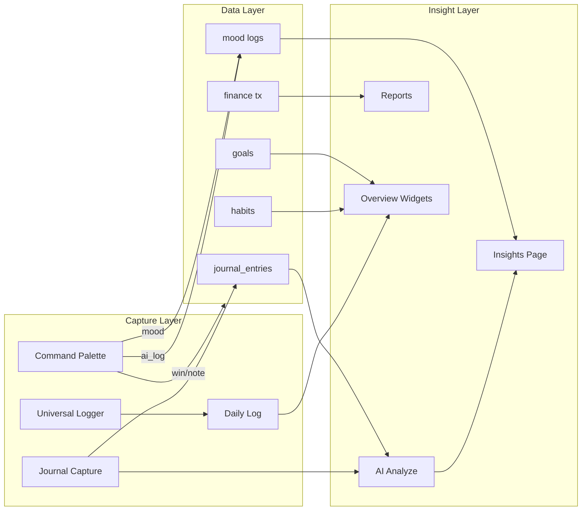

# AIIMIN — Interaction Graph & Dependencies

## Section 9 — Interaction Relationships



### Cross-feature sync edges

| From interaction | To interaction | Relationship |
|------------------|----------------|--------------|
| INT-211 Habit toggle | INT-099 DailyLog gym | Optional overlap; not auto-synced |
| INT-265 Goal create | INT-416 Pomodoro goal link | Goals feed focus dropdown |
| INT-161 Journal save | INT-171 AI analyze | Sequential dependency |
| INT-056 AI Log | Multiple tables | AI routing decision |
| INT-011 Onboarding goals | INT-265 Goals page | Seeds initial data |
| INT-012 Onboarding habits | INT-213 Habit create | Seeds initial data |
| INT-014 Life Arc | INT-532 Identity arc | Same field, two editors |
| INT-099 DailyLog | INT-529 Insights | Metrics feed insights |
| INT-493 Application intake | INT-495 Pipeline stage | CRM state machine |
| INT-435 ATS analyze | INT-494 Resume archive | Resume reuse |

---

## Section 10 — Component Dependencies

| Interaction | Depends on | Blocked if missing |
|-------------|------------|-------------------|
| Any authenticated route | Login + VerifyEmail + EmailVerifiedGuard | Redirect login |
| Tier gated routes | Subscription tier | Upgrade modal |
| Journal AI analyze | Saved entry + API key | Toast error |
| Command Palette AI log | Session + Gemini API | Fallback classify |
| Habit streak display | Prior habit completions | Empty state |
| Finance analytics | ≥1 transaction | Empty charts |
| Placements pipeline | ≥1 application | Empty pipeline |
| Focus reflection | Completed pomodoro | N/A — optional |
| Family emergency card | Members optional | Works standalone |
| Onboarding step N+1 | Step N valid | Continue disabled |
| Guest mode saves | Sign up | Banner block |
| ProductTour | Authenticated non-guest | Hidden |
| Nav pinned routes | NavPinEditor / defaults | Fallback defaults |
| Lab module | `/lab?module=` param | Launcher default |

### Hard dependency chain (activation)

```
Login → Verify Email → Onboarding (9 steps) → Overview → First Habit Toggle / Journal Capture
```

### Soft dependency chain (value)

```
Journal Capture → AI Analyze → Insights → Reports
Habit Toggle → Streak → Overview Widget → XP Modal
Finance Entry → Analytics → WhatIf Simulator
Application Intake → Pipeline Stage → ATS Analyze
```
