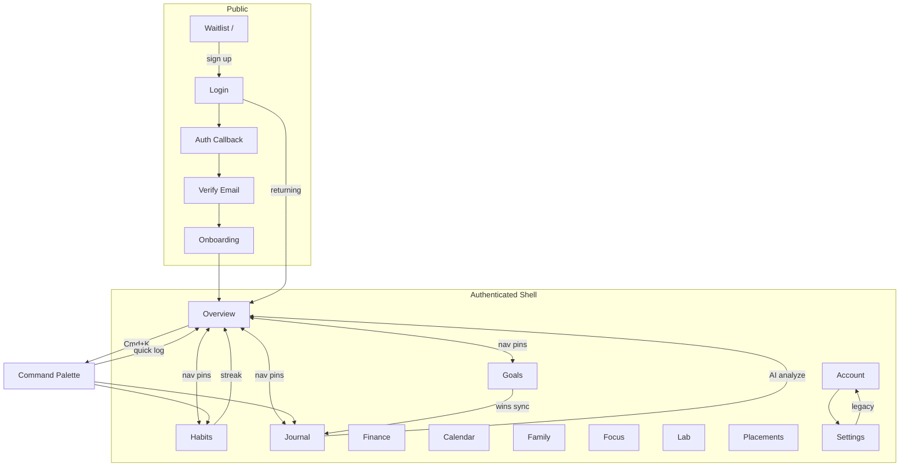

# AIIMIN — Navigation Map

**Source:** `frontend/src/App.js`, `constants/navItems.js`, `DashboardLayout.jsx`, `BottomNav.jsx`

---

## 1. Route Tree

```
/  [waitlist mode + no access] → WaitlistLanding
/  [else] → redirect → /overview | /login

/login/*          Login (Google OAuth, email signup, PIN)
/auth/callback    AuthCallback (OAuth return)
/verify-email     VerifyEmail (session required)
/onboarding       Onboarding (session; blocked in waitlist-no-access)

── DashboardLayout shell (session + email verified) ──
/overview         Overview (Today)
/insights         Insights [TierRouteGuard]
/calendar         CalendarPage
/sports           Sports [TierRouteGuard]
/journal          JournalPage
/finance          Finance [TierRouteGuard]
/settings         Settings
/lab              LabFullPage [TierRouteGuard] (?module= query)
/placements       Placements [TierRouteGuard]
/habits           Habits [TierRouteGuard]
/goals            Goals [TierRouteGuard]
/identity         IdentityPage
/notes            NotesPage
/discipline       Discipline [TierRouteGuard]
/focus            FocusRoom [TierRouteGuard]
/family           Family [TierRouteGuard]
/account          AccountPage (?section= query)
/reports          Reports [TierRouteGuard]
/seed-data        SeedData (dev)

── Public ──
/privacy, /terms, /data-deletion, /security, /about, /contact
/brand, /brand/system
/design-lab       → redirect /account?section=design

* → 404 redirect → / | /overview | /login
```

---

## 2. NAV_REGISTRY (Primary App Routes)

| ID | Route | Label | Guest hidden |
|----|-------|-------|--------------|
| overview | `/overview` | Today | no |
| habits | `/habits` | Habits | no |
| goals | `/goals` | Goals | no |
| journal | `/journal` | Journal | no |
| finance | `/finance` | Finance | no |
| family | `/family` | Family | no |
| calendar | `/calendar` | Calendar | no |
| placements | `/placements` | Career | no |
| sports | `/sports` | Sports | **yes** |
| discipline | `/discipline` | Discipline | **yes** |
| focus | `/focus` | Focus | no |
| lab | `/lab` | Lab | no |

**Defaults:** pinned = overview, habits, goals, journal. Max pinned = 12.

---

## 3. Account Sections (`/account?section=`)

| section param | Component |
|---------------|-----------|
| profile | ProfileSection |
| personalization | PersonalizationSection |
| design | DesignSection (internal prototypes) |
| notifications | NotificationsSection |
| privacy | PrivacySection |
| subscription | SubscriptionSection |
| data | DataSection |
| legal | LegalSection |

---

## 4. Journal Modes (`/journal?mode=`)

| param | Mode |
|-------|------|
| write (default) | Today capture |
| free | Free Write |
| cbt | CBT Record |
| www | What Went Well |
| morning | Morning Pages |
| weekly | Weekly Review |

---

## 5. Lab Modules (`/lab?module=`)

| module key | Label |
|------------|-------|
| decision | Decision Matrix |
| dopamine | Dopamine Detox |
| addiction | Addiction Tracker |
| personality | Personality AI |
| reading | Reading Log |
| typing | Typing Speed |
| aptitude | Aptitude Tests |
| quant | Quantitative Maths |
| speaking | Vocal Mastery |
| star | STAR Method |
| resume | Resume ATS Matcher |
| techsim | Tech Simulator |
| flashcards | Domain Flashcards |
| sysdesign | System Design |

---

## 6. Navigation Graph (User Journeys)



---

## 7. Global Navigation Surfaces

| Surface | Trigger | Targets |
|---------|---------|---------|
| Navbar masthead links | Click | Pinned routes |
| Navbar More dropdown | Click | Overflow routes |
| Navbar avatar | Click | `/account` |
| BottomNav tabs (mobile) | Click | First 4 pinned |
| BottomNav More sheet | Click | Remaining routes |
| Command Palette | `⌘/Ctrl+K` | 15 nav actions + quick logs |
| Brand lockup | Click | `/overview` |
| Guest banner Sign Up | Click | `/login` |
| ProductTour steps | Click/highlight | Feature routes |
| TierRouteGuard | Navigate blocked route | Upgrade modal / redirect |

---

## 8. Keyboard Shortcuts

| Shortcut | Scope | Action |
|----------|-------|--------|
| `⌘/Ctrl+K` | Global (authenticated) | Toggle Command Palette |
| `Esc` | Open palette/modal | Close |
| `↑` `↓` `Enter` | Command Palette | Navigate/select actions |
| `Space` (voice mode) | Command Palette AI/voice | Toggle mic |
| `Space` → `L` (700ms) | Global (not typing) | Open Universal Logger |
| `Esc` | Navbar mobile drawer | Close + focus toggle |
| `Tab` / `Shift+Tab` | Mobile drawer | Focus trap |
| `0-9`, `Backspace` | Onboarding/Login PIN | PIN entry |
| `Enter` | Inline palette inputs | Save log |
| `N` (Notes page) | Notes | New note |

---

## 9. Mobile vs Desktop

| Aspect | Desktop | Mobile (<768px) |
|--------|---------|-----------------|
| Primary nav | Navbar horizontal | BottomNav + hamburger |
| Journal sidebar | Persistent | Drawer (`sidebarOpen`) |
| Account sections | Side nav | Stacked / section param |
| Command palette | Centered overlay | Full-width overlay |
| **Dedicated `/m`** | **Not implemented** | Same routes |

---

## 10. Redirect & Guard Interactions

| Condition | Behavior |
|-----------|----------|
| No session on protected route | → `/login` |
| Waitlist mode, no access | `/` waitlist; pending screen elsewhere |
| Email unverified | EmailVerifiedGuard blocks shell |
| Guest user | Banner; many saves blocked |
| Tier insufficient | TierRouteGuard on insights, finance, lab, etc. |
| 404 | → home or overview or login |
