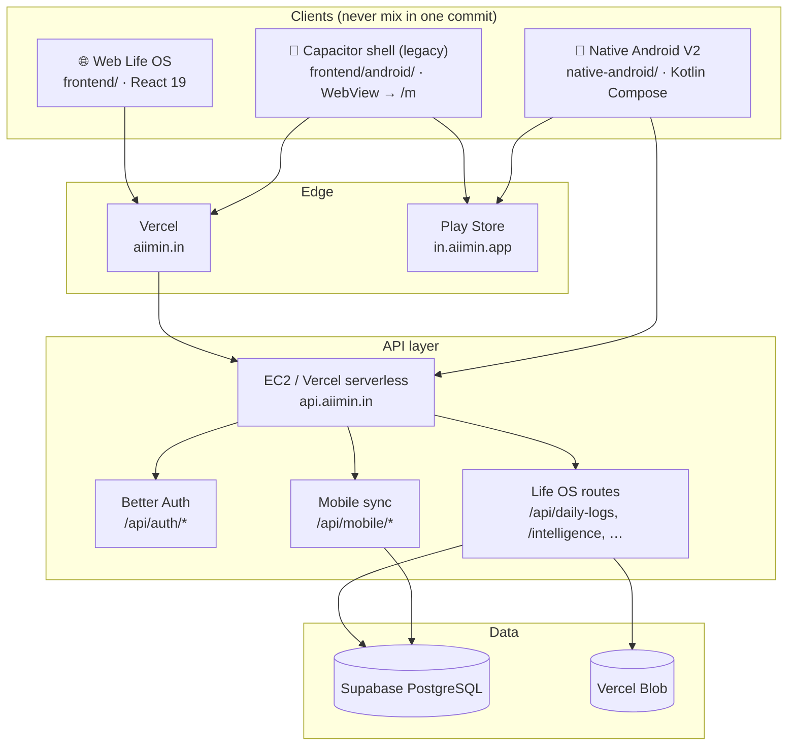
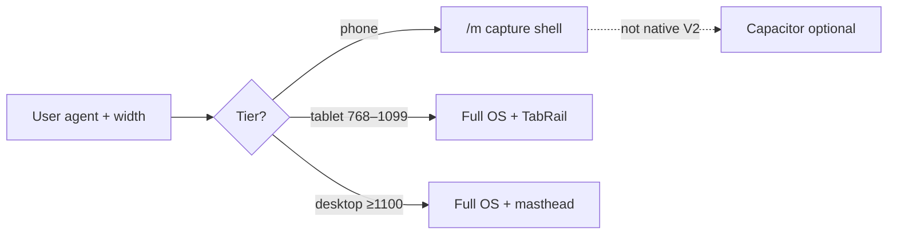
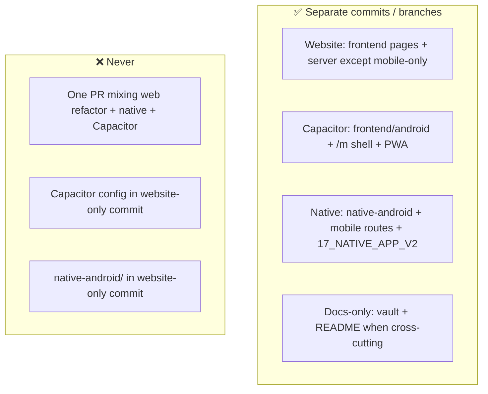

# Monorepo — one repo, three clients

**Last updated:** 2026-07-19  
**Owner:** Aaditya Upadhyay

AIIMIN ships as **one Git repository** with **three independent client surfaces**. They share backend auth and Postgres — they do **not** share UI code, build systems, or release trains.

---

## System diagram

---

## Client matrix

| Client | Path | Stack | Users get | Deploy |
|--------|------|-------|-----------|--------|
| **Web Life OS** | `frontend/` | React 19, Tailwind, React Query | Full dashboard on desktop, iPad, phone browser | Vercel ← `main` |
| **Capacitor capture** | `frontend/android/` + `/m` routes | Capacitor 7, remote WebView | Thin daily capture shell (stopgap) | Play + Vercel for `/m` bundle |
| **Native Android V2** | `native-android/` | Kotlin, Compose, Room, Retrofit | Daily companion: Today, Journal, Notes, Vault, More | Play AAB + `main` API |

### Device routing (web only)

Native app **does not** load `/m`. It calls `/api/mobile/*` directly.

---

## Backend layout

| Path | Role |
|------|------|
| `server/` | Express routes, services, cron jobs (EC2 primary) |
| `api/` | Vercel serverless entry (Hono router) |
| `server/routes/mobile.js` | Native V2 bootstrap + sync batch |
| `supabase/migrations/` | SQL migrations |

Shared contract: **same Better Auth user** on web and native. Different route namespaces — web uses REST feature routes; native uses `/api/mobile/*`.

---

## Commit boundaries (mandatory)

| Change type | Branch / commit bucket |
|-------------|------------------------|
| Overview, Finance, correlation engine | `main` — website |
| `/m`, `MobileShell`, Capacitor | `feat/mobile-capture-capacitor` |
| Kotlin app, Room, sync | `feat/native-android-v2` or `feat/mobile-capture-capacitor` until split |
| Vault architecture | `main` when website ships; native vault with native code |

Full file lists: `plans/mobile-commit-split.md`, `plans/commit-push-plan-2026-07-19.md`.

---

## Local development

| Surface | Command | Notes |
|---------|---------|-------|
| Web | `cd frontend && npm start` | `localhost:3000` |
| API local | `cd server && npm run dev` | or `npx vercel dev` |
| Capacitor APK | `cd frontend && npm run cap:build:android` | JDK 21 |
| Native APK | `cd native-android && ./gradlew :app:assembleDebug` | JDK 17 |

---

## Documentation map

| Need | Path |
|------|------|
| Vault home | `docs/knowledge/00_HOME.md` |
| This doc | `docs/knowledge/02_ARCHITECTURE/Monorepo.md` |
| Device tiers | `docs/knowledge/02_ARCHITECTURE/Device-Tiers.md` |
| Native V2 tracker | `docs/knowledge/17_NATIVE_APP_V2/WORKFLOW-PLAN.md` |
| Capacitor | `docs/knowledge/09_FEATURES/Mobile/Capacitor-Android.md` |
| Contributing | `CONTRIBUTING.md` |

---

## Attribution policy

Repository docs describe **product and engineering** only. No “built with” tool vendor lines in README, vault, or shipped UI copy. Intelligence features may name **runtime API providers** (e.g. model routes) in legal/third-party docs — that is product disclosure, not dev attribution.
