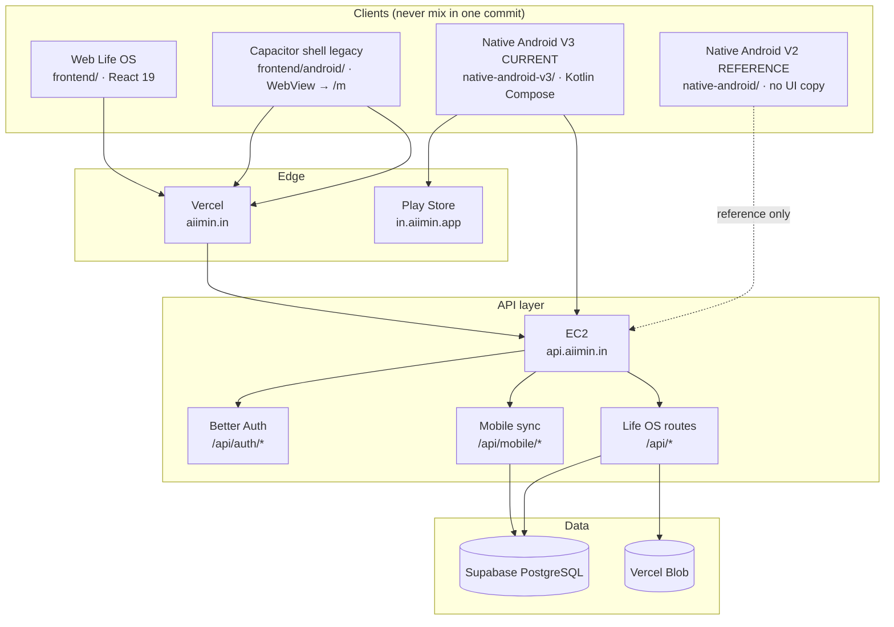
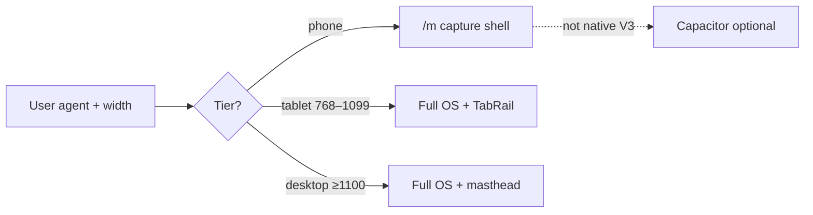
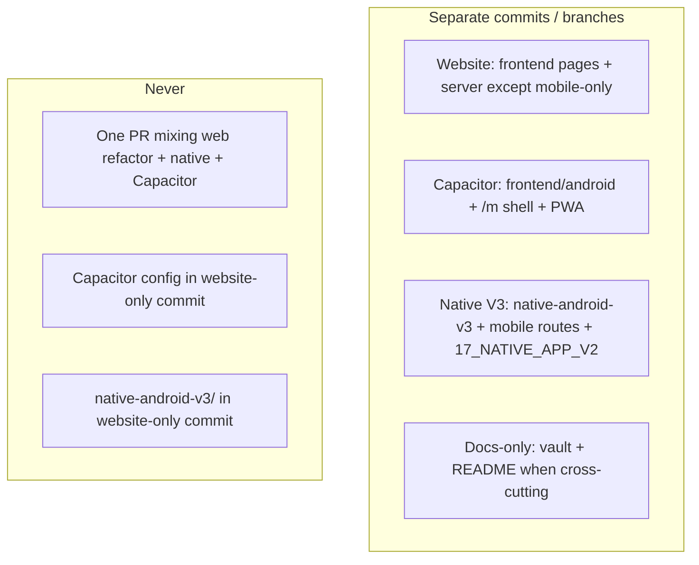

# Monorepo — one repo, four client paths (three shipping roles)

**Last updated:** 2026-08-20
**Owner:** Aaditya Upadhyay

AIIMIN ships as **one Git repository**. Clients share backend auth and Postgres — they do **not** share UI code, build systems, or release trains.

Canonical-path decision: [[10_DECISIONS/2026-07-30-repository-layout]]. Production roots remain top-level.

**Ownership:** Native V3 and web Life OS were built in this repo (founder + Cursor). Manus = prototype help only.

---

## System diagram

```mermaid
flowchart TB
  subgraph clients["Clients (never mix in one commit)"]
    WEB["Web Life OS<br/>frontend/ · React 19"]
    CAP["Capacitor shell legacy<br/>frontend/android/ · WebView → /m"]
    NAT3["Native Android V3 CURRENT<br/>native-android-v3/ · Kotlin Compose"]
    NAT2["Native Android V2 REFERENCE<br/>native-android/ · no UI copy"]
  end

  subgraph edge["Edge"]
    Vercel["Vercel<br/>aiimin.in"]
    Play["Play Store<br/>in.aiimin.app"]
  end

  subgraph api["API layer"]
    EC2["EC2<br/>api.aiimin.in"]
    Auth["Better Auth<br/>/api/auth/*"]
    MobileAPI["Mobile sync<br/>/api/mobile/*"]
    CoreAPI["Life OS routes<br/>/api/*"]
  end

  subgraph data["Data"]
    PG[(Supabase PostgreSQL)]
    Blob[(Vercel Blob)]
  end

  WEB --> Vercel
  CAP --> Vercel
  NAT3 --> Play
  NAT3 --> EC2
  NAT2 -.->|reference only| EC2
  Vercel --> EC2
  CAP --> Vercel
  EC2 --> Auth
  EC2 --> MobileAPI
  EC2 --> CoreAPI
  CoreAPI --> PG
  MobileAPI --> PG
  CoreAPI --> Blob
```

---

## Client matrix

| Client | Path | Role | Deploy |
|--------|------|------|--------|
| **Web Life OS** | `frontend/` | Full desktop/tablet OS | Vercel ← `main` |
| **Capacitor `/m`** | `frontend/android/` + `/m` | Legacy capture WebView — sunset when V3 covers capture | Play optional + Vercel |
| **Native Android V3** | `native-android-v3/` | **Current** companion app | APK/AAB + `api.aiimin.in` |
| **Native Android V2** | `native-android/` | **Reference only** (`sync/`, `session/`, `security/`, `data/network/`). Never copy `ui/` | frozen |

### Device routing (web only)

```mermaid
flowchart LR
  UA[User agent + width] --> T{Tier?}
  T -->|phone| M["/m capture shell"]
  T -->|tablet 768–1099| TAB["Full OS + TabRail"]
  T -->|desktop ≥1100| DESK["Full OS + masthead"]
  M -.->|not native V3| CAP2[Capacitor optional]
```

Native V3 **does not** load `/m`. It calls `/api/mobile/*` directly.

---

## Backend layout

| Path | Role |
|------|------|
| `server/` | Express routes, services, cron (EC2 primary) |
| `api/` | Vercel serverless entry (Hono) |
| `server/routes/mobile.js` | Native bootstrap + sync batch (V3) |
| `server/migrations/` | Numbered SQL migrations (canonical for app) |
| `supabase/migrations/` | Supabase-side migrations where used |
| `scripts/diagnostics/` | Manual probes; never part of CI |

Shared contract: **same Better Auth user** on web and native. Web uses feature REST routes; native uses `/api/mobile/*`.

---

## Commit boundaries (mandatory)

```mermaid
flowchart TB
  subgraph ok["Separate commits / branches"]
    W[Website: frontend pages + server except mobile-only]
    C[Capacitor: frontend/android + /m shell + PWA]
    N[Native V3: native-android-v3 + mobile routes + 17_NATIVE_APP_V2]
    D[Docs-only: vault + README when cross-cutting]
  end
  subgraph bad["Never"]
    X[One PR mixing web refactor + native + Capacitor]
    Y[Capacitor config in website-only commit]
    Z[native-android-v3/ in website-only commit]
  end
```

See also: [[02_ARCHITECTURE/Device-Tiers]] · [[16_DOCUMENTATION/Vault-And-Repo-Simplification-Plan]] · [[Guides/Where-Everything-Lives]]

---

## Structure (Phase V4)

> Skeleton pass 2026-08-20.

## Current state

Living summary. Keep short.

## Files

Key paths for this concern.

## Related

- [[Maps of Content/Architecture]]
- [[02_ARCHITECTURE/Overview]]

