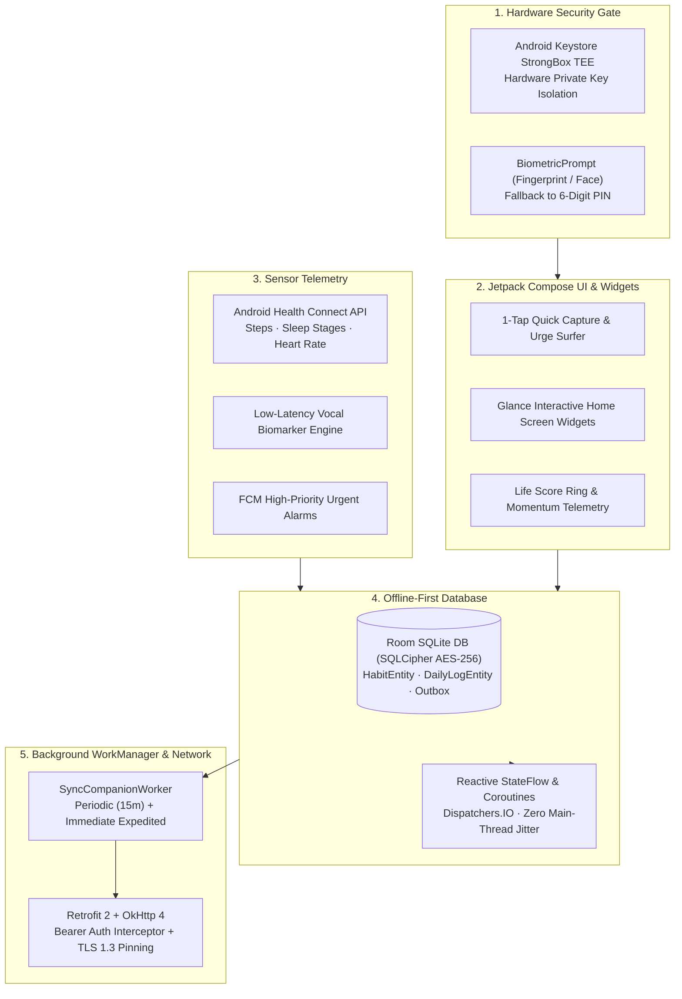
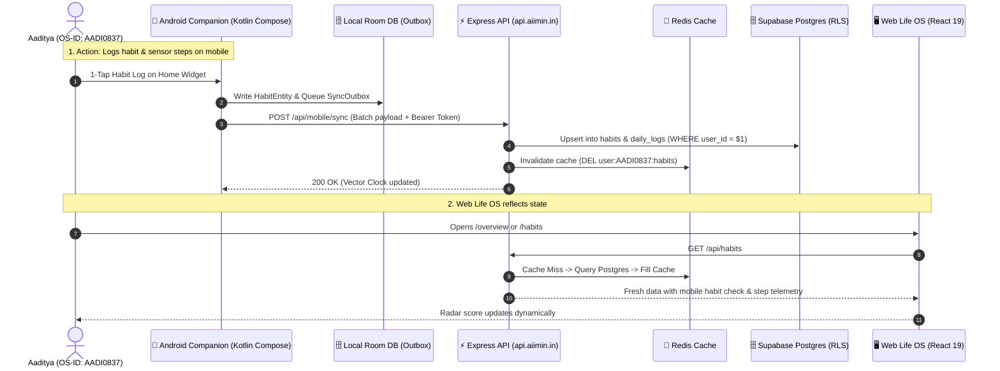

# AIIMIN — Comprehensive System Workflows & Inter-Client Architecture

**Last updated:** 2026-09-26  
**Owner:** Aaditya Upadhyay  
**Product:** Personal Life OS (Web + Native Android Companion + Shared Telemetry Core)

This authoritative architectural reference defines the complete end-to-end data pipelines, security models, offline-first sync engines, and cross-platform interactions across the AIIMIN monorepo.

---

## Interactive Visualizer & High-Resolution Vector Assets

All system architecture diagrams are available as standalone SVGs, 2× retina PNGs, and a theme-toggleable interactive visualizer inside the repository:

- **Interactive HTML Visualizer:** [`docs/diagrams/interactive-system-visualizer.html`](file:///Users/aaditya/Desktop/DASHBOARD%20PROJECT/docs/diagrams/interactive-system-visualizer.html)
- **Web Life OS Flow Diagram:** [`docs/diagrams/web-life-os-workflow.svg`](file:///Users/aaditya/Desktop/DASHBOARD%20PROJECT/docs/diagrams/web-life-os-workflow.svg) · [`web-life-os-workflow.png`](file:///Users/aaditya/Desktop/DASHBOARD%20PROJECT/docs/diagrams/web-life-os-workflow.png)
- **Native Android Flow Diagram:** [`docs/diagrams/native-android-companion-workflow.svg`](file:///Users/aaditya/Desktop/DASHBOARD%20PROJECT/docs/diagrams/native-android-companion-workflow.svg) · [`native-android-companion-workflow.png`](file:///Users/aaditya/Desktop/DASHBOARD%20PROJECT/docs/diagrams/native-android-companion-workflow.png)
- **Unified Cross-Platform Sync Diagram:** [`docs/diagrams/unified-app-web-sync-workflow.svg`](file:///Users/aaditya/Desktop/DASHBOARD%20PROJECT/docs/diagrams/unified-app-web-sync-workflow.svg) · [`unified-app-web-sync-workflow.png`](file:///Users/aaditya/Desktop/DASHBOARD%20PROJECT/docs/diagrams/unified-app-web-sync-workflow.png)

---

## 1. Web Life OS Architecture & End-to-End Pipeline

The Web Life OS (`frontend/`) is the desktop and tablet analytical command center built with React 19, Tailwind CSS, and the Drafting Table design tokens (`#1a1a1a`, `#2d2d2d`, `#749dc4`, `#ff6b35`, `#10b981`).

### Pipeline Stages

```mermaid
flowchart LR
  subgraph Public["1. Public Surfaces"]
    L["Landing / Waitlist<br/>/ · /waitlist"]
    B["Brand & App Hub<br/>/brand · /app"]
    LEG["Legal Hub<br/>/privacy · /terms"]
  end

  subgraph AuthGate["2. Security & Gate"]
    OSID["OS-ID Resolver<br/>AADI0837 (<80ms)"]
    PIN["Numpad PIN Keypad<br/>Argon2id Hash"]
    GUARDS["TierRouteGuard<br/>DeviceGate"]
  end

  subgraph Session["3. State & Cache"]
    TOK["Better Auth Token<br/>HttpOnly Session"]
    TQ["TanStack Query<br/>stale: 60s · no-refocus"]
  end

  subgraph Modules["4. Life OS Modules"]
    OV["Overview & Radar"]
    HB["Atomic Habits"]
    FN["Financial Ledger"]
    SP["Active Sports"]
    JN["Mindset Journal"]
    DC["Discipline Urges"]
    LB["Behavioral Lab"]
    FM["Family Vault"]
  end

  subgraph Backend["5. Core Hub"]
    API["Express API<br/>api.aiimin.in"]
    RED["Redis Cache<br/>sub-5ms"]
    PG[("Supabase Postgres<br/>RLS + Tenant Isolation")]
  end

  Public --> AuthGate --> Session --> Modules --> API
  API --> RED
  RED -.->|Cache Miss| PG
  PG -.->|Fill Cache| RED
```

### Module Responsibilities
1. **Public & Onboarding:** Public landing, waitlist management, brand guidelines, and immutable Genesis legal hub.
2. **Access Gate:** Uppercase OS-ID real-time scanner (`<80ms`), Argon2id 6-digit PIN keypad, device routing (phone directed to `/m`, tablets/desktops to full OS shell).
3. **Session Management:** Better Auth HttpOnly stateless tokens, TanStack Query v5 with window-focus protection.
4. **Life OS Workspaces:**
   - `Overview (/overview)`: 8-axis Life Score radar (0-100), Trajectory Projection engine, daily quick logs.
   - `Habits (/habits)`: 7-day completion matrix, streak momentum counter, optimistic cache updates.
   - `Finance (/finance)`: Net worth telemetry, transaction categorizer, monthly burn velocity.
   - `Sports (/sports)`: Multi-league fixtures and live scores (Cricket, Football, Basketball, F1).
   - `Journal (/journal)`: Multi-mode reflections, voice note transcription, AES-256-GCM encrypted notes.
   - `Discipline (/discipline)`: Urge surfing delay timer, trigger taxonomy, friction tracking.
   - `Lab (/lab)`: Vocal biomarkers, typing telemetry, cognitive hypothesis sandbox.
   - `Family (/family)`: Encrypted vital records, insurance policies, emergency contacts.

---

## 2. Native Android Companion Architecture & Sync Engine

The Native Android App (`native-android-v3/` / `app/`) is an offline-first companion built in Kotlin with Jetpack Compose, targeting sub-second data capture and hardware-grade security.

### Native Pipeline

### Hardware & Offline Invariants
- **StrongBox TEE:** All cryptographic keys and session credentials reside in the hardware-isolated Trusted Execution Environment.
- **Glance Home Widgets:** Home screen habit toggles and urge delay timers execute without launching the main activity.
- **Health Connect Aggregation:** Continuous background sensor collection aggregates daily step count, active calories, and sleep duration directly into local database entities.
- **Offline Outbox Pattern:** All mutations are written to `SyncQueueEntity` first and drained to `/api/mobile/sync` via `WorkManager` with exponential backoff.

---

## 3. Unified Cross-Platform Interaction Matrix

The Web Life OS and Native Android Companion operate as two synchronized halves of a unified Life OS.

### Synchronization Architecture

### Division of Labor

| Surface | Primary Role | Key Capabilities |
| :--- | :--- | :--- |
| **📱 Native Android Companion** | Frictionless Capture & Sensor Hub | StrongBox TEE, Biometric unlock, Health Connect steps/sleep, Glance home widgets, offline outbox. |
| **🖥️ Web Life OS** | Analytical Command Center & Planning | 8-axis Life Score radar, trajectory projection model, net worth ledger, career pipeline, weekly review PDFs, soundscapes. |
| **⚡ Shared Core Hub** | Identity, Caching & Master Source | Better Auth OS-ID resolution, Express gateway, sub-5ms Redis caching, Supabase Postgres with RLS. |

---

## Architectural Locks & Governance

1. **Identity Anchor:** Single canonical OS-ID (`AADI0837`) links all clients without redundant auth silos.
2. **Palette Compliance:** Dark `#14171A` / `#1E2228`, Drafting Table Steel `#749DC4`, Spark `#FF6B35`, Success Emerald `#10B981`.
3. **No Direct PostgREST from Clients:** All client interactions flow strictly through the authenticated API Gateway (`server/` / `api.aiimin.in`).
4. **Tenant Isolation:** All database tables enforce `auth.uid() = user_id` Row Level Security.
