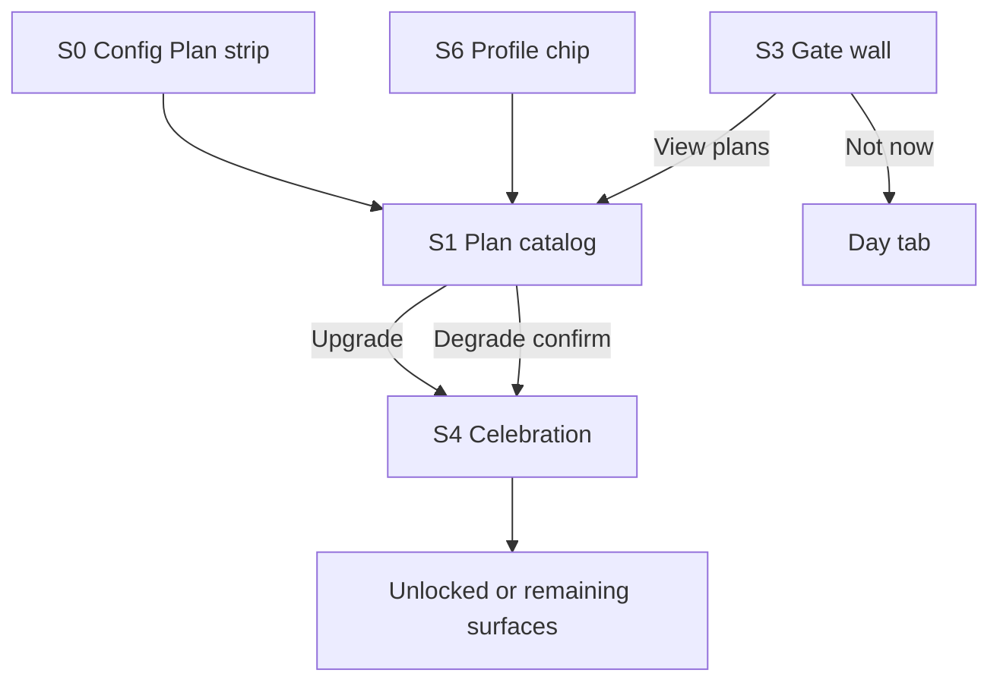

# Native Plan System — Full Design Contract

> Source of truth for Android V3 plan UI, colors, copy, gates, and upgrade/degrade motion.
> Web remains the twin identity; app does not invent a second ladder.

**Canonical web sources (do not drift):**

| Concern | File |
|---------|------|
| Soul colors + icons | `frontend/src/components/account/PlanStatusChip.jsx` `PLAN_TIER_META` |
| Account cards + features | `frontend/src/pages/account/sections/SubscriptionSection.jsx` `STATIC_TIERS` |
| Celebration motion + soul copy | `frontend/src/components/account/TierUpgradeCelebration.jsx` `TIER_SOUL` |
| Marketing waitlist cards | `frontend/src/components/waitlist/landing/waitlistLandingData.js` `PRICING` |
| Route / feature gates | `frontend/src/utils/tierGating.js` |
| Soul CSS | `frontend/src/styles/subscriptionSection.css` · `tierUpgradeCelebration.css` |

**Palette rule:** Product chrome stays Drafting Table (steel `#749dc4` / locked AIIMIN tokens). **Tier souls** are identity accents only — same four colors as web Account. Do not replace brand spark `#ff6b35` globally; Pro soul *is* that orange on purpose.

---

## 1. Ladder (immutable)

```
Explore (0) < Core (1) < Pro (2) < Elite (3)
```

One `subscription_tier` id shared web ↔ app: `explore` | `core` | `pro` | `elite`.

---

## 2. Tier identity — colors, labels, icons, prices

**Use Account / celebration souls for the app** (not waitlist green marketing accents). Waitlist landing uses different marketing greens; product Account uses the soul set below — that is what Profile chip + celebration already ship.

| Id | Label | Icon (Lucide → Compose) | Soul hex | Price | Short description (Account) | Waitlist tagline (marketing) |
|----|-------|-------------------------|----------|-------|-----------------------------|------------------------------|
| `explore` | Explore | Compass | `#6b7280` | ₹0 | Log daily. Learn the loop. | Capture the day. Feel the loop. |
| `core` | Core | Layers | `#2dd4bf` | ₹29/mo | Run your essentials. | Run the operating loop. |
| `pro` | Pro | Zap | `#ff6b35` | ₹49/mo founding | See the patterns. | Household + patterns. |
| `elite` | Elite | Crown | `#fbbf24` | ₹79/mo founding | Interactive intelligence · two AI pools. | Full intelligence · two AI pools. |

**Visual tokens per soul (Compose):**

| Token | Formula |
|-------|---------|
| `--tier-soul` | soul hex |
| Icon fill | soul |
| Icon well | soul @ 12% on surface |
| Icon border | soul @ 28% on rule |
| Card top hair | 2–3dp soul @ 70% |
| Selected card | tint = soul @ 10–16% on surface; border soul @ 55% |
| CTA fill (upgrade) | soul (Explore CTA = muted outline only) |
| On-CTA text | dark bg for Core/Pro/Elite; Explore uses text ink |
| Chip / ACTIVE stamp | soul |

**Recommended badge:** Pro only — label `RECOMMENDED` / `FOUNDING` (web uses popular + founding ₹49).

**List vs founding (display):**

| Tier | List (marketing) | Founding shown in app |
|------|------------------|------------------------|
| Explore | ₹0 | ₹0 · Free forever |
| Core | ₹29 | ₹29 (waitlist complimentary Core at launch — note in footer) |
| Pro | ₹59 list | **₹49** founding |
| Elite | ₹99 list | **₹79** founding |

App cards show founding price large; small muted strike of list when we want parity with waitlist.

---

## 3. Copy packs (ship both columns)

### 3.1 Account card features (web `STATIC_TIERS` — primary for Plan catalog)

**Explore**
- Log sleep, mood, gym, water, and steps daily
- Weekly completion ring and basic streak view
- Full Life OS view with 30-day history
- 1 AI call per day (Arc sharpen + Universal Logger)
- Reports nav visible · locked (Pro badge)

**Core**
- Everything in Explore
- Habits, money manager, and Pomodoro focus timer
- Weekly pattern insights and review loops
- Goals across 8 metrics (daily / weekly / monthly)
- Ivory Snapshot · 7-day pulse on Reports
- 10 AI calls per day

**Pro**
- Everything in Core
- Correlation Intelligence on Snapshot (top 3)
- Life OS Review PDF (14-day fingerprint)
- 6 Standard PDFs / month · separate from daily AI
- Wealth AI summary + import
- 25 AI calls per day

**Elite**
- Everything in Pro
- Interactive Intelligence Report (web · 30/60/90-day)
- 3 Deep Reports / month · dedicated generation pool
- Unlimited Standard PDFs
- 40 AI calls per day (daily pool never drained by Deep gen)
- Early access to every new module at launch

### 3.2 App ↔ web interlink (device column — keep current catalog, expand)

| Tier | ON APP | ON WEB |
|------|--------|--------|
| Explore | Day · minimums · Depth · Capture (1 Spark/day) · Journal · OS-ID · Config | Today · Calendar · Notes · Journal · daily log · Reports visible (deep locked) · 1 AI/day |
| Core | + Money ledger · Lab English full · Health Connect · widgets · offline queue | + Habits · Goals · Focus · Discipline · Finance · Career · Lab · Journal packs · Snapshot · 10 AI/day |
| Pro | + UPI payment-alert review · cloud voice replay · priority capture | + Family vault · Wealth AI · What-if · Correlations · Life OS Review PDF · 25 AI/day |
| Elite | + highest Android priority · deep capture betas first | + Intelligence Report · Deep Reports · 40 AI/day |

### 3.3 Celebration soul copy (web `TIER_SOUL`)

| Tier | Whisper (hold) | Eyebrow | Tagline | Unlock chips | CTA |
|------|----------------|---------|---------|--------------|-----|
| Explore | Switching to Explore | You're on | Daily logging stays. Advanced tools pause until you upgrade again. | Daily log · Basic streaks · 30-day history · 1 AI call/day | Continue on Explore |
| Core | Updating your plan | You're on | Habits, money, and focus — unlocked across your Life OS. | Habits & money · Focus timer · Weekly patterns · 10 AI calls/day | Continue on Core |
| Pro | Updating your plan | You're on | Deeper patterns, reports, and higher AI quota — now open. | Correlation insights · Habit recovery · Monthly reports · 25 AI calls/day | Continue on Pro |
| Elite | Updating your plan | You're on | Full access — highest AI quota, priority queue, early modules. | 40 AI calls/day · Sports briefing · Priority support · Early access | Continue on Elite |

**Upgrade vs degrade whisper:** if `to.rank < from.rank`, whisper = `Switching to {Label}`; else `Updating your plan` (matches Explore degrade on web).

---

## 4. Screens (native inventory)

### S0 — Config · Plan strip (always)
- Row: `Subscription` → current label in soul color
- Row: `App + web unlocks` → price · tap
- Meta line: tagline · “same ladder as aiimin.in”
- Tap → **S1**

### S1 — Plan catalog (full screen preferred over Dialog)
**Job:** compare + choose. One job.

Layout (thumb-friendly):
1. Head: `PLAN` · “App + web share one tier”
2. Current banner (soul): dot + “You're on **{Label}**” + till date if any
3. Vertical stack of **4 tier cards** (soul styled)
4. Each card:
   - Icon well (soul) · LABEL · price
   - Tagline / description
   - Toggle or two columns: **ON APP** / **ON WEB** (interlink)
   - Feature bullets (Account pack, truncated to 4 + “More”)
   - CTA: `Current` | `Upgrade to {Label}` | `Switch to {Label}` (degrade)
5. Foot: “Billing later · pick applies now” (same as web subscription mode)

**Pro card:** `RECOMMENDED` eyebrow + soul glow border.

### S2 — Tier detail (optional sheet from card “More”)
- Full feature list + AI quota + best-for line (waitlist `bestFor`)
- Primary CTA same as catalog

### S3 — Gate wall (blocked surface)
Triggered when `!TierCatalog.can(user, feature)`.

Surfaces:
| Feature | Min | Entry |
|---------|-----|-------|
| Money tab | Core | MoneyRoute |
| Lab full | Core | LabRoute |
| UPI review | Pro | Money inbox advanced |
| Family (future) | Pro | — |
| Intelligence (future) | Elite | — |

Wall content:
- Feature title
- “Needs **{min.label}**” in figure type, soul of **required** tier
- One line: current vs required
- App unlock tease · Web unlock tease
- Primary: `View plans` → S1 (auto-scroll to required card)
- Ghost: `Not now` → back to Day

### S4 — Identity shift celebration (full-screen overlay)
Port of web `TierUpgradeCelebration`. Runs after any successful tier change (up or down).

### S5 — Receipt toast (secondary)
Short toast: `You're now on {Label}` after celebration dismiss (optional; web has both).

### S6 — Profile / OS-ID chip
Compact PlanStatusChip twin: icon + LABEL in soul + optional `till …`. Tap → S1.

---

## 5. Upgrade / degrade motion (S4 phases)

Mirror web timing (respect `reduceMotion` → jump to receipt).

| Phase | t (ms) | Visual |
|-------|--------|--------|
| `hold` | 0–600 | Soul whisper chip + pulsing soul dot · previous label still visible |
| `dissolve` | 600–1300 | **From** label fades up, blur 6px, tracking opens |
| `land` | 1300–2100 | **To** label lands (blur→sharp, y 18→0) · eyebrow + tagline · stage wash = soul radial |
| `unlocks` | 2100–2800 | Unlock chips stagger (+70ms) · check mark in soul |
| `receipt` | 2800+ | Receipt card: AIIMIN · ACTIVE stamp · Previous → New · CTA |

**Upgrade (rank↑):** stage glow intensifies; chips feel additive; haptic `COMMIT` on land.

**Degrade (rank↓):** quieter motion — shorter dissolve, no glow bloom, whisper “Switching to …”, chips show what **remains**; haptic `TAP` only.

**Reduce motion:** skip to `receipt` in ≤120ms; still show from→to + CTA.

**Compose mapping:**
- `Animatable` / `AnimatedContent` + `graphicsLayer { alpha; translationY; }`
- Soul color via `TierSoul.color` on hold dot, name gradient, chip border, CTA
- Backdrop: `bg` @ 96% + radial soul @ 14%

---

## 6. Interaction rules

1. **Instant apply** until Play Billing / Stripe live (same as web `IS_SUBSCRIPTION_MODE`).
2. Confirm degrade only (dialog): “You’ll lose Money / Lab on device until Core+. Continue?”
3. Upgrade: no confirm — celebration only.
4. Changing plan while on gate wall: apply → celebration → pop wall → surface unlocks.
5. Persist `subscription_tier` id; sync to API when billing endpoint exists (`/billing/status` twin).

---

## 7. Data model (expand native)

```text
TierSoul(id, label, color, icon, priceInr, listPriceInr?, taglineAccount, taglineWaitlist,
          description, featuresAccount[], unlocksCelebration[], whisperUpgrade, whisperDegrade,
          ctaContinue, appUnlocks[], webUnlocks[], aiCallsPerDay, recommended, bestFor)
```

Single object in `core/model` — UI reads only this. Kill duplicated strings in `PlanSheet`.

Icons: Compose vector ports of Compass / Layers / Zap / Crown (or Material equivalents mapped 1:1).

---

## 8. Implementation phases

| Phase | Deliverable | Proof |
|-------|-------------|-------|
| **P0** | `TierSoul` catalog + colors in model; Plan catalog S1 full-screen with soul cards + App\|Web | Device shots per tier selected |
| **P1** | S4 celebration (upgrade + degrade paths) + reduceMotion | Screenrecord / phased shots |
| **P2** | S3 gate walls soul-styled; degrade confirm; Config chip S6 | Money on Explore → wall → upgrade → enter |
| **P3** | S2 detail; founding strike prices; waitlist bestFor | Device: More → detail + Not now on gate |
| **P4** | Wire `/billing/status` when server ready; Play Billing later | API evidence |

**Shipped through P3 + web-parity + P4 client wire (2026-08-06):** TierSoul · S1–S6 · S5 toast · splash spring spark. **P4 client:** `GET billing/status` + `POST billing/select-tier` via `BillingRepository` (signed-in sync; offline falls back local). Gate opens catalog with required tier focused. Period-end on banner/chip. `upgrade_only` locks degrade CTA.

**Still later:** Play Billing / Stripe checkout UI (server click-upgrade covers now).

---

## 9. Screen flow (mermaid)



---

## 10. Do-not list

- Do not use waitlist **green** Pro marketing accent (`#16a34a`) inside the app Plan system — that is landing-only.
- Do not invent a fifth tier or rename labels.
- Do not put `#ff6b35` on Explore/Core chrome — Pro soul only (plus BrandMark spark).
- Do not skip celebration on degrade — identity shift still matters.
- Do not sum Health Connect origins (unrelated but do not regress).

---

## 11. Related

- [[App-Web-Tiers]] (short interlink — keep in sync with §3.2)
- [[01_PRODUCT/AIIMIN-Product-Guide]] §8
- [[08_DESIGN/Palette]]
- Native: `SubscriptionTier.kt` · `SubscriptionPlan.kt` · Config Plan section

---

## Structure (Phase V4)

> Added 2026-08-20 so every living feature MOC shares the same skeleton. Fill stubs when next touching this feature.

## Current state

Status / scope / last meaningful change. Update when behavior changes.

## Why this exists

One job this feature serves for the user.

## Contracts

Routes, tables, env names (no secret values).

## Files

Frontend / backend / native paths.

## Related

- [[09_FEATURES/Index|Features Index]]
- [[15_MEMORY/Current-Context]]

