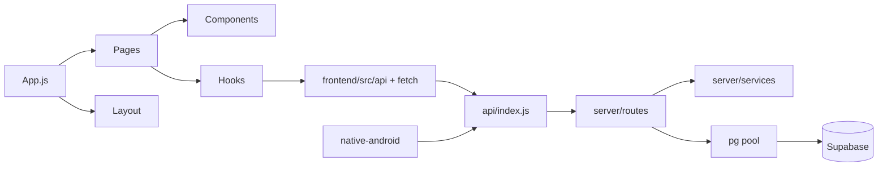

# 02 — Architecture

## Monorepo rule (hard)

Three clients share auth + Postgres. They do **not** share UI code, build systems, or release trains. Commit boundaries enforced in `CONTRIBUTING.md` and `docs/knowledge/02_ARCHITECTURE/Monorepo.md`.

```mermaid
flowchart TB
  subgraph clients
    WEB[Web Life OS · frontend/]
    CAP[Capacitor · frontend/android/ → /m]
    NAT[Native V2 · native-android/]
  end
  subgraph edge
    V[Vercel aiimin.in]
    P[Play Store]
  end
  subgraph apiLayer
    EC2[EC2 Hono api.aiimin.in]
    BA[Better Auth /api/auth]
    MOB[/api/mobile]
    CORE[Feature /api/*]
  end
  PG[(Supabase Postgres)]
  WEB --> V --> EC2
  CAP --> V
  NAT --> P
  NAT --> EC2
  EC2 --> BA
  EC2 --> MOB
  EC2 --> CORE
  CORE --> PG
  MOB --> PG
```

---

## Frontend architecture

### Stack

- CRA + CRACO (`frontend/package.json` scripts)
- React 19 + React Router 7 (`frontend/src/App.js`)
- TanStack Query via `QueryProvider.jsx`
- Contexts: `AuthContext`, `ThemeContext`, `GuestContext`, `AudioContext`, `LiveRegionContext`, `XPContext` (XP provider mount status: see debt)
- Proxy: `"proxy": "http://localhost:3001"` for local API

### Layout shells

| Shell | File | When |
|-------|------|------|
| Dashboard | `components/layout/DashboardLayout.jsx` | Authed desktop/tablet routes |
| Mobile capture | `components/mobile/MobileShell.jsx` | `/m/*` |
| Legal | `pages/legal/LegalLayout.jsx` | Public legal pages |
| Waitlist | `pages/WaitlistLanding.jsx` | `/` when waitlist mode |

### Guard stack (order matters)

1. Auth loading (`useAuth`)
2. Access gate / waitlist (`useAccessGate`)
3. `DeviceGate` — phone → `/m`
4. `EmailVerifiedGuard`
5. Waitlist pending screen if signed-in without access
6. Inside dashboard: `ArcGuard` (Life Arc → onboarding)
7. Per-route: `TierRouteGuard` + `tierGating.js`

### Routing

Source of truth: `frontend/src/App.js`. Full path list → [06_NAVIGATION_GRAPH.md](06_NAVIGATION_GRAPH.md).

### State management

| Concern | Mechanism |
|---------|-----------|
| Server data | React Query hooks + `frontend/src/api/*` + some `services/` |
| Auth session | Better Auth client + `AuthContext` |
| Theme | `ThemeContext` + `data-theme` + localStorage `aiimin-theme-prefs` |
| Nav pins | `useNavPreferences` + Account Personalization |
| Guest mode | `GuestContext` / `GuestGate` |
| Optimistic / offline mobile web | Limited; native uses Room + outbox |
| Generic table CRUD | `dbService` → `/api/db/:table` (write-blocked for some tables) |

### Theme system

Canonical IDs: `aiimin-dark`, `aiimin-light`. Details → [10_THEME_SYSTEM.md](10_THEME_SYSTEM.md).

---

## Backend / API architecture

### Entry

- **Production & local:** `api/index.js` (Hono `basePath('/api')`)
- **Local runner:** `dev_server.js` → port 3001
- **No** `server/index.js`

### Mount pattern

```text
/api/health, /api/keepalive          inline
/api/auth/*                          custom authRoutes + Better Auth catch-all
/api/{prefix}/*                      lazy routeMap → server/routes/*.js
```

Prefixes in `routeMap`: daily-logs, dashboard, tasks, google, calendar, notifications, account, habits, goals, family, lab, placements, wealth, sports, intelligence, ats, blob, feedback, waitlist, admin, cron, billing, discipline, notes, focus, journal, db, user, mobile.

Unmounted: `server/routes/health.js`.

### Auth

| Piece | Location |
|-------|----------|
| Better Auth config | `server/lib/auth.js` |
| Session gate | `server/middleware/auth.js` → `requireAuth` |
| Access / waitlist | `server/services/accessService.js` |
| Dev/owner admin | `requireDevOrOwner` |
| Cron | `Authorization: Bearer ${CRON_SECRET}` |

Login OAuth callback path (product docs): `{BETTER_AUTH_URL}/api/auth/callback/google`.

Google **Calendar/Drive** OAuth is separate under `/api/google/auth/*` (not login).

### Storage

| Store | Use |
|-------|-----|
| Supabase Storage bucket `dashboard-uploads` | Resumes / uploads; blob routes |
| Encrypted OAuth tokens | `user_oauth_tokens` |
| Vercel Blob token env present | `BLOB_READ_WRITE_TOKEN` / `@vercel/blob` in root deps — usage alongside Supabase upload paths |

**Flag:** `/api/blob/upload` and `/api/blob/delete` have **no auth middleware** in inventory → [11_TECHNICAL_DEBT.md](11_TECHNICAL_DEBT.md).

---

## Database architecture

- Host: Supabase PostgreSQL
- App access: Node `pg` pool (`server/lib/db.js`) with service role patterns; RLS blocks PostgREST for many tables
- Migrations: `supabase/migrations/*` + `server/migrations/023–048`
- Generic gateway: `/api/db/:table` with allowlists; writes blocked on `goals`, `habits`, `habit_logs`, `daily_logs`, `journal_entries`

Entity inventory → [07_DATA_MODELS.md](07_DATA_MODELS.md).

---

## Native architecture

```mermaid
flowchart TB
  UI[Compose screens] --> VM[ViewModels]
  VM --> REPO[Repositories]
  REPO --> ROOM[(Room)]
  REPO --> DS[DataStore]
  REPO --> AUTH[/api/auth]
  REPO --> BOOT[/api/mobile/bootstrap]
  REPO --> SYNC[/api/mobile/sync/batch]
```

Tabs (README): Home · Journal · Notes · Vault · More.

Package: `in.aiimin.app`. Sync tables: `mobile_devices`, `mobile_idempotency`.

---

## High-level dependency graph (internal)



External libraries → [12_DEPENDENCY_GRAPH.md](12_DEPENDENCY_GRAPH.md).

---

## Notifications & jobs

| Path | Role |
|------|------|
| `/api/notifications` | In-app notifications |
| `/api/cron/re-engagement` | Emails: streak recovery, idle, digest, doc expiry |
| `/api/cron/correlations` | Nightly correlation batch |
| `deploy/cron.sh` | Host cron (sports etc.) |
| Vercel cron | Daily `/api/keepalive` (via vercel.json; rewrite hits EC2) |
| `server/jobs/recurringTransactions.js` | Exists; **no HTTP mount found** |

---

## Cross-references

- Endpoints → [08_API_MAP.md](08_API_MAP.md)
- Screens → [04_SCREEN_INVENTORY.md](04_SCREEN_INVENTORY.md)
- Deploy → [13_BUILD_SYSTEM.md](13_BUILD_SYSTEM.md)
