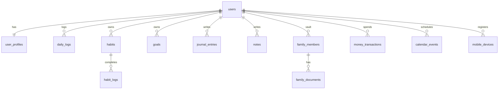

# 07 — Data Models

**Method note:** Core tables largely predate numbered migrations. Inventory merges migrations, `/api/db` allowlists, route SQL, and vault notes. **Live DB may differ.**

## Identity & auth

| Model | DB | API | Frontend | Used by |
|-------|----|-----|----------|---------|
| App user | `users` | `/api/auth/me`, `/api/account/*` | AuthContext, Account | All surfaces |
| Profile prefs | `user_profiles` (1:1 users) | `/api/account/user-profile`, billing | Personalization, tier | Gates, themes prefs server-side |
| Legacy profile | `profiles` | db self-read allowlist | unclear | **Conflict** vs user_profiles |
| Better Auth | `"user"`,`"session"`,`"account"`,`"verification"`,`"twoFactor"`, `rateLimit` | `/api/auth/*` | better-auth client | Auth only; RLS deny-all |
| OAuth tokens | `user_oauth_tokens` (user_id, provider) | `/api/google/auth/*` | Calendar connect | Calendar/Drive |
| Tester allowlist | `tester_allowlist` | accessService | useAccessGate | Waitlist bypass |

## Daily & dashboard

| Model | Relationships | API | FE |
|-------|---------------|-----|-----|
| `daily_logs` | unique (user_id, date) | `/api/daily-logs` | Overview, `/m`, native |
| `daily_commitments` | → user | dashboard | Today |
| `wins` | → user | db/export | WinsEngine |
| `tasks` | → user | `/api/tasks` | tasks UI |
| `notifications` | → user | `/api/notifications` | Navbar |
| `life_score_cache` | → user | mobile bootstrap | native score |
| `weekly_summaries` | → user | intelligence | reports |

## Habits / goals / focus

| Model | Notes | API | FE |
|-------|-------|-----|-----|
| `habits` | optional goal_id | `/api/habits` | Habits, native |
| `habit_logs` | → habits | `/api/habits/:id/logs` | heatmaps, native |
| `habit_stacks` | habit_ids[] | foundation | discipline |
| `goals` | metric/target/meta; soft delete | `/api/goals` | Goals; **not** personal_goals |
| `routines`, `routine_runs`, `routine_habits` | routines UI | db | Routines |
| `sessions` | base focus rows | `/api/focus/sessions` INSERT | Focus |
| `pomodoro_sessions` | **VIEW** over sessions | focus stats | Focus charts |
| `study_sessions` | wipe list | — | — |

## Journal / discipline / notes

| Model | Notes | API |
|-------|-------|-----|
| `journal_entries` | encrypted_content/content evolved | `/api/journal`, mobile sync |
| `cbt_records`, `www_entries` | journal modes | journal |
| `discipline_streaks`, `discipline_logs`, `replacement_habits` | | `/api/discipline` |
| `urge_events` | | urge start/resolve |
| `anchor_edges` | graph links | notes confirm |
| `notes` | source_type pdf/voice/text | `/api/notes` |
| `note_drive_watches` | Drive folders | notes drive |
| `voice_recall_queue` | spaced recall | notes recall |
| `addiction_tracking` | lab | frontend lab |

## Finance

`accounts`, `money_transactions`, `money_categories`, `budgets`, `money_lent`, `savings_goals`, `recurring`, `wealth_assets`, `financial_health_scores`, `financial_goals`, `account_balances`, `net_worth_snapshots` → `/api/wealth` + Finance UI.

## Family

`family_members`, `family_documents`, `family_insurance`, `family_health`, `family_vehicles`, `family_finance`, `family_relationships`, `family_reminders`, `family_emergency_contacts` → `/api/family` + Family page.

## Lab / cognitive

`lab_typing_tests`, `lab_speaking_logs`, `lab_reaction_tests`, `lab_mindset_logs`, `lab_reading_log`, `lab_personality_logs`, `lab_pit_logs`, `lab_aptitude_scores`, `lab_system_design_logs`, `lab_decision_scenarios`, `lab_streaks`, `lab_mastery_badges`, `lab_correlations`, `lab_insights`, `lab_beliefs`, `cognitive_benchmarks`, typing_* bank tables.

## Career

`resumes`, `job_applications`, `dsa_problems`, `dsa_logs`.

## Calendar / sports / XP / system

`calendar_events`; `sports_cache`, `sports_favorites`, `sports_preferences`, `sports_legends`, `sports_news_feed`; `user_xp`, `xp_log`, `achievements`, `achievement_definitions`; `api_usage_log`, `api_provider_budgets`; `email_logs`; `waitlist_emails`, `waitlist_feedback`, `user_feedback`; `admin_action_log`, `admin_audit`, `feature_flags`, `system_config`; `sleep_quality_tags`.

## Mobile sync

| Table | Columns (migration) | Consumers |
|-------|---------------------|-----------|
| `mobile_devices` | user_id, platform, app_version, push_token, last_seen_at | Native register |
| `mobile_idempotency` | UNIQUE(user_id, idem_key), response_json | sync/batch |

**Proposed not shipped** (native 10_DATABASE.md): devices, sync_cursors, mutation_idempotency, entitlements, security_events, audit_log, embeddings.

## Views

`pomodoro_sessions`, `recent_notifications`, `behavioral_daily_summary`, `user_daily_metrics`.

## Write blocks on `/api/db`

Must use dedicated routes: `goals`, `habits`, `habit_logs`, `daily_logs`, `journal_entries`.

## Relationship sketch

## Conflicts (do not silently pick a winner)

1. `auth.users` vs `public.users` FK parents across migrations; notes fixed in 044 → `public.users`.
2. `profiles` vs `user_profiles`.
3. Legacy names `personal_goals` / `habit_completions` / `google_tokens` vs runtime `goals` / `habit_logs` / `user_oauth_tokens`.
4. `pomodoro_sessions` table ALTER vs view.
5. Journal column evolution outside migrations.
6. Vault `03_DATABASE/Index.md` lists ~7 tables; codebase touches 70+.
7. Current-Context "RLS deny-all" on mobile vs user-scoped policies in SQL.

## Cross-references

- Endpoints → [08_API_MAP.md](08_API_MAP.md)
- Debt → [11_TECHNICAL_DEBT.md](11_TECHNICAL_DEBT.md)
