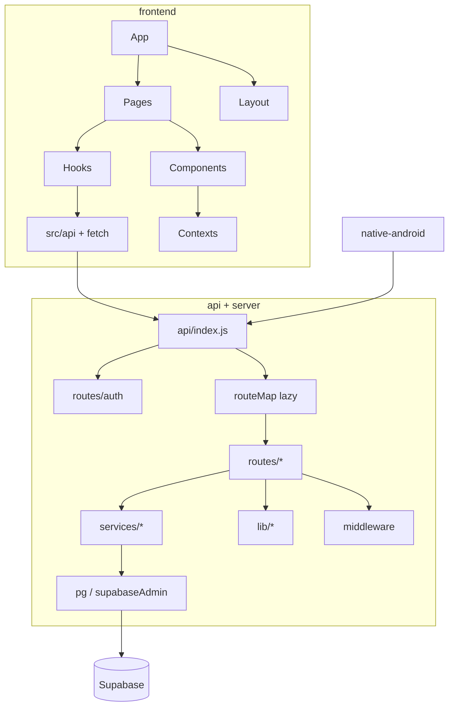

# 12 — Dependency Graph

## Root npm (`aiimin-monorepo`)

Runtime highlights: `better-auth`, `@better-auth/infra`, `hono`, `@hono/node-server`, `pg`, `@supabase/supabase-js`, `@google/genai`, `googleapis`, `nodemailer`, `resend`, `@vercel/blob`, `pdf-parse`, `xlsx`, `luxon`, `winston`, `dotenv`, `cookie`, `react-helmet-async`.

Scripts depend on frontend install + `dev_server.js`.

**Note:** Server code lives in `server/` but shares root `package.json` (no separate `server/package.json`).

## Frontend npm

UI: `react@19`, `react-dom`, `react-router-dom@7`, `react-scripts@5` + `@craco/craco`.

Data: `@tanstack/react-query`, `@supabase/supabase-js`, `better-auth`.

UI kits: Radix dialog/dropdown/slot/tooltip, `class-variance-authority`, `clsx`, `tailwind-merge`, `vaul`, `lucide-react`, `framer-motion`, `motion`, `@number-flow/react`, `react-hot-toast`, `react-countup`.

Charts: `@visx/*`, `recharts`.

Docs/PDF: `@react-pdf/renderer`, `jspdf`, `jspdf-autotable`, `pdfjs-dist`.

Capacitor 7: `@capacitor/core`, `android`, `app`, `cli`, `splash-screen`, `status-bar`.

Dates: `date-fns`. Misc: `suncalc`, `web-vitals`, testing-library suite.

Dev: `sharp`, `vercel` CLI.

## Native Android

Gradle Kotlin app (`native-android/`). Stack per README: Jetpack Compose, Room, DataStore, WorkManager, Retrofit, biometric. JDK 17, compile SDK 35, min API 26+.

Exact Gradle dependency versions: open `native-android/app/build.gradle.kts` / version catalogs (not fully expanded this pass).

## Internal dependency graph

## Potential circular / coupling risks (observed)

| Risk | Evidence |
|------|----------|
| Frontend ↔ API tight feature coupling | Many pages call dedicated routes + `/api/db` |
| Dual money component trees | finance/ + money/ + MoneyManager |
| Theme dual systems | Web ThemeContext vs waitlist nordic/vercel vs native theme |
| Auth dual Google flows | Better Auth login vs `/api/google/auth` calendar |
| Blob service as router | `blobService.js` mounted like a route module |
| Lazy routeMap dynamic import | Failures surface only when prefix hit |
| Root node_modules size | Large; MacBook Air 8GB constraint noted in Architecture Overview |
| Capacitor + CRA + Native triple toolchain | Separate release trains required |

## AI provider coupling

Env names present for Gemini, Groq, OpenRouter, NVIDIA, Kimi/Moonshot, xAI. Routed through `/api/intelligence*` + `apiUsageService` budgets. Frontend should not ship provider keys (frontend `.env.example` comment: do not set `REACT_APP_GEMINI_API_KEY`).

**Conflict:** Grep found `REACT_APP_GEMINI_API_KEY` string usage in frontend source inventory even while example says do not set — treat as coexistence flag.

## Cross-references

- Build → [13_BUILD_SYSTEM.md](13_BUILD_SYSTEM.md)
- API services list → [08_API_MAP.md](08_API_MAP.md)
