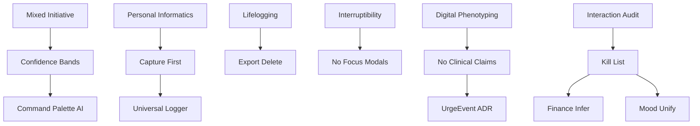

# 18 — Research Graph

```yaml
purpose: Machine edges ResearchDomain → Implication → ProductRule → Decision/Feature.
confidence: ★★★★☆
generated_from:
  - docs/product-intelligence/RESEARCH_FOUNDATIONS.md
  - docs/AIIMIN_PRODUCT_BIBLE/*
  - docs/product-intelligence/things_aiimin_should_stop_asking.md
  - docs/knowledge/10_DECISIONS/*
related_notes: [06_RESEARCH_INDEX.md, 02_PRODUCT_PHILOSOPHY.md, 03_PRODUCT_DECISIONS.md]
dependencies: [06_RESEARCH_INDEX.md]
consumers: Agents justifying design from research
importance: ★★★★☆
```

---

## EDGE FORMAT

`DOMAIN --implies--> RULE --binds--> ARTIFACT`

---

## GRAPH EDGES

| Domain | Implication | Product rule / artifact |
|--------|-------------|-------------------------|
| Mixed-initiative (Horvitz) | Act when confident; ask when not | AI confidence bands ≥70/40–70/<40 · `06_AI_MODEL.md` |
| Mixed-initiative | Correction path required | Infer-then-chip · Principles #3 |
| Personal informatics (Li stages) | Structure after capture | Capture first · Philosophy #2 |
| Personal informatics | Installation→action→reflection→integration | Onboarding→Daily→Insights/Reports journey |
| Lifelogging (MyLifeBits) | Capture broad; retrieve selective | Journal+Notes+Palette primitives |
| Ethics of forgetting | Export/delete mandatory | Principles #15 · Account data tools |
| Interruptibility (Fogarty/Iqbal) | Cost of interruption | No modals during Focus · Principles #14 |
| Interruptibility | High-receptivity windows | Morning briefing idea |
| Passive sensing | Prefer System import over ask | Kill list System verdicts sleep/steps |
| Passive sensing privacy | Opt-in HealthKit | Principle conflict table |
| Digital phenotyping (Torous) | Transparency + correction | Mood infer with chips; no diagnosis |
| Digital phenotyping | Consumer ≠ clinician | Never AI therapist · Never-Build |
| UIST input efficiency | Reduce form complexity | Compression targets · Palette router |
| Agentic / ReAct | Multi-table from one utterance | One utterance many tables · Principles #2 |
| Behavior change | Shame demotivates | Pattern language · ADR-Discipline |
| June audit (internal) | Fake gamification harms trust | Life Score honest · Insights domains critique |
| Interaction audit friction | Onboarding/Family/Finance heavy | Kill list P0s · compression score |
| Field matrix 94 fields | Many duplicates/inferrables | Mood unify · finance infer |
| Intent graph | Users arrive with intents | Philosophy #1 · Human Intent Graph |

---

## EMPIRICAL → KILL LIST EDGES

| Evidence | Kill/Infer verdict |
|----------|-------------------|
| Finance category high infer conf | Kill dropdown |
| Journal mode blocks vent INT-166 | Kill mode gate |
| Mood ×5 surfaces | Unify primitive |
| Onboarding wake-time low signal | Kill step |
| Goal priority low signal | Kill dropdown |
| Notes required title friction | Kill required title |

---

## RESEARCH → METRIC EDGES

| Research goal | Metric |
|---------------|--------|
| Reduce interrogation | Median daily interactions 15→5 |
| Capture compounds value | WAC 60% |
| Mixed-initiative quality | AI action accepted rate |
| Interruptibility | Focus abandon / rage_click signals |
| Activation | Onboarding completion >75% |

---

## UNVALIDATED EDGES (PROPOSED EXPERIMENTS)

E-01..E-08 in Bible 11 — **no results**. Do not treat as proven.

---

## MERMAID (COMPACT)


