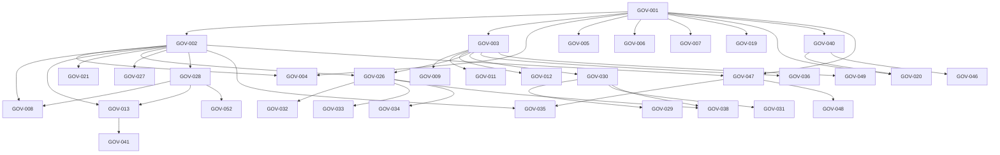

# 06 — Dependency Graph

```yaml
document: Dependency Graph
version: P7 Governance v1.0
nodes: 170
edges: 492
topo_sort: complete
```

## Legend

Edge `A → B` means B `depends_on` A (A is prerequisite).

## Highest fan-in (most depended-upon)

| GOV ID | Fan-in | Title |
|--------|--------|-------|
| GOV-028 | 16 | Capture first, structure later |
| GOV-001 | 15 | Personal Life OS category lock |
| GOV-040 | 14 | Shared primitives across surfaces |
| GOV-003 | 13 | Brand frame — Human Momentum |
| GOV-047 | 13 | AI-first means NL intent + derived structure |
| GOV-002 | 12 | Vision lock — Capture once |
| GOV-029 | 12 | Read surfaces stay calm |
| GOV-112 | 10 | Motion purpose allowlist — feedback, continuity, hierarchy, state |
| GOV-030 | 9 | Emotional contract triad |
| GOV-013 | 8 | Phone web /m capture-only ceiling |
| GOV-020 | 8 | One primitive, many surfaces |
| GOV-026 | 8 | Optimize / avoid matrix |
| GOV-056 | 8 | Cognitive accessibility under load |
| GOV-066 | 8 | Ceremony-free Enter/primary save on every capture path |
| GOV-126 | 8 | Infer then chip — correction chips are first-class UI |
| GOV-142 | 8 | Components encode behavior contracts — not duplicate cards |
| GOV-153 | 8 | Growth axiom — identity invariant; modality variable; ceiling intentional |
| GOV-036 | 7 | Palette identity non-negotiable |
| GOV-015 | 7 | Destructive actions must confirm |
| GOV-031 | 7 | Emotional refuse list |
| GOV-136 | 7 | AI is mixed-initiative layer — not chatbot-on-forms; one tap from correction |
| GOV-004 | 6 | Three existence outcomes |
| GOV-035 | 6 | Correctable inference; no silent wrongness |
| GOV-033 | 6 | Interruptibility; no JITAI nag loops |
| GOV-032 | 6 | Progressive disclosure by stakes |

## Highest fan-out (most prerequisites)

| GOV ID | Fan-out | Title |
|--------|---------|-------|
| GOV-157 | 7 | Voice modality — Palette intent-router philosophy; correction path; coaching sparingly |
| GOV-137 | 6 | Confidence band thresholds — ≥70 auto; 40–70 confirm; <40 ask; safety never infer |
| GOV-139 | 6 | Capture AI input stack order — intent → entities → Kill List → write → telemetry → coaching window |
| GOV-150 | 6 | Navigation components obey locks — BrandLockup split and device-tier shells |
| GOV-158 | 6 | Wearables / passive sensing — opt-in; on-device preference; no silent clinical; not fitness-app takeover |
| GOV-160 | 6 | Multi-device design evolution — extend tokens by role; no per-device Constitution forks; Constitution arbitrates drift |
| GOV-170 | 6 | Global Capture FAB sheet is primary capture path |
| GOV-103 | 5 | New entities must declare IA contract (layer, write owner, edges, ceiling, blueprint) |
| GOV-116 | 5 | Never delay capture — animate after commit, not before |
| GOV-123 | 5 | Reduce decisions — defer choice; infer with correction before asking |
| GOV-125 | 5 | Optimistic where safe; branded confirm where destructive |
| GOV-126 | 5 | Infer then chip — correction chips are first-class UI |
| GOV-127 | 5 | Capture beats navigation — Palette/Logger outrank deep-link tourism |
| GOV-130 | 5 | Forms are a last resort — NL + chips + progressive fields default |
| GOV-134 | 5 | Device-appropriate gestures — platform conventions win |

## Cycle fixes (Finalization)

| Cycle | Fix |
|-------|-----|
| GOV-035 ↔ GOV-048 ↔ GOV-051 | GOV-035 depends_on → GOV-002, GOV-047; GOV-051 → GOV-035 only |
| GOV-077 ↔ GOV-089 | GOV-077 depends_on → GOV-062 only; GOV-089 keeps GOV-077 |

Decision text unchanged.

## Mermaid (top fan-in core)



## Full edge list

Machine-readable: each decision `depends_on` in `02_MASTER_DECISION_REGISTRY.json`.
