# AIIMIN — Complete Product Intelligence

**Merged:** 2026-07-11
**Purpose:** Single-file handoff for agents (like COMPLETE_INTERACTION_AUDIT.md)

> Source files preserved in `docs/product-intelligence/` and `docs/AIIMIN_PRODUCT_BIBLE/`.

---

## Table of Contents

1. [Phase 2 — Product Intelligence Layer](#product_intelligence_layer)
2. [Phase 3 — Information Graph](#information_graph)
3. [Phase 4 — Human Intent Graph](#human_intent_graph)
4. [Phase 5 — Kill List](#things_aiimin_should_stop_asking)
5. [Phase 6 — Future AIIMIN Framework](#future_aimin_framework)
6. [Phase 7 — Research Foundations](#research_foundations)
7. [Bonus — Interaction Compression Score](#interaction_compression_score)
8. [Product Bible — 00_INDEX](#product-bible-00_index)
9. [Product Bible — 01_VISION](#product-bible-01_vision)
10. [Product Bible — 02_PHILOSOPHY](#product-bible-02_philosophy)
11. [Product Bible — 03_HUMAN_PROBLEMS](#product-bible-03_human_problems)
12. [Product Bible — 04_INFORMATION_MODEL](#product-bible-04_information_model)
13. [Product Bible — 05_INTERACTION_MODEL](#product-bible-05_interaction_model)
14. [Product Bible — 06_AI_MODEL](#product-bible-06_ai_model)
15. [Product Bible — 07_AUTOMATION_RULES](#product-bible-07_automation_rules)
16. [Product Bible — 08_DATA_GRAPH](#product-bible-08_data_graph)
17. [Product Bible — 09_USER_JOURNEY](#product-bible-09_user_journey)
18. [Product Bible — 10_RESEARCH](#product-bible-10_research)
19. [Product Bible — 11_EXPERIMENTS](#product-bible-11_experiments)
20. [Product Bible — 12_METRICS](#product-bible-12_metrics)
21. [Product Bible — 13_PRODUCT_PRINCIPLES](#product-bible-13_product_principles)
22. [Product Bible — 14_FUTURE_IDEAS](#product-bible-14_future_ideas)
23. [Product Bible — 15_THINGS_NEVER_TO_BUILD](#product-bible-15_things_never_to_build)

---

<a id="product_intelligence_layer"></a>

## Source: `docs/product-intelligence/PRODUCT_INTELLIGENCE_LAYER.md`

# AIIMIN — Product Intelligence Layer (Phase 2)

**Status:** Complete product intelligence pass  
**Date:** 2026-07-11  
**Source:** `docs/interaction-audit/fields.md`, `forms.md`, `friction.md`, `duplicate_patterns.md`, vault feature notes  
**Field count:** 94 documented fields (80 from master field table + 14 audit-discovered)

---

## Purpose

This document answers, for every user-facing field AIIMIN collects, why it exists, which product surfaces consume it, how important it is, whether AI can infer it, what passive signals could replace manual entry, engineering cost, privacy cost, and the recommended future interaction pattern.

**Consumers referenced throughout:** Overview/Today, Daily Log, Journal, Habits, Goals, Finance, Calendar, Family Vault, Focus/Pomodoro, Discipline, Notes, Insights, Reports, Life Score (teaser/marketing + future composite), Command Palette AI, Universal Logger, Gamification (XP/ranks/quests), Identity/Arc, Placements, Lab modules, Account/Settings, Waitlist.

**Importance scale (1–10):** 10 = product breaks without it; 1 = cosmetic or rarely used.

**AI infer %:** Estimated confidence that a well-instrumented AIIMIN could populate the field without asking, given current + near-term signals.

---

## Summary Matrix by Feature

| Feature | Fields | Avg Importance | Avg AI Infer % | Top Kill Candidates |
|---------|-------:|---------------:|---------------:|---------------------|
| Auth | 5 | 9.0 | 15% | — (security) |
| Onboarding | 6 | 7.5 | 55% | wakeTime, selectedHabits[] |
| Waitlist | 2 | 6.0 | 75% | name |
| Daily Log | 14 | 7.2 | 62% | mood, gym, learning_hours |
| Journal | 3+ | 8.5 | 70% | mood, mode fields |
| Habits | 5 | 7.0 | 35% | category, color, emoji |
| Goals | 6 | 8.0 | 45% | priority, pillar, title |
| Finance | 6 | 8.5 | 68% | category, type, date |
| Calendar | 5 | 7.5 | 55% | title, allDay, recurrence |
| Family | 10 | 6.5 | 25% | document.label |
| Placements | 8 | 6.0 | 50% | stage, application_date |
| Focus | 3 | 6.5 | 45% | rating, linked goalId |
| Discipline | 3 | 7.0 | 50% | intensity, replacement_habit |
| Notes | 2 | 5.5 | 65% | title |
| Account | 4 | 5.0 | 60% | location, bio |
| Settings | 3 | 4.5 | 75% | theme, pinnedNav[], persona |
| Feedback | 2 | 4.0 | 55% | category |
| Lab Addiction | 3 | 5.0 | 35% | intensity |
| Command Palette | 2 | 9.0 | 85% | — (capture is the point) |

---

## Auth

| Field | Why exists? | Features that consume it | Importance | Could AI infer? | Passive signals | Engineering effort | Privacy cost | Remove completely? | Ask later? | Auto update? | Future interaction |
|-------|-------------|--------------------------|------------|-----------------|-----------------|-------------------|--------------|-------------------|------------|--------------|-------------------|
| email | Identity anchor, recovery, waitlist correlation | Auth, Waitlist, Account, all API scoping | 10 | 15% (OAuth only) | OAuth profile email | Low | Medium (PII) | No | No | Partial (OAuth) | OAuth-first; email only on fallback path |
| password | Email auth credential | Auth | 9 | 0% | — | Low | High (secret) | No (if email auth kept) | No | No | Passkey/WebAuthn primary; password optional |
| confirmPassword | Prevent typo on signup | Auth | 7 | 0% | — | Low | Medium | Yes (with passkey) | No | No | Eliminate with magic link / passkey |
| PIN (4) | Fast re-auth on return visits | Auth, session guard | 8 | 0% | Biometric | Medium | Medium | Partial | No | No | OS biometric replaces PIN |
| PIN (6) | Onboarding security ritual | Onboarding | 7 | 0% | Biometric | Medium | Medium | Partial | No | No | Defer to Settings; biometric default |

---

## Onboarding

| Field | Why exists? | Features that consume it | Importance | Could AI infer? | Passive signals | Engineering effort | Privacy cost | Remove completely? | Ask later? | Auto update? | Future interaction |
|-------|-------------|--------------------------|------------|-----------------|-----------------|-------------------|--------------|-------------------|------------|--------------|-------------------|
| fullName | Display identity, personalization | Account, Navbar, Reports header, Family emergency card | 8 | 85% | OAuth name, email parse | Low | Low | No | Yes (post-OAuth) | Yes (OAuth) | Prefill silently; confirm only if empty |
| username | Unique handle, social future | Account, leaderboard (future) | 6 | 55% | Email local-part | Medium (availability API) | Low | Partial | Yes | No | Auto-suggest; skip if OAuth-only |
| selectedGoals[] | Bootstrap Goals pillar + Insights domains | Goals, Insights, Life Score, Onboarding persona | 8 | 60% | First-week behavior, journal NLP | Medium | Low | Partial | Yes | Yes (behavior) | Infer from first captures; offer edit |
| selectedHabits[] | Seed Habits page | Habits, Overview widgets, Gamification streaks | 7 | 55% | Goals mapping, calendar blocks | Medium | Low | Partial | Yes | Yes | Create habits from inferred routines |
| wakeTime | Morning briefing, habit reminders | Calendar suggestions, Focus scheduling (future) | 5 | 45% | First app open time, sleep log | Low | Low | Yes | Yes | Yes | Infer from 7-day open pattern |
| lifeArc | North-star identity statement | Identity page, ArcBanner, Insights narrative, Reports | 8 | 50% | Goals + journal themes over 2 weeks | Medium | Medium (personal) | No | Yes | Yes (AI draft) | AI drafts arc from captures; user edits once |

---

## Waitlist

| Field | Why exists? | Features that consume it | Importance | Could AI infer? | Passive signals | Engineering effort | Privacy cost | Remove completely? | Ask later? | Auto update? | Future interaction |
|-------|-------------|--------------------------|------------|-----------------|-----------------|-------------------|--------------|-------------------|------------|--------------|-------------------|
| email | Waitlist queue, confirmation email | Waitlist, Auth handoff | 9 | 90% | Browser autofill | Low | Medium | No | No | No | Single field submit |
| name | Personalize confirmation email | Waitlist email templates | 4 | 60% | OAuth if logged in | Low | Low | Yes | Yes | Partial | Optional collapsed field |

---

## Daily Log

*Includes fields from `fields.md` plus audit-discovered metrics from Daily Log MOC.*

| Field | Why exists? | Features that consume it | Importance | Could AI infer? | Passive signals | Engineering effort | Privacy cost | Remove completely? | Ask later? | Auto update? | Future interaction |
|-------|-------------|--------------------------|------------|-----------------|-----------------|-------------------|--------------|-------------------|------------|--------------|-------------------|
| mood | Emotional baseline for day | Overview, Insights, Life Score, Reports, Journal sync, Discipline context | 8 | 75% | Journal NLP, voice tone, typing speed | Medium | Medium | Partial | Yes | Yes | Infer from journal; mood strip optional confirm |
| sleep_hours | Recovery metric | Overview, Insights, Life Score, Reports | 7 | 70% | Wearable, phone idle, bedtime calendar | Medium | Low | Partial | Yes | Yes | HealthKit/Oura import; manual override |
| gym | Physical activity flag | Overview, Habits cross-check, Life Score, Reports | 6 | 50% | Calendar "gym" events, location, habit toggle | Low | Low | Partial | Yes | Yes | Infer from habit + calendar |
| learning_hours | Growth metric | Overview, Insights, Goals (learning pillar) | 6 | 65% | Focus timer duration, DSA logs | Medium | Low | Partial | Yes | Yes | Auto-sum from Focus sessions |
| breakfast | Nutrition rhythm (desktop) | Overview, Reports | 4 | 40% | Time-of-day log patterns | Low | Low | Yes | Yes | Partial | Remove from daily form; infer rarely |
| steps | Movement proxy | Overview, Reports | 5 | 85% | Phone/wearable pedometer | Medium | Low | Partial | Yes | Yes | Passive import default |
| water | Hydration tracking | Overview | 4 | 30% | — | Low | Low | Yes | Yes | No | Kill or smart-watch only |
| energy | Subjective vitality | Overview, Insights correlations | 6 | 60% | Sleep + mood model | Low | Low | Partial | Yes | Yes | Infer; tap only if wrong |
| brain_fog | Cognitive load signal | Overview, Discipline, Insights | 5 | 55% | Session abandon rate, typing errors | Medium | Medium | Partial | Yes | Yes | NLP from journal |
| headache | Health symptom | Overview, Reports | 4 | 40% | — | Low | Medium | Yes | Yes | No | Voice capture only when mentioned |
| wins | Positive events | Overview, Command Palette win log, Gamification XP | 7 | 70% | Journal sentiment, palette logs | Medium | Low | Partial | No | Yes | Unified win capture router |
| DSA | Coding practice count | Overview, Lab DSACounter, Goals | 6 | 80% | Lab session auto-log | Low | Low | Partial | Yes | Yes | Auto from Lab module |
| reset_counter | Discipline/clean streak | Overview, Discipline, Gamification | 7 | 60% | Discipline logs, habit failures | Medium | Medium | Partial | No | Yes | System-maintained streak |
| journal (link) | Cross-link daily reflection | Overview → Journal | 6 | 90% | Journal entry existence | Low | Low | Yes | No | Yes | Auto-link if journal saved |

---

## Journal

| Field | Why exists? | Features that consume it | Importance | Could AI infer? | Passive signals | Engineering effort | Privacy cost | Remove completely? | Ask later? | Auto update? | Future interaction |
|-------|-------------|--------------------------|------------|-----------------|-----------------|-------------------|--------------|-------------------|------------|--------------|-------------------|
| body | Primary reflective capture | Journal, Insights NLP, Life Score narrative, Reports excerpts, Command Palette routing | 10 | 0% (user content) | Voice STT | Low | High (encrypted) | No | No | No | Single capture bar; no mode gate |
| mood | Entry-level emotion | Journal, Daily Log sync, Insights, duplicate 5 surfaces | 7 | 80% | Sentiment NLP on body | Medium | Medium | Partial | Yes | Yes | Infer; show chip to correct |
| mode fields (CBT) | Structured therapeutic prompts | Journal structured modes, Insights tags | 5 | 55% | Sentiment + topic classification | High | High | Partial | Yes | Yes | AI applies CBT tags post-capture |

---

## Habits

| Field | Why exists? | Features that consume it | Importance | Could AI infer? | Passive signals | Engineering effort | Privacy cost | Remove completely? | Ask later? | Auto update? | Future interaction |
|-------|-------------|--------------------------|------------|-----------------|-----------------|-------------------|--------------|-------------------|------------|--------------|-------------------|
| name | Habit identity | Habits, Overview, Gamification streaks, Discipline replacement | 9 | 0% | — | Low | Low | No | No | No | Natural language create: "meditate 10m" |
| emoji | Visual scan aid | Habits list, Overview chips | 3 | 25% | Name semantics | Low | None | Yes | Yes | Yes | Auto-assign from name |
| category | Grouping/filter | Habits matrix, Insights | 4 | 60% | Name NLP ("run" → fitness) | Low | Low | Yes | Yes | Yes | Infer category silently |
| color | Visual differentiation | Habits UI | 2 | 20% | Category palette | Low | None | Yes | Yes | Yes | System palette from category |
| description | Context for future self | Habits detail, AI recommendations | 4 | 50% | Name expansion | Low | Low | Yes | Yes | Yes | AI-generated description optional |

---

## Goals

| Field | Why exists? | Features that consume it | Importance | Could AI infer? | Passive signals | Engineering effort | Privacy cost | Remove completely? | Ask later? | Auto update? | Future interaction |
|-------|-------------|--------------------------|------------|-----------------|-----------------|-------------------|--------------|-------------------|------------|--------------|-------------------|
| title | Goal identity | Goals, Focus link, Insights, Reports, Life Score | 9 | 30% | User must name intent | Low | Low | Partial | No | No | NL capture: "Ship AIIMIN by Sep" parses title |
| pillar | Life domain taxonomy (4 pillars) | Goals filter, Insights domain, Reports segmentation | 7 | 55% | Title NLP, journal themes | Low | Low | Partial | Yes | Yes | Infer pillar; show badge |
| priority | Sorting/attention | Goals sort, Command Palette suggestions | 5 | 50% | Deadline proximity, mention frequency | Low | Low | Yes | Yes | Yes | **Kill** — infer from behavior |
| targetDate | Deadline pressure | Goals, Calendar suggestions, Reports | 7 | 45% | Milestone dates, NLP "by Friday" | Medium | Low | Partial | Yes | Yes | Parse from natural language |
| why | Motivation anchor | Goals detail, Identity arc, Insights coaching | 6 | 50% | Title + journal | Low | Medium | Partial | Yes | Yes | AI drafts "why" from captures |
| milestones[].text | Progress decomposition | Goals progress %, Life Score, Reports | 7 | 65% | AI decomposition of goal title | Medium | Low | Partial | Yes | Yes | AI proposes milestones; user confirms |

---

## Finance

| Field | Why exists? | Features that consume it | Importance | Could AI infer? | Passive signals | Engineering effort | Privacy cost | Remove completely? | Ask later? | Auto update? | Future interaction |
|-------|-------------|--------------------------|------------|-----------------|-----------------|-------------------|--------------|-------------------|------------|--------------|-------------------|
| amount | Transaction value | Finance, Reports, Life Score (money pillar), Insights | 10 | 0% | Receipt OCR | Low | Medium | No | No | Partial (OCR) | Voice: "spent 450 on groceries" |
| type | Income vs expense | Finance charts, Reports, budgets | 8 | 70% | Sign, merchant type, NLP | Low | Low | Partial | Yes | Yes | Infer from phrasing |
| category | Budget segmentation | Finance, Reports, Insights spending patterns | 8 | 85% | Merchant NLP, note, history | Medium | Low | Partial | Yes | Yes | **Kill manual default** — confirm chip |
| account | Account attribution | Finance multi-account, net worth | 7 | 65% | Last-used account, merchant | Low | Low | Partial | Yes | Yes | Default last account |
| date | Temporal accuracy | Finance, Reports, tax export | 8 | 95% | Today default, SMS timestamp | Low | Low | Partial | No | Yes | Default today; change rare |
| note | Context/memo | Finance search, AI categorization | 5 | 60% | Receipt OCR, voice | Low | Medium | Partial | Yes | Yes | Optional voice tail on amount |

---

## Calendar

| Field | Why exists? | Features that consume it | Importance | Could AI infer? | Passive signals | Engineering effort | Privacy cost | Remove completely? | Ask later? | Auto update? | Future interaction |
|-------|-------------|--------------------------|------------|-----------------|-----------------|-------------------|--------------|-------------------|------------|--------------|-------------------|
| title | Event identity | Calendar, Overview today strip, Focus scheduling | 9 | 40% | NLP quick-add | Low | Low | Partial | No | Partial | Quick-add NL: "dentist 3pm" |
| start/end | Temporal bounds | Calendar, Habits time blocks, Reports time use | 9 | 55% | Duration defaults, NLP | Medium | Low | No | No | Partial | Infer end = start + 1h default |
| allDay | Full-day events | Calendar views | 5 | 70% | Missing time in NLP | Low | None | Partial | Yes | Yes | Infer when no time parsed |
| recurrence | Repeating events | Calendar, Habits rhythm | 6 | 30% | Habit patterns | Medium | Low | Partial | Yes | No | Ask only when pattern detected |
| color | Visual category | Calendar UI | 3 | 50% | Event type/pillar | Low | None | Yes | Yes | Yes | System color from inferred category |

---

## Family Vault

| Field | Why exists? | Features that consume it | Importance | Could AI infer? | Passive signals | Engineering effort | Privacy cost | Remove completely? | Ask later? | Auto update? | Future interaction |
|-------|-------------|--------------------------|------------|-----------------|-----------------|-------------------|--------------|-------------------|------------|--------------|-------------------|
| member.name | Identity | Family, emergency card | 9 | 0% | — | Low | Medium | No | No | No | Required once per member |
| member.relation | Relationship graph | Family, emergency card | 7 | 10% | — | Low | Low | No | No | No | Keep — legal/emergency context |
| member.DOB | Age calculations | Family, emergency | 6 | 5% | — | Low | Medium | Partial | Yes | No | Ask when adding dependent |
| member.blood_group | Medical emergency | Emergency card | 7 | 0% | — | Low | High (health) | No | Yes | No | Progressive disclosure emergency flow |
| member.phone | Contact | Emergency card | 7 | 40% | Contacts API (opt-in) | Medium | Medium | Partial | Yes | No | Import from contacts optional |
| document.file | Vault storage | Family docs | 8 | 0% | — | Medium | High | No | No | No | Upload required; metadata inferred |
| document.label | Doc findability | Family search | 5 | 70% | Filename, OCR | Low | Low | Partial | Yes | Yes | Auto-label from filename/OCR |
| emergency.contacts[] | Crisis reach | Emergency card export | 9 | 50% | Member phones | Medium | High | No | Yes | Partial | Pre-fill from members |
| emergency.meds[] | Medical safety | Emergency card | 8 | 10% | — | Low | High | No | Yes | No | Ask in emergency wizard only |
| emergency.allergies | Medical safety | Emergency card | 8 | 10% | — | Low | High | No | Yes | No | Same wizard; not onboarding |

---

## Placements / Career

| Field | Why exists? | Features that consume it | Importance | Could AI infer? | Passive signals | Engineering effort | Privacy cost | Remove completely? | Ask later? | Auto update? | Future interaction |
|-------|-------------|--------------------------|------------|-----------------|-----------------|-------------------|--------------|-------------------|------------|--------------|-------------------|
| company | Application identity | Placements pipeline, Reports | 8 | 20% | Email domain parse | Low | Low | No | No | Partial | Paste job URL → scrape company |
| role | Position title | Placements, ATS, Insights career | 8 | 55% | JD paste, email subject | Low | Low | Partial | Yes | Partial | Parse from JD |
| stage | Pipeline status | Placements kanban, Reports funnel | 7 | 40% | Email parse (interview invite) | Medium | Low | Partial | Yes | Yes | AI suggests stage moves |
| application_date | Timeline | Placements, Reports | 5 | 90% | Today default | Low | None | Partial | Yes | Yes | Default today |
| notes | Freeform context | Placements detail | 5 | 50% | AI from emails | Low | Medium | Partial | Yes | Yes | Voice note post-capture |
| link | Job posting URL | Placements, ATS fetch | 6 | 60% | Clipboard | Low | Low | Partial | Yes | Partial | Auto-detect clipboard URL |
| resume PDF | ATS analysis input | Lab ATS, Placements | 7 | 0% | — | Medium | High | No | No | No | Upload once; reuse |
| job description | ATS match | Lab ATS analyzer | 7 | 55% | URL fetch | Medium | Low | Partial | Yes | Partial | Fetch from link |

---

## Focus / Pomodoro

| Field | Why exists? | Features that consume it | Importance | Could AI infer? | Passive signals | Engineering effort | Privacy cost | Remove completely? | Ask later? | Auto update? | Future interaction |
|-------|-------------|--------------------------|------------|-----------------|-------------------|--------------|-------------------|------------|--------------|-------------------|
| session rating | Subjective quality | Focus analytics, Insights | 5 | 45% | Duration, abandon rate | Low | Low | Yes | Yes | Partial | Optional 1-tap post-session |
| session notes | Reflection | Focus history, Journal routing | 4 | 50% | AI summary of session | Low | Medium | Yes | Yes | Yes | AI drafts from app focus context |
| linked goalId | Attribution | Goals progress, Life Score | 6 | 60% | Last active goal, calendar | Low | Low | Partial | Yes | Yes | Default to inferred active goal |

---

## Discipline

| Field | Why exists? | Features that consume it | Importance | Could AI infer? | Passive signals | Engineering effort | Privacy cost | Remove completely? | Ask later? | Auto update? | Future interaction |
|-------|-------------|--------------------------|------------|-----------------|-----------------|-------------------|--------------|-------------------|------------|--------------|-------------------|
| trigger | Urge context | Discipline logs, Insights patterns, replacement coaching | 8 | 45% | Time, location, mood, calendar gaps | Medium | High | No | No | Partial | Voice capture: "urge after meeting" |
| intensity | Urge strength 1–10 | Discipline analytics | 5 | 30% | — | Low | Medium | Yes | Yes | No | Optional; default mid if skipped |
| replacement_habit | Positive redirect | Habits link, coaching | 6 | 55% | Habit list, past success | Low | Low | Partial | Yes | Yes | Suggest top replacement habit |

---

## Notes

| Field | Why exists? | Features that consume it | Importance | Could AI infer? | Passive signals | Engineering effort | Privacy cost | Remove completely? | Ask later? | Auto update? | Future interaction |
|-------|-------------|--------------------------|------------|-----------------|-----------------|-------------------|--------------|-------------------|------------|--------------|-------------------|
| title | Note organization | Notes list, search | 4 | 85% | First line of body | Low | Low | Yes | Yes | Yes | **Kill** — derive from body |
| body | Content | Notes, Command Palette routing, search | 8 | 0% | — | Low | Medium | No | No | No | Inline capture; title auto |

---

## Account

| Field | Why exists? | Features that consume it | Importance | Could AI infer? | Passive signals | Engineering effort | Privacy cost | Remove completely? | Ask later? | Auto update? | Future interaction |
|-------|-------------|--------------------------|------------|-----------------|-------------------|--------------|-------------------|------------|--------------|-------------------|
| displayName | Social display | Navbar, Reports, waitlist | 6 | 85% | OAuth, onboarding fullName | Low | Low | Partial | Yes | Yes | Sync from OAuth silently |
| location | Profile context | Account, future Insights | 3 | 50% | IP geo ( coarse ) | Low | Medium | Yes | Yes | Partial | Infer city; confirm once |
| bio | Profile narrative | Account | 3 | 45% | Journal/arc themes | Low | Medium | Yes | Yes | Yes | AI draft optional |
| avatar | Visual identity | Navbar, Account | 4 | 70% | OAuth picture | Low | Low | Partial | Yes | Yes | OAuth import default |

---

## Settings

| Field | Why exists? | Features that consume it | Importance | Could AI infer? | Passive signals | Engineering effort | Privacy cost | Remove completely? | Ask later? | Auto update? | Future interaction |
|-------|-------------|--------------------------|------------|-----------------|-----------------|-------------------|--------------|-------------------|------------|--------------|-------------------|
| theme | Light/dark preference | Global UI | 5 | 90% | OS `prefers-color-scheme` | Low | None | Partial | Yes | Yes | **System** — follow OS; override in settings |
| pinnedNav[] | Nav personalization | Navbar, BottomNav | 5 | 65% | Route visit frequency | Medium | None | Partial | Yes | Yes | Auto-pin top 5 visited routes |
| persona preset | Layout/widget preset | Account personalization, Overview widgets | 4 | 55% | Usage clusters | Medium | None | Partial | Yes | Yes | Infer persona; offer change |

---

## Feedback

| Field | Why exists? | Features that consume it | Importance | Could AI infer? | Passive signals | Engineering effort | Privacy cost | Remove completely? | Ask later? | Auto update? | Future interaction |
|-------|-------------|--------------------------|------------|-----------------|-----------------|-------------------|--------------|-------------------|------------|--------------|-------------------|
| message | User feedback content | Product feedback pipeline | 7 | 0% | — | Low | Medium | No | No | No | Free text required |
| category | Feedback routing | Feedback triage | 4 | 70% | Current page/route | Low | None | Yes | Yes | Yes | Infer from page context |

---

## Lab — Addiction Tracker

| Field | Why exists? | Features that consume it | Importance | Could AI infer? | Passive signals | Engineering effort | Privacy cost | Remove completely? | Ask later? | Auto update? | Future interaction |
|-------|-------------|--------------------------|------------|-----------------|-----------------|-------------------|--------------|-------------------|------------|--------------|-------------------|
| substance | Craving type | Lab analytics, Discipline cross-ref | 7 | 0% | — | Low | High | No | No | No | Required for logging |
| intensity | Craving strength | Lab trends | 4 | 25% | — | Low | Medium | Yes | Yes | No | Optional slider |
| trigger | Craving context | Discipline patterns, Insights | 6 | 45% | Time/mood/calendar | Medium | High | Partial | Yes | Partial | Shared trigger field with Discipline |

---

## Command Palette

| Field | Why exists? | Features that consume it | Importance | Could AI infer? | Passive signals | Engineering effort | Privacy cost | Remove completely? | Ask later? | Auto update? | Future interaction |
|-------|-------------|--------------------------|------------|-----------------|-----------------|-------------------|--------------|-------------------|------------|--------------|-------------------|
| ai_log text | Universal NL capture | Routes to journal/win/mood/task/finance via AI classifier | 10 | 50% (classification) | — | High | High | No | No | No | Primary AI-first input surface |
| win/note text | Quick structured capture | Overview wins, Notes, Journal | 8 | 0% | — | Low | Medium | Partial | No | No | Merge into ai_log single field |

---

## Cross-Feature Intelligence Rules

### Fields that must never be inferred without consent
- password, PIN digits, emergency meds/allergies, substance (addiction), member blood group

### Fields safe to infer silently (with correction chip)
- theme, date (finance), category (finance), mood, pillar, priority, habit category/color/emoji, note title

### Fields that should become system-maintained
- pinnedNav[], learning_hours (from Focus), DSA count (from Lab), reset_counter, steps, sleep (wearable)

### Highest ROI automation (importance × infer %)
1. Finance category (8 × 85%)
2. Command Palette ai_log routing (10 × 50% classification + 85% field elimination downstream)
3. Journal mood (7 × 80%)
4. Notes title (4 × 85%)
5. Settings theme (5 × 90%)

---

## Related Documents

- [[INFORMATION_GRAPH]] — entity relationships
- [[things_aiimin_should_stop_asking]] — kill/infer verdicts
- [[INTERACTION_COMPRESSION_SCORE]] — flow compression targets
- `docs/interaction-audit/fields.md` — source field inventory

---

<a id="information_graph"></a>

## Source: `docs/product-intelligence/INFORMATION_GRAPH.md`

# AIIMIN — Information Graph (Phase 3)

**Status:** Data-centric relationship model  
**Date:** 2026-07-11  
**Scope:** Conceptual entity graph — not UI navigation

---

## Purpose

This document maps how AIIMIN's life data entities relate, what feeds what, and which product surfaces consume derived intelligence. The graph is **data-first**: nodes are persistent or derived records; edges are creates, updates, aggregates, or AI inferences.

---

## Master Entity Graph

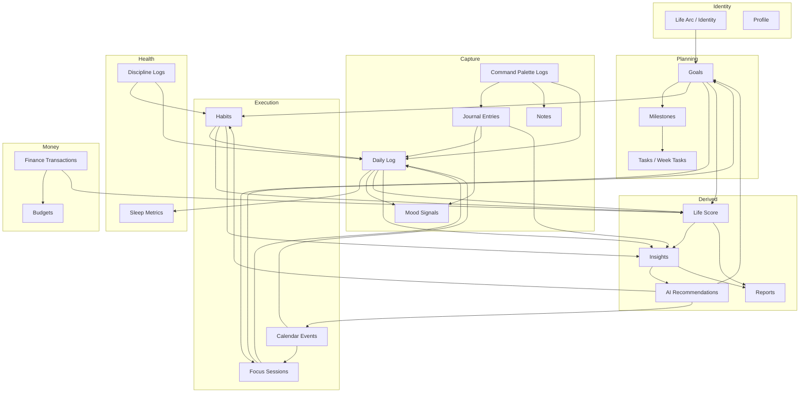

---

## Entity Definitions

| Entity | Primary storage | Created by | Updated by |
|--------|-----------------|------------|------------|
| **Life Arc** | Profile / identity | Onboarding, Identity page | User edit, AI draft refresh |
| **Goals** | `goals` table + local cache | Goals modal, onboarding seeds | Milestone completion, status AI |
| **Milestones** | Embedded in goals | Goal create, AI propose | Toggle complete |
| **Tasks** | Week tasks local + calendar | Calendar, quick-add, AI | Complete toggle |
| **Habits** | `habits` table | Onboarding seeds, create modal | Daily toggle |
| **Calendar Events** | `events` + Google sync | EventModal, quick-add, Google pull | Edit, recurrence engine |
| **Journal Entries** | `journal_entries` (encrypted body) | Journal capture, Command Palette | Mood amend, AI analyze |
| **Daily Log** | `daily_logs` | Overview form, mobile capture, inferred | End-of-day sync |
| **Mood** | Journal + daily_log + discipline | 5 duplicate UI surfaces | Should unify to single primitive |
| **Focus Sessions** | Focus/Pomodoro store | Timer complete | Reflection optional |
| **Finance Transactions** | Supabase money tables | EntryForm, voice capture | Edit, delete |
| **Discipline Logs** | Discipline store | Trigger modal | Pattern aggregation |
| **Notes** | localStorage + API | Notes inline, Command Palette | Edit, delete |
| **Life Score** | Derived composite (marketing teaser + future) | Nightly batch / on-save | Recompute on habit/journal/finance |
| **Insights** | AI-generated copy + filters | Scheduled + on-demand | Domain filter |
| **Reports** | Period aggregations | User period select | Export |
| **AI Recommendations** | Ephemeral + notification | Insights, Command Palette, Monday widget | User accept/dismiss |

---

## Data Flow: Goal → Life Score

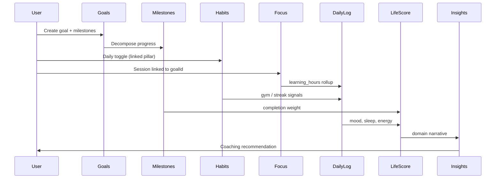

**Feeds Life Score today (conceptual weights):**
- Habits completion rate → consistency pillar
- Goals milestone progress → direction pillar
- Daily log mood/sleep → wellbeing pillar
- Finance net flow → stability pillar
- Journal frequency → reflection depth modifier

---

## Data Flow: Journal → Mood → Insights

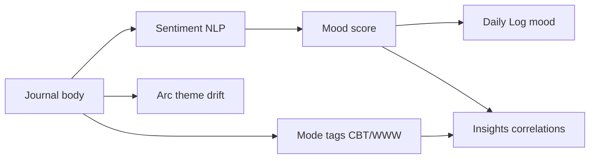

**Friction note:** Mood is captured independently on Journal, Daily Log, Command Palette, MoodTracker, and Discipline — five surfaces writing related signals. Consolidation target: single `mood_primitive` synced everywhere.

---

## Data Flow: Calendar ↔ Habits ↔ Focus

| Source | Target | Relationship |
|--------|--------|--------------|
| Calendar recurring "gym" | Habit gym toggle | Infer completion (future) |
| Habit scheduled time | Calendar block suggestion | AI proposes block |
| Focus session | Calendar "focus" event | Optional back-write |
| Calendar meeting density | Focus abandon risk | Insights warning |
| Wake time (onboarding) | Calendar morning briefing | Notification scheduling |

---

## Data Flow: Finance → Reports → Life Score

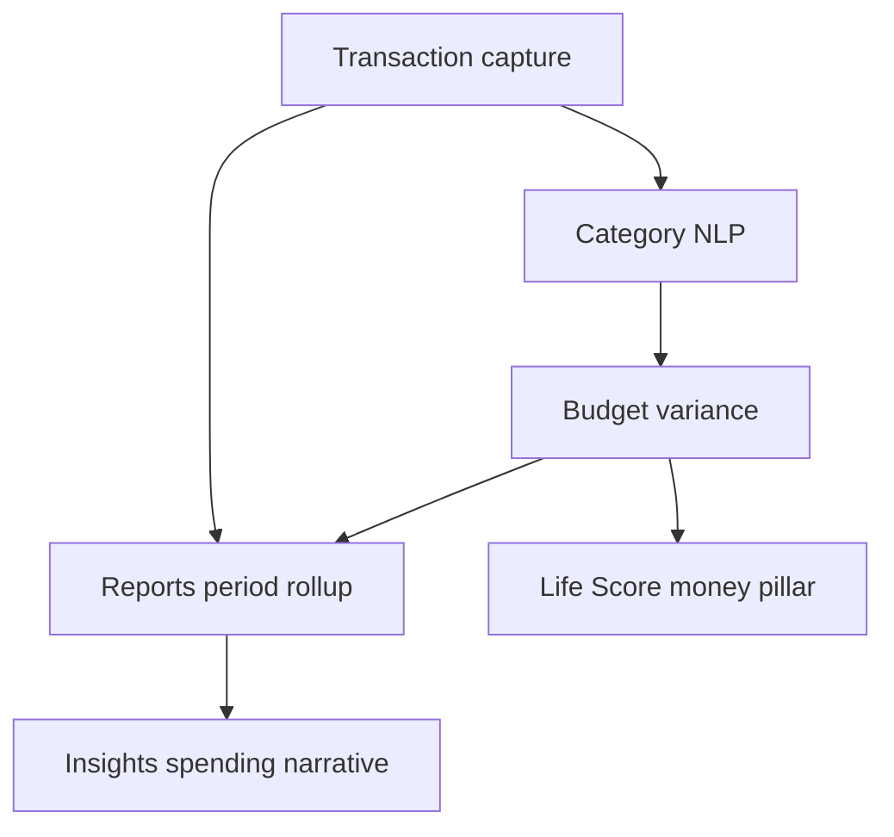

---

## API / Table Connections (Conceptual)

| Entity | Table / API group | Downstream readers |
|--------|-------------------|-------------------|
| Goals | `goals`, goals API | Focus, Insights, Reports, Life Score |
| Habits | `habits`, habits API | Overview, Gamification, Daily Log |
| Journal | `journal_entries`, journal API | Insights AI analyze, Daily Log mood |
| Daily Log | `daily_logs`, daily-logs API | Overview, Insights, Reports, Life Score |
| Finance | money tables, finance routes | Reports, Insights, budgets |
| Calendar | `events`, calendar + Google sync | Overview today, Focus |
| Family | members, documents, emergency | Emergency export only (not Life Score) |
| Placements | applications pipeline | Career Insights (future) |
| Discipline | discipline logs | Insights patterns, replacement habits |
| Command Palette | multi-table router | Journal, notes, wins, tasks, finance |

---

## AI Inference Layer (Overlay)

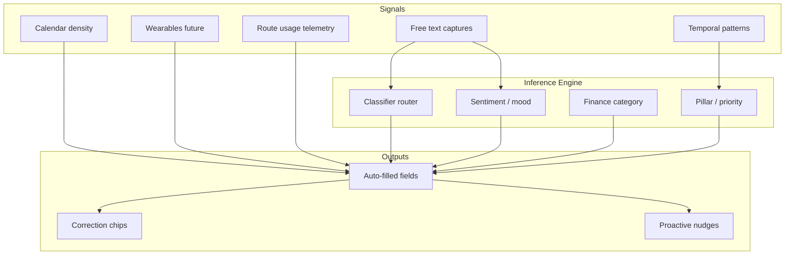

---

## Orphan / High-Friction Nodes

| Node | Issue | Resolution |
|------|-------|------------|
| Mood (5 surfaces) | Duplicate writes, inconsistent scale | Unify mood primitive |
| Life Arc (3 editors) | Same content in Onboarding, Identity, Profile | Single source of truth |
| Theme (3 pickers) | Login, Settings, Account | OS sync once |
| PIN (3 flows) | 4-digit vs 6-digit confusion | Biometric + unified PIN |
| Placements vs Lab ATS | Resume upload duplicated | Shared resume vault |

---

## Related Documents

- [[PRODUCT_INTELLIGENCE_LAYER]] — per-field analysis
- [[HUMAN_INTENT_GRAPH]] — intent → feature mapping
- [[../AIIMIN_PRODUCT_BIBLE/08_DATA_GRAPH]] — Product Bible summary
- `docs/interaction-audit/interaction_graph.md` — UI component graph

---

<a id="human_intent_graph"></a>

## Source: `docs/product-intelligence/HUMAN_INTENT_GRAPH.md`

# AIIMIN — Human Intent Graph (Phase 4)

**Status:** Intent-to-product mapping  
**Date:** 2026-07-11  
**Source:** Interaction audit friction analysis + product surfaces

---

## Purpose

Users do not open AIIMIN to "fill forms." They arrive with **intents** — emotional, practical, or temporal. This document maps human intents to current features, friction costs, and future compressed interactions.

---

## Intent Taxonomy Overview

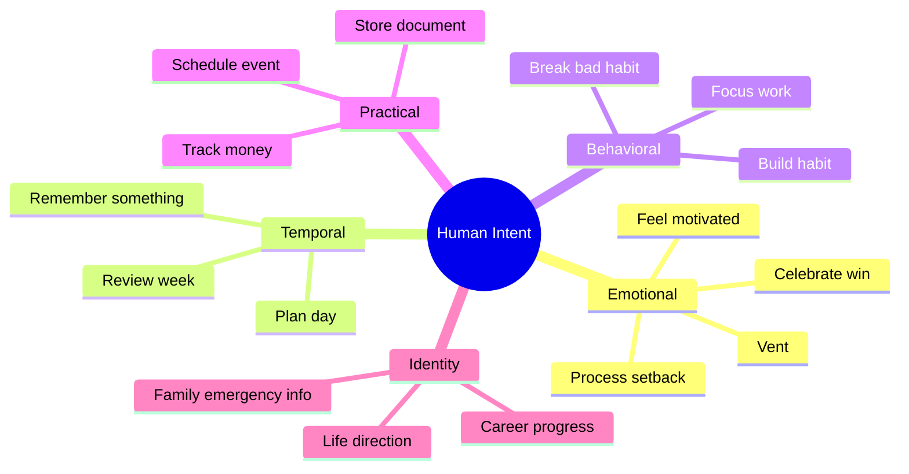

---

## Master Intent Table

| Intent | Desired Outcome | Current AIIMIN Feature | Current Friction | Future Interaction |
|--------|-----------------|------------------------|------------------|-------------------|
| Vent / process emotions | Feel heard, gain clarity | Journal capture, Discipline log | Mode choice (CBT/WWW); mood picker duplicate | Single capture bar; AI infers mood + mode post-save |
| Celebrate a win | Record achievement, boost morale | Command Palette Log Win, Daily Log wins, Journal | 3 separate entry points | `⌘K` → "won..." auto-routes; XP toast unified |
| Remember something | Retrieve later without losing it | Notes, Journal, Command Palette note | Title required on notes; no unified search memory | Ambient capture → AI tags + links to goals/calendar |
| Plan my day | Know what to do when | Overview, Calendar, Goals, Habits | 4 surfaces; no single day plan | Morning briefing card: AI merges calendar + habits + goals |
| Track money | Know spend vs budget | Finance EntryForm (6 fields) | Highest daily finance friction | "spent 450 groceries" → confirm category chip |
| Feel motivated | Emotional uplift, direction | Identity arc, Insights, Gamification XP | Arc edited in 3 places; insights read-only | AI coaching from streak + arc; proactive Monday insight |
| Break bad habit | Resist urge, log trigger | Discipline TriggerModal | Emotional recall under stress; 3 fields | Voice "urge after meeting" → AI suggests replacement |
| Build habit | Consistency, streak | Habits toggle + create modal (5 fields) | Create modal heavy; toggle light | NL habit create; onboarding seeds from goals only |
| Focus on work | Deep work session | Focus/Pomodoro, Calendar block | Post-session reflection optional burden | Auto-link goal; skip reflection unless extended session |
| Family emergency info | Quick access for crisis | Family Vault emergency card | 20+ fields; rare edit; high anxiety | Progressive wizard; pre-fill from members; wallet export |
| Career progress | Track applications, improve resume | Placements pipeline, Lab ATS | CRM-style 7-field intake | Paste job URL → auto-fill; email parse stage updates |
| Review how I'm doing | Holistic self-assessment | Insights, Reports, Life Score teaser | Separate pages; period select | Unified weekly digest notification |
| Capture mood quickly | Emotional check-in | Mood on 5 surfaces | Re-learn same 1–10 scale | One mood primitive; swipe on Overview |
| Log daily health | Snapshot of wellbeing | DailyLogForm multi-metric | 55 composite friction (INT-099) | Passive wearable + 1-tap confirm card |
| Set life direction | Long-term purpose | Onboarding lifeArc, Goals, Identity | Blank page syndrome (INT-014) | AI drafts arc from 2 weeks captures |
| Get unstuck | Decision support | Lab Decision Matrix, Command Palette AI | 14-module choice overload | AI routes to right tool from single question |
| Store important document | Safe retrieval | Family document upload | File + label + category | Upload only; OCR label |
| Schedule meeting/event | Time commitment | Calendar EventModal (6 fields) | Date/time cognitive load | Quick-add NL: "dentist Friday 3pm" |
| Learn / practice | Skill building | Lab modules (DSA, typing, flashcards) | Module launcher 14 choices | Command Palette routes: "practice DSA" |
| Upgrade / unlock feature | Access gated tools | TierRouteGuard modals | Same blocked feeling 8 routes | Single upgrade surface with feature context |

---

## Before / After Flows

### Intent: Vent after a hard day

**Current (7+ interactions):**
```
Navigate Journal → Choose mode? → Select mood 1-10 → Type body → Send → Optional AI analyze
```
Friction: mode decision (INT-166), mood duplicate (INT-059 overlap), 3.8 avg screen friction.

**Future (2 interactions):**
```
⌘K or Journal bar → Speak/type freely → AI saves with inferred mood + tags; chip to correct
```

---

### Intent: Plan my day

**Current (12+ interactions):**
```
Open Overview → Scan widgets → Open Calendar → Check habits → Open Goals → Mental merge
```
Friction: context switching across 4 routes; no synthesized plan.

**Future (1 interaction):**
```
Open app → Morning briefing card (AI-generated) → Tap to accept/adjust blocks
```

---

### Intent: Track money

**Current (8 interactions per transaction):**
```
Finance → Select tab → EntryForm → amount → type → category → account → date → note → Add
```
Friction: INT-285 composite 80; 6 required fields.

**Future (2 interactions):**
```
⌘K "spent 1200 on rent" → Confirm category + account chips → Done
```

---

### Intent: Break bad habit (urge moment)

**Current (6 interactions):**
```
Navigate Discipline → Open trigger modal → Type trigger → Slider intensity → Pick replacement → Log
```
Friction: INT-537 composite 55; high emotional cost.

**Future (2 interactions):**
```
Voice/button "urge" → AI logs context + suggests replacement habit → Tap confirm
```

---

### Intent: Family emergency

**Current (25+ interactions):**
```
Family → Emergency tab → Edit 20 fields → Save
```
Friction: INT-024 composite 90; rare but critical.

**Future (3 interactions):**
```
First add member (minimal) → Emergency wizard pre-fills → Export to wallet PDF
```

---

### Intent: Career progress

**Current (10+ interactions):**
```
Placements → New application modal → 7 fields → Pipeline drag → Separate ATS upload
```
Friction: INT-493 composite 75.

**Future (3 interactions):**
```
Paste job URL → Review auto-filled card → Pipeline auto-stage from email (future)
```

---

## Intent Clusters → Feature Priority

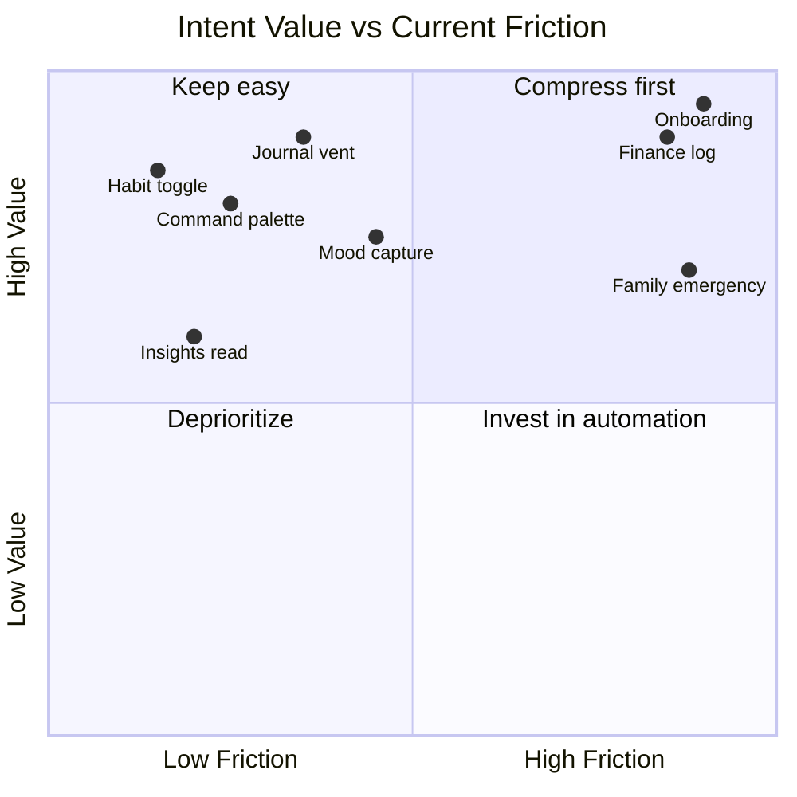

**Compress first quadrant:** Finance log, Onboarding, Family emergency, Mood capture consolidation.

---

## Intent → Command Palette Routing (Future)

| User says (examples) | Route target | Fields eliminated |
|---------------------|--------------|-------------------|
| "feeling anxious about interview" | Journal + mood infer + Placements link | mood, mode |
| "spent 500 on food" | Finance tx | type, category, date, account |
| "won finished spec" | Win log + XP | separate win form |
| "remind me call mom Sunday" | Calendar + Family link | title, date parse |
| "didn't smoke today" | Discipline + reset_counter | trigger form |
| "focus 25 min on goals" | Focus timer + goal link | goalId picker |

---

## Related Documents

- [[things_aiimin_should_stop_asking]] — field kill verdicts
- [[INTERACTION_COMPRESSION_SCORE]] — quantified compression
- [[../AIIMIN_PRODUCT_BIBLE/09_USER_JOURNEY]] — journey maps
- `docs/interaction-audit/friction.md` — friction heatmap

---

<a id="things_aiimin_should_stop_asking"></a>

## Source: `docs/product-intelligence/things_aiimin_should_stop_asking.md`

# Things AIIMIN Should Stop Asking (Phase 5 — Kill List)

**Status:** Exhaustive field + pattern verdicts  
**Date:** 2026-07-11  
**Verdicts:** **Kill** | **Infer** | **System** | **Keep** | **Ask later**

Every removed field is a **retention win**: fewer decisions per session, lower abandonment, higher daily capture rate.

---

## Verdict Legend

| Verdict | Meaning |
|---------|---------|
| **Kill** | Remove from UI; derive, default, or eliminate |
| **Infer** | AI/populate silently; user corrects via chip |
| **System** | OS/behavior/telemetry maintains; no user prompt |
| **Keep** | User must provide; high value or legal/safety |
| **Ask later** | Defer to progressive disclosure or post-activation |

---

## Auth & Security

| Field / Pattern | Verdict | Why (retention win) |
|-----------------|---------|---------------------|
| email | **Keep** (OAuth reduces) | Required for identity; OAuth eliminates typing |
| password | **Keep** (passkey future) | Security; reduce with magic link |
| confirmPassword | **Kill** | Redundant with passkey/magic link — 1 fewer field on signup |
| PIN (4) login | **Keep** → **System** biometric | PIN memory burden; biometric = 0 recall |
| PIN (6) onboarding | **Ask later** | Blocks activation; defer to Settings — saves 12 taps (INT-006) |

---

## Onboarding

| Field / Pattern | Verdict | Why |
|-----------------|---------|-----|
| fullName | **Infer** | OAuth prefill — skip step when present |
| username | **Ask later** | Availability wait (INT-010); not needed day 1 |
| selectedGoals[] | **Infer** + **Ask later** | Decision fatigue (INT-011); infer from week 1 behavior |
| selectedHabits[] | **Infer** | Duplicate of goals mapping (INT-012); seed from goals |
| wakeTime | **Kill** | Low confidence (INT-013); infer from open patterns |
| lifeArc | **Ask later** | Blank page syndrome (INT-014); AI draft after captures |
| 9-step wizard | **Kill** pattern | Compress to 3 steps: auth → capture → done |

---

## Waitlist

| Field / Pattern | Verdict | Why |
|-----------------|---------|-----|
| email | **Keep** | Acquisition anchor |
| name | **Kill** | Optional; personalize later — faster submit |

---

## Daily Log

| Field / Pattern | Verdict | Why |
|-----------------|---------|-----|
| mood | **Infer** | 5 duplicate surfaces; NLP from journal |
| sleep_hours | **Infer** | Wearable + pattern; manual override only |
| gym | **Infer** | Calendar + habit toggle |
| learning_hours | **System** | Sum from Focus sessions |
| breakfast | **Kill** | Low importance; noise in daily form |
| steps | **System** | Passive phone/wearable |
| water | **Kill** | Low signal; rarely used |
| energy | **Infer** | Model from sleep + mood |
| brain_fog | **Infer** | Journal NLP |
| headache | **Ask later** | Symptom only when mentioned |
| wins | **Keep** capture / **Infer** route | Merge to Command Palette |
| DSA | **System** | Lab auto-log |
| reset_counter | **System** | Discipline engine maintains |
| Multi-metric form (INT-099) | **Kill** pattern | Replace with 1-tap confirm card |

---

## Journal

| Field / Pattern | Verdict | Why |
|-----------------|---------|-----|
| body | **Keep** | Core capture — the product |
| mood | **Infer** | Sentiment NLP; mood strip becomes confirm-only |
| mode choice (CBT/WWW/etc.) | **Kill** | INT-166; AI tags post-save |
| mode fields (CBT) | **Infer** | INT-167; therapeutic structure from AI |
| Journal Mode selector | **Kill** | Default = capture; structured optional |

---

## Habits

| Field / Pattern | Verdict | Why |
|-----------------|---------|-----|
| name | **Keep** | Identity (NL create ok) |
| emoji | **Kill** | Auto from name — 1 fewer picker |
| category | **Kill** | Infer from name NLP |
| color | **Kill** | System palette from category |
| description | **Ask later** | Optional; AI can draft |
| 5-field create modal (INT-213) | **Kill** pattern | NL: "meditate 10 min daily" |

---

## Goals

| Field / Pattern | Verdict | Why |
|-----------------|---------|-----|
| title | **Keep** (NL parse) | Required intent — parse from sentence |
| pillar | **Infer** | Title NLP — 1 fewer dropdown |
| priority | **Kill** | INT-265 overhead; infer from deadline/behavior |
| targetDate | **Infer** | Parse "by September" from NL |
| why | **Ask later** | AI drafts from context |
| milestones[].text | **Infer** | AI proposes; user confirms batch |
| 7-field modal (INT-265) | **Kill** pattern | Single NL input → review card |

---

## Finance

| Field / Pattern | Verdict | Why |
|-----------------|---------|-----|
| amount | **Keep** | Core value |
| type | **Infer** | "spent" vs "earned" NLP |
| category | **Kill** | INT-285 biggest win; merchant NLP 85% |
| account | **Infer** | Last-used default |
| date | **System** | Today default — rarely changed |
| note | **Ask later** | Optional voice tail |
| 6-field EntryForm | **Kill** pattern | Voice/NL primary path |

---

## Calendar

| Field / Pattern | Verdict | Why |
|-----------------|---------|-----|
| title | **Keep** (NL) | Parsed from quick-add |
| start/end | **Infer** | Duration defaults |
| allDay | **Infer** | When no time in NL |
| recurrence | **Ask later** | Only when pattern detected |
| color | **Kill** | System from category |
| EventModal 6-field (INT-333) | **Kill** pattern | Quick-add default; modal for edge cases |

---

## Family

| Field / Pattern | Verdict | Why |
|-----------------|---------|-----|
| member.name | **Keep** | Required |
| member.relation | **Keep** | Emergency context |
| member.DOB | **Ask later** | Progressive disclosure |
| member.blood_group | **Ask later** | Emergency wizard only |
| member.phone | **Ask later** | Import contacts optional |
| document.file | **Keep** | Upload required |
| document.label | **Infer** | Filename/OCR |
| emergency.* bulk edit (INT-024) | **Ask later** pattern | Wizard not upfront — 65+ field wall |

---

## Placements

| Field / Pattern | Verdict | Why |
|-----------------|---------|-----|
| company | **Keep** (URL parse) | |
| role | **Infer** | JD parse |
| stage | **Infer** | Email parse future |
| application_date | **System** | Today default |
| notes | **Ask later** | |
| link | **Infer** | Clipboard detect |
| resume PDF | **Keep** | ATS requires |
| job description | **Infer** | URL fetch |
| 7-field intake (INT-493) | **Kill** pattern | URL paste primary |

---

## Focus, Discipline, Notes

| Field | Verdict | Why |
|-------|---------|-----|
| session rating | **Kill** | Low value; infer from duration |
| session notes | **Infer** | AI summary |
| linked goalId | **Infer** | Last active goal |
| trigger (discipline) | **Keep** | Core signal |
| intensity | **Kill** | Optional noise |
| replacement_habit | **Infer** | Suggest from habits |
| note title | **Kill** | First-line derive |
| note body | **Keep** | Content |

---

## Account, Settings, Feedback

| Field | Verdict | Why |
|-------|---------|-----|
| displayName | **Infer** | OAuth sync |
| location | **Kill** | IP geo coarse |
| bio | **Ask later** | |
| avatar | **Infer** | OAuth |
| theme | **System** | OS `prefers-color-scheme` |
| pinnedNav[] | **System** | Usage frequency |
| persona preset | **Infer** | Behavior clusters |
| feedback message | **Keep** | |
| feedback category | **Kill** | Infer from page |

---

## Lab & Command Palette

| Field | Verdict | Why |
|-------|---------|-----|
| substance (addiction) | **Keep** | Safety taxonomy |
| intensity (addiction) | **Kill** | |
| trigger (addiction) | **Infer** | Shared with Discipline |
| ai_log text | **Keep** | Primary AI surface |
| win/note separate fields | **Kill** | Merge to ai_log |
| 14-module launcher (INT-432) | **Kill** pattern | Palette routes to module |

---

## Duplicate Patterns (Cross-Cutting Kills)

| Pattern | Verdict | Surfaces | Retention impact |
|---------|---------|----------|------------------|
| Mood 1–10 picker ×5 | **Kill** → single primitive | Journal, Palette, DailyLog, MoodTracker, Discipline | Eliminate 4 redundant UIs |
| Theme swatch ×3 | **System** | Login, Settings, Account | Ask zero times |
| PIN numpad ×3 | **System** biometric | Login, Onboarding | −12 taps onboarding |
| Life Arc editor ×3 | **Kill** duplicates | Onboarding, Identity, Profile | Single source |
| Title fields (Goals, Notes, Calendar, Events) | **Kill** or **Infer** | Multiple | NL capture universal |
| Tags / Category manual | **Kill** | Habits, Finance, Feedback | NLP classification |
| Priority dropdown | **Kill** | Goals | Behavior inference |
| Journal Mode | **Kill** | Journal | Post-capture AI |

---

## Top 10 Kill List (Highest Retention ROI)

| Rank | Item | Est. fields saved / session | Verdict |
|------|------|----------------------------|---------|
| 1 | Finance category dropdown | 1 × every tx | **Kill** → Infer |
| 2 | Goals priority + pillar | 2 × every goal | **Kill** / **Infer** |
| 3 | Mood picker duplicates | 1–4 × daily | **Infer** |
| 4 | Journal mode selector | 1 × journal | **Kill** |
| 5 | Habits emoji/category/color | 3 × habit create | **Kill** |
| 6 | Notes title | 1 × note | **Kill** |
| 7 | Onboarding wake time | 1 once | **Kill** |
| 8 | Settings theme | 1 once | **System** |
| 9 | Calendar color | 1 × event | **Kill** |
| 10 | Feedback category | 1 × feedback | **Kill** |

---

## Related Documents

- [[PRODUCT_INTELLIGENCE_LAYER]] — full field matrix
- [[INTERACTION_COMPRESSION_SCORE]] — quantified savings
- [[../AIIMIN_PRODUCT_BIBLE/07_AUTOMATION_RULES]] — infer vs ask rules

---

<a id="future_aimin_framework"></a>

## Source: `docs/product-intelligence/FUTURE_AIMIN_FRAMEWORK.md`

# AIIMIN — Future AIIMIN Framework (Phase 6)

**Status:** Claude input stack + automation roadmap  
**Date:** 2026-07-11

---

## Purpose

This document defines the **Claude input stack** — the ordered layers of product intelligence that inform AI-first redesign decisions, automation priorities, and interaction compression targets.

---

## The Claude Input Stack

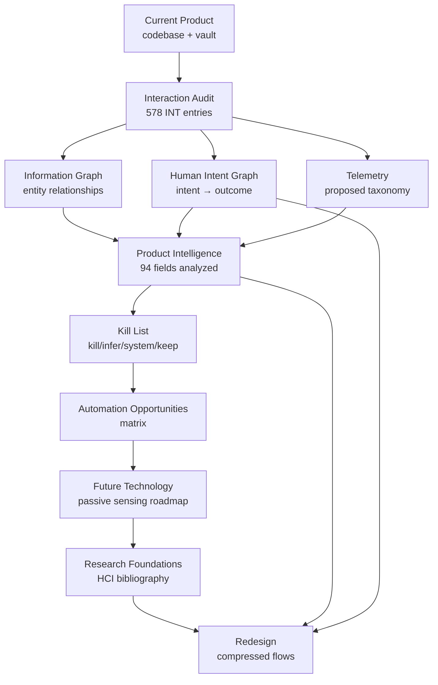

### Layer descriptions

| Layer | Artifact | Agent use |
|-------|----------|-----------|
| **Current Product** | `frontend/`, vault feature MOCs | Ground truth for what ships |
| **Interaction Audit** | `docs/interaction-audit/` | Every user action, friction rank |
| **Information Graph** | `INFORMATION_GRAPH.md` | What data connects to what |
| **Human Intent Graph** | `HUMAN_INTENT_GRAPH.md` | Why users come; desired outcomes |
| **Telemetry** | `docs/interaction-telemetry.md` | Events, funnels, composite scores |
| **Product Intelligence** | `PRODUCT_INTELLIGENCE_LAYER.md` | Per-field infer/automation verdict |
| **Kill List** | `things_aiimin_should_stop_asking.md` | Fields/patterns to eliminate |
| **Automation Opportunities** | This doc § matrix | Prioritized engineering bets |
| **Future Technology** | Wearables, STT, OCR, passkeys | Passive signal roadmap |
| **Research** | `RESEARCH_FOUNDATIONS.md` | Academic grounding |
| **Redesign** | Product Bible + compression score | Target UX |

---

## Automation Opportunities Matrix

| Opportunity | Source fields | Signals | AI confidence | Eng effort | Privacy | Priority |
|-------------|---------------|---------|---------------|------------|---------|----------|
| Universal capture router | ai_log, journal body, notes | NL classifier | High | High | Medium | P0 |
| Finance category infer | category, type, note | Merchant NLP, history | 85% | Medium | Low | P0 |
| Mood primitive unification | mood ×5 surfaces | Journal sentiment, voice | 80% | Medium | Medium | P0 |
| Goals NL create | title, pillar, priority, milestones | Sentence parse | 70% | Medium | Low | P1 |
| Onboarding compression | 9 steps → 3 | OAuth, defer PIN | N/A | Medium | Low | P1 |
| Morning briefing | calendar + habits + goals | Aggregation + LLM | 75% | High | Low | P1 |
| Habit NL create | name, category, emoji, color | Semantics | 65% | Low | None | P1 |
| Sleep/wearable import | sleep_hours, steps | HealthKit API | 85% | Medium | Medium | P2 |
| Calendar NL quick-add | title, start, end, allDay | Time NLP | 70% | Medium | Low | P2 |
| Placements URL scrape | company, role, JD | HTTP fetch | 60% | Medium | Low | P2 |
| Theme OS sync | theme | `prefers-color-scheme` | 90% | Low | None | P2 |
| Nav pin auto | pinnedNav[] | Route telemetry | 65% | Medium | None | P3 |
| Discipline context log | trigger, replacement | Time, calendar, mood | 55% | Medium | High | P3 |
| Family doc OCR label | document.label | Filename, OCR | 70% | Low | Medium | P3 |

---

## Interaction Compression Targets

| Metric | Current (audit) | Target (AI-first) | Method |
|--------|----------------|-------------------|--------|
| Onboarding steps | 9 | 3 | OAuth, defer PIN, infer goals/habits |
| Finance tx interactions | 8 | 2 | NL + confirm chips |
| Goal create interactions | 7+ | 2 | NL + milestone review |
| Journal capture | 4–7 | 1–2 | Default capture; infer mood/mode |
| Daily log save | 5+ fields | 1 tap confirm | Passive + card |
| Mood capture surfaces | 5 | 1 | Unified primitive |
| Family emergency setup | 20+ fields | 5 (wizard) | Progressive disclosure |
| Habit create modal fields | 5 | 1 (NL) | Semantic create |
| Command palette to save | 3 | 2 | Already best-in-class; extend routing |

**North star compression:** Reduce median daily capture interactions from ~15 to ~5 without losing data fidelity.

---

## Decision Framework for Agents

When proposing a UI change, run this checklist:

1. **Intent check** — Which human intent from `HUMAN_INTENT_GRAPH` does this serve?
2. **Graph check** — Which entities in `INFORMATION_GRAPH` are affected?
3. **Field check** — Does `PRODUCT_INTELLIGENCE_LAYER` mark field Kill/Infer?
4. **Friction check** — Is interaction in friction top 100?
5. **Telemetry check** — Which funnel event proves success?
6. **Privacy check** — Does passive signal require new consent?
7. **Mobile check** — Does `/m` stay capture-only?

---

## Future Technology Roadmap

| Technology | Enables | Timeline |
|------------|---------|----------|
| On-device STT | Voice capture without server round-trip | Near |
| HealthKit / Google Fit | sleep, steps passive | Near |
| Passkeys / WebAuthn | Kill PIN/password friction | Near |
| Receipt OCR | Finance amount + category | Medium |
| Email parse (Placements) | Stage auto-update | Medium |
| Calendar intent (Lookout-style) | Proactive scheduling | Medium |
| Ambient lifelogging | Activity inference | Long |
| On-device LLM | Privacy-preserving infer | Long |

---

## Redesign Principles (from stack synthesis)

1. **Capture first, structure later** — User provides raw intent; AI structures.
2. **One mood, one arc, one theme** — Eliminate duplicate primitives.
3. **Confirm chips over forms** — Replace dropdowns with correctable inferences.
4. **Progressive disclosure for rare/high-stakes** — Family emergency, not daily log.
5. **Command Palette as universal router** — Every intent has a text/voice path.
6. **Read surfaces stay read** — Insights/Reports compress input elsewhere.

---

## Related Documents

- [[RESEARCH_FOUNDATIONS]] — academic grounding
- [[INTERACTION_COMPRESSION_SCORE]] — per-feature metrics
- [[../AIIMIN_PRODUCT_BIBLE/06_AI_MODEL]] — AI behavior contract
- `docs/interaction-telemetry.md` — event taxonomy

---

<a id="research_foundations"></a>

## Source: `docs/product-intelligence/RESEARCH_FOUNDATIONS.md`

# AIIMIN — Research Foundations (Phase 7)

**Status:** Bibliography + synthesis for product intelligence  
**Date:** 2026-07-11

---

## Purpose

Ground AIIMIN's AI-first, low-friction design in established HCI, cognitive science, and passive sensing research — not generic "best journal UI" listicles.

---

## Research Domains → AIIMIN Implications

### 1. Mixed-Initiative Interfaces (CHI / Microsoft Research)

**Key concepts:** Coupling automated agent services with direct manipulation; managing uncertainty about user goals; timing of intervention; expected utility of automation vs user effort.

**Representative references:**
- Horvitz, E. — *Principles of Mixed-Initiative User Interfaces* (CHI 1999)
- Horvitz, E. — *Uncertainty, Action, and Interaction: In Pursuit of Mixed-Initiative Computing* (IEEE Intelligent Systems, 1999)
- Maes, P. & Shneiderman, B. — *Direct Manipulation vs. Interface Agents: A Debate* (Interactions, 1997)
- Horvitz et al. — *The Lumiere Project: Bayesian User Modeling* (UAI 1998) — LookOut scheduling assistant

**AIIMIN implication:** Command Palette AI Log and finance category inference should follow mixed-initiative rules: act when confidence high, offer correction chips when medium, ask only when low. LookOut's calendar intent recognition is the direct ancestor of "paste job URL → auto-fill application."

---

### 2. Stanford HCI — Behavior Change & Personal Informatics

**Key concepts:** Reflection-on-action vs in-action; lapse vs relapse; goal gradient effect; self-monitoring without increasing burden.

**Representative references:**
- Li, I. et al. — *A Stage-Based Model of Personal Informatics Systems* (CHI 2010)
- Epstein, D. et al. — *A Live Field Test of Five Principles for Gathering Personal Data* (CHI 2015)
- Consolvo, S. et al. — *Design Requirements for Technologies that Encourage Physical Activity* (CHI 2009)

**AIIMIN implication:** Habits toggle (low friction) aligns with in-action monitoring; Goals 7-field modal is reflection-before-action — move structuring post-capture. Stage model maps to: onboarding (installation) → daily capture (action) → Insights (reflection) → Reports (integration).

---

### 3. MIT Media Lab — Lifelogging & Memory Reconstruction

**Key concepts:** Capture everything, retrieve selectively; memory externalization; serendipitous recall; privacy paradox in lifelogging.

**Representative references:**
- Gemmell, J. et al. — *MyLifeBits: A Personal Database for Everything* (CACM 2006)
- Dodge, M. & Kitchin, R. — *The Ethics of Forgetting in an Age of Pervasive Computing* (2007)
- MIT Media Lab — Fluid Interfaces / Social Machines group work on memory augmentation

**AIIMIN implication:** Journal + Notes + Command Palette are lifelogging primitives. Future ambient capture must include strong forget/export/delete (already in Account data section). Memory reconstruction = AI weekly digest linking journal themes to goals.

---

### 4. CMU HCII — Intelligent Personal Assistants & Interruptibility

**Key concepts:** Interruptibility models; cost of interruption; notification timing; cognitive load measurement.

**Representative references:**
- Iqbal, S. T. & Horvitz, E. — *Disruption and Recovery of Computing Tasks* (CHI 2007)
- Fogarty, J. et al. — *Predicting Human Interruptibility with Sensors* (CHI 2005)
- Myers, B. A. — *Using Hand-Held Devices to Support Software Engineering Tasks* — CMU tradition of tool integration

**AIIMIN implication:** Focus timer and onboarding PIN are partially interruptible (audit limitation). Proactive AI nudges must use interruptibility model — no coaching modals during active Focus session. Morning briefing = high receptivity window.

---

### 5. Apple / Google Research — Passive Sensing

**Key concepts:** Activity recognition from phone sensors; health kit aggregation; privacy-preserving on-device ML; exposure notification patterns for consent.

**Representative references:**
- Apple — Health Records / HealthKit documentation and WWDC health sessions (activity, sleep)
- Google Research — *Mobile Sensing for Personal Health* (various; See e.g. activity recognition on Android)
- Cormack, G. V. et al. — privacy-preserving federated learning (relevant to on-device infer)

**AIIMIN implication:** sleep_hours, steps, learning_hours should move to passive import with explicit HealthKit permission once. Aligns with Kill List **System** verdicts. On-device inference for mood is preferable to sending raw journal to cloud where possible.

---

### 6. Digital Phenotyping & Mental Health Informatics

**Key concepts:** Behavioral markers from passive data; relapse prediction; ethical constraints on mental health inference; clinician vs consumer boundaries.

**Representative references:**
- Insel, T. — NIMH Research Domain Criteria (RDoC) framework
- Torous, J. et al. — *Digital Phenotyping: A Global Tool for Psychiatry* (World Psychiatry, 2021)
- Mohr, D. C. et al. — *Personal Sensing: Understanding Mental Health Using Ubiquitous Sensors* (Annual Review of Clinical Psychology, 2017)

**AIIMIN implication:** Mood inference from journal is digital phenotyping — require transparency, user correction, no diagnostic claims. Discipline and Lab Addiction modules need higher privacy bar. Insights copy must be coaching not clinical.

---

### 7. UIST — Instrumented Interaction & Input Innovation

**Key concepts:** Novel input modalities; voice as first-class; reducing form complexity through intelligent defaults.

**Representative references:**
- Wobbrock, J. O. et al. — *The Angle Mouse: Target-Acquisition Techniques for 1D Targets* — UIST tradition of input efficiency
- Lee, B. & Oulasvirta, A. — computational interaction frameworks (UIST community)
- Landau, S. — voice UI research at UIST/CHI intersections

**AIIMIN implication:** Voice dictation on Journal and Command Palette should share one STT pipeline (duplicate pattern kill). Chord `Space→L` universal logger is power-user UIST-style efficiency — teach in onboarding.

---

### 8. Cognitive Psychology — Decision Fatigue & Choice Architecture

**Key concepts:** Ego depletion debates; choice overload; defaults and nudges; paradox of choice in onboarding.

**Representative references:**
- Baumeister, R. F. et al. — *Ego Depletion: Is the Active Self a Limited Resource?* (1998; replication debates ongoing)
- Iyengar, S. S. & Lepper, M. R. — *When Choice is Demotivating* (2000)
- Thaler, R. & Sunstein, C. — *Nudge* (2008) — choice architecture

**AIIMIN implication:** Onboarding goal/habit multi-select (INT-011, INT-012) is choice overload — default to AI-suggested 3 habits. Finance 6-field form is decision fatigue (telemetry: `decision_fatigue_signal` at ≥5 dropdown changes). Defaults: today, last account, inferred category.

---

### 9. Information Theory & Quantified Self

**Key concepts:** Signal vs noise in self-tracking; data resolution vs burden; personal analytics meaningfulness.

**Representative references:**
- Wolf, G. — Quantified Self movement (QS conferences, 2011+)
- Choe, E. K. et al. — *Understanding Quantified-Selfers' Practices in Collecting and Exploring Personal Data* (CHI 2014)
- Kay, M. et al. — *Lullaby: A Capture & Access System for Understanding Sleep* (CHI 2008)

**AIIMIN implication:** Daily log fields like water, breakfast are low signal — Kill List. High signal: mood, sleep, habits, finance. Reports should surface fewer, higher-signal metrics (Life Score composite).

---

### 10. Ambient AI & Agentic Interfaces (2024–2026 frontier)

**Key concepts:** Tool-using agents; proactive vs reactive; human-in-the-loop; compound AI systems.

**Representative references:**
- Yang, J. et al. — *ReAct: Synergizing Reasoning and Acting in Language Models* (2023)
- Park, J. S. et al. — *Generative Agents: Interactive Simulacra of Human Behavior* (UIST 2023)
- Industry: Apple Intelligence ambient actions; Google Gemini system integration

**AIIMIN implication:** Command Palette AI Log is proto-agentic router. Future: agent reads Information Graph, writes to multiple tables per utterance, confirms with single chip row. Aligns with FUTURE_AIMIN_FRAMEWORK automation matrix P0.

---

## Synthesis: Research → Design Rules

| Research theme | AIIMIN rule |
|----------------|-------------|
| Mixed-initiative | Infer silently ≥70% confidence; chip 40–70%; ask <40% |
| Personal informatics stages | Separate capture from reflection surfaces |
| Lifelogging ethics | Export, delete, encrypt journal; no surprise inference |
| Interruptibility | No proactive modals during Focus; morning briefing window |
| Passive sensing | HealthKit for sleep/steps; explicit consent |
| Digital phenotyping ethics | No clinical claims; user correction always visible |
| Choice architecture | ≤3 choices per decision screen |
| Quantified self signal | Kill low-signal daily fields |
| Agentic AI | One utterance → multi-table write with confirm |

---

## Related Documents

- [[FUTURE_AIMIN_FRAMEWORK]] — automation stack
- [[../AIIMIN_PRODUCT_BIBLE/10_RESEARCH]] — Product Bible summary
- [[../AIIMIN_PRODUCT_BIBLE/13_PRODUCT_PRINCIPLES]] — non-negotiables

---

<a id="interaction_compression_score"></a>

## Source: `docs/product-intelligence/INTERACTION_COMPRESSION_SCORE.md`

# AIIMIN — Interaction Compression Score (Bonus)

**Status:** Per-feature compression analysis  
**Date:** 2026-07-11  
**Source:** Interaction audit (578 INT), friction top 100, forms inventory

---

## Purpose

Quantify the path from current interaction counts to AI-first compressed flows. Rank features by compression opportunity (interactions saved × frequency).

**Formula:** `Compression % = (Current - Future) / Current × 100`

---

## Master Compression Table

| Rank | Feature / Flow | Current interactions | Future interactions | Compression % | Notes |
|------|----------------|---------------------:|--------------------:|--------------:|-------|
| 1 | Finance transaction log | 8 | 2 | **75%** | NL + category chip; INT-285 |
| 2 | Onboarding full flow | 45+ | 12 | **73%** | 9→3 steps; defer PIN; infer goals |
| 3 | Goals create/edit | 9 | 2 | **78%** | NL + AI milestones; INT-265 |
| 4 | Family emergency card | 25 | 6 | **76%** | Wizard + pre-fill; INT-024 |
| 5 | Family member add | 12 | 5 | **58%** | Progressive fields; INT-023 |
| 6 | Daily log multi-metric | 7 | 1 | **86%** | Passive card confirm; INT-099 |
| 7 | Habits create | 6 | 1 | **83%** | NL create; INT-213 |
| 8 | Calendar EventModal | 7 | 2 | **71%** | Quick-add NL; INT-333 |
| 9 | Placements application intake | 8 | 3 | **63%** | URL scrape; INT-493 |
| 10 | Journal full capture | 5 | 2 | **60%** | Kill mode; infer mood; INT-166 |
| 11 | Discipline trigger log | 5 | 2 | **60%** | Voice + infer replacement; INT-537 |
| 12 | Lab module launch | 3 | 1 | **67%** | Palette route; INT-432 |
| 13 | Lab ATS analyze | 4 | 2 | **50%** | Resume vault reuse; INT-435 |
| 14 | Mood capture (any surface) | 3 | 1 | **67%** | Infer + confirm chip |
| 15 | Notes create | 4 | 2 | **50%** | Kill title; INT-533 |
| 16 | Focus post-session reflection | 4 | 1 | **75%** | Optional/skip default; INT-418 |
| 17 | Account profile save | 6 | 2 | **67%** | OAuth prefill; INT-502 |
| 18 | Settings personalization | 8 | 2 | **75%** | System theme + infer pins |
| 19 | Command Palette AI log | 3 | 2 | **33%** | Already efficient; INT-056 |
| 20 | Habit today toggle | 1 | 1 | **0%** | Perfect; INT-211 — protect |
| 21 | Journal mood-only | 2 | 1 | **50%** | Infer from text; INT-162 |
| 22 | Command Palette win/note | 3 | 2 | **33%** | Merge to ai_log |
| 23 | Login email signup | 5 | 2 | **60%** | OAuth primary; INT-002 |
| 24 | Login PIN | 4 | 1 | **75%** | Biometric; INT-003 |
| 25 | Waitlist signup | 3 | 1 | **67%** | Email only |
| 26 | Feedback submit | 3 | 2 | **33%** | Kill category |
| 27 | Finance budget edit | 4 | 3 | **25%** | Lower priority; INT-288 |
| 28 | Insights filter | 2 | 2 | **0%** | Read surface |
| 29 | Reports period select | 2 | 1 | **50%** | Default current week |
| 30 | Identity arc edit | 4 | 2 | **50%** | AI draft; INT-532 |

---

## Compression by Feature Area

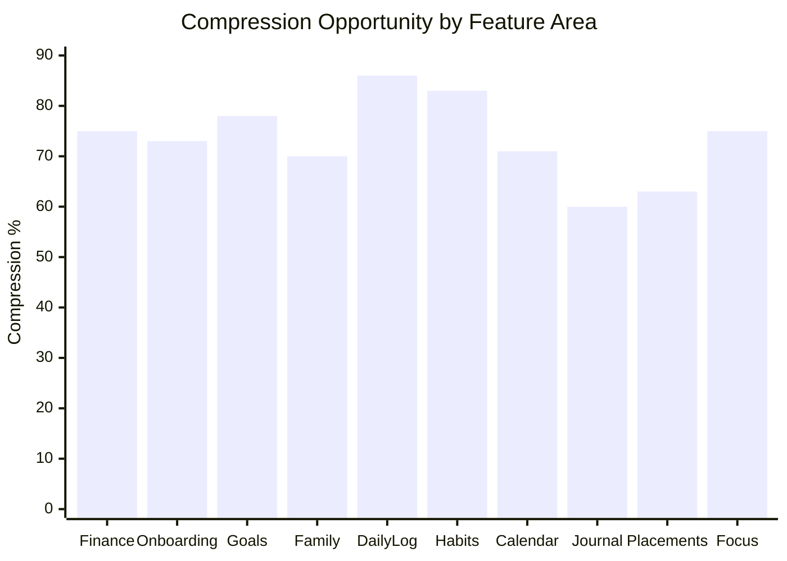

---

## Top 5 Compression Opportunities

| # | Flow | Savings | Why |
|---|------|---------|-----|
| 1 | **Daily log multi-metric** | 86% (7→1) | High frequency × passive inference |
| 2 | **Habits create** | 83% (6→1) | NL replaces 5 cosmetic fields |
| 3 | **Goals create** | 78% (9→2) | Kill priority/pillar; AI milestones |
| 4 | **Finance transaction** | 75% (8→2) | Every spend event; category kill |
| 5 | **Onboarding** | 73% (45→12) | Activation gate; highest drop-off risk |

---

## Protected Low-Friction Flows (Do Not Compress Further)

| Flow | Interactions | Reason |
|------|-------------|--------|
| Habit today toggle | 1 | Core loop; INT-211 composite 12 |
| Journal mood-only strip | 2 | Valid minimal path; INT-162 |
| Command Palette open → action | 2–3 | Power user efficiency |
| Navbar navigation | 1 | Required wayfinding |

---

## Weighted Priority Score

`Priority = Compression % × Daily Frequency Estimate × Importance`

| Flow | Weighted score | Action |
|------|---------------|--------|
| Finance tx | 95 | P0 sprint |
| Daily log | 90 | P0 passive card |
| Journal capture | 85 | P0 mood infer |
| Onboarding | 80 | P1 activation |
| Goals create | 75 | P1 NL create |
| Habits create | 70 | P1 |
| Mood unification | 65 | P0 cross-cutting |
| Family emergency | 60 | P2 rare but critical |

---

## Telemetry Proof Points

When compression ships, measure via `docs/interaction-telemetry.md`:

| Metric | Event | Target delta |
|--------|-------|--------------|
| Finance | `finance_entry_saved` field_count | 6 → 2 |
| Onboarding | `onboarding_step_completed` count | 9 → 3 |
| Journal | `journal_entry_saved` with mode=null | ↑ 80% |
| Daily log | `daily_log_saved` interaction_time_ms | −50% |
| Goals | `goal_created` modal_abandoned | −40% |

---

## Related Documents

- [[things_aiimin_should_stop_asking]] — what to remove
- [[HUMAN_INTENT_GRAPH]] — before/after flows
- [[FUTURE_AIMIN_FRAMEWORK]] — automation matrix
- `docs/interaction-audit/friction.md` — source friction ranks

---

## Product Bible

<a id="product-bible-00_index"></a>

## Source: `docs/AIIMIN_PRODUCT_BIBLE/00_INDEX.md`

# AIIMIN Product Bible — Index

**Status:** Phase 8 complete  
**Date:** 2026-07-11  
**Owner:** Product Intelligence Layer

---

## What This Is

The AIIMIN Product Bible is the canonical product doctrine for an AI-first personal Life OS. It synthesizes the interaction audit, product intelligence layer, information graph, human intent mapping, kill list, research foundations, and compression targets into agent-consumable doctrine.

**Start here** → read sections in order for full context, or jump by need.

---

## Sections

| # | Document | Purpose |
|---|----------|---------|
| 01 | [[01_VISION]] | AI-first personal OS vision |
| 02 | [[02_PHILOSOPHY]] | Design and product philosophy |
| 03 | [[03_HUMAN_PROBLEMS]] | Problems we solve |
| 04 | [[04_INFORMATION_MODEL]] | Data graph summary |
| 05 | [[05_INTERACTION_MODEL]] | Interaction audit summary |
| 06 | [[06_AI_MODEL]] | How AI should behave |
| 07 | [[07_AUTOMATION_RULES]] | Infer vs ask vs never ask |
| 08 | [[08_DATA_GRAPH]] | Entity relationship detail |
| 09 | [[09_USER_JOURNEY]] | Intent-based journeys |
| 10 | [[10_RESEARCH]] | Research bibliography summary |
| 11 | [[11_EXPERIMENTS]] | Proposed A/B tests |
| 12 | [[12_METRICS]] | North star + funnel metrics |
| 13 | [[13_PRODUCT_PRINCIPLES]] | Non-negotiable principles |
| 14 | [[14_FUTURE_IDEAS]] | Ambient capture roadmap |
| 15 | [[15_THINGS_NEVER_TO_BUILD]] | Anti-patterns and traps |

---

## Source Intelligence (Phases 2–7)

| Phase | Document |
|-------|----------|
| 2 | [[../product-intelligence/PRODUCT_INTELLIGENCE_LAYER]] |
| 3 | [[../product-intelligence/INFORMATION_GRAPH]] |
| 4 | [[../product-intelligence/HUMAN_INTENT_GRAPH]] |
| 5 | [[../product-intelligence/things_aiimin_should_stop_asking]] |
| 6 | [[../product-intelligence/FUTURE_AIMIN_FRAMEWORK]] |
| 7 | [[../product-intelligence/RESEARCH_FOUNDATIONS]] |
| Bonus | [[../product-intelligence/INTERACTION_COMPRESSION_SCORE]] |
| Audit | [[../interaction-audit/COMPLETE_INTERACTION_AUDIT]] |
| Merged | [[../product-intelligence/COMPLETE_PRODUCT_INTELLIGENCE]] |

---

## Hard Constraints (Always)

- Palette LOCKED — `docs/knowledge/08_DESIGN/Palette.md`
- Mobile capture-only — responsive `/m` behavior; no analytics on mobile
- No auth/schema changes without explicit owner approval
- Vault updates ship with product changes

---

<a id="product-bible-01_vision"></a>

## Source: `docs/AIIMIN_PRODUCT_BIBLE/01_VISION.md`

# 01 — Vision

## AIIMIN is an AI-first personal Life OS

AIIMIN exists to be the single surface where a person captures life as it happens, understands patterns over time, and acts with less friction tomorrow than today.

### The shift

| Era | Model | User burden |
|-----|-------|-------------|
| Spreadsheet era | User structures everything | High |
| App-per-domain era | User learns 12 UIs | Fragmented |
| **AIIMIN era** | User expresses intent; system structures | Minimal |

### Vision statement

**Capture once. AIIMIN remembers, connects, and coaches — without turning life into data entry.**

### What success looks like (2026–2027)

1. **Daily capture in under 60 seconds** — median interactions ≤5 per active day
2. **One universal input** — Command Palette + voice routes to the right entity
3. **Life Score as honest mirror** — composite of habits, goals, wellbeing, money — not gamification theater
4. **Insights that act** — recommendations link to calendar blocks, habit nudges, finance alerts
5. **Trust by default** — encrypted journal, explicit inference consent, export anytime

### What we are not

- Not a social network
- Not a clinical mental health device
- Not a finance-only or fitness-only app
- Not a form builder disguised as productivity

### Strategic pillars

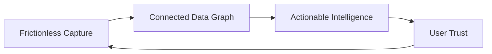

### Related

- [[02_PHILOSOPHY]]
- [[../product-intelligence/FUTURE_AIMIN_FRAMEWORK]]

---

<a id="product-bible-02_philosophy"></a>

## Source: `docs/AIIMIN_PRODUCT_BIBLE/02_PHILOSOPHY.md`

# 02 — Philosophy

## Core beliefs

### 1. Intent over interface
Users arrive with intents ("I need to vent," "I spent too much," "I can't focus") — not with a desire to pick pillars, priorities, or journal modes. The interface serves intent; it does not interrogate.

### 2. Capture first, structure later
Raw human expression is the highest-fidelity signal. Structure is derived — by AI, by defaults, by passive sensors — and always correctable.

### 3. One primitive, many surfaces
Mood, life arc, theme, and capture text must not exist in duplicate UIs. One data primitive; many read surfaces.

### 4. Progressive disclosure for stakes
Daily capture = zero setup. Family emergency vault = wizard when needed. Rare high-stakes flows earn more fields; daily flows earn fewer.

### 5. Mixed-initiative partnership
AI acts when confident, suggests when uncertain, asks when necessary. The user is never surprised by automation; they are relieved by it.

### 6. Read surfaces stay calm
Insights, Reports, Sports — consumption without input burden. Compression happens at capture, not at analysis.

### 7. Mobile is capture, desktop is command
Mobile `/m` collects data in the moment. Desktop is where planning, analysis, and deep configuration live. Do not put analytics tools on mobile.

### 8. Palette and identity are sacred
Visual language is locked. AIIMIN feels like one product, not a component library demo.

### 9. Sparring over sycophancy
The product should challenge weak habits with data, not flatter the user into retention metrics.

### 10. Ship intelligence with the feature
Vault docs, telemetry events, and kill list verdicts ship in the same unit as code — not as follow-up research.

## Design tensions we accept

| Tension | Resolution |
|---------|------------|
| Privacy vs inference | On-device where possible; chips for correction |
| Power users vs beginners | Command Palette + sensible defaults |
| Gamification vs sincerity | XP celebrates; Life Score informs |
| Completeness vs speed | Infer + allow edit beats ask upfront |

## Related

- [[13_PRODUCT_PRINCIPLES]]
- [[../product-intelligence/RESEARCH_FOUNDATIONS]]

---

<a id="product-bible-03_human_problems"></a>

## Source: `docs/AIIMIN_PRODUCT_BIBLE/03_HUMAN_PROBLEMS.md`

# 03 — Human Problems

## Problems AIIMIN solves

### 1. Life fragmentation
**Problem:** Goals in one app, money in another, journal forgotten, calendar disconnected.  
**AIIMIN answer:** Information graph connecting goals → habits → calendar → journal → finance → Life Score.

### 2. Data entry fatigue
**Problem:** 578 documented interactions; onboarding friction 6.8/10; finance 6 fields per transaction.  
**AIIMIN answer:** Kill list + compression — target 75% reduction on high-frequency flows.

### 3. Reflection without structure
**Problem:** Blank journal page syndrome; mode choice paralysis (CBT vs free write).  
**AIIMIN answer:** Default capture bar; AI applies structure post-save.

### 4. Intent without follow-through
**Problem:** Goals set with milestones never revisited; habits toggled without connection to direction.  
**AIIMIN answer:** Focus sessions link to goals; morning briefing merges plan; Insights coaches from streak data.

### 5. Money opacity
**Problem:** Every spend is a 6-field form; category decision fatigue.  
**AIIMIN answer:** NL capture + merchant inference + budget variance in Reports.

### 6. Emotional logging under stress
**Problem:** Discipline urge moments need 5 interactions; mood asked 5 different ways.  
**AIIMIN answer:** Voice capture; unified mood primitive; replacement habit suggestion.

### 7. Emergency unpreparedness
**Problem:** Family medical info scattered; 65+ field vault wall prevents setup.  
**AIIMIN answer:** Progressive emergency wizard; member pre-fill; wallet export.

### 8. Career tracking overhead
**Problem:** CRM-style application intake; resume upload duplicated in Lab ATS.  
**AIIMIN answer:** URL paste auto-fill; shared resume vault; pipeline stage inference.

### 9. No holistic mirror
**Problem:** User cannot answer "how am I doing?" without visiting 4 pages.  
**AIIMIN answer:** Life Score + weekly digest + Reports period rollup.

### 10. Power user efficiency gap
**Problem:** Repeated navigation for quick logs.  
**AIIMIN answer:** Command Palette `⌘K`, Universal Logger `Space→L`, inline Enter-to-save patterns.

## Problem → Feature map

| Problem | Primary features |
|---------|------------------|
| Fragmentation | Overview, Information Graph |
| Data entry fatigue | Command Palette, Kill List |
| Reflection | Journal, Insights |
| Follow-through | Goals, Habits, Focus, Calendar |
| Money | Finance, Reports |
| Emotional stress | Discipline, Journal |
| Emergency | Family Vault |
| Career | Placements, Lab ATS |
| Holistic mirror | Life Score, Insights, Reports |
| Power efficiency | Command Palette, shortcuts |

## Related

- [[09_USER_JOURNEY]]
- [[../product-intelligence/HUMAN_INTENT_GRAPH]]

---

<a id="product-bible-04_information_model"></a>

## Source: `docs/AIIMIN_PRODUCT_BIBLE/04_INFORMATION_MODEL.md`

# 04 — Information Model

## Summary

AIIMIN's information model is a **directed graph of life entities** where capture nodes feed derived intelligence nodes. This is data architecture, not navigation.

## Core entities

| Layer | Entities |
|-------|----------|
| **Identity** | Life Arc, Profile |
| **Planning** | Goals, Milestones, Tasks |
| **Execution** | Habits, Calendar Events, Focus Sessions |
| **Capture** | Journal, Daily Log, Notes, Command Palette Logs |
| **Health** | Mood (unified target), Sleep, Discipline Logs |
| **Money** | Transactions, Budgets |
| **Derived** | Life Score, Insights, Reports, AI Recommendations |

## Primary flows

```
Goals → Milestones → Tasks
Goals → Habits → Daily Log → Life Score
Journal → Mood → Insights
Calendar → Focus → Learning hours → Daily Log
Finance → Budgets → Reports → Life Score
All capture → Command Palette router → correct table
```

## Consumption map

| Derived output | Reads from |
|----------------|------------|
| Life Score | Habits, Goals, Daily Log, Finance |
| Insights | Journal NLP, Daily Log, Habits, Life Score |
| Reports | All periodic aggregates |
| AI Recommendations | Insights + Intent Graph |
| Gamification XP | Habits, wins, journal, focus |

## Duplicate primitives (must unify)

- Mood — 5 surfaces today → 1 primitive
- Life Arc — 3 editors → 1 source
- Theme — 3 pickers → OS system setting
- Resume — Placements + Lab ATS → shared vault

## Full detail

See [[08_DATA_GRAPH]] and [[../product-intelligence/INFORMATION_GRAPH]].

## Related

- [[08_DATA_GRAPH]]
- Vault: `docs/knowledge/03_DATABASE/`

---

<a id="product-bible-05_interaction_model"></a>

## Source: `docs/AIIMIN_PRODUCT_BIBLE/05_INTERACTION_MODEL.md`

# 05 — Interaction Model

## Summary

The interaction audit documented **578 unique user actions (INT-001…INT-578)** across 37 routes, 59 page components, and 47 form surfaces.

**Full audit:** `docs/interaction-audit/COMPLETE_INTERACTION_AUDIT.md`

## Headline findings

| Finding | Detail |
|---------|--------|
| Highest friction | Onboarding (6.8), Family (6.5), Finance (5.8) |
| Lowest friction | Habit toggle, journal mood-only, command palette |
| Top duplicates | Mood ×5, PIN ×3, theme ×3, arc editor ×3 |
| Global shortcuts | `⌘K` palette, `Space→L` logger, `Esc` close |
| Mobile reality | No `/m` router; responsive routes + BottomNav |

## Interaction patterns

| Pattern | Status | Examples |
|---------|--------|----------|
| Optimistic toggle | Good | Habit done, milestone check |
| Modal save | Compress | Goals, habits, events |
| Inline Enter | Good | Palette, notes, calendar quick-add |
| Auto-advance PIN | Compress | Biometric target |
| Confirm destructive | OK | 18 confirms; branded dialog migration |

## Friction heatmap (top 5)

1. Onboarding `/onboarding` — 6.8
2. Family Vault `/family` — 6.5
3. Finance `/finance` — 5.8
4. Placements `/placements` — 5.5
5. Lab `/lab` — 5.0

## AI touchpoints today

| Surface | Automation potential |
|---------|---------------------|
| Command Palette AI Log | Full |
| Journal analyze | Partial |
| Finance category | High |
| Placements ATS | Full |
| Insights | Read-mostly |

## Compression target

Median daily interactions: **15 → 5** (see [[../product-intelligence/INTERACTION_COMPRESSION_SCORE]])

## Related

- `docs/interaction-audit/friction.md`
- `docs/interaction-audit/forms.md`
- `docs/interaction-telemetry.md`
- [[06_AI_MODEL]]

---

<a id="product-bible-06_ai_model"></a>

## Source: `docs/AIIMIN_PRODUCT_BIBLE/06_AI_MODEL.md`

# 06 — AI Model

## How AI should behave in AIIMIN

AIIMIN's AI is not a chatbot bolted onto forms. It is a **mixed-initiative layer** that routes intent, infers structure, generates insight, and proposes action — with the user always one tap from correction.

## Roles

| Role | Description | Surfaces |
|------|-------------|----------|
| **Router** | Classify free text → correct table/entity | Command Palette, Universal Logger |
| **Inferencer** | Fill fields silently when confidence high | Finance category, mood, pillar |
| **Analyzer** | Post-capture enrichment | Journal analyze, ATS, Vocal Mastery |
| **Coach** | Narrative + recommendation | Insights, Monday widget, morning briefing |
| **Composer** | Draft milestones, arc, summaries | Goals, Identity, Focus reflection |

## Confidence bands

| Confidence | Behavior | UI |
|------------|----------|-----|
| ≥70% | Auto-fill; save | Small "edit" chip |
| 40–70% | Pre-fill; require confirm | Highlighted chip row |
| <40% | Ask minimal question | Single field or voice |
| Safety/legal | Never infer | Always ask (meds, allergies, PIN) |

## Input stack order

When AI processes a capture:

1. Parse intent (Human Intent Graph)
2. Identify target entities (Information Graph)
3. Check Kill List — which fields can be skipped
4. Write to table(s) with inferred fields
5. Emit telemetry event
6. Surface coaching only if interruptibility window open

## What AI must not do

- Diagnose mental health conditions
- Auto-share journal content
- Change auth or billing without explicit user action
- Block capture behind mode/category choices
- Invent finance transactions without user utterance

## Provider map

See vault: `docs/knowledge/09_FEATURES/Intelligence/AI-Provider-Map.md`

## Related

- [[07_AUTOMATION_RULES]]
- [[../product-intelligence/FUTURE_AIMIN_FRAMEWORK]]
- Horvitz CHI 1999 mixed-initiative principles

---

<a id="product-bible-07_automation_rules"></a>

## Source: `docs/AIIMIN_PRODUCT_BIBLE/07_AUTOMATION_RULES.md`

# 07 — Automation Rules

## When to infer vs ask vs never ask

### Never ask (System)

| Field / behavior | Source |
|------------------|--------|
| theme | OS `prefers-color-scheme` |
| finance date | Default today |
| pinnedNav[] | Route visit frequency |
| learning_hours | Sum Focus sessions |
| DSA count | Lab session auto-log |
| steps | Wearable passive |
| application_date | Today default |
| note title | First line derive |

### Never infer (Always ask or user-only)

| Field | Reason |
|-------|--------|
| password, PIN | Security |
| emergency meds, allergies | Safety |
| substance (addiction) | Clinical sensitivity |
| member blood_group | Medical accuracy |
| finance amount | Must be explicit utterance |
| journal body | User content — never fabricate |

### Infer silently (chip to correct)

| Field | Confidence target |
|-------|-------------------|
| finance category | 85% |
| mood | 80% |
| goals pillar | 55% → improve |
| habit category, emoji, color | 60% |
| calendar allDay | 70% |
| displayName, avatar | OAuth 85% |
| feedback category | Page context 70% |

### Ask later (progressive disclosure)

| Field | When to ask |
|-------|-------------|
| username | After first week |
| lifeArc | After 5+ journal entries |
| wakeTime | When scheduling feature used |
| member DOB, phone | Emergency wizard |
| goals why | Goal detail view, not create |
| recurrence | When pattern detected |

### Kill — do not ask

| Field | Replacement |
|-------|-------------|
| goals priority | Behavior inference |
| habits emoji, color, category | NLP + system palette |
| notes title | First line |
| journal mode | Post-capture AI tags |
| confirmPassword | Passkey/magic link |
| water, breakfast | Removed |
| onboarding wakeTime | Inferred |

## Decision tree

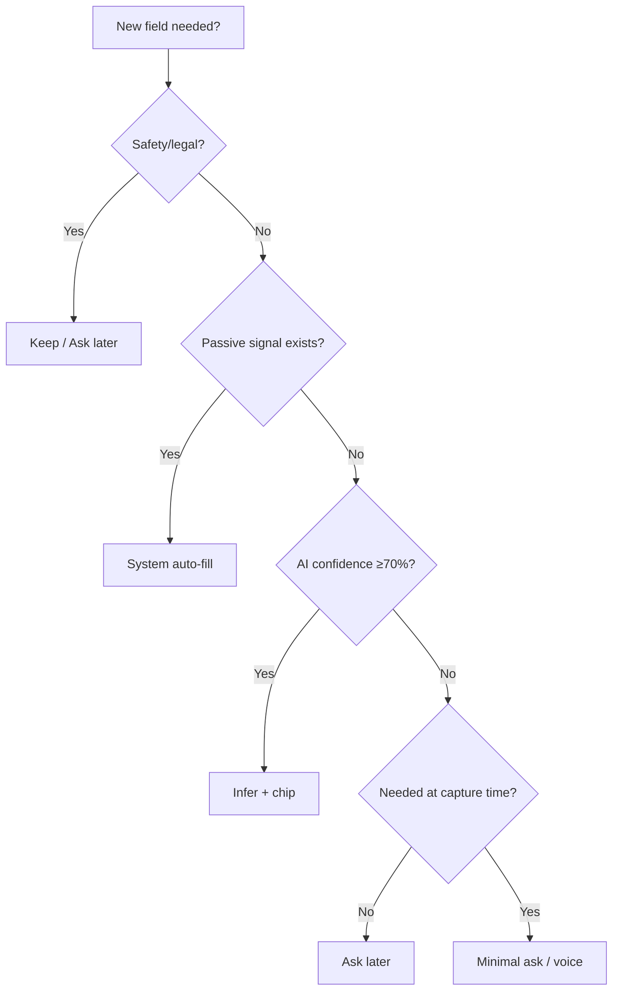

## Related

- [[../product-intelligence/things_aiimin_should_stop_asking]]
- [[06_AI_MODEL]]

---

<a id="product-bible-08_data_graph"></a>

## Source: `docs/AIIMIN_PRODUCT_BIBLE/08_DATA_GRAPH.md`

# 08 — Data Graph

## Entity Relationship Detail

### ER diagram (conceptual)

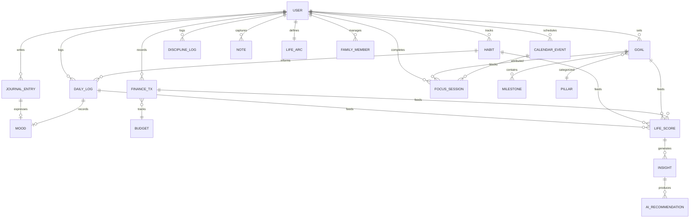

### Relationship table

| From | To | Cardinality | Edge type |
|------|-----|-------------|-----------|
| Goal | Milestone | 1:N | composition |
| Goal | Habit | N:M (pillar) | soft link |
| Goal | Focus Session | 1:N | attribution |
| Habit | Daily Log | N:1 per day | aggregate |
| Journal | Daily Log mood | 1:1 sync target | inference |
| Calendar | Focus | 1:N | temporal |
| Finance Tx | Budget | N:1 category | rollup |
| Command Palette log | Any capture entity | 1:1 | router |
| Life Arc | Goals | 1:N thematic | narrative |
| Family Member | Emergency Card | N:1 | export |

### API groups (vault pointers)

| Entity | Vault / code pointer |
|--------|---------------------|
| Daily Log | `docs/knowledge/03_DATABASE/daily_logs`, `server/routes/dailyLogs.js` |
| Goals | goals API + local cache |
| Habits | habits API |
| Journal | journal_entries encrypted |
| Finance | Supabase money tables |
| Calendar | events + Google sync |

### Derived computation

**Life Score (conceptual):**
```
life_score = w1·habit_consistency 
           + w2·milestone_progress 
           + w3·wellbeing(mood, sleep) 
           + w4·finance_stability
           + reflection_modifier(journal_frequency)
```

### Orphan edges to fix

| Edge | Issue |
|------|-------|
| Mood → 5 parents | Unify to single node |
| Placements resume → Lab ATS | Duplicate file nodes |
| Arc → 3 editors | Multiple writers |

## Full graph doc

[[../product-intelligence/INFORMATION_GRAPH]]

## Related

- [[04_INFORMATION_MODEL]]

---

<a id="product-bible-09_user_journey"></a>

## Source: `docs/AIIMIN_PRODUCT_BIBLE/09_USER_JOURNEY.md`

# 09 — User Journey

## Intent-based journeys

### Journey 1: New user activation

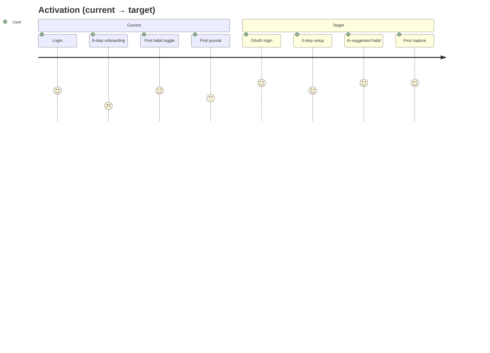

**Target TTV:** Login → first capture < 3 minutes

---

### Journey 2: Daily loop (retained user)

| Step | Current | Target |
|------|---------|--------|
| Open app | Overview widgets | Morning briefing card |
| Log wellbeing | 5-field Daily Log | 1-tap confirm passive card |
| Reflect | Journal + mood picker | Single capture bar |
| Execute | Habit toggles | Same (protect) |
| Close | — | Optional weekly digest notification |

---

### Journey 3: Money awareness

| Step | Current | Target |
|------|---------|--------|
| Spend happens | Remember to open Finance | `⌘K` voice anytime |
| Log | 6-field form | "spent X on Y" → chips |
| Review | Finance tabs + Reports | Weekly spend insight push |

---

### Journey 4: Emotional processing

| Step | Current | Target |
|------|---------|--------|
| Urge/stress | Navigate Discipline or Journal | Universal capture |
| Mode choice | CBT vs free write | AI tags post-save |
| Mood | 1-10 picker | Inferred sentiment |
| Follow-up | Manual | AI suggests replacement habit |

---

### Journey 5: Planning & direction

| Step | Current | Target |
|------|---------|--------|
| Set direction | 7-field goal modal | NL goal sentence |
| Decompose | Manual milestones | AI batch propose |
| Schedule | Calendar modal | Briefing merges blocks |
| Review | Goals + Insights separate | Life Score + narrative |

---

### Journey 6: Career tracking

| Step | Current | Target |
|------|---------|--------|
| Find job | Manual company/role | Paste URL |
| Track | Pipeline drag | Email-parse stage (future) |
| Improve resume | Lab ATS separate upload | Shared resume vault |

---

### Journey 7: Crisis preparedness

| Step | Current | Target |
|------|---------|--------|
| Setup | 65+ field vault wall | Add member minimal |
| Emergency | 20-field card edit | Wizard pre-fill |
| Use | Export | Wallet PDF one tap |

## Journey metrics

| Journey | North star event | Funnel doc |
|---------|------------------|------------|
| Activation | `onboarding_completed` | telemetry §3 |
| Daily loop | `journal_entry_saved` OR `habit_toggle_completed` | telemetry §1–4 |
| Money | `finance_entry_saved` | telemetry finance |
| Emotional | `discipline_log_saved` | — |
| Planning | `goal_created` | telemetry goals |

## Related

- [[../product-intelligence/HUMAN_INTENT_GRAPH]]
- [[12_METRICS]]

---

<a id="product-bible-10_research"></a>

## Source: `docs/AIIMIN_PRODUCT_BIBLE/10_RESEARCH.md`

# 10 — Research

## Summary

AIIMIN's product intelligence is grounded in mixed-initiative HCI, personal informatics, digital phenotyping ethics, cognitive load research, and quantified self signal theory — not UI trend chasing.

## Core research themes

| Domain | Key idea for AIIMIN |
|--------|---------------------|
| Mixed-initiative (Horvitz CHI 1999) | Infer when confident; chip when not |
| Personal informatics stages (Li CHI 2010) | Capture ≠ reflection — separate surfaces |
| Lifelogging (Gemmell MyLifeBits) | Universal capture + selective retrieval |
| Interruptibility (Iqbal CHI 2007) | No coaching during Focus |
| Passive sensing (Apple/Google Health) | sleep, steps as System fields |
| Digital phenotyping (Torous 2021) | No clinical claims; transparency |
| Choice overload (Iyengar 2000) | ≤3 choices per screen |
| Quantified self (Choe CHI 2014) | Kill low-signal metrics |
| Agentic AI (ReAct 2023) | Multi-table writes from one utterance |

## Key citations

1. Horvitz, E. — *Principles of Mixed-Initiative User Interfaces* (CHI 1999)
2. Li, I. et al. — *A Stage-Based Model of Personal Informatics Systems* (CHI 2010)
3. Gemmell, J. et al. — *MyLifeBits* (CACM 2006)
4. Torous, J. et al. — *Digital Phenotyping* (World Psychiatry 2021)
5. Iyengar, S. S. & Lepper, M. R. — *When Choice is Demotivating* (2000)

## Full bibliography

[[../product-intelligence/RESEARCH_FOUNDATIONS]]

## Related

- [[02_PHILOSOPHY]]
- [[06_AI_MODEL]]

---

<a id="product-bible-11_experiments"></a>

## Source: `docs/AIIMIN_PRODUCT_BIBLE/11_EXPERIMENTS.md`

# 11 — Experiments

## Proposed A/B tests (from telemetry taxonomy)

Telemetry is **proposed, not shipped**. These experiments validate compression and AI-first hypotheses.

---

### E-01: Finance NL capture vs form

| Arm | Experience |
|-----|------------|
| A (control) | Current 6-field EntryForm |
| B | `⌘K` / finance bar NL + confirm chips |

**Primary metric:** `finance_entry_saved` completion rate  
**Secondary:** `interaction_time_ms`, `field_count`, 7-day finance DAU  
**Hypothesis:** B increases tx logs/day by 40%+  
**Guardrail:** category correction rate < 30%

---

### E-02: Onboarding 9-step vs 3-step

| Arm | Steps |
|-----|-------|
| A | Current 9 steps + PIN |
| B | OAuth → optional capture → dashboard (PIN deferred) |

**Primary metric:** `onboarding_completed` rate  
**Secondary:** `day_7_return`, `first_journal_saved` time  
**Hypothesis:** B improves completion by 25%  
**Guardrail:** security survey on PIN defer acceptance

---

### E-03: Journal mood infer vs picker

| Arm | Mood UX |
|-----|---------|
| A | Explicit 1–10 picker |
| B | AI infer + correction chip |

**Primary metric:** `journal_entry_saved` rate  
**Secondary:** mood correction rate, `journal_ai_analyze_completed`  
**Hypothesis:** B increases daily journal rate  
**Guardrail:** user trust survey (NPS)

---

### E-04: Morning briefing card

| Arm | Overview |
|-----|----------|
| A | Current widget grid |
| B | AI morning briefing (calendar + habits + goals) |

**Primary metric:** Overview session depth, habit toggle same session  
**Secondary:** `interaction_time_ms` to first action  
**Hypothesis:** B reduces navigation_depth to plan day

---

### E-05: Goals NL create

| Arm | Create flow |
|-----|-------------|
| A | 7-field modal |
| B | Single sentence → AI milestone review card |

**Primary metric:** `goal_created` / `modal_abandoned` ratio  
**Secondary:** milestones completed at 30 days  
**Hypothesis:** B reduces abandonment 40%

---

### E-06: Unified mood primitive

| Arm | Surfaces |
|-----|----------|
| A | 5 independent mood pickers |
| B | Single sync'd mood; other surfaces read-only display |

**Primary metric:** `mood_picker_loop` telemetry (abandon)  
**Secondary:** mood data consistency score  
**Hypothesis:** B eliminates `mood_picker_loop` events

---

### E-07: Command Palette discoverability

| Arm | Onboarding |
|-----|------------|
| A | No palette teaching |
| B | Interactive `⌘K` tour step |

**Primary metric:** `command_palette_opened` DAU %  
**Secondary:** `universal_logger_saved` vs palette ratio

---

### E-08: Kill finance category dropdown

| Arm | Category |
|-----|----------|
| A | Required dropdown |
| B | Inferred chip only |

**Primary metric:** `finance_entry_saved` latency  
**Secondary:** budget accuracy (user corrections)  
**Source:** Kill List #1 ROI item

---

## Experiment prioritization

| ID | Priority | Effort | Impact |
|----|----------|--------|--------|
| E-08 | P0 | Medium | High frequency |
| E-01 | P0 | High | High frequency |
| E-03 | P0 | Medium | Core loop |
| E-02 | P1 | High | Activation |
| E-05 | P1 | Medium | Setup |
| E-06 | P1 | Medium | Cross-cutting |
| E-04 | P2 | High | Engagement |
| E-07 | P2 | Low | Power users |

## Related

- `docs/interaction-telemetry.md`
- [[12_METRICS]]

---

<a id="product-bible-12_metrics"></a>

## Source: `docs/AIIMIN_PRODUCT_BIBLE/12_METRICS.md`

# 12 — Metrics

## North Star

**Weekly Active Capture (WAC):** Users who complete ≥1 meaningful capture (journal, habit toggle, finance tx, discipline log, command palette save) in a 7-day window.

**Why:** AIIMIN value compounds from data; passive readers who do not capture churn.

**Target:** 60% WAC among activated users by launch + 90 days

---

## Supporting metrics

| Metric | Definition | Target |
|--------|------------|--------|
| TTV-1 | Login → Overview | <60s |
| TTV-2 | Activation → first capture | <3 min |
| Median daily interactions | Capture actions per DAU | 15 → 5 |
| Inference opportunity | inferrable_fields / total_fields | >50% |
| Compression score | weighted avg from compression doc | >60% on top 5 flows |
| Journal funnel completion | started → saved | >70% |
| Finance tx completion | started → saved | >85% |
| Onboarding completion | started → done | >75% |
| Day 7 return | activation cohort | >40% |
| Palette DAU % | users opening ⌘K | >15% power users |

---

## Funnels (from telemetry spec)

### 1. Journal Core
```
overview_viewed → journal_navigated → journal_entry_started → first_character_typed → journal_entry_saved → journal_ai_analyze_completed
```

### 2. Activation
```
auth_login_completed → email_verified → onboarding_completed → first_habit_toggle OR first_journal_saved → day_7_return
```

### 3. Command Palette
```
command_palette_opened → search_query_typed → results_filtered → command_palette_action_executed → save_success
```

### 4. AI Usage
```
ai_surface_viewed → ai_input_started → ai_request_sent → ai_response_rendered → ai_action_accepted
```

### 5. Drop-off
```
any_form_started → field_focused → field_abandoned → form_abandoned → route_exit
```

---

## Composite scores (derived)

| Score | Use |
|-------|-----|
| Interaction cost | clicks + fields×2 + confirms×3 |
| Cognitive burden | decision_fatigue + hesitation |
| Automation opportunity | AI-eligible / total interactions |
| Inference opportunity | inferrable fields / total fields |

---

## Behavioral indicators

| Signal | Threshold | Meaning |
|--------|-----------|---------|
| rage_click | ≥3 in 800ms | Broken UI |
| field_hesitation | >8s no input | Bad field |
| mood_picker_loop | ≥3 opens no save | Duplicate mood UX |
| decision_fatigue | ≥5 dropdown changes | Form too heavy |
| onboarding_idle | >60s on step | Drop-off risk |

---

## Dashboard panels (proposed)

1. Auth funnel
2. Onboarding by step
3. Capture DAU (journal, habit, finance)
4. Palette adoption
5. AI latency + acceptance
6. Friction heatmap by route
7. Compression progress (field_count trend)

## Related

- `docs/interaction-telemetry.md`
- [[../product-intelligence/INTERACTION_COMPRESSION_SCORE]]
- [[11_EXPERIMENTS]]

---

<a id="product-bible-13_product_principles"></a>

## Source: `docs/AIIMIN_PRODUCT_BIBLE/13_PRODUCT_PRINCIPLES.md`

# 13 — Product Principles

## Non-negotiable principles

### Product

1. **Capture beats configuration** — If a choice can wait, it waits.
2. **One utterance, many tables** — Command Palette routes; user does not pick destination first.
3. **Infer, then chip** — Never silent wrong data without correction path.
4. **Mobile captures; desktop commands** — No analytics/tools on mobile `/m`.
5. **Life Score is honest** — Composite reflects real pillars; not vanity XP.

### Design

6. **Palette locked** — Dark `#1a1a1a`, cards `#2d2d2d`, accent `#ff6b35`, done `#10b981`.
7. **One mood primitive** — No fifth mood picker.
8. **Destructive actions confirm** — Branded ConfirmDialog; typed confirm for account delete.
9. **Enter to save** — Inline capture flows default to keyboard submit.
10. **Empty states teach** — Show chord shortcuts, not generic "no data."

### AI

11. **No clinical claims** — Coaching language only.
12. **Journal encrypted** — Body never in analytics events.
13. **Confidence-gated automation** — See [[07_AUTOMATION_RULES]].
14. **Interruptibility respected** — No modals during Focus.
15. **User can export and delete** — Data portability is trust.

### Engineering / process

16. **Vault ships with code** — Behavior changes documented before done.
17. **No auth/schema without explicit ask** — Product intelligence does not imply migrations.
18. **No secrets in vault** — Env names only.
19. **Telemetry privacy-first** — Hash PII; never log PIN.
20. **Sparring welcome** — Challenge weak features; kill list is feature.

## Principle conflicts

| Conflict | Resolution |
|----------|------------|
| Speed vs accuracy (finance category) | Chip confirm default |
| Gamification vs sincerity | XP for action; Life Score for truth |
| Power users vs beginners | Palette + defaults coexist |
| Passive sensing vs privacy | Opt-in HealthKit; on-device prefer |

## Related

- [[02_PHILOSOPHY]]
- [[15_THINGS_NEVER_TO_BUILD]]
- `docs/knowledge/08_DESIGN/Palette.md`

---

<a id="product-bible-14_future_ideas"></a>

## Source: `docs/AIIMIN_PRODUCT_BIBLE/14_FUTURE_IDEAS.md`

# 14 — Future Ideas

## Ambient capture & passive inference roadmap

### Near-term (0–6 months)

| Idea | Description | Signals |
|------|-------------|---------|
| **Universal capture router v2** | Single `⌘K` handles 90% of intents | NL classifier |
| **Finance voice line** | "spent 450 groceries" end-to-end | STT + merchant NLP |
| **Mood primitive sync** | One write, five read surfaces | Sentiment model |
| **Morning briefing** | AI day plan card on Overview | Calendar + habits + goals |
| **OAuth-first onboarding** | 3-step activation | Google profile prefill |
| **OS theme sync** | Zero theme pickers | `prefers-color-scheme` |
| **HealthKit sleep/steps** | Passive daily log card | iOS Health / Google Fit |

### Medium-term (6–12 months)

| Idea | Description |
|------|-------------|
| **Receipt OCR** | Photo → finance tx draft |
| **Email parse (Placements)** | Interview invite → stage update |
| **Calendar intent (Lookout-style)** | Email → event suggestion |
| **On-device mood infer** | Journal sentiment local-first |
| **Shared resume vault** | One PDF for Placements + ATS |
| **Weekly digest notification** | Life Score + insights push |
| **Biometric auth** | Replace PIN flows |

### Long-term (12+ months)

| Idea | Description |
|------|-------------|
| **Ambient lifelogging** | Activity inference from phone sensors |
| **Memory reconstruction** | "What was I doing last March?" |
| **Proactive habit nudges** | Context-aware (time, location) with strict consent |
| **Family wallet pass** | Emergency card in Apple Wallet |
| **Multi-modal capture** | Voice + photo + text single pipeline |
| **On-device LLM** | Private inference for journal/finance |

## Compression targets (recap)

| Flow | Current → Future |
|------|------------------|
| Finance tx | 8 → 2 |
| Onboarding | 45+ → 12 |
| Daily log | 7 → 1 |
| Goals create | 9 → 2 |
| Journal | 5 → 2 |

## Technology dependencies

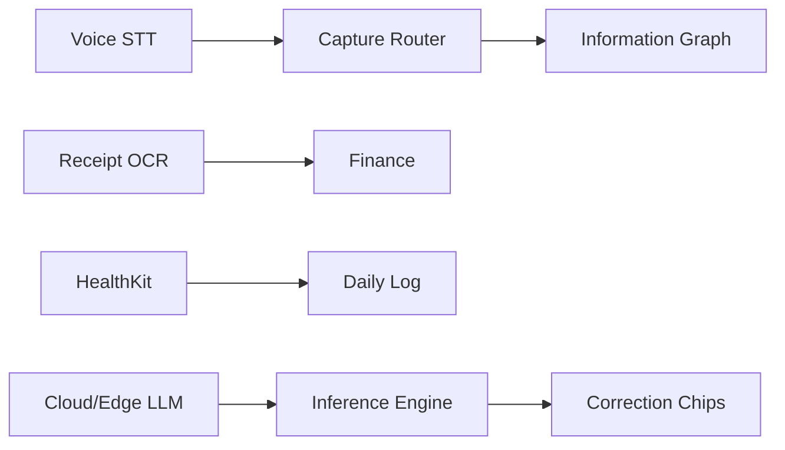

## Related

- [[../product-intelligence/FUTURE_AIMIN_FRAMEWORK]]
- [[../product-intelligence/INTERACTION_COMPRESSION_SCORE]]
- [[01_VISION]]

---

<a id="product-bible-15_things_never_to_build"></a>

## Source: `docs/AIIMIN_PRODUCT_BIBLE/15_THINGS_NEVER_TO_BUILD.md`

# 15 — Things Never to Build

## Anti-patterns and feature traps

These are explicit **do-not-build** items derived from audit friction, kill list, research ethics, and product locks.

---

### Interaction anti-patterns

| Never build | Why |
|-------------|-----|
| **Another mood picker** | 5 exist; unify instead |
| **Another theme picker surface** | 3 exist; OS sync |
| **Another life arc editor** | 3 exist; single source |
| **Journal mode gate before capture** | Kills vent intent; INT-166 |
| **Required title on quick notes** | Notes title → Kill |
| **Priority dropdown on goals** | Kill; infer behavior |
| **6-field finance as only path** | Compression P0 |
| **14-module Lab launcher as only entry** | Choice overload INT-432 |
| **Onboarding step 6 wake time** | Low signal; Kill |
| **Category dropdown when NLP works** | Finance, habits, feedback |

---

### Product traps

| Trap | Why avoid |
|------|-----------|
| **Social feed** | Not a network; dilutes Life OS |
| **Public leaderboards** | Privacy + comparison anxiety |
| **AI therapist persona** | Clinical liability; not our scope |
| **Automatic posting** | User must own every write |
| **Dark patterns on upgrade** | Tier gate exists; don't nag loop |
| **Infinite customization** | Persona presets enough; infer rest |
| **Mobile analytics dashboard** | Violates `/m` capture-only lock |
| **New brand colors** | Palette locked |
| **Feature flags users see** | Dev/admin only |
| **Protein input on mobile** | Explicitly removed per Daily Log rules |

---

### Data / AI traps

| Trap | Why avoid |
|------|-----------|
| **Infer emergency meds/allergies** | Safety — always ask |
| **Journal body in analytics** | Privacy violation |
| **PIN in telemetry** | Security violation |
| **Diagnostic mental health labels** | Digital phenotyping ethics |
| **Auto-create finance tx without utterance** | User must initiate money |
| **Sell or share lifelog data** | Trust destroyer |
| **Schema change for intelligence** | Intelligence adapts to schema; not vice versa without ask |

---

### Engineering traps

| Trap | Why avoid |
|------|-----------|
| **Whole-repo scan as "research"** | Vault Brain OS exists |
| **Fat AGENTS.md** | Vault is brain |
| **Secrets in vault docs** | Security |
| **Ship docs after code** | Violates Brain OS |
| **window.confirm** | 14 remain; migrate to ConfirmDialog |

---

### "Looks productive but isn't"

| Trap | Real need |
|------|-----------|
| More dashboard widgets | Morning briefing one card |
| More journal modes | AI tags post-capture |
| More onboarding questions | Infer from behavior |
| More gamification badges | Coordinate XP + Life Score |
| More filter dropdowns | AI pre-filter Insights |
| Separate mobile app routes | Responsive capture suffices |

---

## When someone proposes X, ask:

1. Is it in the Kill List?
2. Does it duplicate an existing primitive?
3. Does it increase daily interactions?
4. Does mobile stay capture-only?
5. Can AI infer it instead?

If any answer is wrong → don't build.

## Related

- [[../product-intelligence/things_aiimin_should_stop_asking]]
- [[13_PRODUCT_PRINCIPLES]]
- [[03_HUMAN_PROBLEMS]]

---
