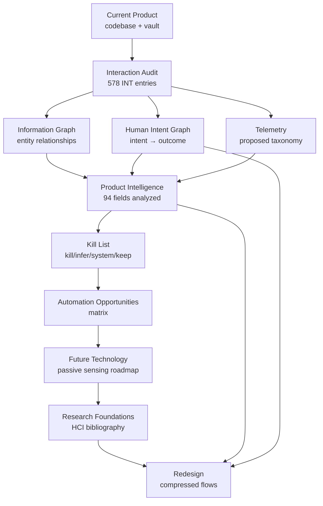

# AIIMIN — Future AIIMIN Framework (Phase 6)

**Status:** Claude input stack + automation roadmap  
**Date:** 2026-07-11

---

## Purpose

This document defines the **Claude input stack** — the ordered layers of product intelligence that inform AI-first redesign decisions, automation priorities, and interaction compression targets.

---

## The Claude Input Stack

### Layer descriptions

| Layer | Artifact | Agent use |
|-------|----------|-----------|
| **Current Product** | `frontend/`, vault feature MOCs | Ground truth for what ships |
| **Interaction Audit** | `docs/interaction-audit/` | Every user action, friction rank |
| **Information Graph** | `INFORMATION_GRAPH.md` | What data connects to what |
| **Human Intent Graph** | `HUMAN_INTENT_GRAPH.md` | Why users come; desired outcomes |
| **Telemetry** | `docs/interaction-telemetry.md` | Events, funnels, composite scores |
| **Product Intelligence** | `PRODUCT_INTELLIGENCE_LAYER.md` | Per-field infer/automation verdict |
| **Kill List** | `things_aiimin_should_stop_asking.md` | Fields/patterns to eliminate |
| **Automation Opportunities** | This doc § matrix | Prioritized engineering bets |
| **Future Technology** | Wearables, STT, OCR, passkeys | Passive signal roadmap |
| **Research** | `RESEARCH_FOUNDATIONS.md` | Academic grounding |
| **Redesign** | Product Bible + compression score | Target UX |

---

## Automation Opportunities Matrix

| Opportunity | Source fields | Signals | AI confidence | Eng effort | Privacy | Priority |
|-------------|---------------|---------|---------------|------------|---------|----------|
| Universal capture router | ai_log, journal body, notes | NL classifier | High | High | Medium | P0 |
| Finance category infer | category, type, note | Merchant NLP, history | 85% | Medium | Low | P0 |
| Mood primitive unification | mood ×5 surfaces | Journal sentiment, voice | 80% | Medium | Medium | P0 |
| Goals NL create | title, pillar, priority, milestones | Sentence parse | 70% | Medium | Low | P1 |
| Onboarding compression | 9 steps → 3 | OAuth, defer PIN | N/A | Medium | Low | P1 |
| Morning briefing | calendar + habits + goals | Aggregation + LLM | 75% | High | Low | P1 |
| Habit NL create | name, category, emoji, color | Semantics | 65% | Low | None | P1 |
| Sleep/wearable import | sleep_hours, steps | HealthKit API | 85% | Medium | Medium | P2 |
| Calendar NL quick-add | title, start, end, allDay | Time NLP | 70% | Medium | Low | P2 |
| Placements URL scrape | company, role, JD | HTTP fetch | 60% | Medium | Low | P2 |
| Theme OS sync | theme | `prefers-color-scheme` | 90% | Low | None | P2 |
| Nav pin auto | pinnedNav[] | Route telemetry | 65% | Medium | None | P3 |
| Discipline context log | trigger, replacement | Time, calendar, mood | 55% | Medium | High | P3 |
| Family doc OCR label | document.label | Filename, OCR | 70% | Low | Medium | P3 |

---

## Interaction Compression Targets

| Metric | Current (audit) | Target (AI-first) | Method |
|--------|----------------|-------------------|--------|
| Onboarding steps | 9 | 3 | OAuth, defer PIN, infer goals/habits |
| Finance tx interactions | 8 | 2 | NL + confirm chips |
| Goal create interactions | 7+ | 2 | NL + milestone review |
| Journal capture | 4–7 | 1–2 | Default capture; infer mood/mode |
| Daily log save | 5+ fields | 1 tap confirm | Passive + card |
| Mood capture surfaces | 5 | 1 | Unified primitive |
| Family emergency setup | 20+ fields | 5 (wizard) | Progressive disclosure |
| Habit create modal fields | 5 | 1 (NL) | Semantic create |
| Command palette to save | 3 | 2 | Already best-in-class; extend routing |

**North star compression:** Reduce median daily capture interactions from ~15 to ~5 without losing data fidelity.

---

## Decision Framework for Agents

When proposing a UI change, run this checklist:

1. **Intent check** — Which human intent from `HUMAN_INTENT_GRAPH` does this serve?
2. **Graph check** — Which entities in `INFORMATION_GRAPH` are affected?
3. **Field check** — Does `PRODUCT_INTELLIGENCE_LAYER` mark field Kill/Infer?
4. **Friction check** — Is interaction in friction top 100?
5. **Telemetry check** — Which funnel event proves success?
6. **Privacy check** — Does passive signal require new consent?
7. **Mobile check** — Does `/m` stay capture-only?

---

## Future Technology Roadmap

| Technology | Enables | Timeline |
|------------|---------|----------|
| On-device STT | Voice capture without server round-trip | Near |
| HealthKit / Google Fit | sleep, steps passive | Near |
| Passkeys / WebAuthn | Kill PIN/password friction | Near |
| Receipt OCR | Finance amount + category | Medium |
| Email parse (Placements) | Stage auto-update | Medium |
| Calendar intent (Lookout-style) | Proactive scheduling | Medium |
| Ambient lifelogging | Activity inference | Long |
| On-device LLM | Privacy-preserving infer | Long |

---

## Redesign Principles (from stack synthesis)

1. **Capture first, structure later** — User provides raw intent; AI structures.
2. **One mood, one arc, one theme** — Eliminate duplicate primitives.
3. **Confirm chips over forms** — Replace dropdowns with correctable inferences.
4. **Progressive disclosure for rare/high-stakes** — Family emergency, not daily log.
5. **Command Palette as universal router** — Every intent has a text/voice path.
6. **Read surfaces stay read** — Insights/Reports compress input elsewhere.

---

## Related Documents

- [[RESEARCH_FOUNDATIONS]] — academic grounding
- [[INTERACTION_COMPRESSION_SCORE]] — per-feature metrics
- [[../AIIMIN_PRODUCT_BIBLE/06_AI_MODEL]] — AI behavior contract
- `docs/interaction-telemetry.md` — event taxonomy
