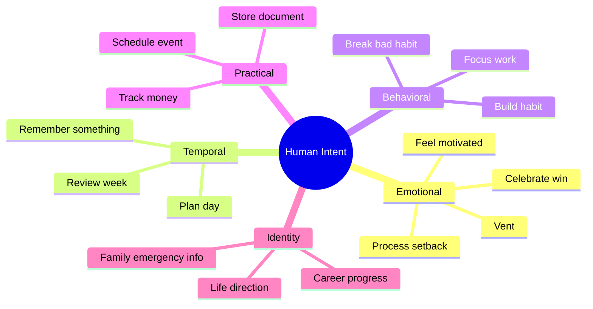
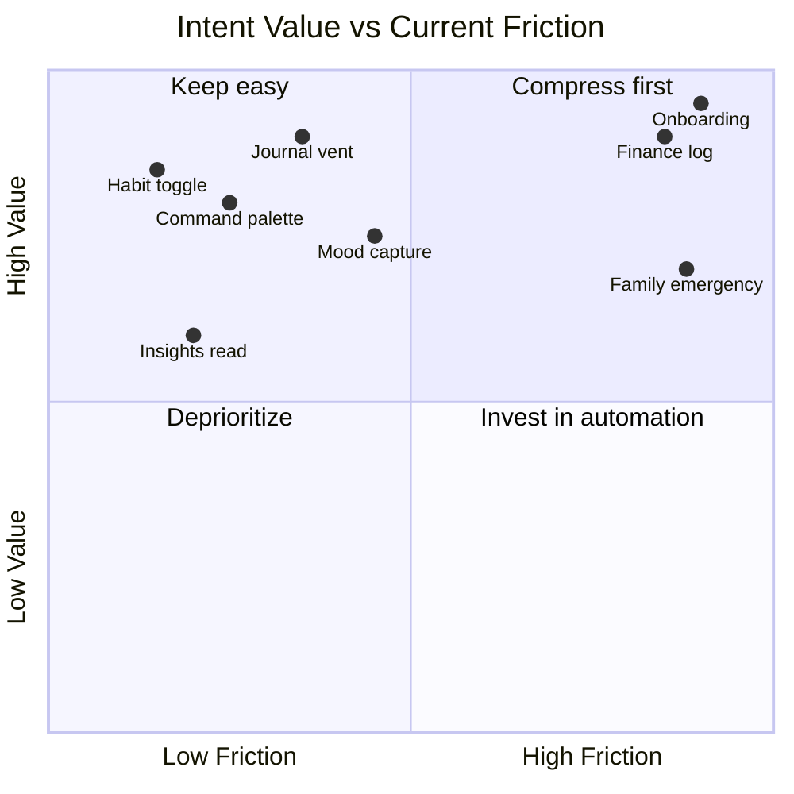

# AIIMIN — Human Intent Graph (Phase 4)

**Status:** Intent-to-product mapping  
**Date:** 2026-07-11  
**Source:** Interaction audit friction analysis + product surfaces

---

## Purpose

Users do not open AIIMIN to "fill forms." They arrive with **intents** — emotional, practical, or temporal. This document maps human intents to current features, friction costs, and future compressed interactions.

---

## Intent Taxonomy Overview



---

## Master Intent Table

| Intent | Desired Outcome | Current AIIMIN Feature | Current Friction | Future Interaction |
|--------|-----------------|------------------------|------------------|-------------------|
| Vent / process emotions | Feel heard, gain clarity | Journal capture, Discipline log | Mode choice (CBT/WWW); mood picker duplicate | Single capture bar; AI infers mood + mode post-save |
| Celebrate a win | Record achievement, boost morale | Command Palette Log Win, Daily Log wins, Journal | 3 separate entry points | `⌘K` → "won..." auto-routes; XP toast unified |
| Remember something | Retrieve later without losing it | Notes, Journal, Command Palette note | Title required on notes; no unified search memory | Ambient capture → AI tags + links to goals/calendar |
| Plan my day | Know what to do when | Overview, Calendar, Goals, Habits | 4 surfaces; no single day plan | Morning briefing card: AI merges calendar + habits + goals |
| Track money | Know spend vs budget | Finance EntryForm (6 fields) | Highest daily finance friction | "spent 450 groceries" → confirm category chip |
| Feel motivated | Emotional uplift, direction | Identity arc, Insights, Gamification XP | Arc edited in 3 places; insights read-only | AI coaching from streak + arc; proactive Monday insight |
| Break bad habit | Resist urge, log trigger | Discipline TriggerModal | Emotional recall under stress; 3 fields | Voice "urge after meeting" → AI suggests replacement |
| Build habit | Consistency, streak | Habits toggle + create modal (5 fields) | Create modal heavy; toggle light | NL habit create; onboarding seeds from goals only |
| Focus on work | Deep work session | Focus/Pomodoro, Calendar block | Post-session reflection optional burden | Auto-link goal; skip reflection unless extended session |
| Family emergency info | Quick access for crisis | Family Vault emergency card | 20+ fields; rare edit; high anxiety | Progressive wizard; pre-fill from members; wallet export |
| Career progress | Track applications, improve resume | Placements pipeline, Lab ATS | CRM-style 7-field intake | Paste job URL → auto-fill; email parse stage updates |
| Review how I'm doing | Holistic self-assessment | Insights, Reports, Life Score teaser | Separate pages; period select | Unified weekly digest notification |
| Capture mood quickly | Emotional check-in | Mood on 5 surfaces | Re-learn same 1–10 scale | One mood primitive; swipe on Overview |
| Log daily health | Snapshot of wellbeing | DailyLogForm multi-metric | 55 composite friction (INT-099) | Passive wearable + 1-tap confirm card |
| Set life direction | Long-term purpose | Onboarding lifeArc, Goals, Identity | Blank page syndrome (INT-014) | AI drafts arc from 2 weeks captures |
| Get unstuck | Decision support | Lab Decision Matrix, Command Palette AI | 14-module choice overload | AI routes to right tool from single question |
| Store important document | Safe retrieval | Family document upload | File + label + category | Upload only; OCR label |
| Schedule meeting/event | Time commitment | Calendar EventModal (6 fields) | Date/time cognitive load | Quick-add NL: "dentist Friday 3pm" |
| Learn / practice | Skill building | Lab modules (DSA, typing, flashcards) | Module launcher 14 choices | Command Palette routes: "practice DSA" |
| Upgrade / unlock feature | Access gated tools | TierRouteGuard modals | Same blocked feeling 8 routes | Single upgrade surface with feature context |

---

## Before / After Flows

### Intent: Vent after a hard day

**Current (7+ interactions):**
```
Navigate Journal → Choose mode? → Select mood 1-10 → Type body → Send → Optional AI analyze
```
Friction: mode decision (INT-166), mood duplicate (INT-059 overlap), 3.8 avg screen friction.

**Future (2 interactions):**
```
⌘K or Journal bar → Speak/type freely → AI saves with inferred mood + tags; chip to correct
```

---

### Intent: Plan my day

**Current (12+ interactions):**
```
Open Overview → Scan widgets → Open Calendar → Check habits → Open Goals → Mental merge
```
Friction: context switching across 4 routes; no synthesized plan.

**Future (1 interaction):**
```
Open app → Morning briefing card (AI-generated) → Tap to accept/adjust blocks
```

---

### Intent: Track money

**Current (8 interactions per transaction):**
```
Finance → Select tab → EntryForm → amount → type → category → account → date → note → Add
```
Friction: INT-285 composite 80; 6 required fields.

**Future (2 interactions):**
```
⌘K "spent 1200 on rent" → Confirm category + account chips → Done
```

---

### Intent: Break bad habit (urge moment)

**Current (6 interactions):**
```
Navigate Discipline → Open trigger modal → Type trigger → Slider intensity → Pick replacement → Log
```
Friction: INT-537 composite 55; high emotional cost.

**Future (2 interactions):**
```
Voice/button "urge" → AI logs context + suggests replacement habit → Tap confirm
```

---

### Intent: Family emergency

**Current (25+ interactions):**
```
Family → Emergency tab → Edit 20 fields → Save
```
Friction: INT-024 composite 90; rare but critical.

**Future (3 interactions):**
```
First add member (minimal) → Emergency wizard pre-fills → Export to wallet PDF
```

---

### Intent: Career progress

**Current (10+ interactions):**
```
Placements → New application modal → 7 fields → Pipeline drag → Separate ATS upload
```
Friction: INT-493 composite 75.

**Future (3 interactions):**
```
Paste job URL → Review auto-filled card → Pipeline auto-stage from email (future)
```

---

## Intent Clusters → Feature Priority



**Compress first quadrant:** Finance log, Onboarding, Family emergency, Mood capture consolidation.

---

## Intent → Command Palette Routing (Future)

| User says (examples) | Route target | Fields eliminated |
|---------------------|--------------|-------------------|
| "feeling anxious about interview" | Journal + mood infer + Placements link | mood, mode |
| "spent 500 on food" | Finance tx | type, category, date, account |
| "won finished spec" | Win log + XP | separate win form |
| "remind me call mom Sunday" | Calendar + Family link | title, date parse |
| "didn't smoke today" | Discipline + reset_counter | trigger form |
| "focus 25 min on goals" | Focus timer + goal link | goalId picker |

---

## Related Documents

- [[things_aiimin_should_stop_asking]] — field kill verdicts
- [[INTERACTION_COMPRESSION_SCORE]] — quantified compression
- [[../AIIMIN_PRODUCT_BIBLE/09_USER_JOURNEY]] — journey maps
- `docs/interaction-audit/friction.md` — friction heatmap
