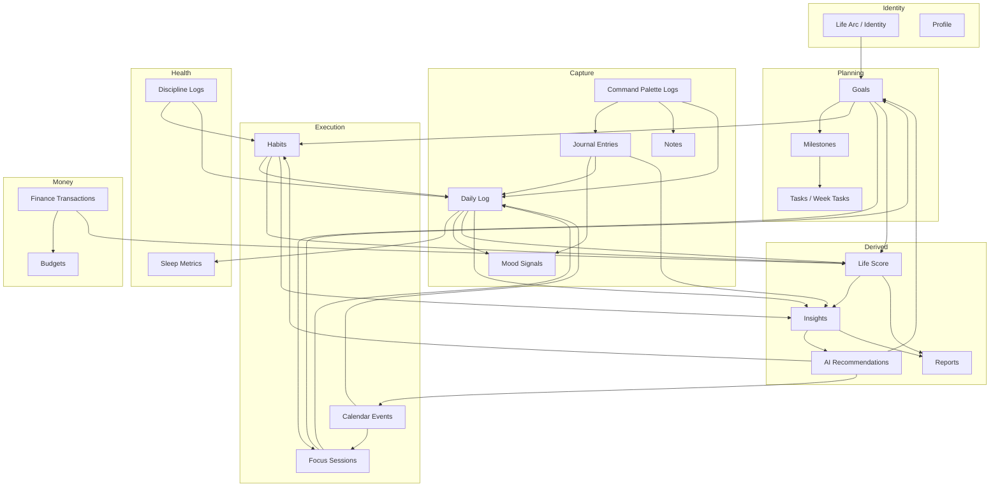
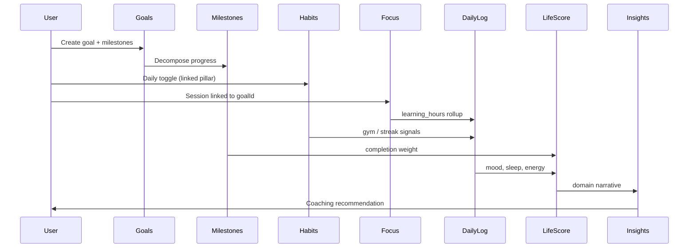
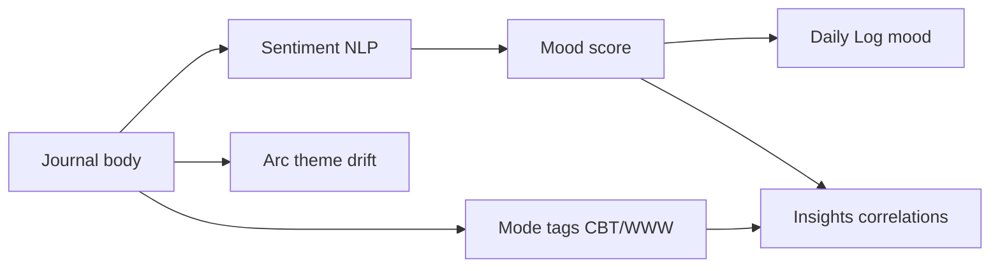
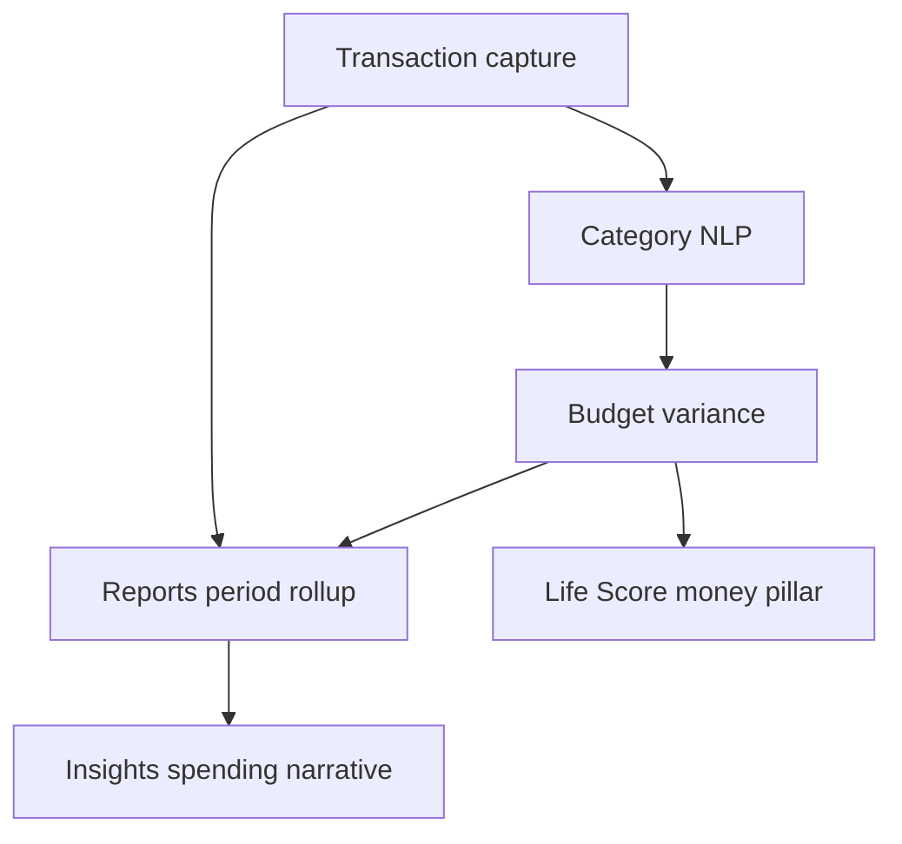
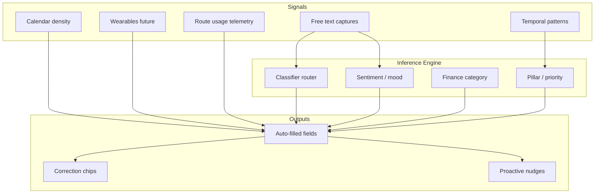

# AIIMIN — Information Graph (Phase 3)

**Status:** Data-centric relationship model  
**Date:** 2026-07-11  
**Scope:** Conceptual entity graph — not UI navigation

---

## Purpose

This document maps how AIIMIN's life data entities relate, what feeds what, and which product surfaces consume derived intelligence. The graph is **data-first**: nodes are persistent or derived records; edges are creates, updates, aggregates, or AI inferences.

---

## Master Entity Graph

---

## Entity Definitions

| Entity | Primary storage | Created by | Updated by |
|--------|-----------------|------------|------------|
| **Life Arc** | Profile / identity | Onboarding, Identity page | User edit, AI draft refresh |
| **Goals** | `goals` table + local cache | Goals modal, onboarding seeds | Milestone completion, status AI |
| **Milestones** | Embedded in goals | Goal create, AI propose | Toggle complete |
| **Tasks** | Week tasks local + calendar | Calendar, quick-add, AI | Complete toggle |
| **Habits** | `habits` table | Onboarding seeds, create modal | Daily toggle |
| **Calendar Events** | `events` + Google sync | EventModal, quick-add, Google pull | Edit, recurrence engine |
| **Journal Entries** | `journal_entries` (encrypted body) | Journal capture, Command Palette | Mood amend, AI analyze |
| **Daily Log** | `daily_logs` | Overview form, mobile capture, inferred | End-of-day sync |
| **Mood** | Journal + daily_log + discipline | 5 duplicate UI surfaces | Should unify to single primitive |
| **Focus Sessions** | Focus/Pomodoro store | Timer complete | Reflection optional |
| **Finance Transactions** | Supabase money tables | EntryForm, voice capture | Edit, delete |
| **Discipline Logs** | Discipline store | Trigger modal | Pattern aggregation |
| **Notes** | localStorage + API | Notes inline, Command Palette | Edit, delete |
| **Life Score** | Derived composite (marketing teaser + future) | Nightly batch / on-save | Recompute on habit/journal/finance |
| **Insights** | AI-generated copy + filters | Scheduled + on-demand | Domain filter |
| **Reports** | Period aggregations | User period select | Export |
| **AI Recommendations** | Ephemeral + notification | Insights, Command Palette, Monday widget | User accept/dismiss |

---

## Data Flow: Goal → Life Score

**Feeds Life Score today (conceptual weights):**
- Habits completion rate → consistency pillar
- Goals milestone progress → direction pillar
- Daily log mood/sleep → wellbeing pillar
- Finance net flow → stability pillar
- Journal frequency → reflection depth modifier

---

## Data Flow: Journal → Mood → Insights

**Friction note:** Mood is captured independently on Journal, Daily Log, Command Palette, MoodTracker, and Discipline — five surfaces writing related signals. Consolidation target: single `mood_primitive` synced everywhere.

---

## Data Flow: Calendar ↔ Habits ↔ Focus

| Source | Target | Relationship |
|--------|--------|--------------|
| Calendar recurring "gym" | Habit gym toggle | Infer completion (future) |
| Habit scheduled time | Calendar block suggestion | AI proposes block |
| Focus session | Calendar "focus" event | Optional back-write |
| Calendar meeting density | Focus abandon risk | Insights warning |
| Wake time (onboarding) | Calendar morning briefing | Notification scheduling |

---

## Data Flow: Finance → Reports → Life Score

---

## API / Table Connections (Conceptual)

| Entity | Table / API group | Downstream readers |
|--------|-------------------|-------------------|
| Goals | `goals`, goals API | Focus, Insights, Reports, Life Score |
| Habits | `habits`, habits API | Overview, Gamification, Daily Log |
| Journal | `journal_entries`, journal API | Insights AI analyze, Daily Log mood |
| Daily Log | `daily_logs`, daily-logs API | Overview, Insights, Reports, Life Score |
| Finance | money tables, finance routes | Reports, Insights, budgets |
| Calendar | `events`, calendar + Google sync | Overview today, Focus |
| Family | members, documents, emergency | Emergency export only (not Life Score) |
| Placements | applications pipeline | Career Insights (future) |
| Discipline | discipline logs | Insights patterns, replacement habits |
| Command Palette | multi-table router | Journal, notes, wins, tasks, finance |

---

## AI Inference Layer (Overlay)

---

## Orphan / High-Friction Nodes

| Node | Issue | Resolution |
|------|-------|------------|
| Mood (5 surfaces) | Duplicate writes, inconsistent scale | Unify mood primitive |
| Life Arc (3 editors) | Same content in Onboarding, Identity, Profile | Single source of truth |
| Theme (3 pickers) | Login, Settings, Account | OS sync once |
| PIN (3 flows) | 4-digit vs 6-digit confusion | Biometric + unified PIN |
| Placements vs Lab ATS | Resume upload duplicated | Shared resume vault |

---

## Related Documents

- [[PRODUCT_INTELLIGENCE_LAYER]] — per-field analysis
- [[HUMAN_INTENT_GRAPH]] — intent → feature mapping
- [[../AIIMIN_PRODUCT_BIBLE/08_DATA_GRAPH]] — Product Bible summary
- `docs/interaction-audit/interaction_graph.md` — UI component graph
