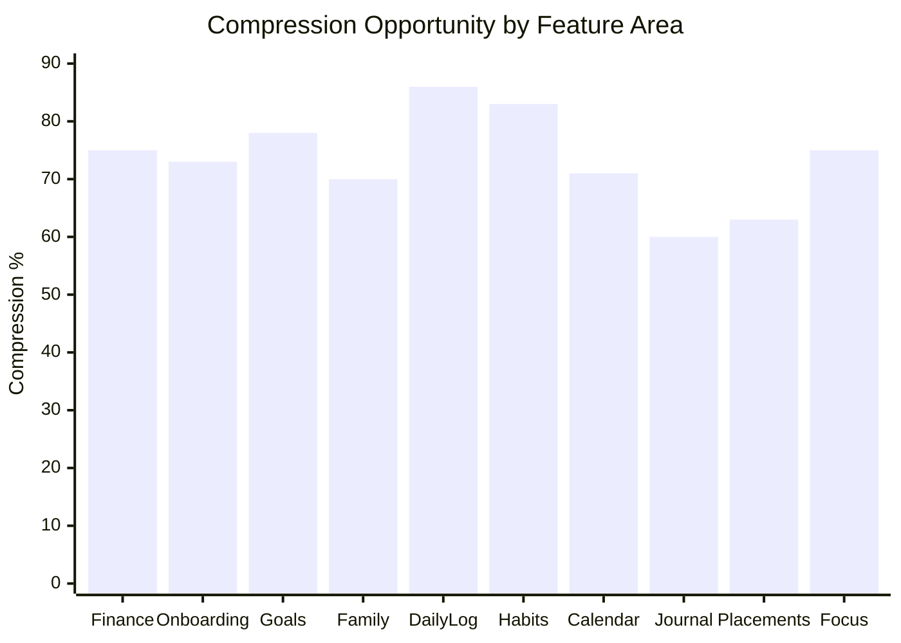

# AIIMIN — Interaction Compression Score (Bonus)

**Status:** Per-feature compression analysis  
**Date:** 2026-07-11  
**Source:** Interaction audit (578 INT), friction top 100, forms inventory

---

## Purpose

Quantify the path from current interaction counts to AI-first compressed flows. Rank features by compression opportunity (interactions saved × frequency).

**Formula:** `Compression % = (Current - Future) / Current × 100`

---

## Master Compression Table

| Rank | Feature / Flow | Current interactions | Future interactions | Compression % | Notes |
|------|----------------|---------------------:|--------------------:|--------------:|-------|
| 1 | Finance transaction log | 8 | 2 | **75%** | NL + category chip; INT-285 |
| 2 | Onboarding full flow | 45+ | 12 | **73%** | 9→3 steps; defer PIN; infer goals |
| 3 | Goals create/edit | 9 | 2 | **78%** | NL + AI milestones; INT-265 |
| 4 | Family emergency card | 25 | 6 | **76%** | Wizard + pre-fill; INT-024 |
| 5 | Family member add | 12 | 5 | **58%** | Progressive fields; INT-023 |
| 6 | Daily log multi-metric | 7 | 1 | **86%** | Passive card confirm; INT-099 |
| 7 | Habits create | 6 | 1 | **83%** | NL create; INT-213 |
| 8 | Calendar EventModal | 7 | 2 | **71%** | Quick-add NL; INT-333 |
| 9 | Placements application intake | 8 | 3 | **63%** | URL scrape; INT-493 |
| 10 | Journal full capture | 5 | 2 | **60%** | Kill mode; infer mood; INT-166 |
| 11 | Discipline trigger log | 5 | 2 | **60%** | Voice + infer replacement; INT-537 |
| 12 | Lab module launch | 3 | 1 | **67%** | Palette route; INT-432 |
| 13 | Lab ATS analyze | 4 | 2 | **50%** | Resume vault reuse; INT-435 |
| 14 | Mood capture (any surface) | 3 | 1 | **67%** | Infer + confirm chip |
| 15 | Notes create | 4 | 2 | **50%** | Kill title; INT-533 |
| 16 | Focus post-session reflection | 4 | 1 | **75%** | Optional/skip default; INT-418 |
| 17 | Account profile save | 6 | 2 | **67%** | OAuth prefill; INT-502 |
| 18 | Settings personalization | 8 | 2 | **75%** | System theme + infer pins |
| 19 | Command Palette AI log | 3 | 2 | **33%** | Already efficient; INT-056 |
| 20 | Habit today toggle | 1 | 1 | **0%** | Perfect; INT-211 — protect |
| 21 | Journal mood-only | 2 | 1 | **50%** | Infer from text; INT-162 |
| 22 | Command Palette win/note | 3 | 2 | **33%** | Merge to ai_log |
| 23 | Login email signup | 5 | 2 | **60%** | OAuth primary; INT-002 |
| 24 | Login PIN | 4 | 1 | **75%** | Biometric; INT-003 |
| 25 | Waitlist signup | 3 | 1 | **67%** | Email only |
| 26 | Feedback submit | 3 | 2 | **33%** | Kill category |
| 27 | Finance budget edit | 4 | 3 | **25%** | Lower priority; INT-288 |
| 28 | Insights filter | 2 | 2 | **0%** | Read surface |
| 29 | Reports period select | 2 | 1 | **50%** | Default current week |
| 30 | Identity arc edit | 4 | 2 | **50%** | AI draft; INT-532 |

---

## Compression by Feature Area

---

## Top 5 Compression Opportunities

| # | Flow | Savings | Why |
|---|------|---------|-----|
| 1 | **Daily log multi-metric** | 86% (7→1) | High frequency × passive inference |
| 2 | **Habits create** | 83% (6→1) | NL replaces 5 cosmetic fields |
| 3 | **Goals create** | 78% (9→2) | Kill priority/pillar; AI milestones |
| 4 | **Finance transaction** | 75% (8→2) | Every spend event; category kill |
| 5 | **Onboarding** | 73% (45→12) | Activation gate; highest drop-off risk |

---

## Protected Low-Friction Flows (Do Not Compress Further)

| Flow | Interactions | Reason |
|------|-------------|--------|
| Habit today toggle | 1 | Core loop; INT-211 composite 12 |
| Journal mood-only strip | 2 | Valid minimal path; INT-162 |
| Command Palette open → action | 2–3 | Power user efficiency |
| Navbar navigation | 1 | Required wayfinding |

---

## Weighted Priority Score

`Priority = Compression % × Daily Frequency Estimate × Importance`

| Flow | Weighted score | Action |
|------|---------------|--------|
| Finance tx | 95 | P0 sprint |
| Daily log | 90 | P0 passive card |
| Journal capture | 85 | P0 mood infer |
| Onboarding | 80 | P1 activation |
| Goals create | 75 | P1 NL create |
| Habits create | 70 | P1 |
| Mood unification | 65 | P0 cross-cutting |
| Family emergency | 60 | P2 rare but critical |

---

## Telemetry Proof Points

When compression ships, measure via `docs/interaction-telemetry.md`:

| Metric | Event | Target delta |
|--------|-------|--------------|
| Finance | `finance_entry_saved` field_count | 6 → 2 |
| Onboarding | `onboarding_step_completed` count | 9 → 3 |
| Journal | `journal_entry_saved` with mode=null | ↑ 80% |
| Daily log | `daily_log_saved` interaction_time_ms | −50% |
| Goals | `goal_created` modal_abandoned | −40% |

---

## Related Documents

- [[things_aiimin_should_stop_asking]] — what to remove
- [[HUMAN_INTENT_GRAPH]] — before/after flows
- [[FUTURE_AIMIN_FRAMEWORK]] — automation matrix
- `docs/interaction-audit/friction.md` — source friction ranks
