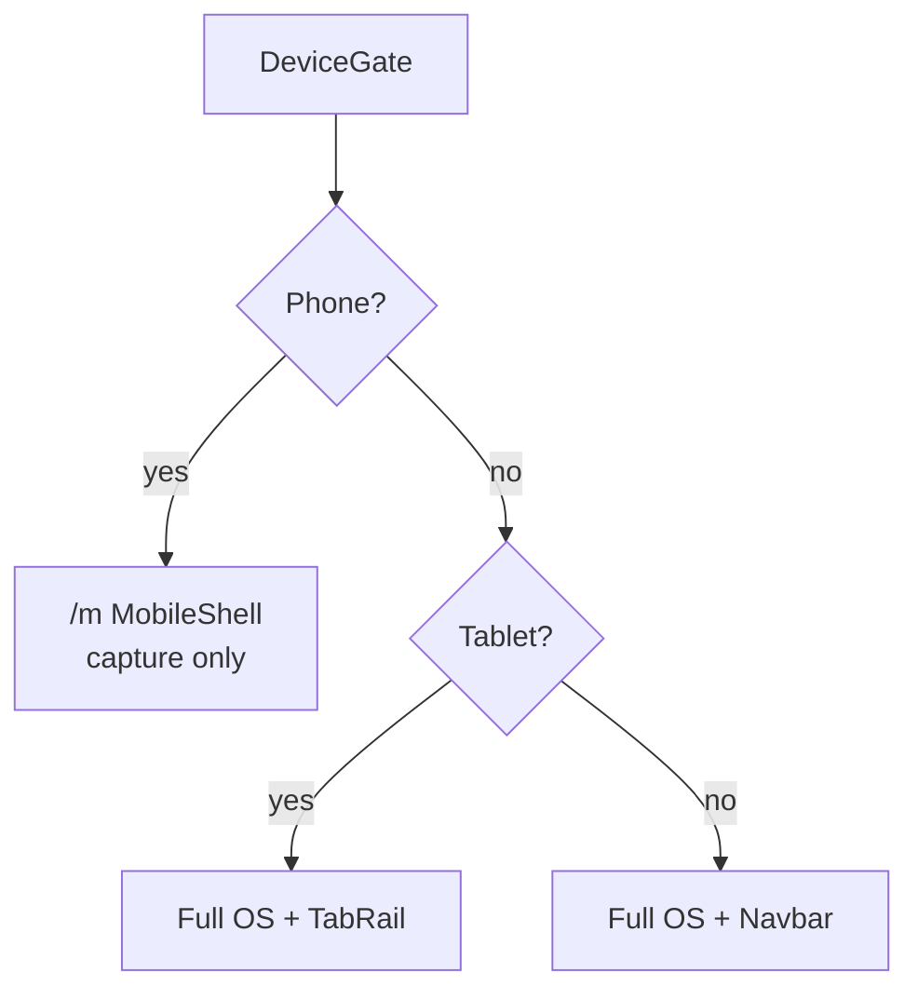

# AIIMIN Web Frontend

React 19 SPA for the **full Life OS** — desktop, iPad, and phone browser (with `/m` capture tier).

> **Not the native Android app.** Kotlin client lives in `../native-android/`.  
> **Capacitor** (`android/`) is a separate WebView shell — do not confuse with native V2.

---

## Stack

| Piece | Tech |
|-------|------|
| UI | React 19, React Router 6 |
| Styling | Tailwind + CSS variables (`index.css`) |
| Data | React Query hooks (`useDailyLogsQuery`, `useCorrelationsQuery`, …) |
| Charts | Recharts |
| Auth | Better Auth client → `api.aiimin.in` |
| Build | CRACO (`craco.config.js`) |

---

## Device tiers



| Tier | Width / UA | Experience |
|------|------------|----------|
| Phone | &lt;768px or mobile UA | `/m` — Today, Score, Account |
| Tablet | 768–1099px or iPad | Full OS, touch masthead |
| Desktop | ≥1100px | Full OS, wide layouts |

Override: `?forceDesktop=1`

---

## Key directories

```
src/
├── pages/           # Route-level views (Overview, Finance, Journal, …)
├── components/      # Shared UI (not mobile/ for web-only work)
├── components/mobile/   # ⚠ /m + Capacitor only
├── hooks/           # React Query + domain hooks
├── api/             # Thin fetch wrappers per domain
├── context/         # Auth, theme
└── styles/          # Global + feature CSS
```

---

## Scripts

```bash
npm start          # dev server :3000
npm run build      # production bundle → build/
npm test           # Jest (if configured)

# Capacitor (separate release train)
npm run cap:build:android
npm run cap:dev:phone    # LAN dev WebView
```

---

## Environment

Set in `frontend/.env.local` (never commit):

- `REACT_APP_API_URL` — API base (prod: `https://api.aiimin.in`)
- Supabase public keys if used client-side
- Feature flags (`REACT_APP_WAITLIST_MODE`, etc.)

---

## Palette (locked)

| Token | Value |
|-------|-------|
| `--color-base` dark | `#1a1a1a` |
| `--color-surface` dark | `#2d2d2d` |
| `--color-accent` | `#ff6b35` |
| `--color-done` | `#10b981` |

See `docs/knowledge/08_DESIGN/Palette.md`.

---

## Related docs

- Monorepo boundaries: `../docs/knowledge/02_ARCHITECTURE/Monorepo.md`
- Mobile `/m` shell: `src/components/mobile/README.md`
- Capacitor: `../docs/knowledge/09_FEATURES/Mobile/Capacitor-Android.md`
