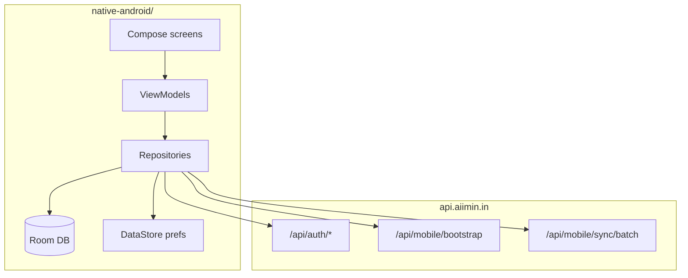

# AIIMIN Native Android (V2)

**Production native companion** — Kotlin, Jetpack Compose, offline-first sync.

| Field | Value |
|-------|-------|
| Package | `in.aiimin.app` |
| Version | see `app/build.gradle` |
| API | `https://api.aiimin.in/api` |
| Auth | Better Auth (OS-ID + PIN, same user as web) |

> This is **not** Capacitor. Capacitor lives in `../frontend/android/` and loads the web `/m` shell.

---

## Architecture



**Tabs:** Home · Journal · Notes · Vault · More

---

## Requirements

- JDK **17** (`brew install openjdk@17`)
- Android SDK API **35**
- Device or emulator API **26+**

Copy `local.properties.example` → `local.properties` and set `sdk.dir` + `org.gradle.java.home` (Mac). **Do not commit** `local.properties`.

---

## Build & install

```bash
cd native-android
export JAVA_HOME="$(/usr/libexec/java_home -v 17)"

./gradlew :app:assembleDebug
adb install -r app/build/outputs/apk/debug/app-debug.apk
```

| Output | Path |
|--------|------|
| Debug APK | `app/build/outputs/apk/debug/app-debug.apk` |
| Release APK | `app/build/outputs/apk/release/app-release.apk` |

---

## Signed release

```bash
export ANDROID_KEYSTORE_PATH=/path/to/keystore
export ANDROID_KEYSTORE_PASSWORD=...
export ANDROID_KEY_ALIAS=aiimin
export ANDROID_KEY_PASSWORD=...
./gradlew :app:assembleRelease
```

CI: GitHub Actions workflow **Native Android** (see vault WORKFLOW-PLAN).

---

## Local API override

```bash
./gradlew :app:assembleDebug -Paiimin.apiBaseUrl=http://10.0.2.2:3001/api
```

Emulator `10.0.2.2` = host `localhost`.

---

## Module layout

```
native-android/
├── app/src/main/java/in/aiimin/app/
│   ├── ui/          # Compose screens
│   ├── data/        # Room, network, repositories
│   └── MainActivity.kt
├── gradle/
└── build.gradle.kts
```

---

## Vault docs

| Doc | Purpose |
|-----|---------|
| [WORKFLOW-PLAN](../docs/knowledge/17_NATIVE_APP_V2/WORKFLOW-PLAN.md) | Live build tracker |
| [00_INDEX](../docs/knowledge/17_NATIVE_APP_V2/00_INDEX.md) | Design pack index |
| [12_SYNC](../docs/knowledge/17_NATIVE_APP_V2/12_SYNC.md) | Sync protocol |

---

## Commit boundary

Changes here **never** ship in the same commit as `frontend/` web refactors. See [CONTRIBUTING.md](../CONTRIBUTING.md).
